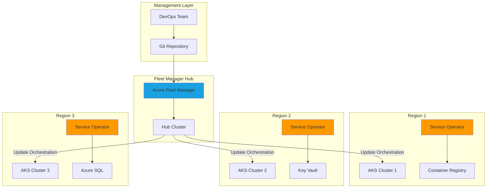

# Multi-Cluster Kubernetes Fleet Management with GitOps

## Problem

Organizations running multiple Kubernetes clusters across different regions face significant challenges in maintaining consistency, coordinating upgrades, and managing Azure resources declaratively. Traditional approaches require separate management interfaces for each cluster, manual coordination of updates that risk service disruption, and disconnected workflows between Kubernetes deployments and Azure resource provisioning, leading to configuration drift and increased operational overhead.

## Solution

Azure Kubernetes Fleet Manager provides centralized orchestration for multiple AKS clusters, enabling coordinated upgrades and unified management across regions. Combined with Azure Service Operator, teams can provision Azure resources directly through Kubernetes manifests, creating a true GitOps workflow where both application deployments and Azure infrastructure are managed declaratively from within Kubernetes.

## Architecture Diagram



## Prerequisites

1. Azure subscription with Owner or Contributor permissions
2. Azure CLI v2.70.0 or later installed and configured (or use Azure Cloud Shell)
3. kubectl v1.28+ installed for Kubernetes cluster management
4. Helm v3.12+ installed for deploying Azure Service Operator
5. Basic understanding of Kubernetes concepts and Azure services
6. Estimated cost: ~$400-600/month for 3 small AKS clusters and associated resources

> **Note**: Azure Kubernetes Fleet Manager requires Azure CLI extension v1.5.2 or later. The extension will be installed automatically during the preparation steps.

## Preparation

```bash
# Set environment variables for Azure resources
export RESOURCE_GROUP="rg-fleet-demo-${RANDOM_SUFFIX}"
export LOCATION="eastus"
export FLEET_NAME="multicluster-fleet"
export SUBSCRIPTION_ID=$(az account show --query id -o tsv)

# Generate unique suffix for resource names
RANDOM_SUFFIX=$(openssl rand -hex 3)
export ACR_NAME="acrfleet${RANDOM_SUFFIX}"
export KV_NAME="kv-fleet-${RANDOM_SUFFIX}"

# Install Fleet CLI extension
az extension add --name fleet
az extension update --name fleet

# Create resource group
az group create \
    --name ${RESOURCE_GROUP} \
    --location ${LOCATION} \
    --tags purpose=fleet-demo environment=demo

echo "✅ Resource group created: ${RESOURCE_GROUP}"

# Create Service Principal for Azure Service Operator
export ASO_SP_NAME="sp-aso-fleet-${RANDOM_SUFFIX}"
ASO_SP_JSON=$(az ad sp create-for-rbac \
    --name ${ASO_SP_NAME} \
    --role contributor \
    --scopes /subscriptions/${SUBSCRIPTION_ID})

export ASO_CLIENT_ID=$(echo $ASO_SP_JSON | jq -r .appId)
export ASO_CLIENT_SECRET=$(echo $ASO_SP_JSON | jq -r .password)
export ASO_TENANT_ID=$(echo $ASO_SP_JSON | jq -r .tenant)

echo "✅ Service Principal created for Azure Service Operator"
```

## Steps

1. **Create Azure Kubernetes Fleet Manager Resource**:

   Azure Kubernetes Fleet Manager acts as the central control plane for managing multiple AKS clusters. It provides a hub-and-spoke architecture where the Fleet Manager resource serves as the hub, coordinating updates and deployments across member clusters. This centralized approach ensures consistent Kubernetes versions, node images, and configurations across your entire fleet while maintaining regional independence for high availability.

   ```bash
   # Create Fleet Manager resource
   az fleet create \
       --resource-group ${RESOURCE_GROUP} \
       --name ${FLEET_NAME} \
       --location ${LOCATION}
   
   # Wait for Fleet Manager to be ready
   echo "⏳ Waiting for Fleet Manager to be provisioned..."
   az fleet wait --created \
       --resource-group ${RESOURCE_GROUP} \
       --name ${FLEET_NAME}
   
   echo "✅ Fleet Manager created successfully"
   ```

   The Fleet Manager is now ready to accept member clusters. This resource doesn't incur direct charges and provides the management plane for coordinating updates, monitoring fleet health, and distributing workloads across your Kubernetes infrastructure.

2. **Deploy Three AKS Clusters Across Different Regions**:

   Creating geographically distributed AKS clusters ensures high availability and enables regional failover capabilities. Each cluster operates independently while being centrally managed through Fleet Manager. This multi-region deployment pattern follows Azure Well-Architected Framework principles for reliability and provides optimal latency for users in different geographic locations.

   ```bash
   # Define regions for multi-region deployment
   REGIONS=("eastus" "westus2" "centralus")
   
   # Create AKS clusters in each region
   for i in ${!REGIONS[@]}; do
       CLUSTER_NAME="aks-fleet-$((i+1))"
       REGION=${REGIONS[$i]}
       
       echo "🚀 Creating AKS cluster ${CLUSTER_NAME} in ${REGION}..."
       
       az aks create \
           --resource-group ${RESOURCE_GROUP} \
           --name ${CLUSTER_NAME} \
           --location ${REGION} \
           --node-count 2 \
           --node-vm-size Standard_DS2_v2 \
           --enable-managed-identity \
           --network-plugin azure \
           --network-policy azure \
           --generate-ssh-keys \
           --tags fleet=demo region=${REGION}
       
       echo "✅ Created ${CLUSTER_NAME} in ${REGION}"
   done
   ```

   Each AKS cluster is configured with Azure CNI networking for optimal performance and Azure network policies for microsegmentation. The managed identity integration eliminates the need for storing credentials and provides secure access to Azure resources using Azure AD authentication.

3. **Join AKS Clusters to Fleet Manager**:

   Joining clusters to Fleet Manager establishes the management relationship that enables centralized orchestration. Each member cluster maintains its autonomy for local operations while accepting coordinated updates and workload placements from the Fleet Manager. This federation model provides the perfect balance between central governance and local flexibility.

   ```bash
   # Join each AKS cluster to the Fleet
   for i in ${!REGIONS[@]}; do
       CLUSTER_NAME="aks-fleet-$((i+1))"
       MEMBER_NAME="member-$((i+1))"
       
       echo "🔗 Joining ${CLUSTER_NAME} to fleet..."
       
       # Get AKS cluster resource ID
       AKS_ID=$(az aks show \
           --resource-group ${RESOURCE_GROUP} \
           --name ${CLUSTER_NAME} \
           --query id -o tsv)
       
       # Create fleet member
       az fleet member create \
           --resource-group ${RESOURCE_GROUP} \
           --fleet-name ${FLEET_NAME} \
           --name ${MEMBER_NAME} \
           --member-cluster-id ${AKS_ID}
       
       echo "✅ ${CLUSTER_NAME} joined as ${MEMBER_NAME}"
   done
   
   # List fleet members
   az fleet member list \
       --resource-group ${RESOURCE_GROUP} \
       --fleet-name ${FLEET_NAME} \
       --output table
   ```

   The fleet membership is now established, creating a logical grouping that enables coordinated operations. Fleet Manager automatically discovers cluster properties, labels, and capabilities, which can be used for intelligent workload placement and targeted update strategies.

4. **Install Azure Service Operator on Each Cluster**:

   Azure Service Operator (ASO) transforms Kubernetes into a control plane for Azure resources, enabling infrastructure-as-code patterns directly within Kubernetes manifests. This powerful integration allows teams to manage Azure PaaS services alongside their applications, ensuring consistency between application deployments and their dependent Azure resources while maintaining GitOps workflows.

   ```bash
   # Install cert-manager (prerequisite for ASO)
   for i in ${!REGIONS[@]}; do
       CLUSTER_NAME="aks-fleet-$((i+1))"
       
       echo "📦 Installing cert-manager on ${CLUSTER_NAME}..."
       
       # Get cluster credentials
       az aks get-credentials \
           --resource-group ${RESOURCE_GROUP} \
           --name ${CLUSTER_NAME} \
           --overwrite-existing
       
       # Install cert-manager
       kubectl apply -f https://github.com/jetstack/cert-manager/releases/download/v1.14.4/cert-manager.yaml
       
       # Wait for cert-manager to be ready
       kubectl wait --for=condition=ready pod \
           --all -n cert-manager \
           --timeout=300s
       
       echo "✅ cert-manager installed on ${CLUSTER_NAME}"
   done
   
   # Install Azure Service Operator v2
   for i in ${!REGIONS[@]}; do
       CLUSTER_NAME="aks-fleet-$((i+1))"
       
       echo "🔧 Installing Azure Service Operator on ${CLUSTER_NAME}..."
       
       # Switch context
       kubectl config use-context ${CLUSTER_NAME}
       
       # Add ASO Helm repository
       helm repo add aso2 https://raw.githubusercontent.com/Azure/azure-service-operator/main/v2/charts
       helm repo update
       
       # Install ASO with specific CRDs
       helm upgrade --install aso2 aso2/azure-service-operator \
           --create-namespace \
           --namespace=azureserviceoperator-system \
           --set azureSubscriptionID=${SUBSCRIPTION_ID} \
           --set azureTenantID=${ASO_TENANT_ID} \
           --set azureClientID=${ASO_CLIENT_ID} \
           --set azureClientSecret=${ASO_CLIENT_SECRET} \
           --set crdPattern='resources.azure.com/*;containerservice.azure.com/*;keyvault.azure.com/*;containerregistry.azure.com/*;storage.azure.com/*'
       
       echo "✅ ASO installed on ${CLUSTER_NAME}"
   done
   ```

   Azure Service Operator is now deployed with permissions to manage Azure resources. The CRD pattern configuration limits which Azure resources can be managed from Kubernetes, providing security boundaries and reducing the operator's memory footprint by only loading necessary resource definitions.

5. **Create Azure Container Registry Using Service Operator**:

   Demonstrating the power of Azure Service Operator, we'll provision an Azure Container Registry directly from a Kubernetes manifest. This approach ensures that infrastructure provisioning is version-controlled, auditable, and follows the same deployment patterns as applications. The operator handles all Azure API interactions, retry logic, and status synchronization automatically.

   ```bash
   # Switch to first cluster
   kubectl config use-context aks-fleet-1
   
   # Create namespace for Azure resources
   kubectl create namespace azure-resources
   
   # Create Container Registry via ASO
   cat <<EOF | kubectl apply -f -
   apiVersion: resources.azure.com/v1api20210701
   kind: ResourceGroup
   metadata:
     name: ${RESOURCE_GROUP}
     namespace: azure-resources
   spec:
     location: ${LOCATION}
   ---
   apiVersion: containerregistry.azure.com/v1api20210901
   kind: Registry
   metadata:
     name: ${ACR_NAME}
     namespace: azure-resources
   spec:
     owner:
       name: ${RESOURCE_GROUP}
     location: ${LOCATION}
     sku:
       name: Standard
     adminUserEnabled: false
     policies:
       quarantinePolicy:
         status: disabled
       trustPolicy:
         type: Notary
         status: disabled
       retentionPolicy:
         days: 7
         status: disabled
   EOF
   
   # Wait for ACR to be created
   echo "⏳ Waiting for Container Registry creation..."
   kubectl wait --for=condition=ready registry/${ACR_NAME} \
       -n azure-resources \
       --timeout=300s
   
   echo "✅ Container Registry created via Service Operator"
   ```

   The Container Registry is now provisioned and managed through Kubernetes. Any changes to the manifest will be reconciled by the operator, ensuring the Azure resource matches the desired state. This declarative approach eliminates configuration drift and enables GitOps workflows for infrastructure management.

6. **Configure Key Vault for Secret Management**:

   Azure Key Vault provides centralized secret management with hardware security module (HSM) backing, audit logging, and fine-grained access control. By provisioning Key Vault through Service Operator, we ensure secrets management infrastructure is deployed alongside applications, maintaining consistency and enabling automated secret rotation scenarios through Kubernetes operators.

   ```bash
   # Switch to second cluster
   kubectl config use-context aks-fleet-2
   
   # Create namespace for Azure resources if it doesn't exist
   kubectl create namespace azure-resources --dry-run=client -o yaml | kubectl apply -f -
   
   # Create Key Vault via ASO
   cat <<EOF | kubectl apply -f -
   apiVersion: keyvault.azure.com/v1api20210401preview
   kind: Vault
   metadata:
     name: ${KV_NAME}
     namespace: azure-resources
   spec:
     owner:
       name: ${RESOURCE_GROUP}
     location: ${LOCATION}
     properties:
       sku:
         family: A
         name: standard
       tenantID: ${ASO_TENANT_ID}
       accessPolicies: []
       enabledForDeployment: true
       enabledForDiskEncryption: true
       enabledForTemplateDeployment: true
       enableSoftDelete: true
       softDeleteRetentionInDays: 7
       enablePurgeProtection: false
   EOF
   
   # Create a sample secret in Key Vault
   cat <<EOF | kubectl apply -f -
   apiVersion: keyvault.azure.com/v1api20210401preview
   kind: VaultsSecret
   metadata:
     name: database-connection
     namespace: azure-resources
   spec:
     owner:
       name: ${KV_NAME}
     properties:
       value: "Server=tcp:myserver.database.windows.net;Database=mydb;User ID=admin;Password=SecureP@ssw0rd!;Encrypt=true"
   EOF
   
   echo "✅ Key Vault configured with secrets"
   ```

   Key Vault integration with AKS enables secure secret injection into pods without storing sensitive data in Kubernetes secrets. This pattern follows security best practices by centralizing secret management and providing audit trails for compliance requirements.

7. **Implement Fleet-Wide Update Strategy**:

   Fleet Manager's update orchestration capabilities enable safe, controlled rollouts across multiple clusters. By defining update runs with stages and groups, organizations can implement canary deployments at the infrastructure level, testing updates on non-critical clusters before promoting to production. This approach minimizes risk and provides rollback capabilities for failed updates.

   ```bash
   # Create an update run for coordinated upgrades
   cat <<EOF > update-strategy.json
   {
     "stages": [
       {
         "name": "stage1",
         "groups": [
           {
             "name": "test-group"
           }
         ],
         "afterStageWaitInSeconds": 3600
       },
       {
         "name": "stage2",
         "groups": [
           {
             "name": "prod-group"
           }
         ]
       }
     ]
   }
   EOF
   
   # Create update run
   az fleet updaterun create \
       --resource-group ${RESOURCE_GROUP} \
       --fleet-name ${FLEET_NAME} \
       --name coordinated-upgrade \
       --upgrade-type Full \
       --kubernetes-version 1.28.5 \
       --node-image-selection Latest \
       --update-strategy-stages @update-strategy.json
   
   echo "✅ Fleet-wide update strategy configured"
   ```

   The update run is now configured to roll out Kubernetes version and node image updates in stages. The one-hour wait between stages allows for validation and monitoring before proceeding, ensuring any issues are caught early in the deployment process.

8. **Deploy Multi-Cluster Application with Cross-Region Resources**:

   Demonstrating the full power of Fleet Manager and Service Operator integration, we'll deploy an application that spans multiple clusters while provisioning region-specific Azure resources. This pattern enables true multi-region applications with local data residency requirements while maintaining centralized management and consistent deployment practices.

   ```bash
   # Create fleet-wide application namespace
   for i in ${!REGIONS[@]}; do
       CLUSTER_NAME="aks-fleet-$((i+1))"
       kubectl config use-context ${CLUSTER_NAME}
       kubectl create namespace fleet-app
   done
   
   # Deploy application with region-specific storage
   for i in ${!REGIONS[@]}; do
       CLUSTER_NAME="aks-fleet-$((i+1))"
       REGION=${REGIONS[$i]}
       STORAGE_ACCOUNT="stfleet${RANDOM_SUFFIX}${i}"
       
       kubectl config use-context ${CLUSTER_NAME}
       
       # Create region-specific storage via ASO
       cat <<EOF | kubectl apply -f -
   apiVersion: storage.azure.com/v1api20210401
   kind: StorageAccount
   metadata:
     name: ${STORAGE_ACCOUNT}
     namespace: fleet-app
   spec:
     owner:
       name: ${RESOURCE_GROUP}
     location: ${REGION}
     kind: StorageV2
     sku:
       name: Standard_LRS
     properties:
       accessTier: Hot
       supportsHttpsTrafficOnly: true
       encryption:
         services:
           blob:
             enabled: true
           file:
             enabled: true
         keySource: Microsoft.Storage
   ---
   apiVersion: apps/v1
   kind: Deployment
   metadata:
     name: regional-app
     namespace: fleet-app
   spec:
     replicas: 2
     selector:
       matchLabels:
         app: regional-app
     template:
       metadata:
         labels:
           app: regional-app
       spec:
         containers:
         - name: app
           image: mcr.microsoft.com/azuredocs/aks-helloworld:v1
           env:
           - name: REGION
             value: ${REGION}
           - name: STORAGE_ACCOUNT
             value: ${STORAGE_ACCOUNT}
           ports:
           - containerPort: 80
   EOF
   done
   
   echo "✅ Multi-cluster application deployed with regional resources"
   ```

   Each region now has its own storage account provisioned through Service Operator, ensuring data residency compliance while the application remains consistently deployed across all clusters. This architecture enables global applications with local data processing capabilities.

> **Note**: Fleet Manager supports advanced placement policies using cluster labels and properties. Consider implementing placement rules based on cluster capabilities, compliance requirements, or geographic constraints for production deployments.

## Validation & Testing

1. Verify Fleet Manager and member clusters status:

   ```bash
   # Check fleet status
   az fleet show \
       --resource-group ${RESOURCE_GROUP} \
       --name ${FLEET_NAME} \
       --output table
   
   # List all fleet members
   az fleet member list \
       --resource-group ${RESOURCE_GROUP} \
       --fleet-name ${FLEET_NAME} \
       --output table
   ```

   Expected output: Fleet shows "Succeeded" provisioning state with three member clusters listed.

2. Validate Azure Service Operator functionality:

   ```bash
   # Check ASO pods across clusters
   for i in ${!REGIONS[@]}; do
       CLUSTER_NAME="aks-fleet-$((i+1))"
       echo "Checking ASO on ${CLUSTER_NAME}..."
       kubectl config use-context ${CLUSTER_NAME}
       kubectl get pods -n azureserviceoperator-system
   done
   
   # Verify Azure resources created via ASO
   az acr show --name ${ACR_NAME} --query provisioningState -o tsv
   az keyvault show --name ${KV_NAME} --query provisioningState -o tsv
   ```

   Expected output: All ASO pods running, Azure resources show "Succeeded" provisioning state.

3. Test cross-cluster connectivity and resource access:

   ```bash
   # Test ACR access from each cluster
   for i in ${!REGIONS[@]}; do
       CLUSTER_NAME="aks-fleet-$((i+1))"
       kubectl config use-context ${CLUSTER_NAME}
       
       # Create test pod with ACR access
       kubectl run test-acr-${i} \
           --image=mcr.microsoft.com/azure-cli \
           --command -- sleep 3600
       
       kubectl exec test-acr-${i} -- \
           az acr check-name --name ${ACR_NAME}
   done
   ```

   Expected output: ACR name check succeeds from all clusters.

## Cleanup

1. Remove applications and Azure resources created via Service Operator:

   ```bash
   # Delete applications and ASO-managed resources
   for i in ${!REGIONS[@]}; do
       CLUSTER_NAME="aks-fleet-$((i+1))"
       kubectl config use-context ${CLUSTER_NAME}
       
       kubectl delete namespace fleet-app --wait=false
       kubectl delete namespace azure-resources --wait=false
   done
   
   echo "✅ Initiated deletion of Kubernetes resources"
   ```

2. Remove fleet members and AKS clusters:

   ```bash
   # Remove fleet members
   for i in ${!REGIONS[@]}; do
       MEMBER_NAME="member-$((i+1))"
       
       az fleet member delete \
           --resource-group ${RESOURCE_GROUP} \
           --fleet-name ${FLEET_NAME} \
           --name ${MEMBER_NAME} \
           --yes
   done
   
   # Delete AKS clusters
   for i in ${!REGIONS[@]}; do
       CLUSTER_NAME="aks-fleet-$((i+1))"
       
       az aks delete \
           --resource-group ${RESOURCE_GROUP} \
           --name ${CLUSTER_NAME} \
           --yes \
           --no-wait
   done
   
   echo "✅ Cluster deletion initiated"
   ```

3. Clean up Fleet Manager and resource group:

   ```bash
   # Delete Fleet Manager
   az fleet delete \
       --resource-group ${RESOURCE_GROUP} \
       --name ${FLEET_NAME} \
       --yes
   
   # Delete Service Principal
   az ad sp delete --id ${ASO_CLIENT_ID}
   
   # Delete entire resource group
   az group delete \
       --name ${RESOURCE_GROUP} \
       --yes \
       --no-wait
   
   echo "✅ Resource group deletion initiated: ${RESOURCE_GROUP}"
   echo "Note: Complete deletion may take 10-15 minutes"
   ```

## Discussion

Azure Kubernetes Fleet Manager fundamentally changes how organizations approach multi-cluster Kubernetes management by providing a centralized control plane that respects cluster autonomy. This architecture enables sophisticated deployment patterns like blue-green deployments at the cluster level, geographic failover, and compliance-driven workload placement. The integration with Azure Service Operator further enhances this capability by bringing Azure resource management into the Kubernetes control loop, creating a unified operational model. For comprehensive guidance on fleet management patterns, see the [Azure Kubernetes Fleet Manager documentation](https://learn.microsoft.com/en-us/azure/kubernetes-fleet/overview) and [multi-cluster architectural patterns](https://learn.microsoft.com/en-us/azure/architecture/reference-architectures/containers/aks-multi-cluster).

The combination of Fleet Manager and Service Operator addresses the infrastructure-as-code challenge at scale. Traditional approaches often struggle with managing both Kubernetes manifests and separate infrastructure code, leading to synchronization issues and deployment failures. By using Service Operator, teams can define Azure resources in the same manifests as their applications, ensuring atomic deployments and consistent environments. This approach aligns with GitOps principles and enables advanced scenarios like automated disaster recovery where backup resources are provisioned on-demand. The [Azure Service Operator documentation](https://azure.github.io/azure-service-operator/) provides extensive examples of managing complex Azure resources through Kubernetes.

From a security perspective, this architecture provides multiple layers of defense. Fleet Manager operates at the control plane level, never directly accessing application data, while Service Operator uses Azure AD managed identities for authentication, eliminating the need for stored credentials. The hub-and-spoke model enables centralized policy enforcement while maintaining network isolation between clusters. For production deployments, consider implementing Azure Policy for Kubernetes to enforce security standards across the fleet. Review the [Azure Well-Architected Framework security pillar](https://learn.microsoft.com/en-us/azure/well-architected/security/) for comprehensive security guidance.

Cost optimization in multi-cluster deployments requires careful planning. Fleet Manager itself incurs no direct charges, but the multiple AKS clusters and associated resources can accumulate costs quickly. Implement cluster autoscaling to right-size nodes based on workload demands, use spot instances for non-critical workloads, and leverage Azure Reservations for predictable workloads. The ability to orchestrate updates means you can schedule upgrades during low-traffic periods, minimizing the need for additional capacity. For detailed cost optimization strategies, consult the [AKS cost optimization guide](https://learn.microsoft.com/en-us/azure/aks/best-practices-cost).

> **Tip**: Enable Azure Monitor for containers across all fleet members to gain unified observability. Use Azure Managed Grafana for centralized dashboards that aggregate metrics from all clusters, providing fleet-wide visibility into performance and health.

## Challenge

Extend this solution by implementing these enhancements:

1. Implement automated canary deployments using Fleet Manager's placement policies to gradually roll out applications across clusters based on performance metrics from Azure Monitor
2. Create a disaster recovery automation that uses Service Operator to provision backup resources in alternate regions when primary region health checks fail
3. Build a cost optimization controller that monitors cluster utilization across the fleet and automatically adjusts node pools and spot instance ratios
4. Develop a compliance enforcement system using Azure Policy for Kubernetes that ensures all fleet members maintain required security configurations
5. Integrate with Azure Arc to extend fleet management capabilities to on-premises Kubernetes clusters, creating a true hybrid cloud control plane

## Infrastructure Code

### Available Infrastructure as Code:

- [Infrastructure Code Overview](code/README.md) - Detailed description of all infrastructure components
- [Bicep](code/bicep/) - Azure Bicep templates
- [Bash CLI Scripts](code/scripts/) - Example bash scripts using Azure CLI commands to deploy infrastructure
- [Terraform](code/terraform/) - Terraform configuration files