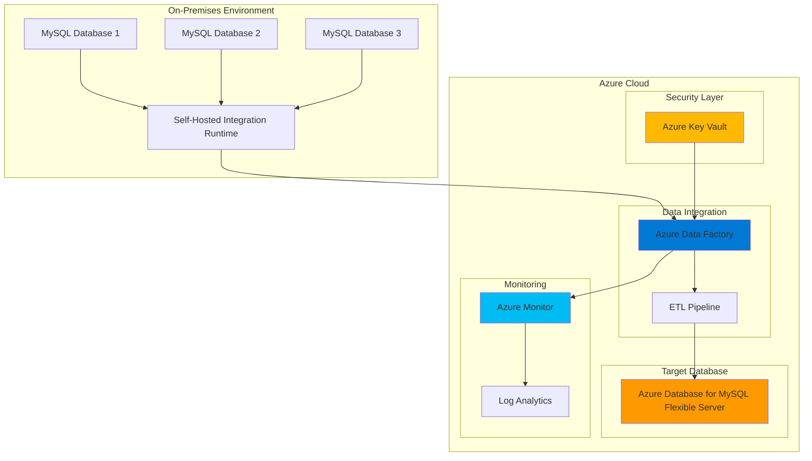

# Multi-Database ETL Orchestration with Data Factory

## Problem

Organizations managing multiple on-premises MySQL databases face significant challenges in creating unified data views for analytics and reporting. Manual data synchronization processes are error-prone, time-consuming, and lack proper monitoring, leading to data inconsistencies and delayed business insights. Additionally, legacy systems often lack proper credential management and security controls, creating compliance risks and operational inefficiencies.

## Solution

Azure Data Factory provides enterprise-grade ETL orchestration capabilities that automate data movement and transformation across multiple MySQL databases. This solution combines Azure Data Factory's visual pipeline designer with Azure Database for MySQL Flexible Server as the target destination, secured through Azure Key Vault for credential management and monitored via Azure Monitor. The architecture enables scalable, secure, and monitored data integration workflows that transform disparate data sources into a unified analytics platform.

## Architecture Diagram



## Prerequisites

1. Azure subscription with appropriate permissions for Data Factory, Database for MySQL, Key Vault, and Monitor
2. Azure CLI v2.15.0 or higher installed and configured (or Azure Cloud Shell)
3. On-premises MySQL databases with network connectivity to Azure
4. Basic knowledge of ETL concepts and MySQL database administration
5. Understanding of Azure networking and security concepts
6. Estimated cost: $150-300 per month for development/testing environment

> **Note**: This configuration follows Azure Well-Architected Framework principles for security, reliability, and cost optimization. Review the [Azure Data Factory pricing guide](https://azure.microsoft.com/pricing/details/data-factory/) for detailed cost planning.

## Preparation

```bash
# Set environment variables for Azure resources
export RESOURCE_GROUP="rg-etl-orchestration"
export LOCATION="eastus"
export SUBSCRIPTION_ID=$(az account show --query id --output tsv)

# Generate unique suffix for resource names
RANDOM_SUFFIX=$(openssl rand -hex 3)
export ADF_NAME="adf-etl-${RANDOM_SUFFIX}"
export MYSQL_SERVER_NAME="mysql-target-${RANDOM_SUFFIX}"
export KEY_VAULT_NAME="kv-etl-${RANDOM_SUFFIX}"
export LOG_ANALYTICS_NAME="la-etl-${RANDOM_SUFFIX}"

# Create resource group
az group create \
    --name ${RESOURCE_GROUP} \
    --location ${LOCATION} \
    --tags purpose=etl-orchestration environment=demo

echo "✅ Resource group created: ${RESOURCE_GROUP}"

# Create Log Analytics workspace for monitoring
az monitor log-analytics workspace create \
    --resource-group ${RESOURCE_GROUP} \
    --workspace-name ${LOG_ANALYTICS_NAME} \
    --location ${LOCATION} \
    --sku PerGB2018

echo "✅ Log Analytics workspace created: ${LOG_ANALYTICS_NAME}"
```

## Steps

1. **Create Azure Key Vault for Secure Credential Management**:

   Azure Key Vault provides centralized, secure storage for database connection strings and credentials, eliminating the need to store sensitive information in pipeline configurations. This managed service ensures compliance with enterprise security policies while enabling secure access through Azure Active Directory authentication and role-based access control.

   ```bash
   # Create Key Vault with soft delete and purge protection
   az keyvault create \
       --name ${KEY_VAULT_NAME} \
       --resource-group ${RESOURCE_GROUP} \
       --location ${LOCATION} \
       --sku standard \
       --enable-soft-delete true \
       --enable-purge-protection true
   
   # Store MySQL connection credentials as secrets
   az keyvault secret set \
       --vault-name ${KEY_VAULT_NAME} \
       --name "mysql-source-connection-string" \
       --value "server=your-onprem-mysql.domain.com;port=3306;database=source_db;uid=etl_user;pwd=SecurePassword123!"
   
   az keyvault secret set \
       --vault-name ${KEY_VAULT_NAME} \
       --name "mysql-admin-username" \
       --value "mysqladmin"
   
   az keyvault secret set \
       --vault-name ${KEY_VAULT_NAME} \
       --name "mysql-admin-password" \
       --value "ComplexPassword123!"
   
   echo "✅ Key Vault configured with secure credentials"
   ```

   The Key Vault is now ready to provide secure credential management for all database connections. This configuration supports the Zero Trust security model by centralizing secret management and providing audit trails for all access attempts.

2. **Create Azure Database for MySQL Flexible Server**:

   Azure Database for MySQL Flexible Server provides a fully managed, production-ready MySQL environment with built-in high availability, automated backups, and performance optimization. The flexible server deployment model offers granular control over database configuration while maintaining enterprise-grade security and compliance features.

   ```bash
   # Create MySQL Flexible Server with optimized configuration
   az mysql flexible-server create \
       --resource-group ${RESOURCE_GROUP} \
       --name ${MYSQL_SERVER_NAME} \
       --location ${LOCATION} \
       --admin-user $(az keyvault secret show \
           --vault-name ${KEY_VAULT_NAME} \
           --name "mysql-admin-username" \
           --query value -o tsv) \
       --admin-password $(az keyvault secret show \
           --vault-name ${KEY_VAULT_NAME} \
           --name "mysql-admin-password" \
           --query value -o tsv) \
       --sku-name Standard_D2ds_v4 \
       --tier GeneralPurpose \
       --storage-size 128 \
       --version 8.0 \
       --high-availability Enabled \
       --zone 1 \
       --standby-zone 2
   
   # Configure firewall rules for Azure services
   az mysql flexible-server firewall-rule create \
       --resource-group ${RESOURCE_GROUP} \
       --name ${MYSQL_SERVER_NAME} \
       --rule-name "AllowAzureServices" \
       --start-ip-address 0.0.0.0 \
       --end-ip-address 0.0.0.0
   
   # Create target database for ETL operations
   az mysql flexible-server db create \
       --resource-group ${RESOURCE_GROUP} \
       --server-name ${MYSQL_SERVER_NAME} \
       --database-name "consolidated_data"
   
   echo "✅ MySQL Flexible Server configured with high availability"
   ```

   The MySQL Flexible Server is now configured with zone-redundant high availability and optimized for ETL workloads. This setup provides automatic failover capabilities and ensures data durability for mission-critical applications.

3. **Create Azure Data Factory Instance**:

   Azure Data Factory serves as the orchestration engine for complex ETL workflows, providing visual pipeline design capabilities and extensive connectivity options. The service integrates seamlessly with Azure services and supports hybrid data integration patterns through self-hosted integration runtimes.

   ```bash
   # Create Data Factory instance
   az datafactory create \
       --resource-group ${RESOURCE_GROUP} \
       --name ${ADF_NAME} \
       --location ${LOCATION}
   
   # Configure managed identity for secure service-to-service authentication
   az datafactory update \
       --resource-group ${RESOURCE_GROUP} \
       --name ${ADF_NAME} \
       --set identity.type=SystemAssigned
   
   # Get Data Factory managed identity object ID
   ADF_IDENTITY_ID=$(az datafactory show \
       --resource-group ${RESOURCE_GROUP} \
       --name ${ADF_NAME} \
       --query identity.principalId -o tsv)
   
   echo "✅ Data Factory created with managed identity: ${ADF_IDENTITY_ID}"
   ```

   Azure Data Factory is now configured with system-assigned managed identity, enabling secure authentication to Azure services without storing credentials in pipeline configurations. This approach follows Azure security best practices and supports automated credential rotation.

4. **Configure Key Vault Access Policies for Data Factory**:

   Proper access control configuration ensures that Azure Data Factory can retrieve stored credentials while maintaining the principle of least privilege. The access policy grants only the necessary permissions for secret retrieval during pipeline execution.

   ```bash
   # Grant Data Factory access to Key Vault secrets
   az keyvault set-policy \
       --name ${KEY_VAULT_NAME} \
       --resource-group ${RESOURCE_GROUP} \
       --object-id ${ADF_IDENTITY_ID} \
       --secret-permissions get list
   
   # Verify access policy configuration
   az keyvault show \
       --name ${KEY_VAULT_NAME} \
       --resource-group ${RESOURCE_GROUP} \
       --query accessPolicies
   
   echo "✅ Key Vault access configured for Data Factory"
   ```

   The access policy configuration enables secure credential retrieval while maintaining audit trails and compliance requirements. This setup supports automated pipeline execution without manual credential management.

5. **Create Self-Hosted Integration Runtime**:

   The Self-Hosted Integration Runtime enables secure connectivity between on-premises MySQL databases and Azure Data Factory. This component acts as a bridge, allowing data movement while maintaining network security and compliance requirements.

   ```bash
   # Create self-hosted integration runtime
   az datafactory integration-runtime create \
       --resource-group ${RESOURCE_GROUP} \
       --factory-name ${ADF_NAME} \
       --name "SelfHostedIR" \
       --type SelfHosted \
       --description "Integration Runtime for on-premises MySQL connectivity"
   
   # Get integration runtime authentication key
   IR_AUTH_KEY=$(az datafactory integration-runtime get-connection-info \
       --resource-group ${RESOURCE_GROUP} \
       --factory-name ${ADF_NAME} \
       --name "SelfHostedIR" \
       --query authKey1 -o tsv)
   
   echo "✅ Self-hosted Integration Runtime created"
   echo "Authentication Key: ${IR_AUTH_KEY}"
   echo "Install the Integration Runtime on your on-premises server using this key"
   ```

   The Self-Hosted Integration Runtime provides secure, encrypted connectivity to on-premises data sources. Install the runtime software on your on-premises server and register it using the provided authentication key to enable hybrid data integration.

6. **Configure Data Factory Linked Services**:

   Linked services define connection information for external data sources and destinations. These configurations enable Data Factory to securely connect to both on-premises MySQL databases and the Azure MySQL Flexible Server target.

   ```bash
   # Create linked service for on-premises MySQL (source)
   cat > mysql-source-linkedservice.json << 'EOF'
   {
       "name": "MySQLSourceLinkedService",
       "type": "Microsoft.DataFactory/factories/linkedservices",
       "properties": {
           "type": "MySql",
           "connectVia": {
               "referenceName": "SelfHostedIR",
               "type": "IntegrationRuntimeReference"
           },
           "typeProperties": {
               "connectionString": {
                   "type": "AzureKeyVaultSecret",
                   "store": {
                       "referenceName": "AzureKeyVaultLinkedService",
                       "type": "LinkedServiceReference"
                   },
                   "secretName": "mysql-source-connection-string"
               }
           }
       }
   }
   EOF
   
   # Create linked service for Azure MySQL (target)
   cat > mysql-target-linkedservice.json << 'EOF'
   {
       "name": "MySQLTargetLinkedService",
       "type": "Microsoft.DataFactory/factories/linkedservices",
       "properties": {
           "type": "AzureMySql",
           "typeProperties": {
               "connectionString": {
                   "type": "SecureString",
                   "value": "$(concat('server=',parameters('targetServer'),';port=3306;database=consolidated_data;uid=',parameters('targetUsername'),';pwd=',parameters('targetPassword'),';sslmode=required'))"
               }
           }
       }
   }
   EOF
   
   echo "✅ Linked service configurations created"
   ```

   These linked service configurations establish secure connections using Azure Key Vault secrets and support both on-premises and cloud-based MySQL databases. The configuration ensures encrypted data transfer and proper authentication for all data movement operations.

7. **Create ETL Pipeline with Data Flow Activities**:

   The ETL pipeline orchestrates data movement, transformation, and loading operations across multiple source databases. Data flows provide visual transformation capabilities with code-free data processing logic and built-in optimization features.

   ```bash
   # Create comprehensive ETL pipeline definition
   cat > etl-pipeline.json << 'EOF'
   {
       "name": "MultiDatabaseETLPipeline",
       "properties": {
           "description": "Enterprise ETL pipeline for multi-database orchestration",
           "activities": [
               {
                   "name": "CopyCustomerData",
                   "type": "Copy",
                   "dependsOn": [],
                   "policy": {
                       "timeout": "7.00:00:00",
                       "retry": 3,
                       "retryIntervalInSeconds": 30
                   },
                   "typeProperties": {
                       "source": {
                           "type": "MySqlSource",
                           "query": "SELECT customer_id, customer_name, email, registration_date, last_login FROM customers WHERE last_modified >= '${formatDateTime(addDays(utcNow(), -1), 'yyyy-MM-dd HH:mm:ss')}'"
                       },
                       "sink": {
                           "type": "AzureMySqlSink",
                           "writeBehavior": "upsert",
                           "upsertSettings": {
                               "useTempDB": true,
                               "keys": ["customer_id"]
                           }
                       },
                       "enableStaging": false,
                       "parallelCopies": 4,
                       "dataIntegrationUnits": 8
                   },
                   "inputs": [
                       {
                           "referenceName": "MySQLSourceDataset",
                           "type": "DatasetReference"
                       }
                   ],
                   "outputs": [
                       {
                           "referenceName": "MySQLTargetDataset",
                           "type": "DatasetReference"
                       }
                   ]
               },
               {
                   "name": "TransformAndAggregateData",
                   "type": "ExecuteDataFlow",
                   "dependsOn": [
                       {
                           "activity": "CopyCustomerData",
                           "dependencyConditions": ["Succeeded"]
                       }
                   ],
                   "policy": {
                       "timeout": "1.00:00:00",
                       "retry": 2
                   },
                   "typeProperties": {
                       "dataflow": {
                           "referenceName": "CustomerDataTransformation",
                           "type": "DataFlowReference"
                       },
                       "compute": {
                           "coreCount": 8,
                           "computeType": "General"
                       }
                   }
               }
           ],
           "parameters": {
               "sourceServer": {
                   "type": "string",
                   "defaultValue": "onprem-mysql.domain.com"
               },
               "targetServer": {
                   "type": "string",
                   "defaultValue": "${MYSQL_SERVER_NAME}.mysql.database.azure.com"
               }
           },
           "folder": {
               "name": "ETL-Pipelines"
           }
       }
   }
   EOF
   
   echo "✅ ETL pipeline configuration created with retry policies and optimization"
   ```

   The pipeline configuration includes enterprise-grade features such as incremental data loading, error handling, parallel execution, and performance optimization. This approach ensures efficient data processing while maintaining data integrity and system reliability.

8. **Configure Pipeline Triggers and Scheduling**:

   Automated scheduling ensures consistent data synchronization without manual intervention. Trigger configuration supports various scheduling patterns including time-based, event-driven, and dependency-based execution models.

   ```bash
   # Create scheduled trigger for daily ETL operations
   cat > daily-etl-trigger.json << 'EOF'
   {
       "name": "DailyETLTrigger",
       "properties": {
           "description": "Daily ETL execution at 2 AM UTC",
           "type": "ScheduleTrigger",
           "typeProperties": {
               "recurrence": {
                   "frequency": "Day",
                   "interval": 1,
                   "startTime": "2025-01-01T02:00:00Z",
                   "timeZone": "UTC",
                   "schedule": {
                       "hours": [2],
                       "minutes": [0]
                   }
               }
           },
           "pipelines": [
               {
                   "pipelineReference": {
                       "referenceName": "MultiDatabaseETLPipeline",
                       "type": "PipelineReference"
                   }
               }
           ]
       }
   }
   EOF
   
   # Create event-based trigger for real-time processing
   cat > event-etl-trigger.json << 'EOF'
   {
       "name": "EventBasedETLTrigger",
       "properties": {
           "description": "Event-driven ETL for real-time data processing",
           "type": "BlobEventsTrigger",
           "typeProperties": {
               "blobPathBeginsWith": "/etl-staging/",
               "blobPathEndsWith": ".csv",
               "ignoreEmptyBlobs": true,
               "events": ["Microsoft.Storage.BlobCreated"]
           },
           "pipelines": [
               {
                   "pipelineReference": {
                       "referenceName": "MultiDatabaseETLPipeline",
                       "type": "PipelineReference"
                   }
               }
           ]
       }
   }
   EOF
   
   echo "✅ ETL triggers configured for scheduled and event-driven execution"
   ```

   The trigger configuration enables both scheduled batch processing and real-time event-driven execution. This hybrid approach ensures data freshness while optimizing resource utilization and operational costs.

9. **Implement Comprehensive Monitoring and Alerting**:

   Azure Monitor integration provides real-time visibility into pipeline performance, data quality, and system health. Custom metrics and alerts enable proactive issue detection and automated response to operational events.

   ```bash
   # Create diagnostic settings for Data Factory
   az monitor diagnostic-settings create \
       --resource "/subscriptions/${SUBSCRIPTION_ID}/resourceGroups/${RESOURCE_GROUP}/providers/Microsoft.DataFactory/factories/${ADF_NAME}" \
       --name "DataFactoryDiagnostics" \
       --workspace "/subscriptions/${SUBSCRIPTION_ID}/resourceGroups/${RESOURCE_GROUP}/providers/Microsoft.OperationalInsights/workspaces/${LOG_ANALYTICS_NAME}" \
       --logs '[
           {
               "category": "PipelineRuns",
               "enabled": true,
               "retentionPolicy": {
                   "enabled": true,
                   "days": 90
               }
           },
           {
               "category": "ActivityRuns",
               "enabled": true,
               "retentionPolicy": {
                   "enabled": true,
                   "days": 90
               }
           },
           {
               "category": "TriggerRuns",
               "enabled": true,
               "retentionPolicy": {
                   "enabled": true,
                   "days": 90
               }
           }
       ]' \
       --metrics '[
           {
               "category": "AllMetrics",
               "enabled": true,
               "retentionPolicy": {
                   "enabled": true,
                   "days": 90
               }
           }
       ]'
   
   # Create alert rule for pipeline failures
   az monitor metrics alert create \
       --name "ETL-Pipeline-Failure-Alert" \
       --resource-group ${RESOURCE_GROUP} \
       --scopes "/subscriptions/${SUBSCRIPTION_ID}/resourceGroups/${RESOURCE_GROUP}/providers/Microsoft.DataFactory/factories/${ADF_NAME}" \
       --condition "count 'Pipeline failed runs' > 0" \
       --description "Alert when ETL pipeline fails" \
       --evaluation-frequency 5m \
       --window-size 5m \
       --severity 2
   
   echo "✅ Comprehensive monitoring and alerting configured"
   ```

   The monitoring configuration provides detailed telemetry for all pipeline operations, enabling performance optimization and rapid issue resolution. Custom alerts ensure immediate notification of critical events and support proactive system management.

## Validation & Testing

1. **Verify Data Factory and Integration Runtime Status**:

   ```bash
   # Check Data Factory status
   az datafactory show \
       --resource-group ${RESOURCE_GROUP} \
       --name ${ADF_NAME} \
       --query "{Name:name,State:provisioningState,Location:location}"
   
   # Verify Integration Runtime connectivity
   az datafactory integration-runtime show \
       --resource-group ${RESOURCE_GROUP} \
       --factory-name ${ADF_NAME} \
       --name "SelfHostedIR" \
       --query "{Name:name,State:state,Type:type}"
   ```

   Expected output: Data Factory should show "Succeeded" provisioning state and Integration Runtime should show "Online" state.

2. **Test MySQL Connectivity and Data Access**:

   ```bash
   # Test connection to Azure MySQL Flexible Server
   mysql -h ${MYSQL_SERVER_NAME}.mysql.database.azure.com \
       -u $(az keyvault secret show --vault-name ${KEY_VAULT_NAME} --name "mysql-admin-username" --query value -o tsv) \
       -p$(az keyvault secret show --vault-name ${KEY_VAULT_NAME} --name "mysql-admin-password" --query value -o tsv) \
       -e "SELECT VERSION(), CONNECTION_ID(), USER();"
   
   # Verify target database exists
   mysql -h ${MYSQL_SERVER_NAME}.mysql.database.azure.com \
       -u $(az keyvault secret show --vault-name ${KEY_VAULT_NAME} --name "mysql-admin-username" --query value -o tsv) \
       -p$(az keyvault secret show --vault-name ${KEY_VAULT_NAME} --name "mysql-admin-password" --query value -o tsv) \
       -e "SHOW DATABASES;" | grep consolidated_data
   ```

   Expected output: MySQL connection should succeed and return version information and database listing.

3. **Execute Test Pipeline Run**:

   ```bash
   # Trigger a manual pipeline run for testing
   az datafactory pipeline create-run \
       --resource-group ${RESOURCE_GROUP} \
       --factory-name ${ADF_NAME} \
       --name "MultiDatabaseETLPipeline"
   
   # Monitor pipeline execution status
   az datafactory pipeline-run show \
       --resource-group ${RESOURCE_GROUP} \
       --factory-name ${ADF_NAME} \
       --run-id $(az datafactory pipeline create-run \
           --resource-group ${RESOURCE_GROUP} \
           --factory-name ${ADF_NAME} \
           --name "MultiDatabaseETLPipeline" \
           --query runId -o tsv)
   ```

   Expected output: Pipeline should execute successfully with "Succeeded" status.

4. **Validate Monitoring and Alerting Configuration**:

   ```bash
   # Check diagnostic settings configuration
   az monitor diagnostic-settings list \
       --resource "/subscriptions/${SUBSCRIPTION_ID}/resourceGroups/${RESOURCE_GROUP}/providers/Microsoft.DataFactory/factories/${ADF_NAME}"
   
   # Verify alert rules are active
   az monitor metrics alert list \
       --resource-group ${RESOURCE_GROUP} \
       --query "[?name=='ETL-Pipeline-Failure-Alert'].{Name:name,Enabled:enabled,Severity:severity}"
   ```

   Expected output: Diagnostic settings should show enabled logs and metrics, alert rules should be active.

## Cleanup

1. **Stop and Remove Data Factory Triggers**:

   ```bash
   # Stop all active triggers
   az datafactory trigger stop \
       --resource-group ${RESOURCE_GROUP} \
       --factory-name ${ADF_NAME} \
       --name "DailyETLTrigger"
   
   # Delete triggers
   az datafactory trigger delete \
       --resource-group ${RESOURCE_GROUP} \
       --factory-name ${ADF_NAME} \
       --name "DailyETLTrigger" \
       --yes
   
   echo "✅ Data Factory triggers stopped and deleted"
   ```

2. **Remove Integration Runtime and Associated Resources**:

   ```bash
   # Delete self-hosted integration runtime
   az datafactory integration-runtime delete \
       --resource-group ${RESOURCE_GROUP} \
       --factory-name ${ADF_NAME} \
       --name "SelfHostedIR" \
       --yes
   
   echo "✅ Integration Runtime deleted"
   ```

3. **Delete Data Factory Instance**:

   ```bash
   # Delete Data Factory and all associated resources
   az datafactory delete \
       --resource-group ${RESOURCE_GROUP} \
       --name ${ADF_NAME} \
       --yes
   
   echo "✅ Data Factory deleted"
   ```

4. **Remove Database and Supporting Services**:

   ```bash
   # Delete MySQL Flexible Server
   az mysql flexible-server delete \
       --resource-group ${RESOURCE_GROUP} \
       --name ${MYSQL_SERVER_NAME} \
       --yes
   
   # Delete Key Vault (with purge protection)
   az keyvault delete \
       --name ${KEY_VAULT_NAME} \
       --resource-group ${RESOURCE_GROUP}
   
   # Delete Log Analytics workspace
   az monitor log-analytics workspace delete \
       --resource-group ${RESOURCE_GROUP} \
       --workspace-name ${LOG_ANALYTICS_NAME} \
       --yes
   
   echo "✅ Database and supporting services deleted"
   ```

5. **Remove Resource Group and All Contained Resources**:

   ```bash
   # Delete resource group and all contained resources
   az group delete \
       --name ${RESOURCE_GROUP} \
       --yes \
       --no-wait
   
   echo "✅ Resource group deletion initiated: ${RESOURCE_GROUP}"
   echo "Note: Deletion may take several minutes to complete"
   
   # Verify deletion (optional)
   az group exists --name ${RESOURCE_GROUP}
   ```

## Discussion

Azure Data Factory provides a comprehensive platform for enterprise-grade ETL orchestration that addresses the complex requirements of multi-database integration scenarios. The service combines visual pipeline design with robust execution capabilities, enabling organizations to create scalable data integration solutions without extensive coding requirements. This architecture pattern is particularly effective for organizations migrating from traditional ETL tools to cloud-native solutions, as it provides familiar concepts while leveraging Azure's managed services benefits. For detailed guidance on pipeline design patterns, refer to the [Azure Data Factory documentation](https://docs.microsoft.com/en-us/azure/data-factory/introduction) and [ETL best practices guide](https://docs.microsoft.com/en-us/azure/architecture/data-guide/relational-data/etl).

The integration of Azure Database for MySQL Flexible Server as the target destination provides enterprise-grade reliability with built-in high availability, automated backups, and performance optimization features. The flexible server deployment model offers granular control over compute and storage resources while maintaining compatibility with existing MySQL applications and tools. This approach supports both lift-and-shift migration scenarios and greenfield analytics implementations. The [Azure Database for MySQL documentation](https://docs.microsoft.com/en-us/azure/mysql/flexible-server/overview) provides comprehensive guidance on performance tuning and operational best practices.

Security considerations are paramount in enterprise ETL implementations, and this solution demonstrates proper credential management through Azure Key Vault integration. The centralized secret management approach eliminates hardcoded credentials while providing audit trails and access control capabilities. Azure Monitor integration ensures comprehensive observability across all pipeline operations, enabling proactive monitoring and rapid issue resolution. For additional security guidance, review the [Azure Data Factory security documentation](https://docs.microsoft.com/en-us/azure/data-factory/data-factory-security-considerations) and [Key Vault best practices](https://docs.microsoft.com/en-us/azure/key-vault/general/best-practices).

The Self-Hosted Integration Runtime component enables secure connectivity to on-premises data sources while maintaining network isolation and compliance requirements. This hybrid approach supports gradual cloud migration strategies and ensures that sensitive data remains within appropriate security boundaries. Cost optimization is achieved through the consumption-based pricing model of Azure Data Factory, which scales automatically based on actual usage patterns and data volumes.

> **Tip**: Use Azure Data Factory's data flow debugging capabilities to test transformations before deploying to production. The [monitoring and debugging documentation](https://docs.microsoft.com/en-us/azure/data-factory/monitor-visually) provides comprehensive guidance on troubleshooting pipeline issues and optimizing performance.

## Challenge

Extend this solution by implementing these enhancements:

1. **Implement Change Data Capture (CDC)**: Configure real-time data synchronization using MySQL binary logs and Azure Event Hubs for near-zero latency data replication across multiple database instances.

2. **Add Data Quality Validation**: Create comprehensive data validation rules using Data Factory data flows to ensure data integrity, implement automated data profiling, and generate data quality reports with custom metrics.

3. **Implement Multi-Environment Deployment**: Set up CI/CD pipelines using Azure DevOps to automate Data Factory deployment across development, staging, and production environments with proper configuration management.

4. **Create Advanced Monitoring Dashboard**: Build custom Azure Monitor workbooks and Power BI dashboards to visualize ETL performance metrics, data lineage, and business KPIs with automated alerting for anomaly detection.

5. **Integrate with Azure Purview**: Implement data governance and cataloging by connecting Azure Purview to track data lineage, manage metadata, and ensure compliance with data privacy regulations across the entire data pipeline.

## Infrastructure Code

*Infrastructure code will be generated after recipe approval.*