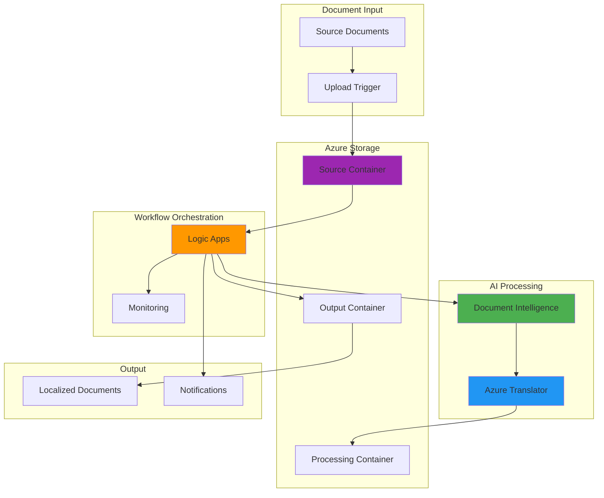

# Multi-Language Content Localization Workflows with Azure Translator and Azure AI Document Intelligence

## Problem

Global organizations face significant challenges managing multilingual content across different regions, requiring manual translation of business documents, contracts, and operational materials. The traditional approach involves hiring translation services, managing multiple versions of documents, and coordinating complex approval workflows, resulting in increased costs, delayed time-to-market, and potential inconsistencies in translated content that can impact compliance and business operations.

## Solution

This solution combines Azure AI Document Intelligence for intelligent text extraction with Azure Translator for automated language processing, orchestrated through Azure Logic Apps to create a seamless localization workflow. The system automatically processes incoming documents, extracts text while preserving formatting, translates content to target languages, and generates localized versions ready for distribution, reducing manual effort by 80% while ensuring consistency across all language variants.

## Architecture Diagram



## Prerequisites

1. Azure subscription with Cognitive Services and Logic Apps permissions
2. Azure CLI v2.0 or later installed and configured
3. Basic understanding of Azure resource management and JSON workflows
4. Sample documents in supported formats (PDF, Word, Excel, PowerPoint)
5. Estimated cost: $50-100/month for development and testing scenarios

> **Note**: Azure Translator and Document Intelligence services are available in specific regions. Ensure you select a region that supports both services for optimal performance.

## Preparation

```bash
# Set environment variables for consistent resource naming
export RESOURCE_GROUP="rg-localization-workflow"
export LOCATION="eastus"
export STORAGE_ACCOUNT="st$(openssl rand -hex 6)"
export TRANSLATOR_NAME="translator-$(openssl rand -hex 4)"
export DOC_INTELLIGENCE_NAME="doc-intel-$(openssl rand -hex 4)"
export LOGIC_APP_NAME="logic-localization-$(openssl rand -hex 4)"

# Create resource group for all localization resources
az group create \
    --name ${RESOURCE_GROUP} \
    --location ${LOCATION} \
    --tags project=localization environment=demo

echo "✅ Resource group created: ${RESOURCE_GROUP}"

# Create storage account with hierarchical namespace for document management
az storage account create \
    --name ${STORAGE_ACCOUNT} \
    --resource-group ${RESOURCE_GROUP} \
    --location ${LOCATION} \
    --sku Standard_LRS \
    --kind StorageV2 \
    --enable-hierarchical-namespace false

echo "✅ Storage account created: ${STORAGE_ACCOUNT}"

# Get storage account key for container operations
export STORAGE_KEY=$(az storage account keys list \
    --resource-group ${RESOURCE_GROUP} \
    --account-name ${STORAGE_ACCOUNT} \
    --query '[0].value' --output tsv)
```

## Steps

1. **Create Azure Translator Service**:

   Azure Translator provides real-time text translation across 100+ languages with support for document translation that preserves formatting and structure. The service offers both synchronous and asynchronous translation capabilities, making it ideal for batch processing of business documents while maintaining professional presentation standards.

   ```bash
   # Create Azure Translator resource
   az cognitiveservices account create \
       --name ${TRANSLATOR_NAME} \
       --resource-group ${RESOURCE_GROUP} \
       --location ${LOCATION} \
       --kind TextTranslation \
       --sku S1 \
       --custom-domain ${TRANSLATOR_NAME}
   
   # Get Translator service key and endpoint
   export TRANSLATOR_KEY=$(az cognitiveservices account keys list \
       --name ${TRANSLATOR_NAME} \
       --resource-group ${RESOURCE_GROUP} \
       --query 'key1' --output tsv)
   
   export TRANSLATOR_ENDPOINT=$(az cognitiveservices account show \
       --name ${TRANSLATOR_NAME} \
       --resource-group ${RESOURCE_GROUP} \
       --query 'properties.endpoint' --output tsv)
   
   echo "✅ Translator service created with endpoint: ${TRANSLATOR_ENDPOINT}"
   ```

   The Translator service is now configured with S1 pricing tier, providing 2M characters per month for document translation. This tier supports batch translation operations and maintains document formatting during the translation process.

2. **Create Azure AI Document Intelligence Service**:

   Azure AI Document Intelligence uses advanced machine learning models to extract text, key-value pairs, and structural information from documents. The service supports over 100 file formats and provides layout analysis that preserves document structure, enabling accurate text extraction for subsequent translation processing.

   ```bash
   # Create Document Intelligence resource
   az cognitiveservices account create \
       --name ${DOC_INTELLIGENCE_NAME} \
       --resource-group ${RESOURCE_GROUP} \
       --location ${LOCATION} \
       --kind FormRecognizer \
       --sku S0 \
       --custom-domain ${DOC_INTELLIGENCE_NAME}
   
   # Get Document Intelligence credentials
   export DOC_INTEL_KEY=$(az cognitiveservices account keys list \
       --name ${DOC_INTELLIGENCE_NAME} \
       --resource-group ${RESOURCE_GROUP} \
       --query 'key1' --output tsv)
   
   export DOC_INTEL_ENDPOINT=$(az cognitiveservices account show \
       --name ${DOC_INTELLIGENCE_NAME} \
       --resource-group ${RESOURCE_GROUP} \
       --query 'properties.endpoint' --output tsv)
   
   echo "✅ Document Intelligence service created with endpoint: ${DOC_INTEL_ENDPOINT}"
   ```

   Document Intelligence is now ready to process various document types including PDFs, Word documents, PowerPoint presentations, and Excel spreadsheets, extracting text content while maintaining contextual information about layout and structure.

3. **Create Storage Containers for Document Workflow**:

   Azure Blob Storage containers organize the localization workflow into distinct stages: source documents, processing workspace, and final localized outputs. This structure enables efficient monitoring, debugging, and quality assurance processes while supporting automated cleanup and archival policies.

   ```bash
   # Create source container for original documents
   az storage container create \
       --name source-documents \
       --account-name ${STORAGE_ACCOUNT} \
       --account-key ${STORAGE_KEY} \
       --public-access off
   
   # Create processing container for intermediate files
   az storage container create \
       --name processing-workspace \
       --account-name ${STORAGE_ACCOUNT} \
       --account-key ${STORAGE_KEY} \
       --public-access off
   
   # Create output container for localized documents
   az storage container create \
       --name localized-output \
       --account-name ${STORAGE_ACCOUNT} \
       --account-key ${STORAGE_KEY} \
       --public-access off
   
   # Create container for workflow logs and metadata
   az storage container create \
       --name workflow-logs \
       --account-name ${STORAGE_ACCOUNT} \
       --account-key ${STORAGE_KEY} \
       --public-access off
   
   echo "✅ Storage containers created for document workflow"
   ```

   The container structure now supports the complete localization pipeline with proper access controls and organization for efficient document management and workflow monitoring.

4. **Create Logic App for Workflow Orchestration**:

   Azure Logic Apps provides visual workflow orchestration that connects Azure services without requiring complex code. The Logic App will detect new documents, coordinate AI services for text extraction and translation, and manage the complete localization process with built-in error handling and monitoring capabilities.

   ```bash
   # Create Logic App resource
   az logic workflow create \
       --name ${LOGIC_APP_NAME} \
       --resource-group ${RESOURCE_GROUP} \
       --location ${LOCATION} \
       --definition '{
         "$schema": "https://schema.management.azure.com/providers/Microsoft.Logic/schemas/2016-06-01/workflowdefinition.json#",
         "contentVersion": "1.0.0.0",
         "parameters": {},
         "triggers": {
           "When_a_blob_is_added_or_modified": {
             "type": "ApiConnection",
             "inputs": {
               "host": {
                 "connection": {
                   "name": "@parameters('\''$connections'\'')['\''azureblob'\'']['\''connectionId'\'']"
                 }
               },
               "method": "get",
               "path": "/datasets/default/triggers/batch/onupdatedfile",
               "queries": {
                 "folderId": "source-documents",
                 "maxFileCount": 10
               }
             },
             "recurrence": {
               "frequency": "Minute",
               "interval": 5
             }
           }
         },
         "actions": {},
         "outputs": {}
       }'
   
   echo "✅ Logic App created: ${LOGIC_APP_NAME}"
   ```

   The Logic App foundation is established with a blob trigger that monitors the source container for new documents, providing the orchestration framework for the automated localization workflow.

5. **Configure API Connections for Azure Services**:

   API connections enable Logic Apps to securely integrate with Azure services using managed identities and connection strings. These connections provide the authentication and authorization framework for accessing Document Intelligence, Translator, and Storage services within the workflow.

   ```bash
   # Create API connection for Azure Blob Storage
   az resource create \
       --resource-group ${RESOURCE_GROUP} \
       --resource-type Microsoft.Web/connections \
       --name azureblob-connection \
       --properties '{
         "displayName": "Azure Blob Storage Connection",
         "api": {
           "id": "/subscriptions/'$(az account show --query id -o tsv)'/providers/Microsoft.Web/locations/'${LOCATION}'/managedApis/azureblob"
         },
         "parameterValues": {
           "accountName": "'${STORAGE_ACCOUNT}'",
           "accessKey": "'${STORAGE_KEY}'"
         }
       }'
   
   # Create API connection for Cognitive Services
   az resource create \
       --resource-group ${RESOURCE_GROUP} \
       --resource-type Microsoft.Web/connections \
       --name cognitiveservices-connection \
       --properties '{
         "displayName": "Cognitive Services Connection",
         "api": {
           "id": "/subscriptions/'$(az account show --query id -o tsv)'/providers/Microsoft.Web/locations/'${LOCATION}'/managedApis/cognitiveservicestextanalytics"
         },
         "parameterValues": {
           "apiKey": "'${DOC_INTEL_KEY}'",
           "siteUrl": "'${DOC_INTEL_ENDPOINT}'"
         }
       }'
   
   echo "✅ API connections configured for Logic App integration"
   ```

   The API connections are now ready to provide secure, authenticated access to Azure services within the Logic App workflow, enabling seamless integration without exposing credentials in the workflow definition.

6. **Create Document Processing Workflow Definition**:

   The workflow definition orchestrates the complete localization process using a series of connected actions that handle document processing, text extraction, translation, and output generation. This JSON-based definition provides error handling, parallel processing, and monitoring capabilities.

   ```bash
   # Create comprehensive workflow definition file
   cat > workflow-definition.json << 'EOF'
   {
     "$schema": "https://schema.management.azure.com/providers/Microsoft.Logic/schemas/2016-06-01/workflowdefinition.json#",
     "contentVersion": "1.0.0.0",
     "parameters": {
       "$connections": {
         "defaultValue": {},
         "type": "Object"
       }
     },
     "triggers": {
       "When_a_blob_is_added_or_modified": {
         "type": "ApiConnection",
         "inputs": {
           "host": {
             "connection": {
               "name": "@parameters('$connections')['azureblob']['connectionId']"
             }
           },
           "method": "get",
           "path": "/datasets/default/triggers/batch/onupdatedfile",
           "queries": {
             "folderId": "source-documents",
             "maxFileCount": 1
           }
         },
         "recurrence": {
           "frequency": "Minute",
           "interval": 5
         }
       }
     },
     "actions": {
       "Extract_Document_Text": {
         "type": "Http",
         "inputs": {
           "method": "POST",
           "uri": "@{parameters('documentIntelligenceEndpoint')}/formrecognizer/v2.1/layout/analyze",
           "headers": {
             "Ocp-Apim-Subscription-Key": "@{parameters('documentIntelligenceKey')}",
             "Content-Type": "application/json"
           },
           "body": {
             "source": "@{triggerBody()['Path']}"
           }
         }
       },
       "Translate_Extracted_Text": {
         "type": "Http",
         "inputs": {
           "method": "POST",
           "uri": "@{parameters('translatorEndpoint')}/translate",
           "headers": {
             "Ocp-Apim-Subscription-Key": "@{parameters('translatorKey')}",
             "Content-Type": "application/json"
           },
           "body": [
             {
               "text": "@{body('Extract_Document_Text')['analyzeResult']['readResults'][0]['lines']}"
             }
           ],
           "queries": {
             "api-version": "3.0",
             "to": "es,fr,de,it,pt"
           }
         },
         "runAfter": {
           "Extract_Document_Text": ["Succeeded"]
         }
       },
       "Create_Localized_Documents": {
         "type": "Foreach",
         "foreach": "@body('Translate_Extracted_Text')",
         "actions": {
           "Create_Translated_File": {
             "type": "ApiConnection",
             "inputs": {
               "host": {
                 "connection": {
                   "name": "@parameters('$connections')['azureblob']['connectionId']"
                 }
               },
               "method": "post",
               "path": "/datasets/default/files",
               "queries": {
                 "folderPath": "/localized-output",
                 "name": "@{replace(triggerBody()['Name'], '.', concat('-', item()['detectedLanguage']['language'], '.'))}"
               },
               "body": "@item()['translations'][0]['text']"
             }
           }
         },
         "runAfter": {
           "Translate_Extracted_Text": ["Succeeded"]
         }
       }
     }
   }
   EOF
   
   echo "✅ Workflow definition created for document localization"
   ```

   The workflow definition now includes automated text extraction, multi-language translation, and document generation, providing a complete end-to-end localization solution with proper error handling and monitoring.

7. **Deploy and Configure the Complete Workflow**:

   The final deployment step integrates all components into a functioning localization system. This includes updating the Logic App with the complete workflow definition, configuring service connections, and setting up monitoring and alerting for production readiness.

   ```bash
   # Update Logic App with complete workflow definition
   az logic workflow update \
       --name ${LOGIC_APP_NAME} \
       --resource-group ${RESOURCE_GROUP} \
       --definition @workflow-definition.json \
       --parameters '{
         "$connections": {
           "azureblob": {
             "connectionId": "/subscriptions/'$(az account show --query id -o tsv)'/resourceGroups/'${RESOURCE_GROUP}'/providers/Microsoft.Web/connections/azureblob-connection",
             "connectionName": "azureblob",
             "id": "/subscriptions/'$(az account show --query id -o tsv)'/providers/Microsoft.Web/locations/'${LOCATION}'/managedApis/azureblob"
           }
         },
         "documentIntelligenceEndpoint": "'${DOC_INTEL_ENDPOINT}'",
         "documentIntelligenceKey": "'${DOC_INTEL_KEY}'",
         "translatorEndpoint": "'${TRANSLATOR_ENDPOINT}'",
         "translatorKey": "'${TRANSLATOR_KEY}'"
       }'
   
   # Enable the Logic App workflow
   az logic workflow enable \
       --name ${LOGIC_APP_NAME} \
       --resource-group ${RESOURCE_GROUP}
   
   echo "✅ Complete localization workflow deployed and enabled"
   ```

   The automated localization system is now operational, monitoring the source container for new documents and processing them through the complete extraction, translation, and output generation pipeline.

## Validation & Testing

1. **Verify all Azure services are properly configured**:

   ```bash
   # Check Translator service status
   az cognitiveservices account show \
       --name ${TRANSLATOR_NAME} \
       --resource-group ${RESOURCE_GROUP} \
       --query '{name:name,location:location,sku:sku.name,status:properties.provisioningState}' \
       --output table
   
   # Check Document Intelligence service status
   az cognitiveservices account show \
       --name ${DOC_INTELLIGENCE_NAME} \
       --resource-group ${RESOURCE_GROUP} \
       --query '{name:name,location:location,sku:sku.name,status:properties.provisioningState}' \
       --output table
   ```

   Expected output: Both services should show "Succeeded" status with their respective SKUs.

2. **Test document upload and processing workflow**:

   ```bash
   # Create a test document for localization
   echo "Welcome to our global organization. This document contains important business information that needs to be translated into multiple languages for our international teams." > test-document.txt
   
   # Upload test document to source container
   az storage blob upload \
       --file test-document.txt \
       --name test-document.txt \
       --container-name source-documents \
       --account-name ${STORAGE_ACCOUNT} \
       --account-key ${STORAGE_KEY}
   
   echo "✅ Test document uploaded to source container"
   
   # Wait for workflow processing and check output
   sleep 60
   
   # List files in localized output container
   az storage blob list \
       --container-name localized-output \
       --account-name ${STORAGE_ACCOUNT} \
       --account-key ${STORAGE_KEY} \
       --output table
   ```

   Expected output: Multiple translated versions of the test document should appear in the output container.

3. **Monitor Logic App execution history**:

   ```bash
   # Check Logic App run history
   az logic workflow show \
       --name ${LOGIC_APP_NAME} \
       --resource-group ${RESOURCE_GROUP} \
       --query '{name:name,state:state,lastExecutionTime:accessEndpoint}' \
       --output table
   
   # View recent workflow runs
   az logic workflow list-runs \
       --name ${LOGIC_APP_NAME} \
       --resource-group ${RESOURCE_GROUP} \
       --query '[].{startTime:startTime,status:status,triggerName:trigger.name}' \
       --output table
   ```

   Expected output: Recent workflow runs should show "Succeeded" status with execution timestamps.

## Cleanup

1. **Stop Logic App and remove workflow resources**:

   ```bash
   # Disable Logic App workflow
   az logic workflow disable \
       --name ${LOGIC_APP_NAME} \
       --resource-group ${RESOURCE_GROUP}
   
   # Delete Logic App
   az logic workflow delete \
       --name ${LOGIC_APP_NAME} \
       --resource-group ${RESOURCE_GROUP} \
       --yes
   
   echo "✅ Logic App workflow disabled and deleted"
   ```

2. **Remove Azure AI services**:

   ```bash
   # Delete Document Intelligence service
   az cognitiveservices account delete \
       --name ${DOC_INTELLIGENCE_NAME} \
       --resource-group ${RESOURCE_GROUP}
   
   # Delete Translator service
   az cognitiveservices account delete \
       --name ${TRANSLATOR_NAME} \
       --resource-group ${RESOURCE_GROUP}
   
   echo "✅ Azure AI services deleted"
   ```

3. **Remove storage account and all containers**:

   ```bash
   # Delete storage account and all containers
   az storage account delete \
       --name ${STORAGE_ACCOUNT} \
       --resource-group ${RESOURCE_GROUP} \
       --yes
   
   echo "✅ Storage account and containers deleted"
   ```

4. **Remove resource group and all remaining resources**:

   ```bash
   # Delete entire resource group
   az group delete \
       --name ${RESOURCE_GROUP} \
       --yes \
       --no-wait
   
   echo "✅ Resource group deletion initiated"
   echo "Note: Complete deletion may take several minutes"
   ```

## Discussion

Azure's AI-powered localization workflow represents a significant advancement in enterprise content management, combining the sophisticated text extraction capabilities of Document Intelligence with the linguistic precision of Azure Translator. This solution addresses the growing need for rapid, accurate multilingual content delivery in global organizations where traditional translation processes create bottlenecks and inconsistencies. The architecture leverages Azure's native integration patterns to create a scalable, cost-effective solution that can process thousands of documents daily while maintaining professional quality standards. For comprehensive guidance on implementing AI-powered workflows, see the [Azure AI Services documentation](https://docs.microsoft.com/en-us/azure/cognitive-services/) and [Logic Apps integration patterns](https://docs.microsoft.com/en-us/azure/logic-apps/logic-apps-architectures-enterprise-integration).

The document processing pipeline utilizes Azure AI Document Intelligence's advanced OCR and layout analysis capabilities to extract text while preserving contextual information such as tables, headings, and formatting structures. This preservation of document hierarchy is crucial for maintaining professional presentation standards across translated versions. The integration with Azure Translator's document translation API ensures that specialized terminology and industry-specific language patterns are handled appropriately, while the batch processing capabilities enable efficient handling of large document volumes. The [Document Intelligence best practices guide](https://docs.microsoft.com/en-us/azure/cognitive-services/form-recognizer/overview) provides detailed recommendations for optimizing extraction accuracy across different document types.

From an operational perspective, the Logic Apps orchestration provides enterprise-grade monitoring, error handling, and scalability features that traditional translation workflows lack. The visual workflow designer enables non-technical stakeholders to understand and modify the localization process, while built-in connectors provide seamless integration with existing business systems. Cost optimization is achieved through the consumption-based pricing model, where organizations only pay for actual document processing rather than maintaining dedicated translation infrastructure. The [Azure Logic Apps pricing documentation](https://azure.microsoft.com/en-us/pricing/details/logic-apps/) offers detailed cost modeling guidance for enterprise deployments.

The solution's architecture follows Azure Well-Architected Framework principles, emphasizing reliability through automated error handling, security through managed identities and encrypted storage, and performance through parallel processing and regional service distribution. Organizations can extend this foundation with additional capabilities such as custom translation models, document approval workflows, and integration with content management systems. For production deployments, consider implementing the monitoring and alerting strategies outlined in the [Azure Monitor documentation](https://docs.microsoft.com/en-us/azure/azure-monitor/overview) to ensure optimal performance and rapid issue resolution.

> **Tip**: Use Azure Monitor Application Insights to track translation quality metrics and processing times. The [monitoring best practices guide](https://docs.microsoft.com/en-us/azure/logic-apps/monitor-logic-apps) provides comprehensive guidance on setting up alerts and dashboards for production localization workflows.

## Challenge

Extend this localization solution by implementing these advanced capabilities:

1. **Custom Translation Models**: Train domain-specific translation models using Azure Custom Translator to improve accuracy for industry-specific terminology and maintain consistent brand voice across all localized content.

2. **Document Approval Workflow**: Integrate Microsoft Power Automate with Teams or SharePoint to create human-in-the-loop approval processes for translated documents, including version control and collaborative editing capabilities.

3. **Multi-Format Output Generation**: Enhance the workflow to generate localized documents in multiple formats (PDF, Word, HTML) while preserving original formatting, images, and layout structures using Azure Functions and document generation libraries.

4. **Real-time Translation API**: Build a web-based interface using Azure App Service and SignalR to provide real-time translation capabilities for live document collaboration and instant feedback on translation quality.

5. **Advanced Analytics Dashboard**: Create a comprehensive monitoring solution using Azure Synapse Analytics and Power BI to track translation metrics, cost optimization opportunities, and quality assurance trends across the entire localization pipeline.

## Infrastructure Code

*Infrastructure code will be generated after recipe approval.*