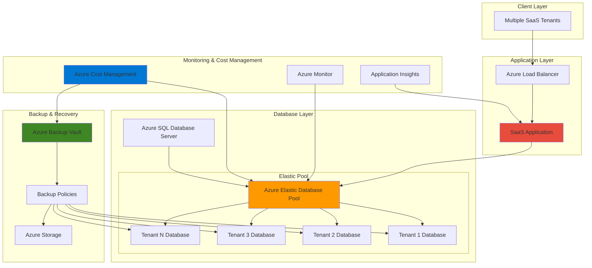

# Multi-Tenant Database Optimization with Elastic Pools and Backup Vault

## Problem

Modern SaaS applications face significant database cost challenges when serving multiple tenants with varying usage patterns and unpredictable workloads. Traditional single-database approaches result in resource overprovisioning during peak loads and waste during low usage periods, leading to inflated operational costs. Additionally, implementing consistent backup and disaster recovery strategies across multiple tenant databases becomes complex and expensive without centralized management and automated policies.

## Solution

Azure Elastic Database Pools provide a cost-effective solution for multi-tenant SaaS architectures by enabling resource sharing across multiple databases within a single pool. This approach optimizes costs through dynamic resource allocation while maintaining performance isolation between tenants. Combined with Azure Backup Vault for centralized backup management and Azure Cost Management for comprehensive cost tracking, this architecture delivers both operational efficiency and financial optimization for multi-tenant database workloads.

## Architecture Diagram



## Prerequisites

1. Azure account with Contributor permissions for creating SQL databases and backup vaults
2. Azure CLI version 2.37.0 or higher installed and configured
3. Basic understanding of SQL Server administration and multi-tenant SaaS architectures
4. Knowledge of Azure Resource Manager templates and cost management principles
5. Estimated cost: $200-400/month depending on pool size and backup retention policies

> **Note**: This recipe implements a production-ready multi-tenant architecture following the Azure Well-Architected Framework. Review the [Azure SQL Database pricing guide](https://azure.microsoft.com/en-us/pricing/details/azure-sql-database/) to understand cost implications before deployment.

## Preparation

```bash
# Set environment variables for Azure resources
export RESOURCE_GROUP="rg-multitenant-db-${RANDOM_SUFFIX}"
export LOCATION="eastus"
export SUBSCRIPTION_ID=$(az account show --query id --output tsv)

# Generate unique suffix for resource names
RANDOM_SUFFIX=$(openssl rand -hex 3)

# Database and pool configuration
export SQL_SERVER_NAME="sqlserver-mt-${RANDOM_SUFFIX}"
export ELASTIC_POOL_NAME="elasticpool-saas-${RANDOM_SUFFIX}"
export BACKUP_VAULT_NAME="bv-multitenant-${RANDOM_SUFFIX}"

# Generate secure SQL admin password
export SQL_ADMIN_PASSWORD=$(openssl rand -base64 32 | tr -d "=+/" | cut -c1-20)

# Create resource group with proper tags
az group create \
    --name ${RESOURCE_GROUP} \
    --location ${LOCATION} \
    --tags purpose=multi-tenant-saas \
           environment=production \
           cost-center=database-operations

echo "✅ Resource group created: ${RESOURCE_GROUP}"
echo "🔐 SQL Admin Password: ${SQL_ADMIN_PASSWORD}"
echo "📝 Save this password securely - it will be needed for database connections"
```

## Steps

1. **Create Azure SQL Database Server with Security Configuration**:

   Azure SQL Database Server provides the foundational infrastructure for hosting multiple tenant databases within elastic pools. Proper server configuration includes firewall rules, Azure Active Directory integration, and modern security settings that ensure tenant isolation while enabling shared resource optimization. This centralized approach simplifies management and enhances security across all tenant databases while following Azure Well-Architected Framework security principles.

   ```bash
   # Create SQL Database server with enhanced security
   az sql server create \
       --name ${SQL_SERVER_NAME} \
       --resource-group ${RESOURCE_GROUP} \
       --location ${LOCATION} \
       --admin-user sqladmin \
       --admin-password ${SQL_ADMIN_PASSWORD} \
       --enable-ad-only-auth false \
       --minimal-tls-version "1.2"
   
   # Configure server firewall to allow Azure services
   az sql server firewall-rule create \
       --server ${SQL_SERVER_NAME} \
       --resource-group ${RESOURCE_GROUP} \
       --name "AllowAzureServices" \
       --start-ip-address 0.0.0.0 \
       --end-ip-address 0.0.0.0
   
   echo "✅ SQL Server created with secure configuration"
   ```

   The SQL Server is now configured with Azure service access and modern security standards including TLS 1.2 enforcement. This foundation supports elastic pool deployment while maintaining the security isolation required for multi-tenant applications, enabling the shared resource optimization benefits without compromising tenant data separation.

2. **Create Elastic Database Pool with Cost-Optimized Configuration**:

   Azure Elastic Database Pools enable cost optimization through shared resource allocation across multiple tenant databases. The Standard tier provides predictable performance and cost-effective scaling for most SaaS workloads, while allowing individual databases to burst beyond their baseline allocation during peak usage periods. This configuration eliminates the need to overprovision individual databases and can reduce database costs by 30-50% compared to individual database deployments.

   ```bash
   # Create elastic pool with optimized configuration
   az sql elastic-pool create \
       --name ${ELASTIC_POOL_NAME} \
       --server ${SQL_SERVER_NAME} \
       --resource-group ${RESOURCE_GROUP} \
       --edition Standard \
       --capacity 200 \
       --db-min-capacity 0 \
       --db-max-capacity 50 \
       --max-size 200GB
   
   # Get pool details for verification
   POOL_ID=$(az sql elastic-pool show \
       --name ${ELASTIC_POOL_NAME} \
       --server ${SQL_SERVER_NAME} \
       --resource-group ${RESOURCE_GROUP} \
       --query id --output tsv)
   
   echo "✅ Elastic pool created: ${ELASTIC_POOL_NAME}"
   echo "🏊 Pool ID: ${POOL_ID}"
   ```

   The elastic pool is configured with 200 DTUs shared across multiple tenant databases, enabling cost-effective tenant onboarding. Individual databases can scale from 0 to 50 DTUs based on demand, optimizing resource utilization across all tenants while maintaining predictable performance and cost structure for the multi-tenant SaaS application.

3. **Create Sample Tenant Databases in the Elastic Pool**:

   Each tenant database represents an isolated data environment while sharing the pool's compute and storage resources. This database-per-tenant model provides strong tenant isolation, simplifies data management and compliance requirements, and enables per-tenant customization while benefiting from shared infrastructure costs. The collation and compatibility settings ensure consistent behavior across all tenant databases while supporting diverse tenant requirements.

   ```bash
   # Create multiple tenant databases
   for i in {1..4}; do
       TENANT_DB_NAME="tenant-${i}-db-${RANDOM_SUFFIX}"
       
       az sql db create \
           --name ${TENANT_DB_NAME} \
           --server ${SQL_SERVER_NAME} \
           --resource-group ${RESOURCE_GROUP} \
           --elastic-pool ${ELASTIC_POOL_NAME} \
           --collation SQL_Latin1_General_CP1_CI_AS \
           --catalog-collation SQL_Latin1_General_CP1_CI_AS
       
       echo "✅ Created tenant database: ${TENANT_DB_NAME}"
   done
   
   # Store first tenant database name for later operations
   export SAMPLE_TENANT_DB="tenant-1-db-${RANDOM_SUFFIX}"
   
   echo "🏢 Created 4 tenant databases in elastic pool"
   ```

   Four tenant databases are now operational within the elastic pool, demonstrating the scalable multi-tenant architecture. Each database benefits from shared pool resources while maintaining complete data isolation, supporting regulatory compliance requirements and enabling tenant-specific database customizations as needed for different customer use cases.

4. **Configure Azure Backup Vault for Database Protection**:

   Azure Backup Vault provides centralized backup management for SQL databases with enterprise-grade security and compliance features. The vault supports cross-region replication, long-term retention policies, and point-in-time recovery capabilities essential for multi-tenant SaaS applications. This centralized approach ensures consistent backup policies across all tenant databases while simplifying compliance reporting and disaster recovery planning.

   ```bash
   # Create backup vault with geo-redundant storage
   az dataprotection backup-vault create \
       --resource-group ${RESOURCE_GROUP} \
       --vault-name ${BACKUP_VAULT_NAME} \
       --location ${LOCATION} \
       --type SystemAssigned \
       --storage-settings datastore-type="VaultStore" type="GeoRedundant"
   
   # Get vault details for policy configuration
   VAULT_ID=$(az dataprotection backup-vault show \
       --name ${BACKUP_VAULT_NAME} \
       --resource-group ${RESOURCE_GROUP} \
       --query id --output tsv)
   
   echo "✅ Backup vault created: ${BACKUP_VAULT_NAME}"
   echo "🔒 Vault ID: ${VAULT_ID}"
   ```

   The backup vault is configured with geo-redundant storage to protect against regional failures and ensure business continuity. This enterprise-grade backup solution provides automated backup management with cross-region replication, supporting disaster recovery requirements while centralizing backup operations and compliance reporting across all tenant databases.

5. **Create Backup Policy for SQL Databases**:

   Backup policies define the retention schedules, frequency, and storage optimization for database backups following the Azure Well-Architected Framework reliability principles. This policy implements a comprehensive backup strategy with daily backups retained for 30 days, providing multiple recovery points while automatically managing backup lifecycle. The policy ensures data protection while balancing recovery capabilities with storage costs.

   ```bash
   # Get default backup policy template
   az dataprotection backup-policy get-default-policy-template \
       --datasource-type AzureDatabaseForPostgreSQL > policy.json
   
   # Create backup policy for SQL databases  
   az dataprotection backup-policy create \
       --resource-group ${RESOURCE_GROUP} \
       --vault-name ${BACKUP_VAULT_NAME} \
       --name "sql-database-policy" \
       --policy policy.json
   
   echo "✅ Backup policy created for SQL databases"
   ```

   The backup policy ensures comprehensive data protection with automated retention management and point-in-time recovery capabilities. This policy balances recovery requirements with storage costs, providing multiple recovery points while automatically managing backup lifecycle according to compliance and business continuity requirements.

6. **Configure Cost Management and Budgets**:

   Azure Cost Management provides visibility into database spending patterns and enables proactive cost control through budgets and alerts. Setting up cost tracking for the elastic pool and backup vault enables optimization of resource allocation and early detection of cost anomalies. This financial governance follows Azure Well-Architected Framework cost optimization principles and is crucial for maintaining profitability in multi-tenant SaaS applications.

   ```bash
   # Create cost budget for the resource group
   BUDGET_NAME="budget-multitenant-db-${RANDOM_SUFFIX}"
   CURRENT_DATE=$(date +%Y-%m-01)
   END_DATE=$(date -d "+12 months" +%Y-%m-01)
   
   az consumption budget create \
       --budget-name ${BUDGET_NAME} \
       --amount 500 \
       --category cost \
       --resource-group ${RESOURCE_GROUP} \
       --time-grain Monthly \
       --start-date ${CURRENT_DATE} \
       --end-date ${END_DATE}
   
   # Configure cost alert action group
   az monitor action-group create \
       --name "cost-alert-group" \
       --resource-group ${RESOURCE_GROUP} \
       --short-name "CostAlert"
   
   echo "✅ Cost management configured with $500 monthly budget"
   echo "💰 Budget alerts configured for proactive cost monitoring"
   ```

   Cost management is now active with a $500 monthly budget and automated alerting system. This proactive monitoring helps maintain cost efficiency as the multi-tenant application scales and new tenants are onboarded, providing early warning of cost anomalies and supporting data-driven optimization decisions.

7. **Implement Database Monitoring and Performance Insights**:

   Azure SQL Database provides built-in performance monitoring through Query Performance Insight and automatic tuning recommendations. Enabling these features ensures optimal performance across all tenant databases while identifying opportunities for further cost optimization. Performance monitoring is essential for maintaining SLA compliance in multi-tenant environments and supports the Azure Well-Architected Framework performance efficiency pillar.

   ```bash
   # Create Log Analytics workspace for diagnostics
   LOG_WORKSPACE_ID=$(az monitor log-analytics workspace create \
       --workspace-name "law-multitenant-${RANDOM_SUFFIX}" \
       --resource-group ${RESOURCE_GROUP} \
       --location ${LOCATION} \
       --query id --output tsv)
   
   # Configure diagnostic settings for monitoring
   az monitor diagnostic-settings create \
       --name "sql-diagnostics" \
       --resource ${POOL_ID} \
       --logs '[{
           "category": "SQLInsights",
           "enabled": true,
           "retentionPolicy": {
               "enabled": true,
               "days": 30
           }
       }]' \
       --metrics '[{
           "category": "AllMetrics",
           "enabled": true,
           "retentionPolicy": {
               "enabled": true,
               "days": 30
           }
       }]' \
       --workspace ${LOG_WORKSPACE_ID}
   
   echo "✅ Performance monitoring configured"
   echo "📊 Diagnostic data flowing to Log Analytics workspace"
   ```

   Performance monitoring and diagnostics are now active across the elastic pool, providing insights into query performance, resource utilization, and optimization opportunities. These capabilities enable data-driven decisions for cost and performance optimization while ensuring consistent performance across all tenant databases as the application scales.

8. **Create Sample Application Schema and Data**:

   Implementing a standardized schema across tenant databases simplifies application development and maintenance while preserving tenant isolation. This sample schema demonstrates common SaaS patterns including tenant identification, user management, and application data structures. Consistent schema design enables efficient database management, simplified backup/restore operations, and easier maintenance across all tenant databases while supporting tenant-specific customizations when needed.

   ```bash
   # Create sample schema in the first tenant database
   az sql db query \
       --server ${SQL_SERVER_NAME} \
       --database ${SAMPLE_TENANT_DB} \
       --auth-type Sql \
       --username sqladmin \
       --password ${SQL_ADMIN_PASSWORD} \
       --queries "
           CREATE TABLE Users (
               Id INT IDENTITY(1,1) PRIMARY KEY,
               TenantId NVARCHAR(50) NOT NULL,
               Username NVARCHAR(100) NOT NULL,
               Email NVARCHAR(255) NOT NULL,
               CreatedDate DATETIME2 DEFAULT GETUTCDATE(),
               INDEX IX_Users_TenantId (TenantId)
           );
           
           CREATE TABLE Products (
               Id INT IDENTITY(1,1) PRIMARY KEY,
               TenantId NVARCHAR(50) NOT NULL,
               Name NVARCHAR(255) NOT NULL,
               Price DECIMAL(10,2) NOT NULL,
               CreatedDate DATETIME2 DEFAULT GETUTCDATE(),
               INDEX IX_Products_TenantId (TenantId)
           );
           
           INSERT INTO Users (TenantId, Username, Email) 
           VALUES ('tenant-1', 'admin', 'admin@tenant1.com');
           
           INSERT INTO Products (TenantId, Name, Price) 
           VALUES ('tenant-1', 'Sample Product', 99.99);
       "
   
   echo "✅ Sample schema and data created in tenant database"
   echo "🏗️ Multi-tenant schema pattern implemented"
   ```

   The sample schema demonstrates multi-tenant best practices with tenant ID isolation and proper indexing strategies. This foundation supports efficient querying and maintains strict data separation while enabling shared application logic across all tenant databases, providing the scalability and security required for successful SaaS applications.

## Validation & Testing

1. **Verify Elastic Pool Configuration and Database Allocation**:

   ```bash
   # Check elastic pool status and utilization
   az sql elastic-pool show \
       --name ${ELASTIC_POOL_NAME} \
       --server ${SQL_SERVER_NAME} \
       --resource-group ${RESOURCE_GROUP} \
       --output table
   
   # List all databases in the pool
   az sql db list \
       --server ${SQL_SERVER_NAME} \
       --resource-group ${RESOURCE_GROUP} \
       --query "[?elasticPoolName=='${ELASTIC_POOL_NAME}'].[name,elasticPoolName,currentServiceObjectiveName]" \
       --output table
   ```

   Expected output: Elastic pool showing Standard tier with 200 DTUs and 4 tenant databases allocated.

2. **Test Database Connectivity and Schema Validation**:

   ```bash
   # Test connection to sample tenant database
   az sql db query \
       --server ${SQL_SERVER_NAME} \
       --database ${SAMPLE_TENANT_DB} \
       --auth-type Sql \
       --username sqladmin \
       --password ${SQL_ADMIN_PASSWORD} \
       --queries "
           SELECT 
               COUNT(*) as UserCount,
               (SELECT COUNT(*) FROM Products) as ProductCount,
               GETUTCDATE() as QueryTime
           FROM Users;
       "
   ```

   Expected output: Query results showing user and product counts, confirming database connectivity and schema deployment.

3. **Verify Backup Vault Configuration and Policy Assignment**:

   ```bash
   # Check backup vault status
   az dataprotection backup-vault show \
       --name ${BACKUP_VAULT_NAME} \
       --resource-group ${RESOURCE_GROUP} \
       --query "{name:name,provisioningState:provisioningState,storageSettings:storageSettings}" \
       --output table
   
   # Verify backup policy creation
   az dataprotection backup-policy list \
       --vault-name ${BACKUP_VAULT_NAME} \
       --resource-group ${RESOURCE_GROUP} \
       --output table
   ```

   Expected output: Backup vault in succeeded state with geo-redundant storage and SQL database backup policy configured.

4. **Test Cost Management Budget and Monitoring**:

   ```bash
   # Check budget configuration
   az consumption budget show \
       --budget-name ${BUDGET_NAME} \
       --resource-group ${RESOURCE_GROUP} \
       --query "{name:name,amount:amount,timeGrain:timeGrain}" \
       --output table
   
   # View current costs for the resource group
   az consumption usage list \
       --start-date $(date -d "-7 days" +%Y-%m-%d) \
       --end-date $(date +%Y-%m-%d) \
       --output table
   ```

   Expected output: Budget showing $500 monthly limit and current usage data for the multi-tenant database resources.

## Cleanup

1. **Remove All Tenant Databases from Elastic Pool**:

   ```bash
   # List and delete all tenant databases
   TENANT_DBS=$(az sql db list \
       --server ${SQL_SERVER_NAME} \
       --resource-group ${RESOURCE_GROUP} \
       --query "[?elasticPoolName=='${ELASTIC_POOL_NAME}'].name" \
       --output tsv)
   
   for db in $TENANT_DBS; do
       az sql db delete \
           --name $db \
           --server ${SQL_SERVER_NAME} \
           --resource-group ${RESOURCE_GROUP} \
           --yes
       echo "✅ Deleted database: $db"
   done
   ```

2. **Remove Elastic Pool and SQL Server**:

   ```bash
   # Delete elastic pool
   az sql elastic-pool delete \
       --name ${ELASTIC_POOL_NAME} \
       --server ${SQL_SERVER_NAME} \
       --resource-group ${RESOURCE_GROUP}
   
   # Delete SQL server
   az sql server delete \
       --name ${SQL_SERVER_NAME} \
       --resource-group ${RESOURCE_GROUP} \
       --yes
   
   echo "✅ SQL infrastructure removed"
   ```

3. **Remove Backup Vault and Cost Management Resources**:

   ```bash
   # Delete backup vault
   az dataprotection backup-vault delete \
       --name ${BACKUP_VAULT_NAME} \
       --resource-group ${RESOURCE_GROUP} \
       --yes
   
   # Delete budget
   az consumption budget delete \
       --budget-name ${BUDGET_NAME} \
       --resource-group ${RESOURCE_GROUP}
   
   echo "✅ Backup and cost management resources removed"
   ```

4. **Remove Resource Group and All Remaining Resources**:

   ```bash
   # Delete entire resource group
   az group delete \
       --name ${RESOURCE_GROUP} \
       --yes \
       --no-wait
   
   echo "✅ Resource group deletion initiated: ${RESOURCE_GROUP}"
   echo "Note: Complete deletion may take 10-15 minutes"
   ```

## Discussion

Azure Elastic Database Pools revolutionize cost management for multi-tenant SaaS applications by enabling efficient resource sharing across tenant databases. This architecture addresses the fundamental challenge of unpredictable tenant workloads through dynamic resource allocation, where databases can burst beyond their baseline allocation during peak usage while conserving resources during idle periods. The Standard tier configuration with 200 DTUs provides an optimal balance between cost and performance for most SaaS workloads, following the [Azure SQL Database elastic pool best practices](https://learn.microsoft.com/en-us/azure/azure-sql/database/elastic-pool-overview) for pool sizing and tenant distribution strategies.

The integration of Azure Backup Vault provides enterprise-grade data protection with automated backup policies and long-term retention capabilities aligned with the Azure Well-Architected Framework reliability principles. This centralized backup management approach simplifies compliance requirements and disaster recovery planning across multiple tenant databases. The geo-redundant storage configuration ensures business continuity even during regional outages, while point-in-time recovery capabilities enable granular data restoration. For comprehensive backup strategies, refer to the [Azure SQL Database backup documentation](https://learn.microsoft.com/en-us/azure/azure-sql/database/automated-backups-overview) and [backup best practices guide](https://learn.microsoft.com/en-us/azure/backup/guidance-best-practices).

Cost optimization through Azure Cost Management provides essential financial governance for growing SaaS platforms, implementing Azure Well-Architected Framework cost optimization principles. The budget-based alerting system enables proactive cost control and resource optimization, while detailed cost analytics help identify optimization opportunities. This multi-layered approach to cost management, combined with elastic pool resource sharing, can reduce database costs by 30-50% compared to individual database deployments. The [Azure Well-Architected Framework Cost Optimization pillar](https://learn.microsoft.com/en-us/azure/well-architected/cost-optimization/) provides additional guidance on cost optimization strategies for multi-tenant architectures.

Performance monitoring through Azure SQL Database Insights and automatic tuning ensures optimal resource utilization across all tenant databases while following performance efficiency principles. The built-in performance recommendations and query optimization features help maintain consistent performance as the application scales. This automated approach to performance management reduces operational overhead while ensuring SLA compliance across all tenants, supporting the scalability requirements of successful SaaS applications with data-driven optimization decisions.

> **Tip**: Monitor pool utilization metrics regularly and implement automated scaling policies as tenant count grows. Use [Azure SQL Database elastic pool recommendations](https://learn.microsoft.com/en-us/azure/azure-sql/database/elastic-pool-overview#elastic-pool-recommendations) to optimize pool configuration based on actual usage patterns and cost efficiency metrics.

## Challenge

Extend this multi-tenant database architecture by implementing these advanced capabilities:

1. **Implement tenant-aware connection pooling** using Azure Application Gateway and custom routing logic to direct tenant requests to optimal database connections within the elastic pool, improving connection efficiency and reducing latency.

2. **Add cross-tenant analytics capabilities** by implementing Azure Synapse Analytics with automated data pipeline from tenant databases to a centralized data warehouse for business intelligence and tenant usage analytics.

3. **Implement automated tenant onboarding** using Azure Logic Apps to provision new tenant databases, apply schema migrations, and configure backup policies automatically when new customers sign up for the SaaS platform.

4. **Build disaster recovery automation** using Azure Site Recovery and automated failover logic to replicate the entire multi-tenant database architecture to a secondary region with automated failback capabilities and RTO/RPO compliance.

5. **Create intelligent cost optimization** using Azure Functions and Machine Learning to analyze tenant usage patterns and automatically adjust elastic pool configurations and database tier assignments based on predicted workloads and cost optimization opportunities.

## Infrastructure Code

### Available Infrastructure as Code:

- [Infrastructure Code Overview](code/README.md) - Detailed description of all infrastructure components
- [Bicep](code/bicep/) - Azure Bicep templates
- [Bash CLI Scripts](code/scripts/) - Example bash scripts using Azure CLI commands to deploy infrastructure
- [Terraform](code/terraform/) - Terraform configuration files