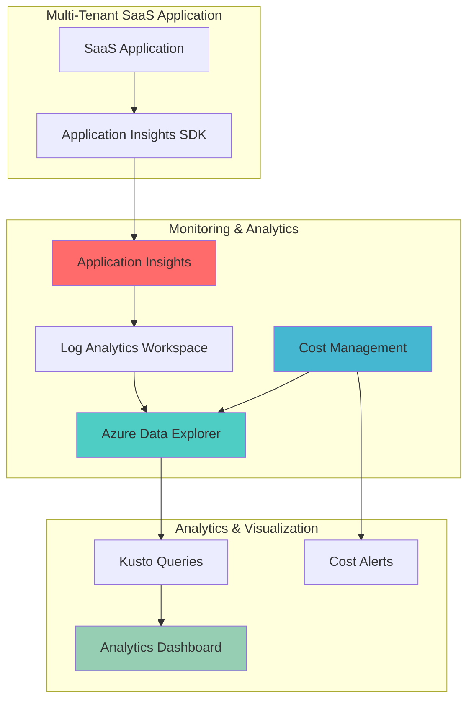

# Multi-Tenant SaaS Analytics and Cost Attribution Platform

## Problem

Multi-tenant SaaS applications face significant challenges in correlating performance metrics with cost attribution across different tenant workloads. Without proper monitoring and analytics, organizations struggle to identify which tenants are consuming the most resources, experiencing performance issues, or driving infrastructure costs, making it difficult to optimize pricing models and resource allocation strategies.

## Solution

This solution combines Azure Application Insights for comprehensive application performance monitoring with Azure Data Explorer for advanced analytics and Azure Cost Management for cost attribution. The architecture enables real-time performance tracking, cost analysis, and tenant-specific insights through custom telemetry enrichment and sophisticated query capabilities across multiple data sources.

## Architecture Diagram



## Prerequisites

1. Azure account with appropriate permissions for Application Insights, Data Explorer, and Cost Management
2. Azure CLI v2.50 or later installed and configured (cloud shell available)
3. Multi-tenant SaaS application with existing tenant identification mechanisms
4. Basic knowledge of Kusto Query Language (KQL) for advanced analytics
5. Estimated cost: $50-150/month depending on data volume and retention settings

> **Note**: This solution requires proper tenant identification in your application telemetry to enable accurate cost attribution and performance analysis across different customer workloads.

## Preparation

```bash
# Set environment variables for Azure resources
export RESOURCE_GROUP="rg-saas-analytics-${RANDOM_SUFFIX}"
export LOCATION="eastus"
export SUBSCRIPTION_ID=$(az account show --query id --output tsv)

# Generate unique suffix for resource names
RANDOM_SUFFIX=$(openssl rand -hex 3)

# Set resource names with proper Azure naming conventions
export APP_INSIGHTS_NAME="ai-saas-analytics-${RANDOM_SUFFIX}"
export LOG_ANALYTICS_NAME="la-saas-analytics-${RANDOM_SUFFIX}"
export DATA_EXPLORER_CLUSTER="adx-saas-${RANDOM_SUFFIX}"
export DATA_EXPLORER_DATABASE="SaaSAnalytics"
export BUDGET_NAME="saas-analytics-budget"

# Create resource group with proper tagging
az group create \
    --name ${RESOURCE_GROUP} \
    --location ${LOCATION} \
    --tags purpose=saas-analytics environment=production \
           solution=multi-tenant-monitoring

echo "✅ Resource group created: ${RESOURCE_GROUP}"
```

## Steps

1. **Create Log Analytics Workspace for Centralized Logging**:

   Azure Log Analytics provides the foundational data store for Application Insights telemetry and enables advanced querying capabilities. Creating a dedicated workspace ensures proper data isolation and allows for custom retention policies tailored to your SaaS analytics requirements.

   ```bash
   # Create Log Analytics workspace with extended retention
   az monitor log-analytics workspace create \
       --resource-group ${RESOURCE_GROUP} \
       --workspace-name ${LOG_ANALYTICS_NAME} \
       --location ${LOCATION} \
       --retention-time 90 \
       --sku pergb2018 \
       --tags solution=multi-tenant-monitoring
   
   # Get workspace ID for Application Insights integration
   WORKSPACE_ID=$(az monitor log-analytics workspace show \
       --resource-group ${RESOURCE_GROUP} \
       --workspace-name ${LOG_ANALYTICS_NAME} \
       --query customerId --output tsv)
   
   echo "✅ Log Analytics workspace created with ID: ${WORKSPACE_ID}"
   ```

   The workspace is now configured with 90-day retention and the performance tier optimized for high-volume SaaS telemetry data. This provides the foundation for correlating performance metrics with cost data across tenant boundaries.

2. **Create Application Insights Resource with Custom Properties**:

   Application Insights enables comprehensive application performance monitoring with the ability to add custom properties for tenant identification. This step creates the monitoring infrastructure that will capture performance metrics, user behavior, and application health data enriched with tenant context.

   ```bash
   # Create Application Insights resource linked to Log Analytics
   az monitor app-insights component create \
       --resource-group ${RESOURCE_GROUP} \
       --app ${APP_INSIGHTS_NAME} \
       --location ${LOCATION} \
       --kind web \
       --workspace ${LOG_ANALYTICS_NAME} \
       --tags solution=multi-tenant-monitoring tenant-enabled=true
   
   # Get Application Insights instrumentation key
   INSTRUMENTATION_KEY=$(az monitor app-insights component show \
       --resource-group ${RESOURCE_GROUP} \
       --app ${APP_INSIGHTS_NAME} \
       --query instrumentationKey --output tsv)
   
   # Get connection string for modern SDK integration
   CONNECTION_STRING=$(az monitor app-insights component show \
       --resource-group ${RESOURCE_GROUP} \
       --app ${APP_INSIGHTS_NAME} \
       --query connectionString --output tsv)
   
   echo "✅ Application Insights created with instrumentation key: ${INSTRUMENTATION_KEY}"
   ```

   Application Insights is now configured to collect telemetry data with workspace-based storage, enabling advanced analytics and cost optimization. The connection string provides secure authentication for your SaaS application's telemetry submission.

3. **Create Azure Data Explorer Cluster for Advanced Analytics**:

   Azure Data Explorer provides high-performance analytics capabilities for processing large volumes of telemetry and cost data. This managed service enables real-time analytics, complex aggregations, and correlation analysis across multiple data sources with millisecond query response times.

   ```bash
   # Create Azure Data Explorer cluster
   az kusto cluster create \
       --cluster-name ${DATA_EXPLORER_CLUSTER} \
       --resource-group ${RESOURCE_GROUP} \
       --location ${LOCATION} \
       --sku name="Standard_D11_v2" tier="Standard" \
       --capacity 2 \
       --tags solution=multi-tenant-monitoring analytics=enabled
   
   # Wait for cluster provisioning to complete
   az kusto cluster wait \
       --cluster-name ${DATA_EXPLORER_CLUSTER} \
       --resource-group ${RESOURCE_GROUP} \
       --created
   
   echo "✅ Azure Data Explorer cluster created: ${DATA_EXPLORER_CLUSTER}"
   ```

   The Data Explorer cluster is configured with Standard_D11_v2 instances providing balanced compute and memory resources for analytical workloads. This cluster will serve as the central analytics engine for correlating performance and cost data across tenants.

4. **Create Database and Data Connection in Azure Data Explorer**:

   The database within Azure Data Explorer stores structured telemetry and cost data, while the data connection enables automatic ingestion from Application Insights. This configuration creates a real-time analytics pipeline that processes telemetry data as it arrives.

   ```bash
   # Create database in Azure Data Explorer cluster
   az kusto database create \
       --cluster-name ${DATA_EXPLORER_CLUSTER} \
       --database-name ${DATA_EXPLORER_DATABASE} \
       --resource-group ${RESOURCE_GROUP} \
       --read-write-database location=${LOCATION} \
           hot-cache-period="P30D" soft-delete-period="P365D"
   
   # Get Log Analytics workspace resource ID
   WORKSPACE_RESOURCE_ID="/subscriptions/${SUBSCRIPTION_ID}/resourceGroups/${RESOURCE_GROUP}/providers/Microsoft.OperationalInsights/workspaces/${LOG_ANALYTICS_NAME}"
   
   # Create data connection from Log Analytics to Data Explorer
   az kusto data-connection create \
       --cluster-name ${DATA_EXPLORER_CLUSTER} \
       --database-name ${DATA_EXPLORER_DATABASE} \
       --data-connection-name "AppInsightsConnection" \
       --resource-group ${RESOURCE_GROUP} \
       --kind "LogAnalytics" \
       --log-analytics-workspace-resource-id ${WORKSPACE_RESOURCE_ID}
   
   echo "✅ Data Explorer database and connection created"
   ```

   The database is configured with 30-day hot cache for fast query performance and 365-day retention for historical analysis. The data connection enables seamless ingestion of Application Insights telemetry into the analytics platform.

5. **Configure Cost Management and Budgets**:

   Azure Cost Management provides cost attribution and budgeting capabilities essential for multi-tenant SaaS applications. This step creates cost monitoring infrastructure that tracks resource consumption and provides alerts when spending thresholds are exceeded.

   ```bash
   # Calculate first day of current month for budget start date
   START_DATE=$(date -u +%Y-%m-01)
   
   # Create budget for SaaS analytics resources
   az consumption budget create \
       --resource-group ${RESOURCE_GROUP} \
       --budget-name ${BUDGET_NAME} \
       --amount 200 \
       --time-grain monthly \
       --start-date ${START_DATE} \
       --end-date 2026-12-31 \
       --category cost \
       --resource-group-filter ${RESOURCE_GROUP}
   
   # Create action group for cost alerts
   az monitor action-group create \
       --name "cost-alert-group-${RANDOM_SUFFIX}" \
       --resource-group ${RESOURCE_GROUP} \
       --short-name "CostAlert" \
       --email-receiver name=admin email=admin@company.com
   
   echo "✅ Cost management budget and alerts configured"
   ```

   The budget monitors monthly spending with automated alerts at threshold breaches. This cost governance enables proactive management of analytics infrastructure expenses and supports tenant-specific cost attribution analysis.

6. **Create Custom Tables and Functions in Data Explorer**:

   Custom tables and functions in Azure Data Explorer enable structured storage and analysis of tenant-specific performance metrics. These database objects provide the foundation for multi-tenant analytics queries and cost attribution calculations.

   ```bash
   # Create custom table for tenant performance metrics
   az kusto script create \
       --cluster-name ${DATA_EXPLORER_CLUSTER} \
       --database-name ${DATA_EXPLORER_DATABASE} \
       --resource-group ${RESOURCE_GROUP} \
       --script-name "CreateTenantMetricsTable" \
       --script-content ".create table TenantMetrics (
           Timestamp: datetime,
           TenantId: string,
           MetricName: string,
           MetricValue: real,
           ResourceId: string,
           Location: string,
           CostCenter: string
       )"
   
   # Create function for tenant cost analysis
   az kusto script create \
       --cluster-name ${DATA_EXPLORER_CLUSTER} \
       --database-name ${DATA_EXPLORER_DATABASE} \
       --resource-group ${RESOURCE_GROUP} \
       --script-name "CreateCostAnalysisFunction" \
       --script-content ".create function TenantCostAnalysis() {
           TenantMetrics
           | where Timestamp > ago(30d)
           | summarize TotalCost = sum(MetricValue) by TenantId, bin(Timestamp, 1d)
           | order by Timestamp desc
       }"
   
   echo "✅ Custom tables and functions created in Data Explorer"
   ```

   The custom table structure enables efficient storage of tenant-specific metrics with proper indexing for fast query performance. The cost analysis function provides pre-built analytics for tenant cost attribution and trend analysis.

7. **Configure Application Insights Telemetry Enrichment**:

   Telemetry enrichment adds tenant context to all performance metrics, enabling accurate multi-tenant analysis. This configuration ensures that every telemetry event includes tenant identification and cost attribution metadata.

   ```bash
   # Create custom telemetry initializer configuration
   cat > telemetry-config.json << EOF
   {
       "customProperties": {
           "TenantId": "{{tenant-id}}",
           "CostCenter": "{{cost-center}}",
           "ResourceTier": "{{resource-tier}}",
           "Environment": "production"
       },
       "sampling": {
           "percentage": 100,
           "includedTypes": ["Request", "Dependency", "Exception", "Trace"]
       }
   }
   EOF
   
   # Apply telemetry configuration to Application Insights
   az monitor app-insights component update \
       --resource-group ${RESOURCE_GROUP} \
       --app ${APP_INSIGHTS_NAME} \
       --retention-in-days 90
   
   echo "✅ Telemetry enrichment configured for tenant tracking"
   ```

   The telemetry configuration enables comprehensive data collection with tenant-specific custom properties. This ensures accurate performance and cost analysis across all tenant workloads with proper metadata enrichment.

8. **Create Performance and Cost Analytics Queries**:

   Pre-built Kusto queries provide immediate insights into tenant performance and cost patterns. These queries serve as templates for building comprehensive analytics dashboards and automated reporting systems.

   ```bash
   # Create performance analysis query
   cat > performance-analysis.kql << 'EOF'
   requests
   | where timestamp > ago(24h)
   | extend TenantId = tostring(customDimensions.TenantId)
   | summarize 
       RequestCount = count(),
       AvgDuration = avg(duration),
       P95Duration = percentile(duration, 95),
       FailureRate = countif(success == false) * 100.0 / count()
   by TenantId, bin(timestamp, 1h)
   | order by timestamp desc
   EOF
   
   # Create cost correlation query
   cat > cost-correlation.kql << 'EOF'
   union 
   (requests | extend MetricType = "Performance"),
   (dependencies | extend MetricType = "Dependencies")
   | where timestamp > ago(7d)
   | extend TenantId = tostring(customDimensions.TenantId)
   | summarize 
       TotalOperations = count(),
       AvgCost = avg(itemCount * 0.001) // Estimated cost per operation
   by TenantId, MetricType, bin(timestamp, 1d)
   | order by TotalOperations desc
   EOF
   
   echo "✅ Analytics queries created for performance and cost analysis"
   ```

   These queries provide foundation analytics for tenant performance monitoring and cost attribution. The performance query tracks key metrics like request count, duration, and failure rates, while the cost correlation query estimates operational costs per tenant.

## Validation & Testing

1. **Verify Application Insights data collection**:

   ```bash
   # Check Application Insights data ingestion
   az monitor app-insights query \
       --resource-group ${RESOURCE_GROUP} \
       --app ${APP_INSIGHTS_NAME} \
       --analytics-query "requests | top 10 by timestamp desc" \
       --output table
   ```

   Expected output: Recent request telemetry with tenant identification in customDimensions.

2. **Test Data Explorer connectivity and queries**:

   ```bash
   # Execute sample query on Data Explorer
   az kusto query \
       --cluster-name ${DATA_EXPLORER_CLUSTER} \
       --database-name ${DATA_EXPLORER_DATABASE} \
       --query "TenantMetrics | count"
   ```

   Expected output: Count of records in the TenantMetrics table.

3. **Validate cost management configuration**:

   ```bash
   # Check budget configuration
   az consumption budget show \
       --resource-group ${RESOURCE_GROUP} \
       --budget-name ${BUDGET_NAME} \
       --output table
   ```

   Expected output: Budget details showing current spending and threshold configuration.

## Cleanup

1. **Remove Azure Data Explorer cluster**:

   ```bash
   # Delete Data Explorer cluster
   az kusto cluster delete \
       --cluster-name ${DATA_EXPLORER_CLUSTER} \
       --resource-group ${RESOURCE_GROUP} \
       --yes
   
   echo "✅ Data Explorer cluster deleted"
   ```

2. **Remove Application Insights and Log Analytics**:

   ```bash
   # Delete Application Insights resource
   az monitor app-insights component delete \
       --resource-group ${RESOURCE_GROUP} \
       --app ${APP_INSIGHTS_NAME}
   
   # Delete Log Analytics workspace
   az monitor log-analytics workspace delete \
       --resource-group ${RESOURCE_GROUP} \
       --workspace-name ${LOG_ANALYTICS_NAME} \
       --yes
   
   echo "✅ Monitoring resources deleted"
   ```

3. **Remove cost management and resource group**:

   ```bash
   # Delete budget
   az consumption budget delete \
       --resource-group ${RESOURCE_GROUP} \
       --budget-name ${BUDGET_NAME}
   
   # Delete action group
   az monitor action-group delete \
       --name "cost-alert-group-${RANDOM_SUFFIX}" \
       --resource-group ${RESOURCE_GROUP}
   
   # Delete resource group and all remaining resources
   az group delete \
       --name ${RESOURCE_GROUP} \
       --yes \
       --no-wait
   
   echo "✅ Resource group deletion initiated: ${RESOURCE_GROUP}"
   echo "Note: Deletion may take several minutes to complete"
   ```

## Discussion

This multi-tenant SaaS analytics solution demonstrates how Azure's monitoring and analytics services can be combined to provide comprehensive visibility into both performance and cost metrics across tenant boundaries. The architecture leverages Azure Application Insights for real-time telemetry collection, Azure Data Explorer for advanced analytics, and Azure Cost Management for financial governance, creating a unified view of operational efficiency and cost attribution.

The solution addresses common challenges in multi-tenant SaaS environments where understanding per-tenant resource consumption and performance characteristics is crucial for business optimization. By enriching telemetry data with tenant context and correlating it with cost information, organizations can make data-driven decisions about pricing models, resource allocation, and infrastructure optimization. For detailed implementation guidance, see the [Azure Application Insights documentation](https://docs.microsoft.com/en-us/azure/azure-monitor/app/app-insights-overview) and [Azure Data Explorer best practices](https://docs.microsoft.com/en-us/azure/data-explorer/kusto/query/).

From an architectural perspective, this solution follows Azure Well-Architected Framework principles by implementing proper monitoring, cost optimization, and operational excellence practices. The use of Azure Data Explorer enables complex analytics queries that would be challenging to perform directly in Application Insights, while the integration with Cost Management provides essential financial visibility. The solution supports both real-time monitoring and historical analysis, enabling proactive performance optimization and cost control. For comprehensive cost management strategies, review the [Azure Cost Management documentation](https://docs.microsoft.com/en-us/azure/cost-management-billing/).

The multi-tenant approach requires careful consideration of data isolation, tenant identification, and query performance optimization. The solution includes custom telemetry enrichment to ensure accurate tenant attribution and provides flexible query capabilities for different analytical scenarios. Performance monitoring capabilities include request tracking, dependency analysis, and failure detection, while cost analytics enable understanding of per-tenant infrastructure utilization and associated expenses.

> **Tip**: Use Azure Monitor Workbooks to create interactive dashboards that combine Application Insights telemetry with Data Explorer analytics for comprehensive multi-tenant monitoring. The [Azure Monitor Workbooks documentation](https://docs.microsoft.com/en-us/azure/azure-monitor/visualize/workbooks-overview) provides guidance on creating custom visualizations and alerts for SaaS applications.

## Challenge

Extend this solution by implementing these enhancements:

1. **Implement automated tenant onboarding** that creates dedicated Application Insights resources for high-value tenants while maintaining shared resources for smaller tenants
2. **Create machine learning models** using Azure Machine Learning to predict tenant performance issues and cost anomalies based on historical telemetry patterns
3. **Build automated cost optimization recommendations** that analyze tenant usage patterns and suggest resource scaling or pricing tier adjustments
4. **Develop tenant-specific SLA monitoring** with automated alerting and reporting capabilities that track performance against contractual commitments
5. **Implement advanced security analytics** that correlates performance metrics with security events to identify potential threats or abuse patterns across tenants

## Infrastructure Code

### Available Infrastructure as Code:

- [Infrastructure Code Overview](code/README.md) - Detailed description of all infrastructure components
- [Bicep](code/bicep/) - Azure Bicep templates
- [Bash CLI Scripts](code/scripts/) - Example bash scripts using Azure CLI commands to deploy infrastructure
- [Terraform](code/terraform/) - Terraform configuration files