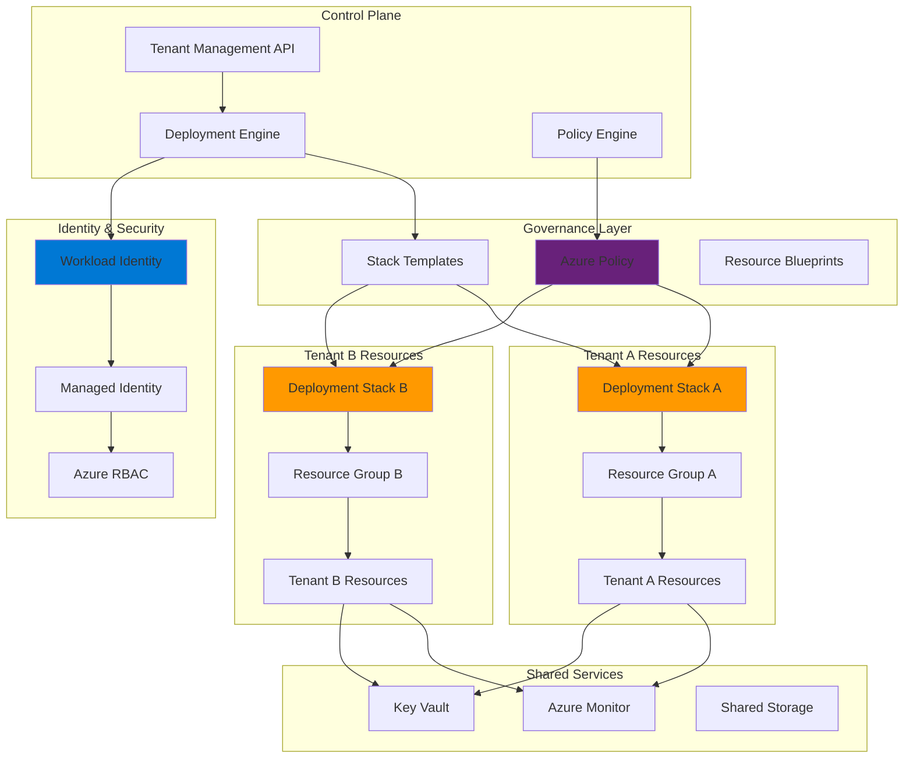

# Multi-Tenant SaaS Isolation with Resource Governance

## Problem

SaaS providers struggle with creating secure, scalable multi-tenant architectures that provide strong tenant isolation while maintaining operational efficiency. Traditional approaches to resource isolation often result in operational overhead, inconsistent security policies, and complex tenant provisioning processes. Without proper isolation boundaries and automated governance, tenant data and resources can become vulnerable to cross-tenant access violations, making it difficult to meet compliance requirements and maintain customer trust.

## Solution

Azure Deployment Stacks combined with Azure Workload Identity provides a comprehensive solution for multi-tenant SaaS resource isolation. Deployment Stacks enable declarative resource management with built-in governance and lifecycle management, while Workload Identity ensures secure service-to-service authentication without secrets. This architecture automatically provisions isolated tenant environments with consistent security policies and enables seamless tenant onboarding and offboarding.

## Architecture Diagram



## Prerequisites

1. Azure subscription with Owner or Contributor permissions for resource creation
2. Azure CLI v2.45.0 or later installed and configured (or Azure Cloud Shell)
3. Understanding of Azure Resource Manager templates and multi-tenant architecture patterns
4. Familiarity with Azure Policy and governance concepts
5. Basic knowledge of OAuth 2.0 and OpenID Connect protocols
6. Estimated cost: $50-100 per tenant per month (varies by resource consumption)

> **Note**: This recipe requires advanced Azure permissions and demonstrates enterprise-grade multi-tenant patterns. Review the [Azure Well-Architected Framework](https://docs.microsoft.com/en-us/azure/architecture/framework/) for additional guidance on scalable architectures.

## Preparation

```bash
# Set environment variables for the multi-tenant SaaS solution
export RESOURCE_GROUP="rg-saas-control-plane"
export LOCATION="eastus"
export SUBSCRIPTION_ID=$(az account show --query id --output tsv)
export TENANT_ID=$(az account show --query tenantId --output tsv)

# Generate unique suffix for resource names
RANDOM_SUFFIX=$(openssl rand -hex 3)
export SAAS_PREFIX="saas${RANDOM_SUFFIX}"

# Create control plane resource group
az group create \
    --name ${RESOURCE_GROUP} \
    --location ${LOCATION} \
    --tags purpose=saas-control-plane environment=production

# Create shared Key Vault for secrets management
az keyvault create \
    --name kv-${SAAS_PREFIX} \
    --resource-group ${RESOURCE_GROUP} \
    --location ${LOCATION} \
    --sku standard \
    --enable-rbac-authorization true

# Create managed identity for deployment operations
az identity create \
    --name mi-deployment-${SAAS_PREFIX} \
    --resource-group ${RESOURCE_GROUP} \
    --location ${LOCATION}

export DEPLOYMENT_MI_ID=$(az identity show \
    --name mi-deployment-${SAAS_PREFIX} \
    --resource-group ${RESOURCE_GROUP} \
    --query id --output tsv)

export DEPLOYMENT_MI_CLIENT_ID=$(az identity show \
    --name mi-deployment-${SAAS_PREFIX} \
    --resource-group ${RESOURCE_GROUP} \
    --query clientId --output tsv)

echo "✅ Control plane infrastructure created"
```

## Steps

1. **Create Azure Policy Definitions for Tenant Isolation**:

   Azure Policy provides declarative governance capabilities that ensure consistent security and compliance across all tenant resources. By defining policies at the management group or subscription level, we establish guardrails that automatically enforce tenant isolation rules and prevent configuration drift. This governance-first approach ensures that all tenant resources adhere to organizational security standards regardless of how they're deployed.

   ```bash
   # Create custom policy for tenant resource tagging
   cat > tenant-tagging-policy.json << 'EOF'
   {
     "mode": "All",
     "policyRule": {
       "if": {
         "allOf": [
           {
             "field": "type",
             "notIn": [
               "Microsoft.Resources/resourceGroups",
               "Microsoft.Resources/subscriptions"
             ]
           },
           {
             "anyOf": [
               {
                 "field": "tags['TenantId']",
                 "exists": "false"
               },
               {
                 "field": "tags['Environment']",
                 "exists": "false"
               }
             ]
           }
         ]
       },
       "then": {
         "effect": "deny"
       }
     },
     "parameters": {}
   }
   EOF
   
   # Create policy definition
   az policy definition create \
       --name "require-tenant-tags" \
       --display-name "Require Tenant Tags" \
       --description "Ensures all resources have required tenant identification tags" \
       --rules tenant-tagging-policy.json \
       --mode All
   
   # Create network isolation policy
   cat > network-isolation-policy.json << 'EOF'
   {
     "mode": "All",
     "policyRule": {
       "if": {
         "allOf": [
           {
             "field": "type",
             "equals": "Microsoft.Network/virtualNetworks"
           },
           {
             "field": "Microsoft.Network/virtualNetworks/subnets[*].networkSecurityGroup.id",
             "exists": "false"
           }
         ]
       },
       "then": {
         "effect": "deny"
       }
     }
   }
   EOF
   
   az policy definition create \
       --name "require-network-security-groups" \
       --display-name "Require Network Security Groups" \
       --description "Ensures all virtual networks have network security groups" \
       --rules network-isolation-policy.json \
       --mode All
   
   echo "✅ Azure Policy definitions created for tenant isolation"
   ```

   These policies create foundational governance rules that automatically enforce tenant isolation requirements. The tagging policy ensures every resource can be traced to its tenant, while the network policy enforces security group requirements for network isolation.

2. **Configure Workload Identity for Tenant-Specific Authentication**:

   Azure Workload Identity eliminates the need for secrets-based authentication by providing secure, token-based access to Azure resources. This federated identity approach enables tenant-specific workloads to authenticate using JWT tokens, improving security posture while simplifying credential management. Each tenant's workload identity is scoped to access only their designated resources.

   ```bash
   # Create workload identity for tenant operations
   az ad app create \
       --display-name "SaaS-Tenant-Workload-${SAAS_PREFIX}" \
       --sign-in-audience AzureADMyOrg
   
   export WORKLOAD_APP_ID=$(az ad app list \
       --display-name "SaaS-Tenant-Workload-${SAAS_PREFIX}" \
       --query '[0].appId' --output tsv)
   
   # Create service principal for the workload identity
   az ad sp create \
       --id ${WORKLOAD_APP_ID}
   
   export WORKLOAD_SP_ID=$(az ad sp show \
       --id ${WORKLOAD_APP_ID} \
       --query id --output tsv)
   
   # Configure federated identity credentials for workload identity
   cat > federated-credential.json << EOF
   {
     "name": "tenant-workload-federation",
     "issuer": "https://sts.windows.net/${TENANT_ID}/",
     "subject": "system:serviceaccount:tenant-namespace:tenant-workload",
     "description": "Federated identity for tenant workload",
     "audiences": ["api://AzureADTokenExchange"]
   }
   EOF
   
   az ad app federated-credential create \
       --id ${WORKLOAD_APP_ID} \
       --parameters federated-credential.json
   
   # Grant necessary permissions to the workload identity
   az role assignment create \
       --assignee ${WORKLOAD_SP_ID} \
       --role "Deployment Stack Contributor" \
       --scope /subscriptions/${SUBSCRIPTION_ID}
   
   echo "✅ Workload identity configured for tenant authentication"
   ```

   The workload identity is now configured with federated credentials that enable secure, keyless authentication. This setup allows tenant workloads to authenticate using tokens instead of stored secrets, significantly improving the security posture of the multi-tenant architecture.

3. **Create Deployment Stack Templates for Tenant Isolation**:

   Azure Deployment Stacks provide declarative resource lifecycle management with built-in governance and dependency tracking. Unlike traditional ARM templates, Deployment Stacks maintain state awareness and can automatically manage resource updates, deletions, and policy compliance. This approach ensures consistent tenant resource provisioning while enabling automated governance and compliance reporting.

   ```bash
   # Create base tenant deployment stack template
   cat > tenant-stack-template.json << 'EOF'
   {
     "$schema": "https://schema.management.azure.com/schemas/2019-04-01/deploymentTemplate.json#",
     "contentVersion": "1.0.0.0",
     "parameters": {
       "tenantId": {
         "type": "string",
         "metadata": {
           "description": "Unique identifier for the tenant"
         }
       },
       "tenantName": {
         "type": "string",
         "metadata": {
           "description": "Display name for the tenant"
         }
       },
       "environment": {
         "type": "string",
         "defaultValue": "production",
         "allowedValues": ["development", "staging", "production"]
       },
       "location": {
         "type": "string",
         "defaultValue": "[resourceGroup().location]"
       }
     },
     "variables": {
       "resourcePrefix": "[concat('tenant-', parameters('tenantId'))]",
       "tags": {
         "TenantId": "[parameters('tenantId')]",
         "TenantName": "[parameters('tenantName')]",
         "Environment": "[parameters('environment')]",
         "ManagedBy": "DeploymentStack"
       }
     },
     "resources": [
       {
         "type": "Microsoft.Storage/storageAccounts",
         "apiVersion": "2023-01-01",
         "name": "[concat(variables('resourcePrefix'), 'storage')]",
         "location": "[parameters('location')]",
         "tags": "[variables('tags')]",
         "sku": {
           "name": "Standard_LRS"
         },
         "kind": "StorageV2",
         "properties": {
           "supportsHttpsTrafficOnly": true,
           "minimumTlsVersion": "TLS1_2",
           "allowBlobPublicAccess": false,
           "networkAcls": {
             "defaultAction": "Deny"
           }
         }
       },
       {
         "type": "Microsoft.Network/virtualNetworks",
         "apiVersion": "2023-02-01",
         "name": "[concat(variables('resourcePrefix'), '-vnet')]",
         "location": "[parameters('location')]",
         "tags": "[variables('tags')]",
         "properties": {
           "addressSpace": {
             "addressPrefixes": [
               "10.0.0.0/16"
             ]
           },
           "subnets": [
             {
               "name": "tenant-subnet",
               "properties": {
                 "addressPrefix": "10.0.1.0/24",
                 "networkSecurityGroup": {
                   "id": "[resourceId('Microsoft.Network/networkSecurityGroups', concat(variables('resourcePrefix'), '-nsg'))]"
                 }
               }
             }
           ]
         },
         "dependsOn": [
           "[resourceId('Microsoft.Network/networkSecurityGroups', concat(variables('resourcePrefix'), '-nsg'))]"
         ]
       },
       {
         "type": "Microsoft.Network/networkSecurityGroups",
         "apiVersion": "2023-02-01",
         "name": "[concat(variables('resourcePrefix'), '-nsg')]",
         "location": "[parameters('location')]",
         "tags": "[variables('tags')]",
         "properties": {
           "securityRules": [
             {
               "name": "DenyAllInbound",
               "properties": {
                 "protocol": "*",
                 "sourceAddressPrefix": "*",
                 "sourcePortRange": "*",
                 "destinationAddressPrefix": "*",
                 "destinationPortRange": "*",
                 "access": "Deny",
                 "priority": 1000,
                 "direction": "Inbound"
               }
             }
           ]
         }
       }
     ],
     "outputs": {
       "tenantId": {
         "type": "string",
         "value": "[parameters('tenantId')]"
       },
       "storageAccountId": {
         "type": "string",
         "value": "[resourceId('Microsoft.Storage/storageAccounts', concat(variables('resourcePrefix'), 'storage'))]"
       },
       "virtualNetworkId": {
         "type": "string",
         "value": "[resourceId('Microsoft.Network/virtualNetworks', concat(variables('resourcePrefix'), '-vnet'))]"
       }
     }
   }
   EOF
   
   echo "✅ Deployment stack template created for tenant isolation"
   ```

   This template defines a complete tenant isolation boundary with dedicated storage, networking, and security resources. The template uses parameters to customize each tenant's deployment while maintaining consistent security and governance standards across all tenants.

4. **Implement Tenant Provisioning with Deployment Stacks**:

   Deployment Stacks enable automated tenant provisioning with built-in lifecycle management and governance enforcement. This approach ensures that tenant resources are created consistently, maintained properly, and can be easily updated or decommissioned. The stack-based approach provides atomic operations and rollback capabilities for tenant management.

   ```bash
   # Create function to provision a new tenant
   provision_tenant() {
       local tenant_id=$1
       local tenant_name=$2
       local environment=${3:-production}
       
       # Create tenant-specific resource group
       az group create \
           --name "rg-tenant-${tenant_id}" \
           --location ${LOCATION} \
           --tags TenantId=${tenant_id} TenantName="${tenant_name}" Environment=${environment}
       
       # Deploy tenant resources using deployment stack
       az deployment group create \
           --resource-group "rg-tenant-${tenant_id}" \
           --template-file tenant-stack-template.json \
           --parameters \
               tenantId=${tenant_id} \
               tenantName="${tenant_name}" \
               environment=${environment} \
           --name "tenant-${tenant_id}-deployment"
       
       # Assign workload identity permissions to tenant resources
       az role assignment create \
           --assignee ${WORKLOAD_SP_ID} \
           --role "Storage Blob Data Contributor" \
           --scope "/subscriptions/${SUBSCRIPTION_ID}/resourceGroups/rg-tenant-${tenant_id}"
       
       echo "✅ Tenant ${tenant_id} provisioned successfully"
   }
   
   # Provision sample tenants
   provision_tenant "tenant001" "Contoso Corp" "production"
   provision_tenant "tenant002" "Fabrikam Inc" "production"
   
   echo "✅ Sample tenants provisioned with deployment stacks"
   ```

   The tenant provisioning process creates isolated resource groups with dedicated resources for each tenant. Each tenant receives their own storage account, virtual network, and security groups, ensuring complete isolation while maintaining consistent security policies.

5. **Configure Cross-Tenant Access Controls and RBAC**:

   Role-Based Access Control (RBAC) provides fine-grained authorization for multi-tenant environments. By implementing tenant-specific roles and permissions, we ensure that users and services can only access resources within their designated tenant scope. This approach prevents cross-tenant data access and maintains strict security boundaries.

   ```bash
   # Create custom role for tenant administrators
   cat > tenant-admin-role.json << 'EOF'
   {
     "Name": "Tenant Administrator",
     "Id": null,
     "IsCustom": true,
     "Description": "Full control over tenant-specific resources",
     "Actions": [
       "Microsoft.Resources/subscriptions/resourceGroups/read",
       "Microsoft.Resources/subscriptions/resourceGroups/resources/read",
       "Microsoft.Storage/storageAccounts/*",
       "Microsoft.Network/virtualNetworks/*",
       "Microsoft.Network/networkSecurityGroups/*",
       "Microsoft.Compute/virtualMachines/*"
     ],
     "NotActions": [],
     "DataActions": [
       "Microsoft.Storage/storageAccounts/blobServices/containers/blobs/*"
     ],
     "NotDataActions": [],
     "AssignableScopes": [
       "/subscriptions/SUBSCRIPTION_ID"
     ]
   }
   EOF
   
   # Replace placeholder with actual subscription ID
   sed -i "s/SUBSCRIPTION_ID/${SUBSCRIPTION_ID}/g" tenant-admin-role.json
   
   # Create the custom role
   az role definition create \
       --role-definition tenant-admin-role.json
   
   # Create custom role for tenant users (read-only access)
   cat > tenant-user-role.json << 'EOF'
   {
     "Name": "Tenant User",
     "Id": null,
     "IsCustom": true,
     "Description": "Read-only access to tenant-specific resources",
     "Actions": [
       "Microsoft.Resources/subscriptions/resourceGroups/read",
       "Microsoft.Resources/subscriptions/resourceGroups/resources/read",
       "Microsoft.Storage/storageAccounts/read",
       "Microsoft.Network/virtualNetworks/read"
     ],
     "NotActions": [],
     "DataActions": [
       "Microsoft.Storage/storageAccounts/blobServices/containers/blobs/read"
     ],
     "NotDataActions": [],
     "AssignableScopes": [
       "/subscriptions/SUBSCRIPTION_ID"
     ]
   }
   EOF
   
   # Replace placeholder with actual subscription ID
   sed -i "s/SUBSCRIPTION_ID/${SUBSCRIPTION_ID}/g" tenant-user-role.json
   
   # Create the custom role
   az role definition create \
       --role-definition tenant-user-role.json
   
   echo "✅ Custom RBAC roles created for tenant access control"
   ```

   Custom RBAC roles ensure that tenant administrators and users have appropriate access levels while maintaining strict isolation boundaries. These roles can be assigned to users or service principals to control access to tenant-specific resources.

6. **Implement Automated Tenant Lifecycle Management**:

   Automated lifecycle management ensures consistent tenant onboarding, updates, and decommissioning processes. This approach reduces operational overhead while maintaining security and compliance standards. The automation includes tenant resource provisioning, policy enforcement, and cleanup procedures.

   ```bash
   # Create tenant lifecycle management functions
   cat > tenant-lifecycle.sh << 'EOF'
   #!/bin/bash
   
   # Function to onboard a new tenant
   onboard_tenant() {
       local tenant_id=$1
       local tenant_name=$2
       local admin_email=$3
       
       echo "🚀 Onboarding tenant: ${tenant_id}"
       
       # Create tenant resources
       provision_tenant ${tenant_id} "${tenant_name}" "production"
       
       # Apply tenant-specific policies
       az policy assignment create \
           --name "tenant-${tenant_id}-tagging" \
           --display-name "Tenant ${tenant_id} Tagging Policy" \
           --policy "require-tenant-tags" \
           --scope "/subscriptions/${SUBSCRIPTION_ID}/resourceGroups/rg-tenant-${tenant_id}"
       
       # Configure monitoring and alerts
       az monitor log-analytics workspace create \
           --resource-group "rg-tenant-${tenant_id}" \
           --workspace-name "law-tenant-${tenant_id}"
       
       # Store tenant configuration in Key Vault
       az keyvault secret set \
           --vault-name "kv-${SAAS_PREFIX}" \
           --name "tenant-${tenant_id}-config" \
           --value "{\"tenantId\":\"${tenant_id}\",\"tenantName\":\"${tenant_name}\",\"adminEmail\":\"${admin_email}\",\"status\":\"active\"}"
       
       echo "✅ Tenant ${tenant_id} onboarded successfully"
   }
   
   # Function to offboard a tenant
   offboard_tenant() {
       local tenant_id=$1
       
       echo "🔄 Offboarding tenant: ${tenant_id}"
       
       # Remove policy assignments
       az policy assignment delete \
           --name "tenant-${tenant_id}-tagging" \
           --scope "/subscriptions/${SUBSCRIPTION_ID}/resourceGroups/rg-tenant-${tenant_id}"
       
       # Delete tenant resource group and all resources
       az group delete \
           --name "rg-tenant-${tenant_id}" \
           --yes \
           --no-wait
       
       # Remove tenant configuration from Key Vault
       az keyvault secret delete \
           --vault-name "kv-${SAAS_PREFIX}" \
           --name "tenant-${tenant_id}-config"
       
       echo "✅ Tenant ${tenant_id} offboarded successfully"
   }
   
   # Function to update tenant configuration
   update_tenant() {
       local tenant_id=$1
       local updates=$2
       
       echo "🔄 Updating tenant: ${tenant_id}"
       
       # Update tenant resources using deployment stack
       az deployment group create \
           --resource-group "rg-tenant-${tenant_id}" \
           --template-file tenant-stack-template.json \
           --parameters ${updates} \
           --name "tenant-${tenant_id}-update"
       
       echo "✅ Tenant ${tenant_id} updated successfully"
   }
   EOF
   
   chmod +x tenant-lifecycle.sh
   source tenant-lifecycle.sh
   
   # Test tenant lifecycle operations
   onboard_tenant "tenant003" "Adventure Works" "admin@adventure-works.com"
   
   echo "✅ Tenant lifecycle management functions created and tested"
   ```

   The lifecycle management system provides automated functions for tenant onboarding, updates, and offboarding. This automation ensures consistent processes while maintaining security and compliance standards across all tenant operations.

7. **Configure Monitoring and Governance Reporting**:

   Comprehensive monitoring and reporting provide visibility into tenant resource usage, security compliance, and operational health. Azure Monitor and Log Analytics enable centralized logging and alerting for multi-tenant environments, while Azure Policy provides compliance reporting and governance insights.

   ```bash
   # Create shared monitoring workspace for the SaaS platform
   az monitor log-analytics workspace create \
       --resource-group ${RESOURCE_GROUP} \
       --workspace-name "law-saas-platform-${SAAS_PREFIX}" \
       --location ${LOCATION}
   
   export WORKSPACE_ID=$(az monitor log-analytics workspace show \
       --resource-group ${RESOURCE_GROUP} \
       --workspace-name "law-saas-platform-${SAAS_PREFIX}" \
       --query id --output tsv)
   
   # Create Application Insights for platform monitoring
   az monitor app-insights component create \
       --app "ai-saas-platform-${SAAS_PREFIX}" \
       --location ${LOCATION} \
       --resource-group ${RESOURCE_GROUP} \
       --workspace ${WORKSPACE_ID}
   
   # Configure diagnostic settings for tenant resources
   configure_tenant_monitoring() {
       local tenant_id=$1
       
       # Get tenant storage account ID
       local storage_account_id=$(az storage account show \
           --name "tenant${tenant_id}storage" \
           --resource-group "rg-tenant-${tenant_id}" \
           --query id --output tsv)
       
       # Configure diagnostic settings
       az monitor diagnostic-settings create \
           --resource ${storage_account_id} \
           --name "tenant-${tenant_id}-diagnostics" \
           --workspace ${WORKSPACE_ID} \
           --logs '[
               {
                   "category": "StorageRead",
                   "enabled": true,
                   "retentionPolicy": {
                       "days": 90,
                       "enabled": true
                   }
               },
               {
                   "category": "StorageWrite",
                   "enabled": true,
                   "retentionPolicy": {
                       "days": 90,
                       "enabled": true
                   }
               }
           ]' \
           --metrics '[
               {
                   "category": "Transaction",
                   "enabled": true,
                   "retentionPolicy": {
                       "days": 90,
                       "enabled": true
                   }
               }
           ]'
   }
   
   # Configure monitoring for existing tenants
   configure_tenant_monitoring "tenant001"
   configure_tenant_monitoring "tenant002"
   
   # Create custom KQL queries for tenant monitoring
   cat > tenant-monitoring-queries.kql << 'EOF'
   // Tenant resource usage summary
   AzureActivity
   | where TimeGenerated > ago(24h)
   | extend TenantId = tostring(parse_json(Properties).TenantId)
   | where isnotempty(TenantId)
   | summarize Operations = count() by TenantId, OperationName
   | order by Operations desc
   
   // Tenant security events
   AzureActivity
   | where TimeGenerated > ago(24h)
   | where ActivityStatus == "Failed"
   | extend TenantId = tostring(parse_json(Properties).TenantId)
   | where isnotempty(TenantId)
   | summarize FailedOperations = count() by TenantId, OperationName
   | order by FailedOperations desc
   
   // Storage access patterns by tenant
   StorageBlobLogs
   | where TimeGenerated > ago(24h)
   | extend TenantId = extract(@"tenant-(\w+)", 1, AccountName)
   | where isnotempty(TenantId)
   | summarize Requests = count(), DataTransferred = sum(ResponseBodySize) by TenantId
   | order by DataTransferred desc
   EOF
   
   echo "✅ Monitoring and governance reporting configured"
   ```

   The monitoring system provides comprehensive visibility into tenant operations, resource usage, and security events. Custom KQL queries enable detailed analysis of tenant behavior and help identify potential security issues or resource optimization opportunities.

## Validation & Testing

1. **Verify Tenant Isolation and Resource Deployment**:

   ```bash
   # Verify tenant resource groups exist
   az group list --query "[?contains(name, 'rg-tenant-')].{Name:name, Location:location, Tags:tags}" --output table
   
   # Check deployment stack status for each tenant
   az deployment group list \
       --resource-group "rg-tenant-tenant001" \
       --query "[].{Name:name, Status:properties.provisioningState, Timestamp:properties.timestamp}" \
       --output table
   
   # Verify tenant-specific resources are properly tagged
   az resource list \
       --resource-group "rg-tenant-tenant001" \
       --query "[].{Name:name, Type:type, TenantId:tags.TenantId}" \
       --output table
   ```

   Expected output: All tenant resources should be properly deployed with correct tags and isolation boundaries.

2. **Test Workload Identity Authentication**:

   ```bash
   # Test workload identity token acquisition
   az account get-access-token \
       --resource https://management.azure.com/ \
       --query "accessToken" \
       --output tsv | head -c 50
   
   # Verify workload identity has correct permissions
   az role assignment list \
       --assignee ${WORKLOAD_SP_ID} \
       --query "[].{Role:roleDefinitionName, Scope:scope}" \
       --output table
   
   # Test federated identity credential
   az ad app federated-credential list \
       --id ${WORKLOAD_APP_ID} \
       --query "[].{Name:name, Issuer:issuer, Subject:subject}" \
       --output table
   ```

   Expected output: Workload identity should successfully authenticate and have appropriate role assignments.

3. **Validate Policy Enforcement and Governance**:

   ```bash
   # Check policy assignments for tenant resources
   az policy assignment list \
       --scope "/subscriptions/${SUBSCRIPTION_ID}/resourceGroups/rg-tenant-tenant001" \
       --query "[].{Name:displayName, Policy:policyDefinitionId}" \
       --output table
   
   # Test policy compliance
   az policy state list \
       --resource "/subscriptions/${SUBSCRIPTION_ID}/resourceGroups/rg-tenant-tenant001" \
       --query "[].{Resource:resourceId, Compliance:complianceState}" \
       --output table
   
   # Verify tenant secrets are stored in Key Vault
   az keyvault secret list \
       --vault-name "kv-${SAAS_PREFIX}" \
       --query "[?contains(name, 'tenant-')].{Name:name, Enabled:attributes.enabled}" \
       --output table
   ```

   Expected output: All policies should be assigned and compliant, with tenant configurations stored securely.

## Cleanup

1. **Remove Tenant Resources and Deployment Stacks**:

   ```bash
   # Offboard test tenants
   offboard_tenant "tenant001"
   offboard_tenant "tenant002"
   offboard_tenant "tenant003"
   
   # Wait for tenant resource group deletions to complete
   echo "Waiting for tenant resource group deletions..."
   sleep 60
   
   echo "✅ Tenant resources removed"
   ```

2. **Clean Up Control Plane Resources**:

   ```bash
   # Remove custom policy definitions
   az policy definition delete \
       --name "require-tenant-tags"
   
   az policy definition delete \
       --name "require-network-security-groups"
   
   # Remove custom RBAC roles
   az role definition delete \
       --name "Tenant Administrator"
   
   az role definition delete \
       --name "Tenant User"
   
   # Delete workload identity application
   az ad app delete \
       --id ${WORKLOAD_APP_ID}
   
   echo "✅ Policy definitions and RBAC roles removed"
   ```

3. **Remove Control Plane Infrastructure**:

   ```bash
   # Delete control plane resource group
   az group delete \
       --name ${RESOURCE_GROUP} \
       --yes \
       --no-wait
   
   # Clean up local files
   rm -f tenant-stack-template.json
   rm -f tenant-tagging-policy.json
   rm -f network-isolation-policy.json
   rm -f federated-credential.json
   rm -f tenant-admin-role.json
   rm -f tenant-user-role.json
   rm -f tenant-lifecycle.sh
   rm -f tenant-monitoring-queries.kql
   
   echo "✅ Control plane infrastructure cleanup initiated"
   echo "Note: Resource group deletion may take several minutes to complete"
   ```

## Discussion

Azure Deployment Stacks combined with Azure Workload Identity provides a sophisticated approach to multi-tenant SaaS resource isolation that addresses the fundamental challenges of secure, scalable tenant management. This architecture pattern leverages Azure's native governance capabilities to ensure consistent security policies while enabling automated tenant lifecycle management. The combination of declarative resource management through Deployment Stacks and secrets-free authentication through Workload Identity creates a robust foundation for enterprise-grade multi-tenant solutions.

The deployment stack approach offers significant advantages over traditional ARM template deployments by maintaining state awareness and providing automatic drift detection. This capability ensures that tenant resources remain compliant with organizational policies and can be easily updated or rolled back as needed. The integration with Azure Policy provides continuous compliance monitoring and automatic remediation capabilities that are essential for maintaining security standards across hundreds or thousands of tenants. For comprehensive guidance on multi-tenant architecture patterns, see the [Azure multi-tenant architecture guide](https://docs.microsoft.com/en-us/azure/architecture/guide/multitenant/) and [Azure Well-Architected Framework security pillar](https://docs.microsoft.com/en-us/azure/architecture/framework/security/).

From an operational perspective, the workload identity pattern eliminates the security risks associated with long-lived secrets and certificates while providing fine-grained access control. This approach aligns with zero-trust security principles and enables seamless integration with CI/CD pipelines and automated deployment processes. The federated identity capabilities allow for secure cross-tenant operations without compromising isolation boundaries, making it ideal for SaaS providers who need to manage resources across multiple customer tenants. The monitoring and governance reporting capabilities provide essential visibility into tenant resource usage and security compliance, enabling proactive management and cost optimization.

The scalability characteristics of this architecture support both horizontal and vertical scaling patterns, allowing SaaS providers to grow from dozens to thousands of tenants without significant architectural changes. The policy-driven governance model ensures that new tenants automatically inherit appropriate security configurations, while the automated lifecycle management reduces operational overhead and human error. For detailed implementation guidance, review the [Azure Deployment Stacks documentation](https://docs.microsoft.com/en-us/azure/azure-resource-manager/bicep/deployment-stacks) and [Workload Identity best practices](https://docs.microsoft.com/en-us/azure/active-directory/workload-identities/workload-identity-federation).

> **Tip**: Use Azure Cost Management APIs to implement automated cost allocation and chargeback mechanisms for individual tenants. This enables transparent billing and helps identify cost optimization opportunities across your multi-tenant infrastructure. The [Azure Cost Management documentation](https://docs.microsoft.com/en-us/azure/cost-management-billing/) provides comprehensive guidance on implementing these capabilities.

## Challenge

Extend this multi-tenant SaaS architecture by implementing these advanced enhancements:

1. **Implement automated tenant scaling and capacity management** using Azure Autoscale and Azure Functions to automatically adjust tenant resources based on usage patterns and performance metrics.

2. **Create a tenant data residency compliance system** that automatically provisions tenant resources in specific geographic regions based on regulatory requirements, with automated data sovereignty validation.

3. **Develop advanced tenant analytics and insights** using Azure Synapse Analytics and Power BI to provide tenant administrators with detailed usage analytics, security insights, and cost optimization recommendations.

4. **Build a tenant backup and disaster recovery system** that automatically creates cross-region backups for tenant data and provides automated failover capabilities with configurable recovery time objectives.

5. **Implement advanced security monitoring and threat detection** using Azure Sentinel and custom security automation to detect and respond to tenant-specific security threats with automated remediation capabilities.

## Infrastructure Code

*Infrastructure code will be generated after recipe approval.*