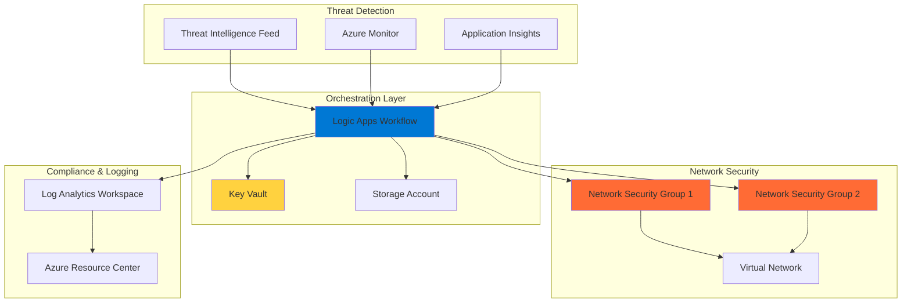

# Network Security Orchestration with Logic Apps and NSG Rules

## Problem

Enterprise networks face constant security threats requiring immediate response to protect critical infrastructure and maintain compliance. Manual network security rule updates are slow, error-prone, and cannot scale to handle the volume of modern security incidents. Organizations struggle to implement consistent security policies across distributed Azure environments while maintaining operational efficiency and reducing response times to security events.

## Solution

This solution creates an automated network security orchestration system using Azure Logic Apps to dynamically update Network Security Group rules based on threat intelligence feeds, compliance requirements, and security incidents. The system integrates with Azure Monitor for real-time event detection and Azure Key Vault for secure credential management, enabling automated threat response that maintains security posture while reducing manual intervention and improving response times.

## Architecture Diagram



## Prerequisites

1. Azure subscription with Owner or Contributor access to create and manage Logic Apps and Network Security Groups
2. Azure CLI v2.50+ installed and configured (or Azure Cloud Shell access)
3. Basic understanding of Azure networking concepts and security group rules
4. Knowledge of JSON syntax for Logic Apps workflow definitions
5. Estimated cost: $15-25 USD for 2-hour implementation and testing (includes Logic Apps consumption, storage, and compute resources)

## Preparation

```bash
# Set environment variables for Azure resources
export RESOURCE_GROUP="rg-security-orchestration-${RANDOM_SUFFIX}"
export LOCATION="eastus"
export SUBSCRIPTION_ID=$(az account show --query id --output tsv)

# Generate unique suffix for resource names
RANDOM_SUFFIX=$(openssl rand -hex 3)

# Set resource names with unique suffix
export LOGIC_APP_NAME="la-security-orchestrator-${RANDOM_SUFFIX}"
export KEY_VAULT_NAME="kv-security-${RANDOM_SUFFIX}"
export STORAGE_ACCOUNT_NAME="stsecurity${RANDOM_SUFFIX}"
export NSG_NAME="nsg-protected-${RANDOM_SUFFIX}"
export VNET_NAME="vnet-security-${RANDOM_SUFFIX}"
export LOG_ANALYTICS_NAME="law-security-${RANDOM_SUFFIX}"

# Create resource group
az group create \
    --name ${RESOURCE_GROUP} \
    --location ${LOCATION} \
    --tags purpose=security-orchestration environment=demo

echo "✅ Resource group created: ${RESOURCE_GROUP}"

# Create Log Analytics workspace for monitoring and compliance
az monitor log-analytics workspace create \
    --resource-group ${RESOURCE_GROUP} \
    --workspace-name ${LOG_ANALYTICS_NAME} \
    --location ${LOCATION} \
    --sku PerGB2018

echo "✅ Log Analytics workspace created for security monitoring"
```

## Steps

1. **Create Azure Key Vault for Secure Credential Management**:

   Azure Key Vault provides centralized, enterprise-grade security for storing sensitive information such as API keys, connection strings, and certificates used in security orchestration workflows. This managed service ensures that security credentials are protected with hardware security modules (HSMs) and provides comprehensive audit logging for compliance requirements.

   ```bash
   # Create Key Vault with advanced access policies
   az keyvault create \
       --name ${KEY_VAULT_NAME} \
       --resource-group ${RESOURCE_GROUP} \
       --location ${LOCATION} \
       --sku standard \
       --enabled-for-template-deployment true \
       --enabled-for-disk-encryption true
   
   # Store sample threat intelligence API key
   az keyvault secret set \
       --vault-name ${KEY_VAULT_NAME} \
       --name "ThreatIntelApiKey" \
       --value "sample-api-key-for-threat-feeds"
   
   echo "✅ Key Vault created with security credentials"
   ```

   The Key Vault is now configured to securely store and manage all sensitive information required for the security orchestration workflow. This foundational security component integrates with Azure Active Directory for authentication and provides audit trails essential for security compliance frameworks.

2. **Create Storage Account for Workflow State Management**:

   Azure Storage provides durable, highly available storage for maintaining workflow state information, security event logs, and compliance reports. The storage account enables the Logic Apps workflow to persist data between executions and provides a reliable audit trail for security operations and regulatory compliance.

   ```bash
   # Create storage account for workflow data
   az storage account create \
       --name ${STORAGE_ACCOUNT_NAME} \
       --resource-group ${RESOURCE_GROUP} \
       --location ${LOCATION} \
       --sku Standard_LRS \
       --kind StorageV2 \
       --access-tier Hot \
       --https-only true
   
   # Get storage account connection string
   STORAGE_CONNECTION=$(az storage account show-connection-string \
       --name ${STORAGE_ACCOUNT_NAME} \
       --resource-group ${RESOURCE_GROUP} \
       --output tsv)
   
   # Create containers for security data
   az storage container create \
       --name "security-events" \
       --connection-string "${STORAGE_CONNECTION}"
   
   az storage container create \
       --name "compliance-reports" \
       --connection-string "${STORAGE_CONNECTION}"
   
   echo "✅ Storage account configured for security workflow data"
   ```

   The storage account provides persistent storage for security event data and enables comprehensive audit trails. This configuration supports both real-time security operations and long-term compliance reporting requirements while ensuring data durability and availability.

3. **Create Virtual Network and Network Security Group Infrastructure**:

   Azure Virtual Networks provide the foundation for secure network isolation while Network Security Groups act as distributed firewalls that control network traffic at the subnet and network interface level. This infrastructure establishes the security perimeter that will be dynamically managed through automated orchestration workflows.

   ```bash
   # Create virtual network with security-focused subnets
   az network vnet create \
       --name ${VNET_NAME} \
       --resource-group ${RESOURCE_GROUP} \
       --location ${LOCATION} \
       --address-prefixes 10.0.0.0/16 \
       --subnet-name protected-subnet \
       --subnet-prefixes 10.0.1.0/24
   
   # Create Network Security Group with baseline rules
   az network nsg create \
       --name ${NSG_NAME} \
       --resource-group ${RESOURCE_GROUP} \
       --location ${LOCATION}
   
   # Add default security rules for common protocols
   az network nsg rule create \
       --nsg-name ${NSG_NAME} \
       --resource-group ${RESOURCE_GROUP} \
       --name "Allow-HTTPS-Inbound" \
       --priority 1000 \
       --direction Inbound \
       --access Allow \
       --protocol Tcp \
       --source-address-prefixes "*" \
       --destination-port-ranges 443
   
   # Associate NSG with subnet
   az network vnet subnet update \
       --vnet-name ${VNET_NAME} \
       --name protected-subnet \
       --resource-group ${RESOURCE_GROUP} \
       --network-security-group ${NSG_NAME}
   
   echo "✅ Virtual network and NSG infrastructure created"
   ```

   The network infrastructure now provides a secure foundation with baseline security rules that can be dynamically updated through automated workflows. This configuration enables granular traffic control while maintaining the flexibility to respond to emerging threats and changing security requirements.

4. **Create Logic Apps Workflow for Security Orchestration**:

   Azure Logic Apps provides a powerful low-code platform for creating sophisticated security orchestration workflows that can integrate with multiple data sources, threat intelligence feeds, and Azure services. This workflow engine enables automated decision-making and response actions based on predefined security policies and real-time threat intelligence.

   ```bash
   # Create workflow definition file
   cat > workflow-definition.json << EOF
   {
     "\$schema": "https://schema.management.azure.com/schemas/2016-06-01/Microsoft.Logic.json",
     "contentVersion": "1.0.0.0",
     "parameters": {},
     "triggers": {
       "manual": {
         "type": "Request",
         "kind": "Http",
         "inputs": {
           "schema": {
             "properties": {
               "threatType": {"type": "string"},
               "sourceIP": {"type": "string"},
               "severity": {"type": "string"},
               "action": {"type": "string"}
             },
             "type": "object"
           }
         }
       }
     },
     "actions": {
       "Parse_Security_Event": {
         "type": "ParseJson",
         "inputs": {
           "content": "@triggerBody()",
           "schema": {
             "properties": {
               "threatType": {"type": "string"},
               "sourceIP": {"type": "string"},
               "severity": {"type": "string"},
               "action": {"type": "string"}
             },
             "type": "object"
           }
         }
       }
     },
     "outputs": {}
   }
   EOF
   
   # Create Logic Apps resource with definition file
   az logic workflow create \
       --name ${LOGIC_APP_NAME} \
       --resource-group ${RESOURCE_GROUP} \
       --location ${LOCATION} \
       --definition @workflow-definition.json
   
   echo "✅ Logic Apps workflow created for security orchestration"
   ```

   The Logic Apps workflow provides a foundation for automated security response that can process security events from multiple sources and trigger appropriate network security actions. This serverless approach ensures cost-effective scaling while providing enterprise-grade reliability for critical security operations.

5. **Configure Azure Monitor Integration for Real-time Event Detection**:

   Azure Monitor provides comprehensive monitoring and alerting capabilities that enable real-time detection of security events and anomalies across Azure resources. Integrating Monitor with the Logic Apps workflow creates an automated pipeline that can respond to security incidents within seconds of detection.

   ```bash
   # Get Logic Apps callback URL first
   CALLBACK_URL=$(az logic workflow show \
       --name ${LOGIC_APP_NAME} \
       --resource-group ${RESOURCE_GROUP} \
       --query "accessEndpoint" --output tsv)
   
   # Create action group for Logic Apps integration
   az monitor action-group create \
       --name "SecurityOrchestrationActions" \
       --resource-group ${RESOURCE_GROUP} \
       --short-name "SecOrch" \
       --action webhook LogicAppsTrigger "${CALLBACK_URL}"
   
   # Create alert rule for suspicious network activity
   az monitor metrics alert create \
       --name "SuspiciousNetworkActivity" \
       --resource-group ${RESOURCE_GROUP} \
       --scopes "/subscriptions/${SUBSCRIPTION_ID}/resourceGroups/${RESOURCE_GROUP}/providers/Microsoft.Network/networkSecurityGroups/${NSG_NAME}" \
       --condition "count SecurityEvent | where EventID == 4625 > 10" \
       --window-size 5m \
       --evaluation-frequency 1m \
       --action "SecurityOrchestrationActions" \
       --description "Alert on multiple failed authentication attempts"
   
   echo "✅ Azure Monitor configured for security event detection"
   ```

   Azure Monitor now provides real-time threat detection that automatically triggers security orchestration workflows when suspicious activities are detected. This integration enables proactive security response that can prevent security incidents from escalating into major breaches.

6. **Implement Network Security Group Rule Automation**:

   This step creates the core automation logic that dynamically updates Network Security Group rules based on threat intelligence and security events. The Logic Apps workflow uses Azure REST APIs to programmatically modify network security rules, enabling rapid response to emerging threats while maintaining comprehensive audit trails.

   ```bash
   # Create advanced workflow definition with NSG automation
   cat > advanced-workflow-definition.json << EOF
   {
     "\$schema": "https://schema.management.azure.com/schemas/2016-06-01/Microsoft.Logic.json",
     "contentVersion": "1.0.0.0",
     "parameters": {},
     "triggers": {
       "manual": {
         "type": "Request",
         "kind": "Http"
       }
     },
     "actions": {
       "Parse_Security_Event": {
         "type": "ParseJson",
         "inputs": {
           "content": "@triggerBody()",
           "schema": {
             "properties": {
               "threatType": {"type": "string"},
               "sourceIP": {"type": "string"},
               "severity": {"type": "string"},
               "action": {"type": "string"}
             },
             "type": "object"
           }
         }
       },
       "Block_Malicious_IP": {
         "type": "Http",
         "inputs": {
           "method": "PUT",
           "uri": "https://management.azure.com/subscriptions/${SUBSCRIPTION_ID}/resourceGroups/${RESOURCE_GROUP}/providers/Microsoft.Network/networkSecurityGroups/${NSG_NAME}/securityRules/BlockMaliciousIP-@{rand(1000,9999)}?api-version=2023-09-01",
           "headers": {
             "Authorization": "Bearer @{listKeys(resourceId('Microsoft.ManagedIdentity/userAssignedIdentities/', '${LOGIC_APP_NAME}'), '2023-01-31').principalId}",
             "Content-Type": "application/json"
           },
           "body": {
             "properties": {
               "priority": 100,
               "direction": "Inbound",
               "access": "Deny",
               "protocol": "*",
               "sourceAddressPrefix": "@{body('Parse_Security_Event')['sourceIP']}",
               "destinationAddressPrefix": "*",
               "sourcePortRange": "*",
               "destinationPortRange": "*"
             }
           }
         }
       }
     }
   }
   EOF
   
   # Update Logic Apps definition with NSG automation actions
   az logic workflow create \
       --name ${LOGIC_APP_NAME} \
       --resource-group ${RESOURCE_GROUP} \
       --location ${LOCATION} \
       --definition @advanced-workflow-definition.json
   
   echo "✅ NSG automation logic configured in Logic Apps"
   ```

   The Logic Apps workflow now includes sophisticated automation that can dynamically create, modify, and remove Network Security Group rules based on real-time threat intelligence. This automated response capability significantly reduces the time between threat detection and network protection implementation.

7. **Configure Compliance Monitoring and Reporting**:

   Compliance monitoring ensures that all automated security actions are properly documented and auditable for regulatory requirements. This configuration creates comprehensive logging and reporting capabilities that support security compliance frameworks such as SOC 2, ISO 27001, and industry-specific regulations.

   ```bash
   # Enable diagnostic settings for Logic Apps
   az monitor diagnostic-settings create \
       --name "SecurityOrchestrationLogs" \
       --resource "/subscriptions/${SUBSCRIPTION_ID}/resourceGroups/${RESOURCE_GROUP}/providers/Microsoft.Logic/workflows/${LOGIC_APP_NAME}" \
       --workspace "/subscriptions/${SUBSCRIPTION_ID}/resourceGroups/${RESOURCE_GROUP}/providers/Microsoft.OperationalInsights/workspaces/${LOG_ANALYTICS_NAME}" \
       --logs '[{
         "category": "WorkflowRuntime",
         "enabled": true,
         "retentionPolicy": {
           "enabled": true,
           "days": 90
         }
       }]' \
       --metrics '[{
         "category": "AllMetrics",
         "enabled": true,
         "retentionPolicy": {
           "enabled": true,
           "days": 90
         }
       }]'
   
   # Create custom table for security events
   az monitor log-analytics workspace table create \
       --workspace-name ${LOG_ANALYTICS_NAME} \
       --resource-group ${RESOURCE_GROUP} \
       --name "SecurityOrchestrationEvents_CL" \
       --columns TimeGenerated=datetime ThreatType=string SourceIP=string Action=string Severity=string
   
   echo "✅ Compliance monitoring and reporting configured"
   ```

   The compliance monitoring system now provides comprehensive audit trails and automated reporting capabilities that meet enterprise security and regulatory requirements. This configuration ensures that all security orchestration activities are properly documented and easily accessible for compliance audits.

> **Warning**: Ensure proper Azure RBAC permissions are configured for the Logic Apps managed identity to modify Network Security Groups. Review the [Azure Logic Apps security documentation](https://docs.microsoft.com/en-us/azure/logic-apps/logic-apps-securing-a-logic-app) for production deployment best practices.

## Validation & Testing

1. **Verify Logic Apps Workflow Creation and Configuration**:

   ```bash
   # Check Logic Apps deployment status
   az logic workflow show \
       --name ${LOGIC_APP_NAME} \
       --resource-group ${RESOURCE_GROUP} \
       --output table
   
   # Verify workflow is enabled and accessible
   az logic workflow list \
       --resource-group ${RESOURCE_GROUP} \
       --query "[?name=='${LOGIC_APP_NAME}'].{Name:name,State:state,Location:location}" \
       --output table
   ```

   Expected output: Logic Apps workflow should show as "Enabled" state with accessible endpoint.

2. **Test Network Security Group Rule Creation**:

   ```bash
   # Get Logic Apps callback URL for testing
   CALLBACK_URL=$(az logic workflow show \
       --name ${LOGIC_APP_NAME} \
       --resource-group ${RESOURCE_GROUP} \
       --query "accessEndpoint" --output tsv)
   
   # Trigger Logic Apps workflow with test security event
   curl -X POST \
       "${CALLBACK_URL}" \
       -H "Content-Type: application/json" \
       -d '{
         "threatType": "malicious_ip",
         "sourceIP": "192.168.1.100",
         "severity": "high",
         "action": "block"
       }'
   
   # Wait for processing
   sleep 30
   
   # List NSG rules to verify creation
   az network nsg rule list \
       --nsg-name ${NSG_NAME} \
       --resource-group ${RESOURCE_GROUP} \
       --output table
   ```

   Expected output: New security rule should be created in the NSG with deny action for the specified IP address.

3. **Validate Monitoring and Logging Integration**:

   ```bash
   # Check Log Analytics workspace logs
   az monitor log-analytics query \
       --workspace "/subscriptions/${SUBSCRIPTION_ID}/resourceGroups/${RESOURCE_GROUP}/providers/Microsoft.OperationalInsights/workspaces/${LOG_ANALYTICS_NAME}" \
       --analytics-query "SecurityOrchestrationEvents_CL | take 10" \
       --output table
   
   # Verify diagnostic settings are active
   az monitor diagnostic-settings list \
       --resource "/subscriptions/${SUBSCRIPTION_ID}/resourceGroups/${RESOURCE_GROUP}/providers/Microsoft.Logic/workflows/${LOGIC_APP_NAME}" \
       --output table
   ```

   Expected output: Log Analytics should show security orchestration events and diagnostic settings should be enabled.

## Cleanup

1. **Remove Logic Apps and Associated Resources**:

   ```bash
   # Delete Logic Apps workflow
   az logic workflow delete \
       --name ${LOGIC_APP_NAME} \
       --resource-group ${RESOURCE_GROUP} \
       --yes
   
   echo "✅ Logic Apps workflow deleted"
   ```

2. **Remove Network Security Infrastructure**:

   ```bash
   # Delete Network Security Group
   az network nsg delete \
       --name ${NSG_NAME} \
       --resource-group ${RESOURCE_GROUP}
   
   # Delete Virtual Network
   az network vnet delete \
       --name ${VNET_NAME} \
       --resource-group ${RESOURCE_GROUP}
   
   echo "✅ Network infrastructure deleted"
   ```

3. **Remove Storage and Security Resources**:

   ```bash
   # Delete storage account
   az storage account delete \
       --name ${STORAGE_ACCOUNT_NAME} \
       --resource-group ${RESOURCE_GROUP} \
       --yes
   
   # Delete Key Vault
   az keyvault delete \
       --name ${KEY_VAULT_NAME} \
       --resource-group ${RESOURCE_GROUP}
   
   echo "✅ Storage and security resources deleted"
   ```

4. **Remove Resource Group and All Remaining Resources**:

   ```bash
   # Delete resource group and all contained resources
   az group delete \
       --name ${RESOURCE_GROUP} \
       --yes \
       --no-wait
   
   echo "✅ Resource group deletion initiated: ${RESOURCE_GROUP}"
   echo "Note: Deletion may take several minutes to complete"
   
   # Clean up local files
   rm -f workflow-definition.json advanced-workflow-definition.json
   ```

## Discussion

Azure Logic Apps and Network Security Groups create a powerful security orchestration platform that enables organizations to respond to threats in real-time while maintaining comprehensive compliance and audit capabilities. This architecture follows the [Azure Well-Architected Framework](https://docs.microsoft.com/en-us/azure/architecture/framework/) security pillar by implementing defense-in-depth strategies with automated threat response capabilities. The integration of Logic Apps with Azure Monitor provides event-driven security orchestration that can scale to handle thousands of security events per minute while maintaining cost-effectiveness through consumption-based pricing.

The serverless nature of Logic Apps eliminates infrastructure management overhead while providing enterprise-grade reliability and security features. Network Security Groups act as distributed firewalls that can be programmatically managed through Azure REST APIs, enabling sophisticated security policies that adapt to changing threat landscapes. For comprehensive guidance on implementing security orchestration, see the [Azure Logic Apps security documentation](https://docs.microsoft.com/en-us/azure/logic-apps/logic-apps-securing-a-logic-app) and [Network Security Groups best practices](https://docs.microsoft.com/en-us/azure/virtual-network/network-security-groups-overview).

From an operational perspective, this solution significantly reduces mean time to response (MTTR) for security incidents while improving consistency in security policy enforcement across distributed Azure environments. The integration with Azure Key Vault ensures that sensitive security credentials are protected using industry-standard encryption and access controls. Log Analytics provides comprehensive audit trails that support compliance with security frameworks such as SOC 2, ISO 27001, and industry-specific regulations. For detailed security compliance guidance, review the [Azure compliance documentation](https://docs.microsoft.com/en-us/azure/compliance/) and [Azure security baseline](https://docs.microsoft.com/en-us/security/benchmark/azure/).

> **Tip**: Use Azure Monitor workbooks to create custom dashboards that visualize security orchestration metrics and compliance status. The [Azure Monitor documentation](https://docs.microsoft.com/en-us/azure/azure-monitor/visualize/workbooks-overview) provides comprehensive guidance on creating interactive security dashboards and automated reporting for executive stakeholders.

## Challenge

Extend this security orchestration solution by implementing these advanced capabilities:

1. **Threat Intelligence Integration**: Connect the workflow to external threat intelligence feeds such as Microsoft Threat Intelligence API or third-party providers to automatically update security rules based on the latest threat indicators and IoCs (Indicators of Compromise).

2. **Machine Learning-Based Anomaly Detection**: Integrate Azure Machine Learning to analyze network traffic patterns and automatically identify anomalous behavior that may indicate advanced persistent threats or zero-day attacks.

3. **Multi-Environment Orchestration**: Extend the solution to manage Network Security Groups across multiple Azure subscriptions and regions, implementing consistent security policies across hybrid and multi-cloud environments.

4. **Advanced Compliance Automation**: Implement automated compliance reporting that generates real-time security posture assessments and regulatory compliance reports for frameworks such as NIST Cybersecurity Framework or CIS Controls.

5. **Integration with Azure Sentinel**: Connect the orchestration workflow with Azure Sentinel for advanced security information and event management (SIEM) capabilities, enabling correlation of security events across multiple data sources and automated incident response playbooks.

## Infrastructure Code

### Available Infrastructure as Code:

- [Infrastructure Code Overview](code/README.md) - Detailed description of all infrastructure components
- [Bicep](code/bicep/) - Azure Bicep templates
- [Bash CLI Scripts](code/scripts/) - Example bash scripts using Azure CLI commands to deploy infrastructure
- [Terraform](code/terraform/) - Terraform configuration files