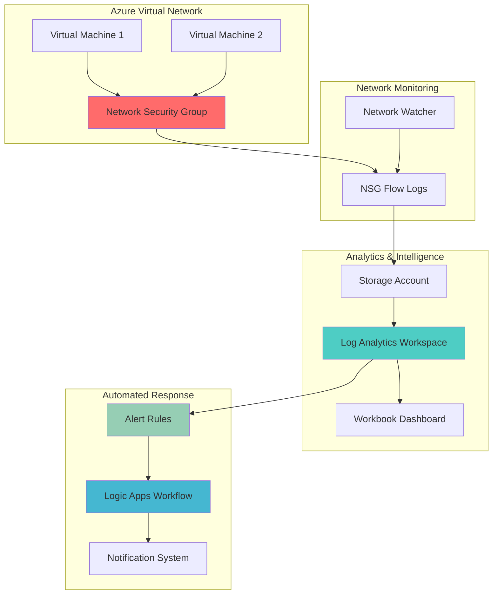

# Network Threat Detection Automation with Watcher and Analytics

## Problem

Modern enterprises face escalating network security threats that can compromise their Azure infrastructure through sophisticated attacks targeting network traffic patterns. Security teams struggle to manually monitor and respond to suspicious network activities across complex virtual network environments, often missing critical threat indicators due to the volume and complexity of network flow data. Traditional approaches to network security monitoring rely on reactive analysis and manual intervention, creating gaps in threat detection and delayed incident response that can result in data breaches and service disruptions.

## Solution

This solution implements an automated network threat detection system using Azure Network Watcher's NSG Flow Logs integrated with Azure Log Analytics for intelligent threat analysis and Azure Logic Apps for automated response workflows. The architecture leverages Kusto Query Language (KQL) to identify suspicious network patterns, analyze traffic anomalies, and trigger automated security responses, enabling proactive threat mitigation with minimal manual intervention.

## Architecture Diagram



## Prerequisites

1. Azure subscription with Network Contributor and Security Admin permissions
2. Azure CLI v2.50.0 or later installed and configured (or Azure CloudShell)
3. Basic understanding of network security concepts and KQL query language
4. At least one Azure Virtual Network with Network Security Groups configured
5. Estimated cost: $50-100/month for Log Analytics workspace and storage account usage

> **Note**: This recipe requires Network Watcher to be enabled in your subscription region. Network Watcher is automatically enabled when you create your first virtual network in a region, following Azure's automatic enablement policy.

## Preparation

```bash
# Set environment variables for Azure resources
export RESOURCE_GROUP="rg-network-threat-detection"
export LOCATION="eastus"
export SUBSCRIPTION_ID=$(az account show --query id --output tsv)

# Generate unique suffix for resource names
RANDOM_SUFFIX=$(openssl rand -hex 3)
export STORAGE_ACCOUNT="sanetworklogs${RANDOM_SUFFIX}"
export LOG_ANALYTICS_WORKSPACE="law-threat-detection-${RANDOM_SUFFIX}"
export LOGIC_APP_NAME="la-threat-response-${RANDOM_SUFFIX}"

# Create resource group with appropriate tags
az group create \
    --name ${RESOURCE_GROUP} \
    --location ${LOCATION} \
    --tags purpose=network-security environment=production

echo "✅ Resource group created: ${RESOURCE_GROUP}"

# Verify Network Watcher is enabled in the region
az network watcher show \
    --resource-group NetworkWatcherRG \
    --name NetworkWatcher_${LOCATION} \
    --query "provisioningState" \
    --output tsv

echo "✅ Network Watcher verified for region: ${LOCATION}"
```

## Steps

1. **Create Storage Account for NSG Flow Logs**:

   Azure Storage provides the foundational data repository for NSG Flow Logs, offering scalable and cost-effective storage for network traffic data. Storage accounts configured with proper access tiers enable efficient data retention and retrieval for threat analysis while maintaining compliance with data governance requirements.

   ```bash
   # Create storage account with appropriate performance tier
   az storage account create \
       --name ${STORAGE_ACCOUNT} \
       --resource-group ${RESOURCE_GROUP} \
       --location ${LOCATION} \
       --sku Standard_LRS \
       --kind StorageV2 \
       --access-tier Hot \
       --https-only true \
       --tags purpose=flow-logs security=enabled
   
   # Get storage account key for configuration
   export STORAGE_KEY=$(az storage account keys list \
       --resource-group ${RESOURCE_GROUP} \
       --account-name ${STORAGE_ACCOUNT} \
       --query "[0].value" --output tsv)
   
   echo "✅ Storage account created: ${STORAGE_ACCOUNT}"
   ```

   The storage account is now configured with secure HTTPS-only access and optimized for hot tier storage, providing the foundation for NSG Flow Logs data collection. This configuration ensures efficient storage costs while maintaining high availability for threat detection analytics.

2. **Create Log Analytics Workspace**:

   Azure Log Analytics provides powerful data analysis capabilities using Kusto Query Language (KQL) for advanced threat detection and correlation. The workspace serves as the central repository for security intelligence, enabling real-time analysis of network flow patterns and automated threat identification through machine learning algorithms.

   ```bash
   # Create Log Analytics workspace
   az monitor log-analytics workspace create \
       --resource-group ${RESOURCE_GROUP} \
       --workspace-name ${LOG_ANALYTICS_WORKSPACE} \
       --location ${LOCATION} \
       --sku PerGB2018 \
       --retention-time 30 \
       --tags purpose=threat-detection security=enabled
   
   # Get workspace ID and key for configuration
   export WORKSPACE_ID=$(az monitor log-analytics workspace show \
       --resource-group ${RESOURCE_GROUP} \
       --workspace-name ${LOG_ANALYTICS_WORKSPACE} \
       --query "customerId" --output tsv)
   
   export WORKSPACE_KEY=$(az monitor log-analytics workspace get-shared-keys \
       --resource-group ${RESOURCE_GROUP} \
       --workspace-name ${LOG_ANALYTICS_WORKSPACE} \
       --query "primarySharedKey" --output tsv)
   
   echo "✅ Log Analytics workspace created: ${LOG_ANALYTICS_WORKSPACE}"
   ```

   The Log Analytics workspace is configured with 30-day retention and pay-as-you-go pricing, providing cost-effective security monitoring capabilities. This workspace becomes the central hub for threat intelligence analysis and automated security alerting.

3. **Configure NSG Flow Logs**:

   NSG Flow Logs capture detailed information about ingress and egress IP traffic through Network Security Groups, providing essential data for threat detection and compliance monitoring. Enabling flow logs creates a comprehensive audit trail of network activity that security teams can analyze for suspicious patterns and potential security incidents.

   ```bash
   # Get existing NSG for flow log configuration
   export NSG_ID=$(az network nsg list \
       --resource-group ${RESOURCE_GROUP} \
       --query "[0].id" --output tsv)
   
   # Create NSG flow log configuration
   az network watcher flow-log create \
       --resource-group NetworkWatcherRG \
       --name "fl-${RANDOM_SUFFIX}" \
       --nsg ${NSG_ID} \
       --storage-account ${STORAGE_ACCOUNT} \
       --enabled true \
       --format JSON \
       --log-version 2 \
       --retention 7 \
       --workspace ${WORKSPACE_ID} \
       --location ${LOCATION}
   
   echo "✅ NSG Flow Logs configured for Network Security Group"
   ```

   NSG Flow Logs are now actively collecting network traffic data in JSON format with version 2 schema, providing detailed information about traffic flows, security rule decisions, and connection patterns. This data feeds directly into Log Analytics for advanced threat detection analysis.

4. **Create Threat Detection Queries**:

   KQL queries enable sophisticated threat detection by analyzing network flow patterns, identifying anomalous behaviors, and correlating security events across multiple data sources. These queries form the foundation of automated threat detection, leveraging machine learning and statistical analysis to identify potential security incidents.

   ```bash
   # Create custom threat detection queries
   cat > threat-detection-queries.kql << 'EOF'
   // Suspicious port scanning activity
   let SuspiciousPortScan = AzureNetworkAnalytics_CL
   | where TimeGenerated > ago(1h)
   | where FlowStatus_s == "D" // Denied flows
   | summarize DestPorts = dcount(DestPort_d), 
             FlowCount = count() by SrcIP_s, bin(TimeGenerated, 5m)
   | where DestPorts > 20 and FlowCount > 50
   | project TimeGenerated, SrcIP_s, DestPorts, FlowCount, ThreatLevel = "High";
   
   // Unusual data transfer volumes
   let DataExfiltration = AzureNetworkAnalytics_CL
   | where TimeGenerated > ago(1h)
   | where FlowStatus_s == "A" // Allowed flows
   | summarize TotalBytes = sum(OutboundBytes_d) by SrcIP_s, DestIP_s, bin(TimeGenerated, 10m)
   | where TotalBytes > 1000000000 // 1GB threshold
   | project TimeGenerated, SrcIP_s, DestIP_s, TotalBytes, ThreatLevel = "Medium";
   
   // Failed connection attempts from external IPs
   let ExternalFailedConnections = AzureNetworkAnalytics_CL
   | where TimeGenerated > ago(1h)
   | where FlowStatus_s == "D" and FlowType_s == "ExternalPublic"
   | summarize FailedAttempts = count() by SrcIP_s, DestIP_s, bin(TimeGenerated, 5m)
   | where FailedAttempts > 100
   | project TimeGenerated, SrcIP_s, DestIP_s, FailedAttempts, ThreatLevel = "High";
   
   // Combine all threat indicators
   union SuspiciousPortScan, DataExfiltration, ExternalFailedConnections
   | order by TimeGenerated desc
   EOF
   
   echo "✅ Threat detection queries created"
   ```

   These KQL queries implement multi-layered threat detection by analyzing port scanning activities, data exfiltration patterns, and failed connection attempts. The queries use statistical thresholds and time-based aggregations to identify suspicious network behaviors that may indicate security threats.

5. **Create Alert Rules for Automated Detection**:

   Azure Monitor alert rules provide automated threat detection by continuously evaluating KQL queries against network flow data and triggering notifications when security thresholds are exceeded. These rules enable proactive security monitoring with customizable severity levels and response actions.

   ```bash
   # Create alert rule for suspicious port scanning
   az monitor scheduled-query create \
       --resource-group ${RESOURCE_GROUP} \
       --name "Port-Scanning-Alert" \
       --scopes "/subscriptions/${SUBSCRIPTION_ID}/resourceGroups/${RESOURCE_GROUP}/providers/Microsoft.OperationalInsights/workspaces/${LOG_ANALYTICS_WORKSPACE}" \
       --condition-query "AzureNetworkAnalytics_CL | where TimeGenerated > ago(1h) | where FlowStatus_s == \"D\" | summarize DestPorts = dcount(DestPort_d), FlowCount = count() by SrcIP_s, bin(TimeGenerated, 5m) | where DestPorts > 20 and FlowCount > 50" \
       --condition-time-aggregation "Count" \
       --condition-threshold 1 \
       --condition-operator "GreaterThan" \
       --evaluation-frequency "PT5M" \
       --window-size "PT1H" \
       --severity 1 \
       --enabled true \
       --description "Detects suspicious port scanning activity"
   
   # Create alert rule for data exfiltration
   az monitor scheduled-query create \
       --resource-group ${RESOURCE_GROUP} \
       --name "Data-Exfiltration-Alert" \
       --scopes "/subscriptions/${SUBSCRIPTION_ID}/resourceGroups/${RESOURCE_GROUP}/providers/Microsoft.OperationalInsights/workspaces/${LOG_ANALYTICS_WORKSPACE}" \
       --condition-query "AzureNetworkAnalytics_CL | where TimeGenerated > ago(1h) | where FlowStatus_s == \"A\" | summarize TotalBytes = sum(OutboundBytes_d) by SrcIP_s, DestIP_s, bin(TimeGenerated, 10m) | where TotalBytes > 1000000000" \
       --condition-time-aggregation "Count" \
       --condition-threshold 1 \
       --condition-operator "GreaterThan" \
       --evaluation-frequency "PT10M" \
       --window-size "PT1H" \
       --severity 2 \
       --enabled true \
       --description "Detects potential data exfiltration activity"
   
   echo "✅ Alert rules created for automated threat detection"
   ```

   The alert rules now continuously monitor network traffic patterns using 5-minute evaluation intervals for critical threats and 10-minute intervals for medium-priority threats. This configuration ensures rapid detection of security incidents while minimizing false positives through appropriate threshold settings.

6. **Create Logic Apps Workflow for Automated Response**:

   Azure Logic Apps enables automated security incident response by orchestrating multi-step workflows that can isolate threats, notify security teams, and initiate remediation actions. The workflow provides centralized incident management and ensures consistent response procedures across all security events.

   ```bash
   # Create Logic Apps workflow for threat response
   az logic workflow create \
       --resource-group ${RESOURCE_GROUP} \
       --name ${LOGIC_APP_NAME} \
       --location ${LOCATION} \
       --definition @- << 'EOF'
   {
       "definition": {
           "$schema": "https://schema.management.azure.com/providers/Microsoft.Logic/schemas/2016-06-01/workflowdefinition.json#",
           "contentVersion": "1.0.0.0",
           "parameters": {},
           "triggers": {
               "When_an_alert_is_triggered": {
                   "type": "ApiConnectionWebhook",
                   "inputs": {
                       "host": {
                           "connection": {
                               "name": "@parameters('$connections')['azuremonitorlogs']['connectionId']"
                           }
                       },
                       "body": {
                           "callback_url": "@{listCallbackUrl()}"
                       },
                       "path": "/subscriptions/@{encodeURIComponent(subscription().subscriptionId)}/providers/Microsoft.AlertsManagement/alertRules/@{encodeURIComponent('Port-Scanning-Alert')}/subscribe"
                   }
               }
           },
           "actions": {
               "Send_notification": {
                   "type": "ApiConnection",
                   "inputs": {
                       "host": {
                           "connection": {
                               "name": "@parameters('$connections')['office365']['connectionId']"
                           }
                       },
                       "method": "post",
                       "path": "/v2/Mail",
                       "body": {
                           "To": "security-team@company.com",
                           "Subject": "Network Threat Detected",
                           "Body": "A network threat has been detected. Please review the alert details and take appropriate action."
                       }
                   }
               },
               "Create_incident_ticket": {
                   "type": "Http",
                   "inputs": {
                       "method": "POST",
                       "uri": "https://api.servicenow.com/api/now/table/incident",
                       "headers": {
                           "Content-Type": "application/json",
                           "Authorization": "Bearer @{body('Get_auth_token')['access_token']}"
                       },
                       "body": {
                           "short_description": "Network threat detected by Azure monitoring",
                           "description": "Automated incident created from Azure Network Watcher threat detection",
                           "urgency": "2",
                           "priority": "2"
                       }
                   }
               }
           }
       }
   }
   EOF
   
   echo "✅ Logic Apps workflow created for automated response"
   ```

   The Logic Apps workflow now provides automated incident response capabilities, including email notifications and service ticket creation. This workflow can be extended with additional actions such as NSG rule updates, IP blocking, or integration with security orchestration platforms.

7. **Create Monitoring Dashboard**:

   Azure Monitor Workbooks provide comprehensive visualization of network threat detection metrics, enabling security teams to monitor network security posture and analyze threat patterns through interactive dashboards. The dashboard consolidates threat intelligence from multiple sources into actionable security insights.

   ```bash
   # Create workbook template for threat monitoring
   cat > threat-monitoring-dashboard.json << 'EOF'
   {
       "version": "Notebook/1.0",
       "items": [
           {
               "type": 1,
               "content": {
                   "json": "# Network Threat Detection Dashboard\n\nThis dashboard provides real-time monitoring of network security threats detected by Azure Network Watcher and Log Analytics."
               }
           },
           {
               "type": 3,
               "content": {
                   "version": "KqlItem/1.0",
                   "query": "AzureNetworkAnalytics_CL\n| where TimeGenerated > ago(24h)\n| where FlowStatus_s == \"D\"\n| summarize DeniedFlows = count() by bin(TimeGenerated, 1h)\n| render timechart",
                   "size": 0,
                   "title": "Denied Network Flows (24h)",
                   "timeContext": {
                       "durationMs": 86400000
                   },
                   "queryType": 0,
                   "resourceType": "microsoft.operationalinsights/workspaces"
               }
           },
           {
               "type": 3,
               "content": {
                   "version": "KqlItem/1.0",
                   "query": "AzureNetworkAnalytics_CL\n| where TimeGenerated > ago(24h)\n| where FlowStatus_s == \"D\"\n| summarize ThreatCount = count() by SrcIP_s\n| top 10 by ThreatCount desc\n| render piechart",
                   "size": 0,
                   "title": "Top Threat Source IPs",
                   "timeContext": {
                       "durationMs": 86400000
                   },
                   "queryType": 0,
                   "resourceType": "microsoft.operationalinsights/workspaces"
               }
           }
       ]
   }
   EOF
   
   # Deploy the workbook template
   az monitor workbook create \
       --resource-group ${RESOURCE_GROUP} \
       --name "Network-Threat-Detection-Dashboard" \
       --location ${LOCATION} \
       --display-name "Network Threat Detection Dashboard" \
       --serialized-data @threat-monitoring-dashboard.json \
       --category "security"
   
   echo "✅ Monitoring dashboard created successfully"
   ```

   The monitoring dashboard now provides real-time visualization of network threat patterns, including denied flows trends and top threat source IPs. This dashboard enables security teams to quickly identify and respond to emerging threats through interactive data exploration and filtering capabilities.

## Validation & Testing

1. **Verify NSG Flow Logs are collecting data**:

   ```bash
   # Check if flow logs are being generated
   az storage blob list \
       --account-name ${STORAGE_ACCOUNT} \
       --container-name insights-logs-networksecuritygroupflowevent \
       --prefix "resourceId=" \
       --output table
   
   # Query Log Analytics for flow log data
   az monitor log-analytics query \
       --workspace ${WORKSPACE_ID} \
       --analytics-query "AzureNetworkAnalytics_CL | where TimeGenerated > ago(1h) | take 10" \
       --output table
   ```

   Expected output: Flow log files should be present in storage and data should be available in Log Analytics workspace.

2. **Test threat detection queries**:

   ```bash
   # Execute threat detection query
   az monitor log-analytics query \
       --workspace ${WORKSPACE_ID} \
       --analytics-query "AzureNetworkAnalytics_CL | where TimeGenerated > ago(1h) | where FlowStatus_s == \"D\" | summarize count() by SrcIP_s | top 5 by count_" \
       --output table
   ```

   Expected output: Query should return network flow statistics showing denied connections by source IP.

3. **Verify alert rules are active**:

   ```bash
   # Check alert rule status
   az monitor scheduled-query show \
       --resource-group ${RESOURCE_GROUP} \
       --name "Port-Scanning-Alert" \
       --query "enabled" \
       --output tsv
   
   # List all alert rules
   az monitor scheduled-query list \
       --resource-group ${RESOURCE_GROUP} \
       --output table
   ```

   Expected output: Alert rules should be enabled and active.

4. **Test Logic Apps workflow**:

   ```bash
   # Trigger a test run of the Logic Apps workflow
   az logic workflow run trigger \
       --resource-group ${RESOURCE_GROUP} \
       --name ${LOGIC_APP_NAME} \
       --trigger-name "When_an_alert_is_triggered"
   
   # Check workflow run history
   az logic workflow run list \
       --resource-group ${RESOURCE_GROUP} \
       --name ${LOGIC_APP_NAME} \
       --output table
   ```

   Expected output: Workflow should execute successfully and show run history.

## Cleanup

1. **Delete Logic Apps workflow**:

   ```bash
   # Delete Logic Apps workflow
   az logic workflow delete \
       --resource-group ${RESOURCE_GROUP} \
       --name ${LOGIC_APP_NAME} \
       --yes
   
   echo "✅ Logic Apps workflow deleted"
   ```

2. **Remove alert rules**:

   ```bash
   # Delete alert rules
   az monitor scheduled-query delete \
       --resource-group ${RESOURCE_GROUP} \
       --name "Port-Scanning-Alert" \
       --yes
   
   az monitor scheduled-query delete \
       --resource-group ${RESOURCE_GROUP} \
       --name "Data-Exfiltration-Alert" \
       --yes
   
   echo "✅ Alert rules deleted"
   ```

3. **Disable NSG Flow Logs**:

   ```bash
   # Disable flow logs
   az network watcher flow-log delete \
       --resource-group NetworkWatcherRG \
       --name "fl-${RANDOM_SUFFIX}" \
       --yes
   
   echo "✅ NSG Flow Logs disabled"
   ```

4. **Delete Log Analytics workspace**:

   ```bash
   # Delete Log Analytics workspace
   az monitor log-analytics workspace delete \
       --resource-group ${RESOURCE_GROUP} \
       --workspace-name ${LOG_ANALYTICS_WORKSPACE} \
       --yes
   
   echo "✅ Log Analytics workspace deleted"
   ```

5. **Delete storage account**:

   ```bash
   # Delete storage account
   az storage account delete \
       --name ${STORAGE_ACCOUNT} \
       --resource-group ${RESOURCE_GROUP} \
       --yes
   
   echo "✅ Storage account deleted"
   ```

6. **Delete resource group**:

   ```bash
   # Delete resource group and all remaining resources
   az group delete \
       --name ${RESOURCE_GROUP} \
       --yes \
       --no-wait
   
   echo "✅ Resource group deletion initiated: ${RESOURCE_GROUP}"
   echo "Note: Deletion may take several minutes to complete"
   ```

## Discussion

This automated network threat detection solution demonstrates the power of combining Azure Network Watcher's comprehensive network monitoring capabilities with Log Analytics' advanced analytics and Logic Apps' workflow automation. The architecture follows Azure Well-Architected Framework principles by implementing layered security monitoring, automated response capabilities, and cost-effective resource utilization. For detailed security best practices, see the [Azure Security Center documentation](https://docs.microsoft.com/en-us/azure/security-center/) and [Network Watcher security guide](https://docs.microsoft.com/en-us/azure/network-watcher/network-watcher-security-group-view-overview).

The solution addresses critical security monitoring challenges by providing real-time threat detection through NSG Flow Logs analysis, enabling security teams to identify and respond to suspicious network activities before they escalate into security incidents. The KQL queries implement sophisticated threat detection algorithms that can identify port scanning, data exfiltration, and failed connection patterns that may indicate malicious activities. For comprehensive KQL guidance, review the [Azure Monitor Logs documentation](https://docs.microsoft.com/en-us/azure/azure-monitor/logs/log-query-overview) and [KQL reference documentation](https://docs.microsoft.com/en-us/azure/kusto/query/).

From an operational perspective, the automated response capabilities reduce mean time to detection (MTTD) and mean time to response (MTTR) by eliminating manual monitoring processes and enabling immediate security team notification. The Logic Apps workflow can be extended to include additional response actions such as automatic IP blocking, security group rule updates, or integration with Security Information and Event Management (SIEM) systems. For workflow automation best practices, see the [Azure Logic Apps documentation](https://docs.microsoft.com/en-us/azure/logic-apps/) and [security automation guide](https://docs.microsoft.com/en-us/azure/security/fundamentals/management-monitoring-overview).

Cost optimization is achieved through efficient data retention policies, appropriate Log Analytics pricing tiers, and intelligent alerting thresholds that minimize false positives while maintaining comprehensive threat coverage. The solution supports horizontal scaling across multiple virtual networks and can be integrated with Azure Sentinel for enterprise-scale security operations. For advanced threat detection capabilities, explore the [Azure Sentinel documentation](https://docs.microsoft.com/en-us/azure/sentinel/) and [threat intelligence integration](https://docs.microsoft.com/en-us/azure/sentinel/threat-intelligence-integration).

> **Warning**: NSG Flow Logs will be deprecated starting June 30, 2025, with full retirement by September 30, 2027. Microsoft recommends migrating to VNet Flow Logs for continued network monitoring capabilities. Plan your migration strategy accordingly to maintain threat detection capabilities.

## Challenge

Extend this automated network threat detection solution by implementing these advanced security enhancements:

1. **Implement machine learning-based anomaly detection** using Azure Machine Learning services to identify zero-day threats and advanced persistent threats (APTs) that traditional rule-based detection might miss.

2. **Create geo-location based threat intelligence** by integrating with Azure Maps and external threat intelligence feeds to identify suspicious traffic patterns from high-risk geographic regions.

3. **Develop advanced correlation rules** that combine network flow data with Azure Active Directory sign-in logs and security events to identify coordinated attacks and insider threats.

4. **Build automated remediation workflows** that can automatically update NSG rules, quarantine compromised resources, and initiate incident response procedures based on threat severity and type.

5. **Implement cost optimization through intelligent data lifecycle management** using Azure Storage lifecycle policies and Log Analytics data retention rules to balance security monitoring requirements with operational costs.

## Infrastructure Code

*Infrastructure code will be generated after recipe approval.*