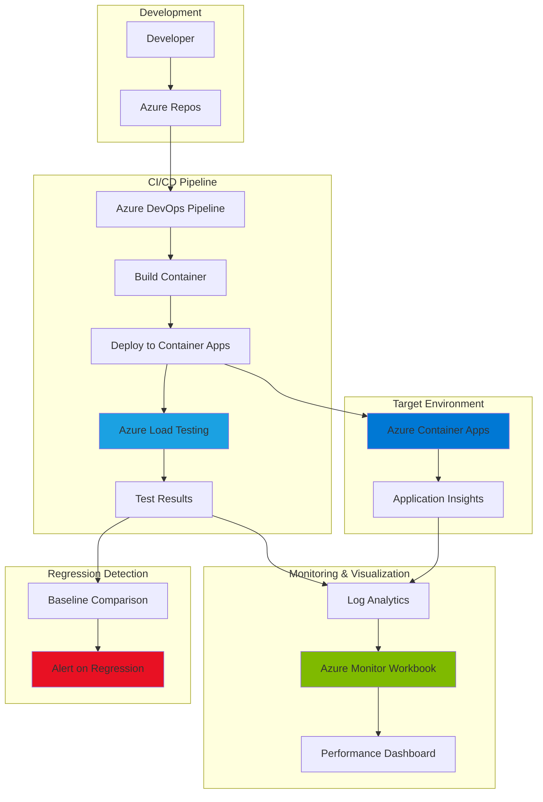

# Performance Regression Detection with Load Testing and Monitor Workbooks

## Problem

Development teams struggle to detect performance regressions early in the software development lifecycle, often discovering issues only after deployment to production. Manual performance testing is time-consuming, inconsistent, and fails to provide continuous feedback during the CI/CD process. Without automated performance baselines and visual dashboards, teams cannot effectively track performance trends or identify subtle degradations that accumulate over time.

## Solution

Implement an automated performance regression detection system using Azure Load Testing integrated into Azure DevOps pipelines, with Azure Monitor Workbooks providing real-time visualization of performance metrics. This solution automatically runs load tests against containerized applications on Azure Container Apps, compares results against established baselines, and generates interactive dashboards that highlight performance anomalies and trends across releases.

## Architecture Diagram



## Prerequisites

1. Azure subscription with Owner or Contributor access
2. Azure DevOps organization with project administrator privileges
3. Azure CLI v2.60+ installed or access to Azure Cloud Shell
4. Basic understanding of performance testing concepts
5. Familiarity with Azure DevOps pipelines
6. Estimated cost: $50-100/month (based on test frequency and container usage)

> **Note**: Ensure your Azure DevOps organization is connected to Microsoft Entra ID in your subscription for seamless service integration.

## Preparation

```bash
# Set environment variables
export RESOURCE_GROUP="rg-perftest-${RANDOM_SUFFIX}"
export LOCATION="eastus"
export SUBSCRIPTION_ID=$(az account show --query id --output tsv)

# Generate unique suffix for resource names
RANDOM_SUFFIX=$(openssl rand -hex 3)

# Create resource group
az group create \
    --name ${RESOURCE_GROUP} \
    --location ${LOCATION} \
    --tags purpose=performance-testing environment=demo

# Set additional variables
export LOAD_TEST_NAME="lt-perftest-${RANDOM_SUFFIX}"
export CONTAINER_APP_NAME="ca-demo-${RANDOM_SUFFIX}"
export WORKSPACE_NAME="law-perftest-${RANDOM_SUFFIX}"
export ENVIRONMENT_NAME="cae-perftest-${RANDOM_SUFFIX}"
export ACR_NAME="acrperftest${RANDOM_SUFFIX}"
export DEVOPS_PROJECT="PerformanceTestingDemo"

echo "✅ Resource group created: ${RESOURCE_GROUP}"
```

## Steps

1. **Create Azure Load Testing Resource**:

   Azure Load Testing is a fully managed load testing service that enables high-scale performance testing with minimal infrastructure overhead. Creating this resource establishes the foundation for automated performance regression detection, providing Apache JMeter compatibility and integration with Azure DevOps pipelines. The service automatically handles test infrastructure provisioning and scaling based on your load requirements.

   ```bash
   # Create Azure Load Testing resource
   az load create \
       --name ${LOAD_TEST_NAME} \
       --resource-group ${RESOURCE_GROUP} \
       --location ${LOCATION} \
       --tags purpose=ci-cd-integration

   # Get Load Testing resource ID
   LOAD_TEST_ID=$(az load show \
       --name ${LOAD_TEST_NAME} \
       --resource-group ${RESOURCE_GROUP} \
       --query id --output tsv)

   echo "✅ Load Testing resource created: ${LOAD_TEST_NAME}"
   ```

   The Load Testing resource is now ready to execute performance tests at scale. This managed service eliminates the complexity of maintaining test infrastructure while providing enterprise-grade capabilities for continuous performance validation.

2. **Set Up Log Analytics Workspace**:

   Log Analytics workspace serves as the centralized repository for all performance metrics and telemetry data. This workspace enables correlation between load test results and application metrics, providing a comprehensive view of system behavior under load. The integration with Application Insights ensures end-to-end visibility across your testing pipeline.

   ```bash
   # Create Log Analytics workspace
   az monitor log-analytics workspace create \
       --name ${WORKSPACE_NAME} \
       --resource-group ${RESOURCE_GROUP} \
       --location ${LOCATION} \
       --retention-time 30

   # Get workspace ID for later use
   WORKSPACE_ID=$(az monitor log-analytics workspace show \
       --name ${WORKSPACE_NAME} \
       --resource-group ${RESOURCE_GROUP} \
       --query id --output tsv)

   # Get workspace key for Application Insights
   WORKSPACE_KEY=$(az monitor log-analytics workspace get-shared-keys \
       --name ${WORKSPACE_NAME} \
       --resource-group ${RESOURCE_GROUP} \
       --query primarySharedKey --output tsv)

   echo "✅ Log Analytics workspace configured"
   ```

3. **Deploy Azure Container Apps Environment**:

   Azure Container Apps provides a serverless container hosting platform ideal for microservices and event-driven applications. The environment configuration includes built-in observability through Azure Monitor integration, enabling automatic collection of performance metrics during load tests. This serverless approach ensures cost efficiency while maintaining the flexibility needed for performance testing scenarios.

   ```bash
   # Create Container Apps environment
   az containerapp env create \
       --name ${ENVIRONMENT_NAME} \
       --resource-group ${RESOURCE_GROUP} \
       --location ${LOCATION} \
       --logs-workspace-id ${WORKSPACE_ID} \
       --logs-workspace-key ${WORKSPACE_KEY}

   # Create Container Registry for demo app
   az acr create \
       --name ${ACR_NAME} \
       --resource-group ${RESOURCE_GROUP} \
       --location ${LOCATION} \
       --sku Basic \
       --admin-enabled true

   # Build and push sample application
   az acr build \
       --registry ${ACR_NAME} \
       --image demo-app:v1.0 \
       --source "https://github.com/Azure-Samples/nodejs-docs-hello-world.git"

   echo "✅ Container Apps environment ready"
   ```

   The Container Apps environment now provides a scalable, observable platform for your applications. The integrated monitoring ensures all performance metrics are automatically captured during load testing scenarios.

4. **Deploy Sample Application to Container Apps**:

   Deploying the application to Container Apps establishes the target for performance testing. The configuration includes resource limits and scaling rules that simulate production behavior, ensuring test results accurately reflect real-world performance characteristics. Application Insights integration provides detailed telemetry for correlation with load test results.

   ```bash
   # Get ACR credentials
   ACR_PASSWORD=$(az acr credential show \
       --name ${ACR_NAME} \
       --query passwords[0].value --output tsv)

   # Create Container App with the demo application
   az containerapp create \
       --name ${CONTAINER_APP_NAME} \
       --resource-group ${RESOURCE_GROUP} \
       --environment ${ENVIRONMENT_NAME} \
       --image "${ACR_NAME}.azurecr.io/demo-app:v1.0" \
       --registry-server "${ACR_NAME}.azurecr.io" \
       --registry-username ${ACR_NAME} \
       --registry-password ${ACR_PASSWORD} \
       --target-port 3000 \
       --ingress external \
       --cpu 0.5 \
       --memory 1.0Gi \
       --min-replicas 1 \
       --max-replicas 5

   # Get application URL
   APP_URL=$(az containerapp show \
       --name ${CONTAINER_APP_NAME} \
       --resource-group ${RESOURCE_GROUP} \
       --query properties.configuration.ingress.fqdn \
       --output tsv)

   echo "✅ Application deployed at: https://${APP_URL}"
   ```

5. **Create Load Test Configuration**:

   The load test configuration defines performance test scenarios including user patterns, duration, and success criteria. Creating a JMeter test script enables complex user journey simulation while maintaining compatibility with existing performance testing assets. The configuration establishes baseline metrics that serve as regression detection thresholds.

   ```bash
   # Create JMeter test script
   cat > loadtest.jmx << 'EOF'
   <?xml version="1.0" encoding="UTF-8"?>
   <jmeterTestPlan version="1.2" properties="5.0">
     <hashTree>
       <TestPlan guiclass="TestPlanGui" testclass="TestPlan" testname="Performance Test">
         <elementProp name="TestPlan.user_defined_variables" elementType="Arguments"/>
         <stringProp name="TestPlan.user_define_classpath"></stringProp>
       </TestPlan>
       <hashTree>
         <ThreadGroup guiclass="ThreadGroupGui" testclass="ThreadGroup" testname="Users">
           <intProp name="ThreadGroup.num_threads">50</intProp>
           <intProp name="ThreadGroup.ramp_time">30</intProp>
           <intProp name="ThreadGroup.duration">180</intProp>
         </ThreadGroup>
         <hashTree>
           <HTTPSamplerProxy guiclass="HttpTestSampleGui" testclass="HTTPSamplerProxy" testname="Home Page">
             <stringProp name="HTTPSampler.domain">${__P(webapp_url)}</stringProp>
             <stringProp name="HTTPSampler.protocol">https</stringProp>
             <stringProp name="HTTPSampler.path">/</stringProp>
             <stringProp name="HTTPSampler.method">GET</stringProp>
           </HTTPSamplerProxy>
         </hashTree>
       </hashTree>
     </hashTree>
   </jmeterTestPlan>
   EOF

   # Create test configuration YAML
   cat > loadtest-config.yaml << EOF
   version: v0.1
   testId: performance-baseline
   displayName: Performance Regression Test
   testPlan: loadtest.jmx
   description: Automated performance regression detection test
   engineInstances: 1
   configurationFiles:
   properties:
     webapp_url: ${APP_URL}
   failureCriteria:
     - aggregate: avg
       clientMetric: response_time_ms
       condition: '>'
       value: 500
     - aggregate: percentage
       clientMetric: error
       condition: '>'
       value: 5
   EOF

   echo "✅ Load test configuration created"
   ```

6. **Configure Azure DevOps Pipeline**:

   The Azure DevOps pipeline automates the entire performance testing workflow, from code deployment to regression analysis. This configuration establishes continuous performance validation as part of the CI/CD process, ensuring every code change is evaluated for performance impact. The pipeline integration enables shift-left performance testing practices.

   ```bash
   # Create pipeline YAML
   cat > azure-pipelines.yml << 'EOF'
   trigger:
     - main

   pool:
     vmImage: 'ubuntu-latest'

   variables:
     loadTestResource: '$(LOAD_TEST_NAME)'
     loadTestResourceGroup: '$(RESOURCE_GROUP)'

   stages:
   - stage: LoadTest
     displayName: 'Performance Testing'
     jobs:
     - job: RunLoadTest
       displayName: 'Run Load Test'
       steps:
       - task: AzureLoadTest@1
         displayName: 'Azure Load Testing'
         inputs:
           azureSubscription: 'LoadTestConnection'
           loadTestConfigFile: 'loadtest-config.yaml'
           loadTestResource: $(loadTestResource)
           resourceGroup: $(loadTestResourceGroup)
           secrets: |
             [
             ]
           env: |
             [
               {
                 "name": "webapp_url",
                 "value": "$(APP_URL)"
               }
             ]

       - task: PublishTestResults@2
         condition: succeededOrFailed()
         inputs:
           testResultsFormat: 'JUnit'
           testResultsFiles: '$(System.DefaultWorkingDirectory)/loadtest/results.xml'
           testRunTitle: 'Load Test Results'

       - publish: $(System.DefaultWorkingDirectory)/loadtest
         artifact: LoadTestResults
         condition: succeededOrFailed()
   EOF

   echo "✅ Pipeline configuration created"
   ```

   The pipeline now automatically triggers performance tests with each code deployment, providing immediate feedback on performance characteristics and potential regressions.

7. **Create Azure Monitor Workbook for Visualization**:

   Azure Monitor Workbooks provide interactive, customizable dashboards for visualizing performance trends and anomalies. This workbook configuration creates a comprehensive performance monitoring solution that correlates load test results with application metrics. The visualization enables quick identification of performance regressions and their root causes.

   ```bash
   # Generate UUID for workbook name
   WORKBOOK_UUID=$(uuidgen)

   # Create workbook template
   cat > performance-workbook.json << 'EOF'
   {
     "version": "Notebook/1.0",
     "items": [
       {
         "type": 1,
         "content": {
           "json": "# Performance Regression Detection Dashboard\n\nMonitor application performance trends and detect regressions automatically."
         }
       },
       {
         "type": 3,
         "content": {
           "version": "KqlItem/1.0",
           "query": "ContainerAppConsoleLogs_CL\n| where TimeGenerated > ago(1h)\n| summarize ResponseTime = avg(todouble(Properties_s.duration)) by bin(TimeGenerated, 5m)\n| render timechart",
           "size": 0,
           "title": "Average Response Time Trend",
           "timeContext": {
             "durationMs": 3600000
           },
           "queryType": 0,
           "resourceType": "microsoft.operationalinsights/workspaces"
         }
       },
       {
         "type": 3,
         "content": {
           "version": "KqlItem/1.0",
           "query": "ContainerAppConsoleLogs_CL\n| where TimeGenerated > ago(1h)\n| summarize ErrorRate = countif(Properties_s.status >= 400) * 100.0 / count() by bin(TimeGenerated, 5m)\n| render timechart",
           "size": 0,
           "title": "Error Rate %",
           "timeContext": {
             "durationMs": 3600000
           },
           "queryType": 0,
           "resourceType": "microsoft.operationalinsights/workspaces"
         }
       }
     ]
   }
   EOF

   # Create the workbook
   az monitor app-insights workbook create \
       --name ${WORKBOOK_UUID} \
       --resource-group ${RESOURCE_GROUP} \
       --location ${LOCATION} \
       --display-name "Performance Regression Detection" \
       --category "performance" \
       --kind shared \
       --source-id ${WORKSPACE_ID} \
       --serialized-data "@performance-workbook.json"

   echo "✅ Performance monitoring workbook created"
   ```

8. **Set Up Automated Regression Detection**:

   Automated regression detection uses Azure Monitor scheduled query alerts to identify performance degradations compared to established baselines. This configuration creates intelligent alerting that considers historical performance patterns and statistical variations, reducing false positives while ensuring genuine regressions are promptly identified. The integration with Azure DevOps enables automatic rollback capabilities.

   ```bash
   # Create alert rule for response time regression using scheduled query
   az monitor scheduled-query create \
       --name "ResponseTimeRegression" \
       --resource-group ${RESOURCE_GROUP} \
       --scopes ${WORKSPACE_ID} \
       --description "Alert when response time exceeds baseline by 20%" \
       --condition "avg(avgResponseTime) > 600" \
       --condition-query "ContainerAppConsoleLogs_CL | where TimeGenerated > ago(5m) | summarize avgResponseTime=avg(todouble(Properties_s.duration))" \
       --evaluation-frequency 5m \
       --window-size 5m \
       --severity 2

   # Create alert rule for error rate regression using scheduled query
   az monitor scheduled-query create \
       --name "ErrorRateRegression" \
       --resource-group ${RESOURCE_GROUP} \
       --scopes ${WORKSPACE_ID} \
       --description "Alert when error rate exceeds 5%" \
       --condition "avg(errorRate) > 5" \
       --condition-query "ContainerAppConsoleLogs_CL | where TimeGenerated > ago(5m) | summarize errorRate=countif(Properties_s.status >= 400) * 100.0 / count()" \
       --evaluation-frequency 5m \
       --window-size 5m \
       --severity 2

   echo "✅ Regression detection alerts configured"
   ```

   The automated alerts now continuously monitor for performance regressions, enabling proactive response to degradations before they impact end users.

## Validation & Testing

1. Verify Load Testing resource deployment:

   ```bash
   # Check Load Testing resource status
   az load show \
       --name ${LOAD_TEST_NAME} \
       --resource-group ${RESOURCE_GROUP} \
       --output table
   ```

   Expected output: Resource should show "Succeeded" provisioning state with location matching your specified region.

2. Test application endpoint availability:

   ```bash
   # Test application is responding
   curl -s -o /dev/null -w "%{http_code}" https://${APP_URL}
   ```

   Expected output: HTTP status code 200

3. Verify workbook creation:

   ```bash
   # List workbooks in resource group
   az monitor app-insights workbook list \
       --resource-group ${RESOURCE_GROUP} \
       --output table
   ```

   Expected output: Should display "Performance Regression Detection" in the list

4. Validate pipeline configuration:

   ```bash
   # Check if pipeline YAML is valid
   cat azure-pipelines.yml | grep -E "AzureLoadTest|loadTestResource"
   ```

   Expected output: Should show the AzureLoadTest task configuration

## Cleanup

1. Delete the resource group and all resources:

   ```bash
   # Delete resource group
   az group delete \
       --name ${RESOURCE_GROUP} \
       --yes \
       --no-wait

   echo "✅ Resource group deletion initiated: ${RESOURCE_GROUP}"
   echo "Note: Deletion may take several minutes to complete"
   ```

2. Remove local configuration files:

   ```bash
   # Clean up local files
   rm -f loadtest.jmx loadtest-config.yaml azure-pipelines.yml performance-workbook.json

   echo "✅ Local configuration files removed"
   ```

3. Verify deletion status (optional):

   ```bash
   # Check if resource group still exists
   az group exists --name ${RESOURCE_GROUP}
   ```

   Expected output: false (after deletion completes)

## Discussion

Azure Load Testing combined with Azure Monitor Workbooks creates a powerful automated performance regression detection system that integrates seamlessly into modern DevOps workflows. This architecture follows the principles outlined in the [Azure Well-Architected Framework](https://docs.microsoft.com/en-us/azure/architecture/framework/), particularly focusing on performance efficiency and operational excellence. The solution enables teams to shift performance testing left in the development lifecycle, catching regressions before they impact production environments.

The integration between Azure Load Testing and Container Apps provides realistic performance testing scenarios that accurately reflect production behavior. Azure Load Testing's managed infrastructure eliminates the operational overhead of maintaining test environments while providing enterprise-scale capabilities. For detailed implementation guidance, refer to the [Azure Load Testing documentation](https://docs.microsoft.com/en-us/azure/load-testing/) and [performance testing best practices](https://docs.microsoft.com/en-us/azure/load-testing/best-practices-performance-testing).

From a cost optimization perspective, the serverless nature of both Azure Container Apps and Load Testing ensures you only pay for actual usage during test execution. The consumption-based pricing model makes this solution accessible for teams of all sizes while maintaining the ability to scale for enterprise workloads. Azure Monitor Workbooks provide rich visualization capabilities without additional licensing costs, as documented in the [Azure Monitor pricing guide](https://docs.microsoft.com/en-us/azure/azure-monitor/costs).

The automated alerting system uses Azure Monitor's scheduled query alerts to provide more flexible and powerful regression detection capabilities compared to traditional metric-based alerts. This approach allows for complex KQL queries that can analyze trends, patterns, and statistical variations in performance data, reducing false positives while maintaining sensitivity to genuine performance degradations.

> **Tip**: Use Azure Load Testing's comparison feature to automatically detect performance regressions by comparing test runs against established baselines. Configure percentage-based thresholds to account for normal variations while catching meaningful degradations. See the [regression detection guide](https://docs.microsoft.com/en-us/azure/load-testing/how-to-compare-test-results) for implementation details.

## Challenge

Extend this solution by implementing these enhancements:

1. Integrate Azure Chaos Studio to combine load testing with chaos engineering experiments, validating performance under failure conditions
2. Implement multi-region load testing to validate global application performance and identify region-specific bottlenecks
3. Create custom Application Insights queries that correlate load test metrics with application telemetry for deeper root cause analysis
4. Build an automated baseline management system that dynamically adjusts performance thresholds based on historical trends using Azure Machine Learning
5. Develop a performance test library with reusable JMeter components for common user journeys across multiple applications

## Infrastructure Code

### Available Infrastructure as Code:

- [Infrastructure Code Overview](code/README.md) - Detailed description of all infrastructure components
- [Bicep](code/bicep/) - Azure Bicep templates
- [Bash CLI Scripts](code/scripts/) - Example bash scripts using Azure CLI commands to deploy infrastructure
- [Terraform](code/terraform/) - Terraform configuration files