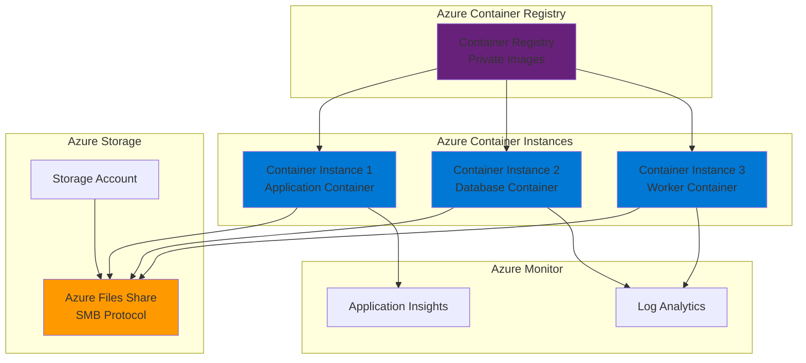

# Persistent Containers with Serverless Deployment

## Problem

Organizations need to deploy containerized applications that require persistent data storage, but traditional container orchestration platforms like Kubernetes introduce complexity and operational overhead. Many businesses require stateful applications such as databases, content management systems, or data processing tools that maintain data across container restarts, crashes, or deployments, while still benefiting from the simplicity and cost-effectiveness of serverless container deployment.

## Solution

Azure Container Instances (ACI) combined with Azure Files provides a serverless container platform that supports persistent storage through SMB file shares. This solution enables stateful container workloads to maintain data persistence across container lifecycles while leveraging ACI's serverless benefits including fast startup times, per-second billing, and zero infrastructure management. Azure Files integration allows multiple containers to share storage volumes and ensures data survives container restarts.

## Architecture Diagram



## Prerequisites

1. Azure subscription with the following permissions:
   - Contributor role on the target resource group
   - Storage Account Contributor for Azure Files
   - AcrPull role for Azure Container Registry
2. Azure CLI v2.50.0 or later installed and configured (or Azure Cloud Shell)
3. Basic understanding of container concepts and Docker
4. Familiarity with Azure resource management and networking concepts
5. Estimated cost: $15-30 per month for small workloads (includes storage, compute, and registry costs)

> **Note**: Azure Files supports SMB protocol for persistent storage, making it ideal for Linux containers running as root. This solution provides similar functionality to Docker bind mounts but with managed Azure storage benefits.

## Preparation

```bash
# Set environment variables for Azure resources
export RESOURCE_GROUP="rg-stateful-containers-${RANDOM_SUFFIX}"
export LOCATION="eastus"
export SUBSCRIPTION_ID=$(az account show --query id --output tsv)

# Generate unique suffix for resource names
RANDOM_SUFFIX=$(openssl rand -hex 3)
export STORAGE_ACCOUNT="statefulstorage${RANDOM_SUFFIX}"
export CONTAINER_REGISTRY="statefulregistry${RANDOM_SUFFIX}"
export FILE_SHARE_NAME="containerdata"

# Create resource group
az group create \
    --name ${RESOURCE_GROUP} \
    --location ${LOCATION} \
    --tags purpose=recipe environment=demo

echo "✅ Resource group created: ${RESOURCE_GROUP}"

# Create Log Analytics workspace for monitoring
export LOG_WORKSPACE="log-stateful-containers-${RANDOM_SUFFIX}"
az monitor log-analytics workspace create \
    --resource-group ${RESOURCE_GROUP} \
    --workspace-name ${LOG_WORKSPACE} \
    --location ${LOCATION}

echo "✅ Log Analytics workspace created for container monitoring"
```

## Steps

1. **Create Azure Storage Account with Azure Files**:

   Azure Storage provides the foundation for persistent container storage through Azure Files, which offers fully managed SMB file shares. Unlike traditional block storage, Azure Files enables multiple containers to simultaneously access shared data, making it ideal for stateful applications that require consistent data access patterns. The Standard_LRS SKU provides cost-effective locally redundant storage suitable for development and testing scenarios.

   ```bash
   # Create storage account with Azure Files support
   az storage account create \
       --name ${STORAGE_ACCOUNT} \
       --resource-group ${RESOURCE_GROUP} \
       --location ${LOCATION} \
       --sku Standard_LRS \
       --kind StorageV2 \
       --enable-large-file-share
   
   echo "✅ Storage account created: ${STORAGE_ACCOUNT}"
   
   # Create Azure Files file share
   az storage share create \
       --name ${FILE_SHARE_NAME} \
       --account-name ${STORAGE_ACCOUNT} \
       --quota 100
   
   echo "✅ Azure Files share created: ${FILE_SHARE_NAME}"
   ```

   The storage account now provides SMB-based file sharing capabilities that containers can mount as persistent volumes. The file share quota of 100GB provides ample space for most stateful applications while maintaining cost efficiency through pay-per-use pricing.

2. **Configure Storage Account Access Keys**:

   Azure Files requires storage account keys for authentication when mounting file shares to containers. These keys provide full access to the storage account and must be handled securely. Azure Container Instances uses these credentials to establish SMB connections to the file share during container startup.

   ```bash
   # Retrieve storage account key
   export STORAGE_KEY=$(az storage account keys list \
       --resource-group ${RESOURCE_GROUP} \
       --account-name ${STORAGE_ACCOUNT} \
       --query "[0].value" --output tsv)
   
   echo "✅ Storage account key retrieved securely"
   
   # Create a directory structure in the file share
   az storage directory create \
       --name "app-data" \
       --share-name ${FILE_SHARE_NAME} \
       --account-name ${STORAGE_ACCOUNT} \
       --account-key ${STORAGE_KEY}
   
   az storage directory create \
       --name "database" \
       --share-name ${FILE_SHARE_NAME} \
       --account-name ${STORAGE_ACCOUNT} \
       --account-key ${STORAGE_KEY}
   
   echo "✅ Directory structure created in file share"
   ```

   The storage key enables secure authentication for file share access, while the directory structure provides organized data storage for different application components. This approach follows Azure security best practices by using dedicated directories for different data types.

3. **Create Azure Container Registry**:

   Azure Container Registry provides private, secure container image storage with built-in security scanning and geo-replication capabilities. Using a private registry ensures that custom application images remain secure and accessible only to authorized Azure services. This is essential for production workloads that contain proprietary code or sensitive configurations.

   ```bash
   # Create Azure Container Registry
   az acr create \
       --resource-group ${RESOURCE_GROUP} \
       --name ${CONTAINER_REGISTRY} \
       --sku Basic \
       --admin-enabled true
   
   echo "✅ Azure Container Registry created: ${CONTAINER_REGISTRY}"
   
   # Get registry login server
   export REGISTRY_SERVER=$(az acr show \
       --name ${CONTAINER_REGISTRY} \
       --query loginServer --output tsv)
   
   # Get registry credentials
   export REGISTRY_USERNAME=$(az acr credential show \
       --name ${CONTAINER_REGISTRY} \
       --query username --output tsv)
   
   export REGISTRY_PASSWORD=$(az acr credential show \
       --name ${CONTAINER_REGISTRY} \
       --query passwords[0].value --output tsv)
   
   echo "✅ Registry credentials configured"
   ```

   The container registry is now ready to store and distribute container images securely. The Basic SKU provides essential features for development and testing environments, while admin credentials enable straightforward authentication from Azure Container Instances.

4. **Deploy Database Container with Persistent Storage**:

   This step demonstrates deploying a PostgreSQL database container with persistent storage mounted from Azure Files. The database container showcases how stateful applications can leverage Azure Files for data persistence, ensuring that database files survive container restarts and deployments. This pattern is applicable to any stateful application requiring persistent storage.

   ```bash
   # Deploy PostgreSQL container with Azure Files volume
   az container create \
       --resource-group ${RESOURCE_GROUP} \
       --name postgres-stateful \
       --image postgres:15 \
       --cpu 1 \
       --memory 2 \
       --environment-variables \
           POSTGRES_PASSWORD=SecurePassword123! \
           POSTGRES_DB=appdb \
           PGDATA=/var/lib/postgresql/data/pgdata \
       --azure-file-volume-account-name ${STORAGE_ACCOUNT} \
       --azure-file-volume-account-key ${STORAGE_KEY} \
       --azure-file-volume-share-name ${FILE_SHARE_NAME} \
       --azure-file-volume-mount-path /var/lib/postgresql/data \
       --os-type Linux \
       --restart-policy Always
   
   echo "✅ PostgreSQL container deployed with persistent storage"
   ```

   The PostgreSQL container now has access to persistent storage through the Azure Files mount, ensuring that database files persist across container lifecycle events. The restart policy ensures automatic recovery from failures, while the dedicated data directory structure maintains data integrity.

5. **Deploy Application Container with Shared Storage**:

   This step creates an application container that shares the same Azure Files storage as the database, demonstrating how multiple containers can collaborate through shared persistent volumes. The application container can read and write files that remain accessible to other containers in the workload, enabling complex stateful application architectures.

   ```bash
   # Deploy application container with shared storage access
   az container create \
       --resource-group ${RESOURCE_GROUP} \
       --name app-stateful \
       --image nginx:alpine \
       --cpu 0.5 \
       --memory 1 \
       --ports 80 \
       --dns-name-label stateful-app-${RANDOM_SUFFIX} \
       --azure-file-volume-account-name ${STORAGE_ACCOUNT} \
       --azure-file-volume-account-key ${STORAGE_KEY} \
       --azure-file-volume-share-name ${FILE_SHARE_NAME} \
       --azure-file-volume-mount-path /usr/share/nginx/html \
       --os-type Linux \
       --restart-policy Always
   
   echo "✅ Application container deployed with shared storage"
   
   # Get application FQDN
   export APP_FQDN=$(az container show \
       --resource-group ${RESOURCE_GROUP} \
       --name app-stateful \
       --query ipAddress.fqdn --output tsv)
   
   echo "Application available at: http://${APP_FQDN}"
   ```

   The application container now shares the same Azure Files storage as the database, enabling both containers to access shared data. This architecture pattern supports complex stateful applications where multiple components need coordinated access to persistent data.

6. **Deploy Worker Container for Background Processing**:

   Background processing containers often require access to shared data for processing tasks, logging, or temporary file storage. This step demonstrates deploying a worker container that can process data from the shared Azure Files storage, completing the stateful container architecture pattern.

   ```bash
   # Create logs directory in file share first
   az storage directory create \
       --name "logs" \
       --share-name ${FILE_SHARE_NAME} \
       --account-name ${STORAGE_ACCOUNT} \
       --account-key ${STORAGE_KEY}
   
   # Deploy worker container for background processing
   az container create \
       --resource-group ${RESOURCE_GROUP} \
       --name worker-stateful \
       --image alpine:latest \
       --cpu 0.5 \
       --memory 0.5 \
       --command-line "sh -c 'while true; do echo \"Worker processing at \$(date)\" >> /shared/logs/worker.log; sleep 60; done'" \
       --azure-file-volume-account-name ${STORAGE_ACCOUNT} \
       --azure-file-volume-account-key ${STORAGE_KEY} \
       --azure-file-volume-share-name ${FILE_SHARE_NAME} \
       --azure-file-volume-mount-path /shared \
       --os-type Linux \
       --restart-policy Always
   
   echo "✅ Worker container deployed for background processing"
   ```

   The worker container demonstrates how background processing tasks can utilize shared storage for logging, data processing, and coordination with other containers. This completes the stateful container architecture with database, application, and worker components all sharing persistent storage.

7. **Configure Container Monitoring and Logging**:

   Azure Container Instances integrates with Azure Monitor and Log Analytics to provide comprehensive monitoring and logging capabilities. This configuration enables tracking container performance, resource usage, and application logs, which is essential for maintaining stateful applications in production environments.

   ```bash
   # Get Log Analytics workspace ID and key
   export WORKSPACE_ID=$(az monitor log-analytics workspace show \
       --resource-group ${RESOURCE_GROUP} \
       --workspace-name ${LOG_WORKSPACE} \
       --query customerId --output tsv)
   
   export WORKSPACE_KEY=$(az monitor log-analytics workspace get-shared-keys \
       --resource-group ${RESOURCE_GROUP} \
       --workspace-name ${LOG_WORKSPACE} \
       --query primarySharedKey --output tsv)
   
   # Update containers with monitoring configuration
   az container create \
       --resource-group ${RESOURCE_GROUP} \
       --name monitored-app \
       --image nginx:alpine \
       --cpu 0.5 \
       --memory 1 \
       --ports 80 \
       --log-analytics-workspace ${WORKSPACE_ID} \
       --log-analytics-workspace-key ${WORKSPACE_KEY} \
       --azure-file-volume-account-name ${STORAGE_ACCOUNT} \
       --azure-file-volume-account-key ${STORAGE_KEY} \
       --azure-file-volume-share-name ${FILE_SHARE_NAME} \
       --azure-file-volume-mount-path /usr/share/nginx/html \
       --os-type Linux \
       --restart-policy Always
   
   echo "✅ Container monitoring configured with Log Analytics"
   ```

   The monitoring configuration enables centralized log collection and analysis, providing insights into container performance and application behavior. This is crucial for maintaining stateful applications where data integrity and availability are paramount.

## Validation & Testing

1. **Verify Azure Files storage integration**:

   ```bash
   # Check if file share was created successfully
   az storage share show \
       --name ${FILE_SHARE_NAME} \
       --account-name ${STORAGE_ACCOUNT} \
       --output table
   
   # List directories in the file share
   az storage directory list \
       --share-name ${FILE_SHARE_NAME} \
       --account-name ${STORAGE_ACCOUNT} \
       --account-key ${STORAGE_KEY} \
       --output table
   ```

   Expected output: File share details showing quota, usage, and directory structure.

2. **Test container deployment status**:

   ```bash
   # Check container instance status
   az container show \
       --resource-group ${RESOURCE_GROUP} \
       --name postgres-stateful \
       --query "containers[0].instanceView.currentState" \
       --output table
   
   # Verify all containers are running
   az container list \
       --resource-group ${RESOURCE_GROUP} \
       --query "[].{Name:name,Status:containers[0].instanceView.currentState.state}" \
       --output table
   ```

   Expected output: All containers showing "Running" state.

3. **Test persistent storage functionality**:

   ```bash
   # Create a test file in the shared storage
   echo "Test persistence data" > /tmp/test-file.txt
   
   az storage file upload \
       --share-name ${FILE_SHARE_NAME} \
       --source /tmp/test-file.txt \
       --path "test-persistence.txt" \
       --account-name ${STORAGE_ACCOUNT} \
       --account-key ${STORAGE_KEY}
   
   # Verify file exists
   az storage file list \
       --share-name ${FILE_SHARE_NAME} \
       --account-name ${STORAGE_ACCOUNT} \
       --account-key ${STORAGE_KEY} \
       --output table
   ```

   Expected output: Test file appears in the file share listing.

4. **Test application accessibility**:

   ```bash
   # Test web application endpoint
   curl -I http://${APP_FQDN}
   
   # Check container logs for any errors
   az container logs \
       --resource-group ${RESOURCE_GROUP} \
       --name app-stateful
   ```

   Expected output: HTTP 200 response and clean container logs.

## Cleanup

1. **Remove all container instances**:

   ```bash
   # Stop and delete all container instances
   az container delete \
       --resource-group ${RESOURCE_GROUP} \
       --name postgres-stateful \
       --yes
   
   az container delete \
       --resource-group ${RESOURCE_GROUP} \
       --name app-stateful \
       --yes
   
   az container delete \
       --resource-group ${RESOURCE_GROUP} \
       --name worker-stateful \
       --yes
   
   az container delete \
       --resource-group ${RESOURCE_GROUP} \
       --name monitored-app \
       --yes
   
   echo "✅ All container instances deleted"
   ```

2. **Remove Azure Container Registry**:

   ```bash
   # Delete container registry
   az acr delete \
       --resource-group ${RESOURCE_GROUP} \
       --name ${CONTAINER_REGISTRY} \
       --yes
   
   echo "✅ Azure Container Registry deleted"
   ```

3. **Remove storage resources**:

   ```bash
   # Delete Azure Files share
   az storage share delete \
       --name ${FILE_SHARE_NAME} \
       --account-name ${STORAGE_ACCOUNT} \
       --account-key ${STORAGE_KEY}
   
   # Delete storage account
   az storage account delete \
       --resource-group ${RESOURCE_GROUP} \
       --name ${STORAGE_ACCOUNT} \
       --yes
   
   echo "✅ Storage resources deleted"
   ```

4. **Remove resource group and all remaining resources**:

   ```bash
   # Delete resource group and all contained resources
   az group delete \
       --name ${RESOURCE_GROUP} \
       --yes \
       --no-wait
   
   echo "✅ Resource group deletion initiated: ${RESOURCE_GROUP}"
   echo "Note: Deletion may take several minutes to complete"
   
   # Clean up environment variables
   unset RESOURCE_GROUP LOCATION STORAGE_ACCOUNT CONTAINER_REGISTRY
   unset FILE_SHARE_NAME STORAGE_KEY REGISTRY_SERVER REGISTRY_USERNAME
   unset REGISTRY_PASSWORD APP_FQDN LOG_WORKSPACE WORKSPACE_ID WORKSPACE_KEY
   ```

## Discussion

Azure Container Instances with Azure Files provides a powerful combination for deploying stateful containerized applications without the operational complexity of container orchestration platforms. This serverless approach eliminates infrastructure management while providing the persistent storage capabilities required by stateful applications. The SMB protocol support in Azure Files ensures compatibility with most Linux-based containers, while the pay-per-use pricing model offers cost efficiency for variable workloads. For comprehensive guidance on container deployment patterns, see the [Azure Container Instances documentation](https://docs.microsoft.com/en-us/azure/container-instances/) and [Azure Files integration guide](https://docs.microsoft.com/en-us/azure/container-instances/container-instances-volume-azure-files).

The architecture demonstrated in this recipe follows cloud-native principles while maintaining simplicity and cost-effectiveness. Azure Files provides the shared storage layer that enables multiple containers to collaborate, while Azure Container Instances handles the compute layer with automatic scaling and management. This pattern is particularly effective for development environments, batch processing workloads, and applications with predictable resource requirements. The integration with Azure Monitor and Log Analytics ensures comprehensive observability, following the [Azure Well-Architected Framework](https://docs.microsoft.com/en-us/azure/architecture/framework/) pillars of reliability and operational excellence.

From a security perspective, Azure Container Instances provides hypervisor-level isolation while Azure Files encrypts data at rest and in transit by default. The use of Azure Container Registry ensures that container images remain secure and accessible only to authorized services. For production deployments, consider implementing Azure Active Directory integration for enhanced authentication and authorization capabilities. The [Azure security documentation](https://docs.microsoft.com/en-us/azure/security/) provides comprehensive guidance on hardening container deployments and storage configurations.

Cost optimization is achieved through the serverless nature of Azure Container Instances, where you pay only for the compute resources consumed during container execution. Azure Files pricing is based on storage capacity and transaction volume, making it predictable and scalable. For detailed cost optimization strategies, review the [Azure Container Instances pricing guide](https://azure.microsoft.com/en-us/pricing/details/container-instances/) and [Azure Files cost optimization documentation](https://docs.microsoft.com/en-us/azure/storage/files/storage-files-scale-targets).

> **Tip**: Use Azure Monitor and Log Analytics to track container performance metrics and identify optimization opportunities. Set up automated alerts for container failures and resource utilization to maintain optimal performance and cost efficiency in production environments.

## Challenge

Extend this stateful container solution by implementing these enhancements:

1. **Implement container health checks and auto-healing** by configuring custom health probe endpoints and restart policies that automatically recover from application failures while preserving data in Azure Files.

2. **Add SSL/TLS termination and custom domain support** by integrating Azure Application Gateway or Azure Front Door to provide secure HTTPS endpoints and custom domain names for the containerized applications.

3. **Create a multi-region deployment with data replication** by setting up Azure Files geo-replication and deploying container instances across multiple Azure regions for improved availability and disaster recovery.

4. **Implement container image scanning and security hardening** by integrating Azure Security Center container scanning, implementing least-privilege access controls, and using Azure Key Vault for sensitive configuration management.

5. **Build a CI/CD pipeline for automated container deployment** by creating Azure DevOps pipelines that automatically build, test, and deploy container images to Azure Container Registry, then update running container instances with zero-downtime deployments.

## Infrastructure Code

### Available Infrastructure as Code:

- [Infrastructure Code Overview](code/README.md) - Detailed description of all infrastructure components
- [Bicep](code/bicep/) - Azure Bicep templates
- [Bash CLI Scripts](code/scripts/) - Example bash scripts using Azure CLI commands to deploy infrastructure
- [Terraform](code/terraform/) - Terraform configuration files