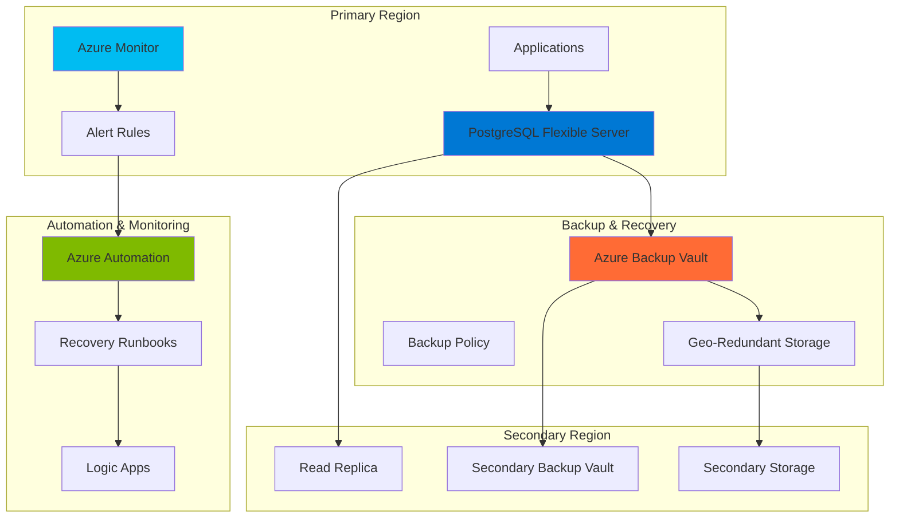

# PostgreSQL Disaster Recovery Automation with Flexible Server and Backup Services

## Problem

Organizations running critical applications on PostgreSQL databases face significant business risks from data loss, regional outages, and system failures. Traditional backup strategies often lack automation, cross-region protection, and monitoring-driven recovery capabilities, leaving businesses vulnerable to extended downtime and permanent data loss. Without comprehensive disaster recovery, companies risk regulatory compliance violations, customer trust erosion, and substantial financial losses during outages.

## Solution

This solution implements a comprehensive disaster recovery framework using Azure Database for PostgreSQL Flexible Server with automated backup management, cross-region replication, and intelligent monitoring-driven recovery workflows. The architecture combines Azure Database's built-in backup capabilities with Azure Backup's long-term retention, Azure Monitor's proactive alerting, and Azure Storage's geo-redundant protection to create a robust, automated disaster recovery system that ensures business continuity.

## Architecture Diagram



## Prerequisites

1. Azure subscription with appropriate permissions for Database, Backup, and Monitor resources
2. Azure CLI v2.53.0 or later installed and configured (or Azure Cloud Shell)
3. Basic understanding of PostgreSQL administration and backup concepts
4. Knowledge of Azure Resource Manager templates and monitoring concepts
5. Estimated cost: $150-300/month for production workloads (varies by region and retention)

> **Note**: This solution requires Premium or General Purpose service tiers for Azure Database for PostgreSQL Flexible Server to enable geo-redundant backups and read replicas.

## Preparation

```bash
# Set environment variables for Azure resources
export RESOURCE_GROUP="rg-postgres-dr-${RANDOM_SUFFIX}"
export LOCATION="East US"
export SECONDARY_LOCATION="West US 2"
export SUBSCRIPTION_ID=$(az account show --query id --output tsv)

# Generate unique suffix for resource names
RANDOM_SUFFIX=$(openssl rand -hex 3)

# Set PostgreSQL configuration
export PG_SERVER_NAME="pg-primary-${RANDOM_SUFFIX}"
export PG_REPLICA_NAME="pg-replica-${RANDOM_SUFFIX}"
export PG_ADMIN_USER="pgadmin"
export PG_ADMIN_PASSWORD="SecurePassword123!"
export PG_DATABASE_NAME="production_db"

# Set backup and monitoring configuration
export BACKUP_VAULT_NAME="bv-postgres-${RANDOM_SUFFIX}"
export BACKUP_VAULT_SECONDARY="bv-postgres-sec-${RANDOM_SUFFIX}"
export STORAGE_ACCOUNT_NAME="stpostgres${RANDOM_SUFFIX}"
export LOG_ANALYTICS_WORKSPACE="law-postgres-${RANDOM_SUFFIX}"
export AUTOMATION_ACCOUNT="aa-postgres-${RANDOM_SUFFIX}"

# Create primary resource group
az group create \
    --name ${RESOURCE_GROUP} \
    --location "${LOCATION}" \
    --tags purpose=disaster-recovery environment=production

# Create secondary resource group for DR
az group create \
    --name "${RESOURCE_GROUP}-secondary" \
    --location "${SECONDARY_LOCATION}" \
    --tags purpose=disaster-recovery environment=production

echo "✅ Resource groups created successfully"
```

## Steps

1. **Create Primary PostgreSQL Flexible Server with High Availability**:

   Azure Database for PostgreSQL Flexible Server provides enterprise-grade database capabilities with built-in high availability, automated patching, and backup management. Configuring zone-redundant high availability ensures automatic failover within the region, while geo-redundant backups provide cross-region protection. This foundation enables both local fault tolerance and disaster recovery capabilities.

   ```bash
   # Create PostgreSQL Flexible Server with high availability
   az postgres flexible-server create \
       --name ${PG_SERVER_NAME} \
       --resource-group ${RESOURCE_GROUP} \
       --location "${LOCATION}" \
       --admin-user ${PG_ADMIN_USER} \
       --admin-password ${PG_ADMIN_PASSWORD} \
       --sku-name Standard_D4s_v3 \
       --tier GeneralPurpose \
       --storage-size 128 \
       --storage-auto-grow Enabled \
       --backup-retention 35 \
       --geo-redundant-backup Enabled \
       --high-availability ZoneRedundant \
       --tags environment=production purpose=primary
   
   # Configure firewall rules for secure access
   az postgres flexible-server firewall-rule create \
       --name ${PG_SERVER_NAME} \
       --resource-group ${RESOURCE_GROUP} \
       --rule-name "AllowAzureServices" \
       --start-ip-address 0.0.0.0 \
       --end-ip-address 0.0.0.0
   
   echo "✅ Primary PostgreSQL server created with high availability"
   ```

   The PostgreSQL server is now configured with zone-redundant high availability, enabling automatic failover to a standby replica in a different availability zone. The 35-day backup retention and geo-redundant backup configuration provide comprehensive data protection for disaster recovery scenarios.

2. **Create Cross-Region Read Replica for Disaster Recovery**:

   Read replicas provide real-time data replication to secondary regions, enabling rapid disaster recovery with minimal data loss. This asynchronous replication maintains data consistency while allowing the primary server to operate without performance impact. The read replica serves as both a disaster recovery target and a resource for read-heavy workloads distribution.

   ```bash
   # Create read replica in secondary region
   az postgres flexible-server replica create \
       --name ${PG_REPLICA_NAME} \
       --resource-group "${RESOURCE_GROUP}-secondary" \
       --source-server ${PG_SERVER_NAME} \
       --location "${SECONDARY_LOCATION}" \
       --tags environment=production purpose=replica
   
   # Configure replica firewall rules
   az postgres flexible-server firewall-rule create \
       --name ${PG_REPLICA_NAME} \
       --resource-group "${RESOURCE_GROUP}-secondary" \
       --rule-name "AllowAzureServices" \
       --start-ip-address 0.0.0.0 \
       --end-ip-address 0.0.0.0
   
   # Get replica connection information
   PG_REPLICA_FQDN=$(az postgres flexible-server show \
       --name ${PG_REPLICA_NAME} \
       --resource-group "${RESOURCE_GROUP}-secondary" \
       --query fullyQualifiedDomainName \
       --output tsv)
   
   echo "✅ Read replica created: ${PG_REPLICA_FQDN}"
   ```

   The read replica is now operational in the secondary region, providing real-time data replication for disaster recovery. This configuration ensures business continuity with Recovery Time Objective (RTO) of minutes and Recovery Point Objective (RPO) measured in seconds.

3. **Set Up Azure Backup Vault for Long-Term Retention**:

   Azure Backup provides centralized backup management with long-term retention capabilities beyond the database's built-in backup retention. The backup vault enables policy-based backup scheduling, cross-region backup replication, and compliance-driven retention policies. This layer adds regulatory compliance support and extended recovery options.

   ```bash
   # Create backup vault for long-term retention
   az dataprotection backup-vault create \
       --name ${BACKUP_VAULT_NAME} \
       --resource-group ${RESOURCE_GROUP} \
       --location "${LOCATION}" \
       --storage-settings datastore-type=VaultStore \
           type=GeoRedundant \
       --tags purpose=backup environment=production
   
   # Create backup vault in secondary region
   az dataprotection backup-vault create \
       --name ${BACKUP_VAULT_SECONDARY} \
       --resource-group "${RESOURCE_GROUP}-secondary" \
       --location "${SECONDARY_LOCATION}" \
       --storage-settings datastore-type=VaultStore \
           type=GeoRedundant \
       --tags purpose=backup environment=production
   
   # Create backup policy for PostgreSQL
   az dataprotection backup-policy create \
       --name "PostgreSQLBackupPolicy" \
       --resource-group ${RESOURCE_GROUP} \
       --vault-name ${BACKUP_VAULT_NAME} \
       --policy '{
           "datasourceTypes": ["Microsoft.DBforPostgreSQL/flexibleServers"],
           "objectType": "BackupPolicy",
           "policyRules": [
               {
                   "backupParameters": {
                       "backupType": "Full",
                       "objectType": "AzureBackupParams"
                   },
                   "trigger": {
                       "schedule": {
                           "repeatingTimeIntervals": ["R/2024-01-01T02:00:00+00:00/P1D"]
                       },
                       "objectType": "ScheduleBasedTriggerContext"
                   },
                   "dataStore": {
                       "dataStoreType": "VaultStore",
                       "objectType": "DataStoreInfoBase"
                   },
                   "name": "BackupDaily",
                   "objectType": "AzureBackupRule"
               }
           ]
       }'
   
   echo "✅ Backup vaults and policies created"
   ```

   The backup infrastructure is now established with geo-redundant storage and daily backup schedules. This provides additional protection beyond the database's native backup capabilities, ensuring long-term data retention and compliance with regulatory requirements.

4. **Configure Azure Monitor and Log Analytics**:

   Azure Monitor provides comprehensive observability for database performance, backup status, and disaster recovery metrics. Log Analytics workspace centralizes telemetry data, enabling advanced querying and correlation across multiple Azure services. This monitoring foundation supports proactive alerting and automated recovery decision-making.

   ```bash
   # Create Log Analytics workspace
   az monitor log-analytics workspace create \
       --workspace-name ${LOG_ANALYTICS_WORKSPACE} \
       --resource-group ${RESOURCE_GROUP} \
       --location "${LOCATION}" \
       --tags purpose=monitoring environment=production
   
   # Get workspace ID for configuration
   WORKSPACE_ID=$(az monitor log-analytics workspace show \
       --workspace-name ${LOG_ANALYTICS_WORKSPACE} \
       --resource-group ${RESOURCE_GROUP} \
       --query customerId \
       --output tsv)
   
   # Configure diagnostic settings for PostgreSQL server
   az monitor diagnostic-settings create \
       --name "PostgreSQLDiagnostics" \
       --resource "/subscriptions/${SUBSCRIPTION_ID}/resourceGroups/${RESOURCE_GROUP}/providers/Microsoft.DBforPostgreSQL/flexibleServers/${PG_SERVER_NAME}" \
       --workspace ${WORKSPACE_ID} \
       --logs '[
           {
               "categoryGroup": "allLogs",
               "enabled": true,
               "retentionPolicy": {
                   "enabled": true,
                   "days": 90
               }
           }
       ]' \
       --metrics '[
           {
               "category": "AllMetrics",
               "enabled": true,
               "retentionPolicy": {
                   "enabled": true,
                   "days": 90
               }
           }
       ]'
   
   echo "✅ Monitoring and diagnostics configured"
   ```

   The monitoring infrastructure now captures comprehensive database telemetry, including performance metrics, backup status, and replication lag. This data enables both reactive troubleshooting and proactive disaster recovery automation.

5. **Create Storage Account for Backup Artifacts**:

   Azure Storage provides a centralized repository for backup artifacts, disaster recovery scripts, and recovery documentation. Geo-redundant storage ensures backup metadata and recovery procedures remain available during regional outages. This storage layer supports automated recovery workflows and manual intervention scenarios.

   ```bash
   # Create storage account for backup artifacts
   az storage account create \
       --name ${STORAGE_ACCOUNT_NAME} \
       --resource-group ${RESOURCE_GROUP} \
       --location "${LOCATION}" \
       --sku Standard_GRS \
       --kind StorageV2 \
       --access-tier Hot \
       --tags purpose=backup environment=production
   
   # Create containers for different backup types
   az storage container create \
       --name "database-backups" \
       --account-name ${STORAGE_ACCOUNT_NAME} \
       --auth-mode login
   
   az storage container create \
       --name "recovery-scripts" \
       --account-name ${STORAGE_ACCOUNT_NAME} \
       --auth-mode login
   
   az storage container create \
       --name "recovery-logs" \
       --account-name ${STORAGE_ACCOUNT_NAME} \
       --auth-mode login
   
   # Get storage account key for automation
   STORAGE_KEY=$(az storage account keys list \
       --account-name ${STORAGE_ACCOUNT_NAME} \
       --resource-group ${RESOURCE_GROUP} \
       --query '[0].value' \
       --output tsv)
   
   echo "✅ Storage account and containers created"
   ```

   The storage infrastructure now supports automated backup workflows and disaster recovery procedures. The geo-redundant storage ensures backup metadata and recovery scripts remain accessible during regional disasters.

6. **Set Up Azure Automation for Recovery Workflows**:

   Azure Automation enables automated disaster recovery workflows triggered by monitoring alerts or manual intervention. Runbooks encapsulate recovery procedures, ensuring consistent and rapid response to disaster scenarios. This automation reduces recovery time and minimizes human error during high-stress recovery situations.

   ```bash
   # Create Azure Automation account
   az automation account create \
       --name ${AUTOMATION_ACCOUNT} \
       --resource-group ${RESOURCE_GROUP} \
       --location "${LOCATION}" \
       --tags purpose=automation environment=production
   
   # Create automation credential for PostgreSQL admin
   az automation credential create \
       --name "PostgreSQLAdmin" \
       --automation-account-name ${AUTOMATION_ACCOUNT} \
       --resource-group ${RESOURCE_GROUP} \
       --user-name ${PG_ADMIN_USER} \
       --password ${PG_ADMIN_PASSWORD}
   
   # Create runbook for disaster recovery
   cat > disaster-recovery-runbook.ps1 << 'EOF'
   param(
       [Parameter(Mandatory=$true)]
       [string]$ResourceGroupName,
       
       [Parameter(Mandatory=$true)]
       [string]$ReplicaServerName,
       
       [Parameter(Mandatory=$true)]
       [string]$SecondaryResourceGroup
   )
   
   # Import required modules
   Import-Module Az.PostgreSQL
   Import-Module Az.Monitor
   
   # Authenticate using managed identity
   Connect-AzAccount -Identity
   
   # Promote read replica to primary
   Write-Output "Promoting read replica to primary server..."
   
   try {
       # Stop replication and promote replica
       Stop-AzPostgreSqlFlexibleServerReplica -Name $ReplicaServerName -ResourceGroupName $SecondaryResourceGroup
       
       # Update DNS or application connection strings here
       Write-Output "Replica promoted successfully"
       
       # Send notification
       Write-Output "Disaster recovery completed for server: $ReplicaServerName"
   }
   catch {
       Write-Error "Disaster recovery failed: $_"
       throw
   }
   EOF
   
   # Import runbook
   az automation runbook create \
       --name "PostgreSQL-DisasterRecovery" \
       --automation-account-name ${AUTOMATION_ACCOUNT} \
       --resource-group ${RESOURCE_GROUP} \
       --type PowerShell \
       --runbook-content @disaster-recovery-runbook.ps1
   
   echo "✅ Automation account and runbook created"
   ```

   The automation infrastructure now provides automated disaster recovery capabilities through PowerShell runbooks. This enables rapid response to disasters while maintaining audit trails and consistency across recovery procedures.

7. **Configure Alert Rules for Proactive Monitoring**:

   Alert rules provide proactive monitoring for disaster scenarios, database performance degradation, and backup failures. Multi-dimensional alerting enables context-aware notifications that trigger appropriate automation workflows. This monitoring system ensures early detection of issues before they impact business operations.

   ```bash
   # Create action group for disaster recovery notifications
   az monitor action-group create \
       --name "DisasterRecoveryAlerts" \
       --resource-group ${RESOURCE_GROUP} \
       --short-name "DRAlerts" \
       --email-receivers name=DRTeam email=disaster-recovery@company.com
   
   # Create alert rule for database connectivity issues
   az monitor metrics alert create \
       --name "PostgreSQL-ConnectionFailures" \
       --resource-group ${RESOURCE_GROUP} \
       --scopes "/subscriptions/${SUBSCRIPTION_ID}/resourceGroups/${RESOURCE_GROUP}/providers/Microsoft.DBforPostgreSQL/flexibleServers/${PG_SERVER_NAME}" \
       --condition "count static failed_connections > 10" \
       --window-size 5m \
       --evaluation-frequency 1m \
       --severity 2 \
       --action-groups "/subscriptions/${SUBSCRIPTION_ID}/resourceGroups/${RESOURCE_GROUP}/providers/Microsoft.Insights/actionGroups/DisasterRecoveryAlerts"
   
   # Create alert rule for high replication lag
   az monitor metrics alert create \
       --name "PostgreSQL-ReplicationLag" \
       --resource-group ${RESOURCE_GROUP} \
       --scopes "/subscriptions/${SUBSCRIPTION_ID}/resourceGroups/${RESOURCE_GROUP}/providers/Microsoft.DBforPostgreSQL/flexibleServers/${PG_SERVER_NAME}" \
       --condition "average static replica_lag > 300" \
       --window-size 5m \
       --evaluation-frequency 1m \
       --severity 1 \
       --action-groups "/subscriptions/${SUBSCRIPTION_ID}/resourceGroups/${RESOURCE_GROUP}/providers/Microsoft.Insights/actionGroups/DisasterRecoveryAlerts"
   
   # Create alert rule for backup failures
   az monitor metrics alert create \
       --name "PostgreSQL-BackupFailures" \
       --resource-group ${RESOURCE_GROUP} \
       --scopes "/subscriptions/${SUBSCRIPTION_ID}/resourceGroups/${RESOURCE_GROUP}/providers/Microsoft.DBforPostgreSQL/flexibleServers/${PG_SERVER_NAME}" \
       --condition "count static backup_failures > 0" \
       --window-size 15m \
       --evaluation-frequency 5m \
       --severity 1 \
       --action-groups "/subscriptions/${SUBSCRIPTION_ID}/resourceGroups/${RESOURCE_GROUP}/providers/Microsoft.Insights/actionGroups/DisasterRecoveryAlerts"
   
   echo "✅ Alert rules configured for proactive monitoring"
   ```

   The alerting system now provides comprehensive monitoring for disaster recovery scenarios, database performance issues, and backup failures. These alerts enable proactive intervention before issues escalate to full disasters.

8. **Create Sample Database and Test Data**:

   Sample data provides a realistic testing environment for disaster recovery procedures and backup validation. This step establishes a baseline for testing recovery scenarios and validates that backup and restore operations maintain data integrity. Regular testing with sample data ensures disaster recovery procedures work correctly when needed.

   ```bash
   # Create sample database and populate with test data
   PG_FQDN=$(az postgres flexible-server show \
       --name ${PG_SERVER_NAME} \
       --resource-group ${RESOURCE_GROUP} \
       --query fullyQualifiedDomainName \
       --output tsv)
   
   # Create database and sample data
   psql "postgresql://${PG_ADMIN_USER}:${PG_ADMIN_PASSWORD}@${PG_FQDN}:5432/postgres" << 'EOF'
   CREATE DATABASE production_db;
   \c production_db;
   
   CREATE TABLE customer_data (
       id SERIAL PRIMARY KEY,
       customer_name VARCHAR(100),
       email VARCHAR(100),
       created_at TIMESTAMP DEFAULT CURRENT_TIMESTAMP,
       last_updated TIMESTAMP DEFAULT CURRENT_TIMESTAMP
   );
   
   INSERT INTO customer_data (customer_name, email) VALUES
   ('John Doe', 'john.doe@example.com'),
   ('Jane Smith', 'jane.smith@example.com'),
   ('Bob Johnson', 'bob.johnson@example.com'),
   ('Alice Brown', 'alice.brown@example.com'),
   ('Charlie Wilson', 'charlie.wilson@example.com');
   
   CREATE TABLE order_history (
       order_id SERIAL PRIMARY KEY,
       customer_id INTEGER REFERENCES customer_data(id),
       order_amount DECIMAL(10,2),
       order_date TIMESTAMP DEFAULT CURRENT_TIMESTAMP
   );
   
   INSERT INTO order_history (customer_id, order_amount) VALUES
   (1, 150.00),
   (2, 200.50),
   (3, 75.25),
   (1, 300.00),
   (4, 125.75);
   
   -- Create index for performance
   CREATE INDEX idx_customer_email ON customer_data(email);
   CREATE INDEX idx_order_date ON order_history(order_date);
   
   SELECT 'Database and sample data created successfully' AS result;
   EOF
   
   echo "✅ Sample database and test data created"
   ```

   The sample database now provides realistic test data for disaster recovery validation. This environment enables comprehensive testing of backup, restore, and failover procedures without impacting production workloads.

## Validation & Testing

1. **Verify PostgreSQL Server Configuration**:

   ```bash
   # Check primary server status and configuration
   az postgres flexible-server show \
       --name ${PG_SERVER_NAME} \
       --resource-group ${RESOURCE_GROUP} \
       --output table
   
   # Verify high availability configuration
   az postgres flexible-server show \
       --name ${PG_SERVER_NAME} \
       --resource-group ${RESOURCE_GROUP} \
       --query "highAvailability" \
       --output json
   ```

   Expected output: Server should show "Ready" state with zone-redundant high availability enabled.

2. **Test Read Replica Connectivity and Data Replication**:

   ```bash
   # Test read replica connectivity
   psql "postgresql://${PG_ADMIN_USER}:${PG_ADMIN_PASSWORD}@${PG_REPLICA_FQDN}:5432/production_db" \
       -c "SELECT COUNT(*) FROM customer_data;"
   
   # Check replication lag
   az monitor metrics list \
       --resource "/subscriptions/${SUBSCRIPTION_ID}/resourceGroups/${RESOURCE_GROUP}/providers/Microsoft.DBforPostgreSQL/flexibleServers/${PG_SERVER_NAME}" \
       --metric "replica_lag" \
       --interval PT1M \
       --output table
   ```

   Expected output: Replica should return same data count as primary with minimal replication lag.

3. **Validate Backup Configuration**:

   ```bash
   # Check backup retention and geo-redundancy settings
   az postgres flexible-server show \
       --name ${PG_SERVER_NAME} \
       --resource-group ${RESOURCE_GROUP} \
       --query "backup" \
       --output json
   
   # Verify backup vault configuration
   az dataprotection backup-vault show \
       --name ${BACKUP_VAULT_NAME} \
       --resource-group ${RESOURCE_GROUP} \
       --query "storageSettings" \
       --output json
   ```

   Expected output: Backup retention should show 35 days with geo-redundant backup enabled.

4. **Test Disaster Recovery Automation**:

   ```bash
   # Test runbook execution (dry run)
   az automation runbook start \
       --name "PostgreSQL-DisasterRecovery" \
       --automation-account-name ${AUTOMATION_ACCOUNT} \
       --resource-group ${RESOURCE_GROUP} \
       --parameters ResourceGroupName=${RESOURCE_GROUP} \
                   ReplicaServerName=${PG_REPLICA_NAME} \
                   SecondaryResourceGroup="${RESOURCE_GROUP}-secondary"
   
   # Monitor runbook execution
   az automation job list \
       --automation-account-name ${AUTOMATION_ACCOUNT} \
       --resource-group ${RESOURCE_GROUP} \
       --output table
   ```

   Expected output: Runbook should execute successfully and provide disaster recovery status.

5. **Verify Monitoring and Alerting**:

   ```bash
   # Check alert rule configuration
   az monitor metrics alert list \
       --resource-group ${RESOURCE_GROUP} \
       --output table
   
   # Test alert rule by checking current metrics
   az monitor metrics list \
       --resource "/subscriptions/${SUBSCRIPTION_ID}/resourceGroups/${RESOURCE_GROUP}/providers/Microsoft.DBforPostgreSQL/flexibleServers/${PG_SERVER_NAME}" \
       --metric "connections_failed" \
       --interval PT5M \
       --output table
   ```

   Expected output: Alert rules should be enabled and configured correctly.

## Cleanup

1. **Stop Sample Database Connections**:

   ```bash
   # Terminate active connections to sample database
   psql "postgresql://${PG_ADMIN_USER}:${PG_ADMIN_PASSWORD}@${PG_FQDN}:5432/postgres" \
       -c "SELECT pg_terminate_backend(pid) FROM pg_stat_activity WHERE datname = 'production_db';"
   
   echo "✅ Database connections terminated"
   ```

2. **Remove Alert Rules and Monitoring**:

   ```bash
   # Delete alert rules
   az monitor metrics alert delete \
       --name "PostgreSQL-ConnectionFailures" \
       --resource-group ${RESOURCE_GROUP}
   
   az monitor metrics alert delete \
       --name "PostgreSQL-ReplicationLag" \
       --resource-group ${RESOURCE_GROUP}
   
   az monitor metrics alert delete \
       --name "PostgreSQL-BackupFailures" \
       --resource-group ${RESOURCE_GROUP}
   
   # Delete action group
   az monitor action-group delete \
       --name "DisasterRecoveryAlerts" \
       --resource-group ${RESOURCE_GROUP}
   
   echo "✅ Monitoring and alerts removed"
   ```

3. **Delete Automation Resources**:

   ```bash
   # Delete automation account
   az automation account delete \
       --name ${AUTOMATION_ACCOUNT} \
       --resource-group ${RESOURCE_GROUP} \
       --yes
   
   echo "✅ Automation account deleted"
   ```

4. **Remove Backup Infrastructure**:

   ```bash
   # Delete backup vaults
   az dataprotection backup-vault delete \
       --name ${BACKUP_VAULT_NAME} \
       --resource-group ${RESOURCE_GROUP} \
       --yes
   
   az dataprotection backup-vault delete \
       --name ${BACKUP_VAULT_SECONDARY} \
       --resource-group "${RESOURCE_GROUP}-secondary" \
       --yes
   
   echo "✅ Backup vaults deleted"
   ```

5. **Delete Storage Account**:

   ```bash
   # Delete storage account
   az storage account delete \
       --name ${STORAGE_ACCOUNT_NAME} \
       --resource-group ${RESOURCE_GROUP} \
       --yes
   
   echo "✅ Storage account deleted"
   ```

6. **Remove PostgreSQL Resources**:

   ```bash
   # Delete read replica first
   az postgres flexible-server delete \
       --name ${PG_REPLICA_NAME} \
       --resource-group "${RESOURCE_GROUP}-secondary" \
       --yes
   
   # Delete primary PostgreSQL server
   az postgres flexible-server delete \
       --name ${PG_SERVER_NAME} \
       --resource-group ${RESOURCE_GROUP} \
       --yes
   
   echo "✅ PostgreSQL servers deleted"
   ```

7. **Remove Log Analytics and Resource Groups**:

   ```bash
   # Delete Log Analytics workspace
   az monitor log-analytics workspace delete \
       --workspace-name ${LOG_ANALYTICS_WORKSPACE} \
       --resource-group ${RESOURCE_GROUP} \
       --yes
   
   # Delete resource groups
   az group delete \
       --name ${RESOURCE_GROUP} \
       --yes \
       --no-wait
   
   az group delete \
       --name "${RESOURCE_GROUP}-secondary" \
       --yes \
       --no-wait
   
   echo "✅ Resource groups deletion initiated"
   echo "Note: Resource group deletion may take several minutes to complete"
   ```

## Discussion

Azure Database for PostgreSQL Flexible Server with Azure Backup creates a comprehensive disaster recovery solution that addresses both regional outages and data corruption scenarios. The combination of zone-redundant high availability, geo-redundant backups, and cross-region read replicas provides multiple layers of protection with different Recovery Time Objectives (RTO) and Recovery Point Objectives (RPO). This architecture follows the [Azure Well-Architected Framework](https://docs.microsoft.com/en-us/azure/architecture/framework/) reliability principles while maintaining cost-effectiveness through automated management.

The disaster recovery strategy leverages Azure's native capabilities to minimize operational overhead while maximizing data protection. Read replicas provide near-instantaneous failover capabilities with RPO measured in seconds, while the backup infrastructure ensures long-term data retention and compliance requirements. For comprehensive guidance on PostgreSQL disaster recovery patterns, see the [Azure Database for PostgreSQL documentation](https://docs.microsoft.com/en-us/azure/postgresql/flexible-server/concepts-business-continuity) and [backup best practices](https://docs.microsoft.com/en-us/azure/postgresql/flexible-server/concepts-backup-restore).

The monitoring and automation components create a proactive disaster recovery posture that reduces human intervention and accelerates recovery times. Azure Monitor's integration with Azure Automation enables event-driven recovery workflows that can automatically promote read replicas or trigger backup restores based on predefined conditions. This approach significantly reduces the Mean Time to Recovery (MTTR) while maintaining audit trails and compliance documentation. For detailed monitoring strategies, review the [Azure Monitor documentation](https://docs.microsoft.com/en-us/azure/azure-monitor/platform/metrics-supported#microsoftdbforpostgresqlflexibleservers).

From a cost optimization perspective, the solution balances comprehensive protection with operational efficiency. The geo-redundant backup storage incurs additional costs but provides essential cross-region protection, while read replicas serve dual purposes for both disaster recovery and read scaling. Consider implementing [Azure Cost Management](https://docs.microsoft.com/en-us/azure/cost-management-billing/costs/quick-acm-cost-analysis) policies to monitor disaster recovery costs and optimize resource utilization based on actual recovery requirements.

> **Tip**: Regularly test disaster recovery procedures using the read replica promotion process to ensure recovery workflows function correctly. Use Azure Monitor's synthetic monitoring capabilities to validate application connectivity during failover scenarios and maintain updated recovery documentation.

## Challenge

Extend this disaster recovery solution by implementing these enhancements:

1. **Implement Application-Level Failover**: Create an Azure Traffic Manager or Application Gateway configuration that automatically redirects application traffic to the secondary region during disaster scenarios, including health checks and automatic failback capabilities.

2. **Add Cross-Region Backup Validation**: Develop Azure Functions that periodically restore backups to temporary instances in secondary regions, validate data integrity, and report backup health status to ensure recovery procedures work correctly.

3. **Create Automated DR Testing**: Build Azure DevOps pipelines that automatically perform disaster recovery testing on a monthly basis, including read replica promotion, application connectivity testing, and automatic cleanup of test resources.

4. **Implement Granular Recovery Options**: Add point-in-time recovery capabilities using Azure Database's built-in features, combined with transaction log shipping to provide more granular recovery options for different types of data corruption scenarios.

5. **Develop Multi-Database Coordination**: Extend the solution to handle multiple PostgreSQL databases with coordinated disaster recovery, ensuring consistent failover timing and data synchronization across related database systems.

## Infrastructure Code

*Infrastructure code will be generated after recipe approval.*