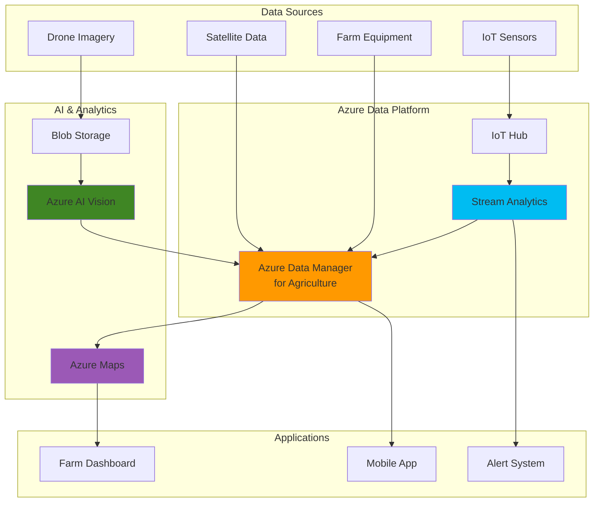

# Precision Agriculture Analytics with AI-Driven Insights

## Problem

Modern agricultural operations generate massive amounts of data from sensors, drones, satellite imagery, and farm equipment, but this data remains siloed across different systems and vendors. Farmers struggle to gain actionable insights from fragmented datasets, leading to suboptimal crop management decisions, inefficient resource allocation, and reduced yields. Traditional farm management systems lack the intelligence to process complex agricultural data patterns and provide predictive recommendations for crop health, irrigation timing, and harvest optimization.

## Solution

Build a comprehensive precision agriculture platform using Azure Data Manager for Agriculture to unify farm data from multiple sources, Azure AI Services to analyze crop imagery and predict health issues, and Azure Stream Analytics to process real-time IoT sensor data. This integrated solution provides farmers with intelligent insights through geospatial visualization using Azure Maps, enabling data-driven decisions for optimized farming operations and sustainable resource management.

## Architecture Diagram



## Prerequisites

1. Azure subscription with appropriate permissions for creating resources
2. Azure CLI v2.40.0 or higher installed and configured (or Azure Cloud Shell)
3. Basic understanding of IoT data processing and geospatial concepts
4. Access to Azure Data Manager for Agriculture preview (requires approval)
5. Sample agricultural imagery and sensor data for testing
6. Estimated cost: $150-250 for 2-day testing period

> **Note**: Azure Data Manager for Agriculture is currently in preview and requires registration approval. Submit your access request using the [preview registration form](https://aka.ms/agridatamanager) before beginning this recipe.

## Preparation

```bash
# Set environment variables for Azure resources
export RESOURCE_GROUP="rg-precision-ag-${RANDOM_SUFFIX}"
export LOCATION="eastus"
export SUBSCRIPTION_ID=$(az account show --query id --output tsv)

# Generate unique suffix for resource names
RANDOM_SUFFIX=$(openssl rand -hex 3)

# Set resource names with agriculture-specific prefixes
export ADMA_INSTANCE="adma-farm-${RANDOM_SUFFIX}"
export IOT_HUB_NAME="iothub-farm-${RANDOM_SUFFIX}"
export STREAM_JOB_NAME="stream-farm-${RANDOM_SUFFIX}"
export STORAGE_ACCOUNT="stfarm${RANDOM_SUFFIX}"
export AI_SERVICES_NAME="ai-farm-${RANDOM_SUFFIX}"
export MAPS_ACCOUNT="maps-farm-${RANDOM_SUFFIX}"

# Create resource group with agriculture-specific tags
az group create \
    --name ${RESOURCE_GROUP} \
    --location ${LOCATION} \
    --tags purpose=precision-agriculture environment=demo \
           industry=agriculture workload=analytics

echo "✅ Resource group created: ${RESOURCE_GROUP}"

# Create storage account for agricultural imagery and data
az storage account create \
    --name ${STORAGE_ACCOUNT} \
    --resource-group ${RESOURCE_GROUP} \
    --location ${LOCATION} \
    --sku Standard_LRS \
    --kind StorageV2 \
    --access-tier Hot

# Get storage account key for later use
export STORAGE_KEY=$(az storage account keys list \
    --resource-group ${RESOURCE_GROUP} \
    --account-name ${STORAGE_ACCOUNT} \
    --query '[0].value' --output tsv)

echo "✅ Storage account created for agricultural data"
```

## Steps

1. **Deploy Azure Data Manager for Agriculture Instance**:

   Azure Data Manager for Agriculture serves as the central hub for agricultural data integration, providing industry-specific APIs and data models for farm operations, crop monitoring, and field management. This managed service eliminates the complexity of building custom agricultural data pipelines while ensuring compliance with industry standards for precision agriculture workflows.

   ```bash
   # Create Azure Data Manager for Agriculture instance
   # Note: This service uses REST API as CLI extension is not available
   az rest --method PUT \
       --url "https://management.azure.com/subscriptions/${SUBSCRIPTION_ID}/resourceGroups/${RESOURCE_GROUP}/providers/Microsoft.AgFoodPlatform/farmBeats/${ADMA_INSTANCE}?api-version=2023-06-01-preview" \
       --body '{
         "location": "'${LOCATION}'",
         "properties": {},
         "tags": {
           "farm-type": "mixed-crop",
           "season": "2025"
         }
       }'
   
   # Get the service endpoint
   export ADMA_ENDPOINT=$(az rest \
       --method GET \
       --url "https://management.azure.com/subscriptions/${SUBSCRIPTION_ID}/resourceGroups/${RESOURCE_GROUP}/providers/Microsoft.AgFoodPlatform/farmBeats/${ADMA_INSTANCE}?api-version=2023-06-01-preview" \
       --query "properties.instanceUri" --output tsv)
   
   echo "✅ Azure Data Manager for Agriculture deployed: ${ADMA_ENDPOINT}"
   ```

   The Data Manager instance is now ready to ingest agricultural data from multiple sources. This foundation enables standardized data models for farms, fields, boundaries, and crop activities, providing the semantic layer necessary for intelligent agricultural analytics and cross-farm comparisons.

2. **Configure IoT Hub for Sensor Data Ingestion**:

   IoT Hub provides scalable, secure connectivity for agricultural sensors, weather stations, and monitoring devices. The hub's device-to-cloud messaging enables real-time collection of soil moisture, temperature, humidity, and other critical environmental parameters that drive precision agriculture decisions.

   ```bash
   # Create IoT Hub for farm sensor data
   az iot hub create \
       --resource-group ${RESOURCE_GROUP} \
       --name ${IOT_HUB_NAME} \
       --location ${LOCATION} \
       --sku S1 \
       --partition-count 4 \
       --tags purpose=farm-sensors data-type=telemetry
   
   # Get IoT Hub connection string
   export IOT_CONNECTION_STRING=$(az iot hub connection-string show \
       --hub-name ${IOT_HUB_NAME} \
       --resource-group ${RESOURCE_GROUP} \
       --query connectionString --output tsv)
   
   # Create a sample IoT device for demonstration
   az iot hub device-identity create \
       --hub-name ${IOT_HUB_NAME} \
       --device-id soil-sensor-field-01 \
       --edge-enabled false
   
   echo "✅ IoT Hub configured for agricultural sensor data"
   ```

   The IoT Hub now provides reliable, bi-directional communication between farm sensors and the cloud platform. This enables real-time monitoring of field conditions and supports automated irrigation systems, pest management alerts, and environmental compliance reporting.

3. **Deploy Azure AI Services for Computer Vision Analysis**:

   Azure AI Services Computer Vision enables intelligent analysis of drone imagery, satellite photos, and field photos to detect crop health issues, pest infestations, and growth patterns. This capability transforms visual data into actionable insights for precision agriculture decision-making and early problem detection.

   ```bash
   # Create Azure AI Services for computer vision
   az cognitiveservices account create \
       --name ${AI_SERVICES_NAME} \
       --resource-group ${RESOURCE_GROUP} \
       --location ${LOCATION} \
       --kind CognitiveServices \
       --sku S0 \
       --custom-domain ${AI_SERVICES_NAME} \
       --tags purpose=crop-analysis service=computer-vision
   
   # Get the AI Services key and endpoint
   export AI_SERVICES_KEY=$(az cognitiveservices account keys list \
       --name ${AI_SERVICES_NAME} \
       --resource-group ${RESOURCE_GROUP} \
       --query key1 --output tsv)
   
   export AI_SERVICES_ENDPOINT=$(az cognitiveservices account show \
       --name ${AI_SERVICES_NAME} \
       --resource-group ${RESOURCE_GROUP} \
       --query properties.endpoint --output tsv)
   
   echo "✅ Azure AI Services deployed for crop image analysis"
   ```

   The AI Services instance is now ready to process agricultural imagery using pre-trained models for object detection, custom vision models for crop disease identification, and optical character recognition for equipment data extraction. This enables automated crop health assessment and reduces the need for manual field inspections.

4. **Create Azure Maps Account for Geospatial Visualization**:

   Azure Maps provides geospatial services essential for precision agriculture, including field boundary mapping, GPS tracking of farm equipment, and spatial analysis of crop performance across different zones. This service enables farmers to visualize data patterns across their operations and optimize field-specific management strategies.

   ```bash
   # Create Azure Maps account
   az maps account create \
       --resource-group ${RESOURCE_GROUP} \
       --name ${MAPS_ACCOUNT} \
       --location ${LOCATION} \
       --sku S1 \
       --tags purpose=field-mapping service=geospatial
   
   # Get Azure Maps primary key
   export MAPS_KEY=$(az maps account keys list \
       --resource-group ${RESOURCE_GROUP} \
       --name ${MAPS_ACCOUNT} \
       --query primaryKey --output tsv)
   
   echo "✅ Azure Maps account created for geospatial analysis"
   ```

   The Maps account provides essential geospatial capabilities for field boundary definition, GPS-based equipment tracking, and spatial interpolation of sensor data. This foundation enables zone-specific crop management and precision application of inputs based on spatial variability analysis.

5. **Deploy Stream Analytics for Real-time Data Processing**:

   Azure Stream Analytics processes continuous streams of IoT sensor data in real-time, enabling immediate detection of critical conditions like drought stress, pest outbreaks, or equipment failures. This real-time processing capability is essential for precision agriculture applications requiring rapid response to changing field conditions.

   ```bash
   # Create Stream Analytics job
   az stream-analytics job create \
       --resource-group ${RESOURCE_GROUP} \
       --name ${STREAM_JOB_NAME} \
       --location ${LOCATION} \
       --output-error-policy stop \
       --events-out-of-order-policy adjust \
       --events-out-of-order-max-delay 10 \
       --events-late-arrival-max-delay 5
   
   # Get IoT Hub access key for Stream Analytics configuration
   export IOT_HUB_KEY=$(az iot hub policy show \
       --hub-name ${IOT_HUB_NAME} \
       --name iothubowner \
       --query primaryKey --output tsv)
   
   # Configure IoT Hub as input source using proper JSON format
   az stream-analytics input create \
       --resource-group ${RESOURCE_GROUP} \
       --job-name ${STREAM_JOB_NAME} \
       --name SensorInput \
       --properties '{
         "type": "Stream",
         "serialization": {
           "type": "Json",
           "properties": {
             "encoding": "UTF8"
           }
         },
         "datasource": {
           "type": "Microsoft.Devices/IotHubs",
           "properties": {
             "iotHubNamespace": "'${IOT_HUB_NAME}'",
             "sharedAccessPolicyName": "iothubowner",
             "sharedAccessPolicyKey": "'${IOT_HUB_KEY}'",
             "endpoint": "messages/events",
             "consumerGroupName": "$Default"
           }
         }
       }'
   
   echo "✅ Stream Analytics job configured for real-time processing"
   ```

   The Stream Analytics job now processes agricultural sensor data in real-time, enabling immediate calculation of derived metrics like evapotranspiration rates, growing degree days, and irrigation scheduling recommendations. This real-time intelligence supports automated decision-making for precision agriculture operations.

6. **Create Storage Containers for Agricultural Data**:

   Organized data storage is critical for precision agriculture applications that process imagery, sensor data, and field records. Azure Blob Storage provides cost-effective, scalable storage with appropriate access patterns for both real-time analytics and historical trend analysis.

   ```bash
   # Create storage containers for different data types
   az storage container create \
       --name crop-imagery \
       --account-name ${STORAGE_ACCOUNT} \
       --account-key ${STORAGE_KEY} \
       --public-access off
   
   az storage container create \
       --name field-boundaries \
       --account-name ${STORAGE_ACCOUNT} \
       --account-key ${STORAGE_KEY} \
       --public-access off
   
   az storage container create \
       --name weather-data \
       --account-name ${STORAGE_ACCOUNT} \
       --account-key ${STORAGE_KEY} \
       --public-access off
   
   az storage container create \
       --name analytics-results \
       --account-name ${STORAGE_ACCOUNT} \
       --account-key ${STORAGE_KEY} \
       --public-access off
   
   echo "✅ Storage containers created for agricultural data organization"
   ```

   The storage infrastructure now provides organized repositories for different agricultural data types. This structure supports efficient data lifecycle management, from real-time ingestion through long-term archival for multi-season analysis and machine learning model training.

7. **Configure Farm and Field Entities in Data Manager**:

   Azure Data Manager for Agriculture uses standardized agricultural data models to represent farms, fields, and boundaries. This configuration establishes the foundational entities that enable spatial analysis, crop rotation tracking, and field-specific management recommendations across the precision agriculture platform.

   ```bash
   # Create a sample farm entity using the correct API version
   export FARM_ID="demo-farm-$(date +%s)"
   
   # Get access token for Data Manager API calls
   export ACCESS_TOKEN=$(az account get-access-token \
       --resource https://farmbeats.azure.net \
       --query accessToken --output tsv)
   
   curl -X PUT "${ADMA_ENDPOINT}/farmers/${FARM_ID}?api-version=2023-11-01-preview" \
       -H "Content-Type: application/json" \
       -H "Authorization: Bearer ${ACCESS_TOKEN}" \
       -d '{
         "name": "Demo Precision Farm",
         "description": "Sample farm for precision agriculture analytics",
         "status": "Active",
         "properties": {
           "totalArea": 1000,
           "cropTypes": ["corn", "soybeans"],
           "farmingMethod": "precision"
         }
       }'
   
   # Create a field boundary
   export FIELD_ID="field-north-40-$(date +%s)"
   
   curl -X PUT "${ADMA_ENDPOINT}/farmers/${FARM_ID}/fields/${FIELD_ID}?api-version=2023-11-01-preview" \
       -H "Content-Type: application/json" \
       -H "Authorization: Bearer ${ACCESS_TOKEN}" \
       -d '{
         "name": "North 40 Field",
         "farmerId": "'${FARM_ID}'",
         "area": {
           "unit": "acres",
           "value": 40
         },
         "properties": {
           "soilType": "loam",
           "drainageClass": "well-drained",
           "slope": "gentle"
         }
       }'
   
   echo "✅ Farm and field entities configured in Data Manager"
   ```

   The farm and field entities provide the spatial and organizational framework for precision agriculture analytics. This standardized approach enables cross-field comparisons, rotation planning, and integration with external agricultural data sources through industry-standard APIs.

8. **Set Up Automated Image Analysis Pipeline**:

   Automated image analysis transforms raw drone and satellite imagery into actionable crop health insights. This pipeline processes agricultural imagery using Azure AI Services to detect vegetation indices, identify stress patterns, and generate recommendations for targeted interventions in precision agriculture operations.

   ```bash
   # Create Azure Function for automated image processing
   export FUNCTION_APP_NAME="func-crop-analysis-${RANDOM_SUFFIX}"
   
   az functionapp create \
       --resource-group ${RESOURCE_GROUP} \
       --consumption-plan-location ${LOCATION} \
       --runtime python \
       --runtime-version 3.9 \
       --functions-version 4 \
       --name ${FUNCTION_APP_NAME} \
       --storage-account ${STORAGE_ACCOUNT} \
       --tags purpose=image-analysis automation=crop-health
   
   # Configure function app settings for AI Services integration
   az functionapp config appsettings set \
       --name ${FUNCTION_APP_NAME} \
       --resource-group ${RESOURCE_GROUP} \
       --settings \
           "AI_SERVICES_ENDPOINT=${AI_SERVICES_ENDPOINT}" \
           "AI_SERVICES_KEY=${AI_SERVICES_KEY}" \
           "STORAGE_CONNECTION_STRING=DefaultEndpointsProtocol=https;AccountName=${STORAGE_ACCOUNT};AccountKey=${STORAGE_KEY};EndpointSuffix=core.windows.net" \
           "ADMA_ENDPOINT=${ADMA_ENDPOINT}"
   
   echo "✅ Image analysis pipeline configured for automated processing"
   ```

   The automated pipeline now processes agricultural imagery as soon as it's uploaded to storage. This enables near real-time crop health monitoring, early detection of pest or disease issues, and automated generation of field management recommendations based on computer vision analysis.

## Validation & Testing

1. **Verify Azure Data Manager for Agriculture Deployment**:

   ```bash
   # Check Data Manager instance status using REST API
   az rest --method GET \
       --url "https://management.azure.com/subscriptions/${SUBSCRIPTION_ID}/resourceGroups/${RESOURCE_GROUP}/providers/Microsoft.AgFoodPlatform/farmBeats/${ADMA_INSTANCE}?api-version=2023-06-01-preview" \
       --query "properties.provisioningState" --output table
   
   # Test Data Manager API connectivity
   curl -X GET "${ADMA_ENDPOINT}/farmers?api-version=2023-11-01-preview" \
       -H "Authorization: Bearer ${ACCESS_TOKEN}" \
       -H "Content-Type: application/json"
   ```

   Expected output: `"provisioningState": "Succeeded"` and JSON response with farmer entities.

2. **Test IoT Hub Sensor Data Ingestion**:

   ```bash
   # Send sample sensor data to IoT Hub using device simulation
   az iot device simulate \
       --hub-name ${IOT_HUB_NAME} \
       --device-id soil-sensor-field-01 \
       --data '{
         "deviceId": "soil-sensor-field-01",
         "timestamp": "'$(date -u +%Y-%m-%dT%H:%M:%SZ)'",
         "soilMoisture": 65.4,
         "soilTemperature": 18.2,
         "fieldId": "'${FIELD_ID}'",
         "location": {"lat": 41.8781, "lon": -87.6298}
       }' \
       --msg-count 5 \
       --msg-interval 10
   
   echo "✅ Sample sensor data sent to IoT Hub"
   ```

3. **Validate AI Services Computer Vision Setup**:

   ```bash
   # Test AI Services connectivity with latest API version
   curl -X POST "${AI_SERVICES_ENDPOINT}/vision/v3.2/analyze?visualFeatures=Categories,Tags,Description" \
       -H "Ocp-Apim-Subscription-Key: ${AI_SERVICES_KEY}" \
       -H "Content-Type: application/json" \
       -d '{"url": "https://example.com/sample-crop-image.jpg"}' \
       --write-out "HTTP Status: %{http_code}\n"
   ```

   Expected output: `HTTP Status: 200` with JSON analysis results.

4. **Verify Stream Analytics Job Configuration**:

   ```bash
   # Check Stream Analytics job status
   az stream-analytics job show \
       --resource-group ${RESOURCE_GROUP} \
       --name ${STREAM_JOB_NAME} \
       --query "jobState" --output table
   
   # Start the Stream Analytics job
   az stream-analytics job start \
       --resource-group ${RESOURCE_GROUP} \
       --name ${STREAM_JOB_NAME} \
       --output-start-mode JobStartTime
   ```

5. **Test Azure Maps Geospatial Services**:

   ```bash
   # Test Maps API with sample coordinates
   curl -X GET "https://atlas.microsoft.com/search/address/reverse/json?api-version=1.0&query=41.8781,-87.6298&subscription-key=${MAPS_KEY}" \
       --write-out "HTTP Status: %{http_code}\n"
   ```

   Expected output: `HTTP Status: 200` with location information.

## Cleanup

1. **Stop Stream Analytics Job**:

   ```bash
   # Stop the Stream Analytics job to avoid ongoing charges
   az stream-analytics job stop \
       --resource-group ${RESOURCE_GROUP} \
       --name ${STREAM_JOB_NAME}
   
   echo "✅ Stream Analytics job stopped"
   ```

2. **Remove Azure Data Manager for Agriculture Instance**:

   ```bash
   # Delete Data Manager instance using REST API
   az rest --method DELETE \
       --url "https://management.azure.com/subscriptions/${SUBSCRIPTION_ID}/resourceGroups/${RESOURCE_GROUP}/providers/Microsoft.AgFoodPlatform/farmBeats/${ADMA_INSTANCE}?api-version=2023-06-01-preview"
   
   echo "✅ Azure Data Manager for Agriculture instance deleted"
   ```

3. **Delete Resource Group and All Resources**:

   ```bash
   # Delete resource group and all contained resources
   az group delete \
       --name ${RESOURCE_GROUP} \
       --yes \
       --no-wait
   
   echo "✅ Resource group deletion initiated: ${RESOURCE_GROUP}"
   echo "Note: Deletion may take several minutes to complete"
   
   # Clean up environment variables
   unset RESOURCE_GROUP LOCATION SUBSCRIPTION_ID RANDOM_SUFFIX
   unset ADMA_INSTANCE IOT_HUB_NAME STREAM_JOB_NAME STORAGE_ACCOUNT
   unset AI_SERVICES_NAME MAPS_ACCOUNT FARM_ID FIELD_ID ACCESS_TOKEN
   ```

## Discussion

Azure Data Manager for Agriculture represents a significant advancement in agricultural technology platforms, providing industry-specific data models and APIs that standardize farm data management across different equipment manufacturers and software vendors. This managed service eliminates the complexity of building custom agricultural data integration pipelines while ensuring compliance with precision agriculture standards. The platform's integration with Azure AI Services enables intelligent analysis of crop imagery, weather patterns, and sensor data to generate actionable insights for farm management decisions. For comprehensive guidance on agricultural data platform architecture, see the [Azure Data Manager for Agriculture documentation](https://docs.microsoft.com/en-us/azure/data-manager-for-agri/) and [precision agriculture best practices guide](https://docs.microsoft.com/en-us/azure/architecture/industries/agriculture).

The combination of real-time IoT data processing through Azure Stream Analytics and computer vision analysis through Azure AI Services creates a powerful foundation for precision agriculture applications. Stream Analytics processes continuous sensor data streams to detect critical conditions like drought stress or pest outbreaks, while AI Services analyzes drone and satellite imagery to identify crop health patterns and predict yield outcomes. This integration follows the [Azure IoT reference architecture](https://docs.microsoft.com/en-us/azure/architecture/reference-architectures/iot) principles for scalable, secure IoT solutions and supports the agricultural industry's growing adoption of data-driven farming practices.

From a business perspective, precision agriculture platforms built on Azure enable farmers to optimize resource utilization, reduce environmental impact, and increase crop yields through data-driven decision making. The platform's geospatial capabilities through Azure Maps support field-specific management strategies, while the standardized data models facilitate integration with existing farm management systems and third-party agricultural software. The Azure Well-Architected Framework principles ensure this solution provides operational excellence, security, reliability, performance efficiency, and cost optimization for agricultural workloads. For detailed implementation guidance, review the [Azure agriculture solution accelerators](https://docs.microsoft.com/en-us/azure/architecture/industries/agriculture/agriculture-digital-transformation) and [IoT for agriculture patterns](https://docs.microsoft.com/en-us/azure/architecture/example-scenario/iot/introduction-to-solutions).

> **Tip**: Use Azure Cost Management to monitor spending across agricultural workloads and implement automated scaling policies to optimize costs during seasonal variations in data processing requirements. Configure Azure Monitor alerts to track resource utilization and set up automatic scaling for seasonal peak loads during planting and harvest periods.

## Challenge

Extend this precision agriculture platform by implementing these advanced capabilities:

1. **Implement Predictive Crop Yield Modeling** using Azure Machine Learning to analyze historical yield data, weather patterns, and soil conditions to predict harvest outcomes and optimize planting decisions across multiple growing seasons.

2. **Create Automated Irrigation Control System** that integrates with IoT-enabled irrigation equipment to automatically adjust water application based on real-time soil moisture sensors, weather forecasts, and crop growth stage requirements.

3. **Build Multi-Spectral Image Analysis Pipeline** using Azure AI Services custom vision models to analyze drone imagery captured in multiple spectral bands (NDVI, NDRE, thermal) for advanced crop health assessment and early disease detection.

4. **Develop Supply Chain Integration** connecting the precision agriculture platform with commodity markets, logistics systems, and food processors to optimize harvest timing, quality grading, and delivery scheduling based on real-time crop conditions.

5. **Implement Carbon Footprint Tracking** using Azure Sustainability Manager to monitor and report agricultural carbon sequestration, emissions reduction, and sustainability metrics for environmental compliance and carbon credit programs.

## Infrastructure Code

### Available Infrastructure as Code:

- [Infrastructure Code Overview](code/README.md) - Detailed description of all infrastructure components
- [Bicep](code/bicep/) - Azure Bicep templates
- [Bash CLI Scripts](code/scripts/) - Example bash scripts using Azure CLI commands to deploy infrastructure
- [Terraform](code/terraform/) - Terraform configuration files