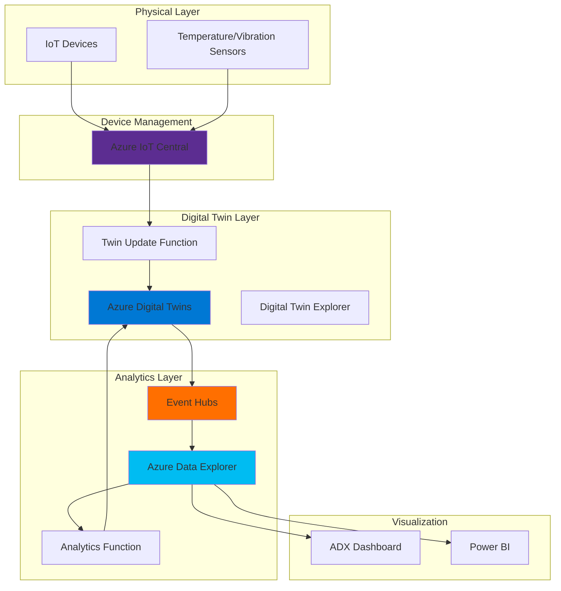

# Predictive Maintenance with IoT Digital Twins

## Problem

Modern industrial operations struggle to create accurate digital representations of physical assets while simultaneously analyzing real-time telemetry data for predictive maintenance. Manufacturing plants, smart buildings, and industrial facilities need to monitor thousands of IoT devices, detect anomalies in real-time, and predict equipment failures before they cause costly downtime. Without unified digital models and time-series analytics, organizations cannot optimize operations or implement proactive maintenance strategies.

## Solution

This recipe implements a comprehensive IoT solution using Azure Digital Twins to create digital replicas of physical devices, Azure IoT Central for device management and telemetry ingestion, and Azure Data Explorer for advanced time-series analytics. The solution enables real-time anomaly detection, predictive maintenance insights, and historical trend analysis across your entire IoT infrastructure while maintaining a synchronized digital representation of your physical environment.

## Architecture Diagram



## Prerequisites

1. Azure account with Owner or Contributor access to create resources
2. Azure CLI v2.54.0 or later installed and configured (or use Azure CloudShell)
3. Basic understanding of IoT concepts, digital twins, and time-series data
4. Familiarity with Kusto Query Language (KQL) for data analytics
5. Estimated cost: ~$150-200/month for demo workload (ensure cleanup after testing)

> **Note**: This recipe creates multiple Azure resources including Azure Digital Twins, Azure Data Explorer cluster, and Azure Functions. Ensure you have sufficient quota in your subscription.

## Preparation

```bash
# Set environment variables for resource configuration
export RESOURCE_GROUP="rg-iot-digital-twins-${RANDOM_SUFFIX}"
export LOCATION="eastus"
export SUBSCRIPTION_ID=$(az account show --query id --output tsv)

# Generate unique suffix for globally unique resource names
RANDOM_SUFFIX=$(openssl rand -hex 3)

# Set service-specific names
export ADT_NAME="adt-iot-${RANDOM_SUFFIX}"
export ADX_CLUSTER="adxiot${RANDOM_SUFFIX}"
export ADX_DATABASE="iottelemetry"
export IOTC_APP="iotc-${RANDOM_SUFFIX}"
export FUNC_APP="func-iot-${RANDOM_SUFFIX}"
export STORAGE_ACCOUNT="stiotfunc${RANDOM_SUFFIX}"
export EVENT_HUB_NS="ehns-iot-${RANDOM_SUFFIX}"
export EVENT_HUB_NAME="telemetry-hub"

# Create resource group
az group create \
    --name ${RESOURCE_GROUP} \
    --location ${LOCATION} \
    --tags purpose=recipe environment=demo

echo "✅ Resource group created: ${RESOURCE_GROUP}"

# Create storage account for Function App
az storage account create \
    --name ${STORAGE_ACCOUNT} \
    --resource-group ${RESOURCE_GROUP} \
    --location ${LOCATION} \
    --sku Standard_LRS

echo "✅ Storage account created: ${STORAGE_ACCOUNT}"
```

## Steps

1. **Create Azure Digital Twins Instance**:

   Azure Digital Twins enables you to build comprehensive digital models of your physical environment using the Digital Twins Definition Language (DTDL). This platform-as-a-service offering creates a live execution environment where digital twins reflect real-time state changes from IoT devices. The service provides graph-based relationships between twins, enabling complex queries and insights across your entire digital ecosystem.

   ```bash
   # Create Azure Digital Twins instance
   az dt create \
       --name ${ADT_NAME} \
       --resource-group ${RESOURCE_GROUP} \
       --location ${LOCATION}
   
   # Assign Azure Digital Twins Data Owner role to current user
   USER_OBJECT_ID=$(az ad signed-in-user show \
       --query id --output tsv)
   
   az dt role-assignment create \
       --dt-name ${ADT_NAME} \
       --assignee ${USER_OBJECT_ID} \
       --role "Azure Digital Twins Data Owner"
   
   echo "✅ Azure Digital Twins instance created: ${ADT_NAME}"
   ```

   The Azure Digital Twins instance is now configured with proper RBAC permissions. This foundational service will host your digital twin models and maintain the real-time state of all connected devices, enabling sophisticated queries and relationship-based analytics.

2. **Deploy IoT Central Application**:

   Azure IoT Central provides a fully managed application platform for connecting, monitoring, and managing IoT devices at scale. It offers device templates, telemetry visualization, and rule-based actions without requiring deep IoT expertise. The platform automatically handles device provisioning, security, and scaling while providing REST APIs for integration with other services.

   ```bash
   # Create IoT Central application
   az iot central app create \
       --name ${IOTC_APP} \
       --resource-group ${RESOURCE_GROUP} \
       --location ${LOCATION} \
       --subdomain ${IOTC_APP} \
       --sku ST2 \
       --template "iotc-pnp-preview"
   
   # Get IoT Central application ID scope for device provisioning
   IOTC_ID_SCOPE=$(az iot central app show \
       --name ${IOTC_APP} \
       --resource-group ${RESOURCE_GROUP} \
       --query applicationId --output tsv)
   
   echo "✅ IoT Central application created: ${IOTC_APP}"
   echo "Application URL: https://${IOTC_APP}.azureiotcentral.com"
   ```

   IoT Central now provides a managed platform for device connectivity and telemetry collection. The application includes built-in dashboards, device management capabilities, and automatic scaling to handle thousands of connected devices sending telemetry data.

3. **Create Event Hub for Data Streaming**:

   Azure Event Hubs serves as a highly scalable data streaming platform that can ingest millions of events per second. It acts as the central nervous system for your IoT solution, routing telemetry data from devices to multiple downstream services. Event Hubs provides reliable message delivery with built-in partitioning for parallel processing and retention policies for data replay scenarios.

   ```bash
   # Create Event Hub namespace
   az eventhubs namespace create \
       --name ${EVENT_HUB_NS} \
       --resource-group ${RESOURCE_GROUP} \
       --location ${LOCATION} \
       --sku Standard \
       --capacity 1
   
   # Create Event Hub for telemetry data
   az eventhubs eventhub create \
       --name ${EVENT_HUB_NAME} \
       --namespace-name ${EVENT_HUB_NS} \
       --resource-group ${RESOURCE_GROUP} \
       --partition-count 4 \
       --retention-time-in-hours 24
   
   # Get Event Hub connection string
   EH_CONNECTION=$(az eventhubs namespace authorization-rule keys list \
       --name RootManageSharedAccessKey \
       --namespace-name ${EVENT_HUB_NS} \
       --resource-group ${RESOURCE_GROUP} \
       --query primaryConnectionString --output tsv)
   
   echo "✅ Event Hub created for telemetry streaming"
   ```

   The Event Hub is configured with 4 partitions for parallel processing and 24-hour retention, providing a buffer for downstream systems and enabling data replay for debugging or reprocessing scenarios.

4. **Deploy Azure Data Explorer Cluster**:

   Azure Data Explorer provides a fast and highly scalable data exploration service optimized for log and telemetry analytics. It excels at time-series analysis, pattern recognition, and anomaly detection across massive datasets. The service uses Kusto Query Language (KQL) for intuitive data exploration and supports automatic data retention policies, making it ideal for IoT telemetry analysis and predictive maintenance scenarios.

   ```bash
   # Create Azure Data Explorer cluster (this takes 10-15 minutes)
   az kusto cluster create \
       --name ${ADX_CLUSTER} \
       --resource-group ${RESOURCE_GROUP} \
       --location ${LOCATION} \
       --sku name="Dev(No SLA)_Standard_E2a_v4" tier="Basic" \
       --capacity 1
   
   echo "⏳ Waiting for ADX cluster deployment (10-15 minutes)..."
   
   # Wait for cluster to be ready
   az kusto cluster wait \
       --name ${ADX_CLUSTER} \
       --resource-group ${RESOURCE_GROUP} \
       --created
   
   # Create database for IoT telemetry
   az kusto database create \
       --cluster-name ${ADX_CLUSTER} \
       --database-name ${ADX_DATABASE} \
       --resource-group ${RESOURCE_GROUP} \
       --read-write-database \
           soft-delete-period="P30D" \
           hot-cache-period="P7D"
   
   echo "✅ Azure Data Explorer cluster deployed: ${ADX_CLUSTER}"
   ```

   The ADX cluster is configured with a development SKU suitable for proof-of-concepts, with 7 days of hot cache for fast queries and 30 days of data retention. This configuration balances performance with cost for IoT telemetry analytics.

5. **Configure Digital Twin Models and Event Routes**:

   Digital Twin models define the structure, properties, and relationships of your IoT assets using DTDL. These models create a semantic layer that represents your business domain, enabling intuitive queries and automated reasoning. Event routes in Azure Digital Twins forward twin property changes and telemetry updates to downstream services for processing and analytics.

   ```bash
   # Create DTDL model for industrial equipment
   cat > equipment-model.json << 'EOF'
   {
     "@id": "dtmi:com:example:IndustrialEquipment;1",
     "@type": "Interface",
     "@context": "dtmi:dtdl:context;2",
     "displayName": "Industrial Equipment",
     "contents": [
       {
         "@type": "Property",
         "name": "temperature",
         "schema": "double"
       },
       {
         "@type": "Property",
         "name": "vibration",
         "schema": "double"
       },
       {
         "@type": "Property",
         "name": "operatingHours",
         "schema": "integer"
       },
       {
         "@type": "Property",
         "name": "maintenanceStatus",
         "schema": "string"
       }
     ]
   }
   EOF
   
   # Upload model to Azure Digital Twins
   az dt model create \
       --dt-name ${ADT_NAME} \
       --models @equipment-model.json
   
   # Create event route to Event Hub
   az dt endpoint create eventhub \
       --dt-name ${ADT_NAME} \
       --endpoint-name telemetry-endpoint \
       --eventhub ${EVENT_HUB_NAME} \
       --eventhub-namespace ${EVENT_HUB_NS} \
       --resource-group ${RESOURCE_GROUP}
   
   # Create route for all telemetry updates
   az dt route create \
       --dt-name ${ADT_NAME} \
       --endpoint-name telemetry-endpoint \
       --route-name telemetry-route \
       --filter "type = 'Microsoft.DigitalTwins.Twin.Update'"
   
   echo "✅ Digital Twin models and routes configured"
   ```

   The DTDL model defines industrial equipment with telemetry properties for temperature and vibration monitoring, operational metrics, and maintenance status. Event routing ensures all twin updates flow to Event Hub for real-time processing and analytics.

6. **Create Function Apps for Data Processing**:

   Azure Functions provides serverless compute for event-driven data processing, automatically scaling based on workload. In IoT scenarios, Functions process incoming telemetry, update digital twins, run analytics algorithms, and trigger alerts. The consumption plan ensures cost-effectiveness by charging only for actual execution time while handling sporadic or high-volume data streams.

   ```bash
   # Create Function App for twin updates
   az functionapp create \
       --name ${FUNC_APP} \
       --resource-group ${RESOURCE_GROUP} \
       --storage-account ${STORAGE_ACCOUNT} \
       --consumption-plan-location ${LOCATION} \
       --runtime dotnet \
       --functions-version 4
   
   # Configure Function App settings
   az functionapp config appsettings set \
       --name ${FUNC_APP} \
       --resource-group ${RESOURCE_GROUP} \
       --settings \
           "ADT_SERVICE_URL=https://${ADT_NAME}.api.${LOCATION}.digitaltwins.azure.net" \
           "EventHubConnection=${EH_CONNECTION}" \
           "AzureWebJobsStorage=DefaultEndpointsProtocol=https;AccountName=${STORAGE_ACCOUNT};EndpointSuffix=core.windows.net;AccountKey=$(az storage account keys list --account-name ${STORAGE_ACCOUNT} --resource-group ${RESOURCE_GROUP} --query '[0].value' -o tsv)"
   
   # Enable managed identity for Function App
   az functionapp identity assign \
       --name ${FUNC_APP} \
       --resource-group ${RESOURCE_GROUP}
   
   # Grant Function App access to Digital Twins
   FUNC_IDENTITY=$(az functionapp identity show \
       --name ${FUNC_APP} \
       --resource-group ${RESOURCE_GROUP} \
       --query principalId --output tsv)
   
   az dt role-assignment create \
       --dt-name ${ADT_NAME} \
       --assignee ${FUNC_IDENTITY} \
       --role "Azure Digital Twins Data Owner"
   
   echo "✅ Function App created and configured"
   ```

   The Function App now has secure access to Azure Digital Twins through managed identity, eliminating the need for connection strings. This serverless architecture automatically scales to handle telemetry spikes while maintaining security best practices.

7. **Configure Data Ingestion Pipeline**:

   The data ingestion pipeline creates a seamless flow from IoT devices through digital twins to analytics storage. This architecture enables real-time processing while maintaining data lineage and supporting both hot-path analytics for immediate insights and cold-path analytics for historical trends. The pipeline handles data transformation, enrichment, and routing based on business rules.

   ```bash
   # Create data connection from Event Hub to ADX
   az kusto data-connection event-hub create \
       --cluster-name ${ADX_CLUSTER} \
       --data-connection-name iot-telemetry-connection \
       --database-name ${ADX_DATABASE} \
       --resource-group ${RESOURCE_GROUP} \
       --consumer-group '$Default' \
       --event-hub-resource-id "/subscriptions/${SUBSCRIPTION_ID}/resourceGroups/${RESOURCE_GROUP}/providers/Microsoft.EventHub/namespaces/${EVENT_HUB_NS}/eventhubs/${EVENT_HUB_NAME}" \
       --location ${LOCATION} \
       --table-name TelemetryData \
       --data-format JSON \
       --mapping-rule-name TelemetryMapping
   
   # Create table in ADX for telemetry data
   ADX_QUERY="
   .create table TelemetryData (
       Timestamp: datetime,
       DeviceId: string,
       Temperature: real,
       Vibration: real,
       OperatingHours: int,
       MaintenanceStatus: string
   )
   
   .create table TelemetryData ingestion json mapping 'TelemetryMapping' '[{\"column\":\"Timestamp\",\"path\":\"$.timestamp\"},{\"column\":\"DeviceId\",\"path\":\"$.deviceId\"},{\"column\":\"Temperature\",\"path\":\"$.temperature\"},{\"column\":\"Vibration\",\"path\":\"$.vibration\"},{\"column\":\"OperatingHours\",\"path\":\"$.operatingHours\"},{\"column\":\"MaintenanceStatus\",\"path\":\"$.maintenanceStatus\"}]'
   "
   
   # Execute query to create table and mapping
   az kusto query \
       --cluster-name ${ADX_CLUSTER} \
       --database-name ${ADX_DATABASE} \
       --query "${ADX_QUERY}"
   
   echo "✅ Data ingestion pipeline configured"
   ```

   The ingestion pipeline now automatically streams telemetry data from Event Hub into Azure Data Explorer, where it's stored in an optimized columnar format for fast time-series queries and analytics.

8. **Implement Anomaly Detection Queries**:

   Anomaly detection in Azure Data Explorer leverages built-in machine learning functions to identify unusual patterns in time-series data. These algorithms can detect point anomalies, trend changes, and seasonal variations that might indicate equipment failures or maintenance needs. The queries can be automated through Functions or Logic Apps to trigger real-time alerts and update digital twin properties.

   ```bash
   # Create anomaly detection function in ADX
   ANOMALY_QUERY="
   .create-or-alter function DetectAnomalies() {
       TelemetryData
       | where Timestamp > ago(1h)
       | make-series Temperature=avg(Temperature) default=0 on Timestamp step 1m by DeviceId
       | extend (anomalies, score, baseline) = series_decompose_anomalies(Temperature, 1.5, -1, 'linefit')
       | mv-expand Timestamp, Temperature, anomalies, score, baseline
       | where anomalies == 1
       | project DeviceId, Timestamp, Temperature, score, baseline
   }
   
   .create-or-alter function PredictMaintenance() {
       TelemetryData
       | where Timestamp > ago(7d)
       | summarize AvgVibration=avg(Vibration), MaxVibration=max(Vibration), OperatingHours=max(OperatingHours) by DeviceId
       | extend MaintenanceRisk = case(
           MaxVibration > 50 and OperatingHours > 1000, 'High',
           MaxVibration > 30 and OperatingHours > 500, 'Medium',
           'Low'
       )
       | project DeviceId, MaintenanceRisk, AvgVibration, OperatingHours
   }
   "
   
   # Execute query to create functions
   az kusto query \
       --cluster-name ${ADX_CLUSTER} \
       --database-name ${ADX_DATABASE} \
       --query "${ANOMALY_QUERY}"
   
   echo "✅ Anomaly detection queries configured"
   ```

   These KQL functions provide reusable analytics capabilities that can detect temperature anomalies using time-series decomposition and predict maintenance needs based on vibration patterns and operating hours.

9. **Create Digital Twin Instances**:

   Creating digital twin instances brings your model to life by instantiating specific equipment representations. Each twin maintains its own state, properties, and relationships, creating a living digital replica of your physical assets. This step demonstrates how to programmatically create twins that will be updated with real-time telemetry from IoT devices.

   ```bash
   # Create sample digital twin instances
   for i in {1..3}; do
       TWIN_ID="equipment-${i}"
       TWIN_INIT="{
           \"\$metadata\": {
               \"\$model\": \"dtmi:com:example:IndustrialEquipment;1\"
           },
           \"temperature\": 25.0,
           \"vibration\": 5.0,
           \"operatingHours\": 100,
           \"maintenanceStatus\": \"Normal\"
       }"
       
       az dt twin create \
           --dt-name ${ADT_NAME} \
           --twin-id ${TWIN_ID} \
           --properties "${TWIN_INIT}"
       
       echo "✅ Created digital twin: ${TWIN_ID}"
   done
   
   # Query all twins
   az dt twin query \
       --dt-name ${ADT_NAME} \
       --query-command "SELECT * FROM digitaltwins"
   ```

   Digital twin instances now represent your physical equipment in the digital realm. These twins will receive real-time updates from IoT devices and maintain synchronized state for analytics and visualization.

## Validation & Testing

1. Verify Azure Digital Twins deployment:

   ```bash
   # Check ADT instance status
   az dt show \
       --name ${ADT_NAME} \
       --query '{Name:name, Status:provisioningState}' \
       --output table
   
   # List uploaded models
   az dt model list \
       --dt-name ${ADT_NAME} \
       --query '[].{Model:id, DisplayName:displayName}' \
       --output table
   ```

   Expected output: Active ADT instance with IndustrialEquipment model

2. Test Azure Data Explorer connectivity:

   ```bash
   # Query ADX cluster health
   az kusto cluster show \
       --name ${ADX_CLUSTER} \
       --resource-group ${RESOURCE_GROUP} \
       --query '{Name:name, State:state, Uri:uri}' \
       --output table
   
   # Test KQL query execution
   az kusto query \
       --cluster-name ${ADX_CLUSTER} \
       --database-name ${ADX_DATABASE} \
       --query "DetectAnomalies() | take 10"
   ```

   Expected output: Running cluster with successful query execution

3. Validate Event Hub data flow:

   ```bash
   # Check Event Hub metrics
   az monitor metrics list \
       --resource "/subscriptions/${SUBSCRIPTION_ID}/resourceGroups/${RESOURCE_GROUP}/providers/Microsoft.EventHub/namespaces/${EVENT_HUB_NS}" \
       --metric "IncomingMessages" \
       --interval PT1M \
       --output table
   ```

   Expected output: Metrics showing message flow (may be zero initially)

> **Tip**: Use Azure Digital Twins Explorer (https://explorer.digitaltwins.azure.net/) to visualize your twin graph and relationships in real-time.

## Cleanup

1. Delete the resource group and all resources:

   ```bash
   # Delete resource group (this removes all resources)
   az group delete \
       --name ${RESOURCE_GROUP} \
       --yes \
       --no-wait
   
   echo "✅ Resource group deletion initiated: ${RESOURCE_GROUP}"
   echo "Note: Complete deletion may take 10-15 minutes"
   ```

2. Verify deletion status:

   ```bash
   # Check if resource group still exists
   az group exists --name ${RESOURCE_GROUP}
   ```

3. Clean up local files:

   ```bash
   # Remove temporary model file
   rm -f equipment-model.json
   
   echo "✅ Local cleanup completed"
   ```

## Discussion

Azure Digital Twins combined with Azure Data Explorer creates a powerful platform for industrial IoT solutions that require both real-time digital representation and advanced time-series analytics. This architecture follows the [Azure Well-Architected Framework](https://learn.microsoft.com/en-us/azure/architecture/framework/) principles by providing scalability through serverless components, reliability through managed services, and security through managed identities and RBAC. For comprehensive implementation guidance, refer to the [Azure Digital Twins documentation](https://learn.microsoft.com/en-us/azure/digital-twins/) and [Azure Data Explorer best practices](https://learn.microsoft.com/en-us/azure/data-explorer/best-practices).

The solution's strength lies in its ability to maintain synchronized digital models while performing complex analytics on streaming telemetry data. Azure Digital Twins provides the semantic layer that gives context to raw IoT data, while Azure Data Explorer enables sophisticated time-series analysis including anomaly detection, pattern recognition, and predictive maintenance algorithms. This combination is particularly effective for scenarios requiring both real-time monitoring and historical analysis, as outlined in the [IoT analytics architecture guide](https://learn.microsoft.com/en-us/azure/architecture/example-scenario/data/iot-analytics-architecture).

From a cost optimization perspective, the architecture uses consumption-based pricing for Functions and development SKUs for proof-of-concepts, allowing organizations to validate their use cases before scaling to production. The use of Event Hubs for data routing provides a buffer between data producers and consumers, ensuring system resilience during traffic spikes. For production deployments, consider implementing the [Azure IoT reference architecture](https://learn.microsoft.com/en-us/azure/architecture/reference-architectures/iot) with additional considerations for data partitioning, retention policies, and multi-region deployments.

> **Warning**: Production deployments should use Standard or Premium SKUs for Azure Data Explorer and implement proper data retention policies to manage costs. Monitor ingestion rates and query performance to optimize cluster sizing based on actual workload patterns.

## Challenge

Extend this solution by implementing these enhancements:

1. Create a Power BI dashboard that visualizes real-time anomalies detected by Azure Data Explorer and displays the current state of digital twins with their maintenance risk scores
2. Implement an Azure Logic App workflow that automatically creates maintenance tickets in your ITSM system when high-risk equipment is detected
3. Add Azure Machine Learning integration to train custom predictive maintenance models using historical telemetry data from ADX
4. Extend the digital twin model to include relationships between equipment, facilities, and maintenance crews, then use graph queries to optimize maintenance scheduling
5. Implement a feedback loop where maintenance outcomes update the predictive models, continuously improving accuracy over time

## Infrastructure Code

### Available Infrastructure as Code:

- [Infrastructure Code Overview](code/README.md) - Detailed description of all infrastructure components
- [Bicep](code/bicep/) - Azure Bicep templates
- [Bash CLI Scripts](code/scripts/) - Example bash scripts using Azure CLI commands to deploy infrastructure
- [Terraform](code/terraform/) - Terraform configuration files