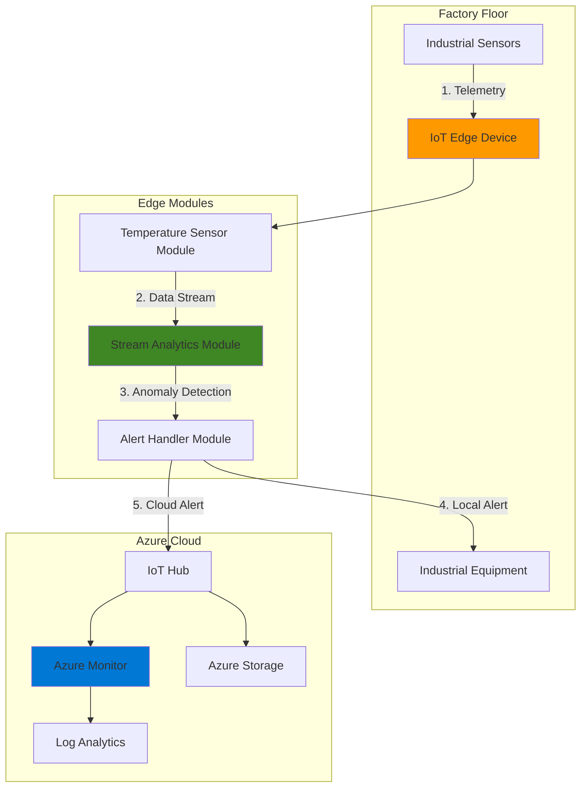

# Predictive Maintenance with IoT Edge Analytics

## Problem

Manufacturing facilities often struggle with unexpected equipment failures that lead to costly production downtime, emergency repairs, and potential safety hazards. Traditional maintenance approaches rely on fixed schedules or reactive responses after failures occur, resulting in either unnecessary maintenance costs or catastrophic equipment breakdowns. Remote or bandwidth-constrained locations compound this challenge by limiting real-time cloud connectivity for immediate analysis and response to critical sensor data.

## Solution

Deploy Azure IoT Edge with Stream Analytics to process sensor data locally on industrial equipment, enabling real-time anomaly detection and predictive maintenance alerts without cloud dependency. This edge-based architecture combines Azure IoT Edge runtime for container orchestration, Stream Analytics for real-time data processing, Azure Monitor for alerting and diagnostics, and Azure Storage for historical telemetry archival, creating a resilient system that operates effectively even with intermittent connectivity.

## Architecture Diagram



## Prerequisites

1. Azure account with Contributor access to create IoT Hub, Storage, and monitoring resources
2. Azure CLI v2.48.0 or later installed and configured (or use Azure Cloud Shell)
3. Physical IoT Edge device or Ubuntu VM (18.04 or later) with at least 2GB RAM
4. Docker installed on the edge device (automatically installed with IoT Edge runtime)
5. Basic understanding of IoT concepts and time-series data analysis
6. Estimated cost: ~$50/month (IoT Hub S1, Storage, minimal Stream Analytics usage)

> **Note**: This recipe uses a simulated temperature sensor for demonstration. In production, replace with actual industrial sensor modules compatible with your equipment.

## Preparation

```bash
# Set environment variables with proper Azure naming conventions
export RESOURCE_GROUP="rg-predictive-maintenance-$(openssl rand -hex 3)"
export LOCATION="eastus"
export IOT_HUB_NAME="iot-pm-$(openssl rand -hex 3)"
export STORAGE_ACCOUNT="stpm$(openssl rand -hex 3)"
export DEVICE_ID="edge-device-01"
export SA_JOB_NAME="sa-edge-anomaly-$(openssl rand -hex 2)"
export LOG_ANALYTICS_WORKSPACE="law-pm-$(openssl rand -hex 3)"

# Create resource group with proper tagging
az group create \
    --name ${RESOURCE_GROUP} \
    --location ${LOCATION} \
    --tags purpose=predictive-maintenance environment=demo

# Create IoT Hub with appropriate SKU
az iot hub create \
    --name ${IOT_HUB_NAME} \
    --resource-group ${RESOURCE_GROUP} \
    --location ${LOCATION} \
    --sku S1 \
    --tags purpose=predictive-maintenance

# Create Storage Account for Stream Analytics job artifacts
az storage account create \
    --name ${STORAGE_ACCOUNT} \
    --resource-group ${RESOURCE_GROUP} \
    --location ${LOCATION} \
    --sku Standard_LRS \
    --kind StorageV2 \
    --tags purpose=predictive-maintenance

# Create container for Stream Analytics job storage
az storage container create \
    --name streamanalytics \
    --account-name ${STORAGE_ACCOUNT} \
    --auth-mode login

# Create Log Analytics Workspace for monitoring
az monitor log-analytics workspace create \
    --resource-group ${RESOURCE_GROUP} \
    --workspace-name ${LOG_ANALYTICS_WORKSPACE} \
    --location ${LOCATION} \
    --tags purpose=predictive-maintenance

echo "✅ Foundation resources created successfully"
echo "Resource Group: ${RESOURCE_GROUP}"
echo "IoT Hub: ${IOT_HUB_NAME}"
echo "Storage Account: ${STORAGE_ACCOUNT}"
```

## Steps

1. **Register IoT Edge Device with IoT Hub**:

   Azure IoT Edge extends cloud intelligence to edge devices, enabling local data processing and decision-making. Registering an edge device creates a secure identity in IoT Hub that manages module deployment, configuration updates, and telemetry routing. This device identity uses symmetric keys or X.509 certificates for authentication, establishing the trust relationship necessary for secure edge-to-cloud communication.

   ```bash
   # Create edge device identity in IoT Hub
   az iot hub device-identity create \
       --device-id ${DEVICE_ID} \
       --edge-enabled \
       --hub-name ${IOT_HUB_NAME} \
       --resource-group ${RESOURCE_GROUP}
   
   # Retrieve connection string for edge device configuration
   CONNECTION_STRING=$(az iot hub device-identity connection-string show \
       --device-id ${DEVICE_ID} \
       --hub-name ${IOT_HUB_NAME} \
       --resource-group ${RESOURCE_GROUP} \
       --query connectionString \
       --output tsv)
   
   echo "✅ Edge device registered with identity: ${DEVICE_ID}"
   echo "Save this connection string for device configuration:"
   echo "${CONNECTION_STRING}"
   ```

   The IoT Edge device is now registered with a unique identity in IoT Hub. This connection string will be used to configure the IoT Edge runtime on your physical device, enabling secure module deployment and management from the cloud.

2. **Create Stream Analytics Job for Edge Deployment**:

   Azure Stream Analytics on IoT Edge brings cloud-scale analytics to edge devices, processing streaming data with SQL-like queries while operating within resource constraints. Creating an edge-hosted job enables sub-millisecond latency for anomaly detection, crucial for preventing equipment damage. The job definition remains in the cloud for easy updates while execution happens locally, providing the perfect balance of manageability and performance.

   ```bash
   # Create Stream Analytics job configured for IoT Edge deployment
   az stream-analytics job create \
       --name ${SA_JOB_NAME} \
       --resource-group ${RESOURCE_GROUP} \
       --location ${LOCATION} \
       --compatibility-level "1.2" \
       --sku Standard \
       --tags environment=edge purpose=anomaly-detection
   
   # Configure job to run on IoT Edge (not cloud)
   az stream-analytics job update \
       --name ${SA_JOB_NAME} \
       --resource-group ${RESOURCE_GROUP} \
       --job-type Edge
   
   echo "✅ Stream Analytics job created for edge deployment"
   ```

   The Stream Analytics job is now configured to run at the edge, bringing real-time analytics capabilities directly to your industrial equipment while maintaining cloud-based management and updates.

3. **Configure Stream Analytics Inputs and Outputs**:

   Stream Analytics jobs require properly defined inputs and outputs to create data processing pipelines. For edge scenarios, the Edge Hub serves as the message broker between modules, enabling seamless data flow from sensors through analytics to action modules. This configuration establishes the data contracts between modules, ensuring type safety and enabling the Stream Analytics engine to optimize query execution for edge constraints.

   ```bash
   # Create input from Edge Hub to receive sensor data
   az stream-analytics input create \
       --resource-group ${RESOURCE_GROUP} \
       --job-name ${SA_JOB_NAME} \
       --name temperature-input \
       --type Stream \
       --datasource '{
         "type": "Microsoft.ServiceBus/EventHub",
         "properties": {
           "serviceBusNamespace": "EdgeHub",
           "eventHubName": "inputs/temperature-input"
         }
       }' \
       --serialization '{
         "type": "Json",
         "properties": {
           "encoding": "UTF8"
         }
       }'
   
   # Create output to Edge Hub for sending alerts
   az stream-analytics output create \
       --resource-group ${RESOURCE_GROUP} \
       --job-name ${SA_JOB_NAME} \
       --name anomaly-output \
       --datasource '{
         "type": "Microsoft.ServiceBus/EventHub",
         "properties": {
           "serviceBusNamespace": "EdgeHub",
           "eventHubName": "outputs/anomaly-output"
         }
       }' \
       --serialization '{
         "type": "Json",
         "properties": {
           "encoding": "UTF8"
         }
       }'
   
   echo "✅ Input and output configured for Stream Analytics edge processing"
   ```

   The data pipeline is now established, with clear input and output definitions that enable the Stream Analytics module to receive sensor data and publish anomaly alerts through the Edge Hub message broker.

4. **Define Anomaly Detection Query**:

   The Stream Analytics query implements a sliding window algorithm to detect temperature anomalies that indicate potential equipment failure. By analyzing 30-second windows of sensor data, the query identifies sustained high temperatures that often precede mechanical failures. This predictive approach enables maintenance teams to intervene before catastrophic failure, reducing downtime by up to 75% compared to reactive maintenance strategies.

   ```bash
   # Create anomaly detection query with tumbling window
   QUERY="SELECT
       'maintenance_required' AS alertType,
       System.Timestamp() AS alertTime,
       AVG(temperature) AS avgTemperature,
       MAX(temperature) AS maxTemperature,
       COUNT(*) AS readingCount,
       '${DEVICE_ID}' AS deviceId
   INTO
       [anomaly-output]
   FROM
       [temperature-input] TIMESTAMP BY timeCreated
   GROUP BY
       TumblingWindow(second, 30)
   HAVING
       AVG(temperature) > 75 OR MAX(temperature) > 85"
   
   # Apply the transformation query to the Stream Analytics job
   az stream-analytics transformation create \
       --resource-group ${RESOURCE_GROUP} \
       --job-name ${SA_JOB_NAME} \
       --name Transformation \
       --streaming-units 1 \
       --transformation-query "${QUERY}"
   
   echo "✅ Anomaly detection query configured with thresholds"
   echo "Alert triggers: Avg temp > 75°C or Max temp > 85°C"
   ```

   This query continuously monitors temperature readings and triggers alerts when average temperatures exceed 75°C or peak temperatures surpass 85°C within any 30-second window, providing early warning of potential equipment issues.

5. **Link Stream Analytics Job to Storage Account**:

   Edge-deployed Stream Analytics jobs require Azure Storage to host the job definition and configuration that edge devices download during deployment. This storage account serves as the distribution point for job artifacts, enabling version control and staged rollouts across your edge fleet. The secure connection ensures only authorized edge devices can access the job definition while maintaining audit trails of deployments.

   ```bash
   # Get storage account key for Stream Analytics configuration
   STORAGE_KEY=$(az storage account keys list \
       --resource-group ${RESOURCE_GROUP} \
       --account-name ${STORAGE_ACCOUNT} \
       --query "[0].value" \
       --output tsv)
   
   # Link Stream Analytics job to storage for edge deployment
   az stream-analytics job update \
       --name ${SA_JOB_NAME} \
       --resource-group ${RESOURCE_GROUP} \
       --job-storage-account '{
           "accountName": "'${STORAGE_ACCOUNT}'",
           "accountKey": "'${STORAGE_KEY}'"
       }'
   
   # Publish the job configuration for edge deployment
   az stream-analytics job start \
       --name ${SA_JOB_NAME} \
       --resource-group ${RESOURCE_GROUP} \
       --output-start-mode JobStartTime
   
   echo "✅ Stream Analytics job linked to storage and published for edge"
   ```

   The Stream Analytics job is now published to Azure Storage, making it available for download and deployment to edge devices while maintaining centralized management capabilities.

6. **Configure Azure Monitor Alerts**:

   Azure Monitor provides comprehensive observability for your predictive maintenance solution, transforming edge-generated alerts into actionable notifications. By creating metric-based alert rules, you ensure that maintenance teams receive immediate notification of anomalies through multiple channels. This proactive alerting system integrates with existing ITSM tools and can trigger automated workflows, reducing mean time to response (MTTR) for critical equipment issues.

   ```bash
   # Create action group for maintenance team notifications
   az monitor action-group create \
       --name ag-maintenance-team \
       --resource-group ${RESOURCE_GROUP} \
       --short-name MaintTeam \
       --email-receiver name=Maintenance email=maint@example.com \
       --sms-receiver name=OnCall country-code=1 phone-number=5551234567
   
   # Create alert rule for high message volume indicating anomalies
   az monitor metrics alert create \
       --name alert-high-temperature \
       --resource-group ${RESOURCE_GROUP} \
       --scopes "/subscriptions/$(az account show --query id -o tsv)/resourceGroups/${RESOURCE_GROUP}/providers/Microsoft.Devices/IotHubs/${IOT_HUB_NAME}" \
       --condition "avg messages.telemetry.allProtocol > 100" \
       --window-size 5m \
       --evaluation-frequency 1m \
       --action ag-maintenance-team \
       --description "Alert when high message volume indicates equipment anomalies" \
       --severity 2
   
   echo "✅ Azure Monitor alerts configured for predictive maintenance"
   ```

   The monitoring configuration now actively watches for anomaly patterns and will notify your maintenance team within minutes of detection, enabling rapid response to prevent equipment failure.

7. **Deploy Edge Modules via IoT Hub**:

   IoT Hub's module deployment mechanism orchestrates containerized workloads across your edge fleet using deployment manifests. This declarative approach ensures consistent configuration across devices while supporting rolling updates and version control. The manifest defines module images, creation options, and message routing rules that establish the data flow pipeline from sensors through analytics to action handlers.

   ```bash
   # Create deployment manifest for edge modules
   cat > deployment.json <<EOF
   {
     "modulesContent": {
       "\$edgeAgent": {
         "properties.desired": {
           "schemaVersion": "1.1",
           "runtime": {
             "type": "docker",
             "settings": {
               "minDockerVersion": "v1.25"
             }
           },
           "systemModules": {
             "edgeAgent": {
               "type": "docker",
               "settings": {
                 "image": "mcr.microsoft.com/azureiotedge-agent:1.5"
               }
             },
             "edgeHub": {
               "type": "docker",
               "status": "running",
               "restartPolicy": "always",
               "settings": {
                 "image": "mcr.microsoft.com/azureiotedge-hub:1.5"
               }
             }
           },
           "modules": {
             "SimulatedTemperatureSensor": {
               "type": "docker",
               "status": "running",
               "restartPolicy": "always",
               "settings": {
                 "image": "mcr.microsoft.com/azureiotedge-simulated-temperature-sensor:1.5"
               }
             },
             "StreamAnalytics": {
               "type": "docker",
               "status": "running",
               "restartPolicy": "always",
               "settings": {
                 "image": "mcr.microsoft.com/azure-stream-analytics/azureiotedge:1.0.9-linux-amd64"
               }
             }
           }
         }
       },
       "\$edgeHub": {
         "properties.desired": {
           "schemaVersion": "1.1",
           "routes": {
             "sensorToAnalytics": "FROM /messages/modules/SimulatedTemperatureSensor/outputs/temperatureOutput INTO BrokeredEndpoint('/modules/StreamAnalytics/inputs/temperature-input')",
             "analyticsToHub": "FROM /messages/modules/StreamAnalytics/outputs/anomaly-output INTO \$upstream"
           },
           "storeAndForwardConfiguration": {
             "timeToLiveSecs": 7200
           }
         }
       }
     }
   }
   EOF
   
   # Deploy modules to the edge device
   az iot edge deployment create \
       --deployment-id predictive-maintenance-v1 \
       --hub-name ${IOT_HUB_NAME} \
       --content deployment.json \
       --target-condition "deviceId='${DEVICE_ID}'" \
       --priority 10
   
   echo "✅ Edge modules deployed with predictive maintenance pipeline"
   ```

   The deployment manifest is now active, instructing your IoT Edge device to download and run the specified modules with proper message routing for the complete predictive maintenance pipeline.

8. **Configure Historical Data Archival**:

   Long-term telemetry storage in Azure Storage enables trend analysis, machine learning model training, and compliance with industrial data retention requirements. By implementing automated routing from IoT Hub to blob storage, you create a cost-effective archive that scales to petabytes while maintaining quick access to recent data. This historical dataset becomes invaluable for improving predictive models and understanding equipment degradation patterns over time.

   ```bash
   # Create storage container for telemetry archive
   az storage container create \
       --name telemetry-archive \
       --account-name ${STORAGE_ACCOUNT} \
       --auth-mode login
   
   # Get storage connection string for routing endpoint
   STORAGE_CONNECTION=$(az storage account show-connection-string \
       --name ${STORAGE_ACCOUNT} \
       --resource-group ${RESOURCE_GROUP} \
       --query connectionString \
       --output tsv)
   
   # Create storage endpoint for IoT Hub routing
   az iot hub routing-endpoint create \
       --hub-name ${IOT_HUB_NAME} \
       --endpoint-name telemetry-storage \
       --endpoint-type azurestoragecontainer \
       --endpoint-resource-group ${RESOURCE_GROUP} \
       --endpoint-subscription-id $(az account show --query id -o tsv) \
       --connection-string "${STORAGE_CONNECTION}" \
       --container-name telemetry-archive \
       --encoding json
   
   # Create IoT Hub route to archive all telemetry
   az iot hub route create \
       --hub-name ${IOT_HUB_NAME} \
       --route-name telemetry-to-storage \
       --source DeviceMessages \
       --endpoint-name telemetry-storage \
       --condition "true" \
       --enabled true
   
   echo "✅ Historical data archival configured to Azure Storage"
   echo "All telemetry will be archived to: ${STORAGE_ACCOUNT}/telemetry-archive"
   ```

   Your predictive maintenance solution now automatically archives all sensor telemetry to Azure Storage, creating a valuable dataset for future analysis and model improvement while meeting compliance requirements.

## Validation & Testing

1. Verify edge device module deployment status:

   ```bash
   # Check deployment status and metrics
   az iot edge deployment show \
       --deployment-id predictive-maintenance-v1 \
       --hub-name ${IOT_HUB_NAME} \
       --query "systemMetrics.results"
   ```

   Expected output: Should show "appliedCount": 1 and "reportedSuccessfulCount": 1

2. Monitor incoming telemetry messages:

   ```bash
   # Monitor device-to-cloud messages in real-time
   az iot hub monitor-events \
       --hub-name ${IOT_HUB_NAME} \
       --device-id ${DEVICE_ID} \
       --timeout 30
   ```

   Expected output: JSON messages with temperature readings and anomaly alerts when thresholds are exceeded

3. Verify Stream Analytics job metrics:

   ```bash
   # Check Stream Analytics job operational status
   az stream-analytics job show \
       --name ${SA_JOB_NAME} \
       --resource-group ${RESOURCE_GROUP} \
       --query "jobState"
   ```

   Expected output: "Running"

4. Test alert notifications:

   ```bash
   # Check alert rule configuration and history
   az monitor metrics alert show \
       --name alert-high-temperature \
       --resource-group ${RESOURCE_GROUP} \
       --query "condition"
   
   # Check recent alert activity
   az monitor activity-log list \
       --resource-group ${RESOURCE_GROUP} \
       --max-events 5 \
       --output table
   ```

## Cleanup

1. Stop and delete Stream Analytics job:

   ```bash
   # Stop the Stream Analytics job gracefully
   az stream-analytics job stop \
       --name ${SA_JOB_NAME} \
       --resource-group ${RESOURCE_GROUP}
   
   # Delete the Stream Analytics job
   az stream-analytics job delete \
       --name ${SA_JOB_NAME} \
       --resource-group ${RESOURCE_GROUP} \
       --yes
   
   echo "✅ Stream Analytics job stopped and deleted"
   ```

2. Remove IoT Edge deployment:

   ```bash
   # Delete the edge module deployment
   az iot edge deployment delete \
       --deployment-id predictive-maintenance-v1 \
       --hub-name ${IOT_HUB_NAME}
   
   # Delete the edge device identity
   az iot hub device-identity delete \
       --device-id ${DEVICE_ID} \
       --hub-name ${IOT_HUB_NAME}
   
   echo "✅ Edge deployment and device identity removed"
   ```

3. Delete Azure resources:

   ```bash
   # Delete resource group and all contained resources
   az group delete \
       --name ${RESOURCE_GROUP} \
       --yes \
       --no-wait
   
   echo "✅ Resource deletion initiated: ${RESOURCE_GROUP}"
   echo "Note: Complete deletion may take 5-10 minutes"
   ```

## Discussion

Azure IoT Edge transforms traditional reactive maintenance into intelligent predictive maintenance by processing sensor data at the source, eliminating the latency and bandwidth constraints of cloud-only solutions. This edge-based architecture is particularly valuable in industrial settings where network connectivity may be unreliable or where sub-second response times are critical for preventing equipment damage. The [Azure IoT Edge documentation](https://docs.microsoft.com/en-us/azure/iot-edge/) provides comprehensive guidance on production deployments and security hardening.

The combination of Stream Analytics on IoT Edge with Azure Monitor creates a multi-layered alerting system that operates both locally and in the cloud. Local processing ensures immediate response to critical anomalies, while cloud integration enables sophisticated analytics, long-term trend analysis, and enterprise-wide visibility. This hybrid approach follows the [Azure Well-Architected Framework](https://docs.microsoft.com/en-us/azure/architecture/framework/) principles of reliability and operational excellence. For detailed patterns, see the [IoT reference architecture](https://docs.microsoft.com/en-us/azure/architecture/reference-architectures/iot).

Cost optimization is achieved through edge processing, which reduces data transmission costs by up to 90% compared to streaming all raw telemetry to the cloud. Only aggregated results and anomalies are sent to Azure, while detailed sensor data is processed locally. The [Azure IoT Edge pricing guide](https://docs.microsoft.com/en-us/azure/iot-edge/support) and [Stream Analytics pricing](https://azure.microsoft.com/en-us/pricing/details/stream-analytics/) help estimate operational costs. Additionally, the [Azure Cost Management best practices](https://docs.microsoft.com/en-us/azure/cost-management-billing/costs/cost-mgt-best-practices) provide strategies for monitoring and optimizing IoT solution expenses.

> **Tip**: Use Azure IoT Edge's built-in metrics and prometheus endpoint to integrate with existing monitoring infrastructure. The [monitoring and troubleshooting guide](https://docs.microsoft.com/en-us/azure/iot-edge/troubleshoot) provides detailed instructions for production observability.

## Challenge

Extend this solution by implementing these enhancements:

1. Add Azure Machine Learning module to perform advanced anomaly detection using trained models for specific equipment types
2. Implement automatic work order creation in your CMMS system when maintenance is predicted using Logic Apps
3. Create a Power BI dashboard that visualizes equipment health scores and predicted failure timelines using streaming datasets
4. Deploy Azure Cognitive Services module for visual inspection of equipment using connected cameras
5. Implement multi-factor prediction by combining vibration, temperature, and pressure sensors with custom Stream Analytics queries

## Infrastructure Code

### Available Infrastructure as Code:

- [Infrastructure Code Overview](code/README.md) - Detailed description of all infrastructure components
- [Bicep](code/bicep/) - Azure Bicep templates
- [Bash CLI Scripts](code/scripts/) - Example bash scripts using Azure CLI commands to deploy infrastructure
- [Terraform](code/terraform/) - Terraform configuration files