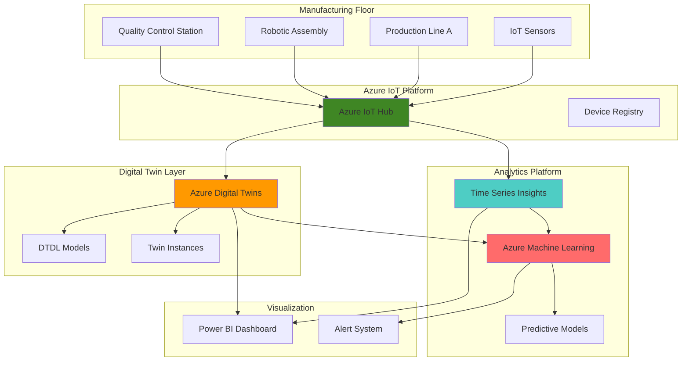

# Predictive Manufacturing Digital Twins with Azure IoT Hub and Digital Twins

## Problem

Manufacturing enterprises struggle with fragmented operational visibility across complex production environments, where critical equipment operates in isolation without centralized monitoring or predictive insights. Traditional reactive maintenance approaches result in unplanned downtime, inefficient resource allocation, and suboptimal production planning decisions that can cost organizations millions annually. Existing systems lack the contextual intelligence needed to correlate equipment performance patterns with production outcomes and quality metrics.

## Solution

Implement a comprehensive digital twin ecosystem using Azure IoT Hub for real-time sensor data ingestion and Azure Digital Twins to create virtual representations of manufacturing equipment with contextual relationships. This solution leverages Azure Time Series Insights for historical trend analysis and Azure Machine Learning for predictive maintenance algorithms, enabling proactive decision-making and optimized production workflows through intelligent automation and data-driven insights.

## Architecture Diagram



## Prerequisites

1. Azure subscription with Azure Digital Twins, IoT Hub, Time Series Insights, and Machine Learning permissions
2. Azure CLI v2.50+ installed and configured (or Azure CloudShell)
3. Understanding of IoT device simulation, DTDL modeling, and machine learning concepts
4. Basic knowledge of JSON, time series data analysis, and manufacturing processes
5. Estimated cost: $150-300 for initial 24-hour testing period with simulated devices

> **Note**: This recipe uses simulated IoT devices to demonstrate the architecture. Production implementations would require physical sensor integration following Azure IoT security best practices.

## Preparation

```bash
# Set environment variables for Azure resources
export RESOURCE_GROUP="rg-manufacturing-twins-${RANDOM_SUFFIX}"
export LOCATION="eastus"
export SUBSCRIPTION_ID=$(az account show --query id --output tsv)

# Generate unique suffix for resource names
RANDOM_SUFFIX=$(openssl rand -hex 3)

# Create resource group for manufacturing digital twin solution
az group create \
    --name ${RESOURCE_GROUP} \
    --location ${LOCATION} \
    --tags purpose=manufacturing-digital-twins environment=demo

echo "✅ Resource group created: ${RESOURCE_GROUP}"

# Set up service-specific naming conventions
export IOT_HUB_NAME="iothub-manufacturing-${RANDOM_SUFFIX}"
export DIGITAL_TWINS_NAME="dt-manufacturing-${RANDOM_SUFFIX}"
export TSI_ENVIRONMENT_NAME="tsi-manufacturing-${RANDOM_SUFFIX}"
export ML_WORKSPACE_NAME="mlws-manufacturing-${RANDOM_SUFFIX}"
export STORAGE_ACCOUNT_NAME="stmanufacturing${RANDOM_SUFFIX}"

# Install required Azure CLI extensions
az extension add --name azure-iot
az extension add --name dt
```

## Steps

1. **Create Azure IoT Hub for Device Connectivity**:

   Azure IoT Hub serves as the central message hub for bi-directional communication between IoT applications and connected devices. For manufacturing scenarios, IoT Hub provides enterprise-grade security, device management capabilities, and protocol flexibility essential for industrial environments. The Standard tier enables advanced features like device-to-cloud telemetry routing and cloud-to-device messaging for real-time control operations.

   ```bash
   # Create IoT Hub with Standard S1 tier for production capabilities
   az iot hub create \
       --name ${IOT_HUB_NAME} \
       --resource-group ${RESOURCE_GROUP} \
       --location ${LOCATION} \
       --sku S1 \
       --partition-count 4 \
       --tags purpose=manufacturing-connectivity

   # Get IoT Hub connection string for device registration
   IOT_HUB_CONNECTION=$(az iot hub connection-string show \
       --hub-name ${IOT_HUB_NAME} \
       --output tsv)

   echo "✅ IoT Hub created: ${IOT_HUB_NAME}"
   ```

   The IoT Hub is now configured with multiple partitions for scalable message processing. This foundational component enables secure device authentication, message routing, and telemetry collection from manufacturing equipment while supporting thousands of concurrent device connections.

2. **Create Storage Account for Time Series Insights**:

   Azure Storage provides the warm and cold storage capabilities required by Time Series Insights for both real-time analytics and long-term historical data retention. The hierarchical namespace feature enables efficient data organization for time-series analytics workloads while maintaining cost-effective storage tiers for different data access patterns.

   ```bash
   # Create storage account with hierarchical namespace for TSI
   az storage account create \
       --name ${STORAGE_ACCOUNT_NAME} \
       --resource-group ${RESOURCE_GROUP} \
       --location ${LOCATION} \
       --sku Standard_LRS \
       --kind StorageV2 \
       --hierarchical-namespace true \
       --tags purpose=timeseries-storage

   # Get storage account key for TSI configuration
   STORAGE_KEY=$(az storage account keys list \
       --account-name ${STORAGE_ACCOUNT_NAME} \
       --resource-group ${RESOURCE_GROUP} \
       --query '[0].value' --output tsv)

   echo "✅ Storage account created: ${STORAGE_ACCOUNT_NAME}"
   ```

   The storage account provides the foundation for Time Series Insights data persistence, enabling both real-time analytics and historical trend analysis essential for manufacturing intelligence and predictive maintenance scenarios.

3. **Create Time Series Insights Environment**:

   Azure Time Series Insights provides purpose-built analytics for IoT time-series data with automatic data modeling, query optimization, and visualization capabilities. This managed service enables manufacturing teams to analyze historical trends, identify patterns, and correlate equipment performance with production outcomes through an intuitive query interface.

   ```bash
   # Create Time Series Insights Gen2 environment
   az tsi environment gen2 create \
       --environment-name ${TSI_ENVIRONMENT_NAME} \
       --resource-group ${RESOURCE_GROUP} \
       --location ${LOCATION} \
       --sku name=L1 capacity=1 \
       --time-series-id-properties deviceId \
       --warm-store-configuration data-retention=P7D \
       --storage-configuration account-name=${STORAGE_ACCOUNT_NAME} \
           management-key=${STORAGE_KEY}

   echo "✅ Time Series Insights environment created: ${TSI_ENVIRONMENT_NAME}"
   ```

   Time Series Insights is now configured to receive and store manufacturing telemetry data with 7-day warm storage for real-time analytics and unlimited cold storage for historical analysis. This enables comprehensive equipment performance tracking and trend identification.

4. **Create Azure Digital Twins Instance**:

   Azure Digital Twins provides a platform for creating comprehensive digital models of physical environments, enabling real-time representation of manufacturing facilities with semantic relationships between equipment, processes, and outcomes. This service uses the Digital Twins Definition Language (DTDL) to model complex manufacturing hierarchies and dependencies.

   ```bash
   # Create Azure Digital Twins instance
   az dt create \
       --dt-name ${DIGITAL_TWINS_NAME} \
       --resource-group ${RESOURCE_GROUP} \
       --location ${LOCATION} \
       --tags purpose=manufacturing-modeling

   # Assign current user as Digital Twins Data Owner
   USER_OBJECT_ID=$(az ad signed-in-user show --query id --output tsv)
   
   az role assignment create \
       --role "Azure Digital Twins Data Owner" \
       --assignee ${USER_OBJECT_ID} \
       --scope "/subscriptions/${SUBSCRIPTION_ID}/resourceGroups/${RESOURCE_GROUP}/providers/Microsoft.DigitalTwins/digitalTwinsInstances/${DIGITAL_TWINS_NAME}"

   echo "✅ Azure Digital Twins instance created: ${DIGITAL_TWINS_NAME}"
   ```

   The Digital Twins instance provides the foundation for creating virtual representations of manufacturing equipment with semantic relationships, enabling complex queries across the entire production ecosystem for operational insights and optimization opportunities.

5. **Create DTDL Models for Manufacturing Equipment**:

   Digital Twins Definition Language (DTDL) models define the schema and capabilities of digital twins, including properties, telemetry, commands, and relationships. For manufacturing scenarios, these models capture equipment characteristics, operational parameters, and hierarchical relationships essential for comprehensive facility representation and analysis.

   ```bash
   # Create DTDL model for production line equipment
   cat > production-line-model.json << 'EOF'
   {
     "@id": "dtmi:manufacturing:ProductionLine;1",
     "@type": "Interface",
     "@context": "dtmi:dtdl:context;2",
     "displayName": "Production Line",
     "description": "Manufacturing production line with multiple equipment",
     "contents": [
       {
         "@type": "Property",
         "name": "lineId",
         "schema": "string",
         "description": "Unique identifier for the production line"
       },
       {
         "@type": "Property",
         "name": "status",
         "schema": "string",
         "description": "Current operational status"
       },
       {
         "@type": "Telemetry",
         "name": "efficiency",
         "schema": "double",
         "description": "Production efficiency percentage"
       },
       {
         "@type": "Telemetry",
         "name": "throughput",
         "schema": "integer",
         "description": "Units produced per hour"
       },
       {
         "@type": "Relationship",
         "name": "contains",
         "target": "dtmi:manufacturing:Equipment;1",
         "description": "Equipment within this production line"
       }
     ]
   }
   EOF

   # Create DTDL model for individual equipment
   cat > equipment-model.json << 'EOF'
   {
     "@id": "dtmi:manufacturing:Equipment;1",
     "@type": "Interface", 
     "@context": "dtmi:dtdl:context;2",
     "displayName": "Manufacturing Equipment",
     "description": "Individual piece of manufacturing equipment",
     "contents": [
       {
         "@type": "Property",
         "name": "equipmentId",
         "schema": "string",
         "description": "Unique equipment identifier"
       },
       {
         "@type": "Property",
         "name": "equipmentType",
         "schema": "string", 
         "description": "Type of manufacturing equipment"
       },
       {
         "@type": "Telemetry",
         "name": "temperature",
         "schema": "double",
         "description": "Operating temperature in Celsius"
       },
       {
         "@type": "Telemetry",
         "name": "vibration",
         "schema": "double",
         "description": "Vibration level in Hz"
       },
       {
         "@type": "Telemetry",
         "name": "pressure",
         "schema": "double",
         "description": "Operating pressure in PSI"
       },
       {
         "@type": "Command",
         "name": "emergencyStop",
         "description": "Emergency stop command for equipment"
       }
     ]
   }
   EOF

   # Upload models to Azure Digital Twins
   az dt model create \
       --dt-name ${DIGITAL_TWINS_NAME} \
       --models production-line-model.json equipment-model.json

   echo "✅ DTDL models created and uploaded"
   ```

   The DTDL models now define the structure for manufacturing digital twins, enabling representation of production lines and equipment with telemetry properties, operational commands, and hierarchical relationships that reflect real-world manufacturing facility organization.

6. **Create Digital Twin Instances**:

   Digital twin instances represent specific physical entities within the manufacturing environment, populated with real-time data from IoT sensors and historical operational context. These instances enable comprehensive facility monitoring, analysis, and optimization through semantic relationships and live telemetry integration.

   ```bash
   # Create production line digital twin
   az dt twin create \
       --dt-name ${DIGITAL_TWINS_NAME} \
       --dtmi "dtmi:manufacturing:ProductionLine;1" \
       --twin-id "production-line-a" \
       --properties '{
         "lineId": "LINE-A-001",
         "status": "operational"
       }'

   # Create equipment digital twins
   az dt twin create \
       --dt-name ${DIGITAL_TWINS_NAME} \
       --dtmi "dtmi:manufacturing:Equipment;1" \
       --twin-id "robotic-arm-001" \
       --properties '{
         "equipmentId": "ARM-001",
         "equipmentType": "robotic-assembly"
       }'

   az dt twin create \
       --dt-name ${DIGITAL_TWINS_NAME} \
       --dtmi "dtmi:manufacturing:Equipment;1" \
       --twin-id "conveyor-belt-001" \
       --properties '{
         "equipmentId": "CVR-001", 
         "equipmentType": "conveyor-transport"
       }'

   # Create relationships between production line and equipment
   az dt twin relationship create \
       --dt-name ${DIGITAL_TWINS_NAME} \
       --source-twin-id "production-line-a" \
       --relationship-id "contains-arm" \
       --relationship contains \
       --target-twin-id "robotic-arm-001"

   az dt twin relationship create \
       --dt-name ${DIGITAL_TWINS_NAME} \
       --source-twin-id "production-line-a" \
       --relationship-id "contains-conveyor" \
       --relationship contains \
       --target-twin-id "conveyor-belt-001"

   echo "✅ Digital twin instances and relationships created"
   ```

   The manufacturing facility now has digital twin representations with semantic relationships that mirror the physical production environment. These twins will receive real-time telemetry and enable comprehensive facility analysis and optimization.

7. **Register IoT Devices for Equipment Simulation**:

   IoT device registration establishes secure communication channels between physical (or simulated) manufacturing equipment and Azure IoT Hub. Each device receives unique credentials and identity management, enabling secure telemetry transmission and command reception for comprehensive equipment monitoring and control.

   ```bash
   # Register IoT devices for each piece of equipment
   az iot hub device-identity create \
       --hub-name ${IOT_HUB_NAME} \
       --device-id "robotic-arm-001"

   az iot hub device-identity create \
       --hub-name ${IOT_HUB_NAME} \
       --device-id "conveyor-belt-001"

   # Get device connection strings for simulation
   ARM_CONNECTION=$(az iot hub device-identity connection-string show \
       --hub-name ${IOT_HUB_NAME} \
       --device-id "robotic-arm-001" \
       --output tsv)

   CONVEYOR_CONNECTION=$(az iot hub device-identity connection-string show \
       --hub-name ${IOT_HUB_NAME} \
       --device-id "conveyor-belt-001" \
       --output tsv)

   echo "✅ IoT devices registered successfully"
   ```

   Manufacturing equipment devices are now registered with unique identities and security credentials, enabling secure bidirectional communication for telemetry collection and command execution within the smart manufacturing ecosystem.

8. **Create Azure Machine Learning Workspace**:

   Azure Machine Learning provides the infrastructure for developing, training, and deploying predictive maintenance models using manufacturing telemetry data. This managed service enables data scientists to build sophisticated algorithms for equipment failure prediction, quality optimization, and production planning through automated machine learning and model lifecycle management.

   ```bash
   # Create Azure Machine Learning workspace
   az ml workspace create \
       --workspace-name ${ML_WORKSPACE_NAME} \
       --resource-group ${RESOURCE_GROUP} \
       --location ${LOCATION} \
       --tags purpose=predictive-maintenance

   echo "✅ Azure Machine Learning workspace created: ${ML_WORKSPACE_NAME}"
   ```

   The Machine Learning workspace provides the foundation for developing predictive analytics models that will analyze equipment telemetry patterns to identify maintenance needs, optimize production schedules, and improve overall equipment effectiveness.

9. **Configure Event Routing and Data Processing**:

   Event routing enables automated data flow from IoT Hub to multiple destinations including Digital Twins for real-time updates and Time Series Insights for analytical processing. This configuration ensures comprehensive data coverage for both operational monitoring and historical analysis essential for manufacturing intelligence.

   ```bash
   # Create event endpoint for Digital Twins integration
   az iot hub routing-endpoint create \
       --hub-name ${IOT_HUB_NAME} \
       --endpoint-name "digital-twins-endpoint" \
       --endpoint-type eventhub \
       --endpoint-resource-group ${RESOURCE_GROUP} \
       --connection-string ${IOT_HUB_CONNECTION}

   # Create routing rule for telemetry data
   az iot hub route create \
       --hub-name ${IOT_HUB_NAME} \
       --route-name "telemetry-to-twins" \
       --endpoint-name "digital-twins-endpoint" \
       --source-type devicemessages \
       --query "true"

   echo "✅ Event routing configured for data processing"
   ```

   Data routing infrastructure now automatically forwards manufacturing telemetry to appropriate Azure services, enabling real-time digital twin updates and comprehensive analytical processing for operational insights and predictive maintenance capabilities.

10. **Simulate Manufacturing Telemetry Data**:

    Telemetry simulation generates realistic manufacturing data patterns including temperature variations, vibration signatures, and pressure readings that represent normal operations and potential failure conditions. This simulation enables testing of the complete digital twin ecosystem and predictive analytics pipeline without requiring physical equipment.

    ```bash
    # Create Python script for IoT device simulation
    cat > simulate_devices.py << 'EOF'
    import asyncio
    import json
    import random
    import time
    from azure.iot.device.aio import IoTHubDeviceClient
    from datetime import datetime

    async def simulate_robotic_arm(connection_string):
        client = IoTHubDeviceClient.create_from_connection_string(connection_string)
        await client.connect()
        
        print("Robotic arm simulation started...")
        for i in range(100):
            # Simulate normal operation with occasional anomalies
            base_temp = 45.0 + random.normalvariate(0, 2)
            vibration = 2.5 + random.normalvariate(0, 0.5)
            pressure = 120 + random.normalvariate(0, 5)
            
            # Introduce anomalies for predictive model training
            if random.random() < 0.05:  # 5% anomaly rate
                base_temp += random.uniform(15, 25)
                vibration += random.uniform(3, 6)
            
            telemetry = {
                "deviceId": "robotic-arm-001",
                "timestamp": datetime.utcnow().isoformat(),
                "temperature": round(base_temp, 2),
                "vibration": round(vibration, 2),
                "pressure": round(pressure, 2),
                "operationalStatus": "running"
            }
            
            message = json.dumps(telemetry)
            await client.send_message(message)
            print(f"Sent: {message}")
            await asyncio.sleep(5)
        
        await client.disconnect()

    async def simulate_conveyor(connection_string):
        client = IoTHubDeviceClient.create_from_connection_string(connection_string)
        await client.connect()
        
        print("Conveyor belt simulation started...")
        for i in range(100):
            speed = 2.5 + random.normalvariate(0, 0.2)
            load = random.uniform(60, 95)
            motor_temp = 35 + random.normalvariate(0, 3)
            
            telemetry = {
                "deviceId": "conveyor-belt-001", 
                "timestamp": datetime.utcnow().isoformat(),
                "speed": round(speed, 2),
                "load": round(load, 2),
                "motorTemperature": round(motor_temp, 2),
                "operationalStatus": "running"
            }
            
            message = json.dumps(telemetry)
            await client.send_message(message)
            print(f"Sent: {message}")
            await asyncio.sleep(5)
        
        await client.disconnect()

    async def main():
        arm_connection = "${ARM_CONNECTION}"
        conveyor_connection = "${CONVEYOR_CONNECTION}"
        
        await asyncio.gather(
            simulate_robotic_arm(arm_connection),
            simulate_conveyor(conveyor_connection)
        )

    if __name__ == "__main__":
        asyncio.run(main())
    EOF

    # Install required Python packages and run simulation
    pip install azure-iot-device
    python simulate_devices.py &

    echo "✅ Manufacturing telemetry simulation started"
    ```

    Realistic manufacturing telemetry is now flowing through the system, providing data for digital twin updates, time series analysis, and machine learning model training. The simulation includes normal operational patterns and anomalies for comprehensive testing.

## Validation & Testing

1. **Verify IoT Hub message ingestion**:

   ```bash
   # Monitor IoT Hub messages to confirm telemetry ingestion
   az iot hub monitor-events \
       --hub-name ${IOT_HUB_NAME} \
       --timeout 30
   ```

   Expected output: Real-time telemetry messages from simulated manufacturing equipment with temperature, vibration, and operational status data.

2. **Validate Digital Twins data updates**:

   ```bash
   # Query digital twin instances to verify data updates
   az dt twin query \
       --dt-name ${DIGITAL_TWINS_NAME} \
       --query-command "SELECT * FROM DIGITALTWINS"
   
   # Check specific equipment twin
   az dt twin show \
       --dt-name ${DIGITAL_TWINS_NAME} \
       --twin-id "robotic-arm-001"
   ```

   Expected output: JSON representation of digital twins with current property values and relationship data.

3. **Test Time Series Insights data availability**:

   ```bash
   # Verify TSI environment is receiving data
   az tsi environment show \
       --environment-name ${TSI_ENVIRONMENT_NAME} \
       --resource-group ${RESOURCE_GROUP}
   ```

   Expected output: TSI environment status showing active data ingestion and warm store configuration.

4. **Validate machine learning workspace readiness**:

   ```bash
   # Confirm ML workspace is available for model development
   az ml workspace show \
       --workspace-name ${ML_WORKSPACE_NAME} \
       --resource-group ${RESOURCE_GROUP}
   ```

   Expected output: Machine Learning workspace details with compute and storage configurations ready for predictive model development.

## Cleanup

1. **Stop telemetry simulation**:

   ```bash
   # Stop the Python simulation process
   pkill -f "python simulate_devices.py"
   
   echo "✅ Telemetry simulation stopped"
   ```

2. **Remove Azure Digital Twins resources**:

   ```bash
   # Delete digital twin instances and relationships
   az dt twin delete \
       --dt-name ${DIGITAL_TWINS_NAME} \
       --twin-id "robotic-arm-001" \
       --yes

   az dt twin delete \
       --dt-name ${DIGITAL_TWINS_NAME} \
       --twin-id "conveyor-belt-001" \
       --yes

   az dt twin delete \
       --dt-name ${DIGITAL_TWINS_NAME} \
       --twin-id "production-line-a" \
       --yes

   echo "✅ Digital twin instances deleted"
   ```

3. **Remove resource group and all associated resources**:

   ```bash
   # Delete entire resource group and contained resources
   az group delete \
       --name ${RESOURCE_GROUP} \
       --yes \
       --no-wait

   echo "✅ Resource group deletion initiated: ${RESOURCE_GROUP}"
   echo "Note: Complete deletion may take 10-15 minutes"

   # Clean up local files
   rm -f production-line-model.json equipment-model.json simulate_devices.py
   ```

## Discussion

Azure Digital Twins combined with IoT Hub creates a powerful foundation for smart manufacturing by providing comprehensive visibility into production operations through real-time digital representations. This architecture enables manufacturers to move beyond traditional reactive maintenance approaches toward predictive, data-driven decision making that optimizes equipment utilization and minimizes unplanned downtime. The semantic modeling capabilities of Digital Twins Definition Language (DTDL) allow for complex hierarchical relationships that mirror real manufacturing environments, as detailed in the [Azure Digital Twins documentation](https://docs.microsoft.com/en-us/azure/digital-twins/overview).

The integration with Time Series Insights provides the analytical foundation for understanding equipment performance patterns and identifying optimization opportunities. TSI's automatic data modeling and query optimization capabilities enable manufacturing teams to quickly identify correlations between operational parameters and production outcomes without requiring deep analytics expertise. For comprehensive guidance on time series analytics in manufacturing, see the [Time Series Insights best practices](https://docs.microsoft.com/en-us/azure/time-series-insights/concepts-query-data-csharp).

From a scalability perspective, this architecture supports thousands of connected devices through IoT Hub's partitioned message processing and can accommodate complex facility hierarchies through Digital Twins' graph-based data model. The serverless nature of many Azure services ensures cost-effective scaling based on actual usage patterns rather than peak capacity planning. For detailed scaling considerations, review the [Azure IoT Hub quotas and throttling](https://docs.microsoft.com/en-us/azure/iot-hub/iot-hub-devguide-quotas-throttling) documentation.

Machine Learning integration enables the development of sophisticated predictive maintenance models that analyze equipment telemetry patterns to identify failure signatures before they result in downtime. This proactive approach can reduce maintenance costs by 10-20% while improving overall equipment effectiveness through optimized maintenance scheduling and resource allocation, following the principles outlined in the [Azure Machine Learning for IoT](https://docs.microsoft.com/en-us/azure/machine-learning/concept-iot-edge) guidance.

> **Tip**: Implement gradual rollout strategies when deploying digital twin solutions in production environments. Start with a single production line or equipment type to validate the model accuracy and operational workflows before expanding to the entire facility. Use Azure Monitor and Application Insights to track system performance and user adoption metrics during deployment phases.

## Challenge

Extend this smart manufacturing digital twin solution by implementing these advanced capabilities:

1. **Real-time Anomaly Detection**: Integrate Azure Stream Analytics with custom machine learning models to detect equipment anomalies in real-time and trigger automated responses through Digital Twins command capabilities.

2. **Predictive Quality Control**: Develop machine learning models that correlate equipment performance telemetry with product quality metrics to predict and prevent quality issues before they occur.

3. **Energy Optimization**: Add energy consumption monitoring to digital twins and use Azure Machine Learning to optimize production schedules for energy efficiency while maintaining production targets.

4. **Supply Chain Integration**: Extend digital twins to include supplier and inventory relationships, enabling end-to-end visibility from raw materials to finished products with predictive supply chain analytics.

5. **Mixed Reality Visualization**: Integrate with Azure Spatial Anchors and HoloLens to provide augmented reality overlays of digital twin data directly on physical equipment for enhanced maintenance and training experiences.

## Infrastructure Code

*Infrastructure code will be generated after recipe approval.*