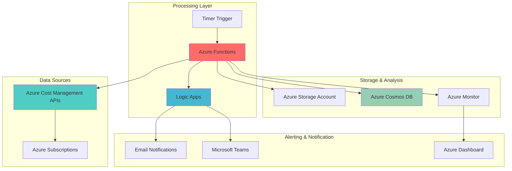

# Proactive Cost Anomaly Detection with Serverless Analytics

## Problem

Organizations struggle to maintain visibility into their Azure spending patterns and often discover unexpected cost spikes days or weeks after they occur. Manual cost monitoring is time-consuming and reactive, leading to budget overruns and missed optimization opportunities. Without proactive anomaly detection, teams face challenges in identifying abnormal spending patterns, understanding the root causes of cost increases, and implementing timely remediation measures.

## Solution

Build an automated cost anomaly detection system that leverages Azure Cost Management APIs to continuously monitor spending patterns, uses Azure Functions for serverless data processing, and integrates with Azure Logic Apps for intelligent alerting. This solution provides real-time cost anomaly detection, detailed spending analysis, and automated notifications with actionable insights for cost optimization.

## Architecture Diagram



## Prerequisites

1. Azure subscription with Owner or Contributor permissions
2. Azure CLI v2.60.0 or later installed and configured
3. Azure Functions Core Tools v4.x installed for local development
4. Basic knowledge of Azure Cost Management and billing concepts
5. Understanding of serverless computing patterns and Azure Functions
6. Familiarity with Azure Logic Apps and workflow automation
7. Estimated cost: $15-30 per month for moderate usage (Function Apps, Cosmos DB, Storage)

> **Note**: This solution requires access to Azure Cost Management billing APIs. Ensure your account has the necessary permissions to access billing data for the target subscriptions.

## Preparation

Azure Cost Management provides comprehensive APIs for retrieving billing and usage data, enabling automated cost analysis and anomaly detection. Setting up the foundational resources involves creating storage for historical data, configuring serverless compute resources, and establishing monitoring capabilities that follow Azure Well-Architected Framework principles.

```bash
# Set environment variables for Azure resources
export RESOURCE_GROUP="rg-cost-anomaly-detection"
export LOCATION="eastus"
export SUBSCRIPTION_ID=$(az account show --query id --output tsv)

# Generate unique suffix for resource names
RANDOM_SUFFIX=$(openssl rand -hex 3)
export STORAGE_ACCOUNT="stcostanomaly${RANDOM_SUFFIX}"
export FUNCTION_APP="func-cost-anomaly-${RANDOM_SUFFIX}"
export COSMOS_ACCOUNT="cosmos-cost-anomaly-${RANDOM_SUFFIX}"
export LOGIC_APP="logic-cost-alerts-${RANDOM_SUFFIX}"

# Create resource group
az group create \
    --name ${RESOURCE_GROUP} \
    --location ${LOCATION} \
    --tags purpose=cost-anomaly-detection environment=production

echo "✅ Resource group created: ${RESOURCE_GROUP}"

# Create storage account for function app and data storage
az storage account create \
    --name ${STORAGE_ACCOUNT} \
    --resource-group ${RESOURCE_GROUP} \
    --location ${LOCATION} \
    --sku Standard_LRS \
    --kind StorageV2 \
    --access-tier Hot \
    --allow-blob-public-access false

echo "✅ Storage account created: ${STORAGE_ACCOUNT}"

# Create Cosmos DB account for cost data persistence
az cosmosdb create \
    --name ${COSMOS_ACCOUNT} \
    --resource-group ${RESOURCE_GROUP} \
    --locations regionName=${LOCATION} \
    --default-consistency-level Session \
    --enable-automatic-failover false

echo "✅ Cosmos DB account created: ${COSMOS_ACCOUNT}"
```

## Steps

1. **Create Azure Functions App for Cost Data Processing**:

   Azure Functions provides serverless compute capabilities that automatically scale based on demand, making it ideal for periodic cost analysis tasks. The consumption plan ensures cost-effective execution while the timer trigger enables scheduled data collection and analysis. This serverless approach eliminates infrastructure management overhead while providing reliable, scalable cost monitoring that aligns with Azure Well-Architected Framework principles.

   ```bash
   # Create Function App with consumption plan
   az functionapp create \
       --name ${FUNCTION_APP} \
       --resource-group ${RESOURCE_GROUP} \
       --storage-account ${STORAGE_ACCOUNT} \
       --consumption-plan-location ${LOCATION} \
       --runtime python \
       --runtime-version 3.12 \
       --functions-version 4 \
       --disable-app-insights false
   
   # Configure application settings for cost management
   az functionapp config appsettings set \
       --name ${FUNCTION_APP} \
       --resource-group ${RESOURCE_GROUP} \
       --settings \
       "COSMOS_ENDPOINT=https://${COSMOS_ACCOUNT}.documents.azure.com:443/" \
       "SUBSCRIPTION_ID=${SUBSCRIPTION_ID}" \
       "ANOMALY_THRESHOLD=20" \
       "LOOKBACK_DAYS=30"
   
   echo "✅ Function App created and configured: ${FUNCTION_APP}"
   ```

   The Function App is now ready with the necessary configuration for cost data processing. Application settings provide environment-specific variables that the functions will use to connect to Cosmos DB, specify the subscription to monitor, and define anomaly detection parameters. The consumption plan automatically scales based on demand while maintaining cost-effectiveness.

2. **Create Cosmos DB Database and Container for Cost Data**:

   Azure Cosmos DB provides globally distributed, multi-model database capabilities with automatic scaling and low-latency access. Creating a dedicated database for cost data ensures efficient querying and enables complex analytics on historical spending patterns. The partition key strategy based on date enables optimal query performance for time-series cost analysis while following Cosmos DB best practices.

   ```bash
   # Create database for cost data
   az cosmosdb sql database create \
       --account-name ${COSMOS_ACCOUNT} \
       --resource-group ${RESOURCE_GROUP} \
       --name CostAnalytics \
       --throughput 400
   
   # Create container for daily cost data
   az cosmosdb sql container create \
       --account-name ${COSMOS_ACCOUNT} \
       --resource-group ${RESOURCE_GROUP} \
       --database-name CostAnalytics \
       --name DailyCosts \
       --partition-key-path "/date" \
       --throughput 400
   
   # Create container for anomaly detection results
   az cosmosdb sql container create \
       --account-name ${COSMOS_ACCOUNT} \
       --resource-group ${RESOURCE_GROUP} \
       --database-name CostAnalytics \
       --name AnomalyResults \
       --partition-key-path "/subscriptionId" \
       --throughput 400
   
   echo "✅ Cosmos DB database and containers created"
   ```

   The Cosmos DB database is now configured with optimized containers for cost data storage and anomaly detection results. This structure supports efficient querying for both historical analysis and real-time anomaly detection while maintaining cost-effective throughput allocation and enabling horizontal scaling.

3. **Deploy Cost Data Collection Function**:

   The cost data collection function integrates with Azure Cost Management APIs to retrieve daily spending information across all services and resource groups. This function processes the raw billing data, calculates metrics, and stores structured cost information in Cosmos DB for analysis and anomaly detection using managed identity authentication for secure access.

   ```bash
   # Create function directory structure
   mkdir -p ./cost-anomaly-functions/CostDataCollector
   
   # Create function configuration
   cat > ./cost-anomaly-functions/CostDataCollector/function.json << 'EOF'
   {
     "bindings": [
       {
         "name": "mytimer",
         "type": "timerTrigger",
         "direction": "in",
         "schedule": "0 0 8 * * *"
       },
       {
         "name": "cosmosOut",
         "type": "cosmosDB",
         "databaseName": "CostAnalytics",
         "collectionName": "DailyCosts",
         "createIfNotExists": false,
         "connectionStringSetting": "COSMOS_CONNECTION",
         "direction": "out"
       }
     ]
   }
   EOF
   
   # Create Python function code
   cat > ./cost-anomaly-functions/CostDataCollector/__init__.py << 'EOF'
   import azure.functions as func
   import logging
   import json
   import os
   from datetime import datetime, timedelta
   from azure.identity import DefaultAzureCredential
   from azure.mgmt.costmanagement import CostManagementClient
   
   def main(mytimer: func.TimerRequest, cosmosOut: func.Out[func.Document]) -> None:
       logging.info('Cost data collection function triggered')
       
       subscription_id = os.environ['SUBSCRIPTION_ID']
       credential = DefaultAzureCredential()
       
       # Initialize Cost Management client
       cost_client = CostManagementClient(credential)
       
       # Calculate date range for yesterday's data
       yesterday = datetime.utcnow() - timedelta(days=1)
       date_str = yesterday.strftime('%Y-%m-%d')
       
       try:
           # Query daily costs by service
           query_definition = {
               "type": "ActualCost",
               "timeframe": "Custom",
               "timePeriod": {
                   "from": date_str,
                   "to": date_str
               },
               "dataset": {
                   "granularity": "Daily",
                   "aggregation": {
                       "totalCost": {
                           "name": "PreTaxCost",
                           "function": "Sum"
                       }
                   },
                   "grouping": [
                       {
                           "type": "Dimension",
                           "name": "ServiceName"
                       },
                       {
                           "type": "Dimension",
                           "name": "ResourceGroupName"
                       }
                   ]
               }
           }
           
           scope = f'/subscriptions/{subscription_id}'
           result = cost_client.query.usage(scope, query_definition)
           
           # Process and store cost data
           cost_records = []
           for row in result.rows:
               cost_record = {
                   "id": f"{date_str}-{row[2]}-{row[3]}",
                   "date": date_str,
                   "subscriptionId": subscription_id,
                   "serviceName": row[2],
                   "resourceGroupName": row[3],
                   "cost": float(row[0]),
                   "currency": row[1],
                   "timestamp": datetime.utcnow().isoformat()
               }
               cost_records.append(cost_record)
           
           # Output to Cosmos DB
           if cost_records:
               cosmosOut.set(func.Document.from_dict(cost_records))
               logging.info(f'Successfully processed {len(cost_records)} cost records for {date_str}')
           else:
               logging.info(f'No cost data found for {date_str}')
           
       except Exception as e:
           logging.error(f'Error processing cost data: {str(e)}')
           raise
   EOF
   
   # Create requirements file
   cat > ./cost-anomaly-functions/requirements.txt << 'EOF'
   azure-functions
   azure-identity
   azure-mgmt-costmanagement
   azure-cosmos
   EOF
   
   # Create host.json for function app configuration
   cat > ./cost-anomaly-functions/host.json << 'EOF'
   {
     "version": "2.0",
     "functionTimeout": "00:10:00",
     "extensions": {
       "cosmosDB": {
         "connectionMode": "Direct"
       }
     }
   }
   EOF
   
   # Deploy function code
   cd ./cost-anomaly-functions
   func azure functionapp publish ${FUNCTION_APP} \
       --python
   cd ..
   
   echo "✅ Cost data collection function deployed"
   ```

   The cost data collection function is now deployed and configured to run daily at 8 AM UTC. This function automatically retrieves the previous day's cost data from Azure Cost Management APIs, processes it into structured records, and stores it in Cosmos DB for analysis and historical tracking with proper error handling and logging.

4. **Create Anomaly Detection Function**:

   The anomaly detection function implements statistical analysis algorithms to identify unusual spending patterns by comparing current costs against historical baselines. This function calculates rolling averages, standard deviations, and applies configurable thresholds to detect significant cost anomalies across different services and resource groups using proven statistical methods.

   ```bash
   # Create anomaly detection function
   mkdir -p ./cost-anomaly-functions/AnomalyDetector
   
   cat > ./cost-anomaly-functions/AnomalyDetector/function.json << 'EOF'
   {
     "bindings": [
       {
         "name": "mytimer",
         "type": "timerTrigger",
         "direction": "in",
         "schedule": "0 30 8 * * *"
       },
       {
         "name": "cosmosIn",
         "type": "cosmosDB",
         "databaseName": "CostAnalytics",
         "collectionName": "DailyCosts",
         "connectionStringSetting": "COSMOS_CONNECTION",
         "sqlQuery": "SELECT * FROM c WHERE c.date >= DateTimeAdd('day', -30, GetCurrentDateTime())",
         "direction": "in"
       },
       {
         "name": "cosmosOut",
         "type": "cosmosDB",
         "databaseName": "CostAnalytics",
         "collectionName": "AnomalyResults",
         "createIfNotExists": false,
         "connectionStringSetting": "COSMOS_CONNECTION",
         "direction": "out"
       }
     ]
   }
   EOF
   
   cat > ./cost-anomaly-functions/AnomalyDetector/__init__.py << 'EOF'
   import azure.functions as func
   import logging
   import json
   import os
   import statistics
   from datetime import datetime, timedelta
   from collections import defaultdict
   from azure.cosmos import CosmosClient
   
   def main(mytimer: func.TimerRequest, cosmosIn: func.DocumentList, cosmosOut: func.Out[func.Document]) -> None:
       logging.info('Anomaly detection function triggered')
       
       subscription_id = os.environ['SUBSCRIPTION_ID']
       anomaly_threshold = float(os.environ.get('ANOMALY_THRESHOLD', 20))
       lookback_days = int(os.environ.get('LOOKBACK_DAYS', 30))
       
       # Calculate date range
       today = datetime.utcnow().date()
       yesterday = today - timedelta(days=1)
       lookback_date = today - timedelta(days=lookback_days)
       
       try:
           # Group cost data by service and resource group
           service_costs = defaultdict(list)
           yesterday_costs = {}
           
           for document in cosmosIn:
               doc_date = datetime.fromisoformat(document['date']).date()
               service_key = f"{document['serviceName']}_{document['resourceGroupName']}"
               cost = document['cost']
               
               if doc_date >= lookback_date:
                   service_costs[service_key].append(cost)
                   
               if doc_date == yesterday:
                   yesterday_costs[service_key] = cost
           
           # Detect anomalies
           anomalies = []
           
           for service_key, costs in service_costs.items():
               if len(costs) < 7:  # Need at least 7 days of data
                   continue
                   
               # Calculate baseline statistics
               baseline_costs = costs[:-1] if service_key in yesterday_costs else costs
               if len(baseline_costs) < 3:
                   continue
                   
               baseline_mean = statistics.mean(baseline_costs)
               baseline_std = statistics.stdev(baseline_costs) if len(baseline_costs) > 1 else 0
               
               # Check for anomalies
               if service_key in yesterday_costs:
                   current_cost = yesterday_costs[service_key]
                   
                   # Calculate percentage change
                   if baseline_mean > 0:
                       percent_change = ((current_cost - baseline_mean) / baseline_mean) * 100
                   else:
                       percent_change = 0
                   
                   # Check if cost exceeds threshold
                   if abs(percent_change) > anomaly_threshold:
                       service_name, resource_group = service_key.split('_', 1)
                       
                       anomaly = {
                           "id": f"{yesterday.isoformat()}-{service_key}",
                           "date": yesterday.isoformat(),
                           "subscriptionId": subscription_id,
                           "serviceName": service_name,
                           "resourceGroupName": resource_group,
                           "currentCost": current_cost,
                           "baselineCost": baseline_mean,
                           "percentageChange": percent_change,
                           "anomalyType": "increase" if percent_change > 0 else "decrease",
                           "severity": "high" if abs(percent_change) > 50 else "medium",
                           "timestamp": datetime.utcnow().isoformat()
                       }
                       
                       anomalies.append(anomaly)
           
           # Store anomaly results
           if anomalies:
               cosmosOut.set(func.Document.from_dict(anomalies))
               logging.info(f'Detected {len(anomalies)} cost anomalies')
           else:
               logging.info('No cost anomalies detected')
               
       except Exception as e:
           logging.error(f'Error in anomaly detection: {str(e)}')
           raise
   EOF
   
   # Redeploy with updated functions
   cd ./cost-anomaly-functions
   func azure functionapp publish ${FUNCTION_APP} \
       --python
   cd ..
   
   echo "✅ Anomaly detection function deployed"
   ```

   The anomaly detection function now analyzes cost patterns using statistical methods to identify significant deviations from normal spending behavior. This function runs 30 minutes after the data collection function, ensuring fresh data is available for analysis while providing timely anomaly detection with configurable sensitivity thresholds.

5. **Create Logic App for Automated Alerting**:

   Azure Logic Apps provides workflow orchestration capabilities that enable sophisticated alerting logic based on anomaly detection results. This workflow monitors for new anomalies, formats detailed alert messages, and distributes notifications through multiple channels including email and Microsoft Teams integration following enterprise notification patterns.

   ```bash
   # Create Logic App
   az logic workflow create \
       --name ${LOGIC_APP} \
       --resource-group ${RESOURCE_GROUP} \
       --location ${LOCATION} \
       --definition '{
         "$schema": "https://schema.management.azure.com/providers/Microsoft.Logic/schemas/2016-06-01/workflowdefinition.json#",
         "contentVersion": "1.0.0.0",
         "parameters": {},
         "triggers": {
           "When_a_new_anomaly_is_detected": {
             "type": "Recurrence",
             "recurrence": {
               "frequency": "Hour",
               "interval": 1
             }
           }
         },
         "actions": {
           "Initialize_variable": {
             "type": "InitializeVariable",
             "inputs": {
               "variables": [
                 {
                   "name": "AnomalyFound",
                   "type": "boolean",
                   "value": false
                 }
               ]
             }
           }
         }
       }' \
       --state Enabled
   
   echo "✅ Logic App created: ${LOGIC_APP}"
   
   # Create notification function for custom alerts
   mkdir -p ./cost-anomaly-functions/NotificationHandler
   
   cat > ./cost-anomaly-functions/NotificationHandler/function.json << 'EOF'
   {
     "bindings": [
       {
         "name": "cosmosIn",
         "type": "cosmosDBTrigger",
         "direction": "in",
         "databaseName": "CostAnalytics",
         "collectionName": "AnomalyResults",
         "connectionStringSetting": "COSMOS_CONNECTION",
         "createLeaseCollectionIfNotExists": true,
         "leaseCollectionName": "leases"
       }
     ]
   }
   EOF
   
   cat > ./cost-anomaly-functions/NotificationHandler/__init__.py << 'EOF'
   import azure.functions as func
   import logging
   import json
   import os
   from datetime import datetime
   
   def main(documents: func.DocumentList) -> None:
       logging.info('Notification handler triggered')
       
       for doc in documents:
           try:
               # Format alert message
               message = f"""
               Cost Anomaly Alert
               
               Date: {doc['date']}
               Service: {doc['serviceName']}
               Resource Group: {doc['resourceGroupName']}
               Current Cost: ${doc['currentCost']:.2f}
               Baseline Cost: ${doc['baselineCost']:.2f}
               Change: {doc['percentageChange']:.1f}%
               Severity: {doc['severity']}
               
               Please investigate this cost anomaly and take appropriate action.
               Review Azure Cost Management for detailed analysis.
               """
               
               # Log alert (replace with actual notification logic)
               logging.info(f'ALERT: {message}')
               
               # Here you would integrate with your notification system
               # Examples: send to Slack, Teams, email, SMS, etc.
               # Consider using Azure Communication Services for emails/SMS
               # or Microsoft Graph API for Teams notifications
               
           except KeyError as e:
               logging.error(f'Missing required field in anomaly document: {str(e)}')
           except Exception as e:
               logging.error(f'Error processing anomaly notification: {str(e)}')
   EOF
   
   # Deploy notification handler
   cd ./cost-anomaly-functions
   func azure functionapp publish ${FUNCTION_APP} \
       --python
   cd ..
   
   echo "✅ Notification handler deployed"
   ```

   The Logic App and notification handler are now configured to automatically process anomaly detection results and send formatted alerts. The notification system provides comprehensive anomaly details including cost comparisons, percentage changes, and severity levels to enable informed decision-making while supporting extensible notification channels.

6. **Configure Cosmos DB Connection and Permissions**:

   Proper authentication and authorization are essential for secure access to Azure Cost Management APIs and Cosmos DB. This step configures managed identity authentication, assigns necessary role-based access control (RBAC) permissions, and establishes secure connections between the Function App and data storage services following Azure security best practices.

   ```bash
   # Enable managed identity for Function App
   az functionapp identity assign \
       --name ${FUNCTION_APP} \
       --resource-group ${RESOURCE_GROUP}
   
   # Get the managed identity principal ID
   PRINCIPAL_ID=$(az functionapp identity show \
       --name ${FUNCTION_APP} \
       --resource-group ${RESOURCE_GROUP} \
       --query principalId \
       --output tsv)
   
   # Assign Cosmos DB Data Contributor role
   az cosmosdb sql role assignment create \
       --account-name ${COSMOS_ACCOUNT} \
       --resource-group ${RESOURCE_GROUP} \
       --scope "/" \
       --principal-id ${PRINCIPAL_ID} \
       --role-definition-id "00000000-0000-0000-0000-000000000002"
   
   # Assign Cost Management Reader role
   az role assignment create \
       --assignee ${PRINCIPAL_ID} \
       --role "Cost Management Reader" \
       --scope "/subscriptions/${SUBSCRIPTION_ID}"
   
   # Get Cosmos DB connection string
   COSMOS_CONNECTION=$(az cosmosdb keys list \
       --name ${COSMOS_ACCOUNT} \
       --resource-group ${RESOURCE_GROUP} \
       --type connection-strings \
       --query "connectionStrings[0].connectionString" \
       --output tsv)
   
   # Update Function App settings with connection string
   az functionapp config appsettings set \
       --name ${FUNCTION_APP} \
       --resource-group ${RESOURCE_GROUP} \
       --settings "COSMOS_CONNECTION=${COSMOS_CONNECTION}"
   
   echo "✅ Permissions and connections configured"
   ```

   The Function App now has the necessary permissions to access both Azure Cost Management APIs and Cosmos DB resources through managed identity authentication. This security configuration follows Azure Well-Architected Framework security principles by avoiding hardcoded credentials and using role-based access control with least privilege access.

## Validation & Testing

1. **Verify Function App Deployment and Configuration**:

   ```bash
   # Check Function App status
   az functionapp show \
       --name ${FUNCTION_APP} \
       --resource-group ${RESOURCE_GROUP} \
       --query "{name:name, state:state, hostNames:defaultHostName}" \
       --output table
   
   # List deployed functions
   az functionapp function list \
       --name ${FUNCTION_APP} \
       --resource-group ${RESOURCE_GROUP} \
       --output table
   ```

   Expected output: Function App should be in "Running" state with three functions deployed (CostDataCollector, AnomalyDetector, NotificationHandler).

2. **Test Cost Data Collection**:

   ```bash
   # Manually trigger the cost data collection function
   az functionapp function trigger \
       --name ${FUNCTION_APP} \
       --resource-group ${RESOURCE_GROUP} \
       --function-name CostDataCollector
   
   # Check function logs
   az functionapp logs tail \
       --name ${FUNCTION_APP} \
       --resource-group ${RESOURCE_GROUP}
   ```

   Expected output: Function should execute successfully and log the number of cost records processed.

3. **Verify Cosmos DB Data Storage**:

   ```bash
   # Query Cosmos DB for cost data
   az cosmosdb sql query \
       --account-name ${COSMOS_ACCOUNT} \
       --resource-group ${RESOURCE_GROUP} \
       --database-name CostAnalytics \
       --container-name DailyCosts \
       --query-text "SELECT TOP 5 * FROM c ORDER BY c.timestamp DESC"
   ```

   Expected output: Recent cost records should be present with proper structure including date, service name, resource group, and cost amount.

4. **Test Anomaly Detection Logic**:

   ```bash
   # Check anomaly detection function status
   az functionapp function show \
       --name ${FUNCTION_APP} \
       --resource-group ${RESOURCE_GROUP} \
       --function-name AnomalyDetector \
       --query "{name:name, config:config}" \
       --output table
   
   # Query anomaly results
   az cosmosdb sql query \
       --account-name ${COSMOS_ACCOUNT} \
       --resource-group ${RESOURCE_GROUP} \
       --database-name CostAnalytics \
       --container-name AnomalyResults \
       --query-text "SELECT * FROM c WHERE c.severity = 'high'"
   ```

   Expected output: Anomaly detection function should be active, and high-severity anomalies should be properly recorded with detailed analysis.

## Cleanup

1. **Remove Function App and associated resources**:

   ```bash
   # Delete Function App
   az functionapp delete \
       --name ${FUNCTION_APP} \
       --resource-group ${RESOURCE_GROUP}
   
   echo "✅ Function App deleted"
   ```

2. **Remove Logic App**:

   ```bash
   # Delete Logic App
   az logic workflow delete \
       --name ${LOGIC_APP} \
       --resource-group ${RESOURCE_GROUP} \
       --yes
   
   echo "✅ Logic App deleted"
   ```

3. **Remove Cosmos DB account**:

   ```bash
   # Delete Cosmos DB account
   az cosmosdb delete \
       --name ${COSMOS_ACCOUNT} \
       --resource-group ${RESOURCE_GROUP} \
       --yes
   
   echo "✅ Cosmos DB account deleted"
   ```

4. **Remove Storage Account**:

   ```bash
   # Delete Storage Account
   az storage account delete \
       --name ${STORAGE_ACCOUNT} \
       --resource-group ${RESOURCE_GROUP} \
       --yes
   
   echo "✅ Storage Account deleted"
   ```

5. **Remove Resource Group and all remaining resources**:

   ```bash
   # Delete entire resource group
   az group delete \
       --name ${RESOURCE_GROUP} \
       --yes \
       --no-wait
   
   echo "✅ Resource group deletion initiated"
   echo "Note: Deletion may take several minutes to complete"
   
   # Clean up local files
   rm -rf ./cost-anomaly-functions
   
   echo "✅ Local files cleaned up"
   ```

## Discussion

This automated cost anomaly detection solution demonstrates the power of combining Azure's native cost management capabilities with serverless computing and intelligent workflow orchestration. The architecture leverages [Azure Cost Management APIs](https://docs.microsoft.com/en-us/rest/api/cost-management/) to provide comprehensive billing data access, while Azure Functions enables cost-effective, event-driven processing that scales automatically based on demand. The solution addresses the critical challenge of proactive cost monitoring by implementing statistical anomaly detection algorithms that identify unusual spending patterns before they impact budgets significantly.

The implementation follows [Azure Well-Architected Framework](https://docs.microsoft.com/en-us/azure/architecture/framework/) principles by emphasizing reliability through managed services, security through managed identity authentication, and cost optimization through consumption-based pricing models. Azure Functions' serverless nature ensures that compute costs are directly proportional to actual usage, while Cosmos DB's global distribution and automatic scaling provide reliable data storage for cost analytics. The [Azure Functions consumption plan](https://docs.microsoft.com/en-us/azure/azure-functions/consumption-plan) offers a generous free tier that makes this solution cost-effective for most organizations.

Integration with Azure Logic Apps enables sophisticated workflow automation that can be easily customized for different notification requirements and escalation procedures. The solution's modular design allows for easy extension with additional data sources, custom anomaly detection algorithms, or integration with existing IT service management systems. For organizations implementing FinOps practices, this solution provides the foundation for automated cost governance and optimization workflows as described in the [Azure FinOps documentation](https://docs.microsoft.com/en-us/azure/cloud-adoption-framework/strategy/track-costs).

The statistical approach to anomaly detection uses rolling averages and standard deviations to establish baselines, making it adaptable to different spending patterns across various Azure services. This method is particularly effective for detecting both sudden cost spikes and gradual cost increases that might indicate resource sprawl or inefficient resource utilization. Organizations can customize the detection sensitivity through configurable thresholds and extend the solution with machine learning models for more sophisticated pattern recognition using [Azure Machine Learning](https://docs.microsoft.com/en-us/azure/machine-learning/overview-what-is-azure-machine-learning).

> **Tip**: Configure different anomaly thresholds for different services and resource groups to reduce false positives. Services with naturally variable costs (like Azure Virtual Machines with auto-scaling) may require higher thresholds than stable services (like Azure Storage).

## Challenge

Extend this solution by implementing these enhancements:

1. **Machine Learning Integration**: Replace the statistical anomaly detection with Azure Machine Learning models that can learn from historical patterns and predict future costs more accurately, incorporating seasonal trends and business cycles.

2. **Multi-Subscription Support**: Modify the solution to monitor costs across multiple Azure subscriptions and management groups, providing enterprise-wide cost anomaly detection with hierarchical alerting and consolidated reporting.

3. **Predictive Cost Alerts**: Implement forecasting capabilities that predict when resources will exceed budget thresholds based on current usage trends, enabling proactive cost management before anomalies occur.

4. **Automated Remediation**: Integrate with Azure Resource Manager and Azure Policy to automatically respond to cost anomalies by scaling down resources, implementing cost controls, or triggering approval workflows for high-cost operations.

5. **Advanced Visualization**: Create custom Azure dashboards and Power BI reports that provide interactive cost analysis, trend visualization, and anomaly investigation capabilities for different stakeholder groups.

## Infrastructure Code

*Infrastructure code will be generated after recipe approval.*