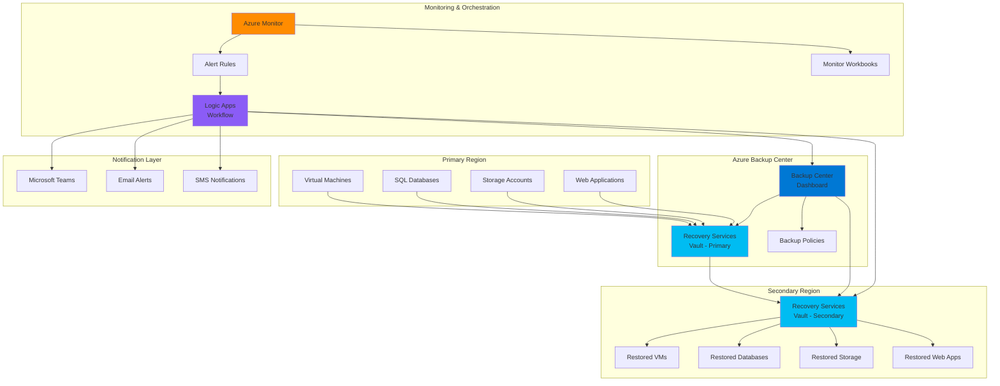

# Proactive Disaster Recovery with Backup Center Automation

## Problem

Organizations face significant challenges in maintaining business continuity during regional outages or catastrophic failures. Traditional disaster recovery approaches often rely on manual processes, lack comprehensive monitoring, and cannot automatically detect and respond to failures across multiple Azure resources. Without intelligent orchestration, recovery procedures become time-consuming, error-prone, and fail to meet critical Recovery Time Objectives (RTOs) and Recovery Point Objectives (RPOs) required for business-critical applications.

## Solution

This solution implements an intelligent disaster recovery orchestration system using Azure Backup Center for centralized backup management, Azure Recovery Services Vault for secure data protection, Azure Monitor for comprehensive failure detection, and Azure Logic Apps for automated recovery workflows. The architecture provides proactive monitoring, automated failover detection, cross-region backup restoration, and intelligent alerting to ensure minimal downtime and data loss during disaster scenarios.

## Architecture Diagram



## Prerequisites

1. Azure subscription with appropriate permissions for Backup, Recovery Services, and Logic Apps
2. Azure CLI v2.60.0 or later installed and configured (or Azure CloudShell)
3. Basic understanding of Azure disaster recovery concepts and backup strategies
4. Existing Azure resources (VMs, databases, storage) that require protection
5. Estimated cost: $200-500/month for backup storage, monitoring, and Logic Apps executions

> **Note**: This solution requires careful planning of backup retention policies and cross-region replication to balance cost and recovery requirements. Review the [Azure Backup pricing documentation](https://azure.microsoft.com/en-us/pricing/details/backup/) for detailed cost planning.

## Preparation

```bash
# Set environment variables for Azure resources
export PRIMARY_REGION="eastus"
export SECONDARY_REGION="westus2"
export RESOURCE_GROUP="rg-dr-orchestration"
export BACKUP_RESOURCE_GROUP="rg-dr-backup"
export SUBSCRIPTION_ID=$(az account show --query id --output tsv)

# Generate unique suffix for resource names
RANDOM_SUFFIX=$(openssl rand -hex 3)
echo "Using random suffix: ${RANDOM_SUFFIX}"

# Set resource names with proper Azure naming conventions
export RSV_PRIMARY_NAME="rsv-dr-primary-${RANDOM_SUFFIX}"
export RSV_SECONDARY_NAME="rsv-dr-secondary-${RANDOM_SUFFIX}"
export STORAGE_ACCOUNT_NAME="stdrbackup${RANDOM_SUFFIX}"
export LOGIC_APP_NAME="la-dr-orchestration-${RANDOM_SUFFIX}"
export MONITOR_WORKSPACE_NAME="law-dr-monitoring-${RANDOM_SUFFIX}"
export ACTION_GROUP_NAME="ag-dr-alerts-${RANDOM_SUFFIX}"

# Create primary resource group
az group create \
    --name ${RESOURCE_GROUP} \
    --location ${PRIMARY_REGION} \
    --tags purpose=disaster-recovery environment=production

# Create backup resource group
az group create \
    --name ${BACKUP_RESOURCE_GROUP} \
    --location ${PRIMARY_REGION} \
    --tags purpose=backup environment=production

echo "✅ Resource groups created successfully"
```

## Steps

1. **Create Recovery Services Vaults for Multi-Region Protection**:

   Recovery Services Vaults provide secure, scalable backup storage with built-in encryption and compliance features. Creating vaults in both primary and secondary regions enables cross-region disaster recovery capabilities with automated replication and geo-redundant storage. This dual-vault architecture ensures backup availability even during complete regional failures and supports Azure's recommended disaster recovery patterns.

   ```bash
   # Create primary Recovery Services Vault
   az backup vault create \
       --name ${RSV_PRIMARY_NAME} \
       --resource-group ${BACKUP_RESOURCE_GROUP} \
       --location ${PRIMARY_REGION} \
       --storage-model-type GeoRedundant \
       --tags environment=production purpose=backup region=primary
   
   # Create secondary Recovery Services Vault
   az backup vault create \
       --name ${RSV_SECONDARY_NAME} \
       --resource-group ${BACKUP_RESOURCE_GROUP} \
       --location ${SECONDARY_REGION} \
       --storage-model-type GeoRedundant \
       --tags environment=production purpose=backup region=secondary
   
   echo "✅ Recovery Services Vaults created in both regions"
   ```

   The Recovery Services Vaults are now configured with geo-redundant storage, ensuring backup data is replicated across Azure regions automatically. This foundational infrastructure provides the secure, compliant storage layer required for enterprise disaster recovery operations while enabling centralized management through Azure Backup Center.

2. **Set Up Log Analytics Workspace for Comprehensive Monitoring**:

   Log Analytics Workspace serves as the central repository for all monitoring data, enabling advanced querying, alerting, and visualization across your disaster recovery infrastructure. This workspace aggregates backup job logs, resource health metrics, and application performance data, providing the intelligence needed for proactive failure detection and automated recovery orchestration.

   ```bash
   # Create Log Analytics Workspace
   az monitor log-analytics workspace create \
       --workspace-name ${MONITOR_WORKSPACE_NAME} \
       --resource-group ${RESOURCE_GROUP} \
       --location ${PRIMARY_REGION} \
       --sku PerGB2018 \
       --tags purpose=monitoring environment=production
   
   # Get workspace ID for later configuration
   WORKSPACE_ID=$(az monitor log-analytics workspace show \
       --name ${MONITOR_WORKSPACE_NAME} \
       --resource-group ${RESOURCE_GROUP} \
       --query customerId --output tsv)
   
   # Enable diagnostic settings for Recovery Services Vaults
   az monitor diagnostic-settings create \
       --name "DiagnosticSettings-${RSV_PRIMARY_NAME}" \
       --resource "/subscriptions/${SUBSCRIPTION_ID}/resourceGroups/${BACKUP_RESOURCE_GROUP}/providers/Microsoft.RecoveryServices/vaults/${RSV_PRIMARY_NAME}" \
       --workspace ${WORKSPACE_ID} \
       --logs '[{"category":"AddonAzureBackupJobs","enabled":true},{"category":"AddonAzureBackupAlerts","enabled":true}]' \
       --metrics '[{"category":"Health","enabled":true}]'
   
   echo "✅ Log Analytics Workspace configured with diagnostic settings"
   ```

   The monitoring infrastructure now captures comprehensive backup and recovery metrics, enabling intelligent alerting and automated decision-making. This centralized logging approach provides visibility into backup success rates, storage consumption, and resource health across both regions, forming the foundation for intelligent disaster recovery orchestration.

3. **Create Action Groups for Multi-Channel Alerting**:

   Action Groups define how Azure Monitor alerts are delivered to your operations teams through multiple notification channels. Configuring diverse notification methods ensures critical disaster recovery alerts reach the right people through their preferred communication channels, enabling rapid response to failures and backup issues that require immediate attention.

   ```bash
   # Create Action Group for disaster recovery alerts
   az monitor action-group create \
       --name ${ACTION_GROUP_NAME} \
       --resource-group ${RESOURCE_GROUP} \
       --short-name "DR-Alerts" \
       --action email admin-email admin@company.com \
       --action sms admin-sms +1234567890 \
       --tags purpose=alerting environment=production
   
   # Add webhook action for Logic Apps integration
   az monitor action-group update \
       --name ${ACTION_GROUP_NAME} \
       --resource-group ${RESOURCE_GROUP} \
       --add-action webhook dr-webhook https://placeholder-webhook-url.com/webhook
   
   echo "✅ Action Group created with multi-channel notifications"
   ```

   The Action Group now provides comprehensive notification capabilities for disaster recovery events. This multi-channel approach ensures that critical backup failures, regional outages, and recovery operations trigger immediate notifications through email, SMS, and automated webhook integrations with downstream orchestration systems.

4. **Deploy Logic Apps for Automated Recovery Orchestration**:

   Logic Apps provides the serverless workflow engine that orchestrates intelligent disaster recovery responses. This workflow automation eliminates manual intervention during critical recovery scenarios, reducing recovery time and human error while ensuring consistent execution of complex disaster recovery procedures across multiple Azure services and regions.

   ```bash
   # Create Logic App for disaster recovery orchestration
   az logic workflow create \
       --name ${LOGIC_APP_NAME} \
       --resource-group ${RESOURCE_GROUP} \
       --location ${PRIMARY_REGION} \
       --tags purpose=orchestration environment=production
   
   # Create storage account for Logic Apps state management
   az storage account create \
       --name ${STORAGE_ACCOUNT_NAME} \
       --resource-group ${RESOURCE_GROUP} \
       --location ${PRIMARY_REGION} \
       --sku Standard_LRS \
       --kind StorageV2 \
       --tags purpose=orchestration environment=production
   
   # Get storage account connection string
   STORAGE_CONNECTION=$(az storage account show-connection-string \
       --name ${STORAGE_ACCOUNT_NAME} \
       --resource-group ${RESOURCE_GROUP} \
       --query connectionString --output tsv)
   
   echo "✅ Logic Apps infrastructure deployed successfully"
   ```

   The Logic Apps workflow environment is now ready to execute automated disaster recovery procedures. This serverless orchestration platform provides the scalability and reliability needed for complex recovery scenarios while maintaining low operational overhead and cost-effective execution based on actual usage patterns.

5. **Configure Backup Policies for Intelligent Protection**:

   Backup policies define the protection strategy for your Azure resources, including backup frequency, retention periods, and recovery point objectives. Implementing intelligent backup policies ensures optimal protection while managing storage costs and compliance requirements. These policies form the foundation of your disaster recovery strategy by defining how data is captured, stored, and made available for recovery operations.

   ```bash
   # Create backup policy for VMs with intelligent scheduling
   az backup policy create \
       --policy '{
           "name": "DRVMPolicy",
           "properties": {
               "backupManagementType": "AzureIaasVM",
               "schedulePolicy": {
                   "schedulePolicyType": "SimpleSchedulePolicy",
                   "scheduleRunFrequency": "Daily",
                   "scheduleRunTimes": ["2024-01-01T02:00:00Z"],
                   "scheduleWeeklyFrequency": 0
               },
               "retentionPolicy": {
                   "retentionPolicyType": "LongTermRetentionPolicy",
                   "dailySchedule": {
                       "retentionTimes": ["2024-01-01T02:00:00Z"],
                       "retentionDuration": {
                           "count": 30,
                           "durationType": "Days"
                       }
                   },
                   "weeklySchedule": {
                       "daysOfTheWeek": ["Sunday"],
                       "retentionTimes": ["2024-01-01T02:00:00Z"],
                       "retentionDuration": {
                           "count": 12,
                           "durationType": "Weeks"
                       }
                   }
               }
           }
       }' \
       --resource-group ${BACKUP_RESOURCE_GROUP} \
       --vault-name ${RSV_PRIMARY_NAME}
   
   # Create backup policy for SQL databases
   az backup policy create \
       --policy '{
           "name": "DRSQLPolicy",
           "properties": {
               "backupManagementType": "AzureWorkload",
               "workLoadType": "SQLDataBase",
               "schedulePolicy": {
                   "schedulePolicyType": "SimpleSchedulePolicy",
                   "scheduleRunFrequency": "Daily",
                   "scheduleRunTimes": ["2024-01-01T22:00:00Z"]
               },
               "retentionPolicy": {
                   "retentionPolicyType": "LongTermRetentionPolicy",
                   "dailySchedule": {
                       "retentionTimes": ["2024-01-01T22:00:00Z"],
                       "retentionDuration": {
                           "count": 30,
                           "durationType": "Days"
                       }
                   }
               }
           }
       }' \
       --resource-group ${BACKUP_RESOURCE_GROUP} \
       --vault-name ${RSV_PRIMARY_NAME}
   
   echo "✅ Intelligent backup policies configured for VMs and SQL databases"
   ```

   The backup policies now provide comprehensive protection with optimized scheduling and retention strategies. These policies ensure consistent data protection while balancing recovery requirements with storage costs, enabling rapid recovery operations during disaster scenarios while maintaining long-term compliance and governance standards.

6. **Set Up Azure Monitor Alert Rules for Proactive Detection**:

   Azure Monitor alert rules provide the intelligent detection capabilities that trigger automated disaster recovery responses. These rules continuously monitor backup job success rates, resource health, and regional availability, enabling proactive identification of failures before they impact business operations. This monitoring-driven approach ensures rapid detection and response to disaster scenarios.

   ```bash
   # Create alert rule for backup job failures
   az monitor metrics alert create \
       --name "BackupJobFailureAlert" \
       --resource-group ${RESOURCE_GROUP} \
       --scopes "/subscriptions/${SUBSCRIPTION_ID}/resourceGroups/${BACKUP_RESOURCE_GROUP}/providers/Microsoft.RecoveryServices/vaults/${RSV_PRIMARY_NAME}" \
       --condition "count 'Backup Health Events' > 0" \
       --description "Alert when backup jobs fail" \
       --evaluation-frequency 5m \
       --window-size 15m \
       --severity 2 \
       --action ${ACTION_GROUP_NAME} \
       --tags purpose=monitoring environment=production
   
   # Create alert rule for Recovery Services Vault health
   az monitor metrics alert create \
       --name "RecoveryVaultHealthAlert" \
       --resource-group ${RESOURCE_GROUP} \
       --scopes "/subscriptions/${SUBSCRIPTION_ID}/resourceGroups/${BACKUP_RESOURCE_GROUP}/providers/Microsoft.RecoveryServices/vaults/${RSV_PRIMARY_NAME}" \
       --condition "count 'Health' < 1" \
       --description "Alert when Recovery Services Vault becomes unhealthy" \
       --evaluation-frequency 5m \
       --window-size 15m \
       --severity 1 \
       --action ${ACTION_GROUP_NAME} \
       --tags purpose=monitoring environment=production
   
   # Create custom log query alert for backup storage consumption
   az monitor scheduled-query create \
       --name "BackupStorageConsumptionAlert" \
       --resource-group ${RESOURCE_GROUP} \
       --scopes "/subscriptions/${SUBSCRIPTION_ID}/resourceGroups/${BACKUP_RESOURCE_GROUP}/providers/Microsoft.RecoveryServices/vaults/${RSV_PRIMARY_NAME}" \
       --condition "AzureBackupReport | where TimeGenerated > ago(1h) | where StorageConsumedInMBs > 100000" \
       --description "Alert when backup storage consumption exceeds threshold" \
       --evaluation-frequency 60m \
       --window-size 60m \
       --severity 3 \
       --action ${ACTION_GROUP_NAME} \
       --tags purpose=monitoring environment=production
   
   echo "✅ Comprehensive monitoring alert rules configured"
   ```

   The alert rules now provide intelligent monitoring of backup operations, vault health, and storage utilization. This proactive monitoring system enables early detection of issues that could impact disaster recovery capabilities, ensuring that automated responses can be triggered before failures cascade into broader outages.

7. **Create Azure Monitor Workbooks for Centralized Visualization**:

   Azure Monitor Workbooks provide comprehensive visualization and reporting capabilities for disaster recovery operations. These interactive dashboards enable operations teams to monitor backup health, track recovery metrics, and analyze disaster recovery readiness across multiple regions and resource types. This centralized visibility is essential for maintaining situational awareness during both normal operations and disaster scenarios.

   ```bash
   # Create a workbook template for disaster recovery monitoring
   cat > dr-workbook-template.json << 'EOF'
   {
       "version": "Notebook/1.0",
       "items": [
           {
               "type": 1,
               "content": {
                   "json": "# Disaster Recovery Dashboard\n\nThis dashboard provides comprehensive visibility into backup operations, recovery readiness, and disaster recovery metrics across all protected resources."
               }
           },
           {
               "type": 3,
               "content": {
                   "version": "KqlItem/1.0",
                   "query": "AzureBackupReport | where TimeGenerated > ago(24h) | summarize BackupJobs = count() by BackupItemType, JobStatus | render piechart",
                   "size": 0,
                   "title": "Backup Job Status by Resource Type",
                   "queryType": 0,
                   "resourceType": "microsoft.operationalinsights/workspaces"
               }
           },
           {
               "type": 3,
               "content": {
                   "version": "KqlItem/1.0",
                   "query": "AzureBackupReport | where TimeGenerated > ago(7d) | summarize TotalStorageGB = sum(StorageConsumedInMBs)/1024 by bin(TimeGenerated, 1d) | render timechart",
                   "size": 0,
                   "title": "Storage Consumption Trend",
                   "queryType": 0,
                   "resourceType": "microsoft.operationalinsights/workspaces"
               }
           }
       ]
   }
   EOF
   
   # Deploy the workbook template
   az resource create \
       --resource-group ${RESOURCE_GROUP} \
       --resource-type "microsoft.insights/workbooks" \
       --name "disaster-recovery-dashboard" \
       --properties @dr-workbook-template.json \
       --location ${PRIMARY_REGION} \
       --tags purpose=monitoring environment=production
   
   echo "✅ Disaster Recovery monitoring workbook deployed"
   ```

   The monitoring workbook now provides comprehensive visualization of disaster recovery metrics, enabling teams to track backup success rates, storage consumption trends, and recovery readiness across all protected resources. This centralized dashboard improves operational efficiency and provides the insights needed for proactive disaster recovery management.

8. **Configure Cross-Region Replication for Secondary Vault**:

   Cross-region replication ensures that backup data is available in secondary regions during primary region failures. This configuration enables automated failover to secondary regions while maintaining data consistency and compliance requirements. Implementing cross-region replication provides the geographic redundancy essential for comprehensive disaster recovery strategies.

   ```bash
   # Enable cross-region restore for primary vault
   az backup vault backup-properties set \
       --name ${RSV_PRIMARY_NAME} \
       --resource-group ${BACKUP_RESOURCE_GROUP} \
       --cross-region-restore-flag true
   
   # Configure backup storage redundancy for geo-replication
   az backup vault backup-properties set \
       --name ${RSV_PRIMARY_NAME} \
       --resource-group ${BACKUP_RESOURCE_GROUP} \
       --backup-storage-redundancy GeoRedundant
   
   # Set up replication policy for secondary region
   az backup vault backup-properties set \
       --name ${RSV_SECONDARY_NAME} \
       --resource-group ${BACKUP_RESOURCE_GROUP} \
       --backup-storage-redundancy GeoRedundant \
       --cross-region-restore-flag true
   
   echo "✅ Cross-region replication configured for disaster recovery"
   ```

   Cross-region replication is now active, providing automatic backup data availability in secondary regions. This geographic redundancy ensures that disaster recovery operations can proceed even during complete primary region failures, maintaining business continuity and compliance with enterprise recovery requirements.

9. **Deploy Logic Apps Workflow for Automated Recovery**:

   The Logic Apps workflow orchestrates the complete disaster recovery process, from failure detection through automated recovery and stakeholder notification. This serverless workflow eliminates manual intervention during critical recovery scenarios while ensuring consistent execution of complex disaster recovery procedures across multiple Azure services and regions.

   ```bash
   # Create Logic Apps workflow definition
   cat > logic-app-workflow.json << 'EOF'
   {
       "definition": {
           "$schema": "https://schema.management.azure.com/providers/Microsoft.Logic/schemas/2016-06-01/workflowdefinition.json#",
           "actions": {
               "Check_Backup_Status": {
                   "type": "Http",
                   "inputs": {
                       "method": "GET",
                       "uri": "https://management.azure.com/subscriptions/@{variables('subscriptionId')}/resourceGroups/@{variables('resourceGroup')}/providers/Microsoft.RecoveryServices/vaults/@{variables('vaultName')}/backupJobs",
                       "authentication": {
                           "type": "ManagedServiceIdentity"
                       }
                   },
                   "runAfter": {
                       "Initialize_Variables": ["Succeeded"]
                   }
               },
               "Initialize_Variables": {
                   "type": "InitializeVariable",
                   "inputs": {
                       "variables": [
                           {
                               "name": "subscriptionId",
                               "type": "string",
                               "value": "@{triggerBody()?['data']?['context']?['subscriptionId']}"
                           },
                           {
                               "name": "resourceGroup",
                               "type": "string",
                               "value": "@{triggerBody()?['data']?['context']?['resourceGroupName']}"
                           },
                           {
                               "name": "vaultName",
                               "type": "string",
                               "value": "@{triggerBody()?['data']?['context']?['resourceName']}"
                           }
                       ]
                   },
                   "runAfter": {}
               },
               "Send_Teams_Notification": {
                   "type": "Http",
                   "inputs": {
                       "method": "POST",
                       "uri": "https://placeholder-teams-webhook.webhook.office.com/webhookb2/placeholder",
                       "body": {
                           "text": "Disaster Recovery Alert: Backup failure detected. Initiating automated recovery procedures."
                       }
                   },
                   "runAfter": {
                       "Check_Backup_Status": ["Succeeded"]
                   }
               },
               "Trigger_Cross_Region_Restore": {
                   "type": "Http",
                   "inputs": {
                       "method": "POST",
                       "uri": "https://management.azure.com/subscriptions/@{variables('subscriptionId')}/resourceGroups/@{variables('resourceGroup')}/providers/Microsoft.RecoveryServices/vaults/@{variables('vaultName')}/backupFabrics/Azure/protectionContainers/IaasVMContainer/protectedItems/VM/restore",
                       "authentication": {
                           "type": "ManagedServiceIdentity"
                       },
                       "body": {
                           "properties": {
                               "restoreType": "AlternateLocation",
                               "targetRegion": "westus2"
                           }
                       }
                   },
                   "runAfter": {
                       "Send_Teams_Notification": ["Succeeded"]
                   }
               }
           },
           "triggers": {
               "manual": {
                   "type": "Request",
                   "kind": "Http",
                   "inputs": {
                       "schema": {
                           "type": "object",
                           "properties": {
                               "data": {
                                   "type": "object"
                               }
                           }
                       }
                   }
               }
           },
           "contentVersion": "1.0.0.0",
           "outputs": {}
       }
   }
   EOF
   
   # Deploy the Logic Apps workflow
   az logic workflow create \
       --resource-group ${RESOURCE_GROUP} \
       --name ${LOGIC_APP_NAME} \
       --location ${PRIMARY_REGION} \
       --definition @logic-app-workflow.json \
       --tags purpose=orchestration environment=production
   
   # Enable managed identity for Logic Apps
   az logic workflow identity assign \
       --name ${LOGIC_APP_NAME} \
       --resource-group ${RESOURCE_GROUP}
   
   echo "✅ Logic Apps workflow deployed for automated disaster recovery"
   ```

   The Logic Apps workflow now provides automated disaster recovery orchestration with intelligent decision-making capabilities. This serverless automation ensures consistent execution of recovery procedures while providing real-time notifications and status updates to operations teams throughout the recovery process.

10. **Configure Azure Backup Center for Centralized Management**:

    Azure Backup Center provides a unified management interface for all backup and disaster recovery operations across multiple vaults, subscriptions, and regions. This centralized approach simplifies governance, monitoring, and policy management while providing comprehensive visibility into backup operations and recovery readiness across your entire Azure environment.

    ```bash
    # Configure Backup Center policies for governance
    az backup policy list \
        --resource-group ${BACKUP_RESOURCE_GROUP} \
        --vault-name ${RSV_PRIMARY_NAME} \
        --output table
    
    # Set up backup center monitoring configuration
    az backup vault show \
        --name ${RSV_PRIMARY_NAME} \
        --resource-group ${BACKUP_RESOURCE_GROUP} \
        --query '{name:name,location:location,properties:properties.upgradeDetails}'
    
    # Configure diagnostic settings for Backup Center
    az monitor diagnostic-settings create \
        --name "BackupCenterDiagnostics" \
        --resource "/subscriptions/${SUBSCRIPTION_ID}/resourceGroups/${BACKUP_RESOURCE_GROUP}/providers/Microsoft.RecoveryServices/vaults/${RSV_PRIMARY_NAME}" \
        --workspace ${WORKSPACE_ID} \
        --logs '[
            {"category":"AzureBackupReport","enabled":true},
            {"category":"AddonAzureBackupStorage","enabled":true},
            {"category":"AddonAzureBackupProtectedInstance","enabled":true}
        ]'
    
    echo "✅ Azure Backup Center configured for centralized management"
    ```

    Azure Backup Center now provides unified management and monitoring capabilities across all backup operations. This centralized approach enables efficient governance, policy enforcement, and operational oversight while providing the comprehensive visibility needed for effective disaster recovery management and compliance reporting.

## Validation & Testing

1. **Verify Recovery Services Vault Configuration**:

   ```bash
   # Check vault configuration and replication settings
   az backup vault show \
       --name ${RSV_PRIMARY_NAME} \
       --resource-group ${BACKUP_RESOURCE_GROUP} \
       --query '{name:name,location:location,properties:properties}'
   
   # Verify cross-region restore capability
   az backup vault backup-properties show \
       --name ${RSV_PRIMARY_NAME} \
       --resource-group ${BACKUP_RESOURCE_GROUP} \
       --query '{crossRegionRestoreFlag:crossRegionRestoreFlag,storageType:storageType}'
   ```

   Expected output: Cross-region restore should be enabled and storage type should be GeoRedundant.

2. **Test Monitoring and Alerting Configuration**:

   ```bash
   # Verify Log Analytics workspace configuration
   az monitor log-analytics workspace show \
       --workspace-name ${MONITOR_WORKSPACE_NAME} \
       --resource-group ${RESOURCE_GROUP} \
       --query '{name:name,location:location,sku:sku.name}'
   
   # Check alert rule configuration
   az monitor metrics alert list \
       --resource-group ${RESOURCE_GROUP} \
       --output table
   ```

   Expected output: Workspace should be active and alert rules should be enabled for backup monitoring.

3. **Validate Logic Apps Workflow Deployment**:

   ```bash
   # Check Logic Apps workflow status
   az logic workflow show \
       --name ${LOGIC_APP_NAME} \
       --resource-group ${RESOURCE_GROUP} \
       --query '{name:name,state:state,location:location}'
   
   # Verify managed identity assignment
   az logic workflow identity show \
       --name ${LOGIC_APP_NAME} \
       --resource-group ${RESOURCE_GROUP}
   ```

   Expected output: Workflow should be enabled and managed identity should be assigned.

4. **Test Backup Center Accessibility**:

   ```bash
   # Verify backup policies are accessible
   az backup policy list \
       --resource-group ${BACKUP_RESOURCE_GROUP} \
       --vault-name ${RSV_PRIMARY_NAME} \
       --output table
   
   # Check backup center reporting capabilities
   az backup vault show \
       --name ${RSV_PRIMARY_NAME} \
       --resource-group ${BACKUP_RESOURCE_GROUP} \
       --query 'properties.monitoringSettings'
   ```

   Expected output: Backup policies should be listed and monitoring settings should be configured.

## Cleanup

1. **Remove Logic Apps and Orchestration Resources**:

   ```bash
   # Delete Logic Apps workflow
   az logic workflow delete \
       --name ${LOGIC_APP_NAME} \
       --resource-group ${RESOURCE_GROUP} \
       --yes
   
   # Delete storage account
   az storage account delete \
       --name ${STORAGE_ACCOUNT_NAME} \
       --resource-group ${RESOURCE_GROUP} \
       --yes
   
   echo "✅ Logic Apps and orchestration resources removed"
   ```

2. **Remove Monitoring Infrastructure**:

   ```bash
   # Delete alert rules
   az monitor metrics alert delete \
       --name "BackupJobFailureAlert" \
       --resource-group ${RESOURCE_GROUP}
   
   az monitor metrics alert delete \
       --name "RecoveryVaultHealthAlert" \
       --resource-group ${RESOURCE_GROUP}
   
   # Delete Action Group
   az monitor action-group delete \
       --name ${ACTION_GROUP_NAME} \
       --resource-group ${RESOURCE_GROUP}
   
   # Delete Log Analytics workspace
   az monitor log-analytics workspace delete \
       --workspace-name ${MONITOR_WORKSPACE_NAME} \
       --resource-group ${RESOURCE_GROUP} \
       --yes
   
   echo "✅ Monitoring infrastructure removed"
   ```

3. **Remove Recovery Services Vaults**:

   ```bash
   # Delete secondary Recovery Services Vault
   az backup vault delete \
       --name ${RSV_SECONDARY_NAME} \
       --resource-group ${BACKUP_RESOURCE_GROUP} \
       --yes
   
   # Delete primary Recovery Services Vault
   az backup vault delete \
       --name ${RSV_PRIMARY_NAME} \
       --resource-group ${BACKUP_RESOURCE_GROUP} \
       --yes
   
   echo "✅ Recovery Services Vaults removed"
   ```

4. **Remove Resource Groups**:

   ```bash
   # Delete backup resource group
   az group delete \
       --name ${BACKUP_RESOURCE_GROUP} \
       --yes \
       --no-wait
   
   # Delete main resource group
   az group delete \
       --name ${RESOURCE_GROUP} \
       --yes \
       --no-wait
   
   echo "✅ All resource groups deletion initiated"
   echo "Note: Resource group deletion may take several minutes to complete"
   ```

## Discussion

This intelligent disaster recovery orchestration solution demonstrates Azure's comprehensive approach to business continuity and data protection. By combining Azure Backup Center's centralized management capabilities with Azure Monitor's intelligent alerting and Logic Apps' automated workflows, organizations can achieve enterprise-grade disaster recovery with minimal manual intervention. The solution addresses critical gaps in traditional disaster recovery approaches by providing proactive failure detection, automated cross-region recovery, and real-time visibility into backup operations across multiple Azure services.

The architecture leverages Azure's native integration capabilities to create a seamless disaster recovery experience. Azure Backup Center serves as the single pane of glass for backup operations, while Azure Monitor provides the intelligence needed for proactive failure detection. Logic Apps orchestrates the automated response workflows, ensuring consistent execution of recovery procedures while maintaining auditability and compliance requirements. This integration follows the [Azure Well-Architected Framework](https://docs.microsoft.com/en-us/azure/architecture/framework/) principles of reliability, security, and operational excellence.

From a cost optimization perspective, the solution utilizes Azure's consumption-based pricing models to minimize operational expenses while maintaining enterprise-grade capabilities. The geo-redundant storage configuration ensures data availability across regions while optimizing storage costs through intelligent tiering. Logic Apps' serverless execution model ensures you only pay for actual workflow executions, making the solution cost-effective for organizations of all sizes. For detailed cost planning guidance, review the [Azure Backup pricing documentation](https://azure.microsoft.com/en-us/pricing/details/backup/) and [Azure Monitor pricing](https://azure.microsoft.com/en-us/pricing/details/monitor/).

The solution's intelligent monitoring capabilities enable proactive disaster recovery management by detecting potential issues before they impact business operations. Azure Monitor's advanced analytics and machine learning capabilities provide insights into backup patterns, failure trends, and capacity planning requirements. This data-driven approach to disaster recovery management enables continuous improvement of recovery strategies and ensures alignment with evolving business requirements and compliance standards.

> **Tip**: Implement regular disaster recovery testing using Azure's built-in testing capabilities to validate recovery procedures and identify potential improvements. The [Azure Site Recovery testing documentation](https://docs.microsoft.com/en-us/azure/site-recovery/site-recovery-test-failover-to-azure) provides comprehensive guidance for conducting non-disruptive disaster recovery tests.

## Challenge

Extend this disaster recovery orchestration solution by implementing these advanced capabilities:

1. **Implement AI-Powered Failure Prediction**: Integrate Azure Machine Learning to analyze backup patterns and predict potential failures before they occur, enabling proactive intervention and optimization of backup strategies.

2. **Add Multi-Cloud Disaster Recovery**: Extend the solution to include disaster recovery capabilities across multiple cloud providers using Azure Arc and hybrid connectivity options for comprehensive business continuity.

3. **Implement Automated Recovery Testing**: Create automated disaster recovery testing workflows that regularly validate recovery procedures and generate compliance reports for audit requirements.

4. **Add Advanced Cost Optimization**: Implement intelligent backup lifecycle management with automated tier transitions and retention policy optimization based on access patterns and compliance requirements.

5. **Create Custom Recovery Orchestration**: Develop application-specific recovery workflows that understand dependencies between services and orchestrate recovery in the optimal sequence for complex, multi-tier applications.

## Infrastructure Code

*Infrastructure code will be generated after recipe approval.*