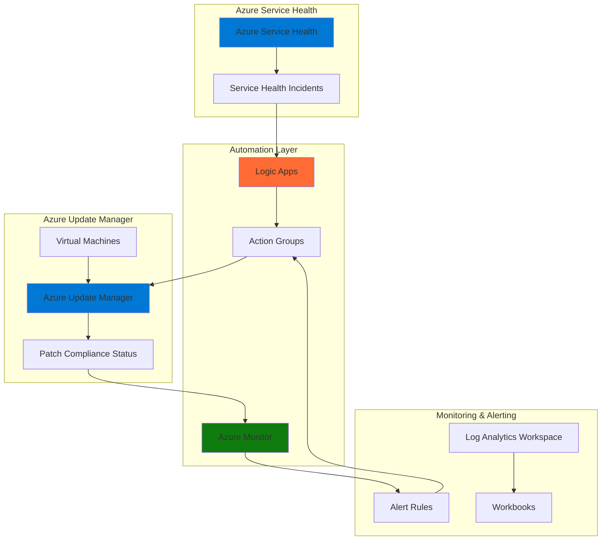

# Proactive Infrastructure Health Monitoring with Azure Service Health and Azure Update Manager

## Problem

Enterprise IT teams struggle with reactive incident response when Azure service health issues correlate with outdated infrastructure patches, leading to cascading failures and extended downtime. Traditional monitoring approaches lack the intelligence to correlate service health incidents with infrastructure update status, resulting in unexpected service disruptions that could have been prevented through proactive patch management and automated remediation workflows.

## Solution

This solution creates an intelligent monitoring system that combines Azure Service Health incident tracking with Azure Update Manager's patch status visibility to trigger automated remediation workflows. By integrating these services with Azure Logic Apps and Azure Monitor, organizations can proactively identify potential infrastructure risks and automatically initiate patching or maintenance procedures before service disruptions occur.

## Architecture Diagram



## Prerequisites

1. Azure subscription with appropriate permissions for Service Health, Update Manager, and Logic Apps
2. Azure CLI v2.48.0 or later installed and configured (or Azure CloudShell)
3. Azure Resource Manager roles: Contributor or Owner for resource group management
4. At least one Azure virtual machine for monitoring and patch management
5. Estimated cost: $50-150/month for Logic Apps, Monitor alerts, and Update Manager operations

> **Note**: This solution requires virtual machines to be Arc-enabled for on-premises resources or native Azure VMs for cloud-based infrastructure monitoring.

## Preparation

```bash
# Set environment variables for Azure resources
export RESOURCE_GROUP="rg-health-monitoring-${RANDOM_SUFFIX}"
export LOCATION="eastus"
export SUBSCRIPTION_ID=$(az account show --query id --output tsv)

# Generate unique suffix for resource names
RANDOM_SUFFIX=$(openssl rand -hex 3)

# Create resource group
az group create \
    --name ${RESOURCE_GROUP} \
    --location ${LOCATION} \
    --tags purpose=health-monitoring environment=production

echo "✅ Resource group created: ${RESOURCE_GROUP}"

# Create Log Analytics workspace for centralized monitoring
WORKSPACE_NAME="law-health-monitoring-${RANDOM_SUFFIX}"
az monitor log-analytics workspace create \
    --resource-group ${RESOURCE_GROUP} \
    --workspace-name ${WORKSPACE_NAME} \
    --location ${LOCATION} \
    --sku PerGB2018

echo "✅ Log Analytics workspace created: ${WORKSPACE_NAME}"

# Get workspace ID for later use
WORKSPACE_ID=$(az monitor log-analytics workspace show \
    --resource-group ${RESOURCE_GROUP} \
    --workspace-name ${WORKSPACE_NAME} \
    --query customerId --output tsv)

echo "Workspace ID: ${WORKSPACE_ID}"
```

## Steps

1. **Create Azure Service Health Alert Rule**:

   Azure Service Health provides personalized alerts about Azure service issues that affect your specific resources and regions. By creating targeted alert rules, you can receive notifications only for incidents that impact your infrastructure, enabling proactive response to potential service disruptions. This foundational step ensures your monitoring system captures all relevant service health events that could affect your infrastructure.

   ```bash
   # Create action group for Service Health alerts
   ACTION_GROUP_NAME="ag-service-health-${RANDOM_SUFFIX}"
   az monitor action-group create \
       --name ${ACTION_GROUP_NAME} \
       --resource-group ${RESOURCE_GROUP} \
       --short-name "SvcHealth" \
       --action email admin admin@company.com \
       --action webhook health-webhook \
       https://your-logic-app-url.com/trigger
   
   echo "✅ Action group created: ${ACTION_GROUP_NAME}"
   
   # Create Service Health alert rule
   az monitor activity-log alert create \
       --name "Service Health Issues" \
       --resource-group ${RESOURCE_GROUP} \
       --condition category=ServiceHealth \
       --action-group ${ACTION_GROUP_NAME} \
       --description "Alert for Azure Service Health incidents"
   
   echo "✅ Service Health alert rule created"
   ```

   The Service Health alert rule is now configured to monitor all service health incidents affecting your subscription. This creates the foundation for correlating service issues with infrastructure health, enabling automated response workflows when Azure service problems might impact your resources.

2. **Configure Azure Update Manager Assessment**:

   Azure Update Manager provides unified patch management across your Azure and hybrid infrastructure. Enabling periodic assessment ensures your monitoring system has real-time visibility into patch compliance status, which is crucial for correlating service health incidents with potentially vulnerable infrastructure that requires immediate attention.

   ```bash
   # Enable Update Manager periodic assessment policy
   az policy assignment create \
       --name "Enable-UpdateManager-Assessment" \
       --policy "/providers/Microsoft.Authorization/policyDefinitions/59efceea-0c96-497e-a4a1-4eb2290dac15" \
       --scope "/subscriptions/${SUBSCRIPTION_ID}/resourceGroups/${RESOURCE_GROUP}" \
       --params '{
           "assessmentMode": {"value": "AutomaticByPlatform"},
           "assessmentSchedule": {"value": "Daily"}
       }'
   
   echo "✅ Update Manager assessment policy enabled"
   
   # Create update management schedule for critical patches
   SCHEDULE_NAME="critical-patches-${RANDOM_SUFFIX}"
   az maintenance configuration create \
       --name ${SCHEDULE_NAME} \
       --resource-group ${RESOURCE_GROUP} \
       --location ${LOCATION} \
       --maintenance-scope InGuestPatch \
       --reboot-setting IfRequired \
       --start-date-time "2025-01-15 02:00" \
       --duration "04:00" \
       --recur-every "1 Week"
   
   echo "✅ Maintenance schedule created: ${SCHEDULE_NAME}"
   ```

   The Update Manager assessment policy is now active, providing continuous visibility into patch compliance across your infrastructure. This automated assessment creates the data foundation needed for intelligent correlation between service health incidents and infrastructure vulnerabilities.

3. **Create Logic App for Automated Correlation**:

   Azure Logic Apps enables serverless workflow automation that can intelligently correlate Service Health incidents with Update Manager patch status. This automation layer processes service health alerts, queries infrastructure patch compliance, and triggers appropriate remediation actions based on predefined business logic and risk assessment criteria.

   ```bash
   # Create Logic App for workflow automation
   LOGIC_APP_NAME="la-health-correlation-${RANDOM_SUFFIX}"
   az logic workflow create \
       --name ${LOGIC_APP_NAME} \
       --resource-group ${RESOURCE_GROUP} \
       --location ${LOCATION} \
       --definition '{
           "$schema": "https://schema.management.azure.com/schemas/2016-06-01/workflowdefinition.json#",
           "contentVersion": "1.0.0.0",
           "parameters": {},
           "triggers": {
               "service_health_webhook": {
                   "type": "Request",
                   "kind": "Http",
                   "inputs": {
                       "schema": {
                           "type": "object",
                           "properties": {
                               "schemaId": {"type": "string"},
                               "data": {"type": "object"}
                           }
                       }
                   }
               }
           },
           "actions": {
               "parse_service_health": {
                   "type": "ParseJson",
                   "inputs": {
                       "content": "@triggerBody()",
                       "schema": {
                           "type": "object",
                           "properties": {
                               "schemaId": {"type": "string"},
                               "data": {"type": "object"}
                           }
                       }
                   }
               }
           }
       }'
   
   echo "✅ Logic App created: ${LOGIC_APP_NAME}"
   
   # Get Logic App trigger URL
   TRIGGER_URL=$(az logic workflow show \
       --name ${LOGIC_APP_NAME} \
       --resource-group ${RESOURCE_GROUP} \
       --query accessEndpoint --output tsv)
   
   echo "Logic App trigger URL: ${TRIGGER_URL}"
   ```

   The Logic App workflow is now ready to receive Service Health webhooks and process correlation logic. This serverless automation foundation enables intelligent decision-making that connects service health incidents with infrastructure patch status for proactive remediation.

4. **Configure Azure Monitor Alert Rules for Patch Compliance**:

   Azure Monitor provides comprehensive observability into your infrastructure health and patch compliance status. Creating specific alert rules for critical patch compliance violations ensures your monitoring system can automatically identify infrastructure at risk during service health incidents, enabling targeted remediation actions.

   ```bash
   # Create alert rule for critical patch compliance
   az monitor scheduled-query create \
       --name "Critical-Patch-Compliance-Alert" \
       --resource-group ${RESOURCE_GROUP} \
       --scopes "/subscriptions/${SUBSCRIPTION_ID}/resourceGroups/${RESOURCE_GROUP}" \
       --condition "count 'UpdateSummary | where Classification == \"Critical Updates\" and Computer != \"\" and UpdateState == \"Needed\" | distinct Computer' > 0" \
       --condition-query "UpdateSummary | where Classification == 'Critical Updates' and Computer != '' and UpdateState == 'Needed' | distinct Computer" \
       --description "Alert when VMs have critical patches missing" \
       --evaluation-frequency "PT15M" \
       --window-size "PT15M" \
       --severity 2 \
       --action-groups ${ACTION_GROUP_NAME}
   
   echo "✅ Critical patch compliance alert created"
   
   # Create alert rule for update installation failures
   az monitor scheduled-query create \
       --name "Update-Installation-Failures" \
       --resource-group ${RESOURCE_GROUP} \
       --scopes "/subscriptions/${SUBSCRIPTION_ID}/resourceGroups/${RESOURCE_GROUP}" \
       --condition "count 'UpdateRunProgress | where InstallationStatus == \"Failed\" | distinct Computer' > 0" \
       --condition-query "UpdateRunProgress | where InstallationStatus == 'Failed' | distinct Computer" \
       --description "Alert when update installations fail" \
       --evaluation-frequency "PT5M" \
       --window-size "PT5M" \
       --severity 1 \
       --action-groups ${ACTION_GROUP_NAME}
   
   echo "✅ Update installation failure alert created"
   ```

   The Azure Monitor alert rules are now actively monitoring patch compliance and installation status. These intelligent alerts create the observability layer needed to automatically detect infrastructure vulnerabilities that require immediate attention during service health incidents.

5. **Create Automated Remediation Workflow**:

   Automated remediation workflows enable your infrastructure to self-heal during service health incidents by automatically triggering patch installation, service restarts, or other corrective actions. This proactive approach minimizes service disruption by addressing potential infrastructure issues before they cause cascading failures.

   ```bash
   # Create Azure Automation Account for remediation actions
   AUTOMATION_ACCOUNT="aa-health-remediation-${RANDOM_SUFFIX}"
   az automation account create \
       --name ${AUTOMATION_ACCOUNT} \
       --resource-group ${RESOURCE_GROUP} \
       --location ${LOCATION} \
       --sku Basic
   
   echo "✅ Automation Account created: ${AUTOMATION_ACCOUNT}"
   
   # Create remediation runbook
   RUNBOOK_NAME="Remediate-Critical-Patches"
   az automation runbook create \
       --automation-account-name ${AUTOMATION_ACCOUNT} \
       --resource-group ${RESOURCE_GROUP} \
       --name ${RUNBOOK_NAME} \
       --type PowerShell \
       --description "Automated remediation for critical patch issues"
   
   echo "✅ Remediation runbook created: ${RUNBOOK_NAME}"
   
   # Create webhook for automated triggering
   WEBHOOK_NAME="health-remediation-webhook"
   az automation webhook create \
       --automation-account-name ${AUTOMATION_ACCOUNT} \
       --resource-group ${RESOURCE_GROUP} \
       --name ${WEBHOOK_NAME} \
       --runbook-name ${RUNBOOK_NAME} \
       --expiry-time "2026-01-01T00:00:00Z"
   
   echo "✅ Remediation webhook created: ${WEBHOOK_NAME}"
   ```

   The automated remediation infrastructure is now operational, providing the capability to automatically respond to service health incidents by triggering appropriate maintenance actions. This self-healing architecture reduces manual intervention and minimizes potential service disruptions.

6. **Configure Health Monitoring Dashboard**:

   A comprehensive monitoring dashboard provides real-time visibility into service health status, patch compliance, and automated remediation activities. This centralized view enables IT teams to monitor the effectiveness of proactive health monitoring and quickly identify any infrastructure requiring manual intervention.

   ```bash
   # Create monitoring workbook for health dashboard
   WORKBOOK_NAME="health-monitoring-dashboard-${RANDOM_SUFFIX}"
   az monitor app-insights workbook create \
       --name ${WORKBOOK_NAME} \
       --resource-group ${RESOURCE_GROUP} \
       --location ${LOCATION} \
       --display-name "Infrastructure Health Monitoring" \
       --description "Comprehensive dashboard for service health and patch compliance" \
       --category "health-monitoring" \
       --serialized-data '{
           "version": "Notebook/1.0",
           "items": [
               {
                   "type": 3,
                   "content": {
                       "version": "KqlItem/1.0",
                       "query": "ServiceHealthResources | where type == \"microsoft.resourcehealth/events\" | summarize count() by tostring(properties.eventType)",
                       "size": 0,
                       "title": "Service Health Events Summary"
                   }
               },
               {
                   "type": 3,
                   "content": {
                       "version": "KqlItem/1.0",
                       "query": "UpdateSummary | where Classification == \"Critical Updates\" | summarize count() by UpdateState",
                       "size": 0,
                       "title": "Critical Patch Compliance Status"
                   }
               }
           ]
       }'
   
   echo "✅ Health monitoring dashboard created: ${WORKBOOK_NAME}"
   
   # Create custom metric alert for monitoring automation effectiveness
   az monitor metrics alert create \
       --name "Automation-Effectiveness-Metric" \
       --resource-group ${RESOURCE_GROUP} \
       --scopes "/subscriptions/${SUBSCRIPTION_ID}/resourceGroups/${RESOURCE_GROUP}" \
       --condition "avg customMetrics/AutomationSuccessRate < 90" \
       --description "Alert when automation success rate drops below 90%" \
       --evaluation-frequency "PT5M" \
       --window-size "PT15M" \
       --severity 3 \
       --action-groups ${ACTION_GROUP_NAME}
   
   echo "✅ Automation effectiveness monitoring configured"
   ```

   The health monitoring dashboard provides comprehensive visibility into your proactive monitoring system's performance. This centralized observability enables continuous improvement of automation effectiveness and ensures your infrastructure maintains optimal health and compliance.

## Validation & Testing

1. **Verify Service Health Alert Configuration**:

   ```bash
   # Check Service Health alert rule status
   az monitor activity-log alert show \
       --name "Service Health Issues" \
       --resource-group ${RESOURCE_GROUP} \
       --output table
   
   # Verify action group configuration
   az monitor action-group show \
       --name ${ACTION_GROUP_NAME} \
       --resource-group ${RESOURCE_GROUP} \
       --query "emailReceivers[0].emailAddress" \
       --output tsv
   ```

   Expected output: Alert rule should show "Enabled" status and action group should display configured email address.

2. **Test Update Manager Assessment**:

   ```bash
   # Check Update Manager policy assignment
   az policy assignment show \
       --name "Enable-UpdateManager-Assessment" \
       --scope "/subscriptions/${SUBSCRIPTION_ID}/resourceGroups/${RESOURCE_GROUP}" \
       --output table
   
   # Verify maintenance schedule
   az maintenance configuration show \
       --name ${SCHEDULE_NAME} \
       --resource-group ${RESOURCE_GROUP} \
       --query "maintenanceScope" \
       --output tsv
   ```

   Expected output: Policy should show "Assigned" status and maintenance scope should display "InGuestPatch".

3. **Validate Logic App Workflow**:

   ```bash
   # Test Logic App trigger endpoint
   curl -X POST "${TRIGGER_URL}" \
       -H "Content-Type: application/json" \
       -d '{
           "schemaId": "Microsoft.Insights/activityLogs", 
           "data": {
               "status": "Active",
               "context": {
                   "activityLog": {
                       "eventSource": "ServiceHealth"
                   }
               }
           }
       }'
   
   # Check workflow run history
   az logic workflow run list \
       --name ${LOGIC_APP_NAME} \
       --resource-group ${RESOURCE_GROUP} \
       --output table
   ```

   Expected output: HTTP 200 response and workflow run history should show successful execution.

4. **Test Automated Remediation**:

   ```bash
   # Verify automation account status
   az automation account show \
       --name ${AUTOMATION_ACCOUNT} \
       --resource-group ${RESOURCE_GROUP} \
       --query "state" \
       --output tsv
   
   # Check runbook availability
   az automation runbook show \
       --automation-account-name ${AUTOMATION_ACCOUNT} \
       --resource-group ${RESOURCE_GROUP} \
       --name ${RUNBOOK_NAME} \
       --query "state" \
       --output tsv
   ```

   Expected output: Automation account should show "Ok" status and runbook should display "Published" state.

## Cleanup

1. **Remove monitoring and alerting resources**:

   ```bash
   # Delete alert rules
   az monitor scheduled-query delete \
       --name "Critical-Patch-Compliance-Alert" \
       --resource-group ${RESOURCE_GROUP} \
       --yes
   
   az monitor scheduled-query delete \
       --name "Update-Installation-Failures" \
       --resource-group ${RESOURCE_GROUP} \
       --yes
   
   echo "✅ Alert rules deleted"
   ```

2. **Remove automation resources**:

   ```bash
   # Delete automation account
   az automation account delete \
       --name ${AUTOMATION_ACCOUNT} \
       --resource-group ${RESOURCE_GROUP} \
       --yes
   
   # Delete Logic App
   az logic workflow delete \
       --name ${LOGIC_APP_NAME} \
       --resource-group ${RESOURCE_GROUP} \
       --yes
   
   echo "✅ Automation resources deleted"
   ```

3. **Remove monitoring infrastructure**:

   ```bash
   # Delete workbook
   az monitor app-insights workbook delete \
       --name ${WORKBOOK_NAME} \
       --resource-group ${RESOURCE_GROUP} \
       --yes
   
   # Delete Log Analytics workspace
   az monitor log-analytics workspace delete \
       --resource-group ${RESOURCE_GROUP} \
       --workspace-name ${WORKSPACE_NAME} \
       --yes
   
   echo "✅ Monitoring infrastructure deleted"
   ```

4. **Remove resource group and all remaining resources**:

   ```bash
   # Delete resource group and all contained resources
   az group delete \
       --name ${RESOURCE_GROUP} \
       --yes \
       --no-wait
   
   echo "✅ Resource group deletion initiated: ${RESOURCE_GROUP}"
   echo "Note: Deletion may take several minutes to complete"
   
   # Verify deletion (optional)
   az group exists --name ${RESOURCE_GROUP}
   ```

## Discussion

Azure Service Health and Azure Update Manager form a powerful combination for proactive infrastructure health monitoring that goes beyond traditional reactive approaches. This integrated solution enables organizations to correlate service health incidents with infrastructure patch status, creating intelligent automation that can prevent cascading failures before they impact business operations. The [Azure Service Health documentation](https://docs.microsoft.com/en-us/azure/service-health/overview) provides comprehensive guidance on configuring personalized health alerts, while [Azure Update Manager documentation](https://docs.microsoft.com/en-us/azure/update-manager/overview) details the unified patch management capabilities across hybrid infrastructure.

The event-driven architecture leverages Azure Logic Apps to create sophisticated correlation logic that can automatically trigger remediation workflows based on the severity and scope of service health incidents. This proactive approach follows the [Azure Well-Architected Framework reliability principles](https://docs.microsoft.com/en-us/azure/architecture/framework/reliability/) by implementing self-healing capabilities and reducing manual intervention during critical incidents. The integration with Azure Monitor provides comprehensive observability that enables continuous improvement of automation effectiveness and infrastructure resilience.

From an operational perspective, this solution transforms infrastructure management from reactive troubleshooting to proactive risk mitigation. By automatically correlating service health events with patch compliance status, IT teams can prioritize remediation efforts based on actual risk levels rather than generic maintenance schedules. The [Azure Monitor best practices documentation](https://docs.microsoft.com/en-us/azure/azure-monitor/platform/alerts-best-practices) provides additional guidance on optimizing alert configurations and reducing notification fatigue while maintaining comprehensive coverage.

> **Tip**: Configure alert rule thresholds based on your organization's risk tolerance and maintenance windows. Use Azure Monitor's smart groups feature to reduce alert fatigue by correlating related incidents and providing contextual information for more efficient troubleshooting.

## Challenge

Extend this solution by implementing these advanced capabilities:

1. **Machine Learning Integration**: Implement Azure Machine Learning models to predict potential service health incidents based on historical patterns and infrastructure telemetry, enabling even more proactive remediation.

2. **Multi-Cloud Correlation**: Extend the monitoring system to correlate Azure Service Health with AWS Health Dashboard and Google Cloud Status, providing unified visibility across hybrid cloud environments.

3. **Automated Risk Assessment**: Create intelligent risk scoring algorithms that consider business impact, infrastructure criticality, and patch complexity to prioritize remediation efforts automatically.

4. **Compliance Reporting**: Build automated compliance reporting that demonstrates proactive infrastructure health management for regulatory requirements and audit purposes.

5. **Predictive Maintenance**: Implement predictive maintenance workflows that use Azure Digital Twins to model infrastructure dependencies and predict potential failure scenarios based on service health patterns.

## Infrastructure Code

### Available Infrastructure as Code:

- [Infrastructure Code Overview](code/README.md) - Detailed description of all infrastructure components
- [Bicep](code/bicep/) - Azure Bicep templates
- [Bash CLI Scripts](code/scripts/) - Example bash scripts using Azure CLI commands to deploy infrastructure
- [Terraform](code/terraform/) - Terraform configuration files