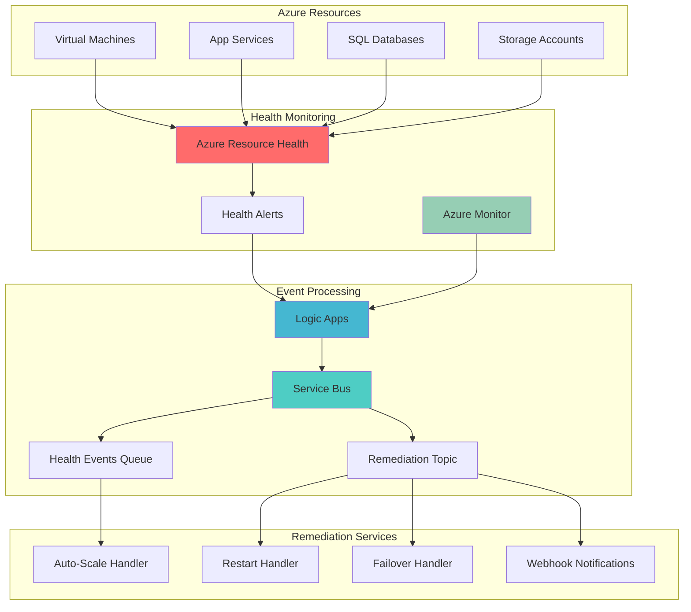

# Proactive Infrastructure Health Monitoring Service Health Update Manager

## Problem

Organizations struggle with reactive incident response when Azure resources experience health issues, leading to prolonged downtime and poor user experiences. Traditional monitoring solutions often miss critical resource health transitions, and manual remediation processes delay recovery times, resulting in SLA violations and decreased customer satisfaction.

## Solution

Build an intelligent proactive monitoring system that automatically detects Azure resource health changes using Azure Resource Health APIs and orchestrates automated remediation workflows through Azure Service Bus messaging patterns. This solution enables real-time health event processing, automated incident response, and seamless integration with existing microservices architectures for comprehensive application health management.

## Architecture Diagram



## Prerequisites

1. Azure subscription with appropriate permissions for creating Resource Health alerts, Service Bus namespaces, and Logic Apps
2. Azure CLI v2.50.0 or higher installed and configured (or Azure CloudShell)
3. Understanding of Azure messaging patterns and event-driven architectures
4. Basic knowledge of Azure Resource Health concepts and service health monitoring
5. Estimated cost: $50-100/month for Service Bus, Logic Apps, and monitoring resources

> **Note**: This solution leverages Azure's native event-driven architecture patterns. Review the [Azure Well-Architected Framework](https://docs.microsoft.com/en-us/azure/architecture/framework/) for additional guidance on building resilient monitoring systems.

## Preparation

```bash
# Set environment variables for Azure resources
export RESOURCE_GROUP="rg-health-monitoring-$(openssl rand -hex 3)"
export LOCATION="eastus"
export SUBSCRIPTION_ID=$(az account show --query id --output tsv)

# Generate unique suffix for resource names
RANDOM_SUFFIX=$(openssl rand -hex 3)

# Service Bus configuration
export SERVICE_BUS_NAMESPACE="sb-health-monitoring-${RANDOM_SUFFIX}"
export HEALTH_QUEUE_NAME="health-events"
export REMEDIATION_TOPIC_NAME="remediation-actions"

# Logic Apps configuration
export LOGIC_APP_NAME="la-health-orchestrator-${RANDOM_SUFFIX}"

# Monitoring configuration
export LOG_ANALYTICS_WORKSPACE="log-health-monitoring-${RANDOM_SUFFIX}"
export ACTION_GROUP_NAME="ag-health-alerts-${RANDOM_SUFFIX}"

# Create resource group
az group create \
    --name ${RESOURCE_GROUP} \
    --location ${LOCATION} \
    --tags purpose=health-monitoring environment=demo

echo "✅ Resource group created: ${RESOURCE_GROUP}"
```

## Steps

1. **Create Service Bus Namespace with Health Event Processing**:

   Azure Service Bus provides reliable, enterprise-grade messaging infrastructure that enables decoupled communication between health monitoring components and remediation services. The namespace serves as the central message broker for all health events, supporting both queue-based point-to-point messaging for specific handlers and topic-based publish-subscribe patterns for broadcast scenarios.

   ```bash
   # Create Service Bus namespace with Standard tier for production features
   az servicebus namespace create \
       --name ${SERVICE_BUS_NAMESPACE} \
       --resource-group ${RESOURCE_GROUP} \
       --location ${LOCATION} \
       --sku Standard \
       --tags purpose=health-monitoring

   # Get Service Bus connection string for later use
   export SERVICE_BUS_CONNECTION=$(az servicebus namespace \
       authorization-rule keys list \
       --namespace-name ${SERVICE_BUS_NAMESPACE} \
       --resource-group ${RESOURCE_GROUP} \
       --name RootManageSharedAccessKey \
       --query primaryConnectionString --output tsv)

   echo "✅ Service Bus namespace created with connection string configured"
   ```

   The Service Bus namespace now provides the messaging backbone for your health monitoring system. This enterprise-grade messaging service ensures reliable delivery of health events even during high-load scenarios and supports advanced features like message deduplication, dead letter queues, and session-based processing.

2. **Configure Health Events Queue and Remediation Topic**:

   Message queues provide guaranteed delivery for critical health events, while topics enable fan-out messaging patterns for triggering multiple remediation actions simultaneously. This dual-pattern approach ensures both reliability and scalability for complex health monitoring scenarios.

   ```bash
   # Create queue for health events with duplicate detection
   az servicebus queue create \
       --namespace-name ${SERVICE_BUS_NAMESPACE} \
       --resource-group ${RESOURCE_GROUP} \
       --name ${HEALTH_QUEUE_NAME} \
       --max-size 2048 \
       --enable-duplicate-detection true \
       --duplicate-detection-history-time-window PT10M

   # Create topic for remediation actions
   az servicebus topic create \
       --namespace-name ${SERVICE_BUS_NAMESPACE} \
       --resource-group ${RESOURCE_GROUP} \
       --name ${REMEDIATION_TOPIC_NAME} \
       --max-size 2048 \
       --enable-duplicate-detection true

   # Create subscriptions for different remediation handlers
   az servicebus topic subscription create \
       --namespace-name ${SERVICE_BUS_NAMESPACE} \
       --resource-group ${RESOURCE_GROUP} \
       --topic-name ${REMEDIATION_TOPIC_NAME} \
       --name auto-scale-handler \
       --max-delivery-count 3

   az servicebus topic subscription create \
       --namespace-name ${SERVICE_BUS_NAMESPACE} \
       --resource-group ${RESOURCE_GROUP} \
       --topic-name ${REMEDIATION_TOPIC_NAME} \
       --name restart-handler \
       --max-delivery-count 3

   echo "✅ Service Bus messaging topology configured"
   ```

   The messaging topology is now established with dedicated pathways for health events and remediation actions. The duplicate detection feature prevents processing the same health event multiple times, while the subscription model enables specialized handlers to process only relevant remediation actions.

3. **Create Log Analytics Workspace for Monitoring**:

   Azure Monitor Log Analytics provides centralized logging and querying capabilities for health monitoring data. This workspace serves as the foundation for advanced analytics, alerting, and dashboard creation, enabling comprehensive visibility into resource health patterns and system performance.

   ```bash
   # Create Log Analytics workspace
   az monitor log-analytics workspace create \
       --workspace-name ${LOG_ANALYTICS_WORKSPACE} \
       --resource-group ${RESOURCE_GROUP} \
       --location ${LOCATION} \
       --tags purpose=health-monitoring

   # Get workspace ID for later configuration
   export WORKSPACE_ID=$(az monitor log-analytics workspace show \
       --workspace-name ${LOG_ANALYTICS_WORKSPACE} \
       --resource-group ${RESOURCE_GROUP} \
       --query customerId --output tsv)

   echo "✅ Log Analytics workspace created: ${LOG_ANALYTICS_WORKSPACE}"
   ```

   The Log Analytics workspace provides the analytics foundation for your health monitoring system, enabling complex queries, custom dashboards, and advanced correlation analysis across all health events and remediation actions.

4. **Deploy Logic Apps for Health Event Orchestration**:

   Azure Logic Apps serves as the orchestration engine that connects Resource Health events with Service Bus messaging patterns. This serverless workflow service automatically processes health alerts, enriches event data, and routes messages to appropriate remediation handlers based on configurable business rules.

   ```bash
   # Create a Standard Logic App with required configuration
   az logicapp create \
       --name ${LOGIC_APP_NAME} \
       --resource-group ${RESOURCE_GROUP} \
       --plan ${LOGIC_APP_NAME} \
       --location ${LOCATION} \
       --sku WS1 \
       --functions-version 4 \
       --runtime dotnet-isolated

   # Create Logic App workflow definition file
   cat > workflow_definition.json << 'EOF'
{
  "$schema": "https://schema.management.azure.com/providers/Microsoft.Logic/schemas/2016-06-01/workflowdefinition.json#",
  "contentVersion": "1.0.0.0",
  "parameters": {
    "$connections": {
      "defaultValue": {},
      "type": "Object"
    }
  },
  "triggers": {
    "manual": {
      "type": "Request",
      "kind": "Http",
      "inputs": {
        "schema": {
          "type": "object",
          "properties": {
            "resourceId": {"type": "string"},
            "status": {"type": "string"},
            "eventTime": {"type": "string"},
            "resourceType": {"type": "string"}
          }
        }
      }
    }
  },
  "actions": {
    "Log_Health_Event": {
      "type": "Compose",
      "inputs": {
        "message": "Processing health event for @{triggerBody()?['resourceId']}",
        "status": "@{triggerBody()?['status']}",
        "timestamp": "@{utcNow()}"
      }
    },
    "Determine_Action": {
      "type": "Switch",
      "expression": "@triggerBody()?['status']",
      "cases": {
        "Unavailable": {
          "case": "Unavailable",
          "actions": {
            "Log_Unavailable": {
              "type": "Compose",
              "inputs": {
                "action": "restart",
                "resourceId": "@{triggerBody()?['resourceId']}",
                "reason": "Resource is unavailable"
              }
            }
          }
        },
        "Degraded": {
          "case": "Degraded",
          "actions": {
            "Log_Degraded": {
              "type": "Compose",
              "inputs": {
                "action": "scale",
                "resourceId": "@{triggerBody()?['resourceId']}",
                "reason": "Resource performance is degraded"
              }
            }
          }
        }
      },
      "default": {
        "actions": {
          "Log_Default": {
            "type": "Compose",
            "inputs": {
              "action": "monitor",
              "resourceId": "@{triggerBody()?['resourceId']}",
              "reason": "Resource status requires monitoring"
            }
          }
        }
      },
      "runAfter": {
        "Log_Health_Event": [
          "Succeeded"
        ]
      }
    }
  }
}
EOF

   # Deploy the workflow to the Logic App
   az logicapp deployment source config-zip \
       --name ${LOGIC_APP_NAME} \
       --resource-group ${RESOURCE_GROUP} \
       --src workflow_definition.json

   echo "✅ Logic Apps workflow created for health event orchestration"
   ```

   The Logic Apps workflow now provides intelligent event processing that automatically routes health events to appropriate remediation channels. This serverless orchestration ensures consistent processing of health events while maintaining flexibility for complex business rules and decision logic.

5. **Create Action Group for Resource Health Alerts**:

   Azure Action Groups provide the notification infrastructure that connects Resource Health events to your Logic Apps workflow. This component enables automated triggering of remediation workflows when resource health changes occur, ensuring immediate response to critical health events.

   ```bash
   # Get Logic App callback URL
   export LOGIC_APP_CALLBACK_URL=$(az logicapp show \
       --name ${LOGIC_APP_NAME} \
       --resource-group ${RESOURCE_GROUP} \
       --query defaultHostName --output tsv | \
       sed 's/^/https:\/\//' | sed 's/$/\/api\/manual\/paths\/invoke?api-version=2022-05-01&sp=%2Ftriggers%2Fmanual%2Frun&sv=1.0/')

   # Create Action Group with Logic App webhook
   az monitor action-group create \
       --name ${ACTION_GROUP_NAME} \
       --resource-group ${RESOURCE_GROUP} \
       --short-name "HealthAlert" \
       --action webhook healthWebhook "${LOGIC_APP_CALLBACK_URL}"

   echo "✅ Action Group created with Logic App integration"
   ```

   The Action Group establishes the critical link between Azure Resource Health events and your orchestration workflow, enabling automated response to health changes across your Azure environment.

6. **Configure Resource Health Alerts for Critical Resources**:

   Resource Health alerts provide proactive notification when Azure resources experience health issues. These alerts monitor specific resources or resource types and trigger automated remediation workflows through the configured Action Group, enabling immediate response to health degradation.

   ```bash
   # Create a sample VM to monitor (for demonstration)
   az vm create \
       --name "vm-health-demo-${RANDOM_SUFFIX}" \
       --resource-group ${RESOURCE_GROUP} \
       --image Ubuntu2204 \
       --admin-username azureuser \
       --generate-ssh-keys \
       --size Standard_B1s \
       --tags purpose=health-monitoring-demo

   # Get VM resource ID
   VM_RESOURCE_ID=$(az vm show \
       --name "vm-health-demo-${RANDOM_SUFFIX}" \
       --resource-group ${RESOURCE_GROUP} \
       --query id --output tsv)

   # Create Resource Health alert for the VM
   az monitor activity-log alert create \
       --name "vm-health-alert-${RANDOM_SUFFIX}" \
       --resource-group ${RESOURCE_GROUP} \
       --scopes ${VM_RESOURCE_ID} \
       --condition category=ResourceHealth \
       --action-groups ${ACTION_GROUP_NAME} \
       --description "Alert when VM health status changes"

   echo "✅ Resource Health alert configured for VM monitoring"
   ```

   The Resource Health alert system is now monitoring your critical resources and will automatically trigger remediation workflows when health issues are detected. This proactive approach ensures rapid response to resource health changes before they impact users.

7. **Deploy Sample Webhook Handler for Testing**:

   A simple webhook handler demonstrates how remediation actions can be processed when Service Bus messages are received. This handler provides a foundation for building more sophisticated remediation logic tailored to specific resource types and failure scenarios.

   ```bash
   # Create a sample webhook endpoint for testing remediation actions
   cat > test_webhook.py << 'EOF'
#!/usr/bin/env python3
import json
import http.server
import socketserver
from datetime import datetime

class WebhookHandler(http.server.BaseHTTPRequestHandler):
    def do_POST(self):
        content_length = int(self.headers['Content-Length'])
        post_data = self.rfile.read(content_length)
        
        try:
            data = json.loads(post_data.decode('utf-8'))
            print(f"[{datetime.now()}] Received remediation action:")
            print(json.dumps(data, indent=2))
            
            self.send_response(200)
            self.send_header('Content-type', 'application/json')
            self.end_headers()
            self.wfile.write(b'{"status": "processed"}')
        except Exception as e:
            print(f"Error processing webhook: {e}")
            self.send_response(500)
            self.end_headers()

PORT = 8080
with socketserver.TCPServer(("", PORT), WebhookHandler) as httpd:
    print(f"Webhook server started on port {PORT}")
    httpd.serve_forever()
EOF

   chmod +x test_webhook.py

   echo "✅ Sample webhook handler created for testing"
   echo "Run 'python3 test_webhook.py' to start the test server"
   ```

   The webhook handler provides a testing endpoint for validating that health events trigger appropriate remediation actions. This foundation can be extended with actual remediation logic specific to your infrastructure requirements.

8. **Create Monitoring Dashboard and Queries**:

   Azure Monitor dashboards provide comprehensive visibility into your health monitoring system's performance and effectiveness. Custom KQL queries enable analysis of health event patterns, remediation success rates, and system performance metrics.

   ```bash
   # Create custom KQL queries for health monitoring analytics
   cat > health_monitoring_queries.kql << 'EOF'
// Health Events Analysis - Resource Health state changes
AzureActivity
| where CategoryValue == "ResourceHealth"
| where OperationNameValue == "Microsoft.ResourceHealth/healthevent/Activated/action"
| summarize count() by ResourceId, 
    tostring(Properties.currentHealthStatus), 
    bin(TimeGenerated, 1h)
| order by TimeGenerated desc

// Logic Apps Execution Tracking
AzureActivity
| where ResourceProvider == "Microsoft.Logic"
| where OperationNameValue contains "workflows/runs"
| summarize count() by OperationNameValue, 
    ActivityStatusValue, 
    bin(TimeGenerated, 1h)
| order by TimeGenerated desc

// Service Bus Message Processing Metrics
AzureDiagnostics
| where ResourceProvider == "MICROSOFT.SERVICEBUS"
| where Category == "OperationalLogs"
| summarize count() by OperationName, 
    ResultType, 
    bin(TimeGenerated, 15m)
| order by TimeGenerated desc

// Health Alert Response Time Analysis
AzureActivity
| where CategoryValue == "ResourceHealth"
| extend AlertTriggered = TimeGenerated
| join kind=inner (
    AzureActivity
    | where ResourceProvider == "Microsoft.Logic"
    | extend WorkflowStarted = TimeGenerated
) on CorrelationId
| extend ResponseTimeMinutes = datetime_diff('minute', WorkflowStarted, AlertTriggered)
| summarize avg(ResponseTimeMinutes), max(ResponseTimeMinutes), min(ResponseTimeMinutes)
    by bin(TimeGenerated, 1h)
EOF

   echo "✅ Monitoring queries created for health analytics"
   echo "Import these queries into your Log Analytics workspace for monitoring"
   ```

   The monitoring dashboard and queries provide essential visibility into your health monitoring system's operation, enabling performance optimization and troubleshooting of remediation workflows.

## Validation & Testing

1. **Verify Service Bus Infrastructure**:

   ```bash
   # Check Service Bus namespace status
   az servicebus namespace show \
       --name ${SERVICE_BUS_NAMESPACE} \
       --resource-group ${RESOURCE_GROUP} \
       --query "{Name:name,Status:status,Location:location}" \
       --output table
   
   # Verify queue and topic configuration
   az servicebus queue show \
       --namespace-name ${SERVICE_BUS_NAMESPACE} \
       --resource-group ${RESOURCE_GROUP} \
       --name ${HEALTH_QUEUE_NAME} \
       --query "{Name:name,Status:status,MaxSizeInMegabytes:maxSizeInMegabytes}" \
       --output table
   ```

   Expected output: Service Bus components should show "Active" status with proper configuration.

2. **Test Logic Apps Workflow Execution**:

   ```bash
   # Check Logic Apps status
   az logicapp show \
       --name ${LOGIC_APP_NAME} \
       --resource-group ${RESOURCE_GROUP} \
       --query "{Name:name,State:state,Location:location}" \
       --output table
   
   # Test workflow with sample health event
   curl -X POST \
       "${LOGIC_APP_CALLBACK_URL}" \
       -H "Content-Type: application/json" \
       -d '{
         "resourceId": "/subscriptions/'${SUBSCRIPTION_ID}'/resourceGroups/'${RESOURCE_GROUP}'/providers/Microsoft.Compute/virtualMachines/test-vm",
         "status": "Unavailable",
         "eventTime": "'$(date -u +%Y-%m-%dT%H:%M:%S.%3NZ)'",
         "resourceType": "Microsoft.Compute/virtualMachines"
       }'
   
   echo "✅ Test health event sent to Logic Apps"
   ```

   Expected output: Logic Apps should show "Running" state and process the test event successfully.

3. **Verify Resource Health Alert Configuration**:

   ```bash
   # Check Activity Log Alert status
   az monitor activity-log alert show \
       --name "vm-health-alert-${RANDOM_SUFFIX}" \
       --resource-group ${RESOURCE_GROUP} \
       --query "{Name:name,Enabled:enabled,Location:location}" \
       --output table
   
   # Verify VM health status
   az vm get-instance-view \
       --name "vm-health-demo-${RANDOM_SUFFIX}" \
       --resource-group ${RESOURCE_GROUP} \
       --query "instanceView.vmHealth.status.code" \
       --output tsv
   ```

   Expected output: Alert should be enabled and VM should show healthy status.

4. **Monitor Action Group Integration**:

   ```bash
   # Check Action Group configuration
   az monitor action-group show \
       --name ${ACTION_GROUP_NAME} \
       --resource-group ${RESOURCE_GROUP} \
       --query "{Name:name,Enabled:enabled,WebhookReceivers:webhookReceivers[0].name}" \
       --output table
   ```

   Expected output: Action Group should be enabled with webhook receiver configured.

## Cleanup

1. **Remove Logic Apps and Workflows**:

   ```bash
   # Delete Logic App
   az logicapp delete \
       --name ${LOGIC_APP_NAME} \
       --resource-group ${RESOURCE_GROUP} \
       --yes
   
   echo "✅ Logic App deleted"
   ```

2. **Clean Up Service Bus Resources**:

   ```bash
   # Delete Service Bus namespace and all contained resources
   az servicebus namespace delete \
       --name ${SERVICE_BUS_NAMESPACE} \
       --resource-group ${RESOURCE_GROUP}
   
   echo "✅ Service Bus namespace deleted"
   ```

3. **Remove Monitoring and VM Resources**:

   ```bash
   # Delete VM created for demonstration
   az vm delete \
       --name "vm-health-demo-${RANDOM_SUFFIX}" \
       --resource-group ${RESOURCE_GROUP} \
       --yes
   
   # Delete Log Analytics workspace
   az monitor log-analytics workspace delete \
       --workspace-name ${LOG_ANALYTICS_WORKSPACE} \
       --resource-group ${RESOURCE_GROUP} \
       --yes
   
   echo "✅ Monitoring and VM resources deleted"
   ```

4. **Delete Resource Group**:

   ```bash
   # Delete resource group and all remaining resources
   az group delete \
       --name ${RESOURCE_GROUP} \
       --yes \
       --no-wait
   
   echo "✅ Resource group deletion initiated: ${RESOURCE_GROUP}"
   echo "Note: Deletion may take several minutes to complete"
   ```

## Discussion

This proactive health monitoring solution demonstrates the power of Azure's event-driven architecture for building resilient, self-healing systems. By combining Azure Resource Health with Service Bus messaging patterns, organizations can achieve sub-minute response times to resource health issues while maintaining loose coupling between monitoring and remediation components. The solution follows [Azure Well-Architected Framework](https://docs.microsoft.com/en-us/azure/architecture/framework/) principles, particularly emphasizing reliability and operational excellence through automated incident response.

The Service Bus integration provides enterprise-grade messaging reliability with features like duplicate detection, dead letter queues, and guaranteed message delivery. This ensures that critical health events are never lost, even during high-load scenarios or temporary service disruptions. The topic-based publish-subscribe pattern enables flexible scaling of remediation handlers without requiring changes to the core orchestration logic. For comprehensive guidance on Service Bus messaging patterns, see the [Service Bus documentation](https://docs.microsoft.com/en-us/azure/service-bus-messaging/) and [messaging best practices](https://docs.microsoft.com/en-us/azure/service-bus-messaging/service-bus-performance-best-practices).

Logic Apps serves as the intelligent orchestration layer that bridges Resource Health events with business-specific remediation workflows. The serverless nature of Logic Apps eliminates infrastructure management overhead while providing rich integration capabilities with over 400 built-in connectors. This enables seamless integration with existing tools, notification systems, and automation platforms. The visual workflow designer simplifies maintenance and enables non-technical stakeholders to understand and modify remediation logic. For detailed Logic Apps guidance, review the [Logic Apps documentation](https://docs.microsoft.com/en-us/azure/logic-apps/) and [workflow best practices](https://docs.microsoft.com/en-us/azure/logic-apps/logic-apps-workflow-definition-language-functions-reference).

From a cost perspective, this solution leverages consumption-based pricing models that scale automatically with actual usage. Service Bus Standard tier provides sufficient capabilities for most scenarios while maintaining cost-effectiveness. Logic Apps Standard plans offer predictable pricing for high-volume scenarios while maintaining enterprise-grade features. The modular architecture enables incremental deployment and scaling based on specific business needs and resource criticality. For cost optimization strategies, see the [Azure cost management documentation](https://docs.microsoft.com/en-us/azure/cost-management-billing/) and [Service Bus pricing guidance](https://docs.microsoft.com/en-us/azure/service-bus-messaging/service-bus-pricing-billing).

> **Tip**: Configure Resource Health alerts to filter out "Unknown" status events to reduce noise from temporary communication issues. Use the condition `properties.currentHealthStatus != 'Unknown' and properties.previousHealthStatus != 'Unknown'` in your alert rules to focus on actionable health state changes that require immediate attention.

## Challenge

Extend this solution by implementing these enhancements:

1. **Multi-Region Health Monitoring**: Deploy the solution across multiple Azure regions with cross-region failover capabilities and centralized health event aggregation for global resource monitoring.

2. **ML-Powered Predictive Health Analytics**: Integrate Azure Machine Learning to analyze historical health patterns and predict potential resource failures before they occur, enabling proactive maintenance scheduling.

3. **Custom Remediation Action Library**: Build a comprehensive library of remediation handlers for different Azure services (AKS, App Services, SQL Database) with service-specific recovery logic and rollback capabilities.

4. **Integration with External Systems**: Connect the health monitoring system to external incident management platforms (ServiceNow, Jira) and communication tools (Teams, Slack) for comprehensive operational workflows.

5. **Advanced Analytics and Reporting**: Implement Power BI dashboards with custom KPIs for health monitoring effectiveness, MTTR analysis, and SLA compliance tracking with automated executive reporting.

## Infrastructure Code

*Infrastructure code will be generated after recipe approval.*