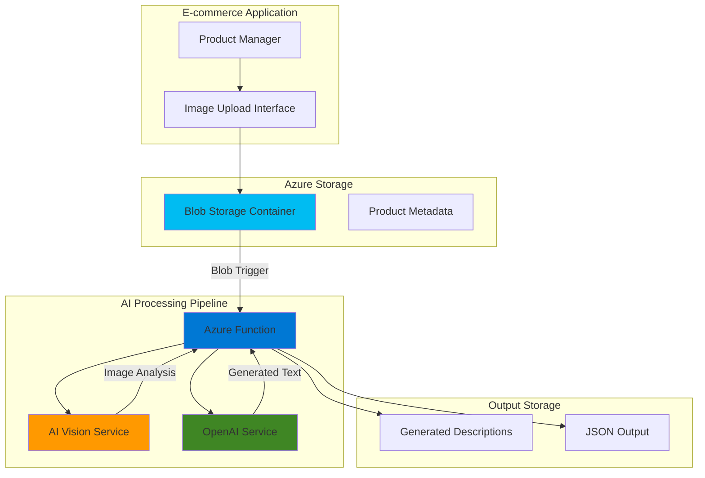

# Product Description Generation with AI Vision and OpenAI

## Problem

E-commerce businesses struggle with manually creating compelling, consistent product descriptions at scale, especially when processing thousands of product images. Manual content creation is time-consuming, prone to inconsistency, and creates bottlenecks in catalog management workflows. Without automated solutions, businesses cannot efficiently scale their product offerings while maintaining quality descriptions that drive conversions.

## Solution

Create an event-driven AI pipeline that automatically generates compelling product descriptions by analyzing uploaded images with Azure AI Vision and crafting marketing copy with Azure OpenAI Service. This serverless solution leverages Azure Functions to orchestrate the workflow, providing automated, scalable content generation for e-commerce applications.

## Architecture Diagram



## Prerequisites

1. Azure account with AI Services and Functions permissions
2. Azure CLI installed and configured (or Azure Cloud Shell)
3. Basic understanding of serverless functions and REST APIs
4. Familiarity with JSON data structures
5. Estimated cost: $15-25 for testing (includes AI Vision calls, OpenAI tokens, and Functions execution)

> **Note**: This solution follows Azure Well-Architected Framework principles for cost optimization through serverless consumption-based pricing.

## Preparation

```bash
# Set environment variables for Azure resources
export RESOURCE_GROUP="rg-product-description-${RANDOM_SUFFIX}"
export LOCATION="eastus"
export SUBSCRIPTION_ID=$(az account show --query id --output tsv)

# Generate unique suffix for resource names
RANDOM_SUFFIX=$(openssl rand -hex 3)

# Create resource group with proper tags
az group create \
    --name ${RESOURCE_GROUP} \
    --location ${LOCATION} \
    --tags purpose=recipe environment=demo category=ai-ml

echo "✅ Resource group created: ${RESOURCE_GROUP}"

# Set additional environment variables for resources
export STORAGE_ACCOUNT="stproddesc${RANDOM_SUFFIX}"
export FUNCTION_APP="func-prod-desc-${RANDOM_SUFFIX}"
export AI_VISION_NAME="cv-prod-desc-${RANDOM_SUFFIX}"
export OPENAI_NAME="oai-prod-desc-${RANDOM_SUFFIX}"
export CONTAINER_NAME="product-images"
export OUTPUT_CONTAINER="descriptions"
```

## Steps

1. **Create Storage Account with Containers**:

   Azure Blob Storage provides the foundational data layer for our AI pipeline, offering massively scalable object storage with built-in redundancy. Creating dedicated containers for input images and output descriptions enables clear data organization and supports event-driven processing patterns.

   ```bash
   # Create storage account with standard performance tier
   az storage account create \
       --name ${STORAGE_ACCOUNT} \
       --resource-group ${RESOURCE_GROUP} \
       --location ${LOCATION} \
       --sku Standard_LRS \
       --kind StorageV2 \
       --access-tier Hot
   
   # Get storage account key for container operations
   STORAGE_KEY=$(az storage account keys list \
       --account-name ${STORAGE_ACCOUNT} \
       --resource-group ${RESOURCE_GROUP} \
       --query '[0].value' --output tsv)
   
   # Create containers for images and descriptions
   az storage container create \
       --name ${CONTAINER_NAME} \
       --account-name ${STORAGE_ACCOUNT} \
       --account-key ${STORAGE_KEY} \
       --public-access off
   
   az storage container create \
       --name ${OUTPUT_CONTAINER} \
       --account-name ${STORAGE_ACCOUNT} \
       --account-key ${STORAGE_KEY} \
       --public-access off
   
   echo "✅ Storage account and containers created successfully"
   ```

   The storage account is now configured with Hot access tier for optimal performance during active processing and separate containers for input and output data segregation.

2. **Deploy Azure AI Vision Service**:

   Azure AI Vision provides advanced image analysis capabilities powered by deep learning models. The service can extract detailed visual features, objects, text, and generate comprehensive descriptions that serve as input for our content generation pipeline.

   ```bash
   # Create AI Vision service resource
   az cognitiveservices account create \
       --name ${AI_VISION_NAME} \
       --resource-group ${RESOURCE_GROUP} \
       --location ${LOCATION} \
       --kind ComputerVision \
       --sku S1 \
       --custom-domain ${AI_VISION_NAME}
   
   # Get AI Vision endpoint and key
   VISION_ENDPOINT=$(az cognitiveservices account show \
       --name ${AI_VISION_NAME} \
       --resource-group ${RESOURCE_GROUP} \
       --query properties.endpoint --output tsv)
   
   VISION_KEY=$(az cognitiveservices account keys list \
       --name ${AI_VISION_NAME} \
       --resource-group ${RESOURCE_GROUP} \
       --query key1 --output tsv)
   
   echo "✅ AI Vision service deployed: ${VISION_ENDPOINT}"
   ```

   The AI Vision service is configured with S1 tier to provide sufficient transaction capacity for production workloads while maintaining cost efficiency for development and testing scenarios.

3. **Create Azure OpenAI Service Instance**:

   Azure OpenAI Service provides access to advanced language models including GPT-4, enabling sophisticated text generation capabilities. This managed service ensures enterprise-grade security and compliance while delivering powerful AI-driven content creation.

   ```bash
   # Create OpenAI service (requires approval in some regions)
   az cognitiveservices account create \
       --name ${OPENAI_NAME} \
       --resource-group ${RESOURCE_GROUP} \
       --location ${LOCATION} \
       --kind OpenAI \
       --sku S0 \
       --custom-domain ${OPENAI_NAME}
   
   # Get OpenAI endpoint and key
   OPENAI_ENDPOINT=$(az cognitiveservices account show \
       --name ${OPENAI_NAME} \
       --resource-group ${RESOURCE_GROUP} \
       --query properties.endpoint --output tsv)
   
   OPENAI_KEY=$(az cognitiveservices account keys list \
       --name ${OPENAI_NAME} \
       --resource-group ${RESOURCE_GROUP} \
       --query key1 --output tsv)
   
   echo "✅ OpenAI service created: ${OPENAI_ENDPOINT}"
   ```

   The OpenAI service provides API access to state-of-the-art language models optimized for content generation, with built-in content filtering and responsible AI guardrails.

4. **Deploy GPT-4o Model for Text Generation**:

   Model deployment in Azure OpenAI enables dedicated compute resources for consistent performance and latency. GPT-4o provides excellent balance between capability and cost for product description generation tasks.

   ```bash
   # Deploy GPT-4o model for text generation
   az cognitiveservices account deployment create \
       --name ${OPENAI_NAME} \
       --resource-group ${RESOURCE_GROUP} \
       --deployment-name gpt-4o \
       --model-name gpt-4o \
       --model-version "2024-11-20" \
       --model-format OpenAI \
       --sku-capacity 10 \
       --sku-name Standard
   
   # Wait for deployment to complete
   echo "Waiting for model deployment..."
   sleep 30
   
   # Verify deployment status
   az cognitiveservices account deployment show \
       --name ${OPENAI_NAME} \
       --resource-group ${RESOURCE_GROUP} \
       --deployment-name gpt-4o \
       --query provisioningState --output tsv
   
   echo "✅ GPT-4o model deployed successfully"
   ```

   The deployed model provides dedicated throughput for reliable text generation performance, ensuring consistent response times for product description creation workflows.

5. **Create Function App with Python Runtime**:

   Azure Functions enables serverless execution of our AI processing logic, automatically scaling based on demand while eliminating infrastructure management overhead. The Python runtime provides excellent support for AI service integration and JSON processing.

   ```bash
   # Create Function App with Python 3.11 runtime
   az functionapp create \
       --name ${FUNCTION_APP} \
       --resource-group ${RESOURCE_GROUP} \
       --storage-account ${STORAGE_ACCOUNT} \
       --consumption-plan-location ${LOCATION} \
       --runtime python \
       --runtime-version 3.11 \
       --functions-version 4 \
       --os-type Linux
   
   # Configure application settings for AI services
   az functionapp config appsettings set \
       --name ${FUNCTION_APP} \
       --resource-group ${RESOURCE_GROUP} \
       --settings \
       "VISION_ENDPOINT=${VISION_ENDPOINT}" \
       "VISION_KEY=${VISION_KEY}" \
       "OPENAI_ENDPOINT=${OPENAI_ENDPOINT}" \
       "OPENAI_KEY=${OPENAI_KEY}" \
       "STORAGE_CONNECTION_STRING=DefaultEndpointsProtocol=https;AccountName=${STORAGE_ACCOUNT};AccountKey=${STORAGE_KEY};EndpointSuffix=core.windows.net" \
       "OUTPUT_CONTAINER=${OUTPUT_CONTAINER}"
   
   echo "✅ Function App created and configured"
   ```

   The Function App is configured with Consumption plan for automatic scaling and cost optimization, with all necessary connection strings and API keys securely stored in application settings.

6. **Deploy Function Code for Image Processing**:

   The Azure Function orchestrates the complete AI pipeline, handling blob triggers, calling AI services, and storing results. This event-driven approach ensures immediate processing when new product images are uploaded.

   ```bash
   # Create temporary directory for function code
   mkdir -p /tmp/product-description-function
   cd /tmp/product-description-function
   
   # Create function configuration
   cat > host.json << 'EOF'
{
    "version": "2.0",
    "extensionBundle": {
        "id": "Microsoft.Azure.Functions.ExtensionBundle",
        "version": "[4.*, 5.0.0)"
    },
    "functionTimeout": "00:05:00"
}
EOF
   
   # Create requirements file
   cat > requirements.txt << 'EOF'
azure-functions>=1.18.0
azure-storage-blob>=12.19.0
requests>=2.31.0
azure-ai-vision-imageanalysis>=1.0.0
openai>=1.10.0
Pillow>=10.0.0
azure-core>=1.29.0
EOF
   
   # Create the main function code
   mkdir -p ProductDescriptionGenerator
   cat > ProductDescriptionGenerator/function.json << 'EOF'
{
    "scriptFile": "__init__.py",
    "bindings": [
        {
            "name": "myblob",
            "type": "blobTrigger",
            "direction": "in",
            "path": "product-images/{name}",
            "connection": "STORAGE_CONNECTION_STRING",
            "source": "EventGrid"
        }
    ]
}
EOF
   
   # Create the Python function implementation
   cat > ProductDescriptionGenerator/__init__.py << 'EOF'
import logging
import json
import os
import io
from azure.functions import InputStream
from azure.storage.blob import BlobServiceClient
from azure.ai.vision.imageanalysis import ImageAnalysisClient
from azure.ai.vision.imageanalysis.models import VisualFeatures
from azure.core.credentials import AzureKeyCredential
from openai import AzureOpenAI
from PIL import Image

def main(myblob: InputStream):
    logging.info(f"Processing blob: {myblob.name}")
    
    try:
        # Initialize clients with proper Azure SDK patterns
        vision_client = ImageAnalysisClient(
            endpoint=os.environ["VISION_ENDPOINT"],
            credential=AzureKeyCredential(os.environ["VISION_KEY"])
        )
        
        openai_client = AzureOpenAI(
            azure_endpoint=os.environ["OPENAI_ENDPOINT"],
            api_key=os.environ["OPENAI_KEY"],
            api_version="2024-02-01"
        )
        
        blob_service = BlobServiceClient.from_connection_string(
            os.environ["STORAGE_CONNECTION_STRING"]
        )
        
        # Read image data
        image_data = myblob.read()
        
        # Analyze image with Vision API
        logging.info("Analyzing image with AI Vision...")
        result = vision_client.analyze(
            image_data=image_data,
            visual_features=[
                VisualFeatures.CAPTION,
                VisualFeatures.OBJECTS,
                VisualFeatures.TAGS,
                VisualFeatures.CATEGORIES
            ]
        )
        
        # Extract analysis results
        caption = result.caption.text if result.caption else "Product image"
        objects = [obj.object_property for obj in result.objects.list] if result.objects else []
        tags = [tag.name for tag in result.tags.list[:10]] if result.tags else []
        categories = [cat.name for cat in result.categories.list] if result.categories else []
        
        logging.info(f"Vision analysis complete: {caption}")
        
        # Create prompt for OpenAI
        prompt = f"""
Create a compelling e-commerce product description based on this image analysis:

Image Description: {caption}
Detected Objects: {', '.join(objects)}
Key Tags: {', '.join(tags)}
Categories: {', '.join(categories)}

Generate a professional product description that includes:
1. An engaging headline
2. Key features and benefits
3. Use cases or styling suggestions
4. Material/quality highlights where applicable

Format as JSON with fields: headline, description, features, suggested_uses
Keep the tone professional yet engaging, suitable for online retail.
"""
        
        # Generate description with OpenAI using latest SDK patterns
        logging.info("Generating product description...")
        response = openai_client.chat.completions.create(
            model="gpt-4o",
            messages=[
                {"role": "system", "content": "You are an expert e-commerce copywriter specializing in product descriptions."},
                {"role": "user", "content": prompt}
            ],
            max_tokens=500,
            temperature=0.7
        )
        
        generated_content = response.choices[0].message.content
        
        # Parse and structure the output
        try:
            product_description = json.loads(generated_content)
        except json.JSONDecodeError:
            # Fallback if JSON parsing fails
            product_description = {
                "headline": "Premium Product",
                "description": generated_content,
                "features": [],
                "suggested_uses": []
            }
        
        # Create final output with enhanced metadata
        import datetime
        output_data = {
            "filename": myblob.name,
            "timestamp": datetime.datetime.utcnow().isoformat(),
            "blob_uri": myblob.uri,
            "vision_analysis": {
                "caption": caption,
                "objects": objects,
                "tags": tags,
                "categories": categories
            },
            "generated_content": product_description,
            "processing_status": "success",
            "model_version": "gpt-4o",
            "processing_duration_ms": None  # Could be enhanced with timing
        }
        
        # Save results to output container
        output_filename = f"description_{os.path.splitext(os.path.basename(myblob.name))[0]}.json"
        blob_client = blob_service.get_blob_client(
            container=os.environ["OUTPUT_CONTAINER"],
            blob=output_filename
        )
        
        blob_client.upload_blob(
            json.dumps(output_data, indent=2),
            overwrite=True,
            content_type="application/json"
        )
        
        logging.info(f"Successfully processed {myblob.name} -> {output_filename}")
        
    except Exception as e:
        logging.error(f"Error processing {myblob.name}: {str(e)}")
        
        # Save error information with enhanced context
        import datetime
        error_data = {
            "filename": myblob.name,
            "timestamp": datetime.datetime.utcnow().isoformat(),
            "error": str(e),
            "error_type": type(e).__name__,
            "processing_status": "failed"
        }
        
        error_filename = f"error_{os.path.splitext(os.path.basename(myblob.name))[0]}.json"
        try:
            blob_client = blob_service.get_blob_client(
                container=os.environ["OUTPUT_CONTAINER"],
                blob=error_filename
            )
            blob_client.upload_blob(
                json.dumps(error_data, indent=2),
                overwrite=True,
                content_type="application/json"
            )
        except Exception as save_error:
            logging.error(f"Failed to save error info: {str(save_error)}")
EOF
   
   echo "✅ Function code created successfully"
   ```

   The function implements comprehensive error handling and structured output formatting, ensuring reliable processing even with varied input image quality and types.

7. **Deploy Function to Azure**:

   Function deployment packages the Python code and dependencies, making the AI pipeline available for event-driven execution. The deployment process includes dependency installation and configuration validation.

   ```bash
   # Package and deploy the function
   zip -r function.zip . -x "*.git*" "*.DS_Store*"
   
   # Deploy using Azure CLI
   az functionapp deployment source config-zip \
       --name ${FUNCTION_APP} \
       --resource-group ${RESOURCE_GROUP} \
       --src function.zip
   
   # Wait for deployment to complete
   echo "Waiting for function deployment..."
   sleep 60
   
   # Verify function deployment status
   az functionapp function show \
       --name ${FUNCTION_APP} \
       --resource-group ${RESOURCE_GROUP} \
       --function-name ProductDescriptionGenerator \
       --query config.status --output tsv
   
   echo "✅ Function deployed and ready for processing"
   
   # Clean up temporary files
   cd /
   rm -rf /tmp/product-description-function
   ```

   The deployed function is now active and will automatically trigger when new images are uploaded to the product-images container, providing real-time processing capabilities.

8. **Configure Blob Storage Event Integration**:

   Event Grid integration enables low-latency triggering of the Function App when new product images are uploaded. This event-driven architecture ensures immediate processing without polling overhead.

   ```bash
   # Get Function App resource ID for event subscription
   FUNCTION_RESOURCE_ID=$(az functionapp show \
       --name ${FUNCTION_APP} \
       --resource-group ${RESOURCE_GROUP} \
       --query id --output tsv)
   
   # Create Event Grid subscription for blob created events
   az eventgrid event-subscription create \
       --name "product-image-processor" \
       --source-resource-id "/subscriptions/${SUBSCRIPTION_ID}/resourceGroups/${RESOURCE_GROUP}/providers/Microsoft.Storage/storageAccounts/${STORAGE_ACCOUNT}" \
       --endpoint "${FUNCTION_RESOURCE_ID}/functions/ProductDescriptionGenerator" \
       --endpoint-type azurefunction \
       --included-event-types Microsoft.Storage.BlobCreated \
       --subject-begins-with "/blobServices/default/containers/${CONTAINER_NAME}/blobs/" \
       --advanced-filter data.contentType StringContains image
   
   echo "✅ Event Grid subscription configured for automatic processing"
   ```

   The event subscription ensures that every new image upload immediately triggers the AI processing pipeline, enabling real-time product description generation for e-commerce workflows.

## Validation & Testing

1. **Upload test product image**:

   ```bash
   # Create a test image URL (or use your own image file)
   TEST_IMAGE_URL="https://images.unsplash.com/photo-1542291026-7eec264c27ff?w=800"
   
   # Download test image
   curl -o test-product.jpg ${TEST_IMAGE_URL}
   
   # Upload test image to trigger processing
   az storage blob upload \
       --account-name ${STORAGE_ACCOUNT} \
       --account-key ${STORAGE_KEY} \
       --container-name ${CONTAINER_NAME} \
       --name "test-product-001.jpg" \
       --file test-product.jpg \
       --content-type "image/jpeg"
   
   echo "✅ Test image uploaded successfully"
   ```

   Expected output: Blob upload confirmation with successful status.

2. **Monitor function execution**:

   ```bash
   # Check function logs for processing activity
   az functionapp logs tail \
       --name ${FUNCTION_APP} \
       --resource-group ${RESOURCE_GROUP}
   
   # Wait a few seconds for processing
   sleep 15
   
   echo "✅ Check logs for processing confirmation"
   ```

3. **Verify generated description**:

   ```bash
   # List generated description files
   az storage blob list \
       --account-name ${STORAGE_ACCOUNT} \
       --account-key ${STORAGE_KEY} \
       --container-name ${OUTPUT_CONTAINER} \
       --output table
   
   # Download and view the generated description
   az storage blob download \
       --account-name ${STORAGE_ACCOUNT} \
       --account-key ${STORAGE_KEY} \
       --container-name ${OUTPUT_CONTAINER} \
       --name "description_test-product-001.json" \
       --file generated-description.json
   
   # Display the generated content
   cat generated-description.json | jq '.'
   ```

   Expected output: JSON file containing image analysis results and AI-generated product description with headline, features, and usage suggestions.

## Cleanup

1. **Remove Function App and associated resources**:

   ```bash
   # Delete Function App
   az functionapp delete \
       --name ${FUNCTION_APP} \
       --resource-group ${RESOURCE_GROUP}
   
   echo "✅ Function App deleted"
   ```

2. **Remove AI Services**:

   ```bash
   # Delete OpenAI service
   az cognitiveservices account delete \
       --name ${OPENAI_NAME} \
       --resource-group ${RESOURCE_GROUP}
   
   # Delete AI Vision service
   az cognitiveservices account delete \
       --name ${AI_VISION_NAME} \
       --resource-group ${RESOURCE_GROUP}
   
   echo "✅ AI services removed"
   ```

3. **Remove Storage Account and data**:

   ```bash
   # Delete storage account (removes all containers and data)
   az storage account delete \
       --name ${STORAGE_ACCOUNT} \
       --resource-group ${RESOURCE_GROUP} \
       --yes
   
   echo "✅ Storage account and all data deleted"
   ```

4. **Remove Resource Group**:

   ```bash
   # Delete entire resource group
   az group delete \
       --name ${RESOURCE_GROUP} \
       --yes \
       --no-wait
   
   echo "✅ Resource group deletion initiated"
   echo "Note: Complete deletion may take several minutes"
   
   # Clean up local files
   rm -f test-product.jpg generated-description.json
   ```

## Discussion

This solution demonstrates a modern, serverless approach to AI-powered content generation that addresses critical e-commerce challenges. The architecture leverages Azure's managed AI services to create scalable, cost-effective automation without requiring deep machine learning expertise.

The integration of Azure AI Vision and OpenAI Service creates a powerful two-stage pipeline. AI Vision provides structured image analysis including object detection, scene understanding, and automatic captioning, while OpenAI Service transforms this technical analysis into compelling marketing copy. This combination enables businesses to maintain consistent brand voice while scaling content creation operations.

The event-driven architecture using Azure Functions and Blob Storage ensures real-time processing with minimal latency. When product managers upload images, descriptions are generated within seconds, enabling immediate catalog updates. The serverless model provides automatic scaling during peak upload periods while minimizing costs during low-activity times.

Security and compliance are built into the solution through Azure's enterprise-grade services. API keys are stored securely in Function App settings, all data remains within your Azure tenant, and AI processing includes built-in content filtering. This approach meets enterprise security requirements while maintaining processing efficiency.

> **Tip**: Monitor AI service usage through Azure Cost Management to optimize token consumption and implement caching strategies for frequently processed similar products.

For production deployment, consider implementing additional features such as content approval workflows, multilingual description generation, and integration with existing product information management (PIM) systems. The modular architecture supports these enhancements without requiring significant refactoring.

Performance optimization opportunities include batch processing for bulk uploads, result caching for similar products, and fine-tuning OpenAI prompts for specific product categories. [Azure Monitor](https://learn.microsoft.com/en-us/azure/azure-monitor/overview) provides comprehensive observability for tracking processing times, success rates, and cost optimization opportunities.

The solution aligns with [Azure Well-Architected Framework](https://learn.microsoft.com/en-us/azure/architecture/framework/) principles, emphasizing operational excellence through automation, security through managed services, reliability through error handling, performance efficiency through serverless scaling, and cost optimization through consumption-based pricing. The event-driven architecture using Azure Event Grid ensures low-latency processing while the serverless Functions provide automatic scaling and cost efficiency.

## Challenge

Extend this solution by implementing these enhancements:

1. **Multi-language Support**: Add Azure Translator integration to generate product descriptions in multiple languages, enabling global e-commerce expansion with localized content.

2. **Brand Voice Customization**: Implement fine-tuning or prompt engineering to maintain consistent brand voice across different product categories, creating personality-driven descriptions.

3. **Approval Workflow Integration**: Build an approval system using Azure Logic Apps that routes generated descriptions through human reviewers before publishing, ensuring quality control.

4. **Competitive Analysis**: Integrate web scraping capabilities to analyze competitor product descriptions and optimize generated content for market differentiation and SEO.

5. **Performance Analytics Dashboard**: Create a Power BI dashboard to track description generation metrics, conversion rates, and A/B testing results for continuous optimization.

## Infrastructure Code

### Available Infrastructure as Code:

- [Infrastructure Code Overview](code/README.md) - Detailed description of all infrastructure components
- [Bicep](code/bicep/) - Azure Bicep templates
- [Bash CLI Scripts](code/scripts/) - Example bash scripts using Azure CLI commands to deploy infrastructure
- [Terraform](code/terraform/) - Terraform configuration files