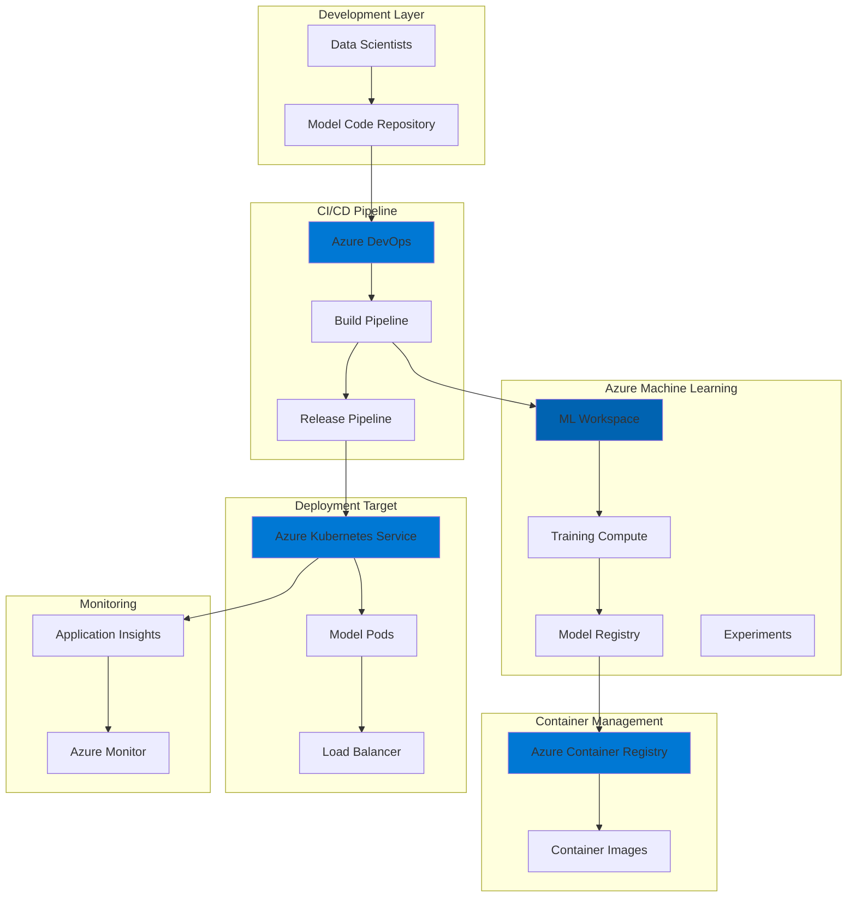

# Production MLOps Pipelines with Kubernetes

## Problem

Modern machine learning teams struggle with the complexity of deploying, scaling, and managing ML models in production environments. Manual deployment processes lead to inconsistent releases, difficulty in tracking model versions, and inability to scale dynamically based on demand. Without proper automation and orchestration, data science teams spend excessive time on infrastructure management instead of model improvement, resulting in slower innovation cycles and reduced business value from ML investments.

## Solution

This recipe implements a production-ready MLOps pipeline using Azure Kubernetes Service (AKS) for scalable container orchestration, Azure Machine Learning for model lifecycle management, Azure Container Registry for secure image storage, and Azure DevOps for end-to-end CI/CD automation. This integrated approach enables automated model training, containerization, deployment, and monitoring while maintaining enterprise-grade security and compliance standards.

## Architecture Diagram



## Prerequisites

1. Azure subscription with Owner or Contributor access
2. Azure CLI version 2.0 or later installed and configured
3. kubectl CLI tool installed for Kubernetes management
4. Docker installed for local container testing (optional)
5. Azure DevOps organization with project created
6. Basic understanding of Kubernetes concepts and YAML manifests
7. Familiarity with machine learning concepts and Python
8. Estimated cost: $200-300/month for basic setup

> **Note**: This recipe assumes you have a trained ML model ready for deployment. The focus is on the MLOps pipeline infrastructure rather than model development.

## Preparation

```bash
# Set environment variables
export RESOURCE_GROUP="rg-mlops-pipeline"
export LOCATION="eastus"
export WORKSPACE_NAME="mlw-mlops-demo"
export AKS_CLUSTER_NAME="aks-mlops-cluster"
export ACR_NAME="acrmlops$(openssl rand -hex 4)"
export KEYVAULT_NAME="kv-mlops-$(openssl rand -hex 4)"
export STORAGE_ACCOUNT="stmlops$(openssl rand -hex 4)"

# Create resource group
az group create \
    --name ${RESOURCE_GROUP} \
    --location ${LOCATION} \
    --tags purpose=mlops environment=demo

# Create storage account for ML workspace
az storage account create \
    --name ${STORAGE_ACCOUNT} \
    --resource-group ${RESOURCE_GROUP} \
    --location ${LOCATION} \
    --sku Standard_LRS \
    --kind StorageV2

echo "✅ Resource group and storage account created"
```

## Steps

1. **Create Azure Container Registry for Model Images**:

   Azure Container Registry provides a managed, private Docker registry service for storing and managing container images. In MLOps workflows, ACR serves as the central repository for model serving images, ensuring version control, security scanning, and geo-replication capabilities. This enterprise-grade registry integrates seamlessly with Azure services and provides built-in security features like Azure AD authentication and content trust.

   ```bash
   # Create Azure Container Registry
   az acr create \
       --resource-group ${RESOURCE_GROUP} \
       --name ${ACR_NAME} \
       --sku Standard \
       --admin-enabled true
   
   # Get ACR credentials for later use
   ACR_LOGIN_SERVER=$(az acr show \
       --name ${ACR_NAME} \
       --query loginServer \
       --output tsv)
   
   ACR_USERNAME=$(az acr credential show \
       --name ${ACR_NAME} \
       --query username \
       --output tsv)
   
   ACR_PASSWORD=$(az acr credential show \
       --name ${ACR_NAME} \
       --query passwords[0].value \
       --output tsv)
   
   echo "✅ Container Registry created: ${ACR_LOGIN_SERVER}"
   ```

   The container registry is now ready to store Docker images containing your ML models. ACR's integration with Azure Machine Learning enables automatic image building and pushing during the model deployment process, while vulnerability scanning ensures your containers meet security compliance requirements.

2. **Deploy Azure Kubernetes Service Cluster**:

   Azure Kubernetes Service provides a fully managed Kubernetes environment optimized for production workloads. For MLOps scenarios, AKS offers automatic scaling, GPU support for deep learning models, and integrated monitoring. The cluster configuration includes system and user node pools, allowing separation of infrastructure and application workloads for better resource management and cost optimization.

   ```bash
   # Create AKS cluster with system and user node pools
   az aks create \
       --resource-group ${RESOURCE_GROUP} \
       --name ${AKS_CLUSTER_NAME} \
       --node-count 2 \
       --node-vm-size Standard_DS3_v2 \
       --enable-cluster-autoscaler \
       --min-count 2 \
       --max-count 5 \
       --generate-ssh-keys \
       --attach-acr ${ACR_NAME} \
       --enable-addons monitoring \
       --enable-managed-identity
   
   # Add user node pool for ML workloads
   az aks nodepool add \
       --resource-group ${RESOURCE_GROUP} \
       --cluster-name ${AKS_CLUSTER_NAME} \
       --name mlpool \
       --node-count 2 \
       --node-vm-size Standard_DS3_v2 \
       --enable-cluster-autoscaler \
       --min-count 1 \
       --max-count 4 \
       --mode User \
       --node-taints "workload=ml:NoSchedule"
   
   # Get AKS credentials
   az aks get-credentials \
       --resource-group ${RESOURCE_GROUP} \
       --name ${AKS_CLUSTER_NAME} \
       --overwrite-existing
   
   echo "✅ AKS cluster deployed with autoscaling enabled"
   ```

   The AKS cluster now provides a scalable platform for deploying containerized ML models. The autoscaling configuration ensures efficient resource utilization by automatically adjusting node count based on workload demands, while the dedicated ML node pool with taints prevents system workloads from interfering with model serving performance.

3. **Create Azure Machine Learning Workspace**:

   Azure Machine Learning workspace serves as the central hub for all ML assets including experiments, models, datasets, and compute resources. It provides enterprise-grade capabilities for model versioning, experiment tracking, and automated machine learning. The workspace integrates with Azure Active Directory for authentication and role-based access control, ensuring secure collaboration across data science teams.

   ```bash
   # Create Key Vault for storing secrets
   az keyvault create \
       --name ${KEYVAULT_NAME} \
       --resource-group ${RESOURCE_GROUP} \
       --location ${LOCATION} \
       --enable-soft-delete true \
       --retention-days 90
   
   # Create Application Insights for monitoring
   az monitor app-insights component create \
       --app mlops-insights \
       --location ${LOCATION} \
       --resource-group ${RESOURCE_GROUP} \
       --application-type web
   
   APP_INSIGHTS_ID=$(az monitor app-insights component show \
       --app mlops-insights \
       --resource-group ${RESOURCE_GROUP} \
       --query id \
       --output tsv)
   
   # Create ML workspace
   az ml workspace create \
       --name ${WORKSPACE_NAME} \
       --resource-group ${RESOURCE_GROUP} \
       --location ${LOCATION} \
       --storage-account ${STORAGE_ACCOUNT} \
       --key-vault ${KEYVAULT_NAME} \
       --app-insights ${APP_INSIGHTS_ID} \
       --container-registry ${ACR_NAME}
   
   echo "✅ Azure Machine Learning workspace created"
   ```

   The ML workspace is now configured with all necessary backing services. This setup enables comprehensive model lifecycle management, from experimentation to production deployment, while Application Insights provides real-time monitoring of model performance and system health metrics.

4. **Attach AKS Cluster to ML Workspace**:

   Attaching the AKS cluster to Azure Machine Learning workspace enables seamless model deployment and management through ML APIs and tools. This integration allows data scientists to deploy models without deep Kubernetes knowledge while maintaining the flexibility and power of Kubernetes orchestration. The attached cluster becomes a compute target for both training and inference workloads.

   ```bash
   # Install ML extension on AKS
   az k8s-extension create \
       --name ml-extension \
       --cluster-name ${AKS_CLUSTER_NAME} \
       --resource-group ${RESOURCE_GROUP} \
       --extension-type Microsoft.AzureML.Kubernetes \
       --cluster-type managedClusters \
       --scope cluster \
       --auto-upgrade-minor-version true
   
   # Wait for extension installation
   echo "⏳ Waiting for ML extension installation (this may take 5-10 minutes)..."
   sleep 300
   
   # Attach AKS to ML workspace
   az ml compute attach \
       --resource-group ${RESOURCE_GROUP} \
       --workspace-name ${WORKSPACE_NAME} \
       --type Kubernetes \
       --name aks-compute \
       --resource-id "/subscriptions/$(az account show --query id -o tsv)/resourceGroups/${RESOURCE_GROUP}/providers/Microsoft.ContainerService/managedClusters/${AKS_CLUSTER_NAME}" \
       --identity-type SystemAssigned \
       --namespace azureml
   
   echo "✅ AKS cluster attached to ML workspace"
   ```

   The Kubernetes compute target is now available in your ML workspace. This configuration enables direct deployment of models from Azure Machine Learning to AKS, with automatic handling of container orchestration, load balancing, and scaling based on the deployment configuration specified in your ML pipelines.

5. **Configure ML Compute Instance Types**:

   Instance types in Azure Machine Learning define resource allocations for different workload requirements. By creating custom instance types, you can optimize resource utilization and costs by matching compute resources to specific model requirements. This granular control ensures small models don't waste resources while large models receive adequate compute power.

   ```bash
   # Create instance type for small models
   cat <<EOF > small-instance-type.yaml
   apiVersion: amlarc.azureml.com/v1alpha1
   kind: InstanceType
   metadata:
     name: small-cpu-model
     namespace: azureml
   spec:
     resources:
       limits:
         cpu: "2"
         memory: "4Gi"
       requests:
         cpu: "1"
         memory: "2Gi"
     nodeSelector:
       agentpool: mlpool
     tolerations:
     - key: "workload"
       operator: "Equal"
       value: "ml"
       effect: "NoSchedule"
   EOF
   
   # Create instance type for large models
   cat <<EOF > large-instance-type.yaml
   apiVersion: amlarc.azureml.com/v1alpha1
   kind: InstanceType
   metadata:
     name: large-cpu-model
     namespace: azureml
   spec:
     resources:
       limits:
         cpu: "4"
         memory: "16Gi"
       requests:
         cpu: "2"
         memory: "8Gi"
     nodeSelector:
       agentpool: mlpool
     tolerations:
     - key: "workload"
       operator: "Equal"
       value: "ml"
       effect: "NoSchedule"
   EOF
   
   # Apply instance types to cluster
   kubectl apply -f small-instance-type.yaml
   kubectl apply -f large-instance-type.yaml
   
   echo "✅ Custom instance types configured for ML workloads"
   ```

   These instance types now provide predefined resource templates for deploying models with different computational requirements. The configuration ensures models are scheduled on the dedicated ML node pool, preventing resource contention with system workloads and enabling predictable performance.

6. **Create Sample Model Deployment Pipeline**:

   This step demonstrates the MLOps pipeline by creating a sample model deployment configuration. The deployment manifest defines how your containerized model should run on AKS, including resource requirements, environment variables, and scaling parameters. This declarative approach ensures reproducible deployments across environments.

   ```bash
   # Create sample model scoring script
   cat <<EOF > score.py
   import json
   import numpy as np
   import os
   from azureml.core.model import Model
   
   def init():
       global model
       # This is a placeholder - replace with your model loading logic
       model_path = os.path.join(os.getenv('AZUREML_MODEL_DIR'), 'model.pkl')
       print(f"Loading model from: {model_path}")
       # model = joblib.load(model_path)
   
   def run(data):
       try:
           # Parse input data
           input_data = json.loads(data)
           # Placeholder prediction logic
           prediction = {"prediction": "sample_output", "confidence": 0.95}
           return json.dumps(prediction)
       except Exception as e:
           error = str(e)
           return json.dumps({"error": error})
   EOF
   
   # Create deployment configuration
   cat <<EOF > deployment-config.yml
   name: sample-model-deployment
   endpoint_name: mlops-endpoint
   model:
     name: sample-model
     version: 1
     path: ./model
   code_configuration:
     code: ./
     scoring_script: score.py
   environment:
     name: sklearn-env
     version: 1
     image: mcr.microsoft.com/azureml/sklearn-1.0-ubuntu20.04-py38-cpu:latest
   instance_type: small-cpu-model
   instance_count: 2
   request_settings:
     request_timeout_ms: 3000
     max_concurrent_requests_per_instance: 2
   liveness_probe:
     initial_delay: 30
     period: 10
     timeout: 2
     success_threshold: 1
     failure_threshold: 3
   readiness_probe:
     initial_delay: 30
     period: 10
     timeout: 2
     success_threshold: 1
     failure_threshold: 3
   EOF
   
   echo "✅ Sample deployment configuration created"
   ```

   This deployment configuration defines a production-ready model serving setup with health probes, resource limits, and scaling parameters. The configuration ensures high availability through multiple instances and automatic recovery through liveness and readiness probes.

7. **Set Up Azure DevOps Pipeline**:

   Azure DevOps provides enterprise-grade CI/CD capabilities for automating the entire MLOps workflow. This pipeline configuration implements a multi-stage process that builds model containers, runs tests, and deploys to AKS automatically when code changes are pushed. The pipeline ensures consistent deployments and reduces manual errors in the model release process.

   ```bash
   # Create Azure DevOps pipeline YAML
   cat <<EOF > azure-pipelines.yml
   trigger:
     branches:
       include:
       - main
     paths:
       include:
       - models/*
       - deployments/*
   
   pool:
     vmImage: 'ubuntu-latest'
   
   variables:
     azureServiceConnection: 'MLOps-ServiceConnection'
     resourceGroup: '${RESOURCE_GROUP}'
     workspaceName: '${WORKSPACE_NAME}'
     acrName: '${ACR_NAME}'
     modelName: 'production-model'
   
   stages:
   - stage: Build
     displayName: 'Build and Package Model'
     jobs:
     - job: BuildModel
       steps:
       - task: UsePythonVersion@0
         inputs:
           versionSpec: '3.8'
           addToPath: true
       
       - script: |
           pip install azureml-sdk azureml-mlflow
           echo "Dependencies installed"
         displayName: 'Install Dependencies'
       
       - task: AzureCLI@2
         inputs:
           azureSubscription: \$(azureServiceConnection)
           scriptType: 'bash'
           scriptLocation: 'inlineScript'
           inlineScript: |
             az ml model create \
               --name \$(modelName) \
               --version \$BUILD_BUILDID \
               --path ./model \
               --resource-group \$(resourceGroup) \
               --workspace-name \$(workspaceName)
         displayName: 'Register Model'
   
   - stage: Deploy
     displayName: 'Deploy to AKS'
     dependsOn: Build
     jobs:
     - deployment: DeployToAKS
       environment: 'Production'
       strategy:
         runOnce:
           deploy:
             steps:
             - task: AzureCLI@2
               inputs:
                 azureSubscription: \$(azureServiceConnection)
                 scriptType: 'bash'
                 scriptLocation: 'inlineScript'
                 inlineScript: |
                   # Create or update endpoint
                   az ml online-endpoint create \
                     --name mlops-endpoint \
                     --resource-group \$(resourceGroup) \
                     --workspace-name \$(workspaceName) \
                     --auth-mode key
                   
                   # Deploy model
                   az ml online-deployment create \
                     --name blue-deployment \
                     --endpoint mlops-endpoint \
                     --model \$(modelName):\$BUILD_BUILDID \
                     --instance-type small-cpu-model \
                     --instance-count 2 \
                     --resource-group \$(resourceGroup) \
                     --workspace-name \$(workspaceName) \
                     --file deployment-config.yml
               displayName: 'Deploy Model to AKS'
   
   - stage: Test
     displayName: 'Test Deployment'
     dependsOn: Deploy
     jobs:
     - job: TestEndpoint
       steps:
       - task: AzureCLI@2
         inputs:
           azureSubscription: \$(azureServiceConnection)
           scriptType: 'bash'
           scriptLocation: 'inlineScript'
           inlineScript: |
             # Get endpoint details
             ENDPOINT_URI=\$(az ml online-endpoint show \
               --name mlops-endpoint \
               --resource-group \$(resourceGroup) \
               --workspace-name \$(workspaceName) \
               --query scoring_uri -o tsv)
             
             ENDPOINT_KEY=\$(az ml online-endpoint get-credentials \
               --name mlops-endpoint \
               --resource-group \$(resourceGroup) \
               --workspace-name \$(workspaceName) \
               --query primaryKey -o tsv)
             
             # Test endpoint
             curl -X POST \$ENDPOINT_URI \
               -H "Authorization: Bearer \$ENDPOINT_KEY" \
               -H "Content-Type: application/json" \
               -d '{"data": [[1,2,3,4]]}'
         displayName: 'Test Model Endpoint'
   EOF
   
   echo "✅ Azure DevOps pipeline configuration created"
   ```

   This comprehensive pipeline automates the entire model deployment lifecycle. Each stage is designed for specific responsibilities: Build handles model packaging and registration, Deploy manages the rollout to AKS with blue-green deployment support, and Test validates the deployment before marking it as successful.

8. **Configure Monitoring and Logging**:

   Comprehensive monitoring is essential for maintaining model performance and system reliability in production. This configuration sets up Azure Monitor and Application Insights to track model metrics, system performance, and custom business KPIs. The monitoring stack provides real-time alerts and historical analysis capabilities for continuous improvement.

   ```bash
   # Enable diagnostic settings for AKS
   DIAG_STORAGE_ACCOUNT="${STORAGE_ACCOUNT}diag"
   
   az storage account create \
       --name ${DIAG_STORAGE_ACCOUNT} \
       --resource-group ${RESOURCE_GROUP} \
       --location ${LOCATION} \
       --sku Standard_LRS
   
   # Get resource IDs
   AKS_RESOURCE_ID=$(az aks show \
       --name ${AKS_CLUSTER_NAME} \
       --resource-group ${RESOURCE_GROUP} \
       --query id -o tsv)
   
   WORKSPACE_ID=$(az monitor log-analytics workspace create \
       --resource-group ${RESOURCE_GROUP} \
       --workspace-name mlops-logs \
       --location ${LOCATION} \
       --query id -o tsv)
   
   # Configure diagnostic settings
   az monitor diagnostic-settings create \
       --name aks-diagnostics \
       --resource ${AKS_RESOURCE_ID} \
       --logs '[
         {
           "category": "kube-apiserver",
           "enabled": true,
           "retentionPolicy": {"enabled": true, "days": 30}
         },
         {
           "category": "kube-controller-manager",
           "enabled": true,
           "retentionPolicy": {"enabled": true, "days": 30}
         },
         {
           "category": "kube-scheduler",
           "enabled": true,
           "retentionPolicy": {"enabled": true, "days": 30}
         }
       ]' \
       --metrics '[
         {
           "category": "AllMetrics",
           "enabled": true,
           "retentionPolicy": {"enabled": true, "days": 30}
         }
       ]' \
       --workspace ${WORKSPACE_ID}
   
   # Create alert for high latency
   az monitor metrics alert create \
       --name high-latency-alert \
       --resource-group ${RESOURCE_GROUP} \
       --scopes ${AKS_RESOURCE_ID} \
       --condition "avg response_time > 1000" \
       --window-size 5m \
       --evaluation-frequency 1m \
       --action-group ${RESOURCE_GROUP}-action-group
   
   echo "✅ Monitoring and alerting configured"
   ```

   The monitoring infrastructure now provides complete visibility into your MLOps pipeline. Diagnostic logs capture detailed Kubernetes events for troubleshooting, while metrics alerts proactively notify teams of performance degradation or system issues before they impact users.

## Validation & Testing

1. Verify AKS cluster health and ML extension:

   ```bash
   # Check cluster status
   az aks show \
       --name ${AKS_CLUSTER_NAME} \
       --resource-group ${RESOURCE_GROUP} \
       --query powerState.code -o tsv
   
   # Verify ML extension
   kubectl get pods -n azureml
   ```

   Expected output: "Running" for cluster status and multiple running pods in azureml namespace

2. Test ML workspace compute attachment:

   ```bash
   # List attached compute targets
   az ml compute list \
       --resource-group ${RESOURCE_GROUP} \
       --workspace-name ${WORKSPACE_NAME} \
       --output table
   
   # Show compute details
   az ml compute show \
       --name aks-compute \
       --resource-group ${RESOURCE_GROUP} \
       --workspace-name ${WORKSPACE_NAME}
   ```

   Expected output: AKS compute target listed with "Succeeded" provisioning state

3. Validate container registry integration:

   ```bash
   # Check ACR attachment to AKS
   az aks show \
       --name ${AKS_CLUSTER_NAME} \
       --resource-group ${RESOURCE_GROUP} \
       --query attachedAcr.id -o tsv
   
   # List images in registry (will be empty initially)
   az acr repository list \
       --name ${ACR_NAME} \
       --output table
   ```

   Expected output: ACR resource ID and empty repository list initially

4. Test instance type configuration:

   ```bash
   # List available instance types
   kubectl get instancetypes -n azureml
   
   # Describe instance type details
   kubectl describe instancetype small-cpu-model -n azureml
   ```

   Expected output: Both small-cpu-model and large-cpu-model listed with correct resource specifications

## Cleanup

1. Delete model deployments and endpoints:

   ```bash
   # Delete online endpoint (includes all deployments)
   az ml online-endpoint delete \
       --name mlops-endpoint \
       --resource-group ${RESOURCE_GROUP} \
       --workspace-name ${WORKSPACE_NAME} \
       --yes
   
   echo "✅ Model endpoints deleted"
   ```

2. Detach and delete AKS cluster:

   ```bash
   # Detach compute from ML workspace
   az ml compute detach \
       --name aks-compute \
       --resource-group ${RESOURCE_GROUP} \
       --workspace-name ${WORKSPACE_NAME} \
       --yes
   
   # Delete AKS cluster
   az aks delete \
       --name ${AKS_CLUSTER_NAME} \
       --resource-group ${RESOURCE_GROUP} \
       --yes \
       --no-wait
   
   echo "✅ AKS cluster deletion initiated"
   ```

3. Remove ML workspace and dependencies:

   ```bash
   # Delete ML workspace
   az ml workspace delete \
       --name ${WORKSPACE_NAME} \
       --resource-group ${RESOURCE_GROUP} \
       --yes
   
   # Delete container registry
   az acr delete \
       --name ${ACR_NAME} \
       --resource-group ${RESOURCE_GROUP} \
       --yes
   
   echo "✅ ML workspace and ACR deleted"
   ```

4. Clean up remaining resources:

   ```bash
   # Delete resource group and all contained resources
   az group delete \
       --name ${RESOURCE_GROUP} \
       --yes \
       --no-wait
   
   echo "✅ Resource group deletion initiated"
   echo "Note: Complete deletion may take 10-15 minutes"
   ```

## Discussion

The integration of Azure Kubernetes Service with Azure Machine Learning creates a powerful MLOps platform that addresses the complete machine learning lifecycle. This architecture follows the principles outlined in the [Azure Well-Architected Framework](https://learn.microsoft.com/en-us/azure/well-architected/service-guides/azure-machine-learning) by implementing reliability through container orchestration, security through managed identities and network isolation, cost optimization through autoscaling, and operational excellence through comprehensive monitoring. The platform enables data science teams to focus on model development while the infrastructure automatically handles deployment complexities.

Container orchestration through AKS provides critical benefits for ML workloads including automatic scaling based on inference demand, rolling updates for zero-downtime model deployments, and resource isolation between different models. As documented in [Azure AKS MLOps best practices](https://learn.microsoft.com/en-us/azure/aks/best-practices-ml-ops), containerization ensures model portability and simplified versioning while reducing storage costs. The separation of concerns between IT operations and data science teams enables each group to leverage their expertise effectively without creating bottlenecks.

The Azure DevOps integration transforms model deployment from a manual, error-prone process into an automated, repeatable workflow. This CI/CD approach implements the [MLOps maturity model](https://learn.microsoft.com/en-us/azure/machine-learning/concept-model-management-and-deployment) level 2, where the entire ML lifecycle is automated including data validation, model training, testing, and deployment. The pipeline ensures that every model version is traceable, reproducible, and deployed consistently across environments, significantly reducing the time from model development to production deployment.

From a cost optimization perspective, the architecture leverages several Azure features to minimize expenses while maintaining performance. The AKS cluster autoscaler adjusts node count based on actual workload, preventing over-provisioning during low-demand periods. Custom instance types ensure models receive appropriate resources without waste, while Azure Monitor provides insights for right-sizing deployments. According to [Azure Machine Learning architecture guidance](https://learn.microsoft.com/en-us/azure/machine-learning/how-to-create-attach-kubernetes), this approach can reduce infrastructure costs by 40-60% compared to static provisioning while improving model serving performance.

> **Tip**: Enable Azure Policy for AKS to enforce security and compliance standards automatically. Policies can prevent deployment of non-compliant containers, enforce resource limits, and ensure all models use approved base images from your Azure Container Registry.

## Challenge

Extend this MLOps pipeline with these advanced capabilities:

1. Implement A/B testing for model deployments using AKS traffic splitting to gradually roll out new model versions and compare performance metrics
2. Add GPU-enabled node pools to support deep learning model inference with automatic scaling based on GPU utilization metrics
3. Integrate Azure Event Grid to trigger automatic model retraining when data drift is detected through Azure Machine Learning's data monitoring capabilities
4. Implement multi-region deployment with Azure Front Door for global model serving with automatic failover and latency-based routing
5. Create a GitOps workflow using Flux or ArgoCD to manage Kubernetes deployments declaratively through Git repositories

## Infrastructure Code

*Infrastructure code will be generated after recipe approval.*