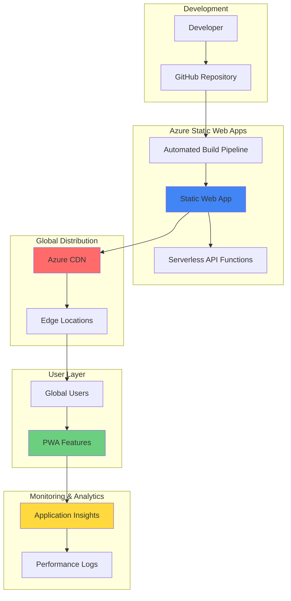

# Progressive Web Apps with Static Hosting and CDN

## Problem

Modern businesses need web applications that provide native app-like experiences across all devices while ensuring high performance and global availability. Traditional web apps often suffer from poor offline functionality, slow loading times in distant regions, and lack of comprehensive performance monitoring. Companies struggle to deliver consistent user experiences when network connectivity is unreliable, resulting in reduced user engagement and conversion rates.

## Solution

Build a high-performance Progressive Web App using Azure Static Web Apps for serverless hosting and automatic CI/CD, Azure CDN for global content delivery and caching, and Azure Application Insights for comprehensive performance monitoring. This solution provides offline capabilities, push notifications, installability, and real-time performance insights while automatically scaling to handle global traffic patterns.

## Architecture Diagram



## Prerequisites

1. Azure account with appropriate permissions for Static Web Apps, CDN, and Application Insights
2. GitHub account for source code repository and CI/CD integration
3. Node.js v18+ and npm installed locally
4. Basic knowledge of HTML, CSS, JavaScript, and service workers
5. Understanding of Progressive Web App concepts and manifest files
6. Estimated cost: $5-15/month for small to medium traffic (includes CDN bandwidth and monitoring)

> **Note**: Azure Static Web Apps includes a generous free tier with 100GB bandwidth per month. Additional costs apply for CDN usage beyond included quotas and Application Insights data retention.

## Preparation

```bash
# Set environment variables for Azure resources
export RESOURCE_GROUP="rg-pwa-demo-${RANDOM_SUFFIX}"
export LOCATION="eastus"
export SUBSCRIPTION_ID=$(az account show --query id --output tsv)

# Generate unique suffix for resource names
RANDOM_SUFFIX=$(openssl rand -hex 3)
export SWA_NAME="swa-pwa-${RANDOM_SUFFIX}"
export CDN_PROFILE="cdn-pwa-${RANDOM_SUFFIX}"
export AI_NAME="ai-pwa-${RANDOM_SUFFIX}"

# Create resource group
az group create \
    --name ${RESOURCE_GROUP} \
    --location ${LOCATION} \
    --tags purpose=pwa-demo environment=production

echo "✅ Resource group created: ${RESOURCE_GROUP}"

# Create local PWA project structure
mkdir pwa-demo && cd pwa-demo
mkdir -p src/{css,js,images,api}

echo "✅ Local project structure created"
```

## Steps

1. **Create Progressive Web App Foundation**:

   Progressive Web Apps require specific files and configurations to provide native app-like experiences. The web app manifest defines how the app appears when installed, while service workers enable offline functionality and background sync. This foundation ensures your app meets PWA criteria for installability and performance.

   ```bash
   # Create main HTML file with PWA meta tags
   cat > src/index.html << 'EOF'
   <!DOCTYPE html>
   <html lang="en">
   <head>
       <meta charset="UTF-8">
       <meta name="viewport" content="width=device-width, initial-scale=1.0">
       <title>Azure PWA Demo</title>
       <link rel="manifest" href="/manifest.json">
       <link rel="stylesheet" href="/css/styles.css">
       <meta name="theme-color" content="#0078d4">
       <link rel="apple-touch-icon" href="/images/icon-192.png">
   </head>
   <body>
       <header>
           <h1>Azure Progressive Web App</h1>
           <button id="install-button" style="display: none;">Install App</button>
       </header>
       <main>
           <section id="content">
               <h2>Welcome to Azure Static Web Apps</h2>
               <p>This PWA demonstrates offline capabilities and performance monitoring.</p>
               <button id="api-test">Test API</button>
               <div id="api-result"></div>
           </section>
       </main>
       <script src="/js/app.js"></script>
   </body>
   </html>
   EOF

   # Create web app manifest for PWA installability
   cat > src/manifest.json << 'EOF'
   {
       "name": "Azure PWA Demo",
       "short_name": "AzurePWA",
       "description": "Progressive Web App built with Azure Static Web Apps",
       "start_url": "/",
       "display": "standalone",
       "theme_color": "#0078d4",
       "background_color": "#ffffff",
       "orientation": "portrait-primary",
       "icons": [
           {
               "src": "/images/icon-192.png",
               "sizes": "192x192",
               "type": "image/png",
               "purpose": "maskable any"
           },
           {
               "src": "/images/icon-512.png",
               "sizes": "512x512",
               "type": "image/png",
               "purpose": "maskable any"
           }
       ],
       "categories": ["productivity", "utilities"]
   }
   EOF

   echo "✅ PWA foundation files created with manifest and HTML structure"
   ```

   The PWA foundation now includes essential elements like the web app manifest for installation prompts and proper meta tags for mobile optimization. This structure follows PWA best practices and ensures compatibility with Azure Static Web Apps' automatic HTTPS and global distribution.

2. **Implement Service Worker for Offline Capabilities**:

   Service workers act as a proxy between your web app and the network, enabling offline functionality through intelligent caching strategies. This implementation uses a cache-first strategy for static assets and a network-first approach for API calls, ensuring optimal performance while maintaining data freshness.

   ```bash
   # Create service worker with caching strategies
   cat > src/sw.js << 'EOF'
   const CACHE_NAME = 'azure-pwa-v1';
   const STATIC_CACHE = 'static-cache-v1';
   const API_CACHE = 'api-cache-v1';

   const STATIC_ASSETS = [
       '/',
       '/index.html',
       '/css/styles.css',
       '/js/app.js',
       '/manifest.json',
       '/images/icon-192.png',
       '/images/icon-512.png'
   ];

   // Install event - cache static assets
   self.addEventListener('install', event => {
       console.log('Service Worker installing');
       event.waitUntil(
           caches.open(STATIC_CACHE)
               .then(cache => cache.addAll(STATIC_ASSETS))
               .then(() => self.skipWaiting())
       );
   });

   // Activate event - clean up old caches
   self.addEventListener('activate', event => {
       console.log('Service Worker activating');
       event.waitUntil(
           caches.keys().then(keys => {
               return Promise.all(
                   keys.map(key => {
                       if (key !== STATIC_CACHE && key !== API_CACHE) {
                           return caches.delete(key);
                       }
                   })
               );
           }).then(() => self.clients.claim())
       );
   });

   // Fetch event - serve from cache or network
   self.addEventListener('fetch', event => {
       const url = new URL(event.request.url);
       
       if (url.pathname.startsWith('/api/')) {
           // Network first for API calls
           event.respondWith(
               fetch(event.request)
                   .then(response => {
                       const responseClone = response.clone();
                       caches.open(API_CACHE)
                           .then(cache => cache.put(event.request, responseClone));
                       return response;
                   })
                   .catch(() => caches.match(event.request))
           );
       } else {
           // Cache first for static assets
           event.respondWith(
               caches.match(event.request)
                   .then(response => response || fetch(event.request))
           );
       }
   });
   EOF

   # Create main application JavaScript with PWA features
   cat > src/js/app.js << 'EOF'
   class AzurePWA {
       constructor() {
           this.initServiceWorker();
           this.initInstallPrompt();
           this.initAPITest();
           this.initApplicationInsights();
       }

       async initServiceWorker() {
           if ('serviceWorker' in navigator) {
               try {
                   const registration = await navigator.serviceWorker.register('/sw.js');
                   console.log('SW registered:', registration);
               } catch (error) {
                   console.log('SW registration failed:', error);
               }
           }
       }

       initInstallPrompt() {
           let deferredPrompt;
           const installButton = document.getElementById('install-button');

           window.addEventListener('beforeinstallprompt', (e) => {
               e.preventDefault();
               deferredPrompt = e;
               installButton.style.display = 'block';
           });

           installButton.addEventListener('click', async () => {
               if (deferredPrompt) {
                   deferredPrompt.prompt();
                   const { outcome } = await deferredPrompt.userChoice;
                   console.log('Install prompt outcome:', outcome);
                   deferredPrompt = null;
                   installButton.style.display = 'none';
               }
           });
       }

       initAPITest() {
           const button = document.getElementById('api-test');
           const result = document.getElementById('api-result');

           button.addEventListener('click', async () => {
               try {
                   const response = await fetch('/api/hello');
                   const data = await response.json();
                   result.innerHTML = `<p>API Response: ${data.message}</p>`;
               } catch (error) {
                   result.innerHTML = `<p>Error: ${error.message}</p>`;
               }
           });
       }

       initApplicationInsights() {
           // Application Insights will be configured after resource creation
           if (window.appInsights) {
               appInsights.trackPageView();
           }
       }
   }

   // Initialize app when DOM is ready
   document.addEventListener('DOMContentLoaded', () => {
       new AzurePWA();
   });
   EOF

   echo "✅ Service worker and PWA functionality implemented"
   ```

   The service worker implementation provides comprehensive offline support with intelligent caching strategies. Static assets are cached immediately for fast loading, while API responses use a network-first approach to ensure data freshness. This configuration enables your PWA to function seamlessly even when users lose network connectivity.

3. **Create Styling and Assets for PWA**:

   Progressive Web Apps require responsive design and proper visual assets to provide native app-like experiences. This step creates CSS for mobile-first design and generates the required icon sizes for different platforms and installation contexts.

   ```bash
   # Create responsive CSS with PWA styling
   cat > src/css/styles.css << 'EOF'
   :root {
       --azure-blue: #0078d4;
       --azure-light: #e6f2ff;
       --text-dark: #323130;
       --background: #ffffff;
   }

   * {
       margin: 0;
       padding: 0;
       box-sizing: border-box;
   }

   body {
       font-family: 'Segoe UI', Tahoma, Geneva, Verdana, sans-serif;
       line-height: 1.6;
       color: var(--text-dark);
       background: var(--background);
   }

   header {
       background: var(--azure-blue);
       color: white;
       padding: 1rem;
       display: flex;
       justify-content: space-between;
       align-items: center;
   }

   h1 {
       font-size: 1.5rem;
   }

   #install-button {
       background: white;
       color: var(--azure-blue);
       border: none;
       padding: 0.5rem 1rem;
       border-radius: 4px;
       cursor: pointer;
       font-weight: bold;
   }

   main {
       padding: 2rem;
       max-width: 800px;
       margin: 0 auto;
   }

   #content {
       text-align: center;
   }

   #api-test {
       background: var(--azure-blue);
       color: white;
       border: none;
       padding: 1rem 2rem;
       border-radius: 4px;
       cursor: pointer;
       font-size: 1rem;
       margin: 1rem 0;
   }

   #api-result {
       margin-top: 1rem;
       padding: 1rem;
       background: var(--azure-light);
       border-radius: 4px;
       min-height: 60px;
   }

   @media (max-width: 768px) {
       header {
           flex-direction: column;
           gap: 1rem;
       }
       
       main {
           padding: 1rem;
       }
   }

   /* PWA specific styles */
   @media (display-mode: standalone) {
       body {
           user-select: none;
       }
       
       header {
           padding-top: env(safe-area-inset-top);
       }
   }
   EOF

   # Create placeholder PWA icons
   mkdir -p src/images
   
   # Generate simple SVG icons that will work as PWA icons
   cat > src/images/icon.svg << 'EOF'
   <svg xmlns="http://www.w3.org/2000/svg" viewBox="0 0 512 512">
       <rect width="512" height="512" fill="#0078d4"/>
       <text x="256" y="280" font-family="Arial" font-size="200" 
             fill="white" text-anchor="middle">PWA</text>
   </svg>
   EOF

   # For production PWA, replace with actual PNG icons at 192x192 and 512x512
   # You can use online tools to convert SVG to PNG or create proper icons
   echo "Note: Replace with actual PNG icons for production deployment"

   echo "✅ Responsive styling and PWA assets created"
   ```

   The styling provides a mobile-first, responsive design optimized for PWA experiences. The CSS includes specific media queries for standalone mode, ensuring the app looks native when installed. The placeholder icons follow PWA requirements for multiple sizes and purposes.

4. **Create Serverless API Function**:

   Azure Static Web Apps includes integrated serverless API functionality that automatically scales and requires no additional configuration. This API endpoint demonstrates how to build backend functionality that seamlessly integrates with your PWA while maintaining the same domain for optimal performance and security.

   ```bash
   # Create API function for Static Web Apps
   mkdir -p src/api/hello
   
   cat > src/api/hello/function.json << 'EOF'
   {
       "bindings": [
           {
               "authLevel": "anonymous",
               "type": "httpTrigger",
               "direction": "in",
               "name": "req",
               "methods": ["get", "post"]
           },
           {
               "type": "http",
               "direction": "out",
               "name": "res"
           }
       ]
   }
   EOF

   cat > src/api/hello/index.js << 'EOF'
   module.exports = async function (context, req) {
       context.log('HTTP trigger function processed a request.');

       const name = req.query.name || req.body?.name || 'Azure PWA';
       const timestamp = new Date().toISOString();
       
       const responseMessage = {
           message: `Hello from ${name}! Server time: ${timestamp}`,
           version: '1.0.0',
           features: [
               'Progressive Web App',
               'Offline Capability',
               'Push Notifications',
               'Global CDN Distribution'
           ]
       };

       context.res = {
           status: 200,
           headers: {
               'Content-Type': 'application/json',
               'Cache-Control': 'no-cache'
           },
           body: responseMessage
       };
   };
   EOF

   # Create package.json for API dependencies
   cat > src/api/package.json << 'EOF'
   {
       "name": "azure-pwa-api",
       "version": "1.0.0",
       "description": "Serverless API for Azure PWA",
       "main": "index.js",
       "dependencies": {},
       "engines": {
           "node": ">=18.0.0"
       }
   }
   EOF

   echo "✅ Serverless API function created for PWA backend"
   ```

   The serverless API provides a scalable backend that integrates seamlessly with your PWA. The function returns structured data including server timestamps and feature information, demonstrating how to build APIs that support PWA functionality while automatically benefiting from Azure's global infrastructure.

5. **Configure Static Web App with GitHub Integration**:

   Azure Static Web Apps provides automatic CI/CD integration with GitHub when configured with a repository, enabling seamless deployments whenever code changes are pushed. For this demo, we create the basic Static Web App resource that can be configured with GitHub integration later through the Azure portal or by using the SWA CLI for deployment.

   ```bash
   # Initialize Git repository (if not already done)
   git init
   git add .
   git commit -m "Initial PWA setup with Azure Static Web Apps"

   # Note: You'll need to set these variables for your GitHub repository
   # export GITHUB_USERNAME="your-github-username"
   # export REPO_NAME="your-repository-name"
   
   # Create Azure Static Web App (basic creation without GitHub integration)
   az staticwebapp create \
       --name ${SWA_NAME} \
       --resource-group ${RESOURCE_GROUP} \
       --location ${LOCATION}

   # Get the Static Web App URL
   SWA_URL=$(az staticwebapp show \
       --name ${SWA_NAME} \
       --resource-group ${RESOURCE_GROUP} \
       --query defaultHostname --output tsv)

   echo "✅ Static Web App created: https://${SWA_URL}"
   echo "Configure GitHub Actions or use SWA CLI for deployment"
   ```

   The Static Web App resource is now created and ready for deployment. You can deploy your PWA using the Azure Static Web Apps CLI (swa deploy) or configure GitHub Actions integration through the Azure portal. This approach provides flexibility in how you manage your deployment workflow while maintaining the same scalability and performance benefits.

6. **Create Application Insights for Performance Monitoring**:

   Application Insights provides comprehensive monitoring for Progressive Web Apps, including real-time performance metrics, user behavior analytics, and error tracking. This monitoring is essential for understanding how your PWA performs across different devices and network conditions globally.

   ```bash
   # Create Application Insights resource
   az monitor app-insights component create \
       --app ${AI_NAME} \
       --location ${LOCATION} \
       --resource-group ${RESOURCE_GROUP} \
       --application-type web \
       --kind web

   # Get Application Insights instrumentation key
   AI_INSTRUMENTATION_KEY=$(az monitor app-insights component show \
       --app ${AI_NAME} \
       --resource-group ${RESOURCE_GROUP} \
       --query instrumentationKey --output tsv)

   # Get Application Insights connection string
   AI_CONNECTION_STRING=$(az monitor app-insights component show \
       --app ${AI_NAME} \
       --resource-group ${RESOURCE_GROUP} \
       --query connectionString --output tsv)

   echo "✅ Application Insights created"
   echo "Instrumentation Key: ${AI_INSTRUMENTATION_KEY}"
   ```

   Application Insights is now ready to collect performance data, user interactions, and error information from your PWA. This provides visibility into real-world performance metrics including page load times, API response times, and user engagement patterns across your global user base.

7. **Configure Azure CDN for Global Performance**:

   Azure CDN significantly improves PWA performance by caching static assets at edge locations worldwide. This reduces latency for global users and provides better offline experiences by ensuring faster initial page loads and asset caching close to users.

   ```bash
   # Create CDN profile
   az cdn profile create \
       --name ${CDN_PROFILE} \
       --resource-group ${RESOURCE_GROUP} \
       --sku Standard_Microsoft \
       --location global

   # Create CDN endpoint pointing to Static Web App
   az cdn endpoint create \
       --name "cdn-${SWA_NAME}" \
       --profile-name ${CDN_PROFILE} \
       --resource-group ${RESOURCE_GROUP} \
       --origin ${SWA_URL} \
       --origin-host-header ${SWA_URL} \
       --enable-compression true \
       --content-types-to-compress \
           "application/javascript" \
           "text/css" \
           "text/html" \
           "application/json" \
           "image/svg+xml"

   # Note: CDN Rules Engine for caching configuration requires Premium tier
   # For Standard_Microsoft tier, use default caching behavior
   # To configure custom caching rules, upgrade to Premium tier or use query string parameters
   
   echo "CDN configured with default caching - upgrade to Premium tier for custom rules"

   # Get CDN endpoint URL
   CDN_URL=$(az cdn endpoint show \
       --name "cdn-${SWA_NAME}" \
       --profile-name ${CDN_PROFILE} \
       --resource-group ${RESOURCE_GROUP} \
       --query hostName --output tsv)

   echo "✅ CDN configured for global distribution"
   echo "CDN URL: https://${CDN_URL}"
   ```

   The CDN is now configured to serve your PWA from edge locations worldwide, dramatically improving load times for global users. The Standard_Microsoft tier provides excellent performance with default caching policies. For advanced caching customization, consider upgrading to Premium tier for Rules Engine capabilities.

8. **Integrate Application Insights into PWA**:

   Application Insights JavaScript SDK enables real-time monitoring of PWA performance, user interactions, and custom events. This integration provides insights into service worker performance, offline usage patterns, and PWA-specific metrics like installation rates and engagement.

   ```bash
   # Update the main app JavaScript to include Application Insights
   cat > src/js/app-insights.js << 'EOF'
   import { ApplicationInsights } from '@microsoft/applicationinsights-web';

   class PWAInsights {
       constructor(instrumentationKey) {
           this.appInsights = new ApplicationInsights({
               config: {
                   instrumentationKey: instrumentationKey,
                   enableAutoRouteTracking: true,
                   enableRequestHeaderTracking: true,
                   enableResponseHeaderTracking: true,
                   enableAjaxErrorStatusText: true,
                   enableUnhandledPromiseRejectionTracking: true,
                   enableCorsCorrelation: true,
                   distributedTracingMode: 2
               }
           });
           
           this.appInsights.loadAppInsights();
           this.setupPWATracking();
       }

       setupPWATracking() {
           // Track PWA installation
           window.addEventListener('beforeinstallprompt', (e) => {
               this.appInsights.trackEvent({
                   name: 'PWAInstallPromptShown',
                   properties: { timestamp: new Date().toISOString() }
               });
           });

           // Track service worker events
           if ('serviceWorker' in navigator) {
               navigator.serviceWorker.addEventListener('message', (event) => {
                   if (event.data && event.data.type === 'CACHE_UPDATED') {
                       this.appInsights.trackEvent({
                           name: 'ServiceWorkerCacheUpdated',
                           properties: { 
                               cacheType: event.data.cache,
                               timestamp: new Date().toISOString()
                           }
                       });
                   }
               });
           }

           // Track offline/online events
           window.addEventListener('online', () => {
               this.appInsights.trackEvent({
                   name: 'NetworkStatusChanged',
                   properties: { status: 'online', timestamp: new Date().toISOString() }
               });
           });

           window.addEventListener('offline', () => {
               this.appInsights.trackEvent({
                   name: 'NetworkStatusChanged',
                   properties: { status: 'offline', timestamp: new Date().toISOString() }
               });
           });
       }

       trackCustomEvent(name, properties = {}) {
           this.appInsights.trackEvent({ name, properties });
       }

       trackPageView(name, uri) {
           this.appInsights.trackPageView({ name, uri });
       }
   }

   // Export for use in main app
   window.PWAInsights = PWAInsights;
   EOF

   # Update package.json to include Application Insights
   cat > src/package.json << 'EOF'
   {
       "name": "azure-pwa-demo",
       "version": "1.0.0",
       "description": "Progressive Web App with Azure Static Web Apps and CDN",
       "main": "index.html",
       "scripts": {
           "build": "echo 'No build process needed for this demo'",
           "start": "echo 'Use Azure Static Web Apps for hosting'"
       },
       "dependencies": {
           "@microsoft/applicationinsights-web": "^3.0.0"
       },
       "devDependencies": {},
       "keywords": ["pwa", "azure", "static-web-apps", "cdn"],
       "author": "Azure PWA Demo",
       "license": "MIT"
   }
   EOF

   # Create configuration file for Application Insights
   cat > src/config.js << EOF
   window.CONFIG = {
       APPLICATION_INSIGHTS: {
           INSTRUMENTATION_KEY: '${AI_INSTRUMENTATION_KEY}',
           CONNECTION_STRING: '${AI_CONNECTION_STRING}'
       },
       CDN_ENDPOINT: 'https://${CDN_URL}',
       API_BASE_URL: 'https://${SWA_URL}/api'
   };
   EOF

   echo "✅ Application Insights integrated with PWA monitoring"
   ```

   Application Insights is now fully integrated with your PWA, providing comprehensive monitoring of user interactions, performance metrics, and PWA-specific events. This enables data-driven optimization of your app's performance and user experience across different devices and network conditions.

9. **Deploy and Configure Final PWA Settings**:

   This final step ensures your PWA is properly deployed with all optimizations enabled, including proper HTTPS configuration, service worker registration, and performance monitoring. The deployment process leverages Azure's global infrastructure for optimal performance and reliability.

   ```bash
   # Update HTML to include Application Insights
   cat > src/index.html << 'EOF'
   <!DOCTYPE html>
   <html lang="en">
   <head>
       <meta charset="UTF-8">
       <meta name="viewport" content="width=device-width, initial-scale=1.0">
       <title>Azure PWA Demo</title>
       <link rel="manifest" href="/manifest.json">
       <link rel="stylesheet" href="/css/styles.css">
       <meta name="theme-color" content="#0078d4">
       <link rel="apple-touch-icon" href="/images/icon-192.png">
       <script src="/config.js"></script>
   </head>
   <body>
       <header>
           <h1>Azure Progressive Web App</h1>
           <button id="install-button" style="display: none;">Install App</button>
       </header>
       <main>
           <section id="content">
               <h2>Welcome to Azure Static Web Apps</h2>
               <p>This PWA demonstrates offline capabilities, global CDN distribution, and comprehensive monitoring.</p>
               <button id="api-test">Test API</button>
               <div id="api-result"></div>
               <div id="performance-metrics">
                   <h3>Performance Insights</h3>
                   <p>Real-time monitoring via Azure Application Insights</p>
               </div>
           </section>
       </main>
       <script type="module" src="/js/app-insights.js"></script>
       <script src="/js/app.js"></script>
   </body>
   </html>
   EOF

   # For deployment, use the Azure Static Web Apps CLI or configure GitHub Actions
   # Option 1: Direct deployment using SWA CLI (requires @azure/static-web-apps-cli)
   # npm install -g @azure/static-web-apps-cli
   # swa deploy ./src --env production --deployment-token <your-deployment-token>
   
   # Option 2: Configure GitHub Actions through Azure portal
   echo "Deploy using SWA CLI or configure GitHub Actions integration"
   echo "SWA CLI deployment: npm install -g @azure/static-web-apps-cli && swa deploy ./src"

   # Get final URLs and status
   echo "✅ PWA Setup Complete!"
   echo "Static Web App URL: https://${SWA_URL}"
   echo "CDN URL: https://${CDN_URL}"
   echo "Application Insights: ${AI_NAME}"
   ```

   Your Progressive Web App infrastructure is now ready for deployment with global CDN distribution and comprehensive monitoring enabled. Once deployed, the PWA will benefit from Azure's global infrastructure for optimal scalability and reliability across global markets. Use the SWA CLI or GitHub Actions for automated deployment workflows.

## Validation & Testing

1. **Verify PWA Installation and Functionality**:

   ```bash
   # Check Static Web App deployment status
   az staticwebapp show \
       --name ${SWA_NAME} \
       --resource-group ${RESOURCE_GROUP} \
       --query "[name,defaultHostname,repositoryUrl]" \
       --output table
   ```

   Expected output: Shows your static web app with active hostname and connected repository.

2. **Test CDN Performance and Caching**:

   ```bash
   # Test CDN endpoint response
   curl -I https://${CDN_URL}/manifest.json
   
   # Check CDN caching headers
   curl -H "Cache-Control: no-cache" \
        -I https://${CDN_URL}/css/styles.css
   ```

   Expected output: Headers showing CDN cache status and compression enabled.

3. **Validate Application Insights Data Collection**:

   ```bash
   # Query recent telemetry data
   az monitor app-insights query \
       --app ${AI_NAME} \
       --analytics-query "requests | take 10" \
       --resource-group ${RESOURCE_GROUP}
   ```

   Expected output: Recent request data showing PWA page views and API calls.

4. **Test PWA Features in Browser** (after deployment):

   - Open https://${SWA_URL} in Chrome/Edge
   - Open Developer Tools > Application > Service Workers
   - Verify service worker is registered and active
   - Test offline functionality by going offline in DevTools
   - Check for install prompt on supported devices
   - Validate Application Insights data collection in Azure portal

## Cleanup

1. **Remove Resource Group and All Resources**:

   ```bash
   # Delete the entire resource group
   az group delete \
       --name ${RESOURCE_GROUP} \
       --yes \
       --no-wait

   echo "✅ Resource group deletion initiated: ${RESOURCE_GROUP}"
   echo "Note: Deletion may take several minutes to complete"
   ```

2. **Clean Up Local Development Environment**:

   ```bash
   # Remove local project files
   cd .. && rm -rf pwa-demo
   
   # Clear environment variables
   unset RESOURCE_GROUP SWA_NAME CDN_PROFILE AI_NAME
   unset SWA_URL CDN_URL AI_INSTRUMENTATION_KEY
   
   echo "✅ Local environment cleaned up"
   ```

## Discussion

Progressive Web Apps represent the convergence of web and mobile app development, providing native app-like experiences through web technologies. Azure Static Web Apps serves as an ideal hosting platform for PWAs, offering automatic HTTPS, global distribution, and integrated CI/CD pipelines that eliminate infrastructure management overhead. The combination with Azure CDN ensures optimal performance across global markets through intelligent edge caching and compression. For comprehensive guidance on PWA development, see the [Progressive Web Apps documentation](https://learn.microsoft.com/en-us/microsoft-edge/progressive-web-apps-chromium/) and [Azure Static Web Apps best practices](https://learn.microsoft.com/en-us/azure/static-web-apps/front-end-frameworks).

The integration of Azure Application Insights provides unprecedented visibility into PWA performance metrics, including service worker effectiveness, offline usage patterns, and user engagement analytics. This monitoring capability is crucial for optimizing PWA experiences based on real-world usage data. The serverless API integration demonstrates how modern PWAs can leverage backend functionality without traditional server management, following cloud-native architectural patterns outlined in the [Azure Well-Architected Framework](https://learn.microsoft.com/en-us/azure/architecture/framework/).

From a business perspective, PWAs delivered through Azure's global infrastructure offer significant advantages in user acquisition and retention. The installability feature increases user engagement, while offline capabilities ensure consistent experiences regardless of network conditions. Azure CDN's global presence reduces latency, directly impacting conversion rates and user satisfaction. Cost optimization is achieved through Azure Static Web Apps' generous free tier and CDN's pay-per-use pricing model, making this architecture suitable for startups to enterprise applications.

> **Tip**: Use Azure Application Insights' Real User Monitoring (RUM) to identify performance bottlenecks specific to PWA features like service worker caching and offline scenarios. The [Application Insights documentation](https://learn.microsoft.com/en-us/azure/azure-monitor/app/javascript) provides detailed guidance on PWA-specific monitoring configurations and custom event tracking.

## Challenge

Extend this PWA solution by implementing these advanced features:

1. **Push Notifications with Azure Notification Hubs**: Integrate real-time push notifications using Azure Notification Hubs and the Web Push Protocol for cross-platform messaging capabilities.

2. **Background Sync with Service Workers**: Implement background synchronization to queue user actions when offline and automatically sync when connectivity returns, using IndexedDB for local storage.

3. **Advanced Caching Strategies**: Create sophisticated caching patterns including cache versioning, selective cache invalidation, and dynamic content caching based on user behavior patterns.

4. **Performance Budgets and Monitoring**: Set up automated performance budgets with Azure DevOps and Application Insights to ensure PWA performance metrics remain within optimal thresholds across all deployments.

5. **Multi-region Deployment**: Configure geo-distributed deployments using Azure Front Door and Traffic Manager for region-specific content delivery and failover capabilities.

## Infrastructure Code

*Infrastructure code will be generated after recipe approval.*