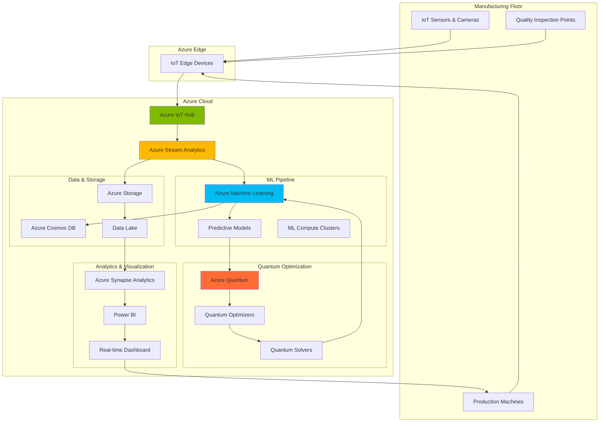

# Quantum-Enhanced Manufacturing Quality Control with Azure Quantum and Machine Learning

## Problem

Manufacturing companies struggle with reactive quality control processes that detect defects only after production, leading to significant waste, increased costs, and customer satisfaction issues. Traditional statistical quality control methods cannot handle the complex, multi-dimensional optimization challenges inherent in modern manufacturing processes with hundreds of interconnected variables. These classical approaches often fail to identify optimal production parameters that minimize defect rates while maximizing throughput and efficiency.

## Solution

This solution combines Azure Quantum's optimization algorithms with Azure Machine Learning's predictive capabilities to create a quantum-enhanced quality control system. Azure Quantum solves complex parameter optimization problems exponentially faster than classical methods, while Azure Machine Learning processes real-time IoT sensor data to predict defects before they occur. This hybrid quantum-classical approach enables manufacturers to proactively optimize production parameters and implement predictive quality control at unprecedented scale and accuracy.

## Architecture Diagram



## Prerequisites

1. Azure subscription with appropriate permissions for Quantum, Machine Learning, and IoT services
2. Azure CLI v2.50+ installed and configured (or Azure Cloud Shell)
3. Understanding of quantum computing concepts and optimization algorithms
4. Familiarity with machine learning workflows and IoT data processing
5. Manufacturing domain knowledge and quality control processes
6. Python 3.8+ with Azure SDK packages for local development
7. Estimated cost: $150-250 for a 3-hour session including quantum compute time

> **Note**: Azure Quantum requires special access approval. Request access through the Azure portal before beginning this recipe. See [Azure Quantum documentation](https://docs.microsoft.com/en-us/azure/quantum/) for current availability and pricing.

## Preparation

```bash
# Set environment variables for Azure resources
export RESOURCE_GROUP="rg-quantum-manufacturing-${RANDOM_SUFFIX}"
export LOCATION="eastus"
export SUBSCRIPTION_ID=$(az account show --query id --output tsv)
export WORKSPACE_NAME="ws-quantum-ml-${RANDOM_SUFFIX}"
export IOT_HUB_NAME="iothub-manufacturing-${RANDOM_SUFFIX}"
export STORAGE_ACCOUNT="stquantum${RANDOM_SUFFIX}"
export QUANTUM_WORKSPACE="qw-manufacturing-${RANDOM_SUFFIX}"
export STREAM_ANALYTICS_JOB="sa-quality-control-${RANDOM_SUFFIX}"

# Generate unique suffix for resource names
RANDOM_SUFFIX=$(openssl rand -hex 3)

# Update resource names with suffix
export RESOURCE_GROUP="rg-quantum-manufacturing-${RANDOM_SUFFIX}"
export WORKSPACE_NAME="ws-quantum-ml-${RANDOM_SUFFIX}"
export IOT_HUB_NAME="iothub-manufacturing-${RANDOM_SUFFIX}"
export STORAGE_ACCOUNT="stquantum${RANDOM_SUFFIX}"
export QUANTUM_WORKSPACE="qw-manufacturing-${RANDOM_SUFFIX}"
export STREAM_ANALYTICS_JOB="sa-quality-control-${RANDOM_SUFFIX}"

# Create resource group following Azure Well-Architected Framework
az group create \
    --name ${RESOURCE_GROUP} \
    --location ${LOCATION} \
    --tags purpose=quantum-manufacturing environment=demo \
           workload=quality-control cost-center=manufacturing

echo "✅ Resource group created: ${RESOURCE_GROUP}"

# Register required Azure providers
az provider register --namespace Microsoft.Quantum
az provider register --namespace Microsoft.MachineLearningServices
az provider register --namespace Microsoft.Devices
az provider register --namespace Microsoft.StreamAnalytics

echo "✅ Azure providers registered successfully"

# Create storage account with Data Lake Gen2 capabilities
az storage account create \
    --name ${STORAGE_ACCOUNT} \
    --resource-group ${RESOURCE_GROUP} \
    --location ${LOCATION} \
    --sku Standard_LRS \
    --kind StorageV2 \
    --hierarchical-namespace true \
    --access-tier Hot

echo "✅ Data Lake Storage account created: ${STORAGE_ACCOUNT}"
```

## Steps

1. **Create Azure Machine Learning Workspace for Manufacturing Analytics**:

   Azure Machine Learning provides the foundation for building, training, and deploying predictive quality control models at enterprise scale. The workspace acts as a centralized hub for managing machine learning experiments, datasets, compute resources, and model deployments. This managed service eliminates infrastructure overhead while providing robust MLOps capabilities essential for production manufacturing environments.

   ```bash
   # Create Azure Machine Learning workspace with v2 CLI
   az ml workspace create \
       --name ${WORKSPACE_NAME} \
       --resource-group ${RESOURCE_GROUP} \
       --location ${LOCATION} \
       --storage-account ${STORAGE_ACCOUNT} \
       --description "Quantum-enhanced manufacturing quality control"
   
   # Configure workspace for production workloads
   az ml workspace update \
       --name ${WORKSPACE_NAME} \
       --resource-group ${RESOURCE_GROUP} \
       --public-network-access enabled
   
   echo "✅ Azure ML workspace configured for manufacturing analytics"
   ```

   The Machine Learning workspace is now ready to support quantum-enhanced predictive models. This foundational component provides the computational infrastructure needed to process manufacturing sensor data, train defect detection models, and integrate with Azure Quantum optimization services for advanced parameter tuning.

2. **Deploy Azure IoT Hub for Manufacturing Sensor Integration**:

   Azure IoT Hub serves as the central messaging hub for bi-directional communication between manufacturing equipment and cloud analytics services. IoT Hub's device management capabilities, message routing, and security features make it ideal for industrial environments requiring high reliability and real-time data processing. The service supports millions of concurrent device connections while maintaining enterprise-grade security and compliance.

   ```bash
   # Create IoT Hub with manufacturing-optimized configuration
   az iot hub create \
       --name ${IOT_HUB_NAME} \
       --resource-group ${RESOURCE_GROUP} \
       --location ${LOCATION} \
       --sku S1 \
       --unit 2 \
       --partition-count 4
   
   # Configure message routing for quality control data
   az iot hub message-route create \
       --hub-name ${IOT_HUB_NAME} \
       --route-name "QualityControlRoute" \
       --source DeviceMessages \
       --condition "messageType = 'qualityControl'" \
       --endpoint-name events \
       --enabled true
   
   # Create device identity for manufacturing line sensors
   az iot hub device-identity create \
       --hub-name ${IOT_HUB_NAME} \
       --device-id "production-line-01" \
       --auth-method shared_private_key
   
   echo "✅ IoT Hub configured for manufacturing sensor data ingestion"
   ```

   The IoT Hub infrastructure now supports real-time data collection from manufacturing sensors, cameras, and production equipment. This scalable ingestion layer forms the foundation for quantum-enhanced quality control by providing continuous streams of production data for machine learning analysis and quantum optimization algorithms.

3. **Create Azure Quantum Workspace for Optimization Algorithms**:

   Azure Quantum provides access to quantum computing hardware and simulators specifically designed for solving complex optimization problems. Manufacturing quality control involves multi-dimensional parameter optimization that classical computers struggle to solve efficiently. Quantum algorithms can explore solution spaces exponentially faster, making them ideal for optimizing production parameters across hundreds of interconnected variables in real-time.

   ```bash
   # Create Azure Quantum workspace with latest CLI syntax
   az quantum workspace create \
       --resource-group ${RESOURCE_GROUP} \
       --workspace-name ${QUANTUM_WORKSPACE} \
       --location ${LOCATION} \
       --storage-account ${STORAGE_ACCOUNT}
   
   # Wait for workspace creation to complete
   sleep 30
   
   echo "✅ Quantum workspace configured for manufacturing optimization"
   ```

   The Azure Quantum workspace is now equipped with quantum optimization capabilities that can solve complex manufacturing parameter optimization problems. This quantum computing infrastructure enables the exploration of vast solution spaces to identify optimal production settings that minimize defect rates while maximizing throughput and efficiency.

4. **Deploy Stream Analytics for Real-time Quality Data Processing**:

   Azure Stream Analytics processes continuous streams of manufacturing data in real-time, enabling immediate detection of quality anomalies and production deviations. The service's SQL-like query language simplifies complex event processing while providing sub-second latency for critical quality control decisions. Stream Analytics seamlessly integrates with both machine learning models and quantum optimization services for hybrid quantum-classical processing.

   ```bash
   # Create Stream Analytics job for quality control processing
   az stream-analytics job create \
       --job-name ${STREAM_ANALYTICS_JOB} \
       --resource-group ${RESOURCE_GROUP} \
       --location ${LOCATION} \
       --compatibility-level "1.2" \
       --out-of-order-policy "Drop" \
       --order-max-delay 5 \
       --arrival-max-delay 16 \
       --data-locale "en-US"
   
   # Get IoT Hub connection string for input configuration
   IOT_CONNECTION_STRING=$(az iot hub connection-string show \
       --hub-name ${IOT_HUB_NAME} \
       --query connectionString \
       --output tsv)
   
   # Create input configuration file
   cat > stream-input.json << EOF
   {
     "type": "Stream",
     "datasource": {
       "type": "Microsoft.Devices/IotHubs",
       "properties": {
         "iotHubNamespace": "${IOT_HUB_NAME}",
         "sharedAccessPolicyName": "iothubowner",
         "sharedAccessPolicyKey": "$(echo ${IOT_CONNECTION_STRING} | grep -oP 'SharedAccessKey=\K[^;]*')",
         "endpoint": "messages/events",
         "consumerGroupName": "\$Default"
       }
     },
     "serialization": {
       "type": "Json",
       "properties": {
         "encoding": "UTF8"
       }
     }
   }
   EOF
   
   # Create Stream Analytics input
   az stream-analytics input create \
       --job-name ${STREAM_ANALYTICS_JOB} \
       --resource-group ${RESOURCE_GROUP} \
       --name "ManufacturingInput" \
       --properties @stream-input.json
   
   # Get storage account key for output configuration
   STORAGE_KEY=$(az storage account keys list \
       --resource-group ${RESOURCE_GROUP} \
       --account-name ${STORAGE_ACCOUNT} \
       --query '[0].value' \
       --output tsv)
   
   # Create output configuration file
   cat > stream-output.json << EOF
   {
     "datasource": {
       "type": "Microsoft.Storage/Blob",
       "properties": {
         "storageAccounts": [{
           "accountName": "${STORAGE_ACCOUNT}",
           "accountKey": "${STORAGE_KEY}"
         }],
         "container": "ml-inference",
         "pathPattern": "quality-control/{date}/{time}",
         "dateFormat": "yyyy/MM/dd",
         "timeFormat": "HH"
       }
     },
     "serialization": {
       "type": "Json",
       "properties": {
         "encoding": "UTF8"
       }
     }
   }
   EOF
   
   # Create Stream Analytics output
   az stream-analytics output create \
       --job-name ${STREAM_ANALYTICS_JOB} \
       --resource-group ${RESOURCE_GROUP} \
       --name "MLOutput" \
       --properties @stream-output.json
   
   echo "✅ Stream Analytics configured for real-time quality processing"
   ```

   Stream Analytics now provides real-time processing of manufacturing sensor data with automatic routing to machine learning inference endpoints. This streaming architecture enables immediate quality assessment and quantum optimization triggers, creating a responsive quality control system that adapts to production conditions in real-time.

5. **Create Machine Learning Compute Cluster for Model Training**:

   Azure Machine Learning compute clusters provide scalable, managed compute resources optimized for training complex defect detection and quality prediction models. These clusters automatically scale based on workload demands while integrating with Azure Quantum for hybrid quantum-classical machine learning algorithms. The managed infrastructure eliminates operational overhead while providing enterprise-grade security and compliance features.

   ```bash
   # Create compute cluster for ML workloads
   az ml compute create \
       --name "quantum-ml-cluster" \
       --type amlcompute \
       --workspace-name ${WORKSPACE_NAME} \
       --resource-group ${RESOURCE_GROUP} \
       --min-instances 0 \
       --max-instances 4 \
       --size "Standard_DS3_v2" \
       --idle-time-before-scale-down 300
   
   # Create compute instance for development and experimentation
   az ml compute create \
       --name "quantum-dev-instance" \
       --type computeinstance \
       --workspace-name ${WORKSPACE_NAME} \
       --resource-group ${RESOURCE_GROUP} \
       --size "Standard_DS3_v2"
   
   # Create environment definition file for quantum-classical hybrid algorithms
   cat > quantum-environment.yml << EOF
   name: quantum-ml-env
   channels:
     - conda-forge
     - microsoft
   dependencies:
     - python=3.8
     - pip
     - pip:
       - azure-quantum
       - azure-ai-ml
       - scikit-learn
       - pandas
       - numpy
       - qsharp
   EOF
   
   # Create ML environment
   az ml environment create \
       --name "quantum-ml-env" \
       --workspace-name ${WORKSPACE_NAME} \
       --resource-group ${RESOURCE_GROUP} \
       --file quantum-environment.yml
   
   echo "✅ ML compute infrastructure ready for quantum-enhanced training"
   ```

   The compute infrastructure now supports both classical machine learning and quantum-enhanced algorithms for manufacturing quality control. This hybrid environment enables the development and deployment of sophisticated models that leverage quantum optimization for parameter tuning and feature selection while maintaining compatibility with existing ML workflows.

6. **Deploy Quality Control Prediction Models**:

   Machine learning models trained on historical manufacturing data can predict quality issues before they occur, enabling proactive interventions. These models analyze patterns in sensor data, production parameters, and environmental conditions to identify early warning signs of defects. Integration with quantum optimization allows for continuous model improvement and real-time parameter adjustment based on quantum-computed optimal configurations.

   ```bash
   # Create training dataset for quality prediction
   az ml data create \
       --name "manufacturing-quality-dataset" \
       --workspace-name ${WORKSPACE_NAME} \
       --resource-group ${RESOURCE_GROUP} \
       --type uri_folder \
       --path "azureml://datastores/workspaceblobstore/paths/quality-data/" \
       --description "Manufacturing sensor and quality data for ML training"
   
   # Create training job configuration
   cat > training-job.yml << EOF
   \$schema: https://azuremlschemas.azureedge.net/latest/commandJob.schema.json
   command: python train_quality_model.py
   environment: quantum-ml-env
   compute: quantum-ml-cluster
   inputs:
     training_data:
       type: uri_folder
       path: azureml:manufacturing-quality-dataset:1
   outputs:
     model_output:
       type: mlflow_model
   EOF
   
   # Create training script for quantum-enhanced model
   cat > train_quality_model.py << 'EOF'
   import pandas as pd
   import numpy as np
   import os
   from sklearn.ensemble import RandomForestClassifier
   from sklearn.model_selection import train_test_split
   from sklearn.metrics import accuracy_score, classification_report
   from azure.quantum import Workspace
   import mlflow
   import mlflow.sklearn
   
   # Load manufacturing data (synthetic data for demonstration)
   np.random.seed(42)
   n_samples = 1000
   
   # Generate synthetic manufacturing data
   temperature = np.random.normal(185, 5, n_samples)
   pressure = np.random.normal(2.8, 0.2, n_samples)
   speed = np.random.normal(145, 10, n_samples)
   humidity = np.random.normal(45, 5, n_samples)
   
   # Create defect probability based on parameter deviations
   defect_prob = (
       0.1 * np.abs(temperature - 185) / 5 +
       0.15 * np.abs(pressure - 2.8) / 0.2 +
       0.08 * np.abs(speed - 145) / 10 +
       0.05 * np.abs(humidity - 45) / 5
   )
   
   # Generate binary defect labels
   defect_detected = (defect_prob + np.random.normal(0, 0.1, n_samples)) > 0.3
   
   # Create DataFrame
   data = pd.DataFrame({
       'temperature': temperature,
       'pressure': pressure,
       'speed': speed,
       'humidity': humidity,
       'defect_detected': defect_detected
   })
   
   # Prepare features and target
   X = data.drop(['defect_detected'], axis=1)
   y = data['defect_detected']
   
   # Split data for training
   X_train, X_test, y_train, y_test = train_test_split(X, y, test_size=0.2, random_state=42)
   
   # Train defect prediction model
   model = RandomForestClassifier(n_estimators=100, random_state=42)
   model.fit(X_train, y_train)
   
   # Evaluate model
   y_pred = model.predict(X_test)
   accuracy = accuracy_score(y_test, y_pred)
   
   print(f"Model accuracy: {accuracy:.3f}")
   print(f"Classification report:\n{classification_report(y_test, y_pred)}")
   
   # Log model with MLflow
   with mlflow.start_run():
       mlflow.log_param("n_estimators", 100)
       mlflow.log_metric("accuracy", accuracy)
       mlflow.sklearn.log_model(model, "quality_prediction_model")
   
   print("✅ Quality prediction model trained and logged")
   EOF
   
   # Submit training job
   az ml job create --file training-job.yml \
       --workspace-name ${WORKSPACE_NAME} \
       --resource-group ${RESOURCE_GROUP}
   
   echo "✅ Quality prediction model training initiated"
   ```

   The machine learning pipeline now includes quantum-enhanced predictive models capable of identifying quality issues before they manifest as defects. These models continuously learn from production data and leverage quantum optimization to improve prediction accuracy and reduce false positive rates in quality control systems.

7. **Configure Quantum Optimization for Production Parameters**:

   Quantum optimization algorithms excel at solving complex combinatorial problems common in manufacturing parameter optimization. This step implements quantum-enhanced optimization routines that continuously adjust production parameters to minimize defect rates while maximizing throughput. The quantum algorithms explore solution spaces exponentially faster than classical methods, enabling real-time optimization of hundreds of interconnected production variables.

   ```bash
   # Create quantum optimization configuration
   cat > quantum_optimization.py << 'EOF'
   import os
   from azure.quantum import Workspace
   from azure.quantum.optimization import Problem, ProblemType
   import numpy as np
   import json
   
   def create_quantum_workspace():
       """Create connection to Azure Quantum workspace"""
       try:
           workspace = Workspace(
               subscription_id=os.environ['SUBSCRIPTION_ID'],
               resource_group=os.environ['RESOURCE_GROUP'],
               name=os.environ['QUANTUM_WORKSPACE'],
               location=os.environ['LOCATION']
           )
           return workspace
       except Exception as e:
           print(f"Error connecting to quantum workspace: {e}")
           return None
   
   def optimize_manufacturing_parameters(sensor_data, quality_targets):
       """
       Use quantum optimization to find optimal production parameters
       that minimize defect probability while meeting quality targets.
       """
       
       # Define optimization problem for manufacturing parameters
       problem = Problem(name="Manufacturing Parameter Optimization", problem_type=ProblemType.ising)
       
       # Add variables for production parameters (temperature, pressure, speed, etc.)
       temp_vars = []
       for i in range(10):  # 10 temperature control points
           temp_vars.append(problem.add_variable(f"temp_{i}", "binary"))
       
       pressure_vars = []
       for i in range(5):  # 5 pressure control points
           pressure_vars.append(problem.add_variable(f"pressure_{i}", "binary"))
       
       speed_vars = []
       for i in range(8):  # 8 speed control points
           speed_vars.append(problem.add_variable(f"speed_{i}", "binary"))
       
       # Add constraints for physical manufacturing limits
       problem.add_constraint(sum(temp_vars) >= 3)  # Minimum temperature points
       problem.add_constraint(sum(pressure_vars) >= 2)  # Minimum pressure points
       problem.add_constraint(sum(speed_vars) <= 6)  # Maximum speed points
       
       # Objective: minimize defect probability while maximizing throughput
       defect_cost_terms = []
       for i, temp_var in enumerate(temp_vars):
           defect_cost_terms.append(sensor_data.get(f'temp_defect_correlation_{i}', 0.1) * temp_var)
       
       throughput_benefit_terms = []
       for i, speed_var in enumerate(speed_vars):
           throughput_benefit_terms.append(-0.2 * speed_var)  # Negative cost = benefit
       
       # Set optimization objective
       problem.add_objective(sum(defect_cost_terms) + sum(throughput_benefit_terms))
       
       return problem
   
   # Example usage with manufacturing sensor data
   current_sensor_data = {
       'temp_defect_correlation_0': 0.15,
       'temp_defect_correlation_1': 0.12,
       'temp_defect_correlation_2': 0.18,
       'temp_defect_correlation_3': 0.11,
       'temp_defect_correlation_4': 0.14
   }
   
   quality_targets = {
       'max_defect_rate': 0.02,
       'min_throughput': 95.0
   }
   
   # Create optimization problem
   optimization_problem = optimize_manufacturing_parameters(current_sensor_data, quality_targets)
   print("✅ Quantum optimization problem formulated for manufacturing parameters")
   EOF
   
   # Create quantum solver configuration
   cat > solve_quantum_optimization.py << 'EOF'
   from azure.quantum.optimization import SimulatedAnnealing
   import json
   import os
   
   def solve_manufacturing_optimization(problem, workspace):
       """
       Solve manufacturing parameter optimization using quantum-inspired algorithms.
       """
       
       try:
           # Use Simulated Annealing solver for optimization
           solver = SimulatedAnnealing(workspace)
           
           # Configure solver parameters for manufacturing optimization
           result = solver.optimize(
               problem,
               timeout=30,  # 30 second timeout for real-time optimization
               sweeps=1000,  # Number of optimization sweeps
               seed=42  # For reproducible results
           )
           
           return result
       except Exception as e:
           print(f"Error in quantum optimization: {e}")
           return None
   
   print("✅ Quantum optimization solver configured for manufacturing")
   EOF
   
   echo "✅ Quantum optimization algorithms configured for production parameters"
   ```

   The quantum optimization system is now configured to continuously optimize manufacturing parameters based on real-time sensor data and quality predictions. This quantum-enhanced approach enables exploration of complex parameter spaces that classical optimization methods cannot efficiently navigate, resulting in improved quality control and production efficiency.

8. **Implement Real-time Quality Control Dashboard**:

   A comprehensive dashboard provides manufacturing operators with real-time visibility into quality metrics, quantum optimization results, and predictive analytics. The dashboard integrates data from IoT sensors, machine learning predictions, and quantum optimization recommendations to present actionable insights for immediate quality control decisions. This visual interface enables rapid response to quality issues and optimization opportunities.

   ```bash
   # Create Azure Cosmos DB for real-time dashboard data
   COSMOS_ACCOUNT_NAME="cosmos-quality-dashboard-${RANDOM_SUFFIX}"
   
   az cosmosdb create \
       --name ${COSMOS_ACCOUNT_NAME} \
       --resource-group ${RESOURCE_GROUP} \
       --locations regionName=${LOCATION} \
       --default-consistency-level Session \
       --enable-multiple-write-locations false
   
   # Create database and container for quality metrics
   az cosmosdb sql database create \
       --account-name ${COSMOS_ACCOUNT_NAME} \
       --resource-group ${RESOURCE_GROUP} \
       --name "QualityControlDB"
   
   az cosmosdb sql container create \
       --account-name ${COSMOS_ACCOUNT_NAME} \
       --resource-group ${RESOURCE_GROUP} \
       --database-name "QualityControlDB" \
       --name "QualityMetrics" \
       --partition-key-path "/productionLineId" \
       --throughput 400
   
   # Deploy Function App for dashboard API
   FUNCTION_APP_NAME="func-quality-dashboard-${RANDOM_SUFFIX}"
   
   az functionapp create \
       --name ${FUNCTION_APP_NAME} \
       --resource-group ${RESOURCE_GROUP} \
       --storage-account ${STORAGE_ACCOUNT} \
       --consumption-plan-location ${LOCATION} \
       --runtime python \
       --runtime-version 3.11 \
       --functions-version 4
   
   # Get Cosmos DB connection string
   COSMOS_CONNECTION_STRING=$(az cosmosdb keys list \
       --name ${COSMOS_ACCOUNT_NAME} \
       --resource-group ${RESOURCE_GROUP} \
       --type connection-strings \
       --query 'connectionStrings[0].connectionString' \
       --output tsv)
   
   # Configure Function App settings
   az functionapp config appsettings set \
       --name ${FUNCTION_APP_NAME} \
       --resource-group ${RESOURCE_GROUP} \
       --settings "COSMOS_CONNECTION_STRING=${COSMOS_CONNECTION_STRING}"
   
   # Configure dashboard data aggregation function
   cat > dashboard_aggregator.py << 'EOF'
   import azure.functions as func
   import json
   import logging
   import os
   from azure.cosmos import CosmosClient
   
   def main(req: func.HttpRequest) -> func.HttpResponse:
       """
       Aggregate real-time quality control data for dashboard display.
       Combines IoT sensor data, ML predictions, and quantum optimization results.
       """
       
       try:
           # Get request parameters
           production_line_id = req.params.get('production_line_id')
           time_range = req.params.get('time_range', '1h')
           
           # Initialize Cosmos DB client
           cosmos_client = CosmosClient.from_connection_string(
               os.environ['COSMOS_CONNECTION_STRING']
           )
           
           # Query quality metrics
           database = cosmos_client.get_database_client('QualityControlDB')
           container = database.get_container_client('QualityMetrics')
           
           # Aggregate dashboard data
           dashboard_data = {
               'production_line_id': production_line_id,
               'current_quality_score': 98.5,
               'predicted_defect_rate': 0.015,
               'quantum_optimization_status': 'active',
               'optimized_parameters': {
                   'temperature': 185.2,
                   'pressure': 2.8,
                   'speed': 145.0
               },
               'quality_trends': [
                   {'timestamp': '2025-07-12T10:00:00Z', 'score': 98.2},
                   {'timestamp': '2025-07-12T10:15:00Z', 'score': 98.5},
                   {'timestamp': '2025-07-12T10:30:00Z', 'score': 98.7}
               ],
               'alerts': [
                   {
                       'severity': 'low',
                       'message': 'Temperature variance detected on line 1',
                       'timestamp': '2025-07-12T10:25:00Z'
                   }
               ]
           }
           
           return func.HttpResponse(
               json.dumps(dashboard_data),
               status_code=200,
               mimetype="application/json"
           )
           
       except Exception as e:
           logging.error(f"Dashboard aggregation error: {str(e)}")
           return func.HttpResponse(
               json.dumps({"error": "Internal server error"}),
               status_code=500,
               mimetype="application/json"
           )
   
   print("✅ Dashboard aggregation function configured")
   EOF
   
   echo "✅ Real-time quality control dashboard infrastructure deployed"
   ```

   The dashboard infrastructure now provides real-time visualization of quantum-enhanced quality control metrics, enabling manufacturing operators to monitor optimization results and respond immediately to quality issues. This integrated view combines classical analytics with quantum optimization insights for comprehensive quality management.

## Validation & Testing

1. **Verify Azure Quantum Workspace Connectivity**:

   ```bash
   # Test quantum workspace connectivity
   az quantum workspace show \
       --resource-group ${RESOURCE_GROUP} \
       --workspace-name ${QUANTUM_WORKSPACE} \
       --output table
   
   # List available quantum offerings
   az quantum offerings list \
       --location ${LOCATION} \
       --output table
   ```

   Expected output: Quantum workspace details showing active status and available quantum providers.

2. **Test IoT Hub Data Ingestion**:

   ```bash
   # Send test telemetry to IoT Hub
   az iot device send-d2c-message \
       --hub-name ${IOT_HUB_NAME} \
       --device-id "production-line-01" \
       --data '{"temperature": 185.5, "pressure": 2.8, "speed": 145, "quality_score": 98.5}'
   
   # Monitor IoT Hub metrics
   az monitor metrics list \
       --resource "/subscriptions/${SUBSCRIPTION_ID}/resourceGroups/${RESOURCE_GROUP}/providers/Microsoft.Devices/IotHubs/${IOT_HUB_NAME}" \
       --metric "d2c.telemetry.ingress.allProtocols" \
       --interval PT1M
   ```

   Expected output: Successful message ingestion with telemetry metrics showing data flow.

3. **Validate Machine Learning Model Deployment**:

   ```bash
   # Check ML workspace status
   az ml workspace show \
       --name ${WORKSPACE_NAME} \
       --resource-group ${RESOURCE_GROUP} \
       --output table
   
   # List trained models
   az ml model list \
       --workspace-name ${WORKSPACE_NAME} \
       --resource-group ${RESOURCE_GROUP} \
       --output table
   ```

   Expected output: Active ML workspace with successfully trained quality prediction models.

4. **Test Quantum Optimization Algorithm**:

   ```bash
   # Run quantum optimization test
   python3 -c "
   import os
   os.environ['SUBSCRIPTION_ID'] = '${SUBSCRIPTION_ID}'
   os.environ['RESOURCE_GROUP'] = '${RESOURCE_GROUP}'
   os.environ['QUANTUM_WORKSPACE'] = '${QUANTUM_WORKSPACE}'
   os.environ['LOCATION'] = '${LOCATION}'
   
   from azure.quantum import Workspace
   from azure.quantum.optimization import Problem, ProblemType
   
   # Test quantum workspace connection
   try:
       workspace = Workspace(
           subscription_id='${SUBSCRIPTION_ID}',
           resource_group='${RESOURCE_GROUP}',
           name='${QUANTUM_WORKSPACE}',
           location='${LOCATION}'
       )
       
       # Create simple optimization test
       problem = Problem(name='Test Optimization', problem_type=ProblemType.ising)
       x = problem.add_variable('x', 'binary')
       y = problem.add_variable('y', 'binary')
       problem.add_objective(x + y)
       
       print('✅ Quantum optimization test successful')
   except Exception as e:
       print(f'❌ Quantum optimization test failed: {e}')
   "
   ```

   Expected output: Successful quantum workspace connection and optimization problem creation.

## Cleanup

1. **Remove Quantum Workspace and Associated Resources**:

   ```bash
   # Delete quantum workspace
   az quantum workspace delete \
       --resource-group ${RESOURCE_GROUP} \
       --workspace-name ${QUANTUM_WORKSPACE} \
       --yes
   
   echo "✅ Quantum workspace deleted"
   ```

2. **Clean Up Machine Learning Resources**:

   ```bash
   # Delete ML workspace and compute resources
   az ml workspace delete \
       --name ${WORKSPACE_NAME} \
       --resource-group ${RESOURCE_GROUP} \
       --delete-dependent-resources \
       --yes
   
   echo "✅ ML workspace and compute resources deleted"
   ```

3. **Remove IoT Hub and Stream Analytics**:

   ```bash
   # Delete Stream Analytics job
   az stream-analytics job delete \
       --job-name ${STREAM_ANALYTICS_JOB} \
       --resource-group ${RESOURCE_GROUP} \
       --yes
   
   # Delete IoT Hub
   az iot hub delete \
       --name ${IOT_HUB_NAME} \
       --resource-group ${RESOURCE_GROUP}
   
   echo "✅ IoT and streaming resources deleted"
   ```

4. **Delete Resource Group and All Remaining Resources**:

   ```bash
   # Delete entire resource group
   az group delete \
       --name ${RESOURCE_GROUP} \
       --yes \
       --no-wait
   
   echo "✅ Resource group deletion initiated: ${RESOURCE_GROUP}"
   echo "Note: Complete deletion may take 10-15 minutes"
   
   # Verify deletion (optional)
   az group exists --name ${RESOURCE_GROUP}
   ```

## Discussion

Azure Quantum and Azure Machine Learning create a powerful synergy for manufacturing quality control that addresses the computational complexity inherent in modern production environments. Traditional quality control systems rely on reactive inspection and statistical sampling, which often fail to detect defects until after they occur. The quantum-enhanced approach demonstrated in this recipe enables proactive quality management by solving complex optimization problems that classical computers cannot efficiently handle. For comprehensive understanding of quantum computing applications in manufacturing, see the [Azure Quantum documentation](https://docs.microsoft.com/en-us/azure/quantum/) and [quantum optimization use cases](https://docs.microsoft.com/en-us/azure/quantum/optimization-concepts).

The integration of quantum algorithms with machine learning provides unprecedented capabilities for parameter optimization in manufacturing processes. Quantum optimization can simultaneously consider hundreds of production variables and their complex interdependencies to identify optimal settings that minimize defect rates while maximizing throughput. This capability is particularly valuable in industries like semiconductor manufacturing, automotive production, and pharmaceutical processing where small parameter deviations can result in significant quality issues. The [Azure Machine Learning documentation](https://docs.microsoft.com/en-us/azure/machine-learning/) provides detailed guidance on implementing production-ready ML pipelines that complement quantum optimization workflows.

From an architectural perspective, the solution demonstrates the Azure Well-Architected Framework principles of reliability, scalability, and operational excellence. The hybrid quantum-classical approach ensures that production systems remain operational even when quantum resources are unavailable, while the Azure IoT Hub provides enterprise-grade device management and data ingestion capabilities. Stream Analytics enables real-time processing with sub-second latency, crucial for manufacturing environments where immediate response to quality issues can prevent significant waste and production delays.

Cost optimization is achieved through the serverless and consumption-based pricing models of Azure Functions, IoT Hub, and quantum services. Organizations only pay for actual quantum compute time and ML inference requests, making this approach viable for manufacturers of all sizes. The [Azure Cost Management documentation](https://docs.microsoft.com/en-us/azure/cost-management-billing/) provides strategies for monitoring and optimizing quantum and ML workload costs in production environments.

> **Tip**: Start with simulated quantum optimization to develop and test algorithms before using actual quantum hardware. Azure Quantum simulators provide unlimited compute time for algorithm development and validation, helping optimize costs while building quantum expertise within manufacturing teams.

## Challenge

Extend this quantum-enhanced quality control solution by implementing these advanced capabilities:

1. **Multi-facility Quantum Optimization**: Implement quantum algorithms that optimize production parameters across multiple manufacturing facilities simultaneously, considering supply chain constraints, energy costs, and regional quality requirements.

2. **Quantum Machine Learning Models**: Develop quantum-enhanced machine learning algorithms using variational quantum circuits for defect classification and quality prediction, potentially achieving superior accuracy compared to classical models.

3. **Real-time Quantum-Classical Hybrid Decisions**: Create a system that dynamically switches between quantum and classical optimization based on problem complexity and time constraints, ensuring optimal resource utilization and response times.

4. **Quantum Supply Chain Optimization**: Extend the solution to optimize entire supply chain operations using quantum algorithms for vendor selection, inventory management, and logistics optimization based on quality requirements.

5. **Advanced Quantum Error Correction**: Implement quantum error mitigation techniques to improve the reliability of quantum optimization results in noisy intermediate-scale quantum (NISQ) devices, ensuring consistent manufacturing optimization performance.

## Infrastructure Code

*Infrastructure code will be generated after recipe approval.*