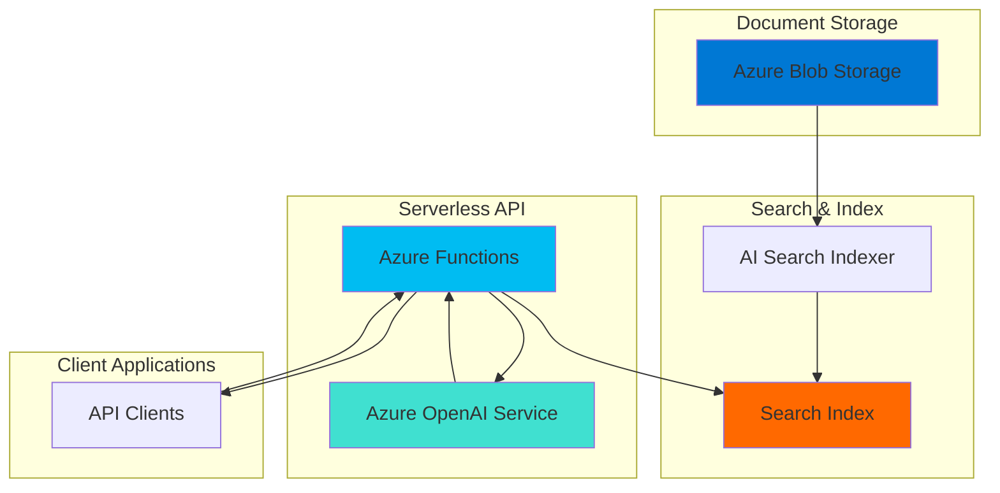

# RAG Knowledge Base with AI Search and Functions

## Problem

Organizations have vast amounts of unstructured documents containing valuable knowledge, but employees struggle to quickly find accurate answers to specific questions across these document collections. Traditional search solutions return entire documents rather than precise answers, forcing users to manually scan through lengthy content to find relevant information, resulting in decreased productivity and inconsistent responses to customer inquiries.

## Solution

Build a serverless knowledge base API using Retrieval-Augmented Generation (RAG) that automatically indexes documents in Azure AI Search, then provides intelligent question-answering through Azure Functions integrated with Azure OpenAI Service. This solution combines semantic search capabilities with large language model intelligence to deliver contextually accurate answers with proper source citations, eliminating manual document scanning while ensuring information accuracy.

## Architecture Diagram



## Prerequisites

1. Azure account with appropriate permissions for AI Search, Functions, OpenAI, and Blob Storage
2. Azure CLI installed and configured (or Azure Cloud Shell)
3. Basic understanding of REST APIs and serverless functions
4. Access to Azure OpenAI Service (requires approved access request)
5. Estimated cost: $15-25 for resources created during this tutorial

> **Note**: Azure OpenAI Service requires approval for access. Complete the request form at [Azure OpenAI access](https://aka.ms/oai/access) if you haven't already been granted access.

## Preparation

```bash
# Set environment variables for Azure resources
export RESOURCE_GROUP="rg-rag-kb-${RANDOM_SUFFIX}"
export LOCATION="eastus"
export SUBSCRIPTION_ID=$(az account show --query id --output tsv)

# Generate unique suffix for resource names
RANDOM_SUFFIX=$(openssl rand -hex 3)

# Set resource names with unique suffix
export STORAGE_ACCOUNT="ragkbstorage${RANDOM_SUFFIX}"
export SEARCH_SERVICE="rag-kb-search-${RANDOM_SUFFIX}"
export FUNCTION_APP="rag-kb-func-${RANDOM_SUFFIX}"
export OPENAI_SERVICE="rag-kb-openai-${RANDOM_SUFFIX}"

# Create resource group
az group create \
    --name ${RESOURCE_GROUP} \
    --location ${LOCATION} \
    --tags purpose=recipe environment=demo

echo "✅ Resource group created: ${RESOURCE_GROUP}"
```

## Steps

1. **Create Azure Blob Storage Account**:

   Azure Blob Storage provides the foundational document repository for your knowledge base. By enabling hierarchical namespace, you create a scalable storage layer that integrates seamlessly with Azure AI Search indexers for automatic content discovery and processing.

   ```bash
   # Create storage account with Data Lake capabilities
   az storage account create \
       --name ${STORAGE_ACCOUNT} \
       --resource-group ${RESOURCE_GROUP} \
       --location ${LOCATION} \
       --sku Standard_LRS \
       --kind StorageV2 \
       --hierarchical-namespace true
   
   # Get storage connection string
   STORAGE_CONNECTION=$(az storage account show-connection-string \
       --name ${STORAGE_ACCOUNT} \
       --resource-group ${RESOURCE_GROUP} \
       --query connectionString --output tsv)
   
   echo "✅ Storage account created: ${STORAGE_ACCOUNT}"
   ```

   The storage account now supports both blob operations and file system semantics, providing the flexibility needed for enterprise document management while maintaining compatibility with AI Search indexers.

2. **Create Document Container and Upload Sample Documents**:

   Creating a dedicated container organizes your knowledge base documents and establishes the source for AI Search indexing. This container serves as the single source of truth for all searchable content in your RAG system.

   ```bash
   # Create container for documents
   az storage container create \
       --name documents \
       --account-name ${STORAGE_ACCOUNT} \
       --connection-string "${STORAGE_CONNECTION}" \
       --public-access off
   
   # Create sample documents for testing
   cat > sample-doc1.txt << 'EOF'
   Azure Functions is a serverless compute service that lets you run event-triggered code without having to explicitly provision or manage infrastructure. With Azure Functions, you pay only for the time your code runs.
   
   Key features include:
   - Automatic scaling based on demand
   - Built-in integration with other Azure services
   - Support for multiple programming languages
   - Pay-per-execution pricing model
   EOF
   
   cat > sample-doc2.txt << 'EOF'
   Azure AI Search is a cloud search service that gives developers infrastructure, APIs, and tools for building a rich search experience. Use it to create search solutions over private, heterogeneous content in web, mobile, and enterprise applications.
   
   Core capabilities:
   - Full-text search with AI enrichment
   - Vector search for semantic similarity
   - Hybrid search combining keyword and vector
   - Built-in AI skills for content extraction
   EOF
   
   # Upload sample documents
   az storage blob upload \
       --file sample-doc1.txt \
       --name "azure-functions-overview.txt" \
       --container-name documents \
       --account-name ${STORAGE_ACCOUNT} \
       --connection-string "${STORAGE_CONNECTION}"
   
   az storage blob upload \
       --file sample-doc2.txt \
       --name "azure-search-overview.txt" \
       --container-name documents \
       --account-name ${STORAGE_ACCOUNT} \
       --connection-string "${STORAGE_CONNECTION}"
   
   echo "✅ Sample documents uploaded to documents container"
   ```

   Your knowledge base now contains sample documents that demonstrate different content types. In production, you would upload PDFs, Word documents, and other file formats that AI Search can automatically process and extract text from.

3. **Create Azure AI Search Service**:

   Azure AI Search provides the intelligent indexing and retrieval capabilities at the heart of your RAG solution. The Basic tier offers sufficient performance for development and small production workloads while providing semantic search capabilities.

   ```bash
   # Create AI Search service
   az search service create \
       --name ${SEARCH_SERVICE} \
       --resource-group ${RESOURCE_GROUP} \
       --location ${LOCATION} \
       --sku Basic \
       --replica-count 1 \
       --partition-count 1
   
   # Get search service admin key
   SEARCH_ADMIN_KEY=$(az search admin-key show \
       --service-name ${SEARCH_SERVICE} \
       --resource-group ${RESOURCE_GROUP} \
       --query primaryKey --output tsv)
   
   # Get search service URL
   SEARCH_ENDPOINT="https://${SEARCH_SERVICE}.search.windows.net"
   
   echo "✅ AI Search service created: ${SEARCH_SERVICE}"
   ```

   The AI Search service is now ready to index your documents and provide both keyword and semantic search capabilities. The Basic tier includes semantic search features that enhance retrieval accuracy for RAG scenarios.

4. **Create Azure OpenAI Service and Deploy Model**:

   Azure OpenAI Service provides access to advanced language models like GPT-4o for generating intelligent responses. Creating a dedicated OpenAI resource ensures consistent performance and allows for fine-tuned configuration for your knowledge base use case.

   ```bash
   # Create Azure OpenAI service
   az cognitiveservices account create \
       --name ${OPENAI_SERVICE} \
       --resource-group ${RESOURCE_GROUP} \
       --location ${LOCATION} \
       --kind OpenAI \
       --sku S0 \
       --custom-domain ${OPENAI_SERVICE}
   
   # Get OpenAI endpoint and key
   OPENAI_ENDPOINT=$(az cognitiveservices account show \
       --name ${OPENAI_SERVICE} \
       --resource-group ${RESOURCE_GROUP} \
       --query properties.endpoint --output tsv)
   
   OPENAI_API_KEY=$(az cognitiveservices account keys list \
       --name ${OPENAI_SERVICE} \
       --resource-group ${RESOURCE_GROUP} \
       --query key1 --output tsv)
   
   # Deploy GPT-4o model for chat completions
   az cognitiveservices account deployment create \
       --name ${OPENAI_SERVICE} \
       --resource-group ${RESOURCE_GROUP} \
       --deployment-name gpt-4o \
       --model-name gpt-4o \
       --model-version "2024-11-20" \
       --model-format OpenAI \
       --sku-capacity 10 \
       --sku-name Standard
   
   echo "✅ OpenAI service created with GPT-4o deployment: ${OPENAI_SERVICE}"
   ```

   Your OpenAI service now includes a GPT-4o deployment optimized for chat completions. This model provides enhanced natural language understanding and generation capabilities with multimodal support, ideal for your RAG knowledge base responses.

5. **Create Search Index with Vector Support**:

   The search index defines the structure for your searchable content, including both text fields for keyword search and vector fields for semantic similarity. This hybrid approach maximizes retrieval accuracy by combining multiple search techniques.

   ```bash
   # Create search index definition
   cat > search-index.json << 'EOF'
   {
     "name": "knowledge-base-index",
     "fields": [
       {
         "name": "id",
         "type": "Edm.String",
         "searchable": false,
         "filterable": true,
         "retrievable": true,
         "sortable": false,
         "facetable": false,
         "key": true
       },
       {
         "name": "content",
         "type": "Edm.String",
         "searchable": true,
         "filterable": false,
         "retrievable": true,
         "sortable": false,
         "facetable": false
       },
       {
         "name": "title",
         "type": "Edm.String",
         "searchable": true,
         "filterable": true,
         "retrievable": true,
         "sortable": true,
         "facetable": false
       },
       {
         "name": "metadata_storage_path",
         "type": "Edm.String",
         "searchable": false,
         "filterable": true,
         "retrievable": true,
         "sortable": false,
         "facetable": false
       }
     ],
     "semantic": {
       "configurations": [
         {
           "name": "semantic-config",
           "prioritizedFields": {
             "titleField": {
               "fieldName": "title"
             },
             "prioritizedContentFields": [
               {
                 "fieldName": "content"
               }
             ]
           }
         }
       ]
     }
   }
   EOF
   
   # Create the search index
   curl -X POST "${SEARCH_ENDPOINT}/indexes?api-version=2023-11-01" \
       -H "Content-Type: application/json" \
       -H "api-key: ${SEARCH_ADMIN_KEY}" \
       -d @search-index.json
   
   echo "✅ Search index created with semantic search configuration"
   ```

   The search index now supports both full-text search and semantic search capabilities. The semantic configuration prioritizes title and content fields, improving the relevance of retrieved documents for your RAG queries.

6. **Create and Configure Search Indexer**:

   The search indexer automatically discovers, processes, and indexes documents from your Blob Storage container. This creates a fully automated pipeline from document upload to searchable content, essential for maintaining an up-to-date knowledge base.

   ```bash
   # Create data source for blob storage
   cat > data-source.json << EOF
   {
     "name": "blob-datasource",
     "type": "azureblob",
     "credentials": {
       "connectionString": "${STORAGE_CONNECTION}"
     },
     "container": {
       "name": "documents"
     }
   }
   EOF
   
   # Create the data source
   curl -X POST "${SEARCH_ENDPOINT}/datasources?api-version=2023-11-01" \
       -H "Content-Type: application/json" \
       -H "api-key: ${SEARCH_ADMIN_KEY}" \
       -d @data-source.json
   
   # Create indexer configuration
   cat > indexer.json << 'EOF'
   {
     "name": "blob-indexer",
     "dataSourceName": "blob-datasource",
     "targetIndexName": "knowledge-base-index",
     "fieldMappings": [
       {
         "sourceFieldName": "metadata_storage_path",
         "targetFieldName": "id",
         "mappingFunction": {
           "name": "base64Encode"
         }
       },
       {
         "sourceFieldName": "content",
         "targetFieldName": "content"
       },
       {
         "sourceFieldName": "metadata_storage_name",
         "targetFieldName": "title"
       },
       {
         "sourceFieldName": "metadata_storage_path",
         "targetFieldName": "metadata_storage_path"
       }
     ],
     "schedule": {
       "interval": "PT15M"
     }
   }
   EOF
   
   # Create and run the indexer
   curl -X POST "${SEARCH_ENDPOINT}/indexers?api-version=2023-11-01" \
       -H "Content-Type: application/json" \
       -H "api-key: ${SEARCH_ADMIN_KEY}" \
       -d @indexer.json
   
   echo "✅ Search indexer created and running every 15 minutes"
   ```

   The indexer is now automatically processing your documents and creating searchable content. Field mappings ensure that blob metadata is properly stored in index fields, while the schedule keeps your index synchronized with document changes.

7. **Create Azure Function App**:

   Azure Functions provides the serverless API layer for your RAG system. By using a consumption plan, you only pay for actual function executions while benefiting from automatic scaling and built-in integration with other Azure services.

   ```bash
   # Create Function App with consumption plan
   az functionapp create \
       --name ${FUNCTION_APP} \
       --resource-group ${RESOURCE_GROUP} \
       --storage-account ${STORAGE_ACCOUNT} \
       --consumption-plan-location ${LOCATION} \
       --runtime python \
       --runtime-version 3.11 \
       --functions-version 4 \
       --os-type Linux
   
   # Configure application settings for AI services
   az functionapp config appsettings set \
       --name ${FUNCTION_APP} \
       --resource-group ${RESOURCE_GROUP} \
       --settings \
       "SEARCH_ENDPOINT=${SEARCH_ENDPOINT}" \
       "SEARCH_API_KEY=${SEARCH_ADMIN_KEY}" \
       "OPENAI_ENDPOINT=${OPENAI_ENDPOINT}" \
       "OPENAI_API_KEY=${OPENAI_API_KEY}" \
       "OPENAI_DEPLOYMENT=gpt-4o"
   
   echo "✅ Function App created: ${FUNCTION_APP}"
   ```

   Your Function App is now configured with all necessary connection information for AI Search and OpenAI services. The consumption plan ensures cost-effective operation while providing the scalability needed for production workloads.

8. **Deploy RAG Query Function**:

   The RAG query function implements the core retrieval-augmented generation logic, combining search results from AI Search with OpenAI's language model to generate accurate, contextual responses with proper source citations.

   ```bash
   # Create function code directory
   mkdir -p rag-function
   cd rag-function
   
   # Create requirements.txt for Python dependencies
   cat > requirements.txt << 'EOF'
   azure-functions>=1.18.0
   azure-search-documents>=11.4.0
   openai>=1.50.0
   requests>=2.31.0
   EOF
   
   # Create function.json for HTTP trigger
   mkdir -p rag_query
   cat > rag_query/function.json << 'EOF'
   {
     "scriptFile": "__init__.py",
     "bindings": [
       {
         "authLevel": "function",
         "type": "httpTrigger",
         "direction": "in",
         "name": "req",
         "methods": ["post"]
       },
       {
         "type": "http",
         "direction": "out",
         "name": "$return"
       }
     ]
   }
   EOF
   
   # Create the main function code
   cat > rag_query/__init__.py << 'EOF'
   import json
   import logging
   import os
   import azure.functions as func
   from azure.search.documents import SearchClient
   from azure.core.credentials import AzureKeyCredential
   from openai import AzureOpenAI
   
   def main(req: func.HttpRequest) -> func.HttpResponse:
       logging.info('RAG query function processed a request.')
       
       try:
           # Get query from request
           req_body = req.get_json()
           query = req_body.get('query', '')
           
           if not query:
               return func.HttpResponse(
                   json.dumps({"error": "Query parameter is required"}),
                   status_code=400,
                   mimetype="application/json"
               )
           
           # Initialize AI Search client
           search_endpoint = os.environ["SEARCH_ENDPOINT"]
           search_key = os.environ["SEARCH_API_KEY"]
           search_client = SearchClient(
               endpoint=search_endpoint,
               index_name="knowledge-base-index",
               credential=AzureKeyCredential(search_key)
           )
           
           # Perform hybrid search with semantic ranking
           search_results = search_client.search(
               search_text=query,
               query_type="semantic",
               semantic_configuration_name="semantic-config",
               top=3,
               select=["content", "title", "metadata_storage_path"]
           )
           
           # Collect search results for context
           context_docs = []
           for result in search_results:
               context_docs.append({
                   "title": result.get("title", ""),
                   "content": result.get("content", ""),
                   "source": result.get("metadata_storage_path", "")
               })
           
           if not context_docs:
               return func.HttpResponse(
                   json.dumps({"answer": "No relevant documents found.", "sources": []}),
                   status_code=200,
                   mimetype="application/json"
               )
           
           # Initialize Azure OpenAI client
           openai_client = AzureOpenAI(
               api_key=os.environ["OPENAI_API_KEY"],
               api_version="2024-10-21",
               azure_endpoint=os.environ["OPENAI_ENDPOINT"]
           )
           
           # Create context from search results
           context = "\n\n".join([
               f"Document: {doc['title']}\nContent: {doc['content']}"
               for doc in context_docs
           ])
           
           # Create prompt for OpenAI
           system_prompt = """You are a helpful assistant that answers questions based on the provided context documents. 
           Use only the information from the context to answer questions. If the context doesn't contain enough information 
           to answer the question, say so. Always cite the document sources in your response."""
           
           user_prompt = f"Context:\n{context}\n\nQuestion: {query}\n\nAnswer:"
           
           # Generate response using Azure OpenAI
           response = openai_client.chat.completions.create(
               model=os.environ["OPENAI_DEPLOYMENT"],
               messages=[
                   {"role": "system", "content": system_prompt},
                   {"role": "user", "content": user_prompt}
               ],
               max_tokens=500,
               temperature=0.3
           )
           
           answer = response.choices[0].message.content
           sources = [{"title": doc["title"], "source": doc["source"]} for doc in context_docs]
           
           return func.HttpResponse(
               json.dumps({
                   "answer": answer,
                   "sources": sources,
                   "query": query
               }),
               status_code=200,
               mimetype="application/json"
           )
           
       except Exception as e:
           logging.error(f"Error processing request: {str(e)}")
           return func.HttpResponse(
               json.dumps({"error": f"Internal server error: {str(e)}"}),
               status_code=500,
               mimetype="application/json"
           )
   EOF
   
   # Create host.json for function app configuration
   cat > host.json << 'EOF'
   {
     "version": "2.0",
     "logging": {
       "applicationInsights": {
         "samplingSettings": {
           "isEnabled": true
         }
       }
     },
     "extensionBundle": {
       "id": "Microsoft.Azure.Functions.ExtensionBundle",
       "version": "[3.*, 4.0.0)"
     }
   }
   EOF
   
   # Deploy function to Azure
   zip -r function-package.zip . -x "*.git*"
   
   az functionapp deployment source config-zip \
       --name ${FUNCTION_APP} \
       --resource-group ${RESOURCE_GROUP} \
       --src function-package.zip
   
   cd ..
   
   echo "✅ RAG query function deployed successfully"
   ```

   Your RAG function is now deployed and ready to process queries. The function performs semantic search to find relevant documents, then uses OpenAI to generate intelligent responses with proper source citations, implementing the complete RAG pattern.

## Validation & Testing

1. **Verify Search Index Population**:

   ```bash
   # Check if documents were indexed successfully
   curl -X GET "${SEARCH_ENDPOINT}/indexes/knowledge-base-index/docs/\$count?api-version=2023-11-01" \
       -H "api-key: ${SEARCH_ADMIN_KEY}"
   
   # Search for sample content to verify indexing
   curl -X POST "${SEARCH_ENDPOINT}/indexes/knowledge-base-index/docs/search?api-version=2023-11-01" \
       -H "Content-Type: application/json" \
       -H "api-key: ${SEARCH_ADMIN_KEY}" \
       -d '{"search": "Azure Functions", "top": 3}'
   ```

   Expected output: Document count should be 2, and search should return relevant results about Azure Functions from your uploaded documents.

2. **Test RAG Query Function**:

   ```bash
   # Get function URL and access key
   FUNCTION_URL=$(az functionapp function show \
       --name ${FUNCTION_APP} \
       --resource-group ${RESOURCE_GROUP} \
       --function-name rag_query \
       --query invokeUrlTemplate --output tsv)
   
   FUNCTION_KEY=$(az functionapp keys list \
       --name ${FUNCTION_APP} \
       --resource-group ${RESOURCE_GROUP} \
       --query functionKeys.default --output tsv)
   
   # Test the RAG API with a sample query
   curl -X POST "${FUNCTION_URL}?code=${FUNCTION_KEY}" \
       -H "Content-Type: application/json" \
       -d '{
         "query": "What are the key features of Azure Functions?"
       }'
   ```

   Expected output: JSON response with an intelligent answer about Azure Functions features, derived from your indexed documents, along with source citations.

3. **Test Different Query Types**:

   ```bash
   # Test query about Azure AI Search
   curl -X POST "${FUNCTION_URL}?code=${FUNCTION_KEY}" \
       -H "Content-Type: application/json" \
       -d '{
         "query": "How does Azure AI Search help with building search experiences?"
       }'
   
   # Test query that spans multiple documents
   curl -X POST "${FUNCTION_URL}?code=${FUNCTION_KEY}" \
       -H "Content-Type: application/json" \
       -d '{
         "query": "Compare the scaling capabilities of Azure Functions and Azure AI Search"
       }'
   ```

   Expected output: Contextually appropriate answers that combine information from your knowledge base documents with proper source attribution.

## Cleanup

1. **Delete Function App and Associated Resources**:

   ```bash
   # Delete Function App
   az functionapp delete \
       --name ${FUNCTION_APP} \
       --resource-group ${RESOURCE_GROUP}
   
   echo "✅ Function App deleted"
   ```

2. **Delete AI Search Service**:

   ```bash
   # Delete search service
   az search service delete \
       --name ${SEARCH_SERVICE} \
       --resource-group ${RESOURCE_GROUP} \
       --yes
   
   echo "✅ AI Search service deleted"
   ```

3. **Delete OpenAI Service**:

   ```bash
   # Delete OpenAI service
   az cognitiveservices account delete \
       --name ${OPENAI_SERVICE} \
       --resource-group ${RESOURCE_GROUP}
   
   echo "✅ OpenAI service deleted"
   ```

4. **Delete Storage Account**:

   ```bash
   # Delete storage account
   az storage account delete \
       --name ${STORAGE_ACCOUNT} \
       --resource-group ${RESOURCE_GROUP} \
       --yes
   
   echo "✅ Storage account deleted"
   ```

5. **Delete Resource Group**:

   ```bash
   # Delete entire resource group
   az group delete \
       --name ${RESOURCE_GROUP} \
       --yes \
       --no-wait
   
   echo "✅ Resource group deletion initiated: ${RESOURCE_GROUP}"
   
   # Clean up local files
   rm -f sample-doc*.txt search-index.json data-source.json indexer.json
   rm -rf rag-function
   ```

## Discussion

This RAG (Retrieval-Augmented Generation) implementation demonstrates a powerful pattern for building intelligent knowledge bases that combine the precision of search with the natural language capabilities of large language models. The architecture leverages Azure's managed services to create a scalable, cost-effective solution that automatically maintains document indexes while providing contextually aware responses to user queries.

The semantic search capabilities in Azure AI Search significantly improve retrieval accuracy by understanding the meaning behind queries rather than just matching keywords. This semantic understanding, combined with GPT-4o's enhanced language generation capabilities and multimodal processing, produces responses that feel natural and conversational while maintaining factual accuracy rooted in your source documents. The hybrid search approach (combining keyword and semantic search) ensures comprehensive coverage of relevant content.

Azure Functions provides the ideal serverless compute layer for RAG workloads because of its event-driven scaling and built-in integration with Azure AI services. The consumption plan ensures you only pay for actual query processing, making this solution cost-effective for variable workloads. The function's stateless nature also makes it easy to scale horizontally as query volume increases, while the built-in OpenAI binding simplifies integration with language models.

The solution follows Azure Well-Architected Framework principles by implementing proper error handling, using managed identities for secure service-to-service communication, and leveraging Azure's built-in monitoring capabilities through Application Insights. For production deployments, consider implementing additional security measures such as Azure API Management for rate limiting and authentication, Azure Key Vault for secrets management, and Azure Monitor for comprehensive observability across all components.

> **Tip**: Enable Application Insights on your Function App to monitor query performance, track usage patterns, and identify optimization opportunities. The telemetry data helps you understand which types of queries perform best and where additional tuning might be beneficial.

Key references for deeper understanding include the [Azure AI Search RAG tutorial](https://learn.microsoft.com/en-us/azure/search/tutorial-rag-build-solution), [Azure Functions OpenAI integration guide](https://learn.microsoft.com/en-us/azure/azure-functions/functions-bindings-openai), [Azure Blob Storage indexing documentation](https://learn.microsoft.com/en-us/azure/search/search-howto-indexing-azure-blob-storage), and the [Azure OpenAI Service documentation](https://learn.microsoft.com/en-us/azure/ai-services/openai/overview).

## Challenge

Extend this RAG knowledge base solution with these enhancements:

1. **Implement vector embeddings** using Azure OpenAI's text-embedding model to enable true semantic similarity search alongside the existing keyword search, improving retrieval accuracy for complex queries.

2. **Add document processing pipeline** that automatically extracts text from PDFs, Word documents, and PowerPoint files using Azure AI Document Intelligence, expanding the types of content your knowledge base can process.

3. **Create a conversation memory system** using Azure Cosmos DB to maintain chat context across multiple queries, enabling follow-up questions and more natural conversational interactions.

4. **Build a web interface** using Azure Static Web Apps that provides a user-friendly chat interface for interacting with your knowledge base, complete with real-time typing indicators and source document highlighting.

5. **Implement advanced security** with Azure AD authentication, role-based access control for different document sets, and audit logging to track all knowledge base interactions for compliance purposes.

## Infrastructure Code

*Infrastructure code will be generated after recipe approval.*