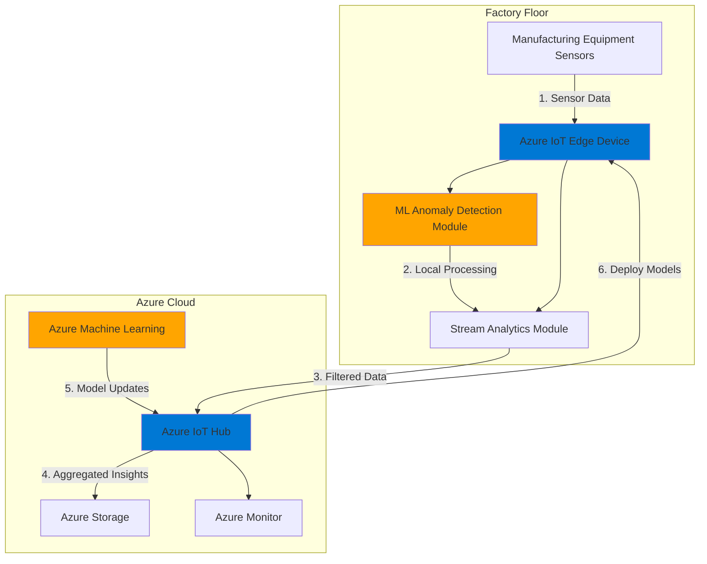

# Real-Time Anomaly Detection with Azure IoT Edge and Azure ML

## Problem

Manufacturing facilities struggle with equipment failures that cost millions in downtime and repairs. Traditional cloud-based monitoring systems introduce latency that prevents real-time intervention, while network connectivity issues in factory environments make continuous cloud communication unreliable. Companies need immediate anomaly detection at the source to prevent catastrophic failures and optimize maintenance schedules.

## Solution

Deploy machine learning models directly to edge devices using Azure IoT Edge and Azure ML, enabling real-time anomaly detection within milliseconds. This architecture processes sensor data locally on factory equipment while maintaining cloud connectivity for model updates and aggregated insights, ensuring continuous operation even during network outages.

## Architecture Diagram



## Prerequisites

1. Azure subscription with contributor access to create resources
2. Azure CLI v2.70+ installed and configured (or use Azure Cloud Shell)
3. Basic understanding of IoT concepts and machine learning
4. Ubuntu 20.04+ VM or physical device for IoT Edge (minimum 2 vCPU, 4GB RAM)
5. Estimated cost: ~$50-100/month for development environment

> **Note**: This recipe uses Azure IoT Edge 1.5 LTS which is the currently supported version. Ensure your edge device meets the [system requirements](https://learn.microsoft.com/en-us/azure/iot-edge/support).

## Preparation

```bash
# Set environment variables for Azure resources
export RESOURCE_GROUP="rg-anomaly-detection-$(openssl rand -hex 3)"
export LOCATION="eastus"
export IOT_HUB_NAME="iot-hub-anomaly-$(openssl rand -hex 3)"
export STORAGE_ACCOUNT="stanomalydata$(openssl rand -hex 3)"
export ML_WORKSPACE="ml-anomaly-detection-$(openssl rand -hex 3)"
export EDGE_DEVICE_ID="factory-edge-device-01"
export SUBSCRIPTION_ID=$(az account show --query id --output tsv)

# Create resource group
az group create \
    --name ${RESOURCE_GROUP} \
    --location ${LOCATION} \
    --tags purpose=anomaly-detection environment=demo

echo "✅ Resource group created: ${RESOURCE_GROUP}"

# Create IoT Hub
az iot hub create \
    --name ${IOT_HUB_NAME} \
    --resource-group ${RESOURCE_GROUP} \
    --location ${LOCATION} \
    --sku S1 \
    --partition-count 2

echo "✅ IoT Hub created: ${IOT_HUB_NAME}"
```

## Steps

1. **Configure Azure Machine Learning Workspace**:

   Azure Machine Learning provides a comprehensive platform for training, deploying, and managing ML models at scale. Creating a workspace establishes the foundation for developing anomaly detection models that can identify equipment failures before they occur. This workspace will store your trained models, compute resources, and deployment configurations.

   ```bash
   # Create storage account first
   az storage account create \
       --name ${STORAGE_ACCOUNT} \
       --resource-group ${RESOURCE_GROUP} \
       --location ${LOCATION} \
       --sku Standard_LRS \
       --kind StorageV2
   
   # Create ML workspace
   az ml workspace create \
       --name ${ML_WORKSPACE} \
       --resource-group ${RESOURCE_GROUP} \
       --location ${LOCATION} \
       --storage-account ${STORAGE_ACCOUNT}
   
   # Create compute cluster for model training
   az ml compute create \
       --name cpu-cluster \
       --resource-group ${RESOURCE_GROUP} \
       --workspace-name ${ML_WORKSPACE} \
       --size Standard_DS3_v2 \
       --type amlcompute \
       --min-instances 0 \
       --max-instances 4
   
   echo "✅ ML workspace and compute cluster configured"
   ```

   The ML workspace is now ready for model development with auto-scaling compute resources. This configuration enables cost-effective training while providing the computational power needed for complex anomaly detection algorithms.

2. **Set Up IoT Edge Device Registration**:

   Azure IoT Edge extends cloud intelligence to edge devices, enabling local data processing and decision-making. Registering an edge device creates a secure identity in IoT Hub, establishing the trust relationship needed for bi-directional communication between your factory equipment and the cloud.

   ```bash
   # Install IoT extension for Azure CLI if not already installed
   az extension add --name azure-iot
   
   # Register IoT Edge device
   az iot hub device-identity create \
       --device-id ${EDGE_DEVICE_ID} \
       --hub-name ${IOT_HUB_NAME} \
       --edge-enabled
   
   # Get connection string for device configuration
   CONNECTION_STRING=$(az iot hub device-identity connection-string show \
       --device-id ${EDGE_DEVICE_ID} \
       --hub-name ${IOT_HUB_NAME} \
       --query connectionString \
       --output tsv)
   
   echo "✅ IoT Edge device registered: ${EDGE_DEVICE_ID}"
   echo "📋 Save this connection string for device setup: ${CONNECTION_STRING}"
   ```

3. **Create Stream Analytics Edge Job for Processing**:

   Azure Stream Analytics on IoT Edge brings real-time data processing capabilities directly to your devices. This module filters and aggregates sensor data locally, reducing bandwidth usage by up to 95% and enabling sub-millisecond response times for critical anomalies.

   ```bash
   # Create Stream Analytics job for edge
   az stream-analytics job create \
       --resource-group ${RESOURCE_GROUP} \
       --job-name "asa-edge-anomaly-job" \
       --location ${LOCATION} \
       --sku "Standard" \
       --type "Edge" \
       --no-wait
   
   # Wait for job creation to complete
   sleep 30
   
   echo "✅ Stream Analytics edge job configured"
   ```

4. **Configure Input and Output for Stream Analytics**:

   Stream Analytics requires input and output configurations to process data flows. Edge Hub inputs receive sensor data from IoT Edge modules, while outputs send processed results to cloud services or other edge modules.

   ```bash
   # Create input for sensor data from Edge Hub
   cat > input-config.json << EOF
   {
     "name": "sensorInput",
     "properties": {
       "type": "Stream",
       "datasource": {
         "type": "GatewayMessageBus",
         "properties": {
           "topic": "temperature"
         }
       },
       "serialization": {
         "type": "Json",
         "properties": {
           "encoding": "UTF8"
         }
       }
     }
   }
   EOF
   
   # Create output for sending alerts to Edge Hub
   cat > output-config.json << EOF
   {
     "name": "alertOutput",
     "properties": {
       "datasource": {
         "type": "GatewayMessageBus",
         "properties": {
           "topic": "alerts"
         }
       },
       "serialization": {
         "type": "Json",
         "properties": {
           "encoding": "UTF8"
         }
       }
     }
   }
   EOF
   
   # Add input to Stream Analytics job
   az stream-analytics input create \
       --resource-group ${RESOURCE_GROUP} \
       --job-name "asa-edge-anomaly-job" \
       --input "@input-config.json"
   
   # Add output to Stream Analytics job
   az stream-analytics output create \
       --resource-group ${RESOURCE_GROUP} \
       --job-name "asa-edge-anomaly-job" \
       --output "@output-config.json"
   
   echo "✅ Stream Analytics input and output configured"
   ```

5. **Create Anomaly Detection Query**:

   The Stream Analytics query implements sliding window analysis to detect anomalies in real-time sensor data. This query uses built-in ML functions to identify spikes, dips, and change points that indicate potential equipment failures, enabling predictive maintenance strategies.

   ```bash
   # Create anomaly detection query
   QUERY='WITH AnomalyDetectionStep AS
   (
       SELECT
           deviceId,
           temperature,
           pressure,
           vibration,
           ANOMALYDETECTION(temperature) OVER (PARTITION BY deviceId LIMIT DURATION(minute, 5)) AS temp_scores,
           ANOMALYDETECTION(pressure) OVER (PARTITION BY deviceId LIMIT DURATION(minute, 5)) AS pressure_scores,
           System.Timestamp() AS eventTime
       FROM sensorInput
   )
   SELECT
       deviceId,
       temperature,
       pressure,
       vibration,
       temp_scores,
       pressure_scores,
       eventTime
   INTO alertOutput
   FROM AnomalyDetectionStep
   WHERE
       CAST(GetRecordPropertyValue(temp_scores, "BiLevelChangeScore") AS FLOAT) > 3.5
       OR CAST(GetRecordPropertyValue(pressure_scores, "BiLevelChangeScore") AS FLOAT) > 3.5'
   
   # Update Stream Analytics job with query
   az stream-analytics transformation create \
       --resource-group ${RESOURCE_GROUP} \
       --job-name "asa-edge-anomaly-job" \
       --transformation-name "anomalyQuery" \
       --streaming-units 1 \
       --query "${QUERY}"
   
   echo "✅ Anomaly detection query deployed"
   ```

6. **Configure Storage for Model and Data Persistence**:

   Azure Storage provides durable, scalable storage for ML models and anomaly detection results. The hierarchical namespace enables efficient data organization for time-series sensor data, while lifecycle policies automatically optimize costs by moving older data to cooler storage tiers.

   ```bash
   # Enable hierarchical namespace for Data Lake capabilities
   az storage account update \
       --name ${STORAGE_ACCOUNT} \
       --resource-group ${RESOURCE_GROUP} \
       --enable-hierarchical-namespace true
   
   # Create containers for models and data
   az storage container create \
       --name "ml-models" \
       --account-name ${STORAGE_ACCOUNT} \
       --auth-mode login
   
   az storage container create \
       --name "anomaly-data" \
       --account-name ${STORAGE_ACCOUNT} \
       --auth-mode login
   
   echo "✅ Storage account configured with containers"
   ```

7. **Publish Stream Analytics Job for Edge Deployment**:

   Publishing the Stream Analytics job creates an edge-deployable package that can be deployed as an IoT Edge module. This process optimizes the query for edge execution and creates the necessary deployment artifacts.

   ```bash
   # Publish the Stream Analytics job for edge deployment
   az stream-analytics job publish-edge-package \
       --resource-group ${RESOURCE_GROUP} \
       --job-name "asa-edge-anomaly-job"
   
   # Wait for publishing to complete
   sleep 60
   
   echo "✅ Stream Analytics job published for edge deployment"
   ```

8. **Create IoT Edge Deployment Manifest**:

   Deploying ML models to edge devices enables real-time inference without cloud dependency. This deployment manifest configures the edge runtime with necessary modules, security settings, and resource constraints optimized for industrial environments.

   ```bash
   # Create deployment manifest for edge modules
   cat > deployment.json << EOF
   {
     "modulesContent": {
       "\$edgeAgent": {
         "properties.desired": {
           "schemaVersion": "1.1",
           "runtime": {
             "type": "docker",
             "settings": {
               "minDockerVersion": "v1.25"
             }
           },
           "systemModules": {
             "edgeAgent": {
               "type": "docker",
               "settings": {
                 "image": "mcr.microsoft.com/azureiotedge-agent:1.5",
                 "createOptions": {}
               }
             },
             "edgeHub": {
               "type": "docker",
               "status": "running",
               "restartPolicy": "always",
               "settings": {
                 "image": "mcr.microsoft.com/azureiotedge-hub:1.5",
                 "createOptions": {
                   "HostConfig": {
                     "PortBindings": {
                       "5671/tcp": [{"HostPort": "5671"}],
                       "8883/tcp": [{"HostPort": "8883"}],
                       "443/tcp": [{"HostPort": "443"}]
                     }
                   }
                 }
               }
             }
           },
           "modules": {
             "anomalyDetector": {
               "version": "1.0",
               "type": "docker",
               "status": "running",
               "restartPolicy": "always",
               "settings": {
                 "image": "mcr.microsoft.com/azure-cognitive-services/anomaly-detector:latest",
                 "createOptions": {
                   "ExposedPorts": {
                     "5000/tcp": {}
                   },
                   "HostConfig": {
                     "PortBindings": {
                       "5000/tcp": [{"HostPort": "5000"}]
                     }
                   }
                 }
               }
             },
             "SimulatedTemperatureSensor": {
               "version": "1.0",
               "type": "docker",
               "status": "running",
               "restartPolicy": "always",
               "settings": {
                 "image": "mcr.microsoft.com/azureiotedge-simulated-temperature-sensor:1.5",
                 "createOptions": {}
               }
             }
           }
         }
       },
       "\$edgeHub": {
         "properties.desired": {
           "schemaVersion": "1.1",
           "routes": {
             "sensorToAnalytics": "FROM /messages/modules/SimulatedTemperatureSensor/* INTO BrokeredEndpoint(\"/modules/asa-edge-anomaly-job/inputs/temperature\")",
             "analyticsToIoTHub": "FROM /messages/modules/asa-edge-anomaly-job/* INTO \$upstream"
           },
           "storeAndForwardConfiguration": {
             "timeToLiveSecs": 7200
           }
         }
       }
     }
   }
   EOF
   
   # Apply deployment to edge device
   az iot edge deployment create \
       --deployment-id "anomaly-detection-deployment" \
       --hub-name ${IOT_HUB_NAME} \
       --content deployment.json \
       --target-condition "deviceId='${EDGE_DEVICE_ID}'" \
       --priority 10
   
   echo "✅ ML model deployment initiated to edge device"
   ```

9. **Configure Monitoring and Alerts**:

   Azure Monitor provides comprehensive observability for your edge deployment, tracking model performance, device health, and anomaly detection rates. Custom alerts ensure immediate notification when critical anomalies are detected or when edge devices experience issues.

   ```bash
   # Create Log Analytics workspace
   WORKSPACE_ID=$(az monitor log-analytics workspace create \
       --resource-group ${RESOURCE_GROUP} \
       --workspace-name "log-anomaly-detection" \
       --location ${LOCATION} \
       --query id --output tsv)
   
   # Enable monitoring for IoT Hub
   az monitor diagnostic-settings create \
       --resource ${IOT_HUB_NAME} \
       --resource-group ${RESOURCE_GROUP} \
       --resource-type "Microsoft.Devices/IotHubs" \
       --name "iot-diagnostics" \
       --workspace ${WORKSPACE_ID} \
       --logs '[{"category": "DeviceTelemetry", "enabled": true},
                {"category": "Routes", "enabled": true},
                {"category": "Connections", "enabled": true}]' \
       --metrics '[{"category": "AllMetrics", "enabled": true}]'
   
   echo "✅ Monitoring and diagnostics configured"
   ```

## Validation & Testing

1. Verify IoT Edge device registration:

   ```bash
   # Check device status
   az iot hub device-identity show \
       --device-id ${EDGE_DEVICE_ID} \
       --hub-name ${IOT_HUB_NAME} \
       --query "[deviceId, status, connectionState]" \
       --output table
   ```

   Expected output: Device should show as "enabled" with connection state details.

2. Test anomaly detection with simulated data:

   ```bash
   # Send test telemetry with anomalous values
   az iot device send-d2c-message \
       --hub-name ${IOT_HUB_NAME} \
       --device-id ${EDGE_DEVICE_ID} \
       --data '{"temperature": 95, "pressure": 180, "vibration": 4.5}'
   
   # Check Stream Analytics job status
   az stream-analytics job show \
       --resource-group ${RESOURCE_GROUP} \
       --name "asa-edge-anomaly-job" \
       --query "jobState" \
       --output tsv
   ```

3. Validate IoT Edge deployment:

   ```bash
   # Check deployment status
   az iot edge deployment show \
       --deployment-id "anomaly-detection-deployment" \
       --hub-name ${IOT_HUB_NAME} \
       --query "systemMetrics.results" \
       --output table
   ```

## Cleanup

1. Delete the resource group and all resources:

   ```bash
   # Remove all resources
   az group delete \
       --name ${RESOURCE_GROUP} \
       --yes \
       --no-wait
   
   echo "✅ Resource group deletion initiated: ${RESOURCE_GROUP}"
   echo "Note: Complete deletion may take 5-10 minutes"
   ```

2. Verify deletion status:

   ```bash
   # Check if resource group still exists
   az group exists --name ${RESOURCE_GROUP}
   ```

3. Clean up local files:

   ```bash
   # Remove deployment files
   rm -f deployment.json input-config.json output-config.json
   
   echo "✅ Local files cleaned up"
   ```

## Discussion

Azure IoT Edge transforms traditional reactive maintenance into predictive maintenance by bringing machine learning capabilities directly to the factory floor. This edge computing approach addresses the fundamental challenge of cloud-based solutions: network latency. According to the [Azure IoT Edge documentation](https://learn.microsoft.com/en-us/azure/iot-edge/about-iot-edge), edge processing can reduce response times from seconds to milliseconds, enabling real-time intervention before equipment failures occur.

Stream Analytics on IoT Edge provides [built-in ML functions](https://learn.microsoft.com/en-us/azure/stream-analytics/stream-analytics-machine-learning-anomaly-detection) for anomaly detection including spike detection, trend changes, and bi-level change detection. These functions use advanced statistical algorithms to identify patterns that deviate from normal behavior, making them ideal for industrial IoT scenarios where equipment degradation often follows predictable patterns before catastrophic failure.

From an architectural perspective, this solution follows the [Azure Well-Architected Framework](https://learn.microsoft.com/en-us/azure/architecture/framework/) principles by ensuring reliability through local processing, security through Azure AD integration and device attestation, and cost optimization through intelligent data filtering. The edge-first approach reduces bandwidth costs by processing data locally and only sending relevant insights to the cloud.

Security considerations are paramount in industrial IoT deployments. Azure IoT Edge implements [hardware-based security](https://learn.microsoft.com/en-us/azure/iot-edge/security) with secure boot and runtime attestation, ensuring device integrity even in physically accessible locations. Combined with Azure Monitor for continuous security monitoring and automatic certificate rotation, this creates a defense-in-depth strategy suitable for critical infrastructure.

> **Tip**: Start with pre-built anomaly detection models from Azure Cognitive Services, then gradually customize them based on your specific equipment patterns. The [Azure AI Anomaly Detector](https://azure.microsoft.com/en-us/products/ai-services/ai-anomaly-detector) service provides excellent baseline models that can be fine-tuned for industrial applications.

## Challenge

Extend this solution by implementing these enhancements:

1. Add multi-variate anomaly detection to identify correlations between temperature, pressure, and vibration patterns using Azure ML AutoML
2. Implement automated model retraining pipelines using Azure ML pipelines that learn from confirmed anomalies to improve accuracy
3. Create a digital twin visualization using Azure Digital Twins to provide real-time 3D representation of equipment status
4. Build a predictive maintenance scheduler that integrates with enterprise resource planning (ERP) systems based on anomaly predictions
5. Deploy a custom vision model for visual anomaly detection using Azure Custom Vision on IoT Edge

## Infrastructure Code

### Available Infrastructure as Code:

- [Infrastructure Code Overview](code/README.md) - Detailed description of all infrastructure components
- [Bicep](code/bicep/) - Azure Bicep templates
- [Bash CLI Scripts](code/scripts/) - Example bash scripts using Azure CLI commands to deploy infrastructure
- [Terraform](code/terraform/) - Terraform configuration files