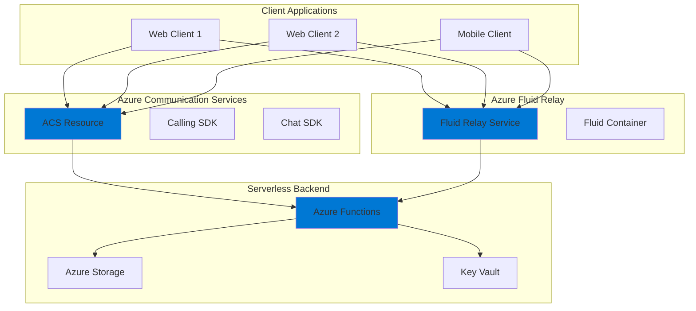

# Real-Time Collaborative Workspace with Video Integration

## Problem

Modern businesses need collaborative applications that enable distributed teams to work together in real-time, sharing ideas and content seamlessly. Traditional approaches using polling or manual refresh mechanisms create poor user experiences with delays, conflicts, and synchronization issues that hinder productivity and reduce collaborative effectiveness across time zones.

## Solution

Build a real-time collaborative whiteboard application using Azure Communication Services for video/audio conferencing, Azure Fluid Relay for synchronized document state, and Azure Functions for serverless backend operations. This architecture enables instant updates across all connected clients with minimal latency while maintaining secure access control.

## Architecture Diagram



## Prerequisites

1. Azure account with active subscription and Contributor permissions
2. Azure CLI v2.50.0 or later installed and configured (or Azure CloudShell)
3. Azure Functions Core Tools v4.x installed for local development
4. Node.js 18.x or later for local development
5. Basic knowledge of JavaScript/TypeScript and real-time applications
6. Estimated cost: ~$50-100/month for moderate usage

> **Note**: This recipe uses multiple Azure services that may incur costs. Monitor usage through Azure Cost Management to avoid unexpected charges and consider implementing auto-shutdown policies for development environments.

## Preparation

```bash
# Set environment variables for Azure resources
export RESOURCE_GROUP="rg-collab-app-${RANDOM_SUFFIX}"
export LOCATION="eastus"
export SUBSCRIPTION_ID=$(az account show --query id --output tsv)

# Generate unique suffix for resource names
RANDOM_SUFFIX=$(openssl rand -hex 3)
export ACS_NAME="acs-collab-${RANDOM_SUFFIX}"
export FLUID_NAME="fluid-collab-${RANDOM_SUFFIX}"
export FUNC_NAME="func-collab-${RANDOM_SUFFIX}"
export STORAGE_NAME="stcollab${RANDOM_SUFFIX}"
export KV_NAME="kv-collab-${RANDOM_SUFFIX}"

# Create resource group
az group create \
    --name ${RESOURCE_GROUP} \
    --location ${LOCATION} \
    --tags purpose=recipe environment=demo

echo "✅ Resource group created: ${RESOURCE_GROUP}"
```

## Steps

1. **Create Azure Communication Services Resource**:

   Azure Communication Services provides multichannel communication APIs for voice, video, chat, and SMS messaging. Creating this resource establishes the foundation for real-time audio/video conferencing and chat capabilities in your collaborative application, enabling users to communicate while working on shared content with enterprise-grade security and global reach.

   ```bash
   # Install the Communication Services extension
   az extension add --name communication
   
   # Create ACS resource
   az communication create \
       --name ${ACS_NAME} \
       --resource-group ${RESOURCE_GROUP} \
       --location global \
       --data-location unitedstates
   
   # Get connection string
   export ACS_CONNECTION=$(az communication show \
       --name ${ACS_NAME} \
       --resource-group ${RESOURCE_GROUP} \
       --query connectionString \
       --output tsv)
   
   echo "✅ ACS created with connection string stored"
   ```

   The Communication Services resource is now ready to provide identity management, access tokens, and communication channels. This global resource ensures low latency for users worldwide while maintaining data residency in the United States for compliance requirements and follows Azure's best practices for secure communication.

2. **Provision Azure Fluid Relay Service**:

   Azure Fluid Relay is a managed service that handles real-time synchronization of shared state across multiple clients using operational transformation algorithms. It provides the infrastructure for collaborative experiences with sub-100ms latency, enabling instant updates when users draw on the whiteboard or make changes to shared content while maintaining consistency across all connected sessions.

   ```bash
   # Create Fluid Relay resource
   az fluid-relay server create \
       --name ${FLUID_NAME} \
       --resource-group ${RESOURCE_GROUP} \
       --location ${LOCATION} \
       --sku basic
   
   # Get Fluid Relay endpoints
   export FLUID_ENDPOINT=$(az fluid-relay server show \
       --name ${FLUID_NAME} \
       --resource-group ${RESOURCE_GROUP} \
       --query fluidRelayEndpoints.ordererEndpoints[0] \
       --output tsv)
   
   export FLUID_TENANT=$(az fluid-relay server show \
       --name ${FLUID_NAME} \
       --resource-group ${RESOURCE_GROUP} \
       --query frsTenantId \
       --output tsv)
   
   echo "✅ Fluid Relay provisioned at: ${FLUID_ENDPOINT}"
   ```

   The Fluid Relay service now provides the real-time synchronization infrastructure using the Microsoft Fluid Framework. This managed service handles the complex distributed systems challenges of maintaining consistency across all connected clients without requiring custom server code or WebSocket management.

3. **Set Up Azure Key Vault for Secrets Management**:

   Azure Key Vault provides centralized secure storage for sensitive configuration like connection strings and API keys. This approach follows security best practices by keeping secrets out of application code and configuration files, while providing audit trails and access control through Azure RBAC and managed identities for secure, passwordless authentication.

   ```bash
   # Create Key Vault
   az keyvault create \
       --name ${KV_NAME} \
       --resource-group ${RESOURCE_GROUP} \
       --location ${LOCATION} \
       --sku standard \
       --enable-rbac-authorization
   
   # Store ACS connection string
   az keyvault secret set \
       --vault-name ${KV_NAME} \
       --name "AcsConnectionString" \
       --value "${ACS_CONNECTION}"
   
   # Generate and store Fluid Relay key
   export FLUID_KEY=$(az fluid-relay server list-keys \
       --name ${FLUID_NAME} \
       --resource-group ${RESOURCE_GROUP} \
       --query primaryKey \
       --output tsv)
   
   az keyvault secret set \
       --vault-name ${KV_NAME} \
       --name "FluidRelayKey" \
       --value "${FLUID_KEY}"
   
   echo "✅ Secrets stored in Key Vault: ${KV_NAME}"
   ```

   Key Vault is now configured with RBAC authorization enabled, providing enterprise-grade secret management. This configuration ensures that only authorized services can access sensitive credentials while maintaining compliance with security frameworks and providing detailed audit logging for all secret access operations.

4. **Create Storage Account for Application Data**:

   Azure Storage provides durable, scalable storage for application assets like user profiles, saved whiteboards, and session recordings. The storage account serves as the persistent layer for your collaborative application, complementing the real-time capabilities of Fluid Relay with long-term data retention and backup capabilities.

   ```bash
   # Create storage account
   az storage account create \
       --name ${STORAGE_NAME} \
       --resource-group ${RESOURCE_GROUP} \
       --location ${LOCATION} \
       --sku Standard_LRS \
       --kind StorageV2 \
       --https-only true \
       --min-tls-version TLS1_2
   
   # Create containers for different data types
   export STORAGE_KEY=$(az storage account keys list \
       --account-name ${STORAGE_NAME} \
       --resource-group ${RESOURCE_GROUP} \
       --query [0].value \
       --output tsv)
   
   az storage container create \
       --name whiteboards \
       --account-name ${STORAGE_NAME} \
       --account-key ${STORAGE_KEY} \
       --public-access off
   
   az storage container create \
       --name recordings \
       --account-name ${STORAGE_NAME} \
       --account-key ${STORAGE_KEY} \
       --public-access off
   
   echo "✅ Storage account created with secure containers"
   ```

   The storage account is now configured with security best practices including HTTPS-only access, minimum TLS 1.2, and private containers. This setup ensures that all application data is encrypted in transit and at rest while providing the scalable storage foundation needed for collaborative workspace features.

5. **Deploy Azure Functions for Serverless Backend**:

   Azure Functions provides the serverless compute layer for handling authentication, token generation, and business logic. This consumption-based model automatically scales with demand while minimizing costs during periods of low activity, making it ideal for collaborative applications with variable usage patterns and unpredictable traffic spikes.

   ```bash
   # Create Function App
   az functionapp create \
       --name ${FUNC_NAME} \
       --resource-group ${RESOURCE_GROUP} \
       --storage-account ${STORAGE_NAME} \
       --consumption-plan-location ${LOCATION} \
       --runtime node \
       --runtime-version 18 \
       --functions-version 4 \
       --https-only true
   
   # Configure app settings with Key Vault references
   az functionapp config appsettings set \
       --name ${FUNC_NAME} \
       --resource-group ${RESOURCE_GROUP} \
       --settings \
       "ACS_CONNECTION_STRING=@Microsoft.KeyVault(VaultName=${KV_NAME};SecretName=AcsConnectionString)" \
       "FLUID_RELAY_KEY=@Microsoft.KeyVault(VaultName=${KV_NAME};SecretName=FluidRelayKey)" \
       "FLUID_ENDPOINT=${FLUID_ENDPOINT}" \
       "FLUID_TENANT=${FLUID_TENANT}"
   
   echo "✅ Function App deployed: ${FUNC_NAME}"
   ```

   The Function App now serves as the serverless backend with secure Key Vault integration, ready to handle token generation for both ACS and Fluid Relay. This architecture ensures secure access control while maintaining the scalability and cost-effectiveness needed for real-time collaborative applications.

6. **Configure Managed Identity and Permissions**:

   Managed identities eliminate the need for storing credentials in code by providing automatic authentication between Azure services. This configuration enables the Function App to securely access Key Vault secrets and other resources using Azure AD authentication, following the principle of least privilege and Zero Trust security model.

   ```bash
   # Enable managed identity for Function App
   az functionapp identity assign \
       --name ${FUNC_NAME} \
       --resource-group ${RESOURCE_GROUP}
   
   # Get the identity principal ID
   export FUNC_IDENTITY=$(az functionapp identity show \
       --name ${FUNC_NAME} \
       --resource-group ${RESOURCE_GROUP} \
       --query principalId \
       --output tsv)
   
   # Grant Key Vault access to Function App using RBAC
   az role assignment create \
       --assignee ${FUNC_IDENTITY} \
       --role "Key Vault Secrets User" \
       --scope "/subscriptions/${SUBSCRIPTION_ID}/resourceGroups/${RESOURCE_GROUP}/providers/Microsoft.KeyVault/vaults/${KV_NAME}"
   
   # Grant Storage access to Function App
   az role assignment create \
       --assignee ${FUNC_IDENTITY} \
       --role "Storage Blob Data Contributor" \
       --scope "/subscriptions/${SUBSCRIPTION_ID}/resourceGroups/${RESOURCE_GROUP}/providers/Microsoft.Storage/storageAccounts/${STORAGE_NAME}"
   
   echo "✅ Managed identity configured with RBAC permissions"
   ```

   The managed identity is now configured with appropriate RBAC permissions, providing secure and auditable access to Azure resources. This passwordless authentication approach eliminates credential management overhead while maintaining enterprise security standards and compliance requirements.

7. **Deploy Function Code for Token Generation**:

   The token generation functions provide secure access to both Azure Communication Services and Fluid Relay. These serverless functions authenticate users, generate time-limited tokens with appropriate scopes, and ensure that only authorized users can join communication sessions and access shared content while maintaining session security.

   ```bash
   # Create temporary directory for function code
   mkdir -p /tmp/collab-functions
   cd /tmp/collab-functions
   
   # Initialize Functions project
   func init . --typescript
   
   # Create package.json with latest Azure SDK versions
   cat > package.json << 'EOF'
   {
     "name": "collab-functions",
     "version": "1.0.0",
     "main": "index.js",
     "dependencies": {
       "@azure/communication-identity": "^1.3.1",
       "@fluidframework/azure-client": "^2.0.0-rc.4.0.0",
       "@azure/identity": "^4.0.1",
       "@azure/functions": "^4.0.0"
     },
     "devDependencies": {
       "@types/node": "^18.0.0",
       "typescript": "^4.9.0"
     }
   }
   EOF
   
   # Create ACS token function
   func new --name GetAcsToken --template "HTTP trigger" \
       --authlevel anonymous
   
   # Update the function implementation
   cat > GetAcsToken/index.ts << 'EOF'
   import { app, HttpRequest, HttpResponseInit, InvocationContext } from "@azure/functions";
   import { CommunicationIdentityClient } from "@azure/communication-identity";

   export async function GetAcsToken(request: HttpRequest, context: InvocationContext): Promise<HttpResponseInit> {
       try {
           const connectionString = process.env.ACS_CONNECTION_STRING;
           if (!connectionString) {
               throw new Error("ACS connection string not configured");
           }

           const client = new CommunicationIdentityClient(connectionString);
           const user = await client.createUser();
           const token = await client.getToken(user, ["chat", "voip"]);

           return {
               status: 200,
               jsonBody: {
                   userId: user.communicationUserId,
                   token: token.token,
                   expiresOn: token.expiresOn
               }
           };
       } catch (error) {
           context.error("Error generating ACS token:", error);
           return {
               status: 500,
               jsonBody: { error: error.message }
           };
       }
   }

   app.http("GetAcsToken", {
       methods: ["POST"],
       authLevel: "anonymous",
       handler: GetAcsToken
   });
   EOF
   
   # Build and deploy functions
   npm install
   npm run build
   func azure functionapp publish ${FUNC_NAME}
   
   echo "✅ Token generation functions deployed"
   ```

   The Functions are now deployed with modern Azure Functions v4 runtime and latest SDK versions. The token generation system provides secure, time-limited access tokens for both communication and collaboration services while maintaining proper error handling and logging for production readiness.

8. **Enable CORS and Configure Network Settings**:

   Cross-Origin Resource Sharing (CORS) configuration enables web browsers to securely access your Function App from different domains. This setup is essential for single-page applications and ensures that your collaborative whiteboard can communicate with the serverless backend while maintaining security through Application Insights monitoring and telemetry collection.

   ```bash
   # Configure CORS for Function App
   az functionapp cors add \
       --name ${FUNC_NAME} \
       --resource-group ${RESOURCE_GROUP} \
       --allowed-origins "https://localhost:3000" "https://*.yourdomain.com"
   
   # Enable Application Insights for monitoring
   az monitor app-insights component create \
       --app ${FUNC_NAME}-insights \
       --location ${LOCATION} \
       --resource-group ${RESOURCE_GROUP} \
       --kind web
   
   export APP_INSIGHTS=$(az monitor app-insights component show \
       --app ${FUNC_NAME}-insights \
       --resource-group ${RESOURCE_GROUP} \
       --query connectionString \
       --output tsv)
   
   az functionapp config appsettings set \
       --name ${FUNC_NAME} \
       --resource-group ${RESOURCE_GROUP} \
       --settings "APPLICATIONINSIGHTS_CONNECTION_STRING=${APP_INSIGHTS}"
   
   echo "✅ CORS and monitoring configured"
   ```

   The Function App is now configured with production-ready CORS policies and comprehensive monitoring through Application Insights. This setup enables secure cross-origin requests from your web applications while providing detailed telemetry, performance metrics, and diagnostic capabilities for troubleshooting and optimization.

> **Tip**: Use Application Insights Live Metrics to monitor real-time performance and debug issues during development. The [Azure Monitor documentation](https://docs.microsoft.com/en-us/azure/azure-monitor/app/live-stream) provides detailed guidance on tracking custom metrics and events for collaborative applications.

## Validation & Testing

1. Verify Azure Communication Services deployment:

   ```bash
   # Test ACS resource availability
   az communication show \
       --name ${ACS_NAME} \
       --resource-group ${RESOURCE_GROUP} \
       --output table
   ```

   Expected output: Table showing ACS resource details with "Succeeded" provisioning state

2. Test Fluid Relay connectivity:

   ```bash
   # Get Fluid Relay service details
   az fluid-relay server show \
       --name ${FLUID_NAME} \
       --resource-group ${RESOURCE_GROUP} \
       --query "{name:name, endpoint:fluidRelayEndpoints.ordererEndpoints[0], tenant:frsTenantId}" \
       --output table
   ```

   Expected output: Table displaying Fluid Relay endpoint URL and tenant ID

3. Validate Function App token generation:

   ```bash
   # Get Function App URL
   export FUNC_URL=$(az functionapp show \
       --name ${FUNC_NAME} \
       --resource-group ${RESOURCE_GROUP} \
       --query defaultHostName \
       --output tsv)
   
   # Test ACS token endpoint
   curl -X POST https://${FUNC_URL}/api/GetAcsToken \
       -H "Content-Type: application/json" \
       -d '{"userId": "testuser"}'
   ```

   Expected output: JSON response with userId, token, and expiresOn fields

4. Verify Key Vault secret access:

   ```bash
   # List secrets (should show both ACS and Fluid secrets)
   az keyvault secret list \
       --vault-name ${KV_NAME} \
       --query "[].{name:name, enabled:attributes.enabled}" \
       --output table
   ```

   Expected output: Table showing both secrets with enabled status as "True"

5. Test managed identity permissions:

   ```bash
   # Verify Function App can access Key Vault
   az role assignment list \
       --assignee ${FUNC_IDENTITY} \
       --scope "/subscriptions/${SUBSCRIPTION_ID}/resourceGroups/${RESOURCE_GROUP}/providers/Microsoft.KeyVault/vaults/${KV_NAME}" \
       --output table
   ```

   Expected output: Table showing "Key Vault Secrets User" role assignment

## Cleanup

1. Delete the resource group and all resources:

   ```bash
   # Delete resource group
   az group delete \
       --name ${RESOURCE_GROUP} \
       --yes \
       --no-wait
   
   echo "✅ Resource group deletion initiated: ${RESOURCE_GROUP}"
   echo "Note: Deletion may take 5-10 minutes to complete"
   ```

2. Verify deletion status:

   ```bash
   # Check if resource group still exists
   az group exists --name ${RESOURCE_GROUP}
   ```

   Expected output: "false" when deletion is complete

3. Clean up local temporary files:

   ```bash
   # Remove temporary function code
   rm -rf /tmp/collab-functions
   
   # Clear environment variables
   unset RESOURCE_GROUP ACS_NAME FLUID_NAME FUNC_NAME STORAGE_NAME KV_NAME
   unset ACS_CONNECTION FLUID_ENDPOINT FLUID_TENANT FLUID_KEY FUNC_IDENTITY
   
   echo "✅ Local cleanup completed"
   ```

## Discussion

Azure Communication Services and Azure Fluid Relay together create a powerful platform for building real-time collaborative applications that scale globally. This architecture leverages the strengths of each service: ACS provides enterprise-grade communication channels with global infrastructure while Fluid Relay handles the complex distributed state synchronization that makes real-time collaboration possible using Microsoft's proven operational transformation algorithms. The serverless backend using Azure Functions ensures cost-effectiveness and automatic scaling based on demand, following the [Azure Well-Architected Framework](https://docs.microsoft.com/en-us/azure/architecture/framework/) principles. For detailed implementation guidance, refer to the [Azure Communication Services documentation](https://docs.microsoft.com/en-us/azure/communication-services/) and [Fluid Framework documentation](https://fluidframework.com/docs/).

The event-driven nature of this solution aligns with modern cloud-native principles and microservices architecture patterns. By using managed services, you eliminate the operational overhead of maintaining WebSocket servers, scaling infrastructure, and handling connection management complexities. The combination of these services provides sub-100ms latency for most operations, enabling truly real-time experiences that feel instantaneous to users across different geographic regions and network conditions.

Security is built into every layer of this architecture following Zero Trust principles. Azure Key Vault centralizes secret management while managed identities eliminate the need for credentials in code, reducing the attack surface significantly. The token-based authentication system with time-limited access ensures that only authorized users can access communication channels and shared content. For production deployments, consider implementing additional security measures like Azure API Management for rate limiting and threat protection, Azure Front Door for DDoS protection and global load balancing, and Azure Application Gateway for web application firewall capabilities, as detailed in the [Azure security best practices](https://docs.microsoft.com/en-us/azure/security/fundamentals/best-practices-and-patterns).

From a cost optimization perspective, the consumption-based pricing models of Azure Functions and the basic SKU of Fluid Relay keep costs low during development and scale efficiently with usage patterns. The architecture automatically scales down during periods of low activity, ensuring you only pay for actual usage. Monitor your usage patterns through [Azure Cost Management](https://docs.microsoft.com/en-us/azure/cost-management-billing/cost-management-billing-overview) and consider implementing auto-shutdown policies for non-production environments, resource tagging for cost allocation, and Azure Advisor recommendations for further cost optimization opportunities.

> **Warning**: Both Azure Communication Services and Fluid Relay have service limits that may impact large-scale deployments. Review the [service limits documentation](https://docs.microsoft.com/en-us/azure/azure-resource-manager/management/azure-subscription-service-limits) and plan your architecture accordingly. Consider implementing circuit breaker patterns and graceful degradation for handling service limits gracefully.

## Challenge

Extend this solution by implementing these enhancements:

1. Add persistent storage for whiteboards using Azure Cosmos DB with change feed to maintain drawing history and enable conflict resolution across sessions
2. Implement user presence indicators showing who is currently viewing or editing the whiteboard using SignalR Service for real-time presence updates
3. Create a recording feature using Azure Communication Services Call Recording APIs to capture collaborative sessions with automatic transcription using Azure Cognitive Services
4. Build an AI-powered assistant using Azure OpenAI Service to suggest drawings, provide real-time translations, or generate meeting summaries from collaborative sessions
5. Add enterprise authentication using Azure AD B2C for secure multi-tenant deployments with role-based access control and audit logging

## Infrastructure Code

*Infrastructure code will be generated after recipe approval.*