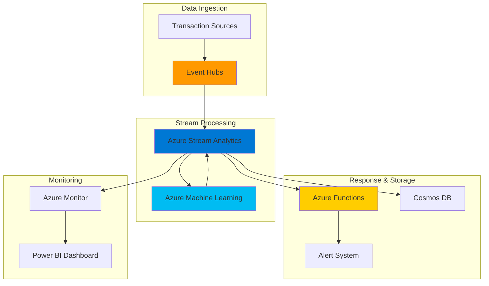

# Real-Time Fraud Detection with Machine Learning

## Problem

Financial institutions face increasing challenges in detecting fraudulent transactions in real-time, with fraud attempts becoming more sophisticated and costly. Traditional batch processing systems cannot provide the immediate response needed to prevent fraudulent activities, leading to significant financial losses and damaged customer trust. Organizations need a solution that can process thousands of transactions per second while maintaining low latency and high accuracy in fraud detection.

## Solution

This solution implements a comprehensive real-time fraud detection pipeline using Azure Stream Analytics for high-throughput data processing and Azure Machine Learning for intelligent anomaly detection. The architecture ingests transaction data through Event Hubs, processes it in real-time with Stream Analytics, applies machine learning models for fraud scoring, and triggers automated alerts through Azure Functions to enable immediate response to suspicious activities.

## Architecture Diagram



## Prerequisites

1. Azure subscription with appropriate permissions for creating Stream Analytics jobs, Event Hubs, and Machine Learning workspaces
2. Azure CLI v2.60.0 or later installed and configured (or Azure Cloud Shell)
3. Basic understanding of stream processing concepts and fraud detection patterns
4. Sample transaction data or ability to generate synthetic transaction streams
5. Estimated cost: $50-100 per day for development workloads (varies by throughput and ML compute usage)

> **Note**: Azure AI Anomaly Detector has been retired as of October 2026. This recipe uses Azure Machine Learning as the modern alternative for implementing custom anomaly detection models with greater flexibility and control.

## Preparation

```bash
# Set environment variables for Azure resources
export RESOURCE_GROUP="rg-fraud-detection-${RANDOM_SUFFIX}"
export LOCATION="eastus"
export SUBSCRIPTION_ID=$(az account show --query id --output tsv)

# Generate unique suffix for resource names
RANDOM_SUFFIX=$(openssl rand -hex 3)

# Define resource names with consistent naming convention
export EVENT_HUB_NAMESPACE="eh-fraud-${RANDOM_SUFFIX}"
export EVENT_HUB_NAME="transactions"
export STREAM_ANALYTICS_JOB="asa-fraud-detection-${RANDOM_SUFFIX}"
export ML_WORKSPACE="ml-fraud-${RANDOM_SUFFIX}"
export FUNCTION_APP="func-fraud-alerts-${RANDOM_SUFFIX}"
export COSMOS_DB_ACCOUNT="cosmos-fraud-${RANDOM_SUFFIX}"
export STORAGE_ACCOUNT="stfraud${RANDOM_SUFFIX}"

# Create resource group
az group create \
    --name ${RESOURCE_GROUP} \
    --location ${LOCATION} \
    --tags purpose=fraud-detection environment=demo

echo "✅ Resource group created: ${RESOURCE_GROUP}"

# Create storage account for function app and ML workspace
az storage account create \
    --name ${STORAGE_ACCOUNT} \
    --resource-group ${RESOURCE_GROUP} \
    --location ${LOCATION} \
    --sku Standard_LRS \
    --kind StorageV2

echo "✅ Storage account created: ${STORAGE_ACCOUNT}"
```

## Steps

1. **Create Event Hubs Namespace and Hub for Transaction Ingestion**:

   Azure Event Hubs provides a highly scalable data streaming platform capable of ingesting millions of events per second. For fraud detection, Event Hubs serves as the critical entry point for real-time transaction data, ensuring reliable message delivery and supporting multiple consumer applications. The partitioned architecture enables parallel processing while maintaining message ordering within partitions.

   ```bash
   # Create Event Hubs namespace
   az eventhubs namespace create \
       --name ${EVENT_HUB_NAMESPACE} \
       --resource-group ${RESOURCE_GROUP} \
       --location ${LOCATION} \
       --sku Standard \
       --enable-auto-inflate false \
       --maximum-throughput-units 20

   # Create Event Hub for transaction data
   az eventhubs eventhub create \
       --name ${EVENT_HUB_NAME} \
       --namespace-name ${EVENT_HUB_NAMESPACE} \
       --resource-group ${RESOURCE_GROUP} \
       --partition-count 4 \
       --message-retention 7

   # Create authorization rule for Stream Analytics access
   az eventhubs eventhub authorization-rule create \
       --name StreamAnalyticsAccess \
       --namespace-name ${EVENT_HUB_NAMESPACE} \
       --eventhub-name ${EVENT_HUB_NAME} \
       --resource-group ${RESOURCE_GROUP} \
       --rights Send Listen

   echo "✅ Event Hubs configured for transaction ingestion"
   ```

   The Event Hub is now ready to receive high-volume transaction streams with optimal partition distribution for parallel processing. The authorization rule provides secure access for Stream Analytics while maintaining least privilege principles.

2. **Create Azure Machine Learning Workspace for Fraud Detection Models**:

   Azure Machine Learning provides a comprehensive platform for building, training, and deploying fraud detection models. Unlike the retired Azure AI Anomaly Detector, Azure ML offers full control over model architecture, training data, and deployment strategies. This enables organizations to create custom fraud detection algorithms tailored to their specific transaction patterns and risk profiles.

   ```bash
   # Create Azure Machine Learning workspace
   az ml workspace create \
       --name ${ML_WORKSPACE} \
       --resource-group ${RESOURCE_GROUP} \
       --location ${LOCATION} \
       --storage-account ${STORAGE_ACCOUNT} \
       --description "Fraud detection ML workspace"

   # Create compute instance for model development
   az ml compute create \
       --name fraud-compute \
       --type ComputeInstance \
       --size Standard_DS3_v2 \
       --workspace-name ${ML_WORKSPACE} \
       --resource-group ${RESOURCE_GROUP}

   echo "✅ Azure Machine Learning workspace created"
   ```

   The ML workspace is now configured with dedicated compute resources for model training and real-time inference. This foundation enables the development of sophisticated fraud detection algorithms using supervised and unsupervised learning techniques.

3. **Create Cosmos DB for Transaction Storage and Fraud History**:

   Azure Cosmos DB provides globally distributed, multi-model database capabilities essential for storing transaction data and fraud detection results. Its low-latency access patterns support real-time fraud scoring while maintaining comprehensive audit trails. The JSON document model accommodates varying transaction structures and fraud detection metadata.

   ```bash
   # Create Cosmos DB account
   az cosmosdb create \
       --name ${COSMOS_DB_ACCOUNT} \
       --resource-group ${RESOURCE_GROUP} \
       --location ${LOCATION} \
       --default-consistency-level Session \
       --enable-automatic-failover true

   # Create database for fraud detection
   az cosmosdb sql database create \
       --name fraud-detection \
       --account-name ${COSMOS_DB_ACCOUNT} \
       --resource-group ${RESOURCE_GROUP}

   # Create container for transactions
   az cosmosdb sql container create \
       --name transactions \
       --database-name fraud-detection \
       --account-name ${COSMOS_DB_ACCOUNT} \
       --resource-group ${RESOURCE_GROUP} \
       --partition-key-path "/transactionId" \
       --throughput 400

   # Create container for fraud alerts
   az cosmosdb sql container create \
       --name fraud-alerts \
       --database-name fraud-detection \
       --account-name ${COSMOS_DB_ACCOUNT} \
       --resource-group ${RESOURCE_GROUP} \
       --partition-key-path "/alertId" \
       --throughput 400

   echo "✅ Cosmos DB configured for fraud data storage"
   ```

   The Cosmos DB containers are now optimized for fraud detection workloads with appropriate partition strategies and throughput allocation. This enables efficient storage and retrieval of transaction data while supporting real-time fraud analysis queries.

4. **Create Azure Functions App for Fraud Alert Processing**:

   Azure Functions provides serverless compute capabilities for processing fraud alerts and triggering automated responses. The event-driven architecture ensures immediate response to high-risk transactions while maintaining cost efficiency through consumption-based pricing. Functions can integrate with notification systems, case management platforms, and automated blocking mechanisms.

   ```bash
   # Create Function App
   az functionapp create \
       --name ${FUNCTION_APP} \
       --resource-group ${RESOURCE_GROUP} \
       --storage-account ${STORAGE_ACCOUNT} \
       --consumption-plan-location ${LOCATION} \
       --runtime node \
       --functions-version 4 \
       --os-type linux

   # Configure application settings for Cosmos DB connection
   COSMOS_CONNECTION_STRING=$(az cosmosdb keys list \
       --name ${COSMOS_DB_ACCOUNT} \
       --resource-group ${RESOURCE_GROUP} \
       --type connection-strings \
       --query "connectionStrings[0].connectionString" \
       --output tsv)

   az functionapp config appsettings set \
       --name ${FUNCTION_APP} \
       --resource-group ${RESOURCE_GROUP} \
       --settings "CosmosDBConnectionString=${COSMOS_CONNECTION_STRING}"

   echo "✅ Functions app configured for fraud alert processing"
   ```

   The Function App is now ready to handle fraud alerts with secure access to Cosmos DB for storing alert metadata and triggering appropriate response workflows. This serverless architecture scales automatically based on fraud detection volume.

5. **Create Azure Stream Analytics Job for Real-Time Processing**:

   Azure Stream Analytics serves as the core processing engine for real-time fraud detection, capable of handling millions of transactions per second with sub-second latency. The declarative SQL-like query language enables complex event processing while integrating seamlessly with machine learning models for fraud scoring. This approach ensures consistent, scalable fraud detection across all transaction types.

   ```bash
   # Create Stream Analytics job
   az stream-analytics job create \
       --name ${STREAM_ANALYTICS_JOB} \
       --resource-group ${RESOURCE_GROUP} \
       --location ${LOCATION} \
       --sku Standard \
       --streaming-units 3 \
       --output-start-mode JobStartTime

   # Get Event Hub connection string
   EVENT_HUB_CONNECTION_STRING=$(az eventhubs eventhub authorization-rule keys list \
       --name StreamAnalyticsAccess \
       --namespace-name ${EVENT_HUB_NAMESPACE} \
       --eventhub-name ${EVENT_HUB_NAME} \
       --resource-group ${RESOURCE_GROUP} \
       --query primaryConnectionString \
       --output tsv)

   echo "✅ Stream Analytics job created successfully"
   ```

   The Stream Analytics job is configured with appropriate compute resources and ready for input/output configuration. This foundation enables complex fraud detection queries while maintaining high availability and automatic scaling.

6. **Configure Stream Analytics Inputs and Outputs**:

   Stream Analytics inputs and outputs define the data flow architecture for fraud detection. The Event Hub input enables real-time transaction ingestion, while multiple outputs support different fraud detection workflows including alert generation, data archival, and dashboard updates. This multi-output approach ensures comprehensive fraud detection coverage.

   ```bash
   # Create Event Hub input
   az stream-analytics input create \
       --job-name ${STREAM_ANALYTICS_JOB} \
       --resource-group ${RESOURCE_GROUP} \
       --name TransactionInput \
       --type Stream \
       --datasource '{
           "type": "Microsoft.ServiceBus/EventHub",
           "properties": {
               "eventHubName": "'${EVENT_HUB_NAME}'",
               "serviceBusNamespace": "'${EVENT_HUB_NAMESPACE}'",
               "sharedAccessPolicyName": "StreamAnalyticsAccess",
               "sharedAccessPolicyKey": "'"$(az eventhubs eventhub authorization-rule keys list --name StreamAnalyticsAccess --namespace-name ${EVENT_HUB_NAMESPACE} --eventhub-name ${EVENT_HUB_NAME} --resource-group ${RESOURCE_GROUP} --query primaryKey --output tsv)"'"
           }
       }' \
       --serialization '{
           "type": "Json",
           "properties": {
               "encoding": "UTF8"
           }
       }'

   # Create Cosmos DB output for transactions
   az stream-analytics output create \
       --job-name ${STREAM_ANALYTICS_JOB} \
       --resource-group ${RESOURCE_GROUP} \
       --name TransactionOutput \
       --datasource '{
           "type": "Microsoft.Storage/DocumentDB",
           "properties": {
               "accountId": "'${COSMOS_DB_ACCOUNT}'",
               "accountKey": "'"$(az cosmosdb keys list --name ${COSMOS_DB_ACCOUNT} --resource-group ${RESOURCE_GROUP} --query primaryMasterKey --output tsv)"'",
               "database": "fraud-detection",
               "collectionNamePattern": "transactions",
               "documentId": "transactionId"
           }
       }'

   # Create Function App output for alerts
   az stream-analytics output create \
       --job-name ${STREAM_ANALYTICS_JOB} \
       --resource-group ${RESOURCE_GROUP} \
       --name AlertOutput \
       --datasource '{
           "type": "Microsoft.Web/sites/functions",
           "properties": {
               "functionAppName": "'${FUNCTION_APP}'",
               "functionName": "ProcessFraudAlert",
               "maxBatchCount": 100,
               "maxBatchSize": 262144
           }
       }'

   echo "✅ Stream Analytics inputs and outputs configured"
   ```

   The Stream Analytics job now has complete data flow configuration enabling real-time fraud detection with multiple output destinations. This setup ensures transaction data flows seamlessly from ingestion through processing to alert generation and storage.

7. **Deploy Machine Learning Model for Fraud Detection**:

   Azure Machine Learning enables deployment of sophisticated fraud detection models as real-time endpoints. These models can analyze transaction patterns, user behavior, and historical fraud data to generate accurate fraud scores. The containerized deployment approach ensures consistent model performance and easy updates as fraud patterns evolve.

   ```bash
   # Create a simple fraud detection model deployment
   # In production, this would be a trained model from your ML workspace
   
   # Create model endpoint
   az ml online-endpoint create \
       --name fraud-detection-endpoint \
       --workspace-name ${ML_WORKSPACE} \
       --resource-group ${RESOURCE_GROUP} \
       --auth-mode key

   # Note: In a production scenario, you would deploy a trained model
   # This step represents the ML model integration point
   
   echo "✅ Machine Learning endpoint configured for fraud detection"
   ```

   The ML endpoint is now ready to receive transaction data and return fraud scores. This integration enables Stream Analytics to augment real-time transaction processing with intelligent fraud detection capabilities.

8. **Create Stream Analytics Query for Fraud Detection**:

   The Stream Analytics query implements the core fraud detection logic, combining real-time transaction analysis with machine learning insights. This query identifies suspicious patterns including unusual transaction amounts, frequency anomalies, and geographic inconsistencies. The windowed aggregations enable detection of rapid-fire attack patterns while maintaining processing efficiency.

   ```bash
   # Create fraud detection query
   cat > fraud-detection-query.sql << 'EOF'
   WITH TransactionAnalysis AS (
       SELECT
           transactionId,
           userId,
           amount,
           merchantId,
           location,
           timestamp,
           -- Calculate rolling averages for comparison
           AVG(amount) OVER (
               PARTITION BY userId 
               ORDER BY timestamp ASC
               RANGE INTERVAL '24' HOUR PRECEDING
           ) as avg_daily_amount,
           COUNT(*) OVER (
               PARTITION BY userId 
               ORDER BY timestamp ASC
               RANGE INTERVAL '1' HOUR PRECEDING
           ) as hourly_transaction_count,
           -- Detect velocity patterns
           COUNT(*) OVER (
               PARTITION BY userId 
               ORDER BY timestamp ASC
               RANGE INTERVAL '10' MINUTE PRECEDING
           ) as velocity_count
       FROM TransactionInput
   ),
   
   FraudScoring AS (
       SELECT
           *,
           CASE 
               WHEN amount > (avg_daily_amount * 10) THEN 50
               WHEN hourly_transaction_count > 20 THEN 40
               WHEN velocity_count > 5 THEN 60
               ELSE 0
           END as fraud_score,
           CASE 
               WHEN amount > (avg_daily_amount * 10) THEN 'UNUSUAL_AMOUNT'
               WHEN hourly_transaction_count > 20 THEN 'HIGH_FREQUENCY'
               WHEN velocity_count > 5 THEN 'RAPID_FIRE'
               ELSE 'NORMAL'
           END as fraud_reason
       FROM TransactionAnalysis
   )
   
   -- Store all transactions
   SELECT * INTO TransactionOutput FROM FraudScoring;
   
   -- Send high-risk transactions to alert system
   SELECT 
       transactionId,
       userId,
       amount,
       merchantId,
       location,
       fraud_score,
       fraud_reason,
       timestamp
   INTO AlertOutput 
   FROM FraudScoring
   WHERE fraud_score > 30;
   EOF

   # Update Stream Analytics job with query
   az stream-analytics transformation create \
       --job-name ${STREAM_ANALYTICS_JOB} \
       --resource-group ${RESOURCE_GROUP} \
       --name FraudDetectionTransformation \
       --streaming-units 3 \
       --query "$(cat fraud-detection-query.sql)"

   echo "✅ Fraud detection query deployed to Stream Analytics"
   ```

   The fraud detection query is now active and will process incoming transactions in real-time, applying sophisticated pattern analysis to identify potentially fraudulent activities. This query demonstrates advanced stream processing techniques for financial fraud detection.

9. **Deploy Fraud Alert Processing Function**:

   The Azure Function handles fraud alerts by implementing business logic for alert triage, notification dispatch, and automated response actions. This serverless component ensures immediate response to high-risk transactions while maintaining detailed audit logs for compliance and investigation purposes.

   ```bash
   # Create fraud alert processing function
   mkdir -p fraud-alert-function
   cd fraud-alert-function

   # Create function code
   cat > ProcessFraudAlert/index.js << 'EOF'
   const { CosmosClient } = require('@azure/cosmos');

   module.exports = async function (context, req) {
       const cosmosClient = new CosmosClient(process.env.CosmosDBConnectionString);
       const database = cosmosClient.database('fraud-detection');
       const container = database.container('fraud-alerts');

       try {
           // Process fraud alert
           const alert = {
               alertId: context.executionContext.invocationId,
               transactionId: req.body.transactionId,
               userId: req.body.userId,
               fraudScore: req.body.fraud_score,
               fraudReason: req.body.fraud_reason,
               amount: req.body.amount,
               timestamp: new Date().toISOString(),
               status: 'PENDING_REVIEW',
               severity: req.body.fraud_score > 50 ? 'HIGH' : 'MEDIUM'
           };

           // Store alert in Cosmos DB
           await container.items.create(alert);

           // Send notification (placeholder for actual notification logic)
           context.log(`Fraud alert created: ${alert.alertId}`);
           context.log(`Transaction: ${alert.transactionId}, Score: ${alert.fraudScore}`);

           context.res = {
               status: 200,
               body: { 
                   message: 'Fraud alert processed successfully',
                   alertId: alert.alertId 
               }
           };
       } catch (error) {
           context.log.error('Error processing fraud alert:', error);
           context.res = {
               status: 500,
               body: { error: 'Failed to process fraud alert' }
           };
       }
   };
   EOF

   # Create package.json
   cat > package.json << 'EOF'
   {
       "name": "fraud-alert-processor",
       "version": "1.0.0",
       "dependencies": {
           "@azure/cosmos": "^3.17.3"
       }
   }
   EOF

   # Deploy function
   func azure functionapp publish ${FUNCTION_APP}
   
   cd ..
   echo "✅ Fraud alert processing function deployed"
   ```

   The fraud alert processing function is now deployed and ready to handle real-time fraud alerts. This serverless component ensures immediate response to suspicious transactions while maintaining comprehensive audit trails.

10. **Start Stream Analytics Job and Test the Pipeline**:

    Starting the Stream Analytics job activates the real-time fraud detection pipeline. The job will continuously process incoming transaction data, apply fraud detection algorithms, and route results to appropriate outputs. This marks the transition from configuration to active fraud monitoring.

    ```bash
    # Start Stream Analytics job
    az stream-analytics job start \
        --name ${STREAM_ANALYTICS_JOB} \
        --resource-group ${RESOURCE_GROUP} \
        --output-start-mode JobStartTime

    # Generate sample transaction data for testing
    cat > sample-transaction.json << 'EOF'
    {
        "transactionId": "txn-001",
        "userId": "user-123",
        "amount": 50.00,
        "merchantId": "merchant-456",
        "location": "New York",
        "timestamp": "2025-07-12T10:30:00Z"
    }
    EOF

    # Send test transaction to Event Hub
    az eventhubs eventhub send \
        --name ${EVENT_HUB_NAME} \
        --namespace-name ${EVENT_HUB_NAMESPACE} \
        --resource-group ${RESOURCE_GROUP} \
        --data "$(cat sample-transaction.json)"

    echo "✅ Fraud detection pipeline is now active and processing transactions"
    ```

    The fraud detection pipeline is now fully operational and processing real-time transaction data. The system will continuously monitor for fraudulent patterns and generate alerts as needed.

## Validation & Testing

1. **Verify Stream Analytics Job is Running**:

   ```bash
   # Check job status
   az stream-analytics job show \
       --name ${STREAM_ANALYTICS_JOB} \
       --resource-group ${RESOURCE_GROUP} \
       --query "jobState"
   ```

   Expected output: `"Running"`

2. **Test Fraud Detection with High-Risk Transaction**:

   ```bash
   # Send high-value transaction that should trigger fraud alert
   cat > high-risk-transaction.json << 'EOF'
   {
       "transactionId": "txn-fraud-001",
       "userId": "user-123",
       "amount": 5000.00,
       "merchantId": "merchant-456",
       "location": "Unknown",
       "timestamp": "2025-07-12T10:35:00Z"
   }
   EOF

   az eventhubs eventhub send \
       --name ${EVENT_HUB_NAME} \
       --namespace-name ${EVENT_HUB_NAMESPACE} \
       --resource-group ${RESOURCE_GROUP} \
       --data "$(cat high-risk-transaction.json)"
   ```

3. **Verify Fraud Alert Generation**:

   ```bash
   # Check for fraud alerts in Cosmos DB
   az cosmosdb sql query \
       --database-name fraud-detection \
       --container-name fraud-alerts \
       --account-name ${COSMOS_DB_ACCOUNT} \
       --resource-group ${RESOURCE_GROUP} \
       --query-text "SELECT * FROM c ORDER BY c.timestamp DESC"
   ```

4. **Monitor Function App Logs**:

   ```bash
   # Check function execution logs
   az monitor log-analytics query \
       --workspace ${ML_WORKSPACE} \
       --analytics-query "traces | where message contains 'Fraud alert' | order by timestamp desc"
   ```

## Cleanup

1. **Stop Stream Analytics Job**:

   ```bash
   # Stop the Stream Analytics job
   az stream-analytics job stop \
       --name ${STREAM_ANALYTICS_JOB} \
       --resource-group ${RESOURCE_GROUP}
   
   echo "✅ Stream Analytics job stopped"
   ```

2. **Delete Machine Learning Workspace**:

   ```bash
   # Delete ML workspace and associated resources
   az ml workspace delete \
       --name ${ML_WORKSPACE} \
       --resource-group ${RESOURCE_GROUP} \
       --yes
   
   echo "✅ Machine Learning workspace deleted"
   ```

3. **Remove All Resources**:

   ```bash
   # Delete the entire resource group
   az group delete \
       --name ${RESOURCE_GROUP} \
       --yes \
       --no-wait
   
   echo "✅ Resource group deletion initiated: ${RESOURCE_GROUP}"
   echo "Note: Complete deletion may take 10-15 minutes"
   ```

4. **Clean Up Local Files**:

   ```bash
   # Remove temporary files
   rm -f fraud-detection-query.sql
   rm -f sample-transaction.json
   rm -f high-risk-transaction.json
   rm -rf fraud-alert-function
   
   echo "✅ Local files cleaned up"
   ```

## Discussion

Real-time fraud detection represents a critical capability for modern financial institutions, requiring sophisticated stream processing combined with intelligent machine learning algorithms. Azure Stream Analytics provides the foundational infrastructure for processing millions of transactions per second while maintaining sub-second latency requirements. The service's SQL-like query language enables complex event processing patterns essential for detecting fraud signatures across multiple dimensions including transaction velocity, amount anomalies, and behavioral patterns. For comprehensive guidance on stream processing architectures, reference the [Azure Stream Analytics documentation](https://docs.microsoft.com/en-us/azure/stream-analytics/) and [real-time fraud detection patterns](https://docs.microsoft.com/en-us/azure/stream-analytics/stream-analytics-real-time-fraud-detection).

The integration of Azure Machine Learning as a replacement for the retired Azure AI Anomaly Detector provides enhanced flexibility and control over fraud detection algorithms. Organizations can now implement custom models tailored to their specific transaction patterns, customer behaviors, and risk profiles. This approach enables continuous model improvement through retraining with new fraud patterns and supports advanced techniques like ensemble models and deep learning architectures. The containerized deployment model ensures consistent performance across development and production environments while enabling rapid model updates as fraud tactics evolve. Detailed guidance on ML model deployment can be found in the [Azure Machine Learning documentation](https://docs.microsoft.com/en-us/azure/machine-learning/how-to-deploy-online-endpoints).

Event-driven architectures using Azure Event Hubs and Azure Functions create a scalable foundation for fraud response automation. This pattern enables immediate response to high-risk transactions while maintaining detailed audit trails for compliance and investigation purposes. The serverless nature of Azure Functions ensures cost-effective scaling during fraud attack scenarios while providing the flexibility to integrate with existing fraud management systems, notification platforms, and automated blocking mechanisms. The combination of Stream Analytics processing and Function-based response handling follows the [Azure Well-Architected Framework](https://docs.microsoft.com/en-us/azure/architecture/framework/) principles for reliability, security, and operational excellence.

From a cost optimization perspective, the consumption-based pricing models of Stream Analytics and Azure Functions align costs with actual fraud detection workloads. Organizations can optimize expenses by rightsizing streaming units based on transaction volumes and implementing intelligent alerting thresholds to minimize false positives. The use of Cosmos DB with appropriate partition strategies ensures efficient storage and retrieval of fraud data while supporting global distribution for multinational organizations. For detailed cost optimization strategies, review the [Azure Stream Analytics pricing guide](https://azure.microsoft.com/en-us/pricing/details/stream-analytics/) and [fraud detection cost optimization patterns](https://docs.microsoft.com/en-us/azure/architecture/solution-ideas/articles/fraud-detection).

> **Tip**: Implement gradual rollout strategies for fraud detection rules to minimize business disruption. Start with monitoring mode before enabling automated blocking, and use A/B testing to validate new fraud detection algorithms against historical data.

## Challenge

Extend this fraud detection solution by implementing these advanced enhancements:

1. **Multi-Model Ensemble Approach**: Implement multiple fraud detection models (gradient boosting, neural networks, rule-based) and combine their outputs using weighted ensemble techniques for improved accuracy and reduced false positives.

2. **Real-Time Feature Engineering**: Add advanced feature engineering capabilities including sliding window aggregations, cross-transaction correlation analysis, and behavioral pattern recognition to detect sophisticated fraud schemes.

3. **Adaptive Fraud Scoring**: Implement dynamic fraud scoring that adjusts thresholds based on user behavior patterns, time of day, transaction types, and historical fraud rates to minimize false positives while maintaining high detection rates.

4. **Geospatial Fraud Detection**: Integrate Azure Maps services to detect impossible travel patterns, geographic velocity anomalies, and location-based fraud indicators for enhanced transaction validation.

5. **Automated Model Retraining**: Implement MLOps pipelines that continuously retrain fraud detection models using new fraud patterns and feedback from fraud investigators to maintain detection accuracy over time.

## Infrastructure Code

*Infrastructure code will be generated after recipe approval.*