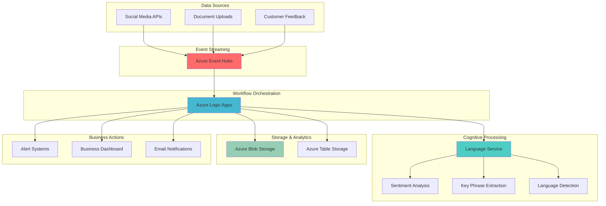

# Real-Time Text Analytics Streaming Workflows

## Problem

Organizations struggle to process vast amounts of unstructured text data streaming from multiple sources like social media feeds, customer feedback, and document uploads in real-time. Manual analysis is time-consuming and inconsistent, while basic automation lacks the intelligence to extract meaningful insights like sentiment trends, key topics, and language patterns. Without automated content processing workflows, businesses miss critical opportunities for immediate response to customer sentiment changes, emerging issues, or market trends.

## Solution

Build an intelligent, event-driven content processing pipeline that automatically analyzes streaming text data using Azure Cognitive Services Text Analytics for sentiment analysis, key phrase extraction, and language detection. Azure Event Hubs provides scalable real-time data ingestion while Azure Logic Apps orchestrates automated workflows that route processed insights to appropriate business systems, enabling immediate response to critical content patterns and sentiment changes.

## Architecture Diagram



## Prerequisites

1. Azure subscription with Cognitive Services and Event Hubs permissions
2. Azure CLI v2.50 or later installed and configured (or Azure Cloud Shell)
3. Basic understanding of event-driven architectures and JSON data structures
4. Familiarity with REST API concepts and webhook patterns
5. Estimated cost: $15-25 per day for testing (delete resources after completion to avoid ongoing charges)

> **Note**: Azure Cognitive Services Language service provides pre-built AI models that eliminate the need for custom machine learning development. The service automatically handles model updates and scaling, making it ideal for production content processing scenarios.

## Preparation

```bash
# Set environment variables for Azure resources
export RESOURCE_GROUP="rg-content-processing-${RANDOM_SUFFIX}"
export LOCATION="eastus"
export SUBSCRIPTION_ID=$(az account show --query id --output tsv)

# Generate unique suffix for globally unique resource names
RANDOM_SUFFIX=$(openssl rand -hex 3)
export STORAGE_ACCOUNT="stcontentproc${RANDOM_SUFFIX}"
export EVENT_HUB_NAMESPACE="eh-content-proc-${RANDOM_SUFFIX}"
export COGNITIVE_SERVICE="cs-text-analytics-${RANDOM_SUFFIX}"
export LOGIC_APP="la-content-workflow-${RANDOM_SUFFIX}"

# Create resource group
az group create \
    --name ${RESOURCE_GROUP} \
    --location ${LOCATION} \
    --tags purpose=content-processing environment=demo

echo "✅ Resource group created: ${RESOURCE_GROUP}"
echo "✅ Random suffix: ${RANDOM_SUFFIX}"
```

## Steps

1. **Create Azure Cognitive Services Language Resource**:

   Azure Cognitive Services Language service provides comprehensive text analytics capabilities including sentiment analysis, key phrase extraction, and language detection. This managed AI service eliminates the complexity of training and maintaining custom NLP models while providing enterprise-grade accuracy and multi-language support essential for global content processing workflows.

   ```bash
   # Create Cognitive Services Language resource
   az cognitiveservices account create \
       --name ${COGNITIVE_SERVICE} \
       --resource-group ${RESOURCE_GROUP} \
       --location ${LOCATION} \
       --kind TextAnalytics \
       --sku S \
       --yes
   
   # Get the API key and endpoint
   COGNITIVE_KEY=$(az cognitiveservices account keys list \
       --name ${COGNITIVE_SERVICE} \
       --resource-group ${RESOURCE_GROUP} \
       --query key1 --output tsv)
   
   COGNITIVE_ENDPOINT=$(az cognitiveservices account show \
       --name ${COGNITIVE_SERVICE} \
       --resource-group ${RESOURCE_GROUP} \
       --query properties.endpoint --output tsv)
   
   echo "✅ Cognitive Services Language resource created"
   echo "Endpoint: ${COGNITIVE_ENDPOINT}"
   ```

   The Language service is now ready to process text with advanced AI capabilities. This foundational component provides the intelligence layer for your content processing pipeline, offering pre-trained models that understand context, sentiment nuances, and linguistic patterns across multiple languages.

2. **Create Event Hubs Namespace and Hub**:

   Azure Event Hubs provides a distributed streaming platform capable of receiving and processing millions of events per second. Creating an Event Hub establishes the real-time data ingestion backbone for your content processing pipeline, enabling seamless integration with multiple data sources while maintaining low latency and high throughput essential for responsive content analysis.

   ```bash
   # Create Event Hubs namespace
   az eventhubs namespace create \
       --name ${EVENT_HUB_NAMESPACE} \
       --resource-group ${RESOURCE_GROUP} \
       --location ${LOCATION} \
       --sku Standard \
       --enable-auto-inflate true \
       --maximum-throughput-units 10
   
   # Create Event Hub
   az eventhubs eventhub create \
       --name content-stream \
       --namespace-name ${EVENT_HUB_NAMESPACE} \
       --resource-group ${RESOURCE_GROUP} \
       --partition-count 4 \
       --message-retention 7
   
   # Create authorization rule for sending events
   az eventhubs eventhub authorization-rule create \
       --name SendPolicy \
       --eventhub-name content-stream \
       --namespace-name ${EVENT_HUB_NAMESPACE} \
       --resource-group ${RESOURCE_GROUP} \
       --rights Send
   
   # Get connection string
   EVENT_HUB_CONNECTION=$(az eventhubs eventhub authorization-rule keys list \
       --name SendPolicy \
       --eventhub-name content-stream \
       --namespace-name ${EVENT_HUB_NAMESPACE} \
       --resource-group ${RESOURCE_GROUP} \
       --query primaryConnectionString --output tsv)
   
   echo "✅ Event Hub created with 4 partitions for parallel processing"
   ```

   The Event Hub is configured for optimal content processing with multiple partitions enabling parallel processing and auto-inflate for handling traffic spikes. This setup ensures your content pipeline can scale automatically during peak periods while maintaining consistent processing performance.

3. **Create Storage Account for Results and Archives**:

   Azure Storage provides the persistent layer for your content processing results and historical data. Creating separate containers for processed insights and raw content archives establishes a comprehensive data management strategy that supports both real-time analytics and long-term trend analysis essential for business intelligence applications.

   ```bash
   # Create storage account
   az storage account create \
       --name ${STORAGE_ACCOUNT} \
       --resource-group ${RESOURCE_GROUP} \
       --location ${LOCATION} \
       --sku Standard_LRS \
       --kind StorageV2 \
       --access-tier Hot
   
   # Get storage connection string
   STORAGE_CONNECTION=$(az storage account show-connection-string \
       --name ${STORAGE_ACCOUNT} \
       --resource-group ${RESOURCE_GROUP} \
       --query connectionString --output tsv)
   
   # Create containers for different data types
   az storage container create \
       --name processed-insights \
       --connection-string "${STORAGE_CONNECTION}"
   
   az storage container create \
       --name raw-content \
       --connection-string "${STORAGE_CONNECTION}"
   
   az storage container create \
       --name sentiment-archives \
       --connection-string "${STORAGE_CONNECTION}"
   
   echo "✅ Storage containers created for organized data management"
   ```

   The storage account now provides organized data persistence with separate containers for different content types. This structure enables efficient data retrieval and supports compliance requirements while providing the foundation for historical analysis and reporting capabilities.

4. **Create Logic App for Workflow Orchestration**:

   Azure Logic Apps provides serverless workflow orchestration that connects your Event Hub data stream with Cognitive Services processing and downstream business actions. This integration platform eliminates complex custom code while providing visual workflow design, automatic scaling, and built-in connectors for seamless service integration.

   ```bash
   # Create Logic App
   az logic workflow create \
       --name ${LOGIC_APP} \
       --resource-group ${RESOURCE_GROUP} \
       --location ${LOCATION} \
       --definition '{
         "$schema": "https://schema.management.azure.com/providers/Microsoft.Logic/schemas/2016-06-01/workflowdefinition.json#",
         "contentVersion": "1.0.0.0",
         "triggers": {
           "When_events_are_available_in_Event_Hub": {
             "type": "ApiConnection",
             "inputs": {
               "host": {
                 "connection": {
                   "name": "@parameters(\"$connections\")[\"eventhubs\"][\"connectionId\"]"
                 }
               },
               "method": "get",
               "path": "/messages/head"
             }
           }
         },
         "actions": {},
         "parameters": {
           "$connections": {
             "defaultValue": {},
             "type": "Object"
           }
         }
       }'
   
   echo "✅ Logic App created with Event Hub trigger"
   ```

   The Logic App foundation is established with an Event Hub trigger that automatically activates when new content arrives. This serverless orchestration layer will coordinate the entire content processing workflow, from initial data ingestion through AI analysis to final business action execution.

5. **Configure Logic App Event Hub Connection**:

   Establishing the Event Hub connection enables Logic Apps to automatically respond to incoming content streams. This connection configuration creates the event-driven foundation that triggers your content processing workflow whenever new text data arrives, ensuring immediate processing without manual intervention or polling mechanisms.

   ```bash
   # Create Event Hub API connection for Logic Apps
   az resource create \
       --resource-group ${RESOURCE_GROUP} \
       --resource-type Microsoft.Web/connections \
       --name eventhub-connection \
       --properties '{
         "displayName": "Event Hub Connection",
         "api": {
           "id": "/subscriptions/'${SUBSCRIPTION_ID}'/providers/Microsoft.Web/locations/'${LOCATION}'/managedApis/eventhubs"
         },
         "parameterValues": {
           "connectionString": "'${EVENT_HUB_CONNECTION}'"
         }
       }'
   
   # Get connection resource ID
   CONNECTION_ID=$(az resource show \
       --resource-group ${RESOURCE_GROUP} \
       --resource-type Microsoft.Web/connections \
       --name eventhub-connection \
       --query id --output tsv)
   
   echo "✅ Event Hub connection configured for Logic Apps"
   echo "Connection ID: ${CONNECTION_ID}"
   ```

   The Event Hub connection is now ready to trigger Logic App workflows automatically. This managed connection handles authentication, scaling, and reliability concerns, allowing your workflow to focus on content processing logic rather than infrastructure management.

6. **Configure Cognitive Services Integration**:

   Integrating Cognitive Services with Logic Apps creates the AI processing layer that transforms raw text into actionable insights. This configuration enables automatic sentiment analysis, key phrase extraction, and language detection for every piece of content, providing the intelligence foundation for automated business responses and trend analysis.

   ```bash
   # Create Cognitive Services API connection
   az resource create \
       --resource-group ${RESOURCE_GROUP} \
       --resource-type Microsoft.Web/connections \
       --name cognitiveservices-connection \
       --properties '{
         "displayName": "Text Analytics Connection",
         "api": {
           "id": "/subscriptions/'${SUBSCRIPTION_ID}'/providers/Microsoft.Web/locations/'${LOCATION}'/managedApis/cognitiveservicestextanalytics"
         },
         "parameterValues": {
           "apiKey": "'${COGNITIVE_KEY}'",
           "siteUrl": "'${COGNITIVE_ENDPOINT}'"
         }
       }'
   
   echo "✅ Cognitive Services connection configured"
   ```

   The Cognitive Services integration is established, enabling seamless AI-powered text analysis within your Logic App workflows. This connection provides access to state-of-the-art natural language processing capabilities without requiring machine learning expertise or model management.

7. **Create Comprehensive Workflow Definition**:

   Building the complete workflow definition orchestrates the entire content processing pipeline from event ingestion through AI analysis to business action execution. This comprehensive workflow automates sentiment analysis, extracts key insights, and routes results to appropriate storage and notification systems based on content characteristics and business rules.

   ```bash
   # Create comprehensive workflow definition
   cat > workflow-definition.json << 'EOF'
   {
     "$schema": "https://schema.management.azure.com/providers/Microsoft.Logic/schemas/2016-06-01/workflowdefinition.json#",
     "contentVersion": "1.0.0.0",
     "parameters": {
       "$connections": {
         "defaultValue": {},
         "type": "Object"
       }
     },
     "triggers": {
       "When_events_are_available_in_Event_Hub": {
         "type": "ApiConnection",
         "inputs": {
           "host": {
             "connection": {
               "name": "@parameters('$connections')['eventhubs']['connectionId']"
             }
           },
           "method": "get",
           "path": "/messages/head",
           "queries": {
             "eventHubName": "content-stream"
           }
         },
         "recurrence": {
           "frequency": "Second",
           "interval": 30
         }
       }
     },
     "actions": {
       "Parse_Event_Content": {
         "type": "ParseJson",
         "inputs": {
           "content": "@triggerBody()",
           "schema": {
             "type": "object",
             "properties": {
               "content": {"type": "string"},
               "source": {"type": "string"},
               "timestamp": {"type": "string"}
             }
           }
         }
       },
       "Detect_Language": {
         "type": "ApiConnection",
         "inputs": {
           "host": {
             "connection": {
               "name": "@parameters('$connections')['cognitiveservicestextanalytics']['connectionId']"
             }
           },
           "method": "post",
           "path": "/language/:analyze-text",
           "queries": {
             "api-version": "2024-11-01"
           },
           "body": {
             "kind": "LanguageDetection",
             "parameters": {
               "modelVersion": "latest"
             },
             "analysisInput": {
               "documents": [{
                 "id": "1",
                 "text": "@body('Parse_Event_Content')?['content']"
               }]
             }
           }
         },
         "runAfter": {
           "Parse_Event_Content": ["Succeeded"]
         }
       },
       "Analyze_Sentiment": {
         "type": "ApiConnection",
         "inputs": {
           "host": {
             "connection": {
               "name": "@parameters('$connections')['cognitiveservicestextanalytics']['connectionId']"
             }
           },
           "method": "post",
           "path": "/language/:analyze-text",
           "queries": {
             "api-version": "2024-11-01"
           },
           "body": {
             "kind": "SentimentAnalysis",
             "parameters": {
               "modelVersion": "latest"
             },
             "analysisInput": {
               "documents": [{
                 "id": "1",
                 "text": "@body('Parse_Event_Content')?['content']",
                 "language": "@first(body('Detect_Language')?['results']?['documents'])?['detectedLanguage']?['iso6391Name']"
               }]
             }
           }
         },
         "runAfter": {
           "Detect_Language": ["Succeeded"]
         }
       },
       "Extract_Key_Phrases": {
         "type": "ApiConnection",
         "inputs": {
           "host": {
             "connection": {
               "name": "@parameters('$connections')['cognitiveservicestextanalytics']['connectionId']"
             }
           },
           "method": "post",
           "path": "/language/:analyze-text",
           "queries": {
             "api-version": "2024-11-01"
           },
           "body": {
             "kind": "KeyPhraseExtraction",
             "parameters": {
               "modelVersion": "latest"
             },
             "analysisInput": {
               "documents": [{
                 "id": "1",
                 "text": "@body('Parse_Event_Content')?['content']",
                 "language": "@first(body('Detect_Language')?['results']?['documents'])?['detectedLanguage']?['iso6391Name']"
               }]
             }
           }
         },
         "runAfter": {
           "Detect_Language": ["Succeeded"]
         }
       },
       "Store_Analysis_Results": {
         "type": "ApiConnection",
         "inputs": {
           "host": {
             "connection": {
               "name": "@parameters('$connections')['azureblob']['connectionId']"
             }
           },
           "method": "post",
           "path": "/v2/datasets/@{encodeURIComponent(encodeURIComponent('default'))}/files",
           "queries": {
             "folderPath": "/processed-insights",
             "name": "analysis-@{utcNow('yyyyMMddHHmmss')}.json",
             "queryParametersSingleEncoded": true
           },
           "body": {
             "timestamp": "@utcNow()",
             "source": "@body('Parse_Event_Content')?['source']",
             "language": "@first(body('Detect_Language')?['results']?['documents'])?['detectedLanguage']?['name']",
             "sentiment": "@first(body('Analyze_Sentiment')?['results']?['documents'])?['sentiment']",
             "confidence": "@first(body('Analyze_Sentiment')?['results']?['documents'])?['confidenceScores']",
             "keyPhrases": "@first(body('Extract_Key_Phrases')?['results']?['documents'])?['keyPhrases']",
             "originalContent": "@body('Parse_Event_Content')?['content']"
           }
         },
         "runAfter": {
           "Analyze_Sentiment": ["Succeeded"],
           "Extract_Key_Phrases": ["Succeeded"]
         }
       },
       "Check_Negative_Sentiment": {
         "type": "If",
         "expression": {
           "and": [{
             "equals": [
               "@first(body('Analyze_Sentiment')?['results']?['documents'])?['sentiment']",
               "negative"
             ]
           }]
         },
         "actions": {
           "Send_Alert_Email": {
             "type": "ApiConnection",
             "inputs": {
               "host": {
                 "connection": {
                   "name": "@parameters('$connections')['outlook']['connectionId']"
                 }
               },
               "method": "post",
               "path": "/v2/Mail",
               "body": {
                 "To": "admin@company.com",
                 "Subject": "Negative Sentiment Alert",
                 "Body": "Negative sentiment detected in content from @{body('Parse_Event_Content')?['source']}. Key phrases: @{join(first(body('Extract_Key_Phrases')?['results']?['documents'])?['keyPhrases'], ', ')}"
               }
             }
           }
         },
         "runAfter": {
           "Store_Analysis_Results": ["Succeeded"]
         }
       }
     }
   }
   EOF
   
   # Update Logic App with comprehensive workflow
   az logic workflow update \
       --name ${LOGIC_APP} \
       --resource-group ${RESOURCE_GROUP} \
       --definition @workflow-definition.json
   
   echo "✅ Comprehensive content processing workflow deployed"
   ```

   The complete workflow is now operational, automatically processing incoming content through the full AI analysis pipeline. This orchestrated system provides immediate sentiment analysis, key phrase extraction, and intelligent routing based on content characteristics, creating a responsive content intelligence platform.

8. **Configure Storage Connection for Results**:

   Establishing the storage connection enables automatic archival of processing results and historical data preservation. This connection ensures that all analyzed content and extracted insights are systematically stored for compliance, reporting, and trend analysis while maintaining organized data structures for efficient retrieval and business intelligence applications.

   ```bash
   # Create Azure Blob Storage connection
   az resource create \
       --resource-group ${RESOURCE_GROUP} \
       --resource-type Microsoft.Web/connections \
       --name azureblob-connection \
       --properties '{
         "displayName": "Azure Blob Storage Connection",
         "api": {
           "id": "/subscriptions/'${SUBSCRIPTION_ID}'/providers/Microsoft.Web/locations/'${LOCATION}'/managedApis/azureblob"
         },
         "parameterValues": {
           "connectionString": "'${STORAGE_CONNECTION}'"
         }
       }'
   
   # Update Logic App connections parameter
   az logic workflow update \
       --name ${LOGIC_APP} \
       --resource-group ${RESOURCE_GROUP} \
       --parameters '{
         "$connections": {
           "value": {
             "eventhubs": {
               "connectionId": "'${CONNECTION_ID}'",
               "connectionName": "eventhub-connection",
               "id": "/subscriptions/'${SUBSCRIPTION_ID}'/providers/Microsoft.Web/locations/'${LOCATION}'/managedApis/eventhubs"
             },
             "cognitiveservicestextanalytics": {
               "connectionId": "/subscriptions/'${SUBSCRIPTION_ID}'/resourceGroups/'${RESOURCE_GROUP}'/providers/Microsoft.Web/connections/cognitiveservices-connection",
               "connectionName": "cognitiveservices-connection",
               "id": "/subscriptions/'${SUBSCRIPTION_ID}'/providers/Microsoft.Web/locations/'${LOCATION}'/managedApis/cognitiveservicestextanalytics"
             },
             "azureblob": {
               "connectionId": "/subscriptions/'${SUBSCRIPTION_ID}'/resourceGroups/'${RESOURCE_GROUP}'/providers/Microsoft.Web/connections/azureblob-connection",
               "connectionName": "azureblob-connection",
               "id": "/subscriptions/'${SUBSCRIPTION_ID}'/providers/Microsoft.Web/locations/'${LOCATION}'/managedApis/azureblob"
             }
           }
         }
       }'
   
   echo "✅ All service connections configured and linked"
   ```

   The integrated workflow now has complete connectivity across all Azure services, enabling seamless data flow from ingestion through analysis to storage and alerting. This comprehensive integration creates a production-ready content processing pipeline that operates automatically and scales with demand.

## Validation & Testing

1. **Verify Event Hub is Ready for Messages**:

   ```bash
   # Check Event Hub status and configuration
   az eventhubs eventhub show \
       --name content-stream \
       --namespace-name ${EVENT_HUB_NAMESPACE} \
       --resource-group ${RESOURCE_GROUP} \
       --output table
   ```

   Expected output: Shows Event Hub with "Active" status and 4 partitions.

2. **Test Cognitive Services Language Resource**:

   ```bash
   # Test sentiment analysis endpoint using current API
   curl -X POST "${COGNITIVE_ENDPOINT}/language/:analyze-text?api-version=2024-11-01" \
       -H "Ocp-Apim-Subscription-Key: ${COGNITIVE_KEY}" \
       -H "Content-Type: application/json" \
       -d '{
         "kind": "SentimentAnalysis",
         "parameters": {
           "modelVersion": "latest"
         },
         "analysisInput": {
           "documents": [{
             "id": "1",
             "text": "I love Azure Cognitive Services! This is amazing technology."
           }]
         }
       }'
   ```

   Expected output: JSON response with sentiment "positive" and confidence scores.

3. **Send Test Content to Event Hub**:

   ```bash
   # Install Azure Event Hubs Python library for testing
   pip3 install azure-eventhub
   
   # Create test script
   cat > test_content.py << 'EOF'
   import json
   from azure.eventhub import EventHubProducerClient, EventData
   import os
   
   connection_str = os.environ['EVENT_HUB_CONNECTION']
   eventhub_name = "content-stream"
   
   producer = EventHubProducerClient.from_connection_string(
       conn_str=connection_str,
       eventhub_name=eventhub_name
   )
   
   test_messages = [
       {
           "content": "This product is absolutely fantastic! Excellent customer service.",
           "source": "product-review",
           "timestamp": "2025-07-23T10:00:00Z"
       },
       {
           "content": "Very disappointed with the service. Poor quality and late delivery.",
           "source": "customer-feedback",
           "timestamp": "2025-07-23T10:05:00Z"
       },
       {
           "content": "The new features are interesting but need more documentation.",
           "source": "user-forum",
           "timestamp": "2025-07-23T10:10:00Z"
       }
   ]
   
   with producer:
       for message in test_messages:
           event_data = EventData(json.dumps(message))
           producer.send_event(event_data)
           print(f"Sent: {message['content'][:50]}...")
   
   print("✅ Test messages sent successfully")
   EOF
   
   # Run test script
   python3 test_content.py
   ```

   Expected output: Confirmation that test messages were sent to Event Hub.

4. **Verify Logic App Processing**:

   ```bash
   # Check Logic App run history
   az logic workflow list-runs \
       --name ${LOGIC_APP} \
       --resource-group ${RESOURCE_GROUP} \
       --output table
   ```

   Expected output: Shows recent workflow runs with "Succeeded" status.

5. **Verify Processed Results in Storage**:

   ```bash
   # List processed results
   az storage blob list \
       --container-name processed-insights \
       --connection-string "${STORAGE_CONNECTION}" \
       --output table
   ```

   Expected output: JSON files containing sentiment analysis results and key phrases.

> **Tip**: Use Azure Monitor and Application Insights to track end-to-end processing latency and identify optimization opportunities. The integrated monitoring provides detailed telemetry for troubleshooting and performance tuning.

## Cleanup

1. **Remove Logic App and Connections**:

   ```bash
   # Delete Logic App
   az logic workflow delete \
       --name ${LOGIC_APP} \
       --resource-group ${RESOURCE_GROUP} \
       --yes
   
   # Delete API connections
   az resource delete \
       --resource-group ${RESOURCE_GROUP} \
       --resource-type Microsoft.Web/connections \
       --name eventhub-connection
   
   az resource delete \
       --resource-group ${RESOURCE_GROUP} \
       --resource-type Microsoft.Web/connections \
       --name cognitiveservices-connection
   
   az resource delete \
       --resource-group ${RESOURCE_GROUP} \
       --resource-type Microsoft.Web/connections \
       --name azureblob-connection
   
   echo "✅ Logic App and connections deleted"
   ```

2. **Remove Event Hubs Resources**:

   ```bash
   # Delete Event Hub namespace (includes all hubs)
   az eventhubs namespace delete \
       --name ${EVENT_HUB_NAMESPACE} \
       --resource-group ${RESOURCE_GROUP}
   
   echo "✅ Event Hub resources deleted"
   ```

3. **Remove Cognitive Services and Storage**:

   ```bash
   # Delete Cognitive Services resource
   az cognitiveservices account delete \
       --name ${COGNITIVE_SERVICE} \
       --resource-group ${RESOURCE_GROUP}
   
   # Delete storage account
   az storage account delete \
       --name ${STORAGE_ACCOUNT} \
       --resource-group ${RESOURCE_GROUP} \
       --yes
   
   echo "✅ Cognitive Services and Storage deleted"
   ```

4. **Remove Resource Group**:

   ```bash
   # Delete entire resource group
   az group delete \
       --name ${RESOURCE_GROUP} \
       --yes \
       --no-wait
   
   echo "✅ Resource group deletion initiated"
   echo "Note: Complete deletion may take several minutes"
   
   # Clean up local files
   rm -f workflow-definition.json test_content.py
   ```

## Discussion

Azure Cognitive Services Language service combined with Event Hubs and Logic Apps creates a powerful, scalable content processing platform that transforms unstructured text into actionable business intelligence. This serverless architecture automatically scales to handle varying content volumes while maintaining consistent processing latency, making it ideal for real-time sentiment monitoring, content moderation, and customer feedback analysis. The [Azure AI Language service documentation](https://learn.microsoft.com/en-us/azure/ai-services/language-service/) provides comprehensive guidance on advanced text analytics capabilities including custom entity recognition and opinion mining.

Event-driven processing patterns enable natural decoupling between content sources and processing logic, allowing independent scaling and evolution of system components. Azure Event Hubs' partition-based architecture supports parallel processing while Logic Apps provides visual workflow orchestration without requiring custom code development. This combination follows [Azure Well-Architected Framework](https://learn.microsoft.com/en-us/azure/architecture/framework/) principles by ensuring reliability, security, and cost optimization through managed services and automatic scaling capabilities.

The multi-modal approach supports diverse content types and sources, from social media streams to document uploads, enabling comprehensive content intelligence across enterprise applications. Integration with Azure Storage provides both hot path processing for immediate insights and cold path analytics for historical trend analysis. For advanced scenarios, consider implementing [Azure Stream Analytics](https://learn.microsoft.com/en-us/azure/stream-analytics/) for complex event processing and [Azure Synapse Analytics](https://learn.microsoft.com/en-us/azure/synapse-analytics/) for large-scale data warehousing and machine learning model training.

From a cost perspective, the consumption-based pricing model ensures you only pay for actual processing and storage usage. The serverless nature of Logic Apps and the pay-per-transaction model of Cognitive Services provide predictable costs that scale with business value. For detailed cost optimization strategies, review the [Azure Cost Management documentation](https://learn.microsoft.com/en-us/azure/cost-management-billing/) and implement budget alerts to monitor spending across the content processing pipeline.

> **Warning**: Ensure proper data governance and privacy compliance when processing user-generated content. Review [Azure privacy and compliance documentation](https://learn.microsoft.com/en-us/azure/compliance/) to understand data residency, encryption, and regulatory requirements for your industry and geographic regions.

## Challenge

Extend this solution by implementing these enhancements:

1. **Add Custom Entity Recognition**: Implement Azure Custom Text Analytics to extract domain-specific entities like product names, technical terms, or company-specific terminology from your content streams.

2. **Implement Real-time Dashboards**: Create Power BI real-time dashboards that visualize sentiment trends, key phrase frequencies, and content volume metrics with automatic refresh from your processed data.

3. **Build Intelligent Routing**: Enhance Logic Apps workflows with conditional routing based on sentiment scores, key phrase patterns, or language detection to automatically escalate critical issues or positive feedback to appropriate teams.

4. **Deploy Multi-language Support**: Extend the pipeline to handle multiple languages simultaneously with automatic translation integration using Azure Translator service for global content processing capabilities.

5. **Integrate Advanced AI Models**: Connect Azure OpenAI Service for advanced content summarization, topic classification, and conversational AI responses to create interactive content processing workflows.

## Infrastructure Code

### Available Infrastructure as Code:

- [Infrastructure Code Overview](code/README.md) - Detailed description of all infrastructure components
- [Bicep](code/bicep/) - Azure Bicep templates
- [Bash CLI Scripts](code/scripts/) - Example bash scripts using Azure CLI commands to deploy infrastructure
- [Terraform](code/terraform/) - Terraform configuration files