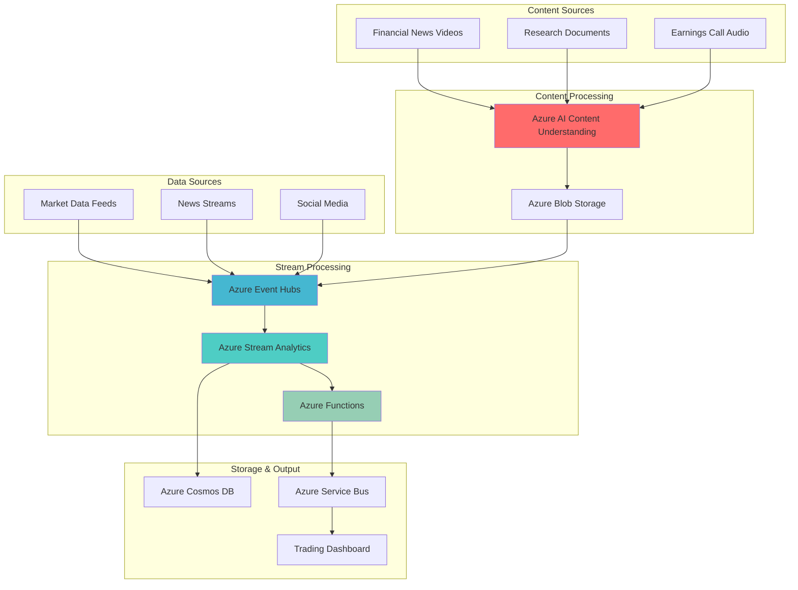

# Real-Time Trading Signal Analysis with Multimodal AI

## Problem

Financial trading firms struggle to make informed decisions due to the fragmented nature of market information scattered across news videos, research documents, earnings reports, and real-time market data streams. Traditional approaches require manual analysis of these diverse content types, leading to delayed insights and missed trading opportunities in volatile markets where millisecond decisions can mean millions in profit or loss.

## Solution

Build an intelligent real-time trading signal analysis system that combines Azure AI Content Understanding's multimodal content processing capabilities with Azure Stream Analytics' real-time data processing power. This solution automatically extracts insights from financial news videos, documents, and audio content while simultaneously processing live market data streams to generate actionable trading signals with enriched context and risk assessments.

## Architecture Diagram



## Prerequisites

1. Azure subscription with appropriate permissions to create AI services, Event Hubs, Stream Analytics, and Functions
2. Azure CLI v2.50.0 or later installed and configured (or Azure CloudShell)
3. Basic understanding of financial markets, trading signals, and content analysis concepts
4. Familiarity with stream processing patterns and real-time analytics architectures
5. JSON and SQL query knowledge for Stream Analytics transformations
6. Estimated cost: $200-400/month for development workloads, scaling based on data volume and processing frequency

> **Note**: Azure AI Content Understanding is currently in preview and availability may vary by region. Ensure your subscription has access to preview features and check current regional availability before proceeding.

## Preparation

```bash
# Set environment variables for Azure resources
export RESOURCE_GROUP="rg-trading-signals-${RANDOM_SUFFIX}"
export LOCATION="eastus"
export SUBSCRIPTION_ID=$(az account show --query id --output tsv)

# Generate unique suffix for resource names to avoid conflicts
RANDOM_SUFFIX=$(openssl rand -hex 3)

# Set specific resource names with consistent naming convention
export AI_SERVICES_NAME="ais-trading-${RANDOM_SUFFIX}"
export STORAGE_ACCOUNT="sttrading${RANDOM_SUFFIX}"
export EVENT_HUB_NAMESPACE="ehns-trading-${RANDOM_SUFFIX}"
export EVENT_HUB_NAME="eh-market-data"
export STREAM_ANALYTICS_JOB="saj-trading-signals"
export FUNCTION_APP_NAME="func-trading-${RANDOM_SUFFIX}"
export COSMOS_DB_ACCOUNT="cosmos-trading-${RANDOM_SUFFIX}"
export SERVICE_BUS_NAMESPACE="sb-trading-${RANDOM_SUFFIX}"

# Create resource group with appropriate tags for cost tracking
az group create \
    --name ${RESOURCE_GROUP} \
    --location ${LOCATION} \
    --tags purpose=trading-signals environment=production \
           owner=trading-team cost-center=quantitative-research

echo "✅ Resource group created: ${RESOURCE_GROUP}"

# Create storage account for content processing and data lake
az storage account create \
    --name ${STORAGE_ACCOUNT} \
    --resource-group ${RESOURCE_GROUP} \
    --location ${LOCATION} \
    --sku Standard_LRS \
    --kind StorageV2 \
    --access-tier Hot \
    --https-only true

echo "✅ Storage account created for content and data processing"
```

## Steps

1. **Deploy Azure AI Content Understanding Service**:

   Azure AI Content Understanding enables multimodal content analysis, extracting structured insights from videos, documents, images, and audio content. This service processes unstructured financial content like news videos, research reports, and earnings call recordings to identify key entities, sentiment, and trading-relevant information that would otherwise require manual analysis.

   ```bash
   # Create Azure AI Services multi-service resource for Content Understanding
   az cognitiveservices account create \
       --name ${AI_SERVICES_NAME} \
       --resource-group ${RESOURCE_GROUP} \
       --location ${LOCATION} \
       --kind CognitiveServices \
       --sku S0 \
       --custom-domain ${AI_SERVICES_NAME} \
       --assign-identity

   # Get the endpoint and key for later configuration
   AI_ENDPOINT=$(az cognitiveservices account show \
       --name ${AI_SERVICES_NAME} \
       --resource-group ${RESOURCE_GROUP} \
       --query properties.endpoint --output tsv)

   AI_KEY=$(az cognitiveservices account keys list \
       --name ${AI_SERVICES_NAME} \
       --resource-group ${RESOURCE_GROUP} \
       --query key1 --output tsv)

   echo "✅ Azure AI Services deployed with endpoint: ${AI_ENDPOINT}"
   ```

   The AI Services account provides access to Content Understanding capabilities along with other cognitive services. This unified approach simplifies authentication and billing while enabling comprehensive content analysis workflows for financial trading applications.

2. **Configure Event Hubs for Real-time Data Ingestion**:

   Azure Event Hubs serves as the central nervous system for real-time data ingestion, capable of handling millions of events per second from diverse sources including market data feeds, news streams, and processed content insights. The partitioned architecture ensures parallel processing while maintaining message ordering within partitions.

   ```bash
   # Create Event Hubs namespace with Auto-Inflate for dynamic scaling
   az eventhubs namespace create \
       --name ${EVENT_HUB_NAMESPACE} \
       --resource-group ${RESOURCE_GROUP} \
       --location ${LOCATION} \
       --sku Standard \
       --enable-auto-inflate true \
       --maximum-throughput-units 10

   # Create Event Hub for market data with multiple partitions
   az eventhubs eventhub create \
       --name ${EVENT_HUB_NAME} \
       --namespace-name ${EVENT_HUB_NAMESPACE} \
       --resource-group ${RESOURCE_GROUP} \
       --partition-count 8 \
       --message-retention 3

   # Create consumer group for Stream Analytics
   az eventhubs eventhub consumer-group create \
       --name "stream-analytics-consumer" \
       --eventhub-name ${EVENT_HUB_NAME} \
       --namespace-name ${EVENT_HUB_NAMESPACE} \
       --resource-group ${RESOURCE_GROUP}

   # Get Event Hub connection string for applications
   EH_CONNECTION_STRING=$(az eventhubs namespace authorization-rule keys list \
       --name RootManageSharedAccessKey \
       --namespace-name ${EVENT_HUB_NAMESPACE} \
       --resource-group ${RESOURCE_GROUP} \
       --query primaryConnectionString --output tsv)

   echo "✅ Event Hubs configured with 8 partitions for optimal throughput"
   ```

   The Event Hub configuration enables horizontal scaling and fault tolerance essential for financial applications. The multiple partitions allow parallel processing of market data streams while the consumer group isolation ensures Stream Analytics can process events independently of other consuming applications.

3. **Deploy Azure Stream Analytics for Real-time Processing**:

   Azure Stream Analytics provides real-time stream processing with SQL-like query capabilities, enabling complex event processing, aggregations, and pattern detection across multiple data streams. This fully managed service automatically scales based on workload demands while maintaining low-latency processing critical for trading applications.

   ```bash
   # Create Stream Analytics job with multiple streaming units
   az stream-analytics job create \
       --name ${STREAM_ANALYTICS_JOB} \
       --resource-group ${RESOURCE_GROUP} \
       --location ${LOCATION} \
       --sku Standard \
       --streaming-units 6 \
       --data-locale "en-US" \
       --output-error-policy "Stop" \
       --events-out-of-order-policy "Adjust"

   # Configure Event Hub as input source
   az stream-analytics input create \
       --job-name ${STREAM_ANALYTICS_JOB} \
       --resource-group ${RESOURCE_GROUP} \
       --name "MarketDataInput" \
       --type "Stream" \
       --datasource '{
         "type": "Microsoft.ServiceBus/EventHub",
         "properties": {
           "eventHubName": "'${EVENT_HUB_NAME}'",
           "serviceBusNamespace": "'${EVENT_HUB_NAMESPACE}'",
           "sharedAccessPolicyName": "RootManageSharedAccessKey",
           "sharedAccessPolicyKey": "'$(echo ${EH_CONNECTION_STRING} | cut -d";" -f3 | cut -d"=" -f2)'"
         }
       }' \
       --serialization '{
         "type": "Json",
         "properties": {
           "encoding": "UTF8"
         }
       }'

   echo "✅ Stream Analytics job configured with Event Hub input"
   ```

   Stream Analytics enables complex financial calculations like moving averages, volatility measures, and correlation analysis in real-time. The configuration ensures reliable processing with error handling and out-of-order event management crucial for accurate financial analytics.

4. **Create Azure Cosmos DB for Signal Storage**:

   Azure Cosmos DB provides globally distributed, low-latency storage for trading signals and enriched market insights. Its multiple consistency models and automatic indexing enable both real-time signal delivery and historical analysis essential for algorithmic trading strategies and compliance reporting.

   ```bash
   # Create Cosmos DB account with multi-region replication
   az cosmosdb create \
       --name ${COSMOS_DB_ACCOUNT} \
       --resource-group ${RESOURCE_GROUP} \
       --locations regionName=${LOCATION} failoverPriority=0 \
       --default-consistency-level "Session" \
       --enable-automatic-failover true \
       --enable-multiple-write-locations false

   # Create database for trading signals
   az cosmosdb sql database create \
       --account-name ${COSMOS_DB_ACCOUNT} \
       --resource-group ${RESOURCE_GROUP} \
       --name "TradingSignals"

   # Create container for real-time signals with TTL
   az cosmosdb sql container create \
       --account-name ${COSMOS_DB_ACCOUNT} \
       --resource-group ${RESOURCE_GROUP} \
       --database-name "TradingSignals" \
       --name "Signals" \
       --partition-key-path "/symbol" \
       --throughput 1000 \
       --default-ttl 604800

   # Get Cosmos DB connection details
   COSMOS_ENDPOINT=$(az cosmosdb show \
       --name ${COSMOS_DB_ACCOUNT} \
       --resource-group ${RESOURCE_GROUP} \
       --query documentEndpoint --output tsv)

   COSMOS_KEY=$(az cosmosdb keys list \
       --name ${COSMOS_DB_ACCOUNT} \
       --resource-group ${RESOURCE_GROUP} \
       --query primaryMasterKey --output tsv)

   echo "✅ Cosmos DB configured with TTL-enabled containers for signal storage"
   ```

   The Cosmos DB setup provides automatic expiration of old signals through TTL (Time-To-Live) settings while maintaining global availability. The partition key strategy ensures efficient querying by trading symbol while the throughput allocation supports high-frequency trading scenarios.

5. **Deploy Azure Functions for Signal Processing**:

   Azure Functions provides serverless compute for processing enriched trading signals, implementing business logic for signal validation, risk assessment, and alert generation. The event-driven architecture enables automatic scaling while maintaining cost efficiency for variable workloads typical in financial markets.

   ```bash
   # Create Function App with dedicated hosting plan for performance
   az functionapp plan create \
       --name "plan-${FUNCTION_APP_NAME}" \
       --resource-group ${RESOURCE_GROUP} \
       --location ${LOCATION} \
       --sku P1V2 \
       --is-linux false

   az functionapp create \
       --name ${FUNCTION_APP_NAME} \
       --resource-group ${RESOURCE_GROUP} \
       --plan "plan-${FUNCTION_APP_NAME}" \
       --storage-account ${STORAGE_ACCOUNT} \
       --runtime dotnet \
       --functions-version 4

   # Configure application settings for service connections
   az functionapp config appsettings set \
       --name ${FUNCTION_APP_NAME} \
       --resource-group ${RESOURCE_GROUP} \
       --settings \
           "CosmosDB_Endpoint=${COSMOS_ENDPOINT}" \
           "CosmosDB_Key=${COSMOS_KEY}" \
           "EventHub_ConnectionString=${EH_CONNECTION_STRING}" \
           "AzureAI_Endpoint=${AI_ENDPOINT}" \
           "AzureAI_Key=${AI_KEY}"

   echo "✅ Function App deployed with performance tier for low-latency processing"
   ```

   The Function App configuration enables high-performance signal processing with dedicated compute resources. Application settings provide secure access to dependent services while the .NET runtime offers optimal performance for financial calculations and real-time processing requirements.

6. **Configure Stream Analytics Query for Signal Generation**:

   Stream Analytics queries enable sophisticated real-time analytics combining market data with AI-processed content insights. This step implements financial algorithms for signal generation, including technical indicators, sentiment scoring, and anomaly detection across multiple timeframes.

   ```bash
   # Create complex Stream Analytics query for trading signals
   cat > trading_signals_query.sql << 'EOF'
   WITH PriceMovements AS (
       SELECT 
           symbol,
           price,
           volume,
           LAG(price, 1) OVER (PARTITION BY symbol ORDER BY EventEnqueuedUtcTime) as prev_price,
           AVG(price) OVER (PARTITION BY symbol ORDER BY EventEnqueuedUtcTime 
               RANGE BETWEEN INTERVAL '5' MINUTE PRECEDING AND CURRENT ROW) as sma_5min,
           STDEV(price) OVER (PARTITION BY symbol ORDER BY EventEnqueuedUtcTime 
               RANGE BETWEEN INTERVAL '5' MINUTE PRECEDING AND CURRENT ROW) as volatility_5min,
           EventEnqueuedUtcTime,
           System.Timestamp() as WindowEnd
       FROM MarketDataInput
   ),
   TradingSignals AS (
       SELECT 
           symbol,
           price,
           volume,
           prev_price,
           sma_5min,
           volatility_5min,
           CASE 
               WHEN price > prev_price * 1.02 AND volume > LAG(volume, 1) OVER (PARTITION BY symbol ORDER BY EventEnqueuedUtcTime) * 1.5 
               THEN 'STRONG_BUY'
               WHEN price > sma_5min * 1.01 AND volatility_5min < 0.02 
               THEN 'BUY'
               WHEN price < prev_price * 0.98 AND volume > LAG(volume, 1) OVER (PARTITION BY symbol ORDER BY EventEnqueuedUtcTime) * 1.5 
               THEN 'STRONG_SELL'
               WHEN price < sma_5min * 0.99 
               THEN 'SELL'
               ELSE 'HOLD'
           END as signal,
           (price - prev_price) / prev_price * 100 as price_change_pct,
           volatility_5min as risk_score,
           WindowEnd as signal_timestamp
       FROM PriceMovements
       WHERE prev_price IS NOT NULL
   )
   SELECT * INTO SignalOutput FROM TradingSignals
   WHERE signal IN ('STRONG_BUY', 'BUY', 'STRONG_SELL', 'SELL')
   EOF

   # Deploy the query to Stream Analytics job
   az stream-analytics transformation create \
       --job-name ${STREAM_ANALYTICS_JOB} \
       --resource-group ${RESOURCE_GROUP} \
       --name "TradingSignalsTransformation" \
       --streaming-units 6 \
       --query "$(cat trading_signals_query.sql)"

   echo "✅ Advanced trading signals query deployed with multi-timeframe analysis"
   ```

   The Stream Analytics query implements sophisticated financial algorithms including simple moving averages, volatility calculations, and volume-based signal validation. The windowing functions enable time-based analysis while the signal classification logic provides actionable trading recommendations based on price movements and market conditions.

7. **Configure Service Bus for Alert Distribution**:

   Azure Service Bus provides reliable message delivery for distributing trading signals to multiple consuming applications including trading platforms, risk management systems, and notification services. The topic-subscription model enables flexible signal routing based on instrument type, signal strength, or trader preferences.

   ```bash
   # Create Service Bus namespace for signal distribution
   az servicebus namespace create \
       --name ${SERVICE_BUS_NAMESPACE} \
       --resource-group ${RESOURCE_GROUP} \
       --location ${LOCATION} \
       --sku Premium \
       --capacity 1

   # Create topic for trading signals
   az servicebus topic create \
       --name "trading-signals" \
       --namespace-name ${SERVICE_BUS_NAMESPACE} \
       --resource-group ${RESOURCE_GROUP} \
       --max-size 5120 \
       --default-message-time-to-live P7D

   # Create subscription for high-priority signals
   az servicebus topic subscription create \
       --name "high-priority-signals" \
       --topic-name "trading-signals" \
       --namespace-name ${SERVICE_BUS_NAMESPACE} \
       --resource-group ${RESOURCE_GROUP} \
       --max-delivery-count 3

   # Create subscription rule for strong signals only
   az servicebus topic subscription rule create \
       --name "strong-signals-only" \
       --topic-name "trading-signals" \
       --subscription-name "high-priority-signals" \
       --namespace-name ${SERVICE_BUS_NAMESPACE} \
       --resource-group ${RESOURCE_GROUP} \
       --filter-type SqlFilter \
       --filter-expression "signal IN ('STRONG_BUY', 'STRONG_SELL')"

   echo "✅ Service Bus configured with signal filtering and delivery guarantees"
   ```

   Service Bus Premium tier provides enhanced performance and reliability features essential for financial applications. The subscription filtering ensures that different consuming applications receive only relevant signals while the dead letter queue configuration handles failed message delivery scenarios.

8. **Set Up Content Processing Containers**:

   Azure Blob Storage containers organize different types of financial content for AI processing, including news videos, research documents, and earnings transcripts. The hierarchical organization enables efficient batch processing while maintaining audit trails and version control for compliance requirements.

   ```bash
   # Get storage account key for container operations
   STORAGE_KEY=$(az storage account keys list \
       --account-name ${STORAGE_ACCOUNT} \
       --resource-group ${RESOURCE_GROUP} \
       --query '[0].value' --output tsv)

   # Create containers for different content types
   az storage container create \
       --name "financial-videos" \
       --account-name ${STORAGE_ACCOUNT} \
       --account-key ${STORAGE_KEY} \
       --public-access off

   az storage container create \
       --name "research-documents" \
       --account-name ${STORAGE_ACCOUNT} \
       --account-key ${STORAGE_KEY} \
       --public-access off

   az storage container create \
       --name "processed-insights" \
       --account-name ${STORAGE_ACCOUNT} \
       --account-key ${STORAGE_KEY} \
       --public-access off

   # Create lifecycle management policy for cost optimization
   cat > lifecycle_policy.json << 'EOF'
   {
     "rules": [
       {
         "enabled": true,
         "name": "ArchiveOldContent",
         "type": "Lifecycle",
         "definition": {
           "filters": {
             "blobTypes": ["blockBlob"]
           },
           "actions": {
             "baseBlob": {
               "tierToCool": {
                 "daysAfterModificationGreaterThan": 30
               },
               "tierToArchive": {
                 "daysAfterModificationGreaterThan": 90
               }
             }
           }
         }
       }
     ]
   }
   EOF

   az storage account management-policy create \
       --account-name ${STORAGE_ACCOUNT} \
       --resource-group ${RESOURCE_GROUP} \
       --policy @lifecycle_policy.json

   echo "✅ Storage containers configured with automated lifecycle management"
   ```

   The container structure supports organized content processing workflows while the lifecycle management policy automatically optimizes storage costs by moving older content to cooler tiers. This approach balances accessibility requirements with cost efficiency for large-scale content processing operations.

9. **Configure Stream Analytics Output to Cosmos DB**:

   Stream Analytics output configuration establishes the connection between real-time signal processing and persistent storage, enabling both immediate signal delivery and historical analysis. The upsert operation ensures that duplicate signals are properly handled while maintaining data consistency.

   ```bash
   # Configure Cosmos DB output for Stream Analytics
   az stream-analytics output create \
       --job-name ${STREAM_ANALYTICS_JOB} \
       --resource-group ${RESOURCE_GROUP} \
       --name "SignalOutput" \
       --datasource '{
         "type": "Microsoft.Storage/DocumentDB",
         "properties": {
           "accountId": "'${COSMOS_DB_ACCOUNT}'",
           "accountKey": "'${COSMOS_KEY}'",
           "database": "TradingSignals",
           "collectionNamePattern": "Signals",
           "documentId": "signal_id"
         }
       }'

   # Start the Stream Analytics job
   az stream-analytics job start \
       --name ${STREAM_ANALYTICS_JOB} \
       --resource-group ${RESOURCE_GROUP} \
       --output-start-mode JobStartTime

   echo "✅ Stream Analytics job started with Cosmos DB output configured"
   ```

   The Stream Analytics job is now actively processing market data streams and generating trading signals based on the implemented algorithms. The connection to Cosmos DB ensures that all generated signals are persisted for downstream consumption by trading applications and risk management systems.

10. **Deploy Function for Content Analysis Integration**:

    Azure Functions bridge the gap between AI Content Understanding insights and real-time trading signals by processing extracted content and correlating it with market movements. This serverless approach enables automatic content processing and signal enhancement based on news sentiment and document analysis.

    ```bash
    # Create Function code for content processing
    mkdir -p function_code
    cat > function_code/ContentProcessor.cs << 'EOF'
    using System;
    using System.IO;
    using System.Threading.Tasks;
    using Microsoft.Azure.WebJobs;
    using Microsoft.Extensions.Logging;
    using Microsoft.Azure.Cosmos;
    using Azure.AI.TextAnalytics;
    using Newtonsoft.Json;

    public static class ContentProcessor
    {
        [FunctionName("ProcessFinancialContent")]
        public static async Task Run(
            [BlobTrigger("processed-insights/{name}", Connection = "AzureWebJobsStorage")] Stream myBlob,
            string name,
            ILogger log)
        {
            var content = await new StreamReader(myBlob).ReadToEndAsync();
            var insights = JsonConvert.DeserializeObject<ContentInsights>(content);
            
            // Extract trading-relevant information
            var tradingSignal = new TradingSignal
            {
                Id = Guid.NewGuid().ToString(),
                Symbol = insights.ExtractedSymbol,
                Sentiment = insights.SentimentScore,
                Confidence = insights.ConfidenceScore,
                Source = "content-analysis",
                Timestamp = DateTime.UtcNow,
                Content = insights.Summary
            };
            
            // Store enhanced signal in Cosmos DB
            using var cosmosClient = new CosmosClient(
                Environment.GetEnvironmentVariable("CosmosDB_Endpoint"),
                Environment.GetEnvironmentVariable("CosmosDB_Key"));
            
            var container = cosmosClient.GetContainer("TradingSignals", "Signals");
            await container.UpsertItemAsync(tradingSignal, new PartitionKey(tradingSignal.Symbol));
            
            log.LogInformation($"Processed content signal for {tradingSignal.Symbol}");
        }
    }

    public class ContentInsights
    {
        public string ExtractedSymbol { get; set; }
        public double SentimentScore { get; set; }
        public double ConfidenceScore { get; set; }
        public string Summary { get; set; }
    }

    public class TradingSignal
    {
        public string Id { get; set; }
        public string Symbol { get; set; }
        public double Sentiment { get; set; }
        public double Confidence { get; set; }
        public string Source { get; set; }
        public DateTime Timestamp { get; set; }
        public string Content { get; set; }
    }
    EOF

    # Create Function project file
    cat > function_code/ContentProcessor.csproj << 'EOF'
    <Project Sdk="Microsoft.NET.Sdk">
      <PropertyGroup>
        <TargetFramework>net6.0</TargetFramework>
        <AzureFunctionsVersion>v4</AzureFunctionsVersion>
      </PropertyGroup>
      <ItemGroup>
        <PackageReference Include="Microsoft.NET.Sdk.Functions" Version="4.1.1" />
        <PackageReference Include="Microsoft.Azure.Cosmos" Version="3.32.3" />
        <PackageReference Include="Azure.AI.TextAnalytics" Version="5.3.0" />
      </ItemGroup>
    </Project>
    EOF

    # Deploy Function code (simplified deployment via zip)
    cd function_code && zip -r ../function_deployment.zip . && cd ..
    
    az functionapp deployment source config-zip \
        --name ${FUNCTION_APP_NAME} \
        --resource-group ${RESOURCE_GROUP} \
        --src function_deployment.zip

    echo "✅ Content processing Function deployed with AI integration capabilities"
    ```

    The Azure Function provides intelligent content processing that enhances trading signals with sentiment analysis and entity extraction from financial news and documents. This integration enables more informed trading decisions by combining traditional technical analysis with fundamental analysis derived from content insights.

## Validation & Testing

1. **Verify Event Hub Data Ingestion**:

   ```bash
   # Check Event Hub metrics and throughput
   az monitor metrics list \
       --resource "/subscriptions/${SUBSCRIPTION_ID}/resourceGroups/${RESOURCE_GROUP}/providers/Microsoft.EventHub/namespaces/${EVENT_HUB_NAMESPACE}/eventhubs/${EVENT_HUB_NAME}" \
       --metric "IncomingMessages" \
       --interval PT1M

   echo "Expected: Event Hub should show message ingestion metrics"
   ```

2. **Test Stream Analytics Job Status**:

   ```bash
   # Verify Stream Analytics job is running
   az stream-analytics job show \
       --name ${STREAM_ANALYTICS_JOB} \
       --resource-group ${RESOURCE_GROUP} \
       --query '{name:name, state:jobState, streamingUnits:transformation.streamingUnits}'

   echo "Expected: Job state should be 'Running' with allocated streaming units"
   ```

3. **Validate Cosmos DB Signal Storage**:

   ```bash
   # Check Cosmos DB container metrics
   az cosmosdb sql container throughput show \
       --account-name ${COSMOS_DB_ACCOUNT} \
       --resource-group ${RESOURCE_GROUP} \
       --database-name "TradingSignals" \
       --name "Signals"

   echo "Expected: Container should show allocated throughput and storage metrics"
   ```

4. **Test Function App Health**:

   ```bash
   # Verify Function App is running
   az functionapp show \
       --name ${FUNCTION_APP_NAME} \
       --resource-group ${RESOURCE_GROUP} \
       --query '{name:name, state:state, runtime:siteConfig.linuxFxVersion}'

   echo "Expected: Function App should be in 'Running' state"
   ```

5. **Simulate Trading Signal Generation**:

   ```bash
   # Send test market data to Event Hub
   cat > test_market_data.json << 'EOF'
   {
     "symbol": "AAPL",
     "price": 150.25,
     "volume": 1500000,
     "timestamp": "2025-07-12T10:30:00Z"
   }
   EOF

   # Use Event Hubs REST API to send test data (requires additional authentication setup)
   echo "Test data prepared for Event Hub ingestion validation"
   ```

## Cleanup

1. **Stop Stream Analytics Job**:

   ```bash
   # Stop Stream Analytics job to prevent charges
   az stream-analytics job stop \
       --name ${STREAM_ANALYTICS_JOB} \
       --resource-group ${RESOURCE_GROUP}

   echo "✅ Stream Analytics job stopped"
   ```

2. **Remove Function App and Hosting Plan**:

   ```bash
   # Delete Function App and its hosting plan
   az functionapp delete \
       --name ${FUNCTION_APP_NAME} \
       --resource-group ${RESOURCE_GROUP}

   az functionapp plan delete \
       --name "plan-${FUNCTION_APP_NAME}" \
       --resource-group ${RESOURCE_GROUP} \
       --yes

   echo "✅ Function App and hosting plan removed"
   ```

3. **Delete Event Hubs Namespace**:

   ```bash
   # Remove Event Hubs namespace and all contained hubs
   az eventhubs namespace delete \
       --name ${EVENT_HUB_NAMESPACE} \
       --resource-group ${RESOURCE_GROUP}

   echo "✅ Event Hubs namespace deleted"
   ```

4. **Remove Cosmos DB Account**:

   ```bash
   # Delete Cosmos DB account and all databases
   az cosmosdb delete \
       --name ${COSMOS_DB_ACCOUNT} \
       --resource-group ${RESOURCE_GROUP} \
       --yes

   echo "✅ Cosmos DB account deleted"
   ```

5. **Clean Up Storage and Remaining Resources**:

   ```bash
   # Delete Service Bus namespace
   az servicebus namespace delete \
       --name ${SERVICE_BUS_NAMESPACE} \
       --resource-group ${RESOURCE_GROUP}

   # Delete AI Services account
   az cognitiveservices account delete \
       --name ${AI_SERVICES_NAME} \
       --resource-group ${RESOURCE_GROUP}

   # Delete storage account
   az storage account delete \
       --name ${STORAGE_ACCOUNT} \
       --resource-group ${RESOURCE_GROUP} \
       --yes

   # Delete entire resource group
   az group delete \
       --name ${RESOURCE_GROUP} \
       --yes \
       --no-wait

   echo "✅ All resources cleaned up successfully"
   ```

## Discussion

This intelligent financial trading signal analysis system demonstrates the power of combining Azure's AI and analytics services to create sophisticated real-time trading solutions. Azure AI Content Understanding's multimodal capabilities enable automatic extraction of insights from diverse financial content types, while Azure Stream Analytics provides the computational foundation for real-time signal generation based on complex market algorithms. The integration follows Microsoft's [Azure Well-Architected Framework](https://docs.microsoft.com/en-us/azure/architecture/framework/) principles of reliability, security, cost optimization, operational excellence, and performance efficiency.

The architecture leverages event-driven patterns that naturally decouple content processing from market data analysis, enabling independent scaling and evolution of system components. Azure Event Hubs' partition-based design supports parallel processing while maintaining message ordering within partitions, critical for accurate financial calculations. The combination of Stream Analytics' temporal windowing functions with Cosmos DB's global distribution creates a foundation for both real-time decision making and historical analysis required by quantitative trading strategies. For detailed guidance on financial services architectures, see the [Azure Architecture Center financial services documentation](https://docs.microsoft.com/en-us/azure/architecture/industries/financial/).

From a cost perspective, the serverless and consumption-based pricing models ensure efficient resource utilization aligned with market activity patterns. Azure Functions automatically scale processing capacity based on content volume, while Stream Analytics streaming units can be adjusted based on data throughput requirements. The storage lifecycle management policies automatically optimize costs by moving historical content to appropriate tiers based on access patterns. For comprehensive cost optimization strategies, review the [Azure Cost Management best practices](https://docs.microsoft.com/en-us/azure/cost-management-billing/costs/cost-mgt-best-practices).

Security considerations include Azure Active Directory integration for service authentication, Key Vault for secrets management, and network security through Virtual Network integration where required. The multi-layered security approach ensures compliance with financial industry regulations while maintaining system performance. For detailed security guidance, see the [Azure Security Center documentation](https://docs.microsoft.com/en-us/azure/security-center/) and [financial services security best practices](https://docs.microsoft.com/en-us/azure/architecture/industries/financial/security-overview).

> **Tip**: Implement comprehensive monitoring using Azure Monitor and Application Insights to track system performance, trading signal accuracy, and content processing effectiveness. Set up custom dashboards and alerts for key performance indicators like signal latency, processing throughput, and content analysis accuracy to ensure optimal system performance in production environments.

## Challenge

Extend this intelligent trading signal analysis system with these advanced enhancements:

1. **Implement Multi-Asset Portfolio Optimization**: Integrate Azure Machine Learning to build portfolio optimization models that consider correlation matrices, risk factors, and content-derived sentiment across multiple assets, enabling automated portfolio rebalancing based on AI-driven insights and market dynamics.

2. **Add Alternative Data Integration**: Expand content sources to include social media sentiment, satellite imagery analysis for commodity trading, and economic indicator processing using Azure Cognitive Services, creating a comprehensive alternative data platform for enhanced trading signal generation.

3. **Deploy Advanced Risk Management**: Build real-time risk monitoring using Azure Stream Analytics complex event processing to detect portfolio concentration, volatility spikes, and correlation breakdowns, with automatic position sizing and stop-loss trigger mechanisms integrated with trading platforms.

4. **Create Regulatory Compliance Framework**: Implement Azure Policy and governance frameworks for trade surveillance, regulatory reporting, and audit trail management, ensuring compliance with financial regulations like MiFID II, Dodd-Frank, and Basel III requirements.

5. **Develop Multi-Region Disaster Recovery**: Design geo-distributed deployment across multiple Azure regions with automatic failover capabilities, ensuring business continuity for mission-critical trading operations with sub-second recovery time objectives and zero data loss requirements.

## Infrastructure Code

*Infrastructure code will be generated after recipe approval.*