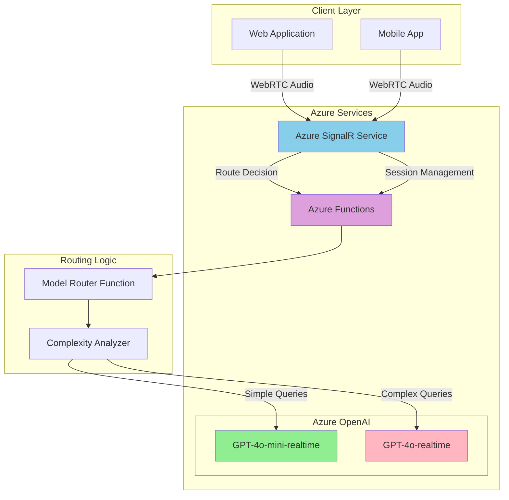

# Real-Time AI Chat with WebRTC and Model Router

## Problem

Modern customer service and virtual assistant applications require ultra-low latency voice interactions with AI models, but current solutions often suffer from delayed responses, high costs from using premium models for all interactions, and complex infrastructure management for real-time audio streaming. Organizations need intelligent routing between cost-effective and premium AI models based on conversation complexity while maintaining seamless real-time voice communication.

## Solution

Build a real-time voice chat application using Azure OpenAI's WebRTC-enabled Realtime API with intelligent model routing between GPT-4o-mini and GPT-4o models based on conversation complexity. Azure Functions provides serverless model routing logic while Azure SignalR Service manages client connections and real-time communication state, optimizing both performance and cost.

## Architecture Diagram



## Prerequisites

1. Azure subscription with contributor permissions for resource creation
2. Azure CLI installed and configured (version 2.50.0 or later)
3. Node.js 18+ for local testing and development
4. Basic understanding of WebRTC, real-time communication, and Azure services
5. Estimated cost: $15-25 for testing resources over 2-3 days

> **Note**: This recipe uses preview features of Azure OpenAI's Realtime API. Ensure your subscription has access to GPT-4o realtime models in East US 2 or Sweden Central regions.

## Preparation

```bash
# Generate unique suffix for resource names
RANDOM_SUFFIX=$(openssl rand -hex 3)

# Set environment variables for Azure resources
export RESOURCE_GROUP="rg-realtime-chat-${RANDOM_SUFFIX}"
export LOCATION="eastus2"
export SUBSCRIPTION_ID=$(az account show --query id --output tsv)

# Create resource group with appropriate tags
az group create \
    --name ${RESOURCE_GROUP} \
    --location ${LOCATION} \
    --tags purpose=realtime-ai-chat environment=demo

echo "✅ Resource group created: ${RESOURCE_GROUP}"

# Set additional environment variables for services
export OPENAI_SERVICE="openai-${RANDOM_SUFFIX}"
export SIGNALR_SERVICE="signalr-${RANDOM_SUFFIX}"
export FUNCTION_APP="func-chat-router-${RANDOM_SUFFIX}"
export STORAGE_ACCOUNT="stchatrouter${RANDOM_SUFFIX}"
```

## Steps

1. **Create Azure OpenAI Service with Realtime Models**:

   Azure OpenAI's Realtime API enables low-latency, "speech in, speech out" conversational interactions using WebRTC for optimal audio streaming performance. The service supports both GPT-4o-realtime-preview for complex interactions and GPT-4o-mini-realtime-preview for cost-effective simple queries, allowing intelligent routing based on conversation complexity.

   ```bash
   # Create Azure OpenAI service
   az cognitiveservices account create \
       --name ${OPENAI_SERVICE} \
       --resource-group ${RESOURCE_GROUP} \
       --location ${LOCATION} \
       --kind OpenAI \
       --sku S0 \
       --custom-domain ${OPENAI_SERVICE}
   
   # Get the OpenAI endpoint and key
   export OPENAI_ENDPOINT=$(az cognitiveservices account show \
       --name ${OPENAI_SERVICE} \
       --resource-group ${RESOURCE_GROUP} \
       --query properties.endpoint --output tsv)
   
   export OPENAI_KEY=$(az cognitiveservices account keys list \
       --name ${OPENAI_SERVICE} \
       --resource-group ${RESOURCE_GROUP} \
       --query key1 --output tsv)
   
   echo "✅ Azure OpenAI service created: ${OPENAI_SERVICE}"
   ```

   The OpenAI service is now configured with the necessary endpoints for both WebRTC Realtime API access and standard API calls. This foundation enables dual-model routing for optimized cost and performance.

2. **Deploy Realtime Models for Intelligent Routing**:

   Model deployment creates dedicated compute capacity for both cost-effective and premium AI interactions. GPT-4o-mini-realtime-preview provides 60% cost savings for simple queries, while GPT-4o-realtime-preview handles complex conversations requiring advanced reasoning capabilities.

   ```bash
   # Deploy GPT-4o-mini-realtime model for cost-effective interactions
   az cognitiveservices account deployment create \
       --name ${OPENAI_SERVICE} \
       --resource-group ${RESOURCE_GROUP} \
       --deployment-name gpt-4o-mini-realtime \
       --model-name gpt-4o-mini-realtime-preview \
       --model-version "2024-12-17" \
       --model-format OpenAI \
       --sku-capacity 10 \
       --sku-name GlobalStandard
   
   # Deploy GPT-4o-realtime model for complex interactions
   az cognitiveservices account deployment create \
       --name ${OPENAI_SERVICE} \
       --resource-group ${RESOURCE_GROUP} \
       --deployment-name gpt-4o-realtime \
       --model-name gpt-4o-realtime-preview \
       --model-version "2024-12-17" \
       --model-format OpenAI \
       --sku-capacity 10 \
       --sku-name GlobalStandard
   
   echo "✅ Realtime models deployed for intelligent routing"
   ```

   Both models are now available with WebRTC capabilities, enabling the routing logic to dynamically select the most cost-effective model based on conversation complexity analysis.

3. **Create Azure SignalR Service for Connection Management**:

   Azure SignalR Service provides managed real-time communication infrastructure with automatic scaling and persistent connection handling. The service abstracts WebSocket management complexities while integrating seamlessly with Azure Functions for serverless event processing.

   ```bash
   # Create SignalR Service in Serverless mode
   az signalr create \
       --name ${SIGNALR_SERVICE} \
       --resource-group ${RESOURCE_GROUP} \
       --location ${LOCATION} \
       --sku Standard_S1 \
       --service-mode Serverless \
       --enable-message-logs true
   
   # Get SignalR connection string
   export SIGNALR_CONNECTION_STRING=$(az signalr key list \
       --name ${SIGNALR_SERVICE} \
       --resource-group ${RESOURCE_GROUP} \
       --query primaryConnectionString --output tsv)
   
   echo "✅ SignalR Service created in Serverless mode: ${SIGNALR_SERVICE}"
   ```

   SignalR Service is configured for serverless integration, enabling Azure Functions to manage real-time connections without maintaining persistent server instances. This architecture supports elastic scaling based on active user connections.

4. **Create Storage Account for Function App**:

   Azure Functions requires dedicated storage for function execution state, deployment packages, and runtime logs. The storage account provides the necessary infrastructure for serverless model routing logic and connection state management.

   ```bash
   # Create storage account for Function App
   az storage account create \
       --name ${STORAGE_ACCOUNT} \
       --resource-group ${RESOURCE_GROUP} \
       --location ${LOCATION} \
       --sku Standard_LRS \
       --kind StorageV2
   
   # Get storage connection string
   export STORAGE_CONNECTION_STRING=$(az storage account show-connection-string \
       --name ${STORAGE_ACCOUNT} \
       --resource-group ${RESOURCE_GROUP} \
       --query connectionString --output tsv)
   
   echo "✅ Storage account created: ${STORAGE_ACCOUNT}"
   ```

   The storage account provides persistent state management for function executions and enables reliable routing decision caching across multiple client sessions.

5. **Create Function App with Model Routing Logic**:

   Azure Functions provides serverless compute for implementing intelligent model routing based on conversation complexity analysis. The Function App integrates with both SignalR Service and Azure OpenAI to orchestrate real-time AI interactions while optimizing costs through smart model selection.

   ```bash
   # Create Function App with Node.js runtime
   az functionapp create \
       --name ${FUNCTION_APP} \
       --resource-group ${RESOURCE_GROUP} \
       --storage-account ${STORAGE_ACCOUNT} \
       --consumption-plan-location ${LOCATION} \
       --runtime node \
       --runtime-version 18 \
       --functions-version 4
   
   # Configure application settings for integration
   az functionapp config appsettings set \
       --name ${FUNCTION_APP} \
       --resource-group ${RESOURCE_GROUP} \
       --settings \
       "AzureSignalRConnectionString=${SIGNALR_CONNECTION_STRING}" \
       "AZURE_OPENAI_ENDPOINT=${OPENAI_ENDPOINT}" \
       "AZURE_OPENAI_KEY=${OPENAI_KEY}" \
       "OPENAI_API_VERSION=2025-04-01-preview"
   
   echo "✅ Function App created with routing configuration: ${FUNCTION_APP}"
   ```

   The Function App is now configured with all necessary connection strings and API keys to implement intelligent model routing between cost-effective and premium AI models.

6. **Deploy Model Router Function Code**:

   The model router function implements complexity analysis to determine optimal model selection based on conversation context, user intent, and query complexity. This serverless logic reduces costs by routing simple queries to GPT-4o-mini while reserving premium models for complex interactions.

   ```bash
   # Create local function project structure
   mkdir -p ./chat-router-functions/ModelRouter
   mkdir -p ./chat-router-functions/SignalRInfo
   mkdir -p ./chat-router-functions/SignalRMessages
   
   # Create package.json for dependencies
   cat > ./chat-router-functions/package.json << 'EOF'
   {
     "name": "chat-router-functions",
     "version": "1.0.0",
     "scripts": {
       "start": "func start"
     },
     "dependencies": {
       "@azure/functions": "^4.0.0",
       "@azure/signalr": "^1.0.0-beta.4",
       "axios": "^1.6.0"
     }
   }
   EOF
   
   # Create host.json configuration
   cat > ./chat-router-functions/host.json << 'EOF'
   {
     "version": "2.0",
     "extensionBundle": {
       "id": "Microsoft.Azure.Functions.ExtensionBundle",
       "version": "[3.*, 4.0.0)"
     }
   }
   EOF
   
   echo "✅ Function project structure created"
   ```

   The project structure is prepared with necessary dependencies for SignalR integration, HTTP processing, and Azure OpenAI API communication.

7. **Implement Complexity Analysis Router Function**:

   The router function analyzes incoming messages for complexity indicators such as technical terms, question depth, and context requirements. This analysis determines whether to route queries to the cost-effective GPT-4o-mini model or the premium GPT-4o model for optimal cost-performance balance.

   ```bash
   # Create ModelRouter index.js with intelligent routing logic
   cat > ./chat-router-functions/ModelRouter/index.js << 'EOF'
   const { app } = require('@azure/functions');
   const axios = require('axios');
   
   app.http('ModelRouter', {
       methods: ['POST'],
       authLevel: 'function',
       handler: async (request, context) => {
           try {
               const { message, userId, sessionId } = await request.json();
               
               // Analyze message complexity for intelligent routing
               const complexity = analyzeComplexity(message);
               const selectedModel = complexity > 0.6 ? 
                   'gpt-4o-realtime' : 'gpt-4o-mini-realtime';
               
               context.log(`Routing to ${selectedModel} (complexity: ${complexity})`);
               
               // Get ephemeral token for WebRTC connection
               const sessionToken = await getEphemeralToken(selectedModel);
               
               // Determine WebRTC endpoint based on deployment region
               const webrtcEndpoint = process.env.AZURE_OPENAI_ENDPOINT.includes('eastus2') ? 
                   'https://eastus2.realtimeapi-preview.ai.azure.com/v1/realtimertc' : 
                   'https://swedencentral.realtimeapi-preview.ai.azure.com/v1/realtimertc';
               
               return {
                   status: 200,
                   jsonBody: {
                       model: selectedModel,
                       sessionToken: sessionToken,
                       webrtcEndpoint: webrtcEndpoint,
                       complexity: complexity,
                       cost_optimization: selectedModel === 'gpt-4o-mini-realtime' ? 
                           'Using cost-effective model' : 'Using premium model for complex query'
                   }
               };
           } catch (error) {
               context.log.error('Router error:', error);
               return {
                   status: 500,
                   jsonBody: { error: 'Model routing failed' }
               };
           }
       }
   });
   
   function analyzeComplexity(message) {
       const complexIndicators = [
           /technical|programming|code|algorithm|architecture/i,
           /explain.*how.*works|analyze|compare|evaluate/i,
           /\b(why|what|how|when|where)\b.*\b(should|would|could|might)\b/i,
           /multiple.*steps|process|procedure|methodology/i
       ];
       
       const simpleIndicators = [
           /^(hi|hello|hey|thanks|yes|no|ok)\b/i,
           /\b(weather|time|date|simple|quick)\b/i,
           /^.{1,20}$/  // Very short messages
       ];
       
       let complexityScore = 0.3; // Base complexity
       
       // Increase complexity for technical indicators
       complexIndicators.forEach(pattern => {
           if (pattern.test(message)) complexityScore += 0.2;
       });
       
       // Decrease complexity for simple indicators
       simpleIndicators.forEach(pattern => {
           if (pattern.test(message)) complexityScore -= 0.2;
       });
       
       // Length-based complexity adjustment
       if (message.length > 100) complexityScore += 0.1;
       if (message.split(' ').length > 20) complexityScore += 0.1;
       
       return Math.max(0, Math.min(1, complexityScore));
   }
   
   async function getEphemeralToken(model) {
       const sessionUrl = `${process.env.AZURE_OPENAI_ENDPOINT}/openai/realtimeapi/sessions?api-version=${process.env.OPENAI_API_VERSION}`;
       
       const response = await axios.post(sessionUrl, {
           model: model,
           voice: 'alloy',
           instructions: 'You are a helpful AI assistant. Respond naturally and concisely.'
       }, {
           headers: {
               'api-key': process.env.AZURE_OPENAI_KEY,
               'Content-Type': 'application/json'
           }
       });
       
       return response.data.token;
   }
   EOF
   
   echo "✅ Model router function implemented with complexity analysis"
   ```

   The router function now includes sophisticated complexity analysis that examines message content, length, and technical indicators to make intelligent routing decisions that balance cost and capability.

8. **Create SignalR Connection Management Functions**:

   SignalR connection management enables real-time communication coordination between clients and the AI models. These functions handle connection negotiation, session state management, and message broadcasting for seamless WebRTC audio streaming experiences.

   ```bash
   # Create SignalRInfo index.js for connection negotiation
   cat > ./chat-router-functions/SignalRInfo/index.js << 'EOF'
   const { app, input } = require('@azure/functions');
   
   app.http('SignalRInfo', {
       methods: ['POST'],
       authLevel: 'anonymous',
       extraInputs: [input.signalRConnectionInfo({
           hubName: 'ChatHub'
       })],
       handler: async (request, context) => {
           const connectionInfo = context.extraInputs.get('connectionInfo');
           
           return {
               status: 200,
               jsonBody: connectionInfo
           };
       }
   });
   EOF
   
   # Create SignalRMessages index.js for broadcasting
   cat > ./chat-router-functions/SignalRMessages/index.js << 'EOF'
   const { app, output } = require('@azure/functions');
   
   app.http('SignalRMessages', {
       methods: ['POST'],
       authLevel: 'function',
       extraOutputs: [output.signalR({
           hubName: 'ChatHub'
       })],
       handler: async (request, context) => {
           const { userId, message, model, timestamp } = await request.json();
           
           const signalRMessage = {
               target: 'messageReceived',
               arguments: [{
                   userId,
                   message,
                   model,
                   timestamp,
                   type: 'ai-response'
               }]
           };
           
           context.extraOutputs.set('signalRMessages', signalRMessage);
           
           return {
               status: 200,
               jsonBody: { status: 'Message broadcasted' }
           };
       }
   });
   EOF
   
   echo "✅ SignalR connection management functions created"
   ```

   The SignalR functions provide connection negotiation for clients and message broadcasting capabilities, enabling real-time coordination between the WebRTC audio streams and the routing logic.

9. **Deploy Function App Code**:

   Function deployment makes the intelligent routing logic available as serverless endpoints that scale automatically based on demand. The deployed functions handle model selection, WebRTC session management, and real-time communication coordination.

   ```bash
   # Navigate to function directory and install dependencies
   cd ./chat-router-functions
   npm install
   
   # Create deployment package
   zip -r ../function-deployment.zip . -x "node_modules/.bin/*"
   cd ..
   
   # Deploy function code to Azure
   az functionapp deployment source config-zip \
       --name ${FUNCTION_APP} \
       --resource-group ${RESOURCE_GROUP} \
       --src function-deployment.zip
   
   # Wait for deployment to complete
   sleep 30
   
   # Get function app URL for client integration
   export FUNCTION_BASE_URL="https://${FUNCTION_APP}.azurewebsites.net"
   
   echo "✅ Function app deployed successfully"
   echo "Router endpoint: ${FUNCTION_BASE_URL}/api/ModelRouter"
   ```

   The Function App is now live with intelligent routing capabilities, ready to analyze conversation complexity and route requests to the most cost-effective AI model.

## Validation & Testing

1. **Verify Azure OpenAI Realtime Models**:

   ```bash
   # Check deployed models
   az cognitiveservices account deployment list \
       --name ${OPENAI_SERVICE} \
       --resource-group ${RESOURCE_GROUP} \
       --output table
   ```

   Expected output: Both gpt-4o-mini-realtime and gpt-4o-realtime deployments should show "Succeeded" status.

2. **Test SignalR Service Configuration**:

   ```bash
   # Verify SignalR service status
   az signalr show \
       --name ${SIGNALR_SERVICE} \
       --resource-group ${RESOURCE_GROUP} \
       --query "{name:name,serviceMode:properties.serviceMode,provisioningState:properties.provisioningState}"
   ```

   Expected output: Service mode should be "Serverless" and provisioning state "Succeeded".

3. **Test Model Routing Logic**:

   ```bash
   # Test simple query routing (should route to gpt-4o-mini)
   curl -X POST "${FUNCTION_BASE_URL}/api/ModelRouter" \
       -H "Content-Type: application/json" \
       -d '{"message":"Hello, how are you?","userId":"test-user","sessionId":"test-session"}'
   
   # Test complex query routing (should route to gpt-4o)
   curl -X POST "${FUNCTION_BASE_URL}/api/ModelRouter" \
       -H "Content-Type: application/json" \
       -d '{"message":"Can you explain the technical architecture of distributed microservices with event sourcing patterns?","userId":"test-user","sessionId":"test-session"}'
   ```

   Expected output: Simple queries return gpt-4o-mini-realtime model selection, complex queries return gpt-4o-realtime selection.

4. **Verify WebRTC Endpoint Configuration**:

   ```bash
   # Test ephemeral token generation
   EPHEMERAL_TOKEN=$(curl -s -X POST \
       "${OPENAI_ENDPOINT}/openai/realtimeapi/sessions?api-version=2025-04-01-preview" \
       -H "api-key: ${OPENAI_KEY}" \
       -H "Content-Type: application/json" \
       -d '{"model":"gpt-4o-mini-realtime","voice":"alloy"}' | \
       jq -r '.token')
   
   echo "Ephemeral token generated: ${EPHEMERAL_TOKEN:0:20}..."
   ```

   Expected output: A valid ephemeral token should be generated for WebRTC authentication.

## Cleanup

1. **Remove Function App and Storage**:

   ```bash
   # Delete Function App
   az functionapp delete \
       --name ${FUNCTION_APP} \
       --resource-group ${RESOURCE_GROUP}
   
   # Delete storage account
   az storage account delete \
       --name ${STORAGE_ACCOUNT} \
       --resource-group ${RESOURCE_GROUP} \
       --yes
   
   echo "✅ Function App and storage cleaned up"
   ```

2. **Remove SignalR Service**:

   ```bash
   # Delete SignalR Service
   az signalr delete \
       --name ${SIGNALR_SERVICE} \
       --resource-group ${RESOURCE_GROUP} \
       --yes
   
   echo "✅ SignalR Service deleted"
   ```

3. **Remove Azure OpenAI Service**:

   ```bash
   # Delete Azure OpenAI service
   az cognitiveservices account delete \
       --name ${OPENAI_SERVICE} \
       --resource-group ${RESOURCE_GROUP}
   
   echo "✅ Azure OpenAI service deleted"
   ```

4. **Remove Resource Group**:

   ```bash
   # Delete entire resource group
   az group delete \
       --name ${RESOURCE_GROUP} \
       --yes \
       --no-wait
   
   echo "✅ Resource group deletion initiated: ${RESOURCE_GROUP}"
   echo "Note: Complete deletion may take several minutes"
   
   # Clean up environment variables
   unset RESOURCE_GROUP LOCATION SUBSCRIPTION_ID OPENAI_SERVICE
   unset SIGNALR_SERVICE FUNCTION_APP STORAGE_ACCOUNT
   unset OPENAI_ENDPOINT OPENAI_KEY SIGNALR_CONNECTION_STRING
   ```

## Discussion

This recipe demonstrates the powerful combination of Azure's real-time communication services with intelligent AI model routing for cost optimization. The WebRTC-enabled Realtime API from Azure OpenAI provides ultra-low latency audio streaming that's essential for natural conversational AI experiences, while the intelligent routing system ensures optimal cost-performance balance.

The complexity analysis algorithm examines multiple factors including technical terminology, question structure, message length, and conversation context to determine the most appropriate model. Simple queries like greetings, basic questions, or short responses are routed to GPT-4o-mini-realtime, which costs 60% less than the premium model while maintaining excellent performance for straightforward interactions. Complex queries requiring deep reasoning, technical explanations, or multi-step analysis are routed to GPT-4o-realtime for superior capability.

Azure SignalR Service acts as the orchestration layer, managing WebSocket connections and enabling real-time coordination between clients and the AI models. The serverless mode integration with Azure Functions eliminates infrastructure management while providing automatic scaling based on connection demand. This architecture follows Azure Well-Architected Framework principles by implementing cost optimization through intelligent resource utilization and operational excellence through managed services.

Security considerations include the use of ephemeral tokens for WebRTC authentication, which expire after one minute to minimize credential exposure. The Azure Functions provide an additional security layer by validating requests and managing API keys securely through application settings. All communication occurs over encrypted channels with Azure's built-in TLS termination.

> **Tip**: Monitor conversation patterns and adjust complexity thresholds based on actual usage to optimize cost savings. Azure Monitor and Application Insights provide detailed analytics on model selection patterns and cost impact.

For detailed implementation guidance, refer to the [Azure OpenAI Realtime API documentation](https://learn.microsoft.com/en-us/azure/ai-foundry/openai/how-to/realtime-audio-webrtc), [Azure SignalR Service architecture patterns](https://learn.microsoft.com/en-us/azure/azure-signalr/signalr-concept-azure-functions), [Azure Functions best practices](https://learn.microsoft.com/en-us/azure/azure-functions/functions-best-practices), [Azure Cost Management optimization strategies](https://learn.microsoft.com/en-us/azure/cost-management-billing/costs/cost-mgt-best-practices), and [Azure OpenAI pricing calculator](https://azure.microsoft.com/pricing/details/cognitive-services/openai-service/).

## Challenge

Extend this solution by implementing these enhancements:

1. **Conversation Context Memory**: Implement persistent conversation history using Azure Cosmos DB to maintain context across sessions and improve model routing decisions based on conversation progression.

2. **Advanced Analytics Dashboard**: Create a Power BI dashboard that visualizes model usage patterns, cost savings achieved through intelligent routing, and conversation complexity trends using Azure Monitor data.

3. **Multi-Language Support**: Extend the routing logic to consider language complexity and cultural nuances when selecting models, incorporating Azure Translator for multilingual conversation analysis.

4. **Load Balancing and Failover**: Implement regional failover and load balancing across multiple Azure OpenAI deployments to ensure high availability and optimal performance based on geographic proximity.

5. **Custom Model Fine-Tuning**: Train custom models on conversation patterns to improve complexity analysis accuracy and implement personalized routing based on user interaction history and preferences.

## Infrastructure Code

*Infrastructure code will be generated after recipe approval.*