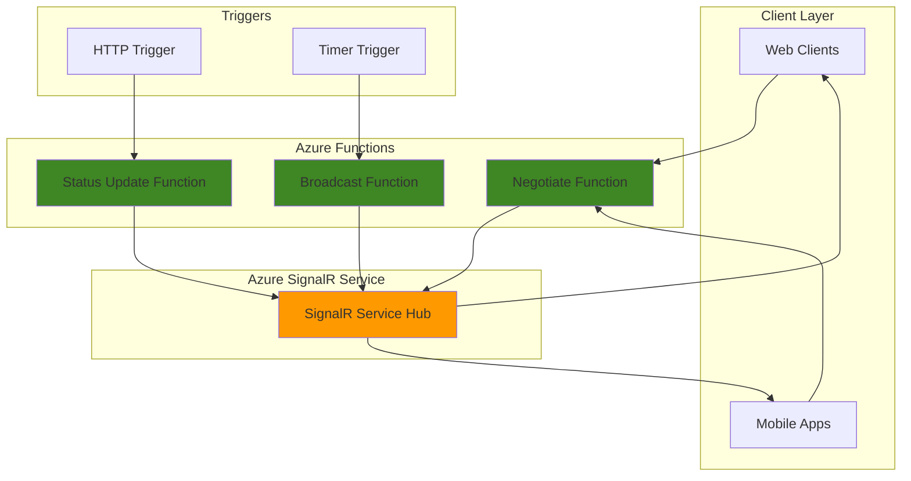

# Real-time Status Notifications with SignalR and Functions

## Problem

Businesses need to provide instant status updates to web clients without requiring constant page refreshes or polling. Traditional HTTP request-response patterns create delays and increase server load when multiple clients need immediate notifications about system changes, order updates, or operational status. Without real-time communication, users experience poor engagement and may miss critical updates.

## Solution

Build a serverless real-time notification system using Azure SignalR Service and Azure Functions. Azure SignalR Service handles WebSocket connections and message distribution at scale, while Azure Functions provide event-driven triggers to broadcast status updates. This combination eliminates infrastructure management while delivering instant notifications to connected clients with automatic scaling.

## Architecture Diagram



## Prerequisites

1. Azure account with an active subscription and permissions to create resources
2. Azure CLI 2.0 or later installed (or Azure Cloud Shell access)
3. Azure Functions Core Tools v4.0.5611 or higher for Node.js v4 programming model
4. Basic understanding of serverless computing concepts
5. Text editor for creating function code files
6. Estimated cost: Azure SignalR Service Free tier ($0/month for 20 connections), Azure Functions Consumption plan ($0.20 per million executions)

> **Note**: This recipe uses the Free tier for Azure SignalR Service, which includes 20 concurrent connections and 20,000 messages per day at no cost.

## Preparation

```bash
# Set environment variables for Azure resources
export RESOURCE_GROUP="rg-recipe-$(openssl rand -hex 3)"
export LOCATION="eastus"
export SUBSCRIPTION_ID=$(az account show --query id --output tsv)

# Generate unique suffix for resource names
RANDOM_SUFFIX=$(openssl rand -hex 3)
export SIGNALR_NAME="signalr${RANDOM_SUFFIX}"
export FUNCTION_APP_NAME="func${RANDOM_SUFFIX}"
export STORAGE_ACCOUNT="storage${RANDOM_SUFFIX}"

# Create resource group
az group create \
    --name ${RESOURCE_GROUP} \
    --location ${LOCATION} \
    --tags purpose=recipe environment=demo

echo "✅ Resource group created: ${RESOURCE_GROUP}"
```

## Steps

1. **Create Azure SignalR Service in Serverless Mode**:

   Azure SignalR Service provides managed real-time messaging capabilities that automatically scale based on connection demand. The Serverless mode is specifically designed for integration with Azure Functions, eliminating the need to manage hub servers while providing WebSocket connectivity and message broadcasting to all connected clients.

   ```bash
   # Create SignalR Service with Serverless mode
   az signalr create \
       --name ${SIGNALR_NAME} \
       --resource-group ${RESOURCE_GROUP} \
       --location ${LOCATION} \
       --sku Free_F1 \
       --service-mode Serverless \
       --tags purpose=recipe
   
   # Get connection string for Functions integration
   SIGNALR_CONNECTION=$(az signalr key list \
       --name ${SIGNALR_NAME} \
       --resource-group ${RESOURCE_GROUP} \
       --query primaryConnectionString \
       --output tsv)
   
   echo "✅ SignalR Service created in Serverless mode"
   ```

   The SignalR Service is now configured in Serverless mode, which means it will work exclusively with Azure Functions rather than requiring a dedicated hub server. This configuration optimizes costs and simplifies management for event-driven scenarios.

2. **Create Storage Account for Function App**:

   Azure Functions requires a storage account for function code, logs, and runtime state management. The storage account provides the necessary backing store for the serverless execution environment and enables features like durable function orchestration and debugging.

   ```bash
   # Create storage account for Functions
   az storage account create \
       --name ${STORAGE_ACCOUNT} \
       --resource-group ${RESOURCE_GROUP} \
       --location ${LOCATION} \
       --sku Standard_LRS \
       --tags purpose=recipe
   
   echo "✅ Storage account created for Function App"
   ```

3. **Create Function App with Node.js Runtime**:

   Azure Functions provides a serverless compute platform that executes code in response to events. Creating a Function App with the Consumption plan ensures automatic scaling and pay-per-execution billing, making it cost-effective for variable workloads while providing the necessary runtime environment for SignalR integration.

   ```bash
   # Create Function App
   az functionapp create \
       --name ${FUNCTION_APP_NAME} \
       --resource-group ${RESOURCE_GROUP} \
       --consumption-plan-location ${LOCATION} \
       --storage-account ${STORAGE_ACCOUNT} \
       --runtime node \
       --runtime-version 18 \
       --functions-version 4 \
       --tags purpose=recipe
   
   echo "✅ Function App created with Node.js runtime"
   ```

4. **Configure SignalR Connection in Function App**:

   Function Apps use application settings to store configuration values like connection strings. Adding the SignalR connection string as an application setting enables the Functions to authenticate with SignalR Service and use the bindings for real-time messaging without hardcoding sensitive information in the code.

   ```bash
   # Configure SignalR connection string
   az functionapp config appsettings set \
       --name ${FUNCTION_APP_NAME} \
       --resource-group ${RESOURCE_GROUP} \
       --settings "AzureSignalRConnectionString=${SIGNALR_CONNECTION}"
   
   # Enable CORS for web client access
   az functionapp cors add \
       --name ${FUNCTION_APP_NAME} \
       --resource-group ${RESOURCE_GROUP} \
       --allowed-origins "*"
   
   echo "✅ SignalR connection configured in Function App"
   ```

   > **Warning**: The CORS configuration uses "*" for all origins for demonstration purposes. In production environments, specify specific domains to enhance security and follow Azure security best practices.

5. **Initialize Functions Project and Create Negotiate Function**:

   The negotiate function is required by SignalR clients to obtain connection credentials. This HTTP-triggered function uses the SignalR input binding to generate access tokens and endpoint URLs that clients need to establish WebSocket connections with the SignalR Service.

   ```bash
   # Initialize local Functions project
   func init signalr-functions --javascript \
       --worker-runtime node --model V4
   
   cd signalr-functions
   
   # Install Azure Functions SignalR extension
   npm install @azure/functions
   
   # Create negotiate function code
   cat > src/functions/negotiate.js << 'EOF'
const { app, input } = require('@azure/functions');

const inputSignalR = input.generic({
    type: 'signalRConnectionInfo',
    name: 'connectionInfo',
    hubName: 'notifications',
    connectionStringSetting: 'AzureSignalRConnectionString'
});

app.http('negotiate', {
    methods: ['GET', 'POST'],
    authLevel: 'anonymous',
    extraInputs: [inputSignalR],
    handler: async (context) => {
        return { 
            body: JSON.stringify(context.extraInputs.get('connectionInfo'))
        };
    }
});
EOF
   
   echo "✅ Negotiate function code created"
   ```

6. **Deploy Functions to Azure**:

   Deploying the function code to Azure makes it available for client connections and real-time messaging. The deployment process uploads the function code, installs dependencies, and configures the runtime environment to handle HTTP requests and SignalR integration.

   ```bash
   # Deploy to Azure
   func azure functionapp publish ${FUNCTION_APP_NAME} \
       --javascript
   
   # Get function app URL
   FUNCTION_URL=$(az functionapp show \
       --name ${FUNCTION_APP_NAME} \
       --resource-group ${RESOURCE_GROUP} \
       --query defaultHostName \
       --output tsv)
   
   echo "✅ Functions deployed to: https://${FUNCTION_URL}"
   ```

7. **Create Status Broadcast Function**:

   A broadcast function demonstrates how to send real-time notifications to all connected clients. This timer-triggered function uses the SignalR output binding to push status messages to all clients connected to the notifications hub, simulating real-world status updates.

   ```bash
   # Create broadcast function code
   cat > src/functions/broadcast.js << 'EOF'
const { app, output } = require('@azure/functions');

const outputSignalR = output.generic({
    type: 'signalR',
    name: 'signalRMessages',
    hubName: 'notifications',
    connectionStringSetting: 'AzureSignalRConnectionString'
});

app.timer('broadcast', {
    schedule: '0 */30 * * * *', // Every 30 seconds
    extraOutputs: [outputSignalR],
    handler: async (myTimer, context) => {
        const statusMessage = {
            target: 'statusUpdate',
            arguments: [{
                timestamp: new Date().toISOString(),
                status: 'System operational',
                message: 'All services running normally'
            }]
        };

        context.extraOutputs.set(outputSignalR, statusMessage);
    }
});
EOF
   
   # Deploy updated functions
   func azure functionapp publish ${FUNCTION_APP_NAME} \
       --javascript
   
   echo "✅ Broadcast function created and deployed"
   ```

## Validation & Testing

1. **Verify SignalR Service is running**:

   ```bash
   # Check SignalR Service status
   az signalr show \
       --name ${SIGNALR_NAME} \
       --resource-group ${RESOURCE_GROUP} \
       --query provisioningState \
       --output tsv
   ```

   Expected output: `Succeeded`

2. **Test negotiate endpoint**:

   ```bash
   # Test the negotiate function
   curl -X POST https://${FUNCTION_URL}/api/negotiate
   ```

   Expected output: JSON response with `url`, `accessToken`, and connection information.

3. **Create simple HTML client to test real-time notifications**:

   ```bash
   # Create test client
   cat > test-client.html << 'EOF'
<!DOCTYPE html>
<html>
<head>
    <title>SignalR Test Client</title>
    <script src="https://unpkg.com/@microsoft/signalr@latest/dist/browser/signalr.min.js"></script>
    <style>
        body { font-family: Arial, sans-serif; margin: 20px; }
        #messages { border: 1px solid #ccc; padding: 10px; min-height: 200px; }
        .message { margin: 5px 0; padding: 5px; background: #f0f0f0; }
    </style>
</head>
<body>
    <h1>Real-time Status Notifications</h1>
    <div id="status">Connecting...</div>
    <div id="messages"></div>
    <script>
        const connection = new signalR.HubConnectionBuilder()
            .withUrl('FUNCTION_URL_PLACEHOLDER/api')
            .build();

        connection.on('statusUpdate', function (data) {
            const messages = document.getElementById('messages');
            const messageDiv = document.createElement('div');
            messageDiv.className = 'message';
            messageDiv.innerHTML = '<strong>' + data.timestamp + '</strong>: ' + data.message;
            messages.appendChild(messageDiv);
        });

        connection.start().then(function () {
            document.getElementById('status').innerHTML = 'Connected to SignalR';
            console.log('Connected to SignalR');
        }).catch(function (err) {
            document.getElementById('status').innerHTML = 'Connection failed: ' + err;
            console.error(err.toString());
        });
    </script>
</body>
</html>
EOF
   
   # Replace placeholder with actual URL
   sed -i "s/FUNCTION_URL_PLACEHOLDER/https:\/\/${FUNCTION_URL}/g" test-client.html
   
   echo "✅ Test client created - open test-client.html in browser"
   ```

## Cleanup

1. **Delete the resource group and all resources**:

   ```bash
   # Delete resource group and all contained resources
   az group delete \
       --name ${RESOURCE_GROUP} \
       --yes \
       --no-wait
   
   echo "✅ Resource group deletion initiated: ${RESOURCE_GROUP}"
   echo "Note: Deletion may take several minutes to complete"
   ```

2. **Clean up local files**:

   ```bash
   # Remove local files and project directory
   cd ..
   rm -rf signalr-functions test-client.html
   
   echo "✅ Local files cleaned up"
   ```

## Discussion

Azure SignalR Service combined with Azure Functions provides a powerful serverless architecture for real-time communication applications. The SignalR Service manages WebSocket connections and handles the complexity of maintaining persistent connections across multiple clients, while Azure Functions provide the serverless compute layer for processing events and triggering notifications.

The negotiate function pattern is essential for SignalR client authentication and connection establishment. This function generates secure access tokens that clients use to connect to the SignalR Service, ensuring proper authentication without exposing connection strings to client-side code. The serverless mode configuration optimizes the architecture by eliminating the need for dedicated hub servers, reducing operational overhead and costs.

This architecture follows Azure Well-Architected Framework principles by providing automatic scaling, cost optimization through consumption-based billing, and security through managed identity and connection string protection. The solution can handle thousands of concurrent connections with minimal configuration and scales automatically based on demand. The v4 programming model for Azure Functions provides improved developer experience with code-centric configuration and better TypeScript support.

Performance considerations include connection limits (20 for Free tier, 1,000 per unit for Standard tier) and message quotas (20,000 messages per day for Free tier, 1,000,000 for Standard tier). For production workloads, consider implementing connection management, message batching, and proper error handling to optimize performance and reliability.

**Documentation Sources:**
- [Real-time apps with Azure SignalR Service and Azure Functions](https://learn.microsoft.com/en-us/azure/azure-signalr/signalr-concept-azure-functions)
- [Azure Functions development and configuration with Azure SignalR Service](https://learn.microsoft.com/en-us/azure/azure-signalr/signalr-concept-serverless-development-config)
- [Azure SignalR Service pricing](https://azure.microsoft.com/pricing/details/signalr-service/)
- [Azure Functions SignalR Service bindings](https://learn.microsoft.com/en-us/azure/azure-functions/functions-bindings-signalr-service)
- [Azure Functions Node.js developer guide (v4)](https://learn.microsoft.com/en-us/azure/azure-functions/functions-reference-node)

> **Tip**: Use Azure Monitor and Application Insights to track SignalR connection metrics and function execution performance for production monitoring and optimization.

## Challenge

Extend this solution by implementing these enhancements:

1. **User-specific notifications**: Modify the negotiate function to support authenticated users and implement targeted messaging using SignalR groups or user IDs
2. **Message persistence**: Add Azure Cosmos DB integration to store notification history and enable message replay for reconnecting clients
3. **Multiple notification channels**: Create different SignalR hubs for various notification types (alerts, updates, chat) with topic-based message routing
4. **Horizontal scaling**: Implement multiple Function Apps across regions with Azure Traffic Manager for global real-time notification distribution
5. **Advanced client features**: Add message acknowledgments, connection retry logic, and offline message queuing using Azure Service Bus integration

## Infrastructure Code

*Infrastructure code will be generated after recipe approval.*