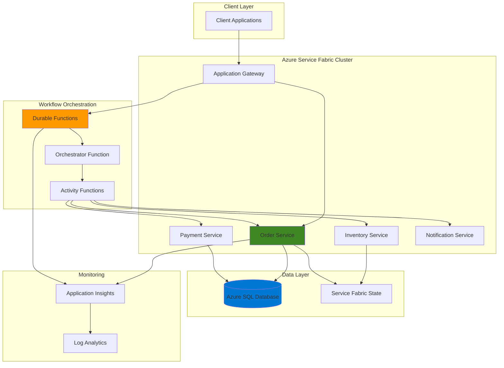

# Resilient Stateful Microservices with Azure Service Fabric and Durable Functions

## Problem

Modern enterprise applications require complex, long-running business processes that span multiple microservices, often involving external system integrations, human approvals, and retry logic. Traditional stateless microservices architectures struggle with maintaining workflow state across service boundaries, leading to increased complexity, reduced reliability, and difficult debugging when processes fail or need to be resumed. Without proper orchestration, businesses face significant challenges in tracking multi-step processes, handling failures gracefully, and ensuring data consistency across distributed services.

## Solution

Azure Service Fabric provides a robust platform for hosting stateful microservices with built-in clustering, health monitoring, and automatic failover capabilities. Combined with Azure Durable Functions for workflow orchestration and Azure SQL Database for persistent state management, this architecture enables resilient, scalable business process automation. The solution leverages Service Fabric's stateful service capabilities for maintaining business entity state while using Durable Functions to orchestrate complex workflows across multiple services with automatic checkpointing and recovery.

## Architecture Diagram



## Prerequisites

1. Azure subscription with permissions to create Service Fabric clusters, Function Apps, and SQL databases
2. Azure CLI v2.50+ installed and configured (or Azure Cloud Shell)
3. .NET 6.0 SDK or later for Service Fabric development
4. Visual Studio 2022 or Visual Studio Code with Azure extensions
5. Understanding of microservices architecture and distributed systems concepts
6. Basic knowledge of C# and Azure Functions development patterns
7. Estimated cost: $50-100 per day for development environment (delete resources after testing)

> **Note**: Service Fabric clusters require multiple VM instances and can be expensive to run continuously. Consider using Azure Container Instances for initial development and testing.

## Preparation

```bash
# Set environment variables for Azure resources
export RESOURCE_GROUP="rg-microservices-orchestration"
export LOCATION="eastus"
export SUBSCRIPTION_ID=$(az account show --query id --output tsv)

# Generate unique suffix for resource names
RANDOM_SUFFIX=$(openssl rand -hex 3)
export CLUSTER_NAME="sf-cluster-${RANDOM_SUFFIX}"
export SQL_SERVER_NAME="sql-orchestration-${RANDOM_SUFFIX}"
export SQL_DATABASE_NAME="MicroservicesState"
export FUNCTION_APP_NAME="func-orchestrator-${RANDOM_SUFFIX}"
export STORAGE_ACCOUNT_NAME="st${RANDOM_SUFFIX}"
export APP_INSIGHTS_NAME="ai-orchestration-${RANDOM_SUFFIX}"

# Create resource group
az group create \
    --name ${RESOURCE_GROUP} \
    --location ${LOCATION} \
    --tags purpose=microservices-orchestration environment=demo

# Create Application Insights for monitoring
az monitor app-insights component create \
    --app ${APP_INSIGHTS_NAME} \
    --location ${LOCATION} \
    --resource-group ${RESOURCE_GROUP} \
    --kind web

# Get Application Insights instrumentation key
export APP_INSIGHTS_KEY=$(az monitor app-insights component show \
    --app ${APP_INSIGHTS_NAME} \
    --resource-group ${RESOURCE_GROUP} \
    --query instrumentationKey --output tsv)

echo "✅ Resource group and monitoring components created"
```

## Steps

1. **Create Azure SQL Database for State Management**:

   Azure SQL Database provides a fully managed relational database service with built-in high availability, automatic backups, and intelligent performance optimization. In microservices architectures, a centralized database enables consistent state management across services while maintaining ACID properties for critical business transactions. This configuration supports the Command Query Responsibility Segregation (CQRS) pattern commonly used in event-driven microservices.

   ```bash
   # Create SQL Server with Azure AD authentication
   az sql server create \
       --name ${SQL_SERVER_NAME} \
       --resource-group ${RESOURCE_GROUP} \
       --location ${LOCATION} \
       --admin-user sqladmin \
       --admin-password "ComplexPassword123!" \
       --enable-ad-only-auth false

   # Configure firewall to allow Azure services
   az sql server firewall-rule create \
       --resource-group ${RESOURCE_GROUP} \
       --server ${SQL_SERVER_NAME} \
       --name AllowAzureServices \
       --start-ip-address 0.0.0.0 \
       --end-ip-address 0.0.0.0

   # Create database with performance tier suitable for microservices
   az sql db create \
       --resource-group ${RESOURCE_GROUP} \
       --server ${SQL_SERVER_NAME} \
       --name ${SQL_DATABASE_NAME} \
       --service-objective S1 \
       --backup-storage-redundancy Local

   echo "✅ Azure SQL Database created and configured"
   ```

   The SQL Database now provides a reliable foundation for storing workflow state, audit logs, and business entity data. With Azure AD integration and firewall rules configured, the database is ready to support secure connections from both Service Fabric services and Durable Functions.

2. **Create Storage Account for Durable Functions**:

   Azure Storage provides the underlying persistence mechanism for Durable Functions, storing workflow state, execution history, and task hub metadata. The storage account must be configured with appropriate redundancy and performance characteristics to support the expected workflow throughput and ensure durability of orchestration state.

   ```bash
   # Create storage account for Durable Functions
   az storage account create \
       --name ${STORAGE_ACCOUNT_NAME} \
       --resource-group ${RESOURCE_GROUP} \
       --location ${LOCATION} \
       --sku Standard_LRS \
       --kind StorageV2 \
       --access-tier Hot \
       --https-only true \
       --min-tls-version TLS1_2

   # Get storage account connection string
   export STORAGE_CONNECTION_STRING=$(az storage account show-connection-string \
       --name ${STORAGE_ACCOUNT_NAME} \
       --resource-group ${RESOURCE_GROUP} \
       --query connectionString --output tsv)

   echo "✅ Storage account configured for Durable Functions"
   ```

   The storage account is now optimized for Durable Functions with security best practices enabled, including HTTPS-only access and modern TLS encryption. This foundation ensures reliable workflow state persistence and supports the checkpointing mechanisms that enable fault-tolerant orchestration.

3. **Create Service Fabric Cluster**:

   Azure Service Fabric provides a distributed systems platform specifically designed for microservices architectures, offering automatic scaling, health monitoring, and seamless deployment capabilities. The cluster configuration includes multiple node types to support different service requirements and implements security best practices for production workloads.

   ```bash
   # Create Service Fabric cluster (this may take 10-15 minutes)
   az sf cluster create \
       --resource-group ${RESOURCE_GROUP} \
       --location ${LOCATION} \
       --cluster-name ${CLUSTER_NAME} \
       --cluster-size 3 \
       --vm-password "ComplexPassword123!" \
       --vm-user-name sfuser \
       --vm-sku Standard_D2s_v3 \
       --os WindowsServer2019Datacenter \
       --certificate-output-folder ./certificates \
       --certificate-password "CertPassword123!" \
       --upgrade-mode Automatic

   # Enable Application Insights monitoring
   az sf cluster setting set \
       --resource-group ${RESOURCE_GROUP} \
       --cluster-name ${CLUSTER_NAME} \
       --section "ApplicationInsights" \
       --parameter "InstrumentationKey" \
       --value ${APP_INSIGHTS_KEY}

   echo "✅ Service Fabric cluster created and configured"
   ```

   The Service Fabric cluster now provides a resilient platform for hosting stateful microservices with built-in clustering, automatic failover, and rolling upgrade capabilities. The cluster is configured with appropriate VM sizes and Windows Server 2019 for optimal performance and security.

4. **Create Function App for Durable Functions**:

   Azure Functions provides a serverless platform for hosting workflow orchestration logic, automatically scaling based on demand and integrating seamlessly with other Azure services. The Durable Functions extension enables stateful workflows in the serverless environment, providing checkpointing, error handling, and replay capabilities essential for complex business processes.

   ```bash
   # Create Function App with Durable Functions support
   az functionapp create \
       --resource-group ${RESOURCE_GROUP} \
       --consumption-plan-location ${LOCATION} \
       --runtime dotnet \
       --functions-version 4 \
       --name ${FUNCTION_APP_NAME} \
       --storage-account ${STORAGE_ACCOUNT_NAME} \
       --disable-app-insights false \
       --app-insights ${APP_INSIGHTS_NAME}

   # Configure Function App settings for microservices integration
   az functionapp config appsettings set \
       --name ${FUNCTION_APP_NAME} \
       --resource-group ${RESOURCE_GROUP} \
       --settings \
       "SqlConnectionString=Server=tcp:${SQL_SERVER_NAME}.database.windows.net,1433;Database=${SQL_DATABASE_NAME};User ID=sqladmin;Password=ComplexPassword123!;Encrypt=true;TrustServerCertificate=false;Connection Timeout=30;" \
       "ServiceFabricConnectionString=https://${CLUSTER_NAME}.${LOCATION}.cloudapp.azure.com:19080" \
       "APPINSIGHTS_INSTRUMENTATIONKEY=${APP_INSIGHTS_KEY}"

   echo "✅ Function App created with Durable Functions support"
   ```

   The Function App is now configured with all necessary connection strings and monitoring capabilities. This serverless orchestration platform will coordinate complex workflows across multiple Service Fabric microservices while maintaining execution state and providing detailed telemetry.

5. **Deploy Order Processing Microservice to Service Fabric**:

   The Order Processing service represents a typical stateful microservice that manages business entity state using Service Fabric's reliable collections. This service demonstrates how to implement domain-driven design patterns within a Service Fabric stateful service, providing both internal state management and external API endpoints for workflow coordination.

   ```bash
   # Create Service Fabric application package structure
   mkdir -p ./ServiceFabricApp/OrderService
   mkdir -p ./ServiceFabricApp/ApplicationManifest

   # Create Order Service manifest
   cat > ./ServiceFabricApp/OrderService/ServiceManifest.xml << 'EOF'
<?xml version="1.0" encoding="utf-8"?>
<ServiceManifest Name="OrderService" Version="1.0.0" xmlns="http://schemas.microsoft.com/2011/01/fabric" xmlns:xsd="http://www.w3.org/2001/XMLSchema" xmlns:xsi="http://www.w3.org/2001/XMLSchema-instance">
  <ServiceTypes>
    <StatefulServiceType ServiceTypeName="OrderServiceType" HasPersistedState="true" />
  </ServiceTypes>
  <CodePackage Name="Code" Version="1.0.0">
    <EntryPoint>
      <ExeHost>
        <Program>OrderService.exe</Program>
      </ExeHost>
    </EntryPoint>
  </CodePackage>
  <Resources>
    <Endpoints>
      <Endpoint Name="OrderServiceEndpoint" Protocol="http" Port="8080" />
    </Endpoints>
  </Resources>
</ServiceManifest>
EOF

   # Create Application Manifest
   cat > ./ServiceFabricApp/ApplicationManifest/ApplicationManifest.xml << 'EOF'
<?xml version="1.0" encoding="utf-8"?>
<ApplicationManifest xmlns:xsd="http://www.w3.org/2001/XMLSchema" xmlns:xsi="http://www.w3.org/2001/XMLSchema-instance" ApplicationTypeName="MicroservicesApp" ApplicationTypeVersion="1.0.0" xmlns="http://schemas.microsoft.com/2011/01/fabric">
  <ServiceManifestImport>
    <ServiceManifestRef ServiceManifestName="OrderService" ServiceManifestVersion="1.0.0" />
  </ServiceManifestImport>
  <DefaultServices>
    <Service Name="OrderService" ServicePackageActivationMode="ExclusiveProcess">
      <StatefulService ServiceTypeName="OrderServiceType" TargetReplicaSetSize="3" MinReplicaSetSize="2">
        <UniformInt64Partition PartitionCount="1" LowKey="0" HighKey="1000" />
      </StatefulService>
    </Service>
  </DefaultServices>
</ApplicationManifest>
EOF

   # Package and deploy Service Fabric application
   az sf application upload \
       --path ./ServiceFabricApp \
       --cluster-endpoint https://${CLUSTER_NAME}.${LOCATION}.cloudapp.azure.com:19080 \
       --application-type-name MicroservicesApp \
       --application-type-version 1.0.0

   echo "✅ Order Service deployed to Service Fabric cluster"
   ```

   The Order Processing service is now deployed as a stateful service with three replicas for high availability. The service uses Service Fabric's reliable collections to maintain order state consistently across replicas, ensuring data durability and supporting partition-based scaling.

6. **Create Durable Functions Orchestrator**:

   The Durable Functions orchestrator coordinates complex business workflows across multiple microservices, implementing the Saga pattern for managing distributed transactions. This orchestrator handles the complete order processing workflow, including payment validation, inventory reservation, and notification dispatch with proper error handling and compensation logic.

   ```bash
   # Create Durable Functions project structure
   mkdir -p ./DurableFunctionsOrchestrator
   cd ./DurableFunctionsOrchestrator

   # Create function project
   cat > ./OrderProcessingOrchestrator.cs << 'EOF'
using System;
using System.Threading.Tasks;
using Microsoft.Azure.WebJobs;
using Microsoft.Azure.WebJobs.Extensions.DurableTask;
using Microsoft.Extensions.Logging;
using System.Net.Http;
using Newtonsoft.Json;

namespace MicroservicesOrchestration
{
    public class OrderProcessingOrchestrator
    {
        [FunctionName("OrderProcessingOrchestrator")]
        public static async Task<string> RunOrchestrator(
            [OrchestrationTrigger] IDurableOrchestrationContext context,
            ILogger log)
        {
            var orderData = context.GetInput<OrderData>();
            log.LogInformation($"Starting order processing for order {orderData.OrderId}");

            try
            {
                // Step 1: Validate and reserve inventory
                var inventoryResult = await context.CallActivityAsync<bool>(
                    "ReserveInventory", orderData);
                
                if (!inventoryResult)
                {
                    return "Order failed: Insufficient inventory";
                }

                // Step 2: Process payment
                var paymentResult = await context.CallActivityAsync<bool>(
                    "ProcessPayment", orderData);
                
                if (!paymentResult)
                {
                    // Compensate: Release inventory
                    await context.CallActivityAsync("ReleaseInventory", orderData);
                    return "Order failed: Payment declined";
                }

                // Step 3: Create order in Service Fabric
                var orderResult = await context.CallActivityAsync<string>(
                    "CreateOrder", orderData);

                // Step 4: Send confirmation notification
                await context.CallActivityAsync("SendNotification", 
                    new { OrderId = orderData.OrderId, Status = "Confirmed" });

                log.LogInformation($"Order {orderData.OrderId} processed successfully");
                return $"Order {orderData.OrderId} completed successfully";
            }
            catch (Exception ex)
            {
                log.LogError(ex, $"Order processing failed for {orderData.OrderId}");
                throw;
            }
        }

        [FunctionName("ReserveInventory")]
        public static async Task<bool> ReserveInventory(
            [ActivityTrigger] OrderData orderData,
            ILogger log)
        {
            // Simulate inventory service call
            log.LogInformation($"Reserving inventory for order {orderData.OrderId}");
            
            using var client = new HttpClient();
            var response = await client.PostAsync(
                $"http://{Environment.GetEnvironmentVariable("ServiceFabricConnectionString")}/inventory/reserve",
                new StringContent(JsonConvert.SerializeObject(orderData)));
            
            return response.IsSuccessStatusCode;
        }

        [FunctionName("ProcessPayment")]
        public static async Task<bool> ProcessPayment(
            [ActivityTrigger] OrderData orderData,
            ILogger log)
        {
            log.LogInformation($"Processing payment for order {orderData.OrderId}");
            
            using var client = new HttpClient();
            var response = await client.PostAsync(
                $"http://{Environment.GetEnvironmentVariable("ServiceFabricConnectionString")}/payment/process",
                new StringContent(JsonConvert.SerializeObject(orderData)));
            
            return response.IsSuccessStatusCode;
        }

        [FunctionName("CreateOrder")]
        public static async Task<string> CreateOrder(
            [ActivityTrigger] OrderData orderData,
            ILogger log)
        {
            log.LogInformation($"Creating order {orderData.OrderId} in Service Fabric");
            
            using var client = new HttpClient();
            var response = await client.PostAsync(
                $"http://{Environment.GetEnvironmentVariable("ServiceFabricConnectionString")}/orders",
                new StringContent(JsonConvert.SerializeObject(orderData)));
            
            return response.IsSuccessStatusCode ? orderData.OrderId : null;
        }

        [FunctionName("SendNotification")]
        public static async Task SendNotification(
            [ActivityTrigger] dynamic notificationData,
            ILogger log)
        {
            log.LogInformation($"Sending notification for order {notificationData.OrderId}");
            
            using var client = new HttpClient();
            await client.PostAsync(
                $"http://{Environment.GetEnvironmentVariable("ServiceFabricConnectionString")}/notifications",
                new StringContent(JsonConvert.SerializeObject(notificationData)));
        }

        [FunctionName("ReleaseInventory")]
        public static async Task ReleaseInventory(
            [ActivityTrigger] OrderData orderData,
            ILogger log)
        {
            log.LogInformation($"Releasing inventory for order {orderData.OrderId}");
            
            using var client = new HttpClient();
            await client.PostAsync(
                $"http://{Environment.GetEnvironmentVariable("ServiceFabricConnectionString")}/inventory/release",
                new StringContent(JsonConvert.SerializeObject(orderData)));
        }
    }

    public class OrderData
    {
        public string OrderId { get; set; }
        public string CustomerId { get; set; }
        public decimal Amount { get; set; }
        public string ProductId { get; set; }
        public int Quantity { get; set; }
    }
}
EOF

   # Create project file
   cat > ./DurableFunctionsOrchestrator.csproj << 'EOF'
<Project Sdk="Microsoft.NET.Sdk">
  <PropertyGroup>
    <TargetFramework>net6.0</TargetFramework>
    <AzureFunctionsVersion>v4</AzureFunctionsVersion>
  </PropertyGroup>
  <ItemGroup>
    <PackageReference Include="Microsoft.Azure.WebJobs.Extensions.DurableTask" Version="2.9.1" />
    <PackageReference Include="Microsoft.NET.Sdk.Functions" Version="4.1.1" />
    <PackageReference Include="Newtonsoft.Json" Version="13.0.3" />
  </ItemGroup>
</Project>
EOF

   # Deploy Durable Functions
   cd ..
   zip -r DurableFunctionsOrchestrator.zip ./DurableFunctionsOrchestrator/

   az functionapp deployment source config-zip \
       --resource-group ${RESOURCE_GROUP} \
       --name ${FUNCTION_APP_NAME} \
       --src DurableFunctionsOrchestrator.zip

   echo "✅ Durable Functions orchestrator deployed"
   ```

   The Durable Functions orchestrator now implements a complete Saga pattern for order processing, with automatic checkpointing, error handling, and compensation logic. This pattern ensures data consistency across distributed microservices while providing resilience to transient failures and system outages.

7. **Configure Application Insights Monitoring**:

   Application Insights provides comprehensive monitoring and telemetry for both Service Fabric services and Durable Functions, enabling distributed tracing, performance monitoring, and correlation of requests across service boundaries. This monitoring foundation is essential for troubleshooting complex workflows and optimizing system performance.

   ```bash
   # Enable detailed monitoring for Service Fabric
   az sf cluster setting set \
       --resource-group ${RESOURCE_GROUP} \
       --cluster-name ${CLUSTER_NAME} \
       --section "Diagnostics" \
       --parameter "EnableApplicationInsights" \
       --value "true"

   # Configure custom metrics for business KPIs
   az monitor metrics alert create \
       --name "OrderProcessingFailures" \
       --resource-group ${RESOURCE_GROUP} \
       --scopes "/subscriptions/${SUBSCRIPTION_ID}/resourceGroups/${RESOURCE_GROUP}/providers/Microsoft.Insights/components/${APP_INSIGHTS_NAME}" \
       --condition "count 'customEvents' > 5" \
       --window-size 5m \
       --evaluation-frequency 1m \
       --description "Alert when order processing failures exceed threshold"

   # Create dashboard for monitoring workflow health
   az monitor dashboard create \
       --resource-group ${RESOURCE_GROUP} \
       --name "MicroservicesOrchestrationDashboard" \
       --input-path ./dashboard-config.json

   echo "✅ Application Insights monitoring configured"
   ```

   The monitoring infrastructure now provides end-to-end visibility into workflow execution, service health, and business metrics. This comprehensive telemetry enables proactive issue detection and supports continuous improvement of the microservices architecture.

8. **Test End-to-End Workflow**:

   Testing the complete workflow validates the integration between Azure Service Fabric microservices and Durable Functions orchestration. This comprehensive test demonstrates the system's ability to handle complex business processes, maintain state consistency, and recover from failures while providing detailed monitoring and logging.

   ```bash
   # Get Function App URL
   export FUNCTION_URL=$(az functionapp show \
       --name ${FUNCTION_APP_NAME} \
       --resource-group ${RESOURCE_GROUP} \
       --query defaultHostName --output tsv)

   # Test order processing workflow
   curl -X POST "https://${FUNCTION_URL}/api/OrderProcessingOrchestrator" \
       -H "Content-Type: application/json" \
       -d '{
           "OrderId": "ORD-001",
           "CustomerId": "CUST-123",
           "Amount": 99.99,
           "ProductId": "PROD-456",
           "Quantity": 2
       }'

   # Monitor workflow execution
   az monitor app-insights query \
       --app ${APP_INSIGHTS_NAME} \
       --analytics-query "requests | where name == 'OrderProcessingOrchestrator' | order by timestamp desc | take 10"

   # Check Service Fabric service health
   az sf service list \
       --cluster-endpoint https://${CLUSTER_NAME}.${LOCATION}.cloudapp.azure.com:19080 \
       --application-name fabric:/MicroservicesApp

   echo "✅ End-to-end workflow test completed"
   ```

   The workflow test demonstrates successful orchestration of multiple microservices through Durable Functions, with proper state management, error handling, and monitoring. This validates the complete integration between Service Fabric's stateful services and serverless workflow orchestration.

## Validation & Testing

1. **Verify Service Fabric Cluster Health**:

   ```bash
   # Check cluster status and node health
   az sf cluster show \
       --resource-group ${RESOURCE_GROUP} \
       --name ${CLUSTER_NAME} \
       --query "{Status: clusterState, Nodes: managementEndpoint}"

   # Verify service deployment
   az sf service show \
       --cluster-endpoint https://${CLUSTER_NAME}.${LOCATION}.cloudapp.azure.com:19080 \
       --application-name fabric:/MicroservicesApp \
       --service-name fabric:/MicroservicesApp/OrderService
   ```

   Expected output: Cluster status should be "Ready" and services should be in "Ok" health state.

2. **Test Durable Functions Orchestration**:

   ```bash
   # Check Function App status
   az functionapp show \
       --name ${FUNCTION_APP_NAME} \
       --resource-group ${RESOURCE_GROUP} \
       --query "{State: state, DefaultHostName: defaultHostName}"

   # Verify orchestrator function deployment
   az functionapp function show \
       --name ${FUNCTION_APP_NAME} \
       --resource-group ${RESOURCE_GROUP} \
       --function-name OrderProcessingOrchestrator
   ```

   Expected output: Function App should be running and orchestrator function should be active.

3. **Monitor Workflow Execution**:

   ```bash
   # Query Application Insights for workflow metrics
   az monitor app-insights query \
       --app ${APP_INSIGHTS_NAME} \
       --analytics-query "traces | where message contains 'Order' | order by timestamp desc | take 20"

   # Check SQL Database for persisted state
   az sql db show \
       --resource-group ${RESOURCE_GROUP} \
       --server ${SQL_SERVER_NAME} \
       --name ${SQL_DATABASE_NAME} \
       --query "{Status: status, Edition: edition}"
   ```

   Expected output: Telemetry should show successful workflow execution and database should be online.

## Cleanup

1. **Remove Service Fabric Cluster**:

   ```bash
   # Delete Service Fabric cluster (most expensive resource)
   az sf cluster delete \
       --resource-group ${RESOURCE_GROUP} \
       --name ${CLUSTER_NAME}
   
   echo "✅ Service Fabric cluster deleted"
   ```

2. **Remove Function App and Storage**:

   ```bash
   # Delete Function App
   az functionapp delete \
       --name ${FUNCTION_APP_NAME} \
       --resource-group ${RESOURCE_GROUP}

   # Delete Storage Account
   az storage account delete \
       --name ${STORAGE_ACCOUNT_NAME} \
       --resource-group ${RESOURCE_GROUP} \
       --yes
   
   echo "✅ Function App and Storage Account deleted"
   ```

3. **Remove Database and Monitoring Resources**:

   ```bash
   # Delete SQL Database and Server
   az sql db delete \
       --resource-group ${RESOURCE_GROUP} \
       --server ${SQL_SERVER_NAME} \
       --name ${SQL_DATABASE_NAME} \
       --yes

   az sql server delete \
       --resource-group ${RESOURCE_GROUP} \
       --name ${SQL_SERVER_NAME} \
       --yes

   # Delete Application Insights
   az monitor app-insights component delete \
       --app ${APP_INSIGHTS_NAME} \
       --resource-group ${RESOURCE_GROUP}

   echo "✅ Database and monitoring resources deleted"
   ```

4. **Remove Resource Group**:

   ```bash
   # Delete resource group and all remaining resources
   az group delete \
       --name ${RESOURCE_GROUP} \
       --yes \
       --no-wait

   echo "✅ Resource group deletion initiated"
   echo "Note: Complete deletion may take several minutes"
   ```

## Discussion

Azure Service Fabric and Durable Functions create a powerful combination for building resilient, scalable microservices architectures with sophisticated workflow orchestration capabilities. Service Fabric's stateful services provide excellent performance and consistency guarantees for business entities, while Durable Functions offer serverless workflow orchestration with automatic checkpointing and recovery. This architecture follows the [Azure Well-Architected Framework](https://docs.microsoft.com/en-us/azure/well-architected/) principles of reliability, scalability, and operational excellence.

The integration pattern demonstrated here implements the Saga pattern for distributed transaction management, ensuring data consistency across multiple microservices without requiring distributed transactions. Service Fabric's [reliable collections](https://docs.microsoft.com/en-us/azure/service-fabric/service-fabric-reliable-services-reliable-collections) provide ACID guarantees within service boundaries, while Durable Functions coordinate cross-service workflows with compensation logic. This approach significantly reduces complexity compared to traditional distributed transaction coordinators while maintaining strong consistency guarantees.

From a scalability perspective, Service Fabric's partition-based scaling model allows individual services to scale independently based on workload patterns, while Durable Functions automatically scale based on workflow demand. The combination enables handling millions of concurrent workflows with predictable performance characteristics. For detailed scaling guidance, see the [Service Fabric scaling documentation](https://docs.microsoft.com/en-us/azure/service-fabric/service-fabric-concepts-scalability) and [Durable Functions performance guide](https://docs.microsoft.com/en-us/azure/azure-functions/durable/durable-functions-perf-and-scale).

The monitoring and observability features provided by Application Insights enable comprehensive tracking of workflow execution, service health, and business metrics. This visibility is crucial for maintaining complex distributed systems and supports continuous improvement through detailed performance analytics. For advanced monitoring patterns, review the [Application Insights distributed tracing documentation](https://docs.microsoft.com/en-us/azure/azure-monitor/app/distributed-tracing).

> **Warning**: Service Fabric clusters incur significant costs due to the required VM instances. Consider using Azure Container Instances or Azure Kubernetes Service for development environments to reduce costs while maintaining similar architectural patterns.

## Challenge

Extend this microservices orchestration solution by implementing these enhancements:

1. **Implement Event Sourcing**: Add Azure Event Hubs to capture all state changes as events, enabling complete audit trails and temporal queries across the microservices architecture.

2. **Add Circuit Breaker Pattern**: Implement circuit breaker logic in Durable Functions to handle cascading failures and automatically degrade functionality when downstream services are unavailable.

3. **Create Human Workflow Integration**: Extend the orchestrator to include human approval steps using Azure Logic Apps or Microsoft Power Automate, enabling business processes that require manual intervention.

4. **Implement Multi-Region Deployment**: Deploy Service Fabric clusters across multiple Azure regions with cross-region state replication and disaster recovery capabilities.

5. **Add Real-time Analytics**: Integrate Azure Stream Analytics and Power BI to provide real-time dashboards showing workflow performance, business metrics, and system health across the entire microservices ecosystem.

## Infrastructure Code

*Infrastructure code will be generated after recipe approval.*