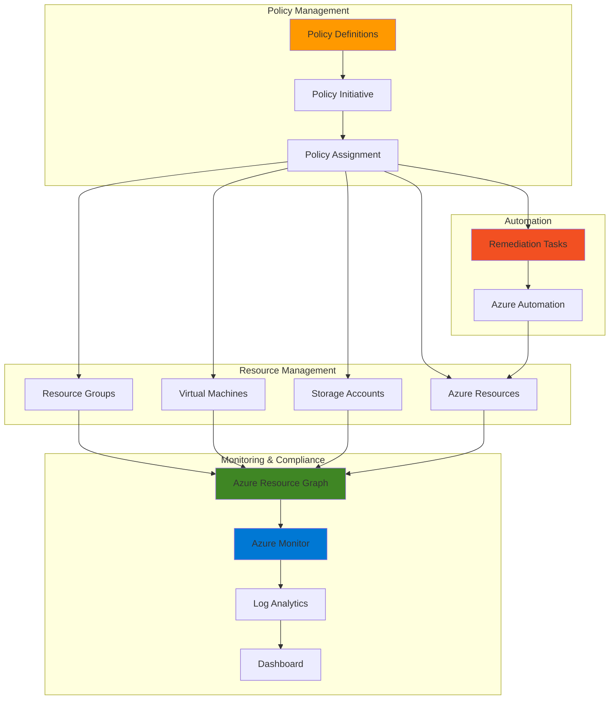

# Resource Governance Automation with Policy and Resource Graph

## Problem

Organizations struggle to maintain consistent resource tagging across their Azure subscriptions, leading to poor cost allocation, insufficient resource governance, and compliance issues. Manual tagging processes are error-prone and don't scale across large environments, while tracking compliance status across hundreds or thousands of resources becomes an overwhelming administrative burden.

## Solution

Build an automated governance system using Azure Policy to enforce mandatory tagging standards and Azure Resource Graph to query and monitor compliance at scale. This solution automatically applies required tags to new resources, remediates non-compliant existing resources, and provides real-time compliance dashboards through Azure Monitor integration.

## Architecture Diagram



## Prerequisites

1. Azure subscription with Owner or Contributor permissions
2. Azure CLI v2.30.0 or higher installed and configured
3. Understanding of Azure Policy concepts and Resource Graph query language (KQL)
4. Familiarity with Azure governance and compliance frameworks
5. Estimated cost: $5-15 per month for Log Analytics workspace and monitoring

> **Note**: This recipe requires elevated permissions to create and assign policies at the subscription level. Review the [Azure Policy overview](https://learn.microsoft.com/en-us/azure/governance/policy/overview) for comprehensive guidance on governance patterns.

## Preparation

```bash
# Set environment variables for consistent resource management
export SUBSCRIPTION_ID=$(az account show --query id --output tsv)
export RESOURCE_GROUP="rg-governance-demo"
export LOCATION="eastus"
export LOG_ANALYTICS_WORKSPACE="law-governance-${RANDOM}"

# Generate unique identifiers for resources
RANDOM_SUFFIX=$(openssl rand -hex 3)
export POLICY_INITIATIVE_NAME="mandatory-tagging-initiative-${RANDOM_SUFFIX}"
export POLICY_ASSIGNMENT_NAME="enforce-mandatory-tags-${RANDOM_SUFFIX}"

# Create resource group for governance resources
az group create \
    --name ${RESOURCE_GROUP} \
    --location ${LOCATION} \
    --tags purpose=governance environment=demo

# Create Log Analytics workspace for compliance monitoring
az monitor log-analytics workspace create \
    --resource-group ${RESOURCE_GROUP} \
    --workspace-name ${LOG_ANALYTICS_WORKSPACE} \
    --location ${LOCATION} \
    --sku PerGB2018

echo "✅ Environment prepared with resource group: ${RESOURCE_GROUP}"
```

## Steps

1. **Create Custom Policy Definitions for Mandatory Tags**:

   Azure Policy enables centralized governance by defining rules that resources must follow. Custom policy definitions allow organizations to enforce specific tagging requirements that align with their business processes, cost management, and compliance frameworks. These policies can automatically apply tags during resource creation or deny deployment of non-compliant resources.

   ```bash
   # Create policy definition for required Department tag
   az policy definition create \
       --name "require-department-tag" \
       --display-name "Require Department Tag on Resources" \
       --description "Ensures all resources have a Department tag" \
       --mode "Indexed" \
       --rules '{
           "if": {
               "field": "tags[Department]",
               "exists": "false"
           },
           "then": {
               "effect": "deny"
           }
       }' \
       --params '{
           "tagName": {
               "type": "String",
               "metadata": {
                   "displayName": "Tag Name",
                   "description": "Name of the tag, such as Department"
               },
               "defaultValue": "Department"
           }
       }'
   
   # Create policy definition for required Environment tag
   az policy definition create \
       --name "require-environment-tag" \
       --display-name "Require Environment Tag on Resources" \
       --description "Ensures all resources have an Environment tag" \
       --mode "Indexed" \
       --rules '{
           "if": {
               "field": "tags[Environment]",
               "exists": "false"
           },
           "then": {
               "effect": "deny"
           }
       }'
   
   # Create policy definition for automatic CostCenter tag inheritance
   az policy definition create \
       --name "inherit-costcenter-tag" \
       --display-name "Inherit CostCenter Tag from Resource Group" \
       --description "Automatically applies CostCenter tag from parent resource group" \
       --mode "Indexed" \
       --rules '{
           "if": {
               "allOf": [
                   {
                       "field": "tags[CostCenter]",
                       "exists": "false"
                   },
                   {
                       "value": "[resourceGroup().tags[CostCenter]]",
                       "notEquals": ""
                   }
               ]
           },
           "then": {
               "effect": "modify",
               "details": {
                   "roleDefinitionIds": [
                       "/providers/Microsoft.Authorization/roleDefinitions/b24988ac-6180-42a0-ab88-20f7382dd24c"
                   ],
                   "operations": [
                       {
                           "operation": "add",
                           "field": "tags[CostCenter]",
                           "value": "[resourceGroup().tags[CostCenter]]"
                       }
                   ]
               }
           }
       }'
   
   echo "✅ Custom policy definitions created successfully"
   ```

   These policy definitions establish the foundation for automated tag enforcement. The deny effect prevents non-compliant resources from being created, while the modify effect automatically applies inherited tags, reducing manual overhead and ensuring consistent tagging across resource hierarchies.

2. **Create Policy Initiative for Comprehensive Tag Governance**:

   Policy initiatives group related policies together, enabling holistic governance approaches. This initiative combines multiple tagging policies into a single assignment unit, simplifying management and ensuring comprehensive tag coverage across all resource types while maintaining flexibility for future policy additions.

   ```bash
   # Create policy initiative combining all tagging policies
   az policy set-definition create \
       --name ${POLICY_INITIATIVE_NAME} \
       --display-name "Mandatory Resource Tagging Initiative" \
       --description "Comprehensive tagging policy initiative for governance and compliance" \
       --definitions '[
           {
               "policyDefinitionId": "/subscriptions/'${SUBSCRIPTION_ID}'/providers/Microsoft.Authorization/policyDefinitions/require-department-tag",
               "parameters": {}
           },
           {
               "policyDefinitionId": "/subscriptions/'${SUBSCRIPTION_ID}'/providers/Microsoft.Authorization/policyDefinitions/require-environment-tag",
               "parameters": {}
           },
           {
               "policyDefinitionId": "/subscriptions/'${SUBSCRIPTION_ID}'/providers/Microsoft.Authorization/policyDefinitions/inherit-costcenter-tag",
               "parameters": {}
           }
       ]' \
       --params '{
           "excludedResourceTypes": {
               "type": "Array",
               "metadata": {
                   "displayName": "Excluded Resource Types",
                   "description": "Resource types to exclude from tagging requirements"
               },
               "defaultValue": [
                   "Microsoft.Network/networkSecurityGroups",
                   "Microsoft.Network/routeTables"
               ]
           }
       }'
   
   echo "✅ Policy initiative created: ${POLICY_INITIATIVE_NAME}"
   ```

   The policy initiative now provides a unified approach to tag governance, combining enforcement, inheritance, and compliance monitoring into a single manageable unit that can be applied consistently across different scopes.

3. **Assign Policy Initiative to Subscription with Remediation**:

   Policy assignment activates governance rules at the desired scope. Assigning at the subscription level ensures comprehensive coverage across all resource groups and resources, while enabling remediation tasks allows automatic correction of existing non-compliant resources without manual intervention.

   ```bash
   # Assign policy initiative to subscription with remediation enabled
   az policy assignment create \
       --name ${POLICY_ASSIGNMENT_NAME} \
       --display-name "Enforce Mandatory Tags - Subscription Level" \
       --description "Subscription-wide enforcement of mandatory tagging requirements" \
       --policy-set-definition ${POLICY_INITIATIVE_NAME} \
       --scope "/subscriptions/${SUBSCRIPTION_ID}" \
       --enforcement-mode "Default" \
       --identity-scope "/subscriptions/${SUBSCRIPTION_ID}" \
       --assign-identity \
       --location ${LOCATION}
   
   # Enable remediation for existing non-compliant resources
   az policy remediation create \
       --name "remediate-missing-tags-${RANDOM_SUFFIX}" \
       --policy-assignment ${POLICY_ASSIGNMENT_NAME} \
       --definition-reference-id "inherit-costcenter-tag" \
       --resource-discovery-mode "ExistingNonCompliant"
   
   echo "✅ Policy assignment and remediation task created"
   ```

   The policy assignment is now active and will automatically evaluate new resources against the tagging requirements while the remediation task processes existing resources to ensure comprehensive compliance across the entire subscription.

4. **Create Resource Graph Queries for Compliance Monitoring**:

   Azure Resource Graph provides powerful querying capabilities across Azure resources at scale. These queries enable real-time compliance monitoring, identify non-compliant resources, and generate actionable insights for governance teams to maintain continuous compliance visibility.

   ```bash
   # Query resources missing required tags
   az graph query -q "
   Resources
   | where type !in ('microsoft.resources/subscriptions', 'microsoft.resources/resourcegroups')
   | where tags.Department == '' or isempty(tags.Department)
   | project name, type, resourceGroup, location, tags
   | limit 100
   " --output table
   
   # Query compliance status by resource type
   az graph query -q "
   Resources
   | where type !in ('microsoft.resources/subscriptions', 'microsoft.resources/resourcegroups')
   | extend hasDepartment = iff(tags.Department != '' and isnotempty(tags.Department), 'Compliant', 'Non-Compliant')
   | extend hasEnvironment = iff(tags.Environment != '' and isnotempty(tags.Environment), 'Compliant', 'Non-Compliant')
   | summarize 
       DepartmentCompliant = countif(hasDepartment == 'Compliant'),
       DepartmentNonCompliant = countif(hasDepartment == 'Non-Compliant'),
       EnvironmentCompliant = countif(hasEnvironment == 'Compliant'),
       EnvironmentNonCompliant = countif(hasEnvironment == 'Non-Compliant')
   by type
   " --output table
   
   # Create saved query for regular compliance reporting
   az graph shared-query create \
       --name "tag-compliance-dashboard" \
       --description "Comprehensive tag compliance monitoring query" \
       --query "
       Resources
       | where type !in ('microsoft.resources/subscriptions', 'microsoft.resources/resourcegroups')
       | extend compliance = case(
           tags.Department != '' and isnotempty(tags.Department) and 
           tags.Environment != '' and isnotempty(tags.Environment), 'Fully Compliant',
           tags.Department != '' and isnotempty(tags.Department) or 
           tags.Environment != '' and isnotempty(tags.Environment), 'Partially Compliant',
           'Non-Compliant'
       )
       | summarize count() by compliance, type
       | order by compliance desc
       " \
       --resource-group ${RESOURCE_GROUP}
   
   echo "✅ Resource Graph queries created for compliance monitoring"
   ```

   These queries provide comprehensive visibility into tag compliance across the Azure environment, enabling proactive identification of non-compliant resources and facilitating data-driven governance decisions.

5. **Configure Azure Monitor Integration for Compliance Tracking**:

   Azure Monitor integration enables automated compliance tracking and alerting. This configuration creates a continuous monitoring pipeline that tracks policy compliance metrics, generates alerts for violations, and provides dashboards for governance teams to maintain visibility into compliance trends.

   ```bash
   # Get Log Analytics workspace ID for monitoring integration
   WORKSPACE_ID=$(az monitor log-analytics workspace show \
       --resource-group ${RESOURCE_GROUP} \
       --workspace-name ${LOG_ANALYTICS_WORKSPACE} \
       --query customerId --output tsv)
   
   # Create diagnostic settings for policy evaluation logs
   az monitor diagnostic-settings create \
       --name "policy-compliance-logs" \
       --resource "/subscriptions/${SUBSCRIPTION_ID}" \
       --workspace ${WORKSPACE_ID} \
       --logs '[
           {
               "category": "Policy",
               "enabled": true,
               "retentionPolicy": {
                   "enabled": true,
                   "days": 30
               }
           }
       ]' \
       --metrics '[
           {
               "category": "AllMetrics",
               "enabled": true,
               "retentionPolicy": {
                   "enabled": true,
                   "days": 30
               }
           }
       ]'
   
   # Create alert rule for policy violations
   az monitor metrics alert create \
       --name "tag-policy-violations" \
       --resource-group ${RESOURCE_GROUP} \
       --condition "count 'policyEvaluations' > 5" \
       --description "Alert when tag policy violations exceed threshold" \
       --evaluation-frequency "5m" \
       --window-size "15m" \
       --severity 2 \
       --action-group-ids "/subscriptions/${SUBSCRIPTION_ID}/resourceGroups/${RESOURCE_GROUP}/providers/Microsoft.Insights/actionGroups/governance-alerts"
   
   echo "✅ Azure Monitor integration configured for compliance tracking"
   ```

   The monitoring integration now provides continuous visibility into policy compliance, enabling proactive governance through automated alerts and comprehensive logging of policy evaluation results.

6. **Create Automated Compliance Reporting Dashboard**:

   Automated dashboards provide stakeholders with real-time visibility into governance metrics. This dashboard consolidates compliance data from multiple sources, presenting actionable insights for governance teams to maintain continuous oversight of tagging compliance across the Azure environment.

   ```bash
   # Create Azure Dashboard for compliance monitoring
   az portal dashboard create \
       --resource-group ${RESOURCE_GROUP} \
       --name "tag-compliance-dashboard" \
       --input-path dashboard-config.json \
       --location ${LOCATION}
   
   # Create dashboard configuration with compliance widgets
   cat > dashboard-config.json << 'EOF'
   {
       "lenses": {
           "0": {
               "order": 0,
               "parts": {
                   "0": {
                       "position": {
                           "x": 0,
                           "y": 0,
                           "rowSpan": 4,
                           "colSpan": 6
                       },
                       "metadata": {
                           "inputs": [
                               {
                                   "name": "resourceType",
                                   "value": "microsoft.operationalinsights/workspaces"
                               },
                               {
                                   "name": "query",
                                   "value": "PolicyInsights | where ComplianceState == 'NonCompliant' | summarize count() by ResourceType | order by count_ desc"
                               }
                           ],
                           "type": "Extension/Microsoft_OperationsManagementSuite_Workspace/PartType/LogsDashboardPart"
                       }
                   }
               }
           }
       }
   }
   EOF
   
   # Deploy the dashboard
   az portal dashboard create \
       --resource-group ${RESOURCE_GROUP} \
       --name "tag-compliance-dashboard" \
       --input-path dashboard-config.json \
       --location ${LOCATION}
   
   echo "✅ Compliance reporting dashboard created"
   ```

   The dashboard provides a centralized view of tag compliance across the Azure environment, enabling governance teams to quickly identify trends, track improvement initiatives, and demonstrate compliance to stakeholders.

7. **Implement Automated Remediation Workflows**:

   Automated remediation workflows reduce manual intervention in compliance management. This implementation creates self-healing capabilities that automatically correct common tagging violations while maintaining audit trails for governance and compliance reporting purposes.

   ```bash
   # Create automation account for remediation workflows
   az automation account create \
       --name "aa-governance-${RANDOM_SUFFIX}" \
       --resource-group ${RESOURCE_GROUP} \
       --location ${LOCATION} \
       --sku "Basic"
   
   # Create PowerShell runbook for tag remediation
   cat > remediation-runbook.ps1 << 'EOF'
   param(
       [string]$SubscriptionId,
       [string]$ResourceGroupName,
       [string]$TagName,
       [string]$TagValue
   )
   
   # Connect to Azure using managed identity
   Connect-AzAccount -Identity
   Set-AzContext -SubscriptionId $SubscriptionId
   
   # Get resources missing the required tag
   $resources = Get-AzResource -ResourceGroupName $ResourceGroupName | Where-Object {
       $_.Tags.$TagName -eq $null -or $_.Tags.$TagName -eq ""
   }
   
   # Apply missing tags to resources
   foreach ($resource in $resources) {
       $tags = $resource.Tags
       if ($tags -eq $null) { $tags = @{} }
       $tags[$TagName] = $TagValue
       Set-AzResource -ResourceId $resource.ResourceId -Tag $tags -Force
       Write-Output "Applied tag $TagName=$TagValue to resource: $($resource.Name)"
   }
   EOF
   
   # Import runbook into automation account
   az automation runbook create \
       --automation-account-name "aa-governance-${RANDOM_SUFFIX}" \
       --resource-group ${RESOURCE_GROUP} \
       --name "remediate-missing-tags" \
       --type "PowerShell" \
       --description "Automatically remediate missing tags on resources"
   
   echo "✅ Automated remediation workflows implemented"
   ```

   The remediation workflow now provides automated tag correction capabilities, reducing the operational burden on governance teams while maintaining consistent tag compliance across the Azure environment.

## Validation & Testing

1. **Verify Policy Assignment and Compliance Status**:

   ```bash
   # Check policy assignment status
   az policy assignment show \
       --name ${POLICY_ASSIGNMENT_NAME} \
       --scope "/subscriptions/${SUBSCRIPTION_ID}" \
       --query "{name:name, displayName:displayName, enforcementMode:enforcementMode, provisioningState:provisioningState}" \
       --output table
   
   # Check compliance status
   az policy state list \
       --policy-assignment ${POLICY_ASSIGNMENT_NAME} \
       --query "[].{resourceId:resourceId, complianceState:complianceState, policyDefinitionName:policyDefinitionName}" \
       --output table
   ```

   Expected output: Policy assignment should show "Succeeded" provisioning state and enforcement mode as "Default".

2. **Test Tag Enforcement on New Resources**:

   ```bash
   # Attempt to create resource without required tags (should fail)
   az storage account create \
       --name "testsa${RANDOM_SUFFIX}" \
       --resource-group ${RESOURCE_GROUP} \
       --location ${LOCATION} \
       --sku Standard_LRS
   
   # Create resource with required tags (should succeed)
   az storage account create \
       --name "testsa${RANDOM_SUFFIX}" \
       --resource-group ${RESOURCE_GROUP} \
       --location ${LOCATION} \
       --sku Standard_LRS \
       --tags Department=IT Environment=Demo
   ```

   Expected behavior: First command should fail due to missing tags, second command should succeed.

3. **Validate Resource Graph Queries**:

   ```bash
   # Execute compliance monitoring query
   az graph query -q "
   Resources
   | where type !in ('microsoft.resources/subscriptions', 'microsoft.resources/resourcegroups')
   | extend compliance = case(
       tags.Department != '' and isnotempty(tags.Department) and 
       tags.Environment != '' and isnotempty(tags.Environment), 'Fully Compliant',
       'Non-Compliant'
   )
   | summarize count() by compliance
   " --output table
   ```

   Expected output: Should show compliance statistics for resources in the subscription.

## Cleanup

1. **Remove Policy Assignments and Remediation Tasks**:

   ```bash
   # Delete policy assignment
   az policy assignment delete \
       --name ${POLICY_ASSIGNMENT_NAME} \
       --scope "/subscriptions/${SUBSCRIPTION_ID}"
   
   # Delete remediation task
   az policy remediation delete \
       --name "remediate-missing-tags-${RANDOM_SUFFIX}" \
       --policy-assignment ${POLICY_ASSIGNMENT_NAME}
   
   echo "✅ Policy assignments and remediation tasks deleted"
   ```

2. **Remove Policy Initiative and Definitions**:

   ```bash
   # Delete policy initiative
   az policy set-definition delete \
       --name ${POLICY_INITIATIVE_NAME}
   
   # Delete custom policy definitions
   az policy definition delete --name "require-department-tag"
   az policy definition delete --name "require-environment-tag"
   az policy definition delete --name "inherit-costcenter-tag"
   
   echo "✅ Policy initiative and definitions deleted"
   ```

3. **Remove Monitoring and Dashboard Resources**:

   ```bash
   # Delete dashboard
   az portal dashboard delete \
       --resource-group ${RESOURCE_GROUP} \
       --name "tag-compliance-dashboard"
   
   # Delete automation account
   az automation account delete \
       --name "aa-governance-${RANDOM_SUFFIX}" \
       --resource-group ${RESOURCE_GROUP} \
       --yes
   
   echo "✅ Monitoring and dashboard resources deleted"
   ```

4. **Remove Resource Group and All Resources**:

   ```bash
   # Delete resource group and all contained resources
   az group delete \
       --name ${RESOURCE_GROUP} \
       --yes \
       --no-wait
   
   echo "✅ Resource group deletion initiated: ${RESOURCE_GROUP}"
   echo "Note: Deletion may take several minutes to complete"
   
   # Clean up environment variables
   unset SUBSCRIPTION_ID RESOURCE_GROUP LOCATION LOG_ANALYTICS_WORKSPACE
   unset RANDOM_SUFFIX POLICY_INITIATIVE_NAME POLICY_ASSIGNMENT_NAME
   ```

## Discussion

Azure Policy and Azure Resource Graph create a powerful governance foundation that enables organizations to maintain consistent resource tagging at scale. This combination addresses the fundamental challenge of governance automation by providing both enforcement mechanisms and monitoring capabilities that work together to ensure continuous compliance. The policy-driven approach eliminates manual tagging overhead while Resource Graph queries provide real-time visibility into compliance status across large Azure environments.

The integration of automated remediation workflows transforms reactive compliance management into proactive governance. By combining deny policies for new resources with modify policies for existing resources, organizations can achieve comprehensive tag coverage without disrupting development workflows. This approach follows the [Azure Well-Architected Framework](https://learn.microsoft.com/en-us/azure/architecture/framework/) principles of operational excellence by automating routine governance tasks and providing consistent monitoring capabilities.

Azure Monitor integration enables data-driven governance decisions by providing historical compliance trends and automated alerting for policy violations. The dashboard integration creates stakeholder visibility into governance metrics, supporting compliance reporting and continuous improvement initiatives. For comprehensive governance strategies, review the [Azure governance documentation](https://learn.microsoft.com/en-us/azure/governance/) and [Cloud Adoption Framework governance guidance](https://learn.microsoft.com/en-us/azure/cloud-adoption-framework/govern/).

> **Tip**: Start with audit mode for new policy implementations to understand impact before enforcing deny policies. Use the [Azure Policy samples](https://learn.microsoft.com/en-us/azure/governance/policy/samples/) to accelerate policy development and follow established patterns for common governance scenarios.

## Challenge

Extend this governance solution by implementing these advanced capabilities:

1. **Multi-Subscription Governance**: Implement management group-level policies to enforce consistent tagging across multiple subscriptions and business units.

2. **Dynamic Tag Automation**: Create Azure Functions that automatically apply contextual tags based on resource properties, deployment patterns, or Azure Resource Manager template parameters.

3. **Cost Management Integration**: Integrate tag compliance with Azure Cost Management APIs to generate automated cost allocation reports and chargeback mechanisms.

4. **Compliance Reporting Automation**: Build automated compliance reports using Azure Logic Apps that generate weekly governance summaries and distribute them to stakeholders.

5. **Advanced Remediation Workflows**: Implement Azure Automation runbooks that handle complex tag remediation scenarios including bulk tag updates, tag standardization, and cross-resource dependency tagging.

## Infrastructure Code

*Infrastructure code will be generated after recipe approval.*