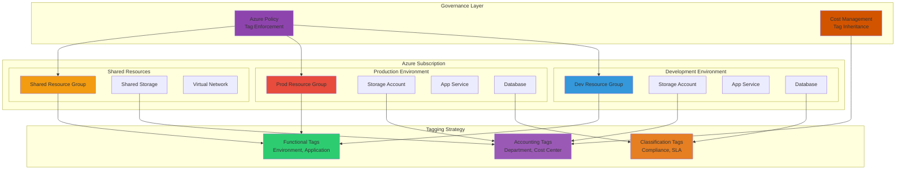

# Resource Organization with Resource Groups and Tags

## Problem

Organizations struggle with tracking costs and managing resources across development and production environments in Azure. Without proper resource organization and standardized tagging strategies, teams cannot accurately allocate costs to specific departments, projects, or environments, leading to budget overruns and difficulty in resource lifecycle management. This lack of structure creates challenges for financial accountability, compliance reporting, and operational automation.

## Solution

Create structured resource groups with standardized tagging strategies using Azure Resource Manager and Azure Portal. This approach enables consistent cost tracking, resource governance, and simplified management across different environments while supporting automated policy enforcement and detailed cost reporting through Azure Cost Management and Azure Policy integration.

## Architecture Diagram



## Prerequisites

1. Active Azure subscription with contributor or owner permissions
2. Azure CLI installed and configured (version 2.10.0 or later) or Azure Cloud Shell access
3. Understanding of Azure resource hierarchy and organizational structure
4. Knowledge of your organization's cost allocation requirements
5. Estimated cost: $0-$5 for small test resources created during this recipe

> **Note**: This recipe focuses on organizational structure and will create minimal resources for demonstration purposes. Most costs will be from storage accounts and App Service plans in Basic tier.

## Preparation

```bash
# Set environment variables for Azure resources
export LOCATION="eastus"
export SUBSCRIPTION_ID=$(az account show --query id --output tsv)

# Generate unique suffix for resource names
RANDOM_SUFFIX=$(openssl rand -hex 3)

# Set base names for different environments
export DEV_RG="rg-demo-dev-${RANDOM_SUFFIX}"
export PROD_RG="rg-demo-prod-${RANDOM_SUFFIX}"
export SHARED_RG="rg-demo-shared-${RANDOM_SUFFIX}"

echo "✅ Environment variables configured"
echo "   Subscription: ${SUBSCRIPTION_ID}"
echo "   Location: ${LOCATION}"
echo "   Suffix: ${RANDOM_SUFFIX}"
```

## Steps

1. **Create Development Environment Resource Group**:

   Azure Resource Groups serve as logical containers that hold related resources for Azure solutions, providing a foundational organizational structure for cloud resource management. Creating environment-specific resource groups enables clear separation of concerns and simplified lifecycle management following the Azure Well-Architected Framework. The development resource group will contain all resources needed for application development and testing phases, with tags that support operational automation and cost allocation.

   ```bash
   # Create development resource group with foundational tags
   az group create \
       --name ${DEV_RG} \
       --location ${LOCATION} \
       --tags environment=development \
              purpose=demo \
              department=engineering \
              costcenter=dev001 \
              owner=devteam \
              project=resource-organization
   
   echo "✅ Development resource group created: ${DEV_RG}"
   ```

   The development resource group is now established with foundational tags that support cost tracking and governance automation. These tags follow Azure's recommended three-tier categorization: functional (environment, purpose), accounting (department, costcenter), and operational (owner, project) metadata that enables effective resource management and automated policy enforcement.

2. **Create Production Environment Resource Group**:

   Production resource groups require enhanced governance and different tagging strategies to support compliance and operational requirements following enterprise security standards. Production environments typically have stricter SLA requirements, backup schedules, and access controls compared to development environments, necessitating additional classification tags for automated policy enforcement and compliance reporting.

   ```bash
   # Create production resource group with production-specific tags
   az group create \
       --name ${PROD_RG} \
       --location ${LOCATION} \
       --tags environment=production \
              purpose=demo \
              department=engineering \
              costcenter=prod001 \
              owner=opsTeam \
              project=resource-organization \
              sla=high \
              backup=daily \
              compliance=sox
   
   echo "✅ Production resource group created: ${PROD_RG}"
   ```

   The production resource group includes additional classification tags for SLA requirements, backup schedules, and compliance standards. This enhanced tagging supports automated Azure Policy enforcement and ensures production workloads receive appropriate governance controls while enabling accurate compliance reporting and cost allocation.

3. **Create Shared Resources Group**:

   Shared resource groups contain infrastructure components used across multiple environments, such as networking, monitoring, or security resources, optimizing costs by avoiding resource duplication. These groups help maintain clear ownership and governance boundaries while supporting cost allocation models where shared infrastructure costs are distributed across consuming environments based on usage patterns and tag inheritance rules.

   ```bash
   # Create shared resource group for cross-environment resources
   az group create \
       --name ${SHARED_RG} \
       --location ${LOCATION} \
       --tags environment=shared \
              purpose=infrastructure \
              department=platform \
              costcenter=shared001 \
              owner=platformTeam \
              project=resource-organization \
              scope=multi-environment
   
   echo "✅ Shared resource group created: ${SHARED_RG}"
   ```

   The shared resource group uses distinct tagging to identify cross-environment resources and platform team ownership. This organization pattern supports advanced cost allocation models where shared infrastructure costs can be automatically distributed across consuming environments through Azure Cost Management's tag inheritance and cost allocation rules.

4. **Create Sample Resources in Development Group**:

   Adding sample resources demonstrates how Azure's tag inheritance and application works across resource hierarchies, providing practical examples for cost allocation and governance automation. Azure supports both direct resource tagging and tag inheritance from resource groups to child resources, simplifying tag management while ensuring consistent cost attribution and policy enforcement across complex resource deployments.

   ```bash
   # Create storage account in development environment
   STORAGE_DEV="stdev${RANDOM_SUFFIX}"
   az storage account create \
       --name ${STORAGE_DEV} \
       --resource-group ${DEV_RG} \
       --location ${LOCATION} \
       --sku Standard_LRS \
       --kind StorageV2 \
       --tags tier=standard \
              dataclass=non-sensitive
   
   # Create App Service plan in development environment
   APP_PLAN_DEV="asp-dev-${RANDOM_SUFFIX}"
   az appservice plan create \
       --name ${APP_PLAN_DEV} \
       --resource-group ${DEV_RG} \
       --location ${LOCATION} \
       --sku B1 \
       --tags tier=basic \
              workload=web-app
   
   echo "✅ Development resources created with resource-specific tags"
   ```

   The sample resources demonstrate how resource-specific tags complement resource group tags to provide detailed metadata for precise cost allocation and governance automation. This layered tagging approach enables both inherited organizational metadata and resource-specific operational details, supporting flexible cost allocation models and automated compliance reporting through Azure Policy and Cost Management integration.

5. **Create Sample Resources in Production Group**:

   Production resources require enhanced tagging for compliance, monitoring, and operational requirements, supporting enterprise-grade security and operational automation capabilities. Production-grade resources typically include additional metadata for backup schedules, performance tiers, and security classifications that enable automated policy enforcement, compliance reporting, and operational monitoring through Azure services.

   ```bash
   # Create storage account in production environment
   STORAGE_PROD="stprod${RANDOM_SUFFIX}"
   az storage account create \
       --name ${STORAGE_PROD} \
       --resource-group ${PROD_RG} \
       --location ${LOCATION} \
       --sku Standard_GRS \
       --kind StorageV2 \
       --tags tier=premium \
              dataclass=sensitive \
              encryption=enabled \
              backup=enabled
   
   # Create App Service plan in production environment
   APP_PLAN_PROD="asp-prod-${RANDOM_SUFFIX}"
   az appservice plan create \
       --name ${APP_PLAN_PROD} \
       --resource-group ${PROD_RG} \
       --location ${LOCATION} \
       --sku P1V2 \
       --tags tier=premium \
              workload=web-app \
              monitoring=enabled
   
   echo "✅ Production resources created with enhanced tagging"
   ```

   Production resources include enhanced tags for security classification, backup requirements, and monitoring configuration that support automated compliance reporting and operational oversight. These tags enable Azure Policy to automatically enforce appropriate protection measures, backup schedules, and monitoring configurations while providing detailed cost attribution for financial accountability and optimization analysis.

6. **Apply Additional Tags to Resource Groups**:

   Tag updates demonstrate how to modify existing resource group metadata without affecting contained resources, supporting evolving organizational requirements and governance policies. Azure Resource Manager supports dynamic tag updates through the Azure CLI, enabling organizations to adapt their tagging strategies over time while maintaining operational continuity and ensuring consistent governance across their cloud footprint.

   ```bash
   # Update development resource group with additional operational tags
   az group update \
       --name ${DEV_RG} \
       --set tags.lastUpdated=2025-07-12 \
             tags.managedBy=azure-cli \
             tags.automation=enabled
   
   # Update production resource group with compliance tags
   az group update \
       --name ${PROD_RG} \
       --set tags.lastUpdated=2025-07-12 \
             tags.managedBy=azure-cli \
             tags.automation=enabled \
             tags.auditRequired=true
   
   echo "✅ Resource groups updated with additional tags"
   ```

   The tag updates demonstrate how organizational metadata evolves over time to support audit trails, automation requirements, and compliance reporting. These updates enable enhanced governance capabilities without disrupting existing resources or operations, supporting continuous improvement of cloud governance practices and automated policy enforcement through Azure services.

## Validation & Testing

1. **Verify Resource Group Creation and Tagging**:

   ```bash
   # List all created resource groups with their tags
   az group list \
       --query "[?contains(name, '${RANDOM_SUFFIX}')].{Name:name, Location:location, Tags:tags}" \
       --output table
   ```

   Expected output: Three resource groups with their respective tags displayed in tabular format showing complete tag inheritance and organization structure.

2. **Test Cost Management Tag Queries**:

   ```bash
   # Query resources by environment tag
   az resource list \
       --tag environment=development \
       --query "[].{Name:name, Type:type, ResourceGroup:resourceGroup}" \
       --output table
   
   # Query resources by department tag for cost allocation
   az resource list \
       --tag department=engineering \
       --query "[].{Name:name, Type:type, CostCenter:tags.costcenter}" \
       --output table
   ```

3. **Validate Tag Inheritance and Consistency**:

   ```bash
   # Check individual resource tags and inheritance
   az storage account show \
       --name ${STORAGE_DEV} \
       --resource-group ${DEV_RG} \
       --query "{Name:name, Tags:tags}" \
       --output json
   ```

4. **Generate Cost Allocation Report**:

   ```bash
   # List resources with cost-related tags for financial reporting
   az resource list \
       --query "[?tags.costcenter != null].{Name:name, Environment:tags.environment, CostCenter:tags.costcenter, Department:tags.department}" \
       --output table
   ```

## Cleanup

1. **Remove Production Resource Group**:

   ```bash
   # Delete production resource group and all contained resources
   az group delete \
       --name ${PROD_RG} \
       --yes \
       --no-wait
   
   echo "✅ Production resource group deletion initiated"
   ```

2. **Remove Development Resource Group**:

   ```bash
   # Delete development resource group and all contained resources
   az group delete \
       --name ${DEV_RG} \
       --yes \
       --no-wait
   
   echo "✅ Development resource group deletion initiated"
   ```

3. **Remove Shared Resource Group**:

   ```bash
   # Delete shared resource group and all contained resources
   az group delete \
       --name ${SHARED_RG} \
       --yes \
       --no-wait
   
   echo "✅ Shared resource group deletion initiated"
   ```

4. **Clean Environment Variables**:

   ```bash
   # Clear environment variables
   unset DEV_RG PROD_RG SHARED_RG LOCATION SUBSCRIPTION_ID RANDOM_SUFFIX
   unset STORAGE_DEV STORAGE_PROD APP_PLAN_DEV APP_PLAN_PROD
   
   echo "✅ Environment variables cleared"
   ```

## Discussion

Azure Resource Groups provide the foundational organizational structure for managing cloud resources at enterprise scale, enabling effective cost allocation, governance enforcement, and operational automation. By implementing consistent naming conventions and comprehensive tagging strategies, organizations can achieve accurate financial accountability, automated compliance reporting, and streamlined operations management. The approach demonstrated in this recipe follows Azure Well-Architected Framework principles for operational excellence and cost optimization while supporting advanced governance capabilities through Azure Policy integration.

The three-tier tagging strategy demonstrated here - functional, accounting, and classification tags - enables different organizational stakeholders to leverage resource metadata for their specific operational and business needs. Functional tags support operational teams with environment identification, deployment automation, and monitoring integration. Accounting tags enable finance teams to implement accurate chargeback and showback models through Azure Cost Management's advanced reporting capabilities. Classification tags ensure security and compliance teams can enforce appropriate governance controls based on data sensitivity and regulatory requirements through automated Azure Policy enforcement.

Tag inheritance in Azure Cost Management allows resource group and subscription tags to automatically apply to child resource usage records, reducing administrative overhead while maintaining consistent cost attribution across complex environments. Organizations should understand that while not all Azure resource types support direct tagging, tag inheritance ensures comprehensive cost visibility through Azure's usage reporting system. The [Microsoft documentation on tag support](https://learn.microsoft.com/en-us/azure/azure-resource-manager/management/tag-support) provides detailed guidance on service-specific tag capabilities and inheritance patterns for optimal cost allocation strategies.

Azure Policy integration enables automated tag enforcement and compliance monitoring across the entire Azure footprint, supporting enterprise-scale governance requirements. Organizations can implement policies that require specific tags on new resources, automatically apply default tags based on resource group membership, or generate detailed compliance reports based on tagging standards. This automation reduces manual governance overhead and ensures consistent resource organization as cloud adoption scales, while supporting advanced cost allocation models through [tag inheritance and cost allocation rules](https://learn.microsoft.com/en-us/azure/cost-management-billing/costs/enable-tag-inheritance) that distribute shared infrastructure costs based on actual consumption patterns.

> **Tip**: Enable tag inheritance in Azure Cost Management to automatically apply resource group and subscription tags to child resource usage records, providing more flexible cost allocation without requiring individual resource tagging while supporting advanced chargeback and showback reporting capabilities.

## Challenge

Extend this resource organization solution by implementing these enhancements:

1. **Implement Azure Policy for Tag Enforcement**: Create and assign Azure Policy definitions that require specific tags on new resources and automatically apply default tags based on resource group membership, including remediation tasks for existing non-compliant resources.

2. **Enable Advanced Cost Allocation with Tag Inheritance**: Configure Azure Cost Management to use tag inheritance, then create sophisticated cost allocation rules that distribute shared infrastructure costs based on consumption patterns and implement automated budget alerts based on tag-based cost groupings.

3. **Automate Tag Compliance Reporting and Remediation**: Develop Azure Logic Apps or Azure Functions that generate comprehensive weekly compliance reports showing resources missing required tags, automatically remediate common tagging issues, and send detailed notifications to resource owners with specific remediation guidance.

4. **Create Multi-Subscription Tag Governance Framework**: Implement a management group hierarchy with consistent tagging policies across multiple Azure subscriptions, including automated policy deployment using Azure DevOps or GitHub Actions and centralized reporting across the entire organizational hierarchy.

5. **Build Intelligent Tag-Based Resource Lifecycle Automation**: Design Azure Automation runbooks that automatically manage complex resource lifecycles based on tags, such as intelligent cost optimization through automated shutdown scheduling, resource archival based on usage patterns, and automatic scaling based on performance and cost tags.

## Infrastructure Code

### Available Infrastructure as Code:

- [Infrastructure Code Overview](code/README.md) - Detailed description of all infrastructure components
- [Bicep](code/bicep/) - Azure Bicep templates
- [Bash CLI Scripts](code/scripts/) - Example bash scripts using Azure CLI commands to deploy infrastructure
- [Terraform](code/terraform/) - Terraform configuration files