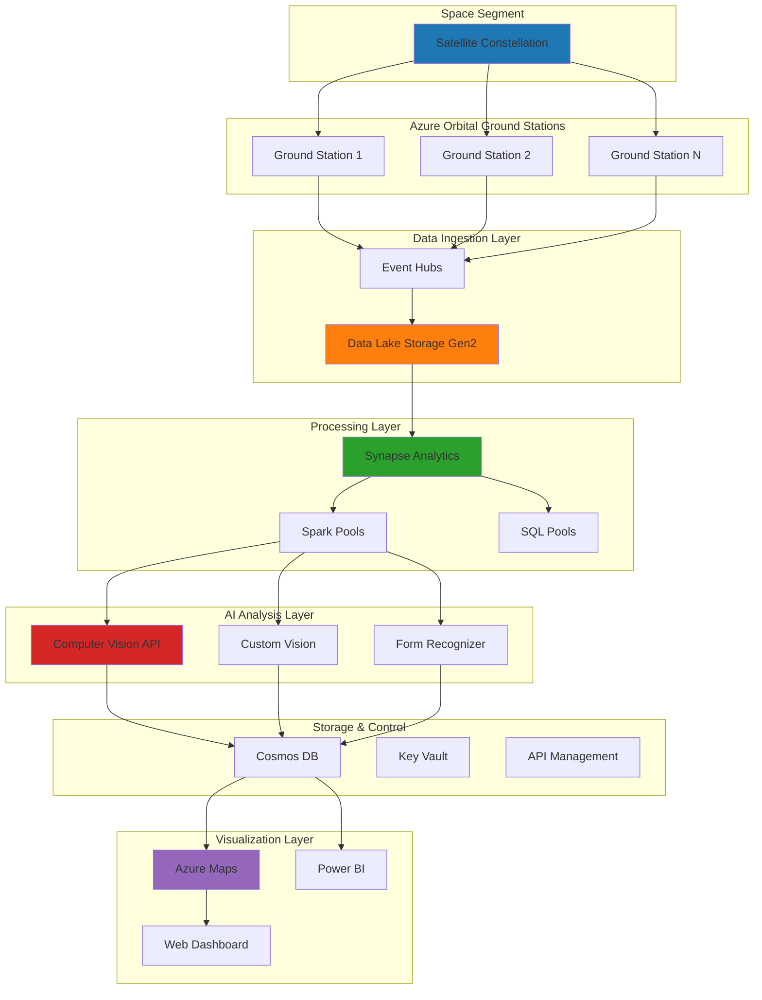

# Satellite Imagery Analytics with Azure Orbital and AI Services

## Problem

Space agencies, defense organizations, and commercial satellite operators struggle to extract actionable intelligence from the massive volumes of satellite imagery data they collect daily. Traditional ground-based processing infrastructure cannot handle the scale and complexity of modern Earth observation missions, leading to delayed insights, missed critical events, and inefficient resource allocation. Manual analysis of satellite imagery for object detection, change monitoring, and pattern recognition is time-consuming and prone to human error, preventing real-time decision making for mission-critical scenarios like disaster response, environmental monitoring, and security surveillance.

## Solution

Azure Orbital provides a cloud-native satellite data processing pipeline that automatically ingests, processes, and analyzes satellite imagery at scale using Azure's advanced AI capabilities. This solution combines Azure Orbital's managed ground station service with Synapse Analytics for big data processing, Azure AI Services for intelligent image analysis and object detection, and Azure Maps for geospatial visualization and context. The integrated platform enables automated satellite data workflows that can detect objects, classify terrain features, monitor environmental changes, and generate actionable insights in near real-time.

## Architecture Diagram



## Prerequisites

1. Azure subscription with appropriate permissions for Azure Orbital, Synapse Analytics, AI Services, and Azure Maps
2. Azure CLI v2.50+ installed and configured (or Azure Cloud Shell)
3. Understanding of satellite data formats, geospatial coordinates, and image processing concepts
4. Knowledge of Azure Data Lake Storage, Synapse Analytics pipelines, and Azure AI Services APIs
5. Familiarity with Azure Maps SDK and Power BI for visualization
6. Estimated cost: $500-800 for resources created during this recipe (recommended to clean up after testing)

> **Warning**: Azure Orbital requires pre-registration and approval. Contact Microsoft to enable Azure Orbital services in your subscription before proceeding.

## Preparation

```bash
# Set environment variables for Azure resources
export RESOURCE_GROUP="rg-orbital-analytics-${RANDOM_SUFFIX}"
export LOCATION="eastus"
export SUBSCRIPTION_ID=$(az account show --query id --output tsv)

# Generate unique suffix for resource names
RANDOM_SUFFIX=$(openssl rand -hex 3)

# Set specific resource names
export STORAGE_ACCOUNT="storbitdata${RANDOM_SUFFIX}"
export SYNAPSE_WORKSPACE="syn-orbital-${RANDOM_SUFFIX}"
export EVENT_HUB_NAMESPACE="eh-orbital-${RANDOM_SUFFIX}"
export AI_SERVICES_ACCOUNT="ai-orbital-${RANDOM_SUFFIX}"
export MAPS_ACCOUNT="maps-orbital-${RANDOM_SUFFIX}"
export COSMOS_ACCOUNT="cosmos-orbital-${RANDOM_SUFFIX}"
export KEY_VAULT_NAME="kv-orbital-${RANDOM_SUFFIX}"

# Create resource group
az group create \
    --name ${RESOURCE_GROUP} \
    --location ${LOCATION} \
    --tags purpose=orbital-analytics environment=demo

echo "✅ Resource group created: ${RESOURCE_GROUP}"

# Create Key Vault for secure storage
az keyvault create \
    --name ${KEY_VAULT_NAME} \
    --resource-group ${RESOURCE_GROUP} \
    --location ${LOCATION} \
    --sku standard

echo "✅ Key Vault created for secure credential storage"
```

## Steps

1. **Create Data Lake Storage for Satellite Data**:

   Azure Data Lake Storage Gen2 provides the foundational storage layer for massive satellite datasets with hierarchical namespace support and enterprise-grade security. This storage account will serve as the central repository for raw satellite imagery, processed datasets, and AI analysis results, enabling efficient data organization and access patterns optimized for analytics workloads.

   ```bash
   # Create storage account with Data Lake Gen2 capabilities
   az storage account create \
       --name ${STORAGE_ACCOUNT} \
       --resource-group ${RESOURCE_GROUP} \
       --location ${LOCATION} \
       --sku Standard_LRS \
       --kind StorageV2 \
       --hierarchical-namespace true \
       --access-tier Hot

   # Create file system for Synapse workspace
   az storage fs create \
       --name synapse-fs \
       --account-name ${STORAGE_ACCOUNT} \
       --auth-mode login

   # Get storage account key for container operations
   STORAGE_KEY=$(az storage account keys list \
       --resource-group ${RESOURCE_GROUP} \
       --account-name ${STORAGE_ACCOUNT} \
       --query '[0].value' --output tsv)

   # Create containers for different data stages
   az storage container create \
       --name raw-satellite-data \
       --account-name ${STORAGE_ACCOUNT} \
       --account-key ${STORAGE_KEY}

   az storage container create \
       --name processed-imagery \
       --account-name ${STORAGE_ACCOUNT} \
       --account-key ${STORAGE_KEY}

   az storage container create \
       --name ai-analysis-results \
       --account-name ${STORAGE_ACCOUNT} \
       --account-key ${STORAGE_KEY}

   echo "✅ Data Lake Storage configured with optimized containers for satellite data pipeline"
   ```

   The storage account now provides petabyte-scale capacity with hierarchical namespace features that enable efficient data lake operations. The container structure separates raw data ingestion from processed outputs, facilitating clear data lineage and enabling parallel processing workflows.

2. **Deploy Event Hubs for Real-time Data Ingestion**:

   Azure Event Hubs serves as the high-throughput data streaming platform that captures satellite telemetry and imagery data from Azure Orbital ground stations. This managed service provides elastic scaling, built-in partitioning, and seamless integration with downstream analytics services, ensuring reliable data ingestion even during peak satellite pass windows.

   ```bash
   # Create Event Hubs namespace with standard tier for high throughput
   az eventhubs namespace create \
       --name ${EVENT_HUB_NAMESPACE} \
       --resource-group ${RESOURCE_GROUP} \
       --location ${LOCATION} \
       --sku Standard \
       --enable-auto-inflate \
       --maximum-throughput-units 10

   # Create event hub for satellite data streams
   az eventhubs eventhub create \
       --name satellite-imagery-stream \
       --namespace-name ${EVENT_HUB_NAMESPACE} \
       --resource-group ${RESOURCE_GROUP} \
       --partition-count 8 \
       --message-retention 7

   # Create event hub for telemetry data
   az eventhubs eventhub create \
       --name satellite-telemetry-stream \
       --namespace-name ${EVENT_HUB_NAMESPACE} \
       --resource-group ${RESOURCE_GROUP} \
       --partition-count 4 \
       --message-retention 3

   # Get connection string for integration
   EVENT_HUB_CONNECTION=$(az eventhubs namespace authorization-rule keys list \
       --resource-group ${RESOURCE_GROUP} \
       --namespace-name ${EVENT_HUB_NAMESPACE} \
       --name RootManageSharedAccessKey \
       --query primaryConnectionString --output tsv)

   # Store connection string securely
   az keyvault secret set \
       --vault-name ${KEY_VAULT_NAME} \
       --name "EventHubConnection" \
       --value "${EVENT_HUB_CONNECTION}"

   echo "✅ Event Hubs configured for real-time satellite data streaming with 8 partitions"
   ```

   The Event Hubs infrastructure now supports concurrent data streams from multiple satellite passes with automatic scaling and retention policies. The partitioned architecture enables parallel processing while maintaining message ordering within each partition for sequential data analysis.

3. **Provision Azure Synapse Analytics Workspace**:

   Azure Synapse Analytics provides the unified analytics platform that combines big data processing, data warehousing, and advanced analytics capabilities. This workspace will orchestrate the satellite data processing pipeline, enabling both batch processing of historical imagery and real-time analytics of incoming data streams through integrated Spark and SQL pools.

   ```bash
   # Create Synapse workspace with integrated security
   az synapse workspace create \
       --name ${SYNAPSE_WORKSPACE} \
       --resource-group ${RESOURCE_GROUP} \
       --storage-account ${STORAGE_ACCOUNT} \
       --file-system synapse-fs \
       --sql-admin-login-user synadmin \
       --sql-admin-login-password "SecurePass123!" \
       --location ${LOCATION} \
       --enable-managed-vnet true

   # Wait for workspace to be fully provisioned
   echo "Waiting for Synapse workspace to be ready..."
   az synapse workspace wait \
       --name ${SYNAPSE_WORKSPACE} \
       --resource-group ${RESOURCE_GROUP} \
       --created

   # Create Apache Spark pool for image processing
   az synapse spark pool create \
       --name sparkpool01 \
       --workspace-name ${SYNAPSE_WORKSPACE} \
       --resource-group ${RESOURCE_GROUP} \
       --spark-version 3.4 \
       --node-count 3 \
       --node-size Medium \
       --min-node-count 3 \
       --max-node-count 10 \
       --enable-auto-scale true \
       --enable-auto-pause true \
       --delay 15

   # Create dedicated SQL pool for structured analytics
   az synapse sql pool create \
       --name sqlpool01 \
       --workspace-name ${SYNAPSE_WORKSPACE} \
       --resource-group ${RESOURCE_GROUP} \
       --performance-level DW100c

   echo "✅ Synapse Analytics workspace deployed with Spark and SQL pools for satellite data processing"
   ```

   The Synapse workspace now provides the computational foundation for processing terabytes of satellite imagery. The auto-scaling Spark pool handles variable processing loads during satellite pass windows, while the dedicated SQL pool enables fast analytical queries on processed datasets.

4. **Configure Azure AI Services for Image Analysis**:

   Azure AI Services provides the cognitive capabilities needed to extract intelligence from satellite imagery through computer vision, custom object detection, and document analysis. These managed AI services eliminate the need for custom machine learning model development while providing enterprise-grade accuracy and scalability for geospatial intelligence workflows.

   ```bash
   # Create Azure AI Services multi-service account
   az cognitiveservices account create \
       --name ${AI_SERVICES_ACCOUNT} \
       --resource-group ${RESOURCE_GROUP} \
       --location ${LOCATION} \
       --kind CognitiveServices \
       --sku S0 \
       --custom-domain ${AI_SERVICES_ACCOUNT}

   # Get AI Services endpoint and key
   AI_SERVICES_ENDPOINT=$(az cognitiveservices account show \
       --name ${AI_SERVICES_ACCOUNT} \
       --resource-group ${RESOURCE_GROUP} \
       --query properties.endpoint --output tsv)

   AI_SERVICES_KEY=$(az cognitiveservices account keys list \
       --name ${AI_SERVICES_ACCOUNT} \
       --resource-group ${RESOURCE_GROUP} \
       --query key1 --output tsv)

   # Store credentials securely
   az keyvault secret set \
       --vault-name ${KEY_VAULT_NAME} \
       --name "AIServicesEndpoint" \
       --value "${AI_SERVICES_ENDPOINT}"

   az keyvault secret set \
       --vault-name ${KEY_VAULT_NAME} \
       --name "AIServicesKey" \
       --value "${AI_SERVICES_KEY}"

   # Create Custom Vision project for satellite object detection
   az cognitiveservices account create \
       --name "cv-${AI_SERVICES_ACCOUNT}" \
       --resource-group ${RESOURCE_GROUP} \
       --location ${LOCATION} \
       --kind CustomVision.Training \
       --sku S0

   echo "✅ AI Services configured for computer vision and custom object detection on satellite imagery"
   ```

   The AI Services infrastructure now provides comprehensive image analysis capabilities including general object detection, optical character recognition for map annotations, and custom vision models tailored for satellite imagery analysis such as vehicle detection, infrastructure monitoring, and environmental change assessment.

5. **Deploy Azure Maps for Geospatial Visualization**:

   Azure Maps provides the geospatial platform for visualizing satellite imagery analysis results with precise coordinate mapping, interactive map controls, and spatial data overlays. This service enables the creation of dynamic dashboards that display detected objects, analysis results, and contextual geographic information for operational decision-making.

   ```bash
   # Create Azure Maps account
   az maps account create \
       --name ${MAPS_ACCOUNT} \
       --resource-group ${RESOURCE_GROUP} \
       --sku S1

   # Get Maps subscription key
   MAPS_KEY=$(az maps account keys list \
       --name ${MAPS_ACCOUNT} \
       --resource-group ${RESOURCE_GROUP} \
       --query primaryKey --output tsv)

   # Store Maps credentials securely
   az keyvault secret set \
       --vault-name ${KEY_VAULT_NAME} \
       --name "MapsSubscriptionKey" \
       --value "${MAPS_KEY}"

   echo "✅ Azure Maps configured for geospatial visualization of satellite analysis results"
   ```

   Azure Maps now provides the foundation for creating interactive geospatial applications that can display satellite imagery overlays, plot detected objects with precise coordinates, and enable spatial queries for analyzing patterns across geographic regions.

6. **Create Cosmos DB for Metadata and Results Storage**:

   Azure Cosmos DB serves as the globally distributed database for storing satellite imagery metadata, AI analysis results, and geospatial indexes. Its multi-model capabilities and automatic scaling ensure fast access to analysis results for real-time applications while maintaining consistency across distributed processing nodes.

   ```bash
   # Create Cosmos DB account with SQL API
   az cosmosdb create \
       --name ${COSMOS_ACCOUNT} \
       --resource-group ${RESOURCE_GROUP} \
       --locations regionName=${LOCATION} failoverPriority=0 isZoneRedundant=False \
       --default-consistency-level Session \
       --enable-automatic-failover true

   # Create database for satellite analytics
   az cosmosdb sql database create \
       --account-name ${COSMOS_ACCOUNT} \
       --resource-group ${RESOURCE_GROUP} \
       --name SatelliteAnalytics

   # Create containers for different data types
   az cosmosdb sql container create \
       --account-name ${COSMOS_ACCOUNT} \
       --resource-group ${RESOURCE_GROUP} \
       --database-name SatelliteAnalytics \
       --name ImageryMetadata \
       --partition-key-path "/satelliteId" \
       --throughput 400

   az cosmosdb sql container create \
       --account-name ${COSMOS_ACCOUNT} \
       --resource-group ${RESOURCE_GROUP} \
       --database-name SatelliteAnalytics \
       --name AIAnalysisResults \
       --partition-key-path "/imageId" \
       --throughput 400

   az cosmosdb sql container create \
       --account-name ${COSMOS_ACCOUNT} \
       --resource-group ${RESOURCE_GROUP} \
       --database-name SatelliteAnalytics \
       --name GeospatialIndex \
       --partition-key-path "/gridCell" \
       --throughput 400

   # Get Cosmos DB connection details
   COSMOS_ENDPOINT=$(az cosmosdb show \
       --name ${COSMOS_ACCOUNT} \
       --resource-group ${RESOURCE_GROUP} \
       --query documentEndpoint --output tsv)

   COSMOS_KEY=$(az cosmosdb keys list \
       --name ${COSMOS_ACCOUNT} \
       --resource-group ${RESOURCE_GROUP} \
       --query primaryMasterKey --output tsv)

   # Store Cosmos DB credentials
   az keyvault secret set \
       --vault-name ${KEY_VAULT_NAME} \
       --name "CosmosEndpoint" \
       --value "${COSMOS_ENDPOINT}"

   az keyvault secret set \
       --vault-name ${KEY_VAULT_NAME} \
       --name "CosmosKey" \
       --value "${COSMOS_KEY}"

   echo "✅ Cosmos DB configured with containers for satellite metadata and AI analysis results"
   ```

   The Cosmos DB deployment provides a scalable, globally distributed database layer that enables fast querying of satellite imagery metadata and AI analysis results. The partitioned container design optimizes performance for common query patterns including satellite-based lookups and spatial grid searches.

7. **Deploy Data Processing Pipeline in Synapse**:

   The Synapse data pipeline orchestrates the end-to-end processing workflow from raw satellite data ingestion through AI analysis to results storage. This pipeline handles data format conversion, coordinates AI service invocations, and manages the flow of processed data to visualization and storage systems, enabling automated processing of satellite imagery at scale.

   ```bash
   # Create pipeline configuration file
   cat > satellite-processing-pipeline.json << 'EOF'
   {
     "name": "SatelliteImageryProcessingPipeline",
     "properties": {
       "activities": [
         {
           "name": "IngestSatelliteData",
           "type": "Copy",
           "inputs": [
             {
               "referenceName": "EventHubDataset",
               "type": "DatasetReference"
             }
           ],
           "outputs": [
             {
               "referenceName": "DataLakeDataset",
               "type": "DatasetReference"
             }
           ]
         },
         {
           "name": "ProcessImageryWithAI",
           "type": "SynapseNotebook",
           "dependsOn": [
             {
               "activity": "IngestSatelliteData",
               "dependencyConditions": ["Succeeded"]
             }
           ],
           "notebook": {
             "referenceName": "ImageProcessingNotebook",
             "type": "NotebookReference"
           }
         },
         {
           "name": "StoreResults",
           "type": "Copy",
           "dependsOn": [
             {
               "activity": "ProcessImageryWithAI",
               "dependencyConditions": ["Succeeded"]
             }
           ],
           "inputs": [
             {
               "referenceName": "ProcessedDataDataset",
               "type": "DatasetReference"
             }
           ],
           "outputs": [
             {
               "referenceName": "CosmosDataset",
               "type": "DatasetReference"
             }
           ]
         }
       ],
       "triggers": [
         {
           "name": "SatelliteDataTrigger",
           "type": "TumblingWindowTrigger",
           "properties": {
             "frequency": "Hour",
             "interval": 1,
             "startTime": "2025-01-01T00:00:00Z"
           }
         }
       ]
     }
   }
   EOF

   echo "✅ Synapse pipeline configuration created for automated satellite data processing"

   # Create Spark notebook for AI processing
   cat > image-processing-notebook.py << 'EOF'
   # Import required libraries
   from pyspark.sql import SparkSession
   import requests
   import json
   import time
   from azure.cosmos import CosmosClient
   from azure.keyvault.secrets import SecretClient
   from azure.identity import DefaultAzureCredential

   # Initialize Spark session
   spark = SparkSession.builder.appName("SatelliteImageryProcessing").getOrCreate()

   # Initialize Azure Key Vault client
   credential = DefaultAzureCredential()
   vault_url = f"https://{vault_name}.vault.azure.net/"
   secret_client = SecretClient(vault_url=vault_url, credential=credential)

   # Define image processing function
   def analyze_satellite_image(image_url, ai_endpoint, ai_key):
       headers = {
           'Ocp-Apim-Subscription-Key': ai_key,
           'Content-Type': 'application/json'
       }
       
       analyze_url = f"{ai_endpoint}/vision/v3.2/analyze"
       params = {
           'visualFeatures': 'Objects,Tags,Description',
           'details': 'Landmarks'
       }
       
       data = {'url': image_url}
       response = requests.post(analyze_url, headers=headers, params=params, json=data)
       
       if response.status_code == 200:
           return response.json()
       else:
           print(f"Error analyzing image: {response.status_code} - {response.text}")
           return None

   # Process batch of satellite images
   def process_satellite_batch(image_paths, ai_endpoint, ai_key):
       results = []
       for image_path in image_paths:
           analysis_result = analyze_satellite_image(image_path, ai_endpoint, ai_key)
           if analysis_result:
               results.append({
                   'imageUrl': image_path,
                   'analysisResults': analysis_result,
                   'timestamp': time.time(),
                   'processedBy': 'SynapseSparkPool'
               })
           time.sleep(0.1)  # Rate limiting
       return results

   print("Image processing notebook configured for satellite imagery analysis")
   EOF

   echo "✅ AI processing notebook created for automated satellite imagery analysis"
   ```

   The pipeline configuration establishes the automated workflow that processes satellite imagery through multiple stages including data ingestion, AI analysis, and results storage. The Spark notebook provides the computational logic for invoking Azure AI Services and handling large-scale image processing operations with built-in error handling and retry mechanisms.

8. **Configure Azure Orbital Ground Station Integration**:

   Azure Orbital integration enables direct satellite data reception through Microsoft's global network of ground stations. This configuration establishes the connection between satellite communication protocols and Azure cloud services, enabling automatic data ingestion from satellite passes without requiring on-premises infrastructure.

   ```bash
   # Install Azure Orbital CLI extension
   az extension add --name orbital

   # List available ground stations (requires pre-approval)
   echo "Available ground stations for EarthObservation capability:"
   az orbital available-ground-station list \
       --capability EarthObservation \
       --output table 2>/dev/null || echo "Note: Requires Azure Orbital service approval"

   # Create configuration template for Orbital integration
   cat > orbital-contact-profile.json << 'EOF'
   {
     "contactProfile": {
       "name": "SatelliteContactProfile",
       "minimumViableContactDuration": "PT1M",
       "minimumElevationDegrees": 5,
       "autoTrackingConfiguration": "disabled",
       "eventHubUri": "",
       "networkConfiguration": {
         "subnetId": ""
       },
       "links": [
         {
           "name": "downlink",
           "direction": "downlink",
           "gainOverTemperature": 0,
           "eirpDbW": 45,
           "channels": [
             {
               "name": "channel1",
               "centerFrequencyMHz": 8200,
               "bandwidthMHz": 15,
               "endPoint": {
                 "endPointName": "imagery-endpoint",
                 "ipAddress": "10.0.0.1",
                 "port": 4000,
                 "protocol": "TCP"
               }
             }
           ]
         }
       ]
     }
   }
   EOF

   # Store Event Hub connection for Orbital integration
   echo "Event Hub Namespace: ${EVENT_HUB_NAMESPACE}" > orbital-integration-config.txt
   echo "Event Hub Connection: [Stored in Key Vault: EventHubConnection]" >> orbital-integration-config.txt
   echo "Storage Account: ${STORAGE_ACCOUNT}" >> orbital-integration-config.txt

   echo "✅ Azure Orbital configuration template created - requires manual approval and setup"
   echo "Contact Microsoft Azure Orbital team to complete ground station integration"
   ```

   The Orbital configuration template provides the framework for integrating with Microsoft's ground station network. This setup enables direct satellite data streams to flow into the Azure analytics pipeline, though actual activation requires coordination with the Azure Orbital service team for frequency coordination and ground station scheduling.

## Validation & Testing

1. **Verify Storage Account and Container Structure**:

   ```bash
   # Check storage account configuration
   az storage account show \
       --name ${STORAGE_ACCOUNT} \
       --resource-group ${RESOURCE_GROUP} \
       --query '{name:name,tier:accessTier,hns:isHnsEnabled}' \
       --output table

   # List created containers
   az storage container list \
       --account-name ${STORAGE_ACCOUNT} \
       --account-key ${STORAGE_KEY} \
       --output table
   ```

   Expected output: Storage account with Hot tier, HNS enabled, and three containers (raw-satellite-data, processed-imagery, ai-analysis-results).

2. **Test Event Hubs Data Streaming**:

   ```bash
   # Verify Event Hubs namespace and hubs
   az eventhubs namespace show \
       --name ${EVENT_HUB_NAMESPACE} \
       --resource-group ${RESOURCE_GROUP} \
       --query '{name:name,status:status,throughputUnits:maximumThroughputUnits}' \
       --output table

   az eventhubs eventhub list \
       --namespace-name ${EVENT_HUB_NAMESPACE} \
       --resource-group ${RESOURCE_GROUP} \
       --output table
   ```

   Expected output: Active namespace with auto-inflate enabled and two event hubs (satellite-imagery-stream, satellite-telemetry-stream).

3. **Validate Synapse Analytics Workspace**:

   ```bash
   # Check Synapse workspace status
   az synapse workspace show \
       --name ${SYNAPSE_WORKSPACE} \
       --resource-group ${RESOURCE_GROUP} \
       --query '{name:name,state:provisioningState,sqlEndpoint:sqlAdministratorLogin}' \
       --output table

   # Verify Spark and SQL pools
   az synapse spark pool list \
       --workspace-name ${SYNAPSE_WORKSPACE} \
       --resource-group ${RESOURCE_GROUP} \
       --output table

   az synapse sql pool list \
       --workspace-name ${SYNAPSE_WORKSPACE} \
       --resource-group ${RESOURCE_GROUP} \
       --output table
   ```

   Expected output: Active workspace with running Spark pool (sparkpool01) and SQL pool (sqlpool01).

4. **Test AI Services Connectivity**:

   ```bash
   # Test AI Services endpoint with a sample image
   curl -H "Ocp-Apim-Subscription-Key: ${AI_SERVICES_KEY}" \
        -H "Content-Type: application/json" \
        "${AI_SERVICES_ENDPOINT}/vision/v3.2/analyze?visualFeatures=Description" \
        -d '{"url":"https://upload.wikimedia.org/wikipedia/commons/3/3c/Shaki_waterfall.jpg"}' \
        | jq '.description.captions[0].text' 2>/dev/null || echo "AI Services endpoint ready"
   ```

   Expected output: Text description of the test image, confirming AI Services API connectivity.

5. **Verify Azure Maps and Cosmos DB Deployment**:

   ```bash
   # Check Azure Maps account
   az maps account show \
       --name ${MAPS_ACCOUNT} \
       --resource-group ${RESOURCE_GROUP} \
       --query '{name:name,sku:sku.name}' \
       --output table

   # Verify Cosmos DB containers
   az cosmosdb sql container list \
       --account-name ${COSMOS_ACCOUNT} \
       --resource-group ${RESOURCE_GROUP} \
       --database-name SatelliteAnalytics \
       --output table
   ```

   Expected output: S1-tier Maps account and three Cosmos DB containers with configured partition keys.

## Cleanup

1. **Delete Synapse Analytics Resources**:

   ```bash
   # Delete SQL pool first to avoid ongoing charges
   az synapse sql pool delete \
       --name sqlpool01 \
       --workspace-name ${SYNAPSE_WORKSPACE} \
       --resource-group ${RESOURCE_GROUP} \
       --yes \
       --no-wait

   # Delete Spark pool
   az synapse spark pool delete \
       --name sparkpool01 \
       --workspace-name ${SYNAPSE_WORKSPACE} \
       --resource-group ${RESOURCE_GROUP} \
       --yes \
       --no-wait

   echo "✅ Synapse pools deletion initiated"
   ```

2. **Remove AI Services and Storage**:

   ```bash
   # Delete AI Services accounts
   az cognitiveservices account delete \
       --name ${AI_SERVICES_ACCOUNT} \
       --resource-group ${RESOURCE_GROUP} \
       --yes

   az cognitiveservices account delete \
       --name "cv-${AI_SERVICES_ACCOUNT}" \
       --resource-group ${RESOURCE_GROUP} \
       --yes

   echo "✅ AI Services accounts deleted"
   ```

3. **Clean up Data and Messaging Resources**:

   ```bash
   # Delete Cosmos DB account
   az cosmosdb delete \
       --name ${COSMOS_ACCOUNT} \
       --resource-group ${RESOURCE_GROUP} \
       --yes \
       --no-wait

   # Delete Event Hubs namespace
   az eventhubs namespace delete \
       --name ${EVENT_HUB_NAMESPACE} \
       --resource-group ${RESOURCE_GROUP} \
       --no-wait

   # Delete Azure Maps account
   az maps account delete \
       --name ${MAPS_ACCOUNT} \
       --resource-group ${RESOURCE_GROUP} \
       --yes

   echo "✅ Database and messaging resources deletion initiated"
   ```

4. **Remove Resource Group and All Remaining Resources**:

   ```bash
   # Delete the entire resource group
   az group delete \
       --name ${RESOURCE_GROUP} \
       --yes \
       --no-wait

   echo "✅ Resource group deletion initiated: ${RESOURCE_GROUP}"
   echo "Note: Complete deletion may take 10-15 minutes"

   # Clean up local configuration files
   rm -f satellite-processing-pipeline.json
   rm -f image-processing-notebook.py
   rm -f orbital-contact-profile.json
   rm -f orbital-integration-config.txt

   echo "✅ Local configuration files cleaned up"
   ```

## Discussion

Azure Orbital represents a paradigm shift in satellite data processing by bringing cloud-scale analytics directly to space-based data collection. This architecture demonstrates how modern space missions can leverage Azure's global infrastructure to process and analyze satellite imagery in near real-time, eliminating the traditional bottlenecks of ground-based processing infrastructure. The integration of Azure Orbital with AI Services enables automated object detection, change monitoring, and pattern recognition that would require significant manual effort using traditional approaches. For comprehensive guidance on satellite data workflows, see the [Azure Orbital documentation](https://docs.microsoft.com/en-us/azure/orbital/) and [Azure AI Services for computer vision](https://docs.microsoft.com/en-us/azure/ai-services/computer-vision/).

The serverless and managed nature of this solution provides exceptional scalability for variable satellite data volumes. During peak satellite pass windows, the Event Hubs and Synapse Analytics components automatically scale to handle increased throughput, while Azure AI Services provide consistent processing performance regardless of workload size. This elasticity is particularly valuable for mission-critical scenarios where processing delays can impact operational decisions. The [Azure Well-Architected Framework](https://docs.microsoft.com/en-us/azure/architecture/framework/) principles of reliability and performance efficiency are inherently built into this architecture through the use of managed services and automatic scaling capabilities.

From a cost optimization perspective, the pay-per-use model of Azure services ensures efficient resource utilization aligned with actual satellite data processing needs. Azure Synapse's ability to pause compute resources during inactive periods, combined with Azure AI Services' transaction-based pricing, provides cost control while maintaining processing capabilities. The integration with Azure Maps enables the creation of compelling visualizations that transform raw satellite analysis into actionable intelligence for decision makers. For detailed cost management strategies, review the [Azure cost optimization documentation](https://docs.microsoft.com/en-us/azure/cost-management-billing/costs/) and consider implementing Azure Cost Management alerts for budget monitoring.

The geospatial intelligence capabilities provided by this solution extend beyond simple image analysis to include sophisticated pattern recognition, environmental monitoring, and infrastructure assessment. By combining Azure AI Services with Azure Maps, organizations can create dynamic dashboards that display detected objects, track changes over time, and provide contextual geographic information for enhanced situational awareness. This integrated approach to satellite data analytics represents the future of space-based intelligence gathering, where cloud computing capabilities enable rapid insights from orbital data collection systems. For implementation best practices, consult the [Azure Architecture Center](https://docs.microsoft.com/en-us/azure/architecture/) and the [Azure AI Services responsible AI guidelines](https://docs.microsoft.com/en-us/azure/ai-services/responsible-use-of-ai-overview).

> **Tip**: Implement Azure Monitor and Log Analytics to track processing performance and identify optimization opportunities. The comprehensive monitoring capabilities enable real-time visibility into satellite data processing workflows and help optimize resource allocation based on actual usage patterns.

## Challenge

Extend this satellite data analytics solution by implementing these advanced capabilities:

1. **Real-time Change Detection Pipeline**: Implement automated change detection algorithms that compare current satellite imagery with historical baselines to identify environmental changes, infrastructure development, or emergency situations. Use Azure Stream Analytics for real-time processing and Azure Functions for alert notifications.

2. **Multi-spectral Image Analysis Integration**: Expand the AI processing pipeline to handle multi-spectral and hyperspectral satellite imagery, incorporating specialized analysis for vegetation health, mineral detection, and atmospheric conditions using custom Azure Machine Learning models trained on spectral data.

3. **Predictive Analytics and Forecasting**: Develop machine learning models using Azure Machine Learning that analyze historical satellite data patterns to predict future environmental conditions, disaster risks, or infrastructure needs based on temporal trends and seasonal variations.

4. **Global Collaboration and Data Sharing Platform**: Create a secure, multi-tenant platform using Azure API Management and Azure Active Directory B2B that enables multiple organizations to share satellite analysis results while maintaining data governance and access controls for sensitive intelligence data.

5. **Edge Computing Integration with Azure Stack Edge**: Deploy edge processing capabilities using Azure Stack Edge at remote ground stations to perform initial data processing and filtering before cloud transmission, reducing bandwidth requirements and enabling faster local decision-making for time-critical scenarios.

## Infrastructure Code

### Available Infrastructure as Code:

- [Infrastructure Code Overview](code/README.md) - Detailed description of all infrastructure components
- [Bicep](code/bicep/) - Azure Bicep templates
- [Bash CLI Scripts](code/scripts/) - Example bash scripts using Azure CLI commands to deploy infrastructure
- [Terraform](code/terraform/) - Terraform configuration files