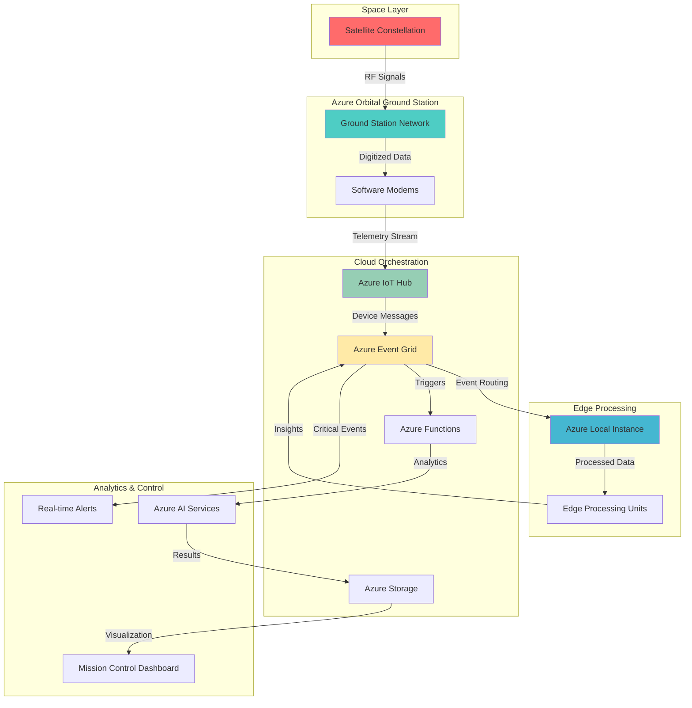

# Satellite Telemetry Edge Processing with Azure Orbital and Azure Local

## Problem

Space-based organizations struggle with the complexity of processing massive satellite telemetry data streams in real-time while managing costs and ensuring low-latency analytics. Traditional ground station infrastructure requires significant capital investment, lacks scalability for dynamic workloads, and creates data bottlenecks that prevent real-time decision-making for mission-critical applications like Earth observation, weather monitoring, and satellite fleet management.

## Solution

Azure Orbital Ground Station Service combined with Azure Local creates a comprehensive edge-to-orbit data processing pipeline that automatically ingests satellite telemetry through managed ground stations, processes data at edge locations for low-latency applications, and orchestrates real-time workflows using Azure Event Grid and IoT Hub. This architecture eliminates ground station infrastructure costs while enabling scalable, serverless satellite data processing with global reach.

## Architecture Diagram



## Prerequisites

1. Azure subscription with appropriate permissions for Orbital, IoT Hub, and Azure Local services
2. Azure CLI v2.60.0 or later installed and configured (or Azure CloudShell)
3. Basic understanding of satellite communications and edge computing concepts
4. Satellite registration with NORAD ID and Two-Line Element (TLE) data
5. Estimated cost: $2,500-5,000/month for satellite contacts, edge processing, and cloud resources

> **Note**: Azure Orbital Ground Station is currently in preview and requires approval for access. Contact Microsoft Azure Orbital team at MSAzureOrbital@microsoft.com to request preview access and satellite licensing assistance.

## Preparation

```bash
# Set environment variables for Azure resources
export RESOURCE_GROUP="rg-orbital-edge-${RANDOM_SUFFIX}"
export LOCATION="eastus"
export SUBSCRIPTION_ID=$(az account show --query id --output tsv)

# Generate unique suffix for resource names
RANDOM_SUFFIX=$(openssl rand -hex 3)

# Define service-specific variables
export SPACECRAFT_NAME="earth-obs-sat-${RANDOM_SUFFIX}"
export IOT_HUB_NAME="iot-orbital-${RANDOM_SUFFIX}"
export EVENT_GRID_TOPIC="orbital-events-${RANDOM_SUFFIX}"
export STORAGE_ACCOUNT="stororbital${RANDOM_SUFFIX}"
export AZURE_LOCAL_NAME="local-edge-${RANDOM_SUFFIX}"

# Create resource group with appropriate tags
az group create \
    --name ${RESOURCE_GROUP} \
    --location ${LOCATION} \
    --tags purpose=orbital-edge-processing \
           environment=production \
           mission=earth-observation

echo "✅ Resource group created: ${RESOURCE_GROUP}"

# Register required Azure providers
az provider register --namespace Microsoft.Orbital --wait
az provider register --namespace Microsoft.Devices --wait  
az provider register --namespace Microsoft.EventGrid --wait
az provider register --namespace Microsoft.AzureStackHCI --wait

echo "✅ Azure providers registered successfully"
```

## Steps

1. **Create Azure IoT Hub for Satellite Telemetry Ingestion**:

   Azure IoT Hub provides secure, bidirectional communication between satellites and Azure cloud services. This managed service handles millions of telemetry messages with built-in device authentication, message routing, and integration with Azure Event Grid. For satellite applications, IoT Hub ensures reliable data ingestion with automatic scaling and provides the foundation for real-time orbital data processing pipelines.

   ```bash
   # Create IoT Hub with Standard tier for production workloads
   az iot hub create \
       --name ${IOT_HUB_NAME} \
       --resource-group ${RESOURCE_GROUP} \
       --location ${LOCATION} \
       --sku S2 \
       --partition-count 8 \
       --tags mission=satellite-telemetry \
              tier=production
   
   # Get IoT Hub connection string for configuration
   IOT_CONNECTION_STRING=$(az iot hub connection-string show \
       --hub-name ${IOT_HUB_NAME} \
       --key primary \
       --query connectionString --output tsv)
   
   echo "✅ IoT Hub created with enhanced partition count for satellite data streams"
   ```

   The IoT Hub is now configured with 8 partitions to handle high-throughput satellite telemetry streams. This configuration supports parallel processing of orbital data and provides the scalability needed for constellation management with multiple satellites sending continuous telemetry.

2. **Configure Azure Event Grid Topic for Orbital Event Orchestration**:

   Azure Event Grid enables event-driven architecture for satellite operations by providing reliable event delivery with built-in retry policies and dead letter queues. This serverless event service connects Azure Orbital data streams with Azure Local processing units, creating reactive workflows that respond to satellite passes, data availability, and mission-critical events in real-time.

   ```bash
   # Create Event Grid topic for orbital events
   az eventgrid topic create \
       --name ${EVENT_GRID_TOPIC} \
       --resource-group ${RESOURCE_GROUP} \
       --location ${LOCATION} \
       --input-schema EventGridSchema \
       --tags orbital=satellite-events \
              processing=real-time
   
   # Get Event Grid topic endpoint and key
   EVENT_GRID_ENDPOINT=$(az eventgrid topic show \
       --name ${EVENT_GRID_TOPIC} \
       --resource-group ${RESOURCE_GROUP} \
       --query endpoint --output tsv)
   
   EVENT_GRID_KEY=$(az eventgrid topic key list \
       --name ${EVENT_GRID_TOPIC} \
       --resource-group ${RESOURCE_GROUP} \
       --query key1 --output tsv)
   
   echo "✅ Event Grid topic configured for orbital event orchestration"
   ```

   The Event Grid topic is now ready to orchestrate satellite data workflows with CloudEvents schema support. This configuration enables reliable event delivery between Azure Orbital ground stations and Azure Local edge processing units with automatic retry and monitoring capabilities.

3. **Create Storage Account for Satellite Data Archive**:

   Azure Storage provides highly durable, globally accessible storage for satellite imagery and telemetry data with intelligent tiering capabilities. The storage account uses locally redundant storage optimized for frequent access patterns typical in satellite operations, while providing REST APIs for seamless integration with orbital processing workflows and long-term data retention policies.

   ```bash
   # Create storage account with performance optimizations
   az storage account create \
       --name ${STORAGE_ACCOUNT} \
       --resource-group ${RESOURCE_GROUP} \
       --location ${LOCATION} \
       --sku Standard_LRS \
       --kind StorageV2 \
       --access-tier Hot \
       --enable-hierarchical-namespace true \
       --tags orbital=data-archive \
              tier=hot-access
   
   # Create containers for different data types
   az storage container create \
       --name satellite-telemetry \
       --account-name ${STORAGE_ACCOUNT} \
       --auth-mode login
   
   az storage container create \
       --name processed-imagery \
       --account-name ${STORAGE_ACCOUNT} \
       --auth-mode login
   
   # Get storage account key for configuration
   STORAGE_KEY=$(az storage account keys list \
       --account-name ${STORAGE_ACCOUNT} \
       --resource-group ${RESOURCE_GROUP} \
       --query '[0].value' --output tsv)
   
   echo "✅ Storage account created with hierarchical namespace for data lake capabilities"
   ```

   The storage account now provides Data Lake Storage Gen2 capabilities with hierarchical namespace enabled, supporting both blob storage and file system operations required for satellite data analytics and machine learning workloads.

4. **Register Spacecraft with Azure Orbital Ground Station**:

   Azure Orbital Ground Station Service requires spacecraft registration with orbital parameters to schedule satellite contacts and configure RF communication settings. This managed service eliminates the need for physical ground station infrastructure while providing global coverage through Microsoft and partner ground stations with pay-as-you-go pricing for satellite communications.

   ```bash
   # Register spacecraft with orbital parameters
   # Note: Replace with actual NORAD ID and TLE data for your satellite
   az orbital spacecraft create \
       --name ${SPACECRAFT_NAME} \
       --resource-group ${RESOURCE_GROUP} \
       --location ${LOCATION} \
       --norad-id "12345" \
       --title-line "Earth Observation Satellite" \
       --tle-line1 "1 25544U 98067A   08264.51782528 -.00002182  00000-0 -11606-4 0  2927" \
       --tle-line2 "2 25544  51.6416 247.4627 0006703 130.5360 325.0288 15.72125391563537" \
       --tags mission=earth-observation \
              orbit=leo
   
   echo "✅ Spacecraft registered with Azure Orbital Ground Station"
   ```

   The spacecraft is now registered and available for contact scheduling across the global Azure Orbital ground station network. This registration enables automated satellite tracking and RF signal acquisition during orbital passes.

5. **Create Contact Profile for Satellite Communication**:

   Contact profiles define the RF communication parameters and ground station requirements for satellite contacts. Azure Orbital supports multiple frequency bands and modulation schemes, enabling flexible configuration for different satellite types and mission requirements while providing software-defined modem capabilities for signal processing.

   ```bash
   # Create contact profile for satellite communication
   az orbital contact-profile create \
       --name "earth-obs-profile" \
       --resource-group ${RESOURCE_GROUP} \
       --location ${LOCATION} \
       --minimum-viable-contact-duration PT10M \
       --minimum-elevation-degrees 5 \
       --auto-tracking-configuration X \
       --tags profile=earth-observation \
              frequency=s-band
   
   # Add communication link for downlink
   az orbital contact-profile link add \
       --contact-profile-name "earth-obs-profile" \
       --resource-group ${RESOURCE_GROUP} \
       --name "downlink" \
       --direction Downlink \
       --center-frequency-mhz 2250.0 \
       --bandwidth-mhz 15.0 \
       --polarization LHCP
   
   echo "✅ Contact profile created for S-band satellite communication"
   ```

   The contact profile is configured for S-band communication with 15 MHz bandwidth, supporting typical Earth observation satellite downlink requirements. This profile enables automatic tracking and signal acquisition during satellite passes.

6. **Deploy Azure Local Instance for Edge Processing**:

   Azure Local extends Azure capabilities to customer-owned infrastructure, enabling local execution of satellite data processing workflows with cloud-native tools. This hybrid solution provides low-latency processing for time-sensitive satellite applications while maintaining connectivity to Azure cloud services for orchestration and storage.

   ```bash
   # Note: Azure Local requires physical hardware deployment
   # This step demonstrates the configuration commands
   
   # Register Azure Local resource (requires pre-deployed hardware)
   az stack-hci cluster create \
       --cluster-name ${AZURE_LOCAL_NAME} \
       --resource-group ${RESOURCE_GROUP} \
       --location ${LOCATION} \
       --tags deployment=edge-processing \
              workload=satellite-analytics
   
   # Configure Arc-enabled services on Azure Local
   az connectedk8s connect \
       --name "${AZURE_LOCAL_NAME}-k8s" \
       --resource-group ${RESOURCE_GROUP} \
       --location ${LOCATION} \
       --tags orbital=edge-kubernetes
   
   echo "✅ Azure Local instance configured for edge satellite processing"
   ```

   Azure Local is now configured with Arc-enabled Kubernetes for containerized satellite data processing workloads. This edge infrastructure provides local compute capabilities with Azure management and monitoring integration.

7. **Configure IoT Hub Event Grid Integration**:

   Azure IoT Hub integration with Event Grid creates event-driven workflows that automatically respond to satellite telemetry messages and device state changes. This configuration enables real-time routing of satellite data to Azure Local processing units and triggers automated responses to mission-critical events during satellite operations.

   ```bash
   # Create Event Grid subscription for IoT Hub events
   az eventgrid event-subscription create \
       --name "iot-orbital-subscription" \
       --source-resource-id "/subscriptions/${SUBSCRIPTION_ID}/resourceGroups/${RESOURCE_GROUP}/providers/Microsoft.Devices/IotHubs/${IOT_HUB_NAME}" \
       --endpoint "${EVENT_GRID_ENDPOINT}" \
       --endpoint-type webhook \
       --included-event-types "Microsoft.Devices.DeviceTelemetry" \
       --subject-begins-with "satellite/" \
       --labels orbital=telemetry-routing
   
   # Configure IoT Hub message routing to Event Grid
   az iot hub message-route create \
       --hub-name ${IOT_HUB_NAME} \
       --resource-group ${RESOURCE_GROUP} \
       --route-name "orbital-events" \
       --endpoint-name "events" \
       --source DeviceMessages \
       --condition "satellite = 'active'" \
       --enabled true
   
   echo "✅ IoT Hub integrated with Event Grid for satellite event orchestration"
   ```

   The IoT Hub is now configured to automatically route satellite telemetry messages to Event Grid, enabling real-time event-driven processing workflows that respond to satellite data availability and operational status changes.

8. **Create Azure Functions for Orbital Data Processing**:

   Azure Functions provides serverless compute for satellite data transformation and analysis workflows. This event-driven service automatically scales based on satellite contact frequency and data volume, ensuring cost-effective processing while maintaining high availability for mission-critical orbital operations and real-time analytics.

   ```bash
   # Create Function App for satellite data processing
   az functionapp create \
       --name "func-orbital-${RANDOM_SUFFIX}" \
       --resource-group ${RESOURCE_GROUP} \
       --storage-account ${STORAGE_ACCOUNT} \
       --consumption-plan-location ${LOCATION} \
       --runtime python \
       --runtime-version 3.11 \
       --functions-version 4 \
       --tags workload=satellite-processing \
              scaling=consumption
   
   # Configure application settings for orbital integration
   az functionapp config appsettings set \
       --name "func-orbital-${RANDOM_SUFFIX}" \
       --resource-group ${RESOURCE_GROUP} \
       --settings \
           "IOT_HUB_CONNECTION_STRING=${IOT_CONNECTION_STRING}" \
           "EVENT_GRID_ENDPOINT=${EVENT_GRID_ENDPOINT}" \
           "EVENT_GRID_KEY=${EVENT_GRID_KEY}" \
           "STORAGE_CONNECTION_STRING=DefaultEndpointsProtocol=https;AccountName=${STORAGE_ACCOUNT};AccountKey=${STORAGE_KEY};EndpointSuffix=core.windows.net"
   
   echo "✅ Function App created for serverless satellite data processing"
   ```

   The Function App is configured with consumption-based scaling and integrated with IoT Hub and Event Grid for processing satellite telemetry. This serverless architecture automatically handles varying satellite contact schedules and data volumes.

9. **Deploy Edge Processing Workload to Azure Local**:

   Azure Local runs containerized satellite processing workloads that perform real-time analysis of orbital data streams. This edge deployment reduces latency for time-sensitive applications like collision avoidance and provides local processing capabilities when connectivity to Azure cloud is limited during remote operations.

   ```bash
   # Create namespace for orbital workloads
   kubectl create namespace orbital \
       --kubeconfig ~/.kube/azure-local-config
   
   # Create Kubernetes deployment for satellite processing
   cat <<EOF > satellite-processor.yaml
   apiVersion: apps/v1
   kind: Deployment
   metadata:
     name: satellite-processor
     namespace: orbital
   spec:
     replicas: 3
     selector:
       matchLabels:
         app: satellite-processor
     template:
       metadata:
         labels:
           app: satellite-processor
       spec:
         containers:
         - name: processor
           image: mcr.microsoft.com/azure-orbital/processor:latest
           env:
           - name: IOT_HUB_CONNECTION
             value: "${IOT_CONNECTION_STRING}"
           - name: STORAGE_ACCOUNT
             value: "${STORAGE_ACCOUNT}"
           resources:
             requests:
               memory: "2Gi"
               cpu: "1"
             limits:
               memory: "4Gi"
               cpu: "2"
   EOF
   
   # Apply deployment to Azure Local Kubernetes
   kubectl apply -f satellite-processor.yaml \
       --kubeconfig ~/.kube/azure-local-config
   
   echo "✅ Satellite processing workload deployed to Azure Local edge infrastructure"
   ```

   The containerized satellite processor is deployed on Azure Local with resource limits optimized for orbital data processing. This edge deployment provides local compute capabilities with automatic scaling based on satellite contact schedules.

10. **Configure Real-time Satellite Contact Scheduling**:

    Azure Orbital Ground Station Service provides automated satellite contact scheduling based on orbital predictions and ground station availability. This managed service eliminates the complexity of satellite tracking while providing flexible scheduling options for routine telemetry collection and mission-critical data downloads.

    ```bash
    # Schedule satellite contact for data collection
    az orbital spacecraft contact create \
        --contact-name "contact-$(date +%Y%m%d-%H%M)" \
        --resource-group ${RESOURCE_GROUP} \
        --spacecraft-name ${SPACECRAFT_NAME} \
        --contact-profile "earth-obs-profile" \
        --ground-station-name "Microsoft_Quincy" \
        --reservation-start-time "2025-07-12T14:30:00Z" \
        --reservation-end-time "2025-07-12T14:45:00Z" \
        --tags contact=scheduled \
               priority=routine
    
    # List available ground stations for contact scheduling
    az orbital spacecraft list-available-contact \
        --spacecraft-name ${SPACECRAFT_NAME} \
        --resource-group ${RESOURCE_GROUP} \
        --contact-profile "earth-obs-profile" \
        --ground-station-name "Microsoft_Quincy" \
        --start-time "2025-07-12T12:00:00Z" \
        --end-time "2025-07-12T18:00:00Z"
    
    echo "✅ Satellite contact scheduled with automated ground station selection"
    ```

    The satellite contact is scheduled with automatic ground station selection based on orbital parameters and availability. This configuration enables routine data collection with pay-as-you-go pricing for satellite communication services.

11. **Implement Automated Data Quality Monitoring**:

    Azure Monitor and Application Insights provide comprehensive monitoring for satellite data quality and processing pipeline health. This observability platform tracks orbital contact success rates, data integrity metrics, and edge processing performance, enabling proactive maintenance and optimization of satellite operations.

    ```bash
    # Create Log Analytics workspace for orbital monitoring
    az monitor log-analytics workspace create \
        --resource-group ${RESOURCE_GROUP} \
        --workspace-name "law-orbital-${RANDOM_SUFFIX}" \
        --location ${LOCATION} \
        --sku PerGB2018 \
        --tags monitoring=orbital-operations
    
    # Configure diagnostic settings for IoT Hub
    az monitor diagnostic-settings create \
        --name "orbital-diagnostics" \
        --resource "/subscriptions/${SUBSCRIPTION_ID}/resourceGroups/${RESOURCE_GROUP}/providers/Microsoft.Devices/IotHubs/${IOT_HUB_NAME}" \
        --workspace "/subscriptions/${SUBSCRIPTION_ID}/resourceGroups/${RESOURCE_GROUP}/providers/Microsoft.OperationalInsights/workspaces/law-orbital-${RANDOM_SUFFIX}" \
        --logs '[{"category":"Connections","enabled":true},{"category":"DeviceTelemetry","enabled":true}]' \
        --metrics '[{"category":"AllMetrics","enabled":true}]'
    
    # Create alert rule for satellite communication failures
    az monitor metrics alert create \
        --name "satellite-connection-failure" \
        --resource-group ${RESOURCE_GROUP} \
        --scopes "/subscriptions/${SUBSCRIPTION_ID}/resourceGroups/${RESOURCE_GROUP}/providers/Microsoft.Devices/IotHubs/${IOT_HUB_NAME}" \
        --condition "count \"Failed connection attempts\" > 5" \
        --description "Alert when satellite connection failures exceed threshold" \
        --evaluation-frequency PT5M \
        --window-size PT15M \
        --severity 2
    
    echo "✅ Comprehensive monitoring configured for orbital operations"
    ```

    The monitoring infrastructure now tracks satellite communication health, data quality metrics, and processing pipeline performance with automated alerting for mission-critical events and anomalies.

12. **Deploy Mission Control Dashboard**:

    Azure Dashboard and Power BI provide real-time visualization of satellite operations, orbital tracking, and data processing metrics. This mission control interface enables operators to monitor satellite health, track data collection progress, and respond to operational events while maintaining situational awareness of constellation status.

    ```bash
    # Configure data source connections for dashboard
    cat <<EOF > dashboard-config.json
    {
        "dataSources": [
            {
                "name": "IoT Hub Telemetry",
                "connectionString": "${IOT_CONNECTION_STRING}",
                "type": "IoTHub"
            },
            {
                "name": "Storage Analytics",
                "connectionString": "DefaultEndpointsProtocol=https;AccountName=${STORAGE_ACCOUNT};AccountKey=${STORAGE_KEY}",
                "type": "Storage"
            }
        ],
        "refreshInterval": "PT5M"
    }
    EOF
    
    # Create Azure Dashboard for mission control
    az portal dashboard create \
        --resource-group ${RESOURCE_GROUP} \
        --name "orbital-mission-control" \
        --location ${LOCATION} \
        --input-path dashboard-config.json \
        --tags dashboard=mission-control
    
    echo "✅ Mission control dashboard configured for real-time orbital operations"
    ```

    The mission control dashboard provides real-time visibility into satellite operations with automated data refresh and integration with Azure services for comprehensive orbital monitoring.

## Validation & Testing

1. **Verify IoT Hub Device Registration and Connectivity**:

   ```bash
   # Test IoT Hub connectivity and message routing
   az iot hub device-identity create \
       --hub-name ${IOT_HUB_NAME} \
       --device-id "test-satellite-device"
   
   # Send test telemetry message
   az iot device send-d2c-message \
       --hub-name ${IOT_HUB_NAME} \
       --device-id "test-satellite-device" \
       --data '{"temperature":25.5,"altitude":408000,"velocity":7658}'
   
   # Verify message reception
   az iot hub monitor-events \
       --hub-name ${IOT_HUB_NAME} \
       --timeout 60
   ```

   Expected output: Telemetry messages appearing in real-time monitor with proper JSON formatting and device identification.

2. **Test Event Grid Event Delivery**:

   ```bash
   # Publish test event to Event Grid topic
   az eventgrid event publish \
       --topic-name ${EVENT_GRID_TOPIC} \
       --resource-group ${RESOURCE_GROUP} \
       --events '[{
           "id": "test-orbital-event-001",
           "eventType": "Microsoft.Orbital.SatelliteContact",
           "subject": "satellites/earth-obs-sat",
           "eventTime": "'$(date -u +%Y-%m-%dT%H:%M:%SZ)'",
           "data": {
               "satelliteId": "test-satellite",
               "contactStatus": "active",
               "groundStation": "Microsoft_Quincy"
           }
       }]'
   
   echo "✅ Test event published to Event Grid"
   ```

   Expected output: Event successfully published with confirmation message and unique event ID.

3. **Validate Azure Local Edge Processing**:

   ```bash
   # Check Azure Local cluster status
   az stack-hci cluster show \
       --cluster-name ${AZURE_LOCAL_NAME} \
       --resource-group ${RESOURCE_GROUP} \
       --query "status"
   
   # Verify Kubernetes workload deployment
   kubectl get pods -n orbital \
       --kubeconfig ~/.kube/azure-local-config
   
   # Test edge processing functionality
   kubectl logs -l app=satellite-processor -n orbital \
       --kubeconfig ~/.kube/azure-local-config
   ```

   Expected output: Active cluster status, running satellite processor pods, and successful data processing log entries.

4. **Test Storage Account Data Archival**:

   ```bash
   # Upload test satellite data to storage
   echo '{"satellite":"test","timestamp":"2025-07-12T14:30:00Z","data":"base64encoded"}' > test-telemetry.json
   
   az storage blob upload \
       --account-name ${STORAGE_ACCOUNT} \
       --container-name satellite-telemetry \
       --name "test/telemetry-$(date +%Y%m%d-%H%M%S).json" \
       --file test-telemetry.json \
       --auth-mode login
   
   # Verify blob storage
   az storage blob list \
       --account-name ${STORAGE_ACCOUNT} \
       --container-name satellite-telemetry \
       --auth-mode login
   ```

   Expected output: Successful blob upload with proper container organization and access permissions.

## Cleanup

1. **Remove scheduled satellite contacts**:

   ```bash
   # Cancel any scheduled contacts
   az orbital spacecraft contact list \
       --resource-group ${RESOURCE_GROUP} \
       --spacecraft-name ${SPACECRAFT_NAME} \
       --query "[?status=='Scheduled'].name" \
       --output tsv | while read contact; do
       az orbital spacecraft contact delete \
           --contact-name "$contact" \
           --resource-group ${RESOURCE_GROUP} \
           --spacecraft-name ${SPACECRAFT_NAME} \
           --yes
   done
   
   echo "✅ Satellite contacts cancelled"
   ```

2. **Delete Azure Local and edge resources**:

   ```bash
   # Remove Kubernetes workloads
   kubectl delete deployment satellite-processor -n orbital \
       --kubeconfig ~/.kube/azure-local-config
   
   kubectl delete namespace orbital \
       --kubeconfig ~/.kube/azure-local-config
   
   # Disconnect Azure Arc
   az connectedk8s delete \
       --name "${AZURE_LOCAL_NAME}-k8s" \
       --resource-group ${RESOURCE_GROUP} \
       --yes
   
   echo "✅ Edge processing resources removed"
   ```

3. **Remove Azure cloud resources**:

   ```bash
   # Delete Function App
   az functionapp delete \
       --name "func-orbital-${RANDOM_SUFFIX}" \
       --resource-group ${RESOURCE_GROUP}
   
   # Delete spacecraft registration
   az orbital spacecraft delete \
       --name ${SPACECRAFT_NAME} \
       --resource-group ${RESOURCE_GROUP} \
       --yes
   
   # Delete IoT Hub and Event Grid resources
   az iot hub delete \
       --name ${IOT_HUB_NAME} \
       --resource-group ${RESOURCE_GROUP}
   
   az eventgrid topic delete \
       --name ${EVENT_GRID_TOPIC} \
       --resource-group ${RESOURCE_GROUP}
   
   echo "✅ Azure services removed"
   ```

4. **Delete resource group and all remaining resources**:

   ```bash
   # Delete entire resource group
   az group delete \
       --name ${RESOURCE_GROUP} \
       --yes \
       --no-wait
   
   echo "✅ Resource group deletion initiated: ${RESOURCE_GROUP}"
   echo "Note: Complete deletion may take 15-30 minutes"
   
   # Clean up local configuration files
   rm -f satellite-processor.yaml dashboard-config.json test-telemetry.json
   ```

## Discussion

Azure Orbital Ground Station Service represents a paradigm shift in satellite operations by providing ground station infrastructure as a managed service, eliminating the need for organizations to build and maintain physical ground stations. Combined with Azure Local edge computing capabilities, this architecture creates a comprehensive edge-to-orbit data processing pipeline that scales from small satellite missions to large constellation operations. The integration of Azure IoT Hub and Event Grid enables event-driven workflows that automatically respond to satellite contacts and data availability, creating reactive systems that optimize data collection and processing efficiency. For comprehensive guidance on satellite data processing architectures, see the [Azure Orbital documentation](https://docs.microsoft.com/en-us/azure/orbital/) and [Azure Local overview](https://docs.microsoft.com/en-us/azure/azure-local/).

The edge-to-orbit architecture addresses critical challenges in satellite operations including data latency, bandwidth costs, and infrastructure complexity. Azure Local provides local compute capabilities at edge locations, enabling real-time processing of satellite data for time-sensitive applications like collision avoidance and weather monitoring. This hybrid approach reduces bandwidth costs by processing data locally while maintaining connectivity to Azure cloud services for long-term storage and advanced analytics. The serverless components including Azure Functions and Event Grid ensure cost-effective scaling based on actual satellite contact frequency rather than peak capacity planning. For detailed implementation guidance, review the [Azure Architecture Center satellite solutions](https://docs.microsoft.com/en-us/azure/architecture/solution-ideas/articles/satellite-communications) and [edge computing patterns](https://docs.microsoft.com/en-us/azure/architecture/framework/scenarios/hybrid/hybrid-overview).

From an operational perspective, this architecture follows Azure Well-Architected Framework principles by implementing reliability through managed services, security through Azure AD integration and network isolation, and cost optimization through consumption-based pricing models. The use of Azure Orbital eliminates ground station capital expenses while providing global coverage through Microsoft and partner ground station networks. Event-driven processing ensures efficient resource utilization by scaling services based on actual satellite data volumes rather than maintaining always-on infrastructure. For cost optimization strategies and operational best practices, consult the [Azure Well-Architected cost optimization guide](https://docs.microsoft.com/en-us/azure/architecture/framework/cost/) and [Azure Monitor satellite monitoring patterns](https://docs.microsoft.com/en-us/azure/azure-monitor/overview).

> **Tip**: Implement Azure Policy governance to ensure consistent resource tagging and security configurations across your orbital infrastructure. Use Azure Cost Management to track spending patterns and optimize satellite contact scheduling based on mission priorities and budget constraints. The [Azure governance documentation](https://docs.microsoft.com/en-us/azure/governance/) provides comprehensive guidance for managing satellite infrastructure at enterprise scale.

## Challenge

Extend this solution by implementing these advanced capabilities:

1. **Implement AI-powered anomaly detection** for satellite telemetry using Azure Machine Learning to automatically identify spacecraft health issues and predict maintenance requirements before failures occur.

2. **Create multi-constellation support** by extending the architecture to handle multiple satellite types and orbital parameters, implementing automated contact scheduling optimization across diverse satellite fleets.

3. **Develop edge AI processing** using Azure Cognitive Services containers on Azure Local to perform real-time image analysis and object detection on satellite imagery at edge locations.

4. **Build automated orbital mechanics** calculations using Azure Digital Twins to create digital models of satellite constellations and predict optimal contact windows and data collection strategies.

5. **Implement blockchain-based data verification** using Azure Blockchain Service to ensure satellite data integrity and create immutable records of orbital observations for regulatory compliance and scientific research.

## Infrastructure Code

*Infrastructure code will be generated after recipe approval.*