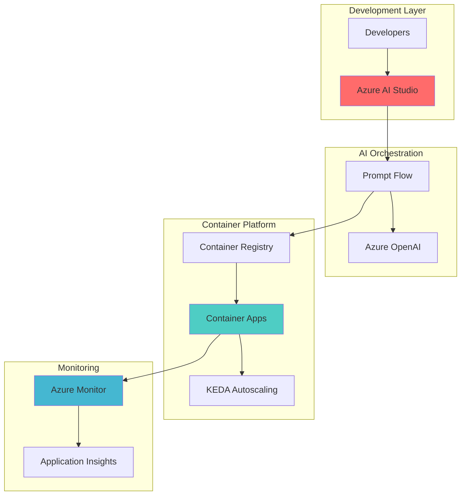

# Scalable AI Prompt Workflows with Azure AI Studio and Container Apps

## Problem

Organizations developing AI-powered applications face challenges scaling prompt engineering workflows from development to production. Traditional deployment approaches require managing infrastructure, handling variable workloads, and maintaining separate environments for experimentation and production. Teams struggle with version control for prompts, lack automated scaling for AI workloads, and face high operational costs when AI models sit idle during low-traffic periods.

## Solution

This recipe implements a serverless architecture using Azure AI Studio's Prompt Flow for visual prompt engineering and Azure Container Apps for automatic scaling. The solution containerizes prompt flows, deploys them as serverless endpoints with scale-to-zero capabilities, and provides comprehensive monitoring through Azure Monitor. This approach eliminates infrastructure management, reduces costs through consumption-based billing, and enables seamless transitions from experimentation to production-ready AI applications.

## Architecture Diagram



## Prerequisites

1. Azure subscription with appropriate permissions to create resources
2. Azure CLI v2.60.0 or later installed and configured (or use Azure Cloud Shell)
3. Docker installed locally for container image building
4. Basic understanding of containerization and serverless concepts
5. Azure AI Studio access with Azure OpenAI deployment
6. Estimated cost: $5-20 for testing (varies based on usage)

> **Note**: Ensure your Azure subscription has sufficient quota for Azure Container Apps and Azure OpenAI services in your selected region.

## Preparation

```bash
# Set environment variables for Azure resources
export RESOURCE_GROUP="rg-ai-serverless-${RANDOM_SUFFIX}"
export LOCATION="eastus"
export SUBSCRIPTION_ID=$(az account show --query id --output tsv)

# Generate unique suffix for resource names
RANDOM_SUFFIX=$(openssl rand -hex 3)

# Set additional environment variables with unique names
export AI_HUB_NAME="hub-ai-${RANDOM_SUFFIX}"
export AI_PROJECT_NAME="project-promptflow-${RANDOM_SUFFIX}"
export ACR_NAME="acr${RANDOM_SUFFIX}"
export ACA_ENV_NAME="env-serverless-${RANDOM_SUFFIX}"
export ACA_APP_NAME="app-promptflow-${RANDOM_SUFFIX}"
export WORKSPACE_NAME="ws-ai-${RANDOM_SUFFIX}"

# Create resource group
az group create \
    --name ${RESOURCE_GROUP} \
    --location ${LOCATION} \
    --tags purpose=recipe environment=demo

echo "✅ Resource group created: ${RESOURCE_GROUP}"

# Create Azure Container Registry
az acr create \
    --name ${ACR_NAME} \
    --resource-group ${RESOURCE_GROUP} \
    --sku Basic \
    --admin-enabled true \
    --tags purpose=recipe environment=demo

echo "✅ Container Registry created: ${ACR_NAME}"
```

## Steps

1. **Create Azure AI Hub and Project**:

   Azure AI Hub serves as the central workspace for AI development, providing unified access to AI services, models, and collaborative tools. Creating an AI hub establishes the foundation for building, testing, and deploying prompt flows with integrated security and governance. The hub architecture enables team collaboration while maintaining enterprise-grade compliance and access controls.

   ```bash
   # Create storage account for AI Hub
   STORAGE_ACCOUNT="st${RANDOM_SUFFIX}"
   az storage account create \
       --name ${STORAGE_ACCOUNT} \
       --resource-group ${RESOURCE_GROUP} \
       --location ${LOCATION} \
       --sku Standard_LRS \
       --tags purpose=recipe environment=demo
   
   # Create AI Hub using ML workspace
   az ml workspace create \
       --name ${AI_HUB_NAME} \
       --resource-group ${RESOURCE_GROUP} \
       --location ${LOCATION} \
       --kind hub \
       --storage-account ${STORAGE_ACCOUNT} \
       --tags purpose=recipe,environment=demo
   
   # Create AI Project
   az ml workspace create \
       --name ${AI_PROJECT_NAME} \
       --resource-group ${RESOURCE_GROUP} \
       --location ${LOCATION} \
       --kind project \
       --hub-id "/subscriptions/${SUBSCRIPTION_ID}/resourceGroups/${RESOURCE_GROUP}/providers/Microsoft.MachineLearningServices/workspaces/${AI_HUB_NAME}" \
       --tags purpose=recipe,environment=demo
   
   echo "✅ AI Hub and Project created successfully"
   ```

   The AI Hub now provides a centralized environment for prompt engineering with built-in versioning, experiment tracking, and deployment capabilities. This establishes the foundation for creating and managing prompt flows with enterprise-ready features.

2. **Deploy Azure OpenAI Model**:

   Azure OpenAI provides enterprise-grade access to powerful language models with built-in security, compliance, and responsible AI features. Deploying a model creates a dedicated endpoint for your prompt flows to interact with AI capabilities while maintaining data privacy and regional compliance requirements.

   ```bash
   # Create Azure OpenAI resource
   OPENAI_NAME="aoai-${RANDOM_SUFFIX}"
   az cognitiveservices account create \
       --name ${OPENAI_NAME} \
       --resource-group ${RESOURCE_GROUP} \
       --location ${LOCATION} \
       --kind OpenAI \
       --sku S0 \
       --custom-domain ${OPENAI_NAME} \
       --tags purpose=recipe environment=demo
   
   # Deploy GPT model with current version
   az cognitiveservices account deployment create \
       --name ${OPENAI_NAME} \
       --resource-group ${RESOURCE_GROUP} \
       --deployment-name "gpt-35-turbo" \
       --model-name "gpt-35-turbo" \
       --model-version "0125" \
       --model-format OpenAI \
       --sku-name "Standard" \
       --sku-capacity 10
   
   # Get OpenAI endpoint and key
   OPENAI_ENDPOINT=$(az cognitiveservices account show \
       --name ${OPENAI_NAME} \
       --resource-group ${RESOURCE_GROUP} \
       --query properties.endpoint -o tsv)
   
   OPENAI_KEY=$(az cognitiveservices account keys list \
       --name ${OPENAI_NAME} \
       --resource-group ${RESOURCE_GROUP} \
       --query key1 -o tsv)
   
   echo "✅ Azure OpenAI deployed with endpoint: ${OPENAI_ENDPOINT}"
   ```

   The Azure OpenAI service is now configured with the latest GPT-3.5 Turbo model version, providing reliable access to state-of-the-art language capabilities for your prompt flows.

3. **Create Container Apps Environment**:

   Azure Container Apps provides a serverless platform for running containerized workloads with automatic scaling and built-in observability. The environment acts as a secure boundary for your applications, providing networking isolation, shared logging, and Dapr integration for microservices patterns. This serverless approach eliminates cluster management while providing Kubernetes-based scaling capabilities.

   ```bash
   # Create Log Analytics workspace for monitoring
   az monitor log-analytics workspace create \
       --name ${WORKSPACE_NAME} \
       --resource-group ${RESOURCE_GROUP} \
       --location ${LOCATION} \
       --tags purpose=recipe environment=demo
   
   # Get Log Analytics credentials
   LOG_ANALYTICS_ID=$(az monitor log-analytics workspace show \
       --name ${WORKSPACE_NAME} \
       --resource-group ${RESOURCE_GROUP} \
       --query customerId -o tsv)
   
   LOG_ANALYTICS_KEY=$(az monitor log-analytics workspace get-shared-keys \
       --name ${WORKSPACE_NAME} \
       --resource-group ${RESOURCE_GROUP} \
       --query primarySharedKey -o tsv)
   
   # Create Container Apps environment
   az containerapp env create \
       --name ${ACA_ENV_NAME} \
       --resource-group ${RESOURCE_GROUP} \
       --location ${LOCATION} \
       --logs-workspace-id ${LOG_ANALYTICS_ID} \
       --logs-workspace-key ${LOG_ANALYTICS_KEY} \
       --tags purpose=recipe environment=demo
   
   echo "✅ Container Apps environment created with integrated monitoring"
   ```

   The Container Apps environment is now configured with built-in monitoring and logging capabilities. This provides the serverless foundation for deploying prompt flow containers with automatic scaling based on incoming requests.

4. **Create Sample Prompt Flow**:

   Prompt flows enable visual orchestration of AI workflows, connecting language models, prompts, and custom logic through an intuitive interface. Creating a basic prompt flow demonstrates the development experience and prepares the workflow for containerization. This approach promotes rapid iteration and testing before production deployment.

   ```bash
   # Create prompt flow definition file
   cat > flow.dag.yaml << EOF
   inputs:
     question:
       type: string
   outputs:
     answer:
       type: string
       reference: \${answer_node.output}
   nodes:
   - name: answer_node
     type: llm
     source:
       type: code
       path: answer.jinja2
     inputs:
       deployment_name: gpt-35-turbo
       temperature: 0.7
       max_tokens: 150
       question: \${inputs.question}
     connection: aoai_connection
   EOF
   
   # Create prompt template
   cat > answer.jinja2 << EOF
   system:
   You are a helpful AI assistant that provides clear and concise answers.
   
   user:
   {{question}}
   EOF
   
   # Create requirements file with updated versions
   cat > requirements.txt << EOF
   promptflow==1.15.0
   promptflow-tools==1.4.0
   python-dotenv==1.0.0
   openai==1.40.0
   EOF
   
   echo "✅ Prompt flow files created"
   ```

   The prompt flow configuration is now ready with optimized settings for production deployment. These files define the AI workflow structure and dependencies needed for containerization.

5. **Containerize Prompt Flow**:

   Containerization packages the prompt flow with all dependencies into a portable, immutable artifact that can run consistently across environments. This step transforms the development-time prompt flow into a production-ready container image, enabling serverless deployment with guaranteed reproducibility and version control through Azure Container Registry.

   ```bash
   # Create Dockerfile for prompt flow
   cat > Dockerfile << EOF
   FROM mcr.microsoft.com/azureml/promptflow/promptflow-runtime:latest
   
   WORKDIR /app
   
   # Copy flow files
   COPY flow.dag.yaml .
   COPY answer.jinja2 .
   COPY requirements.txt .
   
   # Install dependencies
   RUN pip install -r requirements.txt
   
   # Set environment variables
   ENV AZURE_OPENAI_ENDPOINT=\${AZURE_OPENAI_ENDPOINT}
   ENV AZURE_OPENAI_API_KEY=\${AZURE_OPENAI_API_KEY}
   
   # Expose port
   EXPOSE 8080
   
   # Run prompt flow
   CMD ["pf", "flow", "serve", "--source", ".", "--port", "8080", "--host", "0.0.0.0"]
   EOF
   
   # Build container image
   docker build -t promptflow-app:latest .
   
   # Tag for ACR
   docker tag promptflow-app:latest ${ACR_NAME}.azurecr.io/promptflow-app:latest
   
   # Login to ACR
   az acr login --name ${ACR_NAME}
   
   # Push to ACR
   docker push ${ACR_NAME}.azurecr.io/promptflow-app:latest
   
   echo "✅ Prompt flow containerized and pushed to registry"
   ```

   The containerized prompt flow is now stored in Azure Container Registry, providing secure, geo-replicated storage with vulnerability scanning. This enables reliable deployment to Container Apps with automated image pulling and updates.

6. **Deploy to Azure Container Apps**:

   Deploying to Container Apps transforms the containerized prompt flow into a scalable, serverless API endpoint. Container Apps automatically manages infrastructure, scales based on demand, and provides built-in load balancing. The platform's scale-to-zero capability ensures cost efficiency by shutting down instances during idle periods while maintaining rapid cold-start performance.

   ```bash
   # Get ACR credentials
   ACR_USERNAME=$(az acr credential show \
       --name ${ACR_NAME} \
       --query username -o tsv)
   
   ACR_PASSWORD=$(az acr credential show \
       --name ${ACR_NAME} \
       --query passwords[0].value -o tsv)
   
   # Create Container App with updated parameters
   az containerapp create \
       --name ${ACA_APP_NAME} \
       --resource-group ${RESOURCE_GROUP} \
       --environment ${ACA_ENV_NAME} \
       --image ${ACR_NAME}.azurecr.io/promptflow-app:latest \
       --registry-server ${ACR_NAME}.azurecr.io \
       --registry-username ${ACR_USERNAME} \
       --registry-password ${ACR_PASSWORD} \
       --target-port 8080 \
       --ingress external \
       --min-replicas 0 \
       --max-replicas 10 \
       --env-vars \
           AZURE_OPENAI_ENDPOINT=${OPENAI_ENDPOINT} \
           AZURE_OPENAI_API_KEY=${OPENAI_KEY} \
       --tags purpose=recipe environment=demo
   
   # Get Container App URL
   APP_URL=$(az containerapp show \
       --name ${ACA_APP_NAME} \
       --resource-group ${RESOURCE_GROUP} \
       --query properties.configuration.ingress.fqdn -o tsv)
   
   echo "✅ Prompt flow deployed to: https://${APP_URL}"
   ```

   The prompt flow is now running as a serverless application with automatic HTTPS termination, elastic scaling, and integrated monitoring. The deployment supports handling thousands of concurrent requests while maintaining cost efficiency through consumption-based pricing.

7. **Configure Monitoring and Alerts**:

   Comprehensive monitoring ensures production reliability by tracking performance metrics, detecting anomalies, and enabling proactive issue resolution. Azure Monitor integration provides real-time insights into request patterns, response times, and error rates. Setting up alerts enables automatic notification of performance degradation or availability issues.

   ```bash
   # Enable Application Insights
   az monitor app-insights component create \
       --app ${ACA_APP_NAME}-insights \
       --location ${LOCATION} \
       --resource-group ${RESOURCE_GROUP} \
       --workspace ${WORKSPACE_NAME} \
       --tags purpose=recipe environment=demo
   
   # Get Application Insights connection string
   INSTRUMENTATION_KEY=$(az monitor app-insights component show \
       --app ${ACA_APP_NAME}-insights \
       --resource-group ${RESOURCE_GROUP} \
       --query instrumentationKey -o tsv)
   
   # Update Container App with Application Insights
   az containerapp update \
       --name ${ACA_APP_NAME} \
       --resource-group ${RESOURCE_GROUP} \
       --set-env-vars \
           APPLICATIONINSIGHTS_CONNECTION_STRING="InstrumentationKey=${INSTRUMENTATION_KEY}"
   
   # Create alert rule for high response time
   az monitor metrics alert create \
       --name "${ACA_APP_NAME}-response-time-alert" \
       --resource-group ${RESOURCE_GROUP} \
       --scopes "/subscriptions/${SUBSCRIPTION_ID}/resourceGroups/${RESOURCE_GROUP}/providers/Microsoft.App/containerApps/${ACA_APP_NAME}" \
       --condition "avg ResponseTime > 1000" \
       --window-size 5m \
       --evaluation-frequency 1m \
       --description "Alert when average response time exceeds 1 second" \
       --tags purpose=recipe environment=demo
   
   echo "✅ Monitoring and alerts configured"
   ```

   Comprehensive monitoring is now in place with Application Insights providing detailed telemetry and alerting capabilities. This ensures production-ready observability for your AI prompt workflows.

> **Tip**: Use Application Insights Live Metrics to monitor real-time performance during load testing and identify optimization opportunities for your prompt flows.

## Validation & Testing

1. Test the deployed prompt flow endpoint:

   ```bash
   # Test prompt flow API
   curl -X POST "https://${APP_URL}/score" \
       -H "Content-Type: application/json" \
       -d '{
         "question": "What is Azure Container Apps?"
       }'
   ```

   Expected output: A JSON response containing the AI-generated answer about Azure Container Apps.

2. Verify automatic scaling:

   ```bash
   # Check current replicas
   az containerapp replica list \
       --name ${ACA_APP_NAME} \
       --resource-group ${RESOURCE_GROUP} \
       --output table
   
   # Generate load to trigger scaling
   for i in {1..50}; do
       curl -X POST "https://${APP_URL}/score" \
           -H "Content-Type: application/json" \
           -d '{"question": "Test question"}' &
   done
   
   # Wait and check scaled replicas
   sleep 30
   az containerapp replica list \
       --name ${ACA_APP_NAME} \
       --resource-group ${RESOURCE_GROUP} \
       --output table
   ```

3. Monitor performance metrics:

   ```bash
   # View Container App logs
   az containerapp logs show \
       --name ${ACA_APP_NAME} \
       --resource-group ${RESOURCE_GROUP} \
       --type system \
       --follow false \
       --tail 50
   
   # Check Application Insights metrics
   echo "View detailed metrics at: https://portal.azure.com/#resource/subscriptions/${SUBSCRIPTION_ID}/resourceGroups/${RESOURCE_GROUP}/providers/microsoft.insights/components/${ACA_APP_NAME}-insights/overview"
   ```

## Cleanup

1. Remove Container Apps resources:

   ```bash
   # Delete Container App
   az containerapp delete \
       --name ${ACA_APP_NAME} \
       --resource-group ${RESOURCE_GROUP} \
       --yes
   
   echo "✅ Container App deleted"
   ```

2. Remove Container Apps environment:

   ```bash
   # Delete environment
   az containerapp env delete \
       --name ${ACA_ENV_NAME} \
       --resource-group ${RESOURCE_GROUP} \
       --yes
   
   echo "✅ Container Apps environment deleted"
   ```

3. Clean up AI and monitoring resources:

   ```bash
   # Delete Application Insights
   az monitor app-insights component delete \
       --app ${ACA_APP_NAME}-insights \
       --resource-group ${RESOURCE_GROUP}
   
   # Delete Log Analytics workspace
   az monitor log-analytics workspace delete \
       --name ${WORKSPACE_NAME} \
       --resource-group ${RESOURCE_GROUP} \
       --yes
   
   echo "✅ Monitoring resources deleted"
   ```

4. Remove all remaining resources:

   ```bash
   # Delete resource group and all resources
   az group delete \
       --name ${RESOURCE_GROUP} \
       --yes \
       --no-wait
   
   echo "✅ Resource group deletion initiated"
   echo "Note: Complete deletion may take several minutes"
   ```

## Discussion

Azure Container Apps and Prompt Flow create a powerful combination for serverless AI application deployment, addressing the key challenges of scaling prompt engineering workflows. This architecture leverages Container Apps' KEDA-based autoscaling to handle variable workloads efficiently while maintaining cost optimization through scale-to-zero capabilities. The platform's built-in support for Dapr and comprehensive monitoring through Azure Monitor ensures production-ready deployments. For detailed architectural guidance, see the [Azure Container Apps documentation](https://docs.microsoft.com/en-us/azure/container-apps/) and [Prompt Flow overview](https://docs.microsoft.com/en-us/azure/machine-learning/prompt-flow/overview-what-is-prompt-flow).

The serverless approach eliminates traditional infrastructure management overhead while providing enterprise-grade features like automatic SSL termination, rolling updates, and traffic splitting for blue-green deployments. Container Apps' integration with Azure Container Registry enables seamless CI/CD workflows, while the platform's support for both HTTP and TCP ingress accommodates diverse application patterns. This architecture follows the [Azure Well-Architected Framework](https://docs.microsoft.com/en-us/azure/architecture/framework/) principles, particularly for operational excellence and cost optimization.

From a development perspective, Prompt Flow's visual interface accelerates AI application development by enabling rapid prototyping and testing of prompt variations. The tool's built-in evaluation capabilities help optimize prompt performance before production deployment. Combined with Container Apps' revision management, teams can confidently iterate on AI workflows while maintaining production stability. For comprehensive prompt engineering guidance, review the [Prompt Flow best practices](https://docs.microsoft.com/en-us/azure/machine-learning/prompt-flow/how-to-guides/develop-a-dag-flow) and [Azure OpenAI documentation](https://docs.microsoft.com/en-us/azure/ai-services/openai/).

> **Warning**: Monitor Azure OpenAI token usage and implement appropriate rate limiting to control costs. Consider implementing caching strategies for frequently requested prompts to optimize both performance and expenses.

## Challenge

Extend this solution by implementing these enhancements:

1. **Add Redis caching**: Implement Azure Cache for Redis to cache common prompt responses, reducing OpenAI API calls and improving response times.

2. **Implement A/B testing**: Use Container Apps' traffic splitting to deploy multiple prompt flow versions and compare performance metrics through Application Insights.

3. **Create CI/CD pipeline**: Build an Azure DevOps or GitHub Actions workflow that automatically builds and deploys prompt flow updates when changes are pushed to the repository.

4. **Add API authentication**: Implement Azure API Management in front of Container Apps to add authentication, rate limiting, and usage analytics for your AI endpoints.

5. **Enable multi-region deployment**: Deploy the solution across multiple Azure regions with Azure Front Door for global load balancing and improved latency for worldwide users.

## Infrastructure Code

### Available Infrastructure as Code:

- [Infrastructure Code Overview](code/README.md) - Detailed description of all infrastructure components
- [Bicep](code/bicep/) - Azure Bicep templates
- [Bash CLI Scripts](code/scripts/) - Example bash scripts using Azure CLI commands to deploy infrastructure
- [Terraform](code/terraform/) - Terraform configuration files