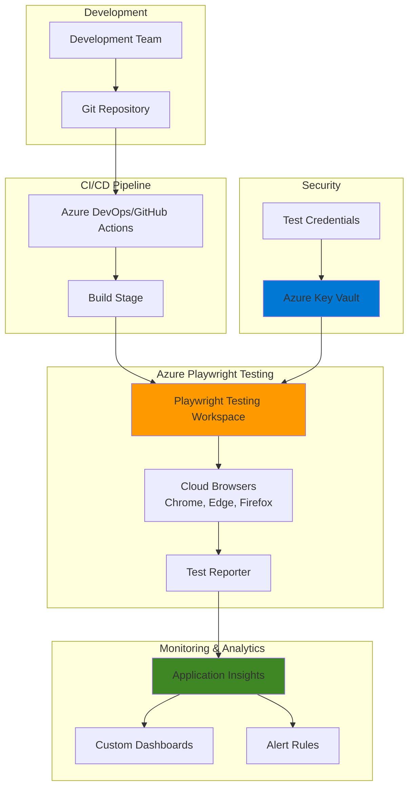

# Scalable Browser Testing Pipeline with Playwright Testing and Application Insights

## Problem

Organizations struggle to efficiently run browser-based end-to-end tests at scale across multiple browsers and operating systems, while lacking comprehensive visibility into test performance metrics and failure patterns. Traditional testing approaches require maintaining complex infrastructure and often fail to provide actionable insights into test health and application behavior. The manual management of test credentials and secrets across multiple environments adds additional security risks and operational overhead.

## Solution

Implement a comprehensive browser testing pipeline using Azure Playwright Testing for cloud-hosted parallel test execution across multiple regions, integrated with Application Insights for real-time monitoring and performance analysis. Azure Key Vault securely manages all test credentials and secrets, while the entire solution provides automated reporting, failure analysis, and performance trending to accelerate test debugging and improve application quality.

## Architecture Diagram



## Prerequisites

1. Azure subscription with Owner or Contributor role
2. Azure CLI v2.57.0 or later installed (or use Azure Cloud Shell)
3. Node.js 18.x or later with npm package manager
4. Basic knowledge of Playwright testing framework
5. Estimated cost: $50-100/month for moderate test volume

> **Note**: Azure Playwright Testing is currently in preview and available in East US, West US 3, East Asia, and West Europe regions.

## Preparation

```bash
# Set environment variables for the recipe
export RESOURCE_GROUP="rg-playwright-testing-${RANDOM_SUFFIX}"
export LOCATION="eastus"
export SUBSCRIPTION_ID=$(az account show --query id --output tsv)

# Generate unique suffix for resource names
RANDOM_SUFFIX=$(openssl rand -hex 3)
export KEYVAULT_NAME="kv-playwright-${RANDOM_SUFFIX}"
export AI_NAME="ai-playwright-testing-${RANDOM_SUFFIX}"
export WORKSPACE_NAME="playwright-workspace-${RANDOM_SUFFIX}"

# Login to Azure (skip if using Cloud Shell)
az login

echo "Using subscription: ${SUBSCRIPTION_ID}"

# Create resource group
az group create \
    --name ${RESOURCE_GROUP} \
    --location ${LOCATION} \
    --tags purpose=e2e-testing environment=testing

echo "✅ Resource group created: ${RESOURCE_GROUP}"
```

## Steps

1. **Create Application Insights for Monitoring**:

   Application Insights provides comprehensive monitoring capabilities for your browser tests, capturing performance metrics, failure patterns, and custom telemetry. By integrating with Playwright Testing, you gain visibility into test execution times, pass/fail rates, and can correlate test failures with application logs. This observability layer is crucial for identifying flaky tests and performance degradation over time.

   ```bash
   # Create Log Analytics workspace for Application Insights
   WORKSPACE_ID=$(az monitor log-analytics workspace create \
       --resource-group ${RESOURCE_GROUP} \
       --workspace-name "law-playwright-${RANDOM_SUFFIX}" \
       --location ${LOCATION} \
       --query id --output tsv)
   
   # Create Application Insights component
   AI_CONNECTION_STRING=$(az monitor app-insights component create \
       --app ${AI_NAME} \
       --location ${LOCATION} \
       --resource-group ${RESOURCE_GROUP} \
       --workspace ${WORKSPACE_ID} \
       --application-type web \
       --query connectionString --output tsv)
   
   echo "✅ Application Insights created with connection string"
   ```

   The Application Insights instance is now ready to receive telemetry from your Playwright tests. The connection string will be used to configure the test runner to send metrics and logs directly to Azure Monitor for analysis.

2. **Create Azure Key Vault for Secure Credential Storage**:

   Azure Key Vault provides centralized, secure storage for test credentials, API keys, and sensitive configuration data. This eliminates the need to store secrets in code or configuration files, reducing security risks. The integration with Azure Active Directory ensures that only authorized services and users can access the stored secrets, maintaining compliance with security best practices.

   ```bash
   # Create Key Vault
   az keyvault create \
       --name ${KEYVAULT_NAME} \
       --resource-group ${RESOURCE_GROUP} \
       --location ${LOCATION} \
       --enable-rbac-authorization true \
       --sku standard
   
   # Get current user's object ID for permissions
   USER_OBJECT_ID=$(az ad signed-in-user show --query id --output tsv)
   
   # Assign Key Vault Secrets Officer role to current user
   az role assignment create \
       --role "Key Vault Secrets Officer" \
       --assignee ${USER_OBJECT_ID} \
       --scope $(az keyvault show --name ${KEYVAULT_NAME} \
           --resource-group ${RESOURCE_GROUP} --query id --output tsv)
   
   echo "✅ Key Vault created: ${KEYVAULT_NAME}"
   ```

   The Key Vault is now configured with RBAC authorization, providing secure, role-based access to secrets. This approach follows Azure security best practices and enables fine-grained control over who can access test credentials.

3. **Store Test Credentials in Key Vault**:

   Storing test credentials in Key Vault ensures secure management of sensitive data across all testing environments. This approach supports credential rotation without code changes and provides audit logging for compliance. The secrets can include application URLs, test user credentials, API keys, and environment-specific configuration values.

   ```bash
   # Store Application Insights connection string
   az keyvault secret set \
       --vault-name ${KEYVAULT_NAME} \
       --name "AppInsightsConnectionString" \
       --value "${AI_CONNECTION_STRING}"
   
   # Store test application URL
   az keyvault secret set \
       --vault-name ${KEYVAULT_NAME} \
       --name "TestAppUrl" \
       --value "https://your-test-app.azurewebsites.net"
   
   # Store test user credentials
   az keyvault secret set \
       --vault-name ${KEYVAULT_NAME} \
       --name "TestUsername" \
       --value "testuser@example.com"
   
   az keyvault secret set \
       --vault-name ${KEYVAULT_NAME} \
       --name "TestPassword" \
       --value "$(openssl rand -base64 12)"
   
   echo "✅ Test credentials stored securely in Key Vault"
   ```

   All sensitive configuration data is now centrally managed and secured through Azure's identity and access management system.

4. **Create Playwright Testing Workspace**:

   The Playwright Testing workspace provides cloud infrastructure for running browser tests at scale. This managed service eliminates the need to maintain test infrastructure and provides automatic scaling based on test volume. The workspace supports parallel execution across multiple browsers and operating systems, significantly reducing test execution time.

   ```bash
   # Note: Workspace creation requires the Azure Portal
   echo "Create Playwright Testing workspace:"
   echo "1. Navigate to: https://aka.ms/mpt/portal"
   echo "2. Sign in with your Azure account"
   echo "3. Click '+ New workspace'"
   echo "4. Enter workspace name: ${WORKSPACE_NAME}"
   echo "5. Select subscription: ${SUBSCRIPTION_ID}"
   echo "6. Select region: ${LOCATION}"
   echo "7. Click 'Create workspace'"
   echo ""
   echo "After creation, copy the service endpoint URL"
   echo "Example: https://eastus.api.playwright.microsoft.com"
   
   # Wait for user to create workspace
   read -p "Press Enter after creating the workspace..."
   
   # Prompt for service endpoint
   read -p "Enter the Playwright Testing service endpoint URL: " \
       PLAYWRIGHT_SERVICE_URL
   export PLAYWRIGHT_SERVICE_URL
   
   echo "✅ Playwright Testing workspace configured"
   ```

   The workspace is now ready to execute tests in the cloud. The service endpoint URL will be used to connect your local test runner to Azure's managed browser infrastructure.

5. **Initialize Playwright Test Project**:

   Setting up a Playwright project with Azure integration enables cloud-based test execution and reporting. The Microsoft Playwright Testing package provides seamless integration with the Azure service, automatically handling authentication, test distribution, and result aggregation. This configuration supports all major browsers and enables cross-browser testing without local browser installations.

   ```bash
   # Create test project directory
   mkdir playwright-azure-tests && cd playwright-azure-tests
   
   # Initialize npm project
   npm init -y
   
   # Install Playwright and Azure integration
   npm install --save-dev @playwright/test
   npm install --save-dev @azure/microsoft-playwright-testing
   
   # Initialize Playwright Testing configuration
   npx init @azure/microsoft-playwright-testing@latest
   
   # Create playwright.config.ts for Azure integration
   cat > playwright.config.ts << 'EOF'
   import { defineConfig, devices } from '@playwright/test';
   
   export default defineConfig({
     testDir: './tests',
     timeout: 60000,
     fullyParallel: true,
     workers: 20,
     
     use: {
       trace: 'on-first-retry',
       video: 'retain-on-failure',
       screenshot: 'only-on-failure',
     },
     
     projects: [
       { 
         name: 'chromium', 
         use: { ...devices['Desktop Chrome'] } 
       },
       { 
         name: 'firefox', 
         use: { ...devices['Desktop Firefox'] } 
       },
       { 
         name: 'webkit', 
         use: { ...devices['Desktop Safari'] } 
       },
     ],
     
     reporter: [
       ['html'],
       ['@azure/microsoft-playwright-testing/reporter'],
     ],
   });
   EOF
   
   echo "✅ Playwright project initialized with Azure integration"
   ```

   The project configuration is optimized for cloud execution with multiple browser support and comprehensive reporting capabilities.

6. **Configure Application Insights Integration**:

   Integrating Application Insights with Playwright tests enables comprehensive monitoring of test execution metrics and custom events. This configuration captures test duration, success rates, and custom properties that help identify patterns in test failures. The telemetry data flows directly to Azure Monitor, enabling advanced analytics and alerting on test health.

   ```bash
   # Create test helper directory
   mkdir -p tests/helpers
   
   # Create test helper for Application Insights
   cat > tests/helpers/telemetry.ts << 'EOF'
   import { TelemetryClient } from 'applicationinsights';
   
   export class TestTelemetry {
     private client: TelemetryClient;
     
     constructor(connectionString: string) {
       this.client = new TelemetryClient(connectionString);
     }
     
     trackTestStart(testName: string, browser: string) {
       this.client.trackEvent({
         name: 'TestStarted',
         properties: {
           testName,
           browser,
           timestamp: new Date().toISOString(),
         },
       });
     }
     
     trackTestResult(testName: string, browser: string, 
                    passed: boolean, duration: number) {
       this.client.trackEvent({
         name: 'TestCompleted',
         properties: {
           testName,
           browser,
           passed: passed.toString(),
           status: passed ? 'Passed' : 'Failed',
         },
         measurements: {
           duration,
         },
       });
       
       this.client.trackMetric({
         name: 'TestDuration',
         value: duration,
         properties: { testName, browser },
       });
     }
     
     flush() {
       this.client.flush();
     }
   }
   EOF
   
   # Install Application Insights SDK
   npm install --save-dev applicationinsights
   
   echo "✅ Application Insights integration configured"
   ```

   The telemetry helper class provides structured logging of test events and metrics, enabling comprehensive analysis of test performance trends.

7. **Create Sample E2E Test with Monitoring**:

   This sample test demonstrates how to integrate Azure services into your Playwright tests. The test retrieves credentials from Key Vault, executes browser automation, and sends telemetry to Application Insights. This pattern ensures secure credential handling while providing comprehensive monitoring of test execution across all browsers.

   ```bash
   # Create sample E2E test
   cat > tests/sample.spec.ts << 'EOF'
   import { test, expect } from '@playwright/test';
   import { SecretClient } from '@azure/keyvault-secrets';
   import { DefaultAzureCredential } from '@azure/identity';
   import { TestTelemetry } from './helpers/telemetry';
   
   test.describe('E2E Browser Tests with Azure Integration', () => {
     let telemetry: TestTelemetry;
     let secretClient: SecretClient;
     
     test.beforeAll(async () => {
       // Initialize Azure Key Vault client
       const credential = new DefaultAzureCredential();
       const vaultUrl = `https://${process.env.KEYVAULT_NAME}.vault.azure.net`;
       secretClient = new SecretClient(vaultUrl, credential);
       
       // Get Application Insights connection string
       const aiSecret = await secretClient.getSecret('AppInsightsConnectionString');
       telemetry = new TestTelemetry(aiSecret.value!);
     });
     
     test.afterAll(async () => {
       telemetry.flush();
     });
     
     test('Login and Navigation Test', async ({ page, browserName }) => {
       const startTime = Date.now();
       telemetry.trackTestStart('Login and Navigation', browserName);
       
       try {
         // Retrieve test credentials from Key Vault
         const urlSecret = await secretClient.getSecret('TestAppUrl');
         const usernameSecret = await secretClient.getSecret('TestUsername');
         const passwordSecret = await secretClient.getSecret('TestPassword');
         
         // Navigate to application
         await page.goto(urlSecret.value!);
         
         // Perform login
         await page.fill('[data-testid="username"]', usernameSecret.value!);
         await page.fill('[data-testid="password"]', passwordSecret.value!);
         await page.click('[data-testid="login-button"]');
         
         // Verify successful login
         await expect(page).toHaveURL(/.*dashboard/);
         await expect(page.locator('[data-testid="welcome-message"]'))
           .toBeVisible();
         
         const duration = Date.now() - startTime;
         telemetry.trackTestResult('Login and Navigation', 
           browserName, true, duration);
       } catch (error) {
         const duration = Date.now() - startTime;
         telemetry.trackTestResult('Login and Navigation', 
           browserName, false, duration);
         throw error;
       }
     });
   });
   EOF
   
   # Install Azure SDK dependencies
   npm install --save-dev @azure/keyvault-secrets @azure/identity
   
   echo "✅ Sample E2E test created with Azure integration"
   ```

   The test demonstrates secure credential retrieval and comprehensive telemetry collection for monitoring test execution patterns.

8. **Configure Test Execution Environment**:

   Proper environment configuration ensures seamless integration between Playwright tests and Azure services. Setting up authentication and service endpoints enables the test framework to connect to cloud browsers and report results. This configuration supports both local development and CI/CD pipeline execution with appropriate security contexts.

   ```bash
   # Create environment configuration script
   cat > setup-test-env.sh << EOF
   #!/bin/bash
   
   # Azure Playwright Testing configuration
   export PLAYWRIGHT_SERVICE_URL="${PLAYWRIGHT_SERVICE_URL}"
   export PLAYWRIGHT_SERVICE_RUN_ID="\$(date +%Y%m%d-%H%M%S)"
   
   # Azure Key Vault configuration
   export KEYVAULT_NAME="${KEYVAULT_NAME}"
   
   # Enable Azure authentication for local development
   export AZURE_TENANT_ID=\$(az account show --query tenantId -o tsv)
   export AZURE_CLIENT_ID=\$(az account show --query user.name -o tsv)
   
   echo "✅ Test environment configured"
   echo "Service URL: \${PLAYWRIGHT_SERVICE_URL}"
   echo "Run ID: \${PLAYWRIGHT_SERVICE_RUN_ID}"
   EOF
   
   chmod +x setup-test-env.sh
   
   # Create package.json test scripts
   npm pkg set scripts.test="playwright test"
   npm pkg set scripts.test:azure="source ./setup-test-env.sh && \
       playwright test --config=playwright.service.config.ts"
   npm pkg set scripts.test:local="playwright test --config=playwright.config.ts"
   
   echo "✅ Test execution environment configured"
   ```

   The environment setup script provides consistent configuration across different execution contexts, supporting both local development and cloud execution.

9. **Set Up Application Insights Dashboard**:

   Creating custom dashboards in Application Insights provides real-time visibility into test execution metrics. These dashboards help identify trends in test performance, failure rates, and browser-specific issues. The visualization capabilities enable teams to quickly spot regressions and make data-driven decisions about test stability and application quality.

   ```bash
   # Create queries directory
   mkdir -p queries
   
   # Create custom metrics query for test analysis
   cat > queries/test-analytics.kql << 'EOF'
   // Test execution summary
   customEvents
   | where name == "TestCompleted"
   | summarize 
       TotalTests = count(),
       PassedTests = countif(tostring(customDimensions.passed) == "true"),
       FailedTests = countif(tostring(customDimensions.passed) == "false"),
       AvgDuration = avg(todouble(customMeasurements.duration))
     by Browser = tostring(customDimensions.browser)
   | extend PassRate = round(100.0 * PassedTests / TotalTests, 2)
   | order by Browser
   
   // Test duration trends
   customMetrics
   | where name == "TestDuration"
   | summarize AvgDuration = avg(value) by bin(timestamp, 1h), 
       TestName = tostring(customDimensions.testName)
   | render timechart
   EOF
   
   # Create basic alert rule for monitoring test health
   az monitor scheduled-query create \
       --name "High Test Failure Rate" \
       --resource-group ${RESOURCE_GROUP} \
       --scopes $(az monitor app-insights component show \
           --app ${AI_NAME} \
           --resource-group ${RESOURCE_GROUP} \
           --query id --output tsv) \
       --condition "count 'Heartbeat' > 0" \
       --condition-query "customEvents | where name == 'TestCompleted' \
           and tostring(customDimensions.passed) == 'false' \
           | summarize FailureCount = count() by bin(TimeGenerated, 5m) \
           | where FailureCount > 5" \
       --window-size 5m \
       --evaluation-frequency 5m \
       --description "Alert when test failure count exceeds 5 in 5 minutes"
   
   echo "✅ Application Insights analytics and monitoring configured"
   ```

   The KQL queries provide comprehensive analysis of test execution patterns, while the alert rule ensures immediate notification of test health issues.

## Validation & Testing

1. **Verify Azure Resources**:

   ```bash
   # Check Key Vault creation
   az keyvault show \
       --name ${KEYVAULT_NAME} \
       --resource-group ${RESOURCE_GROUP} \
       --query "name" --output tsv
   
   # Verify Application Insights
   az monitor app-insights component show \
       --app ${AI_NAME} \
       --resource-group ${RESOURCE_GROUP} \
       --query "connectionString" --output tsv
   ```

   Expected output: Resource names and connection string confirming successful creation

2. **Test Local Playwright Execution**:

   ```bash
   # Run tests locally
   npm run test:local -- --project=chromium
   
   # Verify test results
   npx playwright show-report
   ```

3. **Validate Azure Playwright Testing Integration**:

   ```bash
   # Set up environment and run tests on cloud browsers
   source ./setup-test-env.sh
   npm run test:azure
   
   # Check test results in Playwright portal
   echo "View results at: https://aka.ms/mpt/portal"
   ```

> **Tip**: Use the Playwright Testing portal to analyze test execution patterns and identify flaky tests across different browsers and regions.

## Cleanup

1. **Remove Playwright Testing Workspace**:

   ```bash
   # Note: Workspace deletion requires Azure Portal
   echo "Delete Playwright Testing workspace:"
   echo "1. Navigate to: https://aka.ms/mpt/portal"
   echo "2. Select your workspace: ${WORKSPACE_NAME}"
   echo "3. Click 'Delete workspace'"
   echo "4. Confirm deletion"
   ```

2. **Delete Azure Resources**:

   ```bash
   # Delete resource group and all resources
   az group delete \
       --name ${RESOURCE_GROUP} \
       --yes \
       --no-wait
   
   echo "✅ Resource group deletion initiated"
   echo "Note: Complete deletion may take 5-10 minutes"
   
   # Clean up local test project (optional)
   cd ..
   rm -rf playwright-azure-tests
   ```

## Discussion

Azure Playwright Testing combined with Application Insights creates a powerful end-to-end testing solution that addresses the challenges of browser testing at scale. This architecture leverages Azure's global infrastructure to run tests in parallel across multiple browsers and regions, significantly reducing test execution time while providing comprehensive monitoring capabilities. The integration follows the [Azure Well-Architected Framework](https://docs.microsoft.com/en-us/azure/architecture/framework/) principles, particularly focusing on operational excellence and performance efficiency.

The use of Azure Key Vault for credential management ensures security best practices are followed throughout the testing pipeline. By centralizing secrets management, teams can easily rotate credentials without code changes while maintaining audit trails for compliance. This approach aligns with the [Azure security baseline for Key Vault](https://docs.microsoft.com/en-us/azure/key-vault/general/security-baseline) and supports zero-trust security principles.

Application Insights provides deep visibility into test execution patterns, enabling teams to identify flaky tests, performance regressions, and browser-specific issues. The custom telemetry and dashboards created in this recipe follow the [Application Insights best practices](https://docs.microsoft.com/en-us/azure/azure-monitor/app/best-practices) for monitoring and alerting. Teams can extend the monitoring to include custom business metrics and correlate test failures with application performance.

From a cost optimization perspective, the cloud-based approach eliminates the need for maintaining test infrastructure while providing elastic scaling based on demand. The consumption-based pricing model of Azure Playwright Testing ensures you only pay for actual test execution time. For detailed guidance on optimizing costs, refer to the [Azure cost optimization documentation](https://docs.microsoft.com/en-us/azure/cost-management-billing/costs/cost-optimization) and consider implementing test parallelization strategies to reduce overall execution time.

> **Warning**: Azure Playwright Testing is currently in preview. Features and pricing may change before general availability. Monitor the [official documentation](https://docs.microsoft.com/en-us/azure/playwright-testing/) for updates.

## Challenge

Extend this solution by implementing these enhancements:

1. **Implement Visual Regression Testing**: Add screenshot comparison capabilities using Playwright's visual testing features, storing baseline images in Azure Blob Storage and tracking visual changes over time
2. **Create Multi-Stage Pipeline Integration**: Build an Azure DevOps or GitHub Actions pipeline that runs tests automatically on pull requests, with stage gates based on test results
3. **Add Performance Budget Monitoring**: Extend Application Insights integration to track page load times and set performance budgets with automated alerts when thresholds are exceeded
4. **Implement Test Retry Logic with Telemetry**: Create intelligent retry mechanisms that analyze failure patterns in Application Insights to automatically retry only genuinely flaky tests
5. **Build Cross-Region Test Distribution**: Configure tests to run from multiple Azure regions simultaneously, comparing performance metrics across geographic locations

## Infrastructure Code

*Infrastructure code will be generated after recipe approval.*