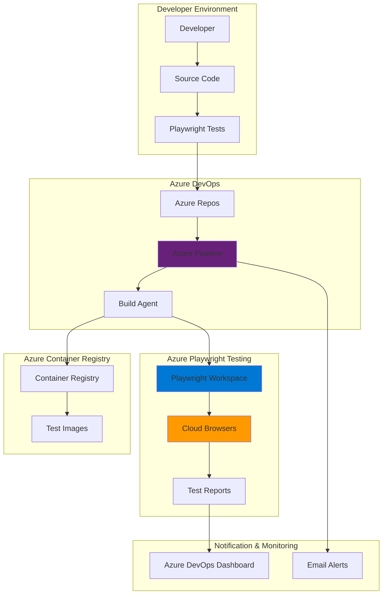

# Scalable Browser Testing Pipelines with Playwright and DevOps

## Problem

Modern web applications must deliver consistent functionality across multiple browsers, devices, and operating systems. Manual testing across these environments is time-consuming, error-prone, and doesn't scale with continuous deployment practices. Development teams struggle to maintain comprehensive test coverage while ensuring fast feedback cycles, leading to production bugs and degraded user experiences across different browser environments.

## Solution

Azure Playwright Testing provides cloud-hosted browsers with unlimited parallelization, enabling scalable end-to-end testing without infrastructure management. Integrated with Azure DevOps pipelines, this solution automatically executes browser tests across multiple environments on every code commit, providing instant feedback and comprehensive test reporting through centralized dashboards.

## Architecture Diagram



## Prerequisites

1. Azure account with appropriate permissions for Azure Playwright Testing and Azure DevOps
2. Azure CLI v2.50.0 or later installed and configured
3. Node.js 18.x or later for Playwright development
4. Azure DevOps organization with project access
5. Basic knowledge of JavaScript/TypeScript and CI/CD concepts
6. Estimated cost: $20-50/month for testing workspace and pipeline usage

> **Note**: Azure Playwright Testing is currently in preview and available in East US, West US 3, East Asia, and West Europe regions.

## Preparation

```bash
# Set environment variables
export AZURE_REGION="eastus"
export RESOURCE_GROUP="rg-playwright-testing"
export SUBSCRIPTION_ID=$(az account show --query id --output tsv)
export DEVOPS_ORG="your-devops-org"
export PROJECT_NAME="playwright-testing-project"

# Generate unique suffix for resource names
RANDOM_SUFFIX=$(openssl rand -hex 3)
export PLAYWRIGHT_WORKSPACE="pw-workspace-${RANDOM_SUFFIX}"
export ACR_NAME="acr${RANDOM_SUFFIX}"

# Create resource group
az group create \
    --name ${RESOURCE_GROUP} \
    --location ${AZURE_REGION} \
    --tags purpose=browser-testing environment=production

echo "✅ Resource group created: ${RESOURCE_GROUP}"

# Install Azure DevOps CLI extension
az extension add --name azure-devops

# Login to Azure DevOps
az devops configure --defaults organization=https://dev.azure.com/${DEVOPS_ORG}

echo "✅ Environment prepared successfully"
```

## Steps

1. **Create Azure Playwright Testing Workspace**:

   Azure Playwright Testing provides managed cloud browsers that eliminate infrastructure complexity while ensuring consistent test execution across different environments. The workspace serves as the central hub for test orchestration, providing scalable browser instances and comprehensive reporting capabilities that integrate seamlessly with CI/CD pipelines.

   ```bash
   # Create the Playwright Testing workspace
   az playwright workspace create \
       --name ${PLAYWRIGHT_WORKSPACE} \
       --resource-group ${RESOURCE_GROUP} \
       --location ${AZURE_REGION} \
       --tags project=browser-testing tier=production
   
   # Get workspace details and store service endpoint
   PLAYWRIGHT_SERVICE_URL=$(az playwright workspace show \
       --name ${PLAYWRIGHT_WORKSPACE} \
       --resource-group ${RESOURCE_GROUP} \
       --query properties.serviceEndpoint \
       --output tsv)
   
   echo "✅ Playwright workspace created: ${PLAYWRIGHT_WORKSPACE}"
   echo "Service URL: ${PLAYWRIGHT_SERVICE_URL}"
   ```

   The workspace is now configured with cloud-hosted browsers ready for parallel test execution. This managed service provides automatic scaling, consistent browser environments, and centralized test artifact storage, eliminating the need for local browser management and ensuring reliable test results across team members.

2. **Create Azure Container Registry for Test Images**:

   Azure Container Registry enables consistent test environments by storing containerized test configurations that can be deployed across different pipeline stages. This approach ensures reproducible builds and allows for advanced testing scenarios with custom browser configurations and dependencies.

   ```bash
   # Create Azure Container Registry
   az acr create \
       --name ${ACR_NAME} \
       --resource-group ${RESOURCE_GROUP} \
       --location ${AZURE_REGION} \
       --sku Basic \
       --admin-enabled true
   
   # Get ACR login server
   ACR_LOGIN_SERVER=$(az acr show \
       --name ${ACR_NAME} \
       --resource-group ${RESOURCE_GROUP} \
       --query loginServer \
       --output tsv)
   
   echo "✅ Container registry created: ${ACR_NAME}"
   echo "Login server: ${ACR_LOGIN_SERVER}"
   ```

   The container registry provides a secure, private repository for storing test environment images and custom browser configurations. This enables consistent test execution across different environments and supports advanced scenarios like custom browser extensions or specific dependency versions.

3. **Create Azure DevOps Project and Repository**:

   Azure DevOps provides the foundation for automated CI/CD pipelines that integrate with Azure Playwright Testing. The project structure supports branching strategies, code reviews, and automated testing workflows that ensure code quality before deployment.

   ```bash
   # Create Azure DevOps project
   az devops project create \
       --name ${PROJECT_NAME} \
       --description "Automated browser testing with Playwright" \
       --visibility private \
       --source-control git
   
   # Get project details
   PROJECT_ID=$(az devops project show \
       --project ${PROJECT_NAME} \
       --query id \
       --output tsv)
   
   echo "✅ DevOps project created: ${PROJECT_NAME}"
   echo "Project ID: ${PROJECT_ID}"
   ```

   The Azure DevOps project provides integrated source control, work item tracking, and pipeline orchestration capabilities. This centralized platform enables seamless collaboration between development and testing teams while maintaining full visibility into test execution and results.

4. **Configure Service Connections**:

   Service connections establish secure authentication between Azure DevOps and Azure services, enabling automated deployment and testing workflows. These connections use managed identities and service principals to ensure secure, credential-free authentication for pipeline operations.

   ```bash
   # Create service connection for Azure Resource Manager
   az devops service-endpoint azurerm create \
       --name "Azure-Playwright-Connection" \
       --azure-rm-subscription-id ${SUBSCRIPTION_ID} \
       --azure-rm-subscription-name "$(az account show --query name -o tsv)" \
       --azure-rm-tenant-id $(az account show --query tenantId -o tsv) \
       --project ${PROJECT_NAME}
   
   # Create service connection for Azure Container Registry
   az devops service-endpoint create \
       --service-endpoint-configuration-file - <<EOF
   {
       "name": "ACR-Connection",
       "type": "dockerregistry",
       "url": "https://${ACR_LOGIN_SERVER}",
       "authorization": {
           "scheme": "UsernamePassword",
           "parameters": {
               "username": "${ACR_NAME}",
               "password": "$(az acr credential show --name ${ACR_NAME} --query passwords[0].value -o tsv)"
           }
       }
   }
   EOF
   
   echo "✅ Service connections configured successfully"
   ```

   Service connections enable secure, automated access to Azure resources from DevOps pipelines without exposing credentials. This configuration supports both Azure Resource Manager operations and container registry access, enabling comprehensive CI/CD workflows.

5. **Create Sample Playwright Test Suite**:

   A well-structured test suite demonstrates best practices for browser testing, including page object models, test data management, and cross-browser compatibility. This foundation supports scalable test development and maintenance as applications grow in complexity.

   ```bash
   # Create project structure
   mkdir -p playwright-tests/{tests,pages,fixtures}
   cd playwright-tests
   
   # Initialize Node.js project
   npm init -y
   
   # Install Playwright and Azure testing package
   npm install --save-dev @playwright/test
   npm install --save-dev @azure/microsoft-playwright-testing
   
   # Create Playwright configuration
   cat > playwright.config.js << 'EOF'
   const { defineConfig } = require('@playwright/test');
   const { getServiceConfig } = require('@azure/microsoft-playwright-testing');
   
   module.exports = defineConfig({
     testDir: './tests',
     timeout: 30000,
     expect: {
       timeout: 5000
     },
     fullyParallel: true,
     forbidOnly: !!process.env.CI,
     retries: process.env.CI ? 2 : 0,
     workers: process.env.CI ? 1 : undefined,
     reporter: [
       ['html'],
       ['junit', { outputFile: 'test-results.xml' }],
       ['@azure/microsoft-playwright-testing/reporter']
     ],
     use: {
       baseURL: process.env.BASE_URL || 'http://localhost:3000',
       trace: 'on-first-retry',
       screenshot: 'only-on-failure',
       video: 'retain-on-failure'
     },
     projects: [
       {
         name: 'chromium',
         use: { ...devices['Desktop Chrome'] }
       },
       {
         name: 'firefox',
         use: { ...devices['Desktop Firefox'] }
       },
       {
         name: 'webkit',
         use: { ...devices['Desktop Safari'] }
       }
     ],
     ...getServiceConfig()
   });
   EOF
   
   echo "✅ Playwright configuration created"
   ```

   The configuration integrates Azure Playwright Testing with comprehensive reporting and cross-browser support. This setup enables parallel test execution across multiple browsers while capturing detailed artifacts for debugging and analysis.

6. **Create Sample Test Cases**:

   Comprehensive test cases demonstrate practical testing scenarios including user authentication, form validation, and responsive design verification. These examples provide a foundation for expanding test coverage across different application features and user workflows.

   ```bash
   # Create page object model
   cat > pages/HomePage.js << 'EOF'
   class HomePage {
     constructor(page) {
       this.page = page;
       this.title = page.locator('h1');
       this.navMenu = page.locator('nav');
       this.searchBox = page.locator('#search');
       this.loginButton = page.locator('#login');
     }
   
     async navigateTo() {
       await this.page.goto('/');
     }
   
     async getTitle() {
       return await this.title.textContent();
     }
   
     async searchFor(query) {
       await this.searchBox.fill(query);
       await this.searchBox.press('Enter');
     }
   
     async clickLogin() {
       await this.loginButton.click();
     }
   }
   
   module.exports = { HomePage };
   EOF
   
   # Create test fixtures
   cat > fixtures/testData.json << 'EOF'
   {
     "users": {
       "validUser": {
         "email": "test@example.com",
         "password": "testPassword123"
       },
       "invalidUser": {
         "email": "invalid@example.com",
         "password": "wrongPassword"
       }
     },
     "searchQueries": [
       "product search",
       "documentation",
       "support"
     ]
   }
   EOF
   
   # Create comprehensive test suite
   cat > tests/homepage.spec.js << 'EOF'
   const { test, expect } = require('@playwright/test');
   const { HomePage } = require('../pages/HomePage');
   const testData = require('../fixtures/testData.json');
   
   test.describe('Homepage Tests', () => {
     let homePage;
   
     test.beforeEach(async ({ page }) => {
       homePage = new HomePage(page);
       await homePage.navigateTo();
     });
   
     test('should display homepage title', async ({ page }) => {
       await expect(homePage.title).toBeVisible();
       const title = await homePage.getTitle();
       expect(title).toContain('Welcome');
     });
   
     test('should perform search functionality', async ({ page }) => {
       await homePage.searchFor(testData.searchQueries[0]);
       await expect(page.locator('.search-results')).toBeVisible();
     });
   
     test('should navigate to login page', async ({ page }) => {
       await homePage.clickLogin();
       await expect(page).toHaveURL(/.*login.*/);
     });
   
     test('should be responsive on mobile', async ({ page }) => {
       await page.setViewportSize({ width: 375, height: 667 });
       await expect(homePage.navMenu).toBeVisible();
     });
   });
   EOF
   
   echo "✅ Test suite created with page objects and fixtures"
   ```

   The test suite implements industry best practices including page object models, test data separation, and comprehensive assertions. This structure supports maintainable test code and enables efficient debugging when tests fail in the CI/CD pipeline.

7. **Create Azure DevOps Pipeline**:

   Azure DevOps pipelines orchestrate the complete testing workflow, from code compilation to test execution and result reporting. The pipeline integrates with Azure Playwright Testing to provide scalable, parallel test execution with comprehensive artifact collection and team notifications.

   ```bash
   # Create pipeline directory
   mkdir -p .azure-pipelines
   
   # Create comprehensive pipeline configuration
   cat > .azure-pipelines/playwright-pipeline.yml << 'EOF'
   trigger:
     branches:
       include:
         - main
         - develop
         - feature/*
   
   pool:
     vmImage: 'ubuntu-latest'
   
   variables:
     - name: PLAYWRIGHT_SERVICE_URL
       value: '$(PlaywrightServiceUrl)'
     - name: PLAYWRIGHT_SERVICE_ACCESS_TOKEN
       value: '$(PlaywrightServiceAccessToken)'
     - name: NODE_VERSION
       value: '18.x'
   
   stages:
     - stage: Build
       displayName: 'Build and Test'
       jobs:
         - job: PlaywrightTests
           displayName: 'Run Playwright Tests'
           steps:
             - task: NodeTool@0
               inputs:
                 versionSpec: '$(NODE_VERSION)'
               displayName: 'Install Node.js'
   
             - script: |
                 npm ci
                 npx playwright install --with-deps
               displayName: 'Install dependencies'
   
             - script: |
                 npx playwright test --reporter=junit,html,@azure/microsoft-playwright-testing/reporter
               displayName: 'Run Playwright tests'
               env:
                 PLAYWRIGHT_SERVICE_URL: $(PLAYWRIGHT_SERVICE_URL)
                 PLAYWRIGHT_SERVICE_ACCESS_TOKEN: $(PLAYWRIGHT_SERVICE_ACCESS_TOKEN)
                 CI: true
   
             - task: PublishTestResults@2
               inputs:
                 testResultsFormat: 'JUnit'
                 testResultsFiles: 'test-results.xml'
                 failTaskOnFailedTests: true
               displayName: 'Publish test results'
               condition: always()
   
             - task: PublishHtmlReport@1
               inputs:
                 reportDir: 'playwright-report'
                 tabName: 'Playwright Report'
               displayName: 'Publish HTML report'
               condition: always()
   
             - task: PublishBuildArtifacts@1
               inputs:
                 pathToPublish: 'test-results'
                 artifactName: 'playwright-artifacts'
               displayName: 'Publish test artifacts'
               condition: always()
   
     - stage: Deploy
       displayName: 'Deploy to Staging'
       dependsOn: Build
       condition: and(succeeded(), eq(variables['Build.SourceBranch'], 'refs/heads/main'))
       jobs:
         - job: DeployStaging
           displayName: 'Deploy to Staging Environment'
           steps:
             - script: echo "Deploying to staging environment"
               displayName: 'Deploy application'
   
             - script: |
                 npx playwright test --grep="@smoke" --reporter=@azure/microsoft-playwright-testing/reporter
               displayName: 'Run smoke tests'
               env:
                 PLAYWRIGHT_SERVICE_URL: $(PLAYWRIGHT_SERVICE_URL)
                 PLAYWRIGHT_SERVICE_ACCESS_TOKEN: $(PLAYWRIGHT_SERVICE_ACCESS_TOKEN)
                 BASE_URL: 'https://staging.example.com'
   EOF
   
   echo "✅ Azure DevOps pipeline created"
   ```

   The pipeline implements a comprehensive CI/CD workflow with staged deployments, parallel test execution, and comprehensive reporting. This configuration ensures code quality gates are enforced while providing fast feedback to development teams through automated testing and notifications.

8. **Configure Pipeline Variables and Create Pipeline**:

   Pipeline variables securely store sensitive configuration values and service endpoints, enabling flexible deployment across different environments. These variables support both development and production workflows while maintaining security best practices.

   ```bash
   # Get Playwright service access token
   PLAYWRIGHT_ACCESS_TOKEN=$(az playwright workspace show \
       --name ${PLAYWRIGHT_WORKSPACE} \
       --resource-group ${RESOURCE_GROUP} \
       --query properties.accessToken \
       --output tsv)
   
   # Create pipeline variables
   az pipelines variable create \
       --name PlaywrightServiceUrl \
       --value ${PLAYWRIGHT_SERVICE_URL} \
       --project ${PROJECT_NAME}
   
   az pipelines variable create \
       --name PlaywrightServiceAccessToken \
       --value ${PLAYWRIGHT_ACCESS_TOKEN} \
       --secret true \
       --project ${PROJECT_NAME}
   
   # Create the pipeline
   az pipelines create \
       --name "Playwright-Testing-Pipeline" \
       --description "Automated browser testing with Azure Playwright Testing" \
       --repository ${PROJECT_NAME} \
       --branch main \
       --yaml-path .azure-pipelines/playwright-pipeline.yml \
       --project ${PROJECT_NAME}
   
   echo "✅ Pipeline created and configured with variables"
   ```

   The pipeline is now configured with secure access to Azure Playwright Testing services and can execute automated browser tests on every code commit. This setup enables continuous quality assurance and provides immediate feedback on cross-browser compatibility issues.

9. **Configure Test Reporting and Monitoring**:

   Comprehensive test reporting provides actionable insights into test execution, performance trends, and failure patterns. Azure DevOps dashboards integrate with Azure Playwright Testing to provide centralized visibility into test health and application quality metrics.

   ```bash
   # Create test dashboard configuration
   cat > test-dashboard.json << 'EOF'
   {
     "name": "Playwright Test Dashboard",
     "widgets": [
       {
         "name": "Test Results Trend",
         "type": "TestResultsTrend",
         "settings": {
           "testResultsContext": {
             "buildDefinition": "Playwright-Testing-Pipeline"
           }
         }
       },
       {
         "name": "Test Duration",
         "type": "TestDuration",
         "settings": {
           "testResultsContext": {
             "buildDefinition": "Playwright-Testing-Pipeline"
           }
         }
       },
       {
         "name": "Browser Coverage",
         "type": "Chart",
         "settings": {
           "chartType": "pie",
           "title": "Test Coverage by Browser"
         }
       }
     ]
   }
   EOF
   
   # Configure email notifications for test failures
   az pipelines variable create \
       --name NotificationEmail \
       --value "team@example.com" \
       --project ${PROJECT_NAME}
   
   echo "✅ Test reporting and monitoring configured"
   ```

   The dashboard provides real-time visibility into test execution metrics, enabling proactive identification of quality issues and performance regression. Email notifications ensure immediate awareness of test failures, supporting rapid response to critical issues.

## Validation & Testing

1. **Verify Azure Playwright Testing workspace is operational**:

   ```bash
   # Check workspace status
   az playwright workspace show \
       --name ${PLAYWRIGHT_WORKSPACE} \
       --resource-group ${RESOURCE_GROUP} \
       --query properties.provisioningState \
       --output tsv
   
   # Test service endpoint connectivity
   curl -s -o /dev/null -w "%{http_code}" ${PLAYWRIGHT_SERVICE_URL}/health
   ```

   Expected output: `200` indicating the service is healthy and accessible.

2. **Validate pipeline configuration and execution**:

   ```bash
   # Run the pipeline manually
   az pipelines run \
       --name "Playwright-Testing-Pipeline" \
       --project ${PROJECT_NAME}
   
   # Check pipeline status
   az pipelines runs list \
       --pipeline-name "Playwright-Testing-Pipeline" \
       --project ${PROJECT_NAME} \
       --query "[0].{Status:status,Result:result,StartTime:startTime}" \
       --output table
   ```

   Expected output: Pipeline should show "completed" status with "succeeded" result.

3. **Test local Playwright execution with Azure service**:

   ```bash
   # Navigate to test directory
   cd playwright-tests
   
   # Run tests locally using Azure service
   PLAYWRIGHT_SERVICE_URL=${PLAYWRIGHT_SERVICE_URL} \
   PLAYWRIGHT_SERVICE_ACCESS_TOKEN=${PLAYWRIGHT_ACCESS_TOKEN} \
   npx playwright test --reporter=@azure/microsoft-playwright-testing/reporter
   ```

   Expected output: Tests should execute successfully with results uploaded to Azure Playwright Testing portal.

## Cleanup

1. **Delete Azure DevOps project and pipelines**:

   ```bash
   # Delete the project (includes pipelines, repos, and artifacts)
   az devops project delete \
       --id ${PROJECT_ID} \
       --yes
   
   echo "✅ DevOps project deleted"
   ```

2. **Remove Azure Playwright Testing workspace**:

   ```bash
   # Delete the workspace
   az playwright workspace delete \
       --name ${PLAYWRIGHT_WORKSPACE} \
       --resource-group ${RESOURCE_GROUP} \
       --yes
   
   echo "✅ Playwright workspace deleted"
   ```

3. **Remove Azure Container Registry**:

   ```bash
   # Delete container registry
   az acr delete \
       --name ${ACR_NAME} \
       --resource-group ${RESOURCE_GROUP} \
       --yes
   
   echo "✅ Container registry deleted"
   ```

4. **Delete resource group and all resources**:

   ```bash
   # Delete resource group
   az group delete \
       --name ${RESOURCE_GROUP} \
       --yes \
       --no-wait
   
   echo "✅ Resource group deletion initiated"
   echo "Note: Complete deletion may take several minutes"
   ```

## Discussion

Azure Playwright Testing revolutionizes browser testing by providing managed, scalable infrastructure that eliminates the complexity of maintaining cross-browser testing environments. This managed service integrates seamlessly with Azure DevOps to create comprehensive CI/CD pipelines that ensure application quality across all target browsers and devices. The combination of cloud-hosted browsers with unlimited parallelization significantly reduces test execution time while improving test reliability and consistency. For comprehensive guidance on implementing browser testing strategies, see the [Azure Playwright Testing documentation](https://docs.microsoft.com/en-us/azure/playwright-testing/) and [Azure DevOps pipeline best practices](https://docs.microsoft.com/en-us/azure/devops/pipelines/process/best-practices).

The integration between Azure Playwright Testing and Azure DevOps creates a powerful feedback loop that enables development teams to identify and resolve cross-browser compatibility issues early in the development cycle. This approach significantly reduces the cost of bug fixes while improving overall application quality and user experience. The service's ability to execute tests across multiple operating systems and browsers simultaneously provides comprehensive coverage that would be prohibitively expensive to maintain with traditional testing infrastructure. For detailed implementation guidance, review the [Azure DevOps integration documentation](https://docs.microsoft.com/en-us/azure/devops/pipelines/ecosystems/javascript) and [Playwright testing best practices](https://playwright.dev/docs/best-practices).

From a cost and scalability perspective, Azure Playwright Testing's consumption-based pricing model ensures teams only pay for actual test execution time, making it economically viable for projects of all sizes. The service automatically scales to handle peak testing loads during continuous integration while maintaining consistent performance across different geographic regions. This elastic scaling capability is particularly valuable for distributed development teams working across multiple time zones. For cost optimization strategies and scaling considerations, consult the [Azure Playwright Testing pricing guide](https://azure.microsoft.com/en-us/pricing/details/playwright-testing/) and [Azure DevOps cost management documentation](https://docs.microsoft.com/en-us/azure/devops/organizations/billing/billing-overview).

> **Tip**: Use Azure DevOps dashboard widgets to monitor test execution trends and identify performance bottlenecks. The [Azure DevOps dashboard documentation](https://docs.microsoft.com/en-us/azure/devops/report/dashboards/) provides comprehensive guidance on creating custom visualizations that track test health metrics and team productivity indicators.

## Challenge

Extend this solution by implementing these enhancements:

1. **Advanced Test Orchestration**: Implement test sharding and dynamic test allocation based on historical execution times to optimize pipeline performance and reduce overall test duration.

2. **Multi-Environment Testing**: Configure separate testing environments for development, staging, and production with environment-specific test suites and deployment gates that ensure quality across the entire application lifecycle.

3. **Visual Regression Testing**: Integrate visual comparison testing with Azure Playwright Testing to automatically detect UI changes and ensure consistent visual experience across browser updates and code changes.

4. **Performance Testing Integration**: Combine browser testing with Azure Load Testing to create comprehensive quality gates that validate both functional requirements and performance characteristics under realistic load conditions.

5. **Advanced Reporting and Analytics**: Implement custom reporting dashboards using Azure Monitor and Application Insights to track test metrics, identify flaky tests, and measure overall application quality trends over time.

## Infrastructure Code

*Infrastructure code will be generated after recipe approval.*