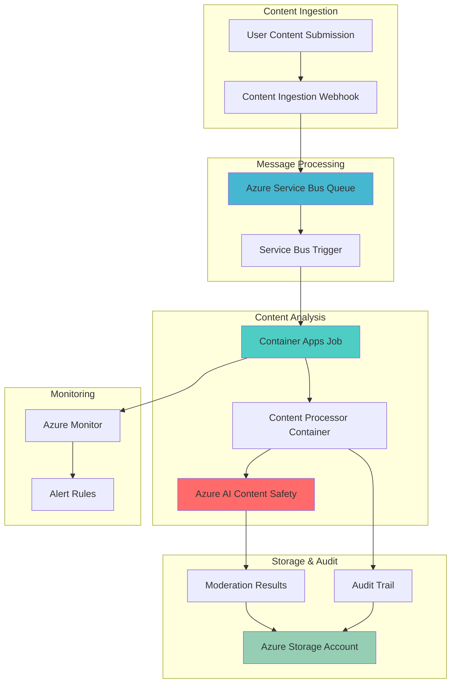

# Scalable Content Moderation with Container Apps Jobs

## Problem

Organizations with user-generated content platforms face significant challenges in maintaining safe digital environments while scaling to handle millions of content submissions daily. Traditional content moderation approaches using manual review teams are costly, inconsistent, and cannot keep pace with the volume of content, leading to harmful material reaching users and potential regulatory compliance violations. The lack of automated, intelligent content analysis creates operational bottlenecks that impact user experience and expose organizations to legal and reputational risks.

## Solution

This solution creates an automated, scalable content moderation system using Azure AI Content Safety for intelligent analysis of text and images, orchestrated through Azure Container Apps Jobs for elastic batch processing, and Azure Service Bus for reliable event-driven message queuing. The architecture provides real-time content analysis with audit trails stored in Azure Storage, ensuring compliance reporting while maintaining high throughput and cost efficiency through serverless scaling.

## Architecture Diagram



## Prerequisites

1. Azure subscription with Owner or Contributor permissions
2. Azure CLI v2.60.0 or later installed and configured
3. Docker knowledge for containerized job creation
4. Understanding of event-driven architectures and message queuing concepts
5. Basic knowledge of REST APIs and content moderation principles
6. Estimated cost: $15-25 per day for moderate usage (1000 content items/hour)

> **Note**: Azure AI Content Safety follows a pay-per-transaction model. Review the [Azure AI Content Safety pricing](https://azure.microsoft.com/en-us/pricing/details/cognitive-services/content-safety/) to understand costs for your expected content volume.

## Preparation

```bash
# Set environment variables for Azure resources
export RESOURCE_GROUP="rg-content-moderation-${RANDOM_SUFFIX}"
export LOCATION="eastus"
export SUBSCRIPTION_ID=$(az account show --query id --output tsv)

# Generate unique suffix for resource names
RANDOM_SUFFIX=$(openssl rand -hex 3)

# Set specific resource names
export CONTENT_SAFETY_NAME="cs-moderation-${RANDOM_SUFFIX}"
export CONTAINER_ENV_NAME="cae-moderation-${RANDOM_SUFFIX}"
export SERVICE_BUS_NAMESPACE="sb-moderation-${RANDOM_SUFFIX}"
export STORAGE_ACCOUNT_NAME="stmoderation${RANDOM_SUFFIX}"
export CONTAINER_JOB_NAME="job-content-processor"

# Create resource group
az group create \
    --name ${RESOURCE_GROUP} \
    --location ${LOCATION} \
    --tags purpose=content-moderation environment=demo

echo "✅ Resource group created: ${RESOURCE_GROUP}"

# Enable required resource providers
az provider register --namespace Microsoft.App
az provider register --namespace Microsoft.CognitiveServices
az provider register --namespace Microsoft.ServiceBus
az provider register --namespace Microsoft.Storage

echo "✅ Resource providers registered"
```

## Steps

1. **Create Azure AI Content Safety Resource**:

   Azure AI Content Safety provides advanced machine learning models for detecting harmful content across text and images. The service offers multi-severity level detection for categories including hate speech, violence, sexual content, and self-harm, enabling fine-grained content filtering policies. This managed AI service eliminates the need for custom model development while providing enterprise-grade security and compliance features.

   ```bash
   # Create Content Safety resource
   az cognitiveservices account create \
       --name ${CONTENT_SAFETY_NAME} \
       --resource-group ${RESOURCE_GROUP} \
       --location ${LOCATION} \
       --kind ContentSafety \
       --sku S0 \
       --assign-identity

   # Get Content Safety endpoint and key
   export CONTENT_SAFETY_ENDPOINT=$(az cognitiveservices account show \
       --name ${CONTENT_SAFETY_NAME} \
       --resource-group ${RESOURCE_GROUP} \
       --query properties.endpoint --output tsv)

   export CONTENT_SAFETY_KEY=$(az cognitiveservices account keys list \
       --name ${CONTENT_SAFETY_NAME} \
       --resource-group ${RESOURCE_GROUP} \
       --query key1 --output tsv)

   echo "✅ Content Safety resource created with endpoint: ${CONTENT_SAFETY_ENDPOINT}"
   ```

   The Content Safety resource is now ready to analyze content with real-time harm detection capabilities. This foundational AI service provides the intelligent analysis engine that will power automated content moderation decisions throughout the workflow.

2. **Create Azure Service Bus Namespace and Queue**:

   Azure Service Bus provides enterprise-grade messaging capabilities with guaranteed message delivery, dead letter queues, and session-based processing. The Service Bus queue acts as a reliable buffer between content ingestion and processing, ensuring no content submissions are lost during peak loads while enabling elastic scaling of processing resources.

   ```bash
   # Create Service Bus namespace
   az servicebus namespace create \
       --name ${SERVICE_BUS_NAMESPACE} \
       --resource-group ${RESOURCE_GROUP} \
       --location ${LOCATION} \
       --sku Standard

   # Create queue for content processing
   az servicebus queue create \
       --namespace-name ${SERVICE_BUS_NAMESPACE} \
       --resource-group ${RESOURCE_GROUP} \
       --name content-queue \
       --max-size 5120 \
       --default-message-time-to-live PT24H

   # Get Service Bus connection string
   export SERVICE_BUS_CONNECTION=$(az servicebus namespace authorization-rule keys list \
       --namespace-name ${SERVICE_BUS_NAMESPACE} \
       --resource-group ${RESOURCE_GROUP} \
       --name RootManageSharedAccessKey \
       --query primaryConnectionString --output tsv)

   echo "✅ Service Bus namespace and queue created"
   ```

   The Service Bus queue provides reliable message delivery with built-in retry logic and dead letter handling. This ensures that all content submissions are processed even during system failures or high load scenarios, maintaining data integrity and processing guarantees.

3. **Create Azure Storage Account for Results and Audit**:

   Azure Storage provides highly durable, scalable storage for moderation results and audit trails. The storage account will contain blobs for processed content metadata, moderation decisions, and compliance logs required for regulatory reporting. This persistent storage layer ensures all content processing actions are traceable and auditable.

   ```bash
   # Create storage account
   az storage account create \
       --name ${STORAGE_ACCOUNT_NAME} \
       --resource-group ${RESOURCE_GROUP} \
       --location ${LOCATION} \
       --sku Standard_LRS \
       --kind StorageV2 \
       --access-tier Hot

   # Create containers for results and audit logs
   az storage container create \
       --name moderation-results \
       --account-name ${STORAGE_ACCOUNT_NAME} \
       --auth-mode login

   az storage container create \
       --name audit-logs \
       --account-name ${STORAGE_ACCOUNT_NAME} \
       --auth-mode login

   # Get storage account connection string
   export STORAGE_CONNECTION=$(az storage account show-connection-string \
       --name ${STORAGE_ACCOUNT_NAME} \
       --resource-group ${RESOURCE_GROUP} \
       --query connectionString --output tsv)

   echo "✅ Storage account created with containers for results and audit logs"
   ```

   The storage account now provides persistent, searchable storage for all moderation outcomes. This enables compliance reporting, trend analysis, and audit trail maintenance required for regulatory compliance and business intelligence.

4. **Create Container Apps Environment**:

   Azure Container Apps Environment provides a managed Kubernetes-based platform for running serverless containers at scale. The environment includes built-in integration with Azure Service Bus for event-driven job triggering, automatic scaling based on queue depth, and comprehensive monitoring through Azure Monitor.

   ```bash
   # Create Container Apps environment
   az containerapp env create \
       --name ${CONTAINER_ENV_NAME} \
       --resource-group ${RESOURCE_GROUP} \
       --location ${LOCATION}

   # Wait for environment provisioning to complete
   echo "Waiting for Container Apps environment to be ready..."
   az containerapp env show \
       --name ${CONTAINER_ENV_NAME} \
       --resource-group ${RESOURCE_GROUP} \
       --query provisioningState --output tsv

   echo "✅ Container Apps environment created: ${CONTAINER_ENV_NAME}"
   ```

   The Container Apps environment provides the serverless compute foundation that will host the content processing jobs. This managed environment handles infrastructure scaling, networking, and security while providing seamless integration with Azure services.

5. **Create Content Processing Container Job**:

   Container Apps Jobs enable event-driven, serverless batch processing that scales from zero to handle content processing workloads. The job will be triggered by Service Bus messages, process content through the Content Safety API, and store results in Azure Storage. This architecture ensures cost-efficient processing with automatic scaling based on queue depth.

   ```bash
   # Create the container job with Service Bus trigger
   az containerapp job create \
       --name ${CONTAINER_JOB_NAME} \
       --resource-group ${RESOURCE_GROUP} \
       --environment ${CONTAINER_ENV_NAME} \
       --trigger-type Event \
       --replica-timeout 300 \
       --replica-retry-limit 3 \
       --parallelism 3 \
       --image "mcr.microsoft.com/azure-cli:latest" \
       --cpu 0.5 \
       --memory 1.0Gi \
       --env-vars "CONTENT_SAFETY_ENDPOINT=${CONTENT_SAFETY_ENDPOINT}" \
                  "CONTENT_SAFETY_KEY=${CONTENT_SAFETY_KEY}" \
                  "STORAGE_CONNECTION=${STORAGE_CONNECTION}" \
                  "SERVICE_BUS_CONNECTION=${SERVICE_BUS_CONNECTION}"

   # Configure Service Bus scaling rule
   az containerapp job update \
       --name ${CONTAINER_JOB_NAME} \
       --resource-group ${RESOURCE_GROUP} \
       --scale-rule-name "service-bus-rule" \
       --scale-rule-type "azure-servicebus" \
       --scale-rule-metadata queueName=content-queue \
                            messageCount=5 \
                            namespace=${SERVICE_BUS_NAMESPACE} \
       --scale-rule-auth connection=SERVICE_BUS_CONNECTION

   echo "✅ Container job created with Service Bus event trigger"
   ```

   The Container Apps Job is now configured to automatically scale based on Service Bus queue depth, ensuring optimal resource utilization and cost efficiency. The job will process content submissions in parallel while maintaining the configured retry and timeout policies.

6. **Create Content Processing Script**:

   The processing script contains the core logic for content moderation, including Content Safety API integration, result processing, and audit logging. This script will be embedded in the container job and executed for each content submission, providing consistent processing logic across all moderation workflows.

   ```bash
   # Create processing script for the container job
   cat > process-content.sh << 'EOF'
   #!/bin/bash
   
   # Content processing script for Azure Container Apps Job
   set -e
   
   # Parse Service Bus message (simplified for demo)
   CONTENT_ID=${1:-"sample-content-$(date +%s)"}
   CONTENT_TEXT=${2:-"Sample content for moderation"}
   
   echo "Processing content ID: ${CONTENT_ID}"
   
   # Analyze content using Content Safety API
   ANALYSIS_RESULT=$(curl -s -X POST \
       "${CONTENT_SAFETY_ENDPOINT}/contentsafety/text:analyze?api-version=2023-10-01" \
       -H "Ocp-Apim-Subscription-Key: ${CONTENT_SAFETY_KEY}" \
       -H "Content-Type: application/json" \
       -d "{
           \"text\": \"${CONTENT_TEXT}\",
           \"categories\": [\"Hate\", \"SelfHarm\", \"Sexual\", \"Violence\"]
       }")
   
   # Store results in Azure Storage
   RESULT_FILE="/tmp/result-${CONTENT_ID}.json"
   echo "${ANALYSIS_RESULT}" > ${RESULT_FILE}
   
   # Upload to storage (using Azure CLI in container)
   az storage blob upload \
       --file ${RESULT_FILE} \
       --name "results/${CONTENT_ID}.json" \
       --container-name moderation-results \
       --connection-string "${STORAGE_CONNECTION}"
   
   # Create audit log entry
   AUDIT_ENTRY=$(cat << AUDIT_EOF
   {
       "contentId": "${CONTENT_ID}",
       "timestamp": "$(date -u +%Y-%m-%dT%H:%M:%SZ)",
       "action": "content_moderation",
       "result": ${ANALYSIS_RESULT},
       "processor": "container-apps-job"
   }
   AUDIT_EOF
   )
   
   AUDIT_FILE="/tmp/audit-${CONTENT_ID}.json"
   echo "${AUDIT_ENTRY}" > ${AUDIT_FILE}
   
   # Upload audit log
   az storage blob upload \
       --file ${AUDIT_FILE} \
       --name "audit/$(date +%Y/%m/%d)/${CONTENT_ID}.json" \
       --container-name audit-logs \
       --connection-string "${STORAGE_CONNECTION}"
   
   echo "✅ Content ${CONTENT_ID} processed and results stored"
   EOF
   
   chmod +x process-content.sh
   echo "✅ Content processing script created"
   ```

   The processing script provides a complete content moderation workflow including API integration, result storage, and audit logging. This script will be executed by the Container Apps Job for each content submission, ensuring consistent processing and compliance tracking.

7. **Configure Monitoring and Alerts**:

   Azure Monitor provides comprehensive observability for the content moderation workflow, including metrics on processing times, error rates, and content safety scores. Alert rules enable proactive monitoring of system health and content safety thresholds, ensuring rapid response to issues or concerning content trends.

   ```bash
   # Create Log Analytics workspace for monitoring
   az monitor log-analytics workspace create \
       --resource-group ${RESOURCE_GROUP} \
       --workspace-name "law-content-moderation-${RANDOM_SUFFIX}" \
       --location ${LOCATION}

   # Get workspace ID
   export WORKSPACE_ID=$(az monitor log-analytics workspace show \
       --resource-group ${RESOURCE_GROUP} \
       --workspace-name "law-content-moderation-${RANDOM_SUFFIX}" \
       --query customerId --output tsv)

   # Create action group for alerts
   az monitor action-group create \
       --name "ag-content-moderation" \
       --resource-group ${RESOURCE_GROUP} \
       --short-name "ContentMod"

   # Create alert rule for high queue depth
   az monitor metrics alert create \
       --name "High Content Queue Depth" \
       --resource-group ${RESOURCE_GROUP} \
       --scopes "/subscriptions/${SUBSCRIPTION_ID}/resourceGroups/${RESOURCE_GROUP}/providers/Microsoft.ServiceBus/namespaces/${SERVICE_BUS_NAMESPACE}" \
       --condition "avg ActiveMessages > 50" \
       --description "Alert when content queue has more than 50 messages" \
       --evaluation-frequency 1m \
       --window-size 5m \
       --action "/subscriptions/${SUBSCRIPTION_ID}/resourceGroups/${RESOURCE_GROUP}/providers/Microsoft.Insights/actionGroups/ag-content-moderation"

   echo "✅ Monitoring and alerting configured"
   ```

   The monitoring configuration provides real-time visibility into system performance and content processing metrics. This enables proactive management of the moderation workflow and ensures rapid response to performance issues or content safety concerns.

## Validation & Testing

1. **Verify Content Safety API functionality**:

   ```bash
   # Test Content Safety API with sample content
   curl -X POST \
       "${CONTENT_SAFETY_ENDPOINT}/contentsafety/text:analyze?api-version=2023-10-01" \
       -H "Ocp-Apim-Subscription-Key: ${CONTENT_SAFETY_KEY}" \
       -H "Content-Type: application/json" \
       -d '{
           "text": "This is a test message for content safety analysis",
           "categories": ["Hate", "SelfHarm", "Sexual", "Violence"]
       }'
   ```

   Expected output: JSON response with severity scores for each category (0-6 scale).

2. **Test Service Bus message handling**:

   ```bash
   # Create a simple Node.js script to send test message
   cat > send-test-message.js << 'EOF'
   const { ServiceBusClient } = require("@azure/service-bus");

   async function main() {
       const connectionString = process.env.SERVICE_BUS_CONNECTION;
       const queueName = "content-queue";
       
       const serviceBusClient = new ServiceBusClient(connectionString);
       const sender = serviceBusClient.createSender(queueName);
       
       const message = {
           body: JSON.stringify({
               contentId: "test-001", 
               text: "Test content for moderation", 
               type: "text"
           })
       };
       
       await sender.sendMessages(message);
       console.log("Test message sent to queue");
       
       await sender.close();
       await serviceBusClient.close();
   }

   main().catch(console.error);
   EOF

   # Install Azure Service Bus SDK and run test
   npm init -y && npm install @azure/service-bus
   node send-test-message.js

   # Check queue metrics
   az servicebus queue show \
       --namespace-name ${SERVICE_BUS_NAMESPACE} \
       --resource-group ${RESOURCE_GROUP} \
       --name content-queue \
       --query "messageCount"
   ```

3. **Verify Container Apps Job execution**:

   ```bash
   # Check job execution history
   az containerapp job execution list \
       --name ${CONTAINER_JOB_NAME} \
       --resource-group ${RESOURCE_GROUP} \
       --output table

   # View job logs
   az containerapp logs show \
       --name ${CONTAINER_JOB_NAME} \
       --resource-group ${RESOURCE_GROUP} \
       --follow
   ```

4. **Validate storage of results and audit logs**:

   ```bash
   # List moderation results
   az storage blob list \
       --container-name moderation-results \
       --account-name ${STORAGE_ACCOUNT_NAME} \
       --auth-mode login \
       --output table

   # List audit logs
   az storage blob list \
       --container-name audit-logs \
       --account-name ${STORAGE_ACCOUNT_NAME} \
       --auth-mode login \
       --output table
   ```

## Cleanup

1. **Remove Container Apps resources**:

   ```bash
   # Delete Container Apps job
   az containerapp job delete \
       --name ${CONTAINER_JOB_NAME} \
       --resource-group ${RESOURCE_GROUP} \
       --yes

   # Delete Container Apps environment
   az containerapp env delete \
       --name ${CONTAINER_ENV_NAME} \
       --resource-group ${RESOURCE_GROUP} \
       --yes

   echo "✅ Container Apps resources deleted"
   ```

2. **Remove Service Bus resources**:

   ```bash
   # Delete Service Bus namespace
   az servicebus namespace delete \
       --name ${SERVICE_BUS_NAMESPACE} \
       --resource-group ${RESOURCE_GROUP}

   echo "✅ Service Bus namespace deleted"
   ```

3. **Remove AI and storage resources**:

   ```bash
   # Delete Content Safety resource
   az cognitiveservices account delete \
       --name ${CONTENT_SAFETY_NAME} \
       --resource-group ${RESOURCE_GROUP}

   # Delete storage account
   az storage account delete \
       --name ${STORAGE_ACCOUNT_NAME} \
       --resource-group ${RESOURCE_GROUP} \
       --yes

   echo "✅ AI and storage resources deleted"
   ```

4. **Remove resource group**:

   ```bash
   # Delete entire resource group
   az group delete \
       --name ${RESOURCE_GROUP} \
       --yes \
       --no-wait

   echo "✅ Resource group deletion initiated: ${RESOURCE_GROUP}"
   echo "Note: Complete deletion may take several minutes"
   ```

## Discussion

Azure AI Content Safety combined with Container Apps Jobs creates a powerful, scalable content moderation architecture that addresses the challenges of processing user-generated content at scale. This serverless approach eliminates infrastructure management overhead while providing automatic scaling from zero to handle traffic spikes. The event-driven architecture ensures reliable processing with built-in retry logic and dead letter handling for failed messages. For comprehensive guidance on content safety implementation, see the [Azure AI Content Safety documentation](https://learn.microsoft.com/en-us/azure/ai-services/content-safety/overview) and [Container Apps Jobs documentation](https://learn.microsoft.com/en-us/azure/container-apps/jobs).

The integration with Azure Service Bus provides enterprise-grade messaging capabilities with guaranteed delivery and session-based processing, enabling complex workflows like batch processing and priority queuing. Container Apps Jobs offer automatic scaling based on queue depth, ensuring optimal resource utilization while maintaining low latency during peak loads. This architecture follows the [Azure Well-Architected Framework](https://learn.microsoft.com/en-us/azure/architecture/framework/) principles by providing reliability through distributed processing, scalability through serverless computing, and cost optimization through consumption-based pricing.

From a compliance perspective, the solution provides comprehensive audit trails stored in Azure Storage with configurable retention policies and access controls. The Content Safety API offers consistent, explainable moderation decisions with confidence scores, enabling organizations to fine-tune their content policies based on business requirements. Integration with Azure Monitor enables real-time tracking of content safety metrics and proactive alerting for concerning trends or system issues.

> **Tip**: Use Azure Content Safety Studio to test and tune your moderation policies before deploying to production. The [Content Safety Studio](https://contentsafety.cognitive.azure.com/) provides a visual interface for exploring content categories, severity levels, and custom blocklists to optimize your content filtering strategy.

## Challenge

Extend this content moderation solution by implementing these enhancements:

1. **Multi-modal Content Processing**: Integrate Azure AI Vision services to analyze images and videos alongside text content, creating a comprehensive multimedia moderation pipeline with unified result storage and reporting.

2. **Custom Content Categories**: Implement Azure AI Content Safety's custom categories API to detect domain-specific harmful content patterns, such as financial fraud language or industry-specific policy violations.

3. **Real-time Dashboard**: Build a Power BI dashboard connected to Azure Storage that provides real-time insights into content moderation trends, processing volumes, and safety score distributions across different content types.

4. **Human Review Workflow**: Create an escalation system using Azure Logic Apps that routes high-confidence harmful content to human reviewers, with approval workflows and feedback loops to improve AI model accuracy.

5. **Geographic Content Routing**: Implement Azure Traffic Manager with region-specific Container Apps environments to ensure content processing complies with local data residency requirements and reduces latency for global user bases.

## Infrastructure Code

### Available Infrastructure as Code:

- [Infrastructure Code Overview](code/README.md) - Detailed description of all infrastructure components
- [Bicep](code/bicep/) - Azure Bicep templates
- [Bash CLI Scripts](code/scripts/) - Example bash scripts using Azure CLI commands to deploy infrastructure
- [Terraform](code/terraform/) - Terraform configuration files