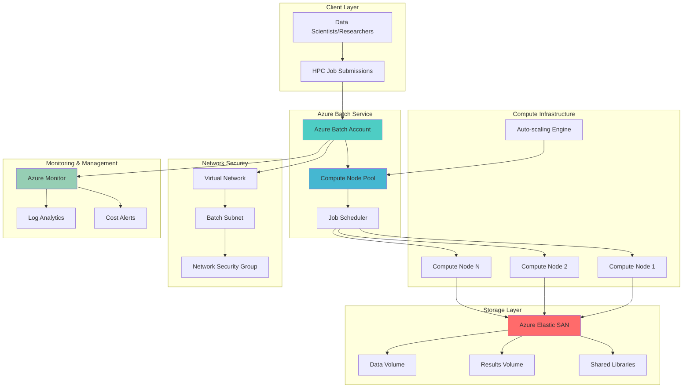

# Scalable HPC Workload Processing with Elastic SAN and Azure Batch

## Problem

Organizations running compute-intensive workloads like financial modeling, scientific simulations, and image processing face significant challenges in achieving optimal performance and cost efficiency. Traditional approaches require substantial upfront investments in hardware infrastructure, complex storage management, and manual scaling operations. These limitations result in underutilized resources during low-demand periods and performance bottlenecks during peak processing times, ultimately impacting time-to-insight and operational costs.

## Solution

This solution combines Azure Elastic SAN's high-performance shared storage with Azure Batch's managed parallel processing capabilities to create a scalable, cost-effective HPC platform. Azure Elastic SAN provides up to 80,000 IOPS and 1,280 MBps throughput per volume, while Azure Batch automatically manages compute node provisioning, job scheduling, and scaling. This architecture enables organizations to process large datasets efficiently while maintaining cost control through consumption-based pricing and automatic resource scaling.

## Architecture Diagram



## Prerequisites

1. Azure subscription with appropriate permissions for creating Elastic SAN, Batch, and networking resources
2. Azure CLI v2.50.0 or later installed and configured (or Azure Cloud Shell)
3. Understanding of high-performance computing concepts and Azure Batch service fundamentals
4. Familiarity with Azure Virtual Networks and storage management
5. Knowledge of parallel processing patterns and job scheduling concepts
6. Estimated cost: $150-300 per day for compute resources, $50-100 per day for storage (varies by workload)

> **Note**: Azure Elastic SAN is available in specific regions. Verify availability in your preferred region before proceeding with the implementation.

## Preparation

Azure Elastic SAN provides cloud-native, high-performance storage with shared access across multiple compute resources. This preparation phase establishes the foundational infrastructure including virtual networks, storage accounts, and security configurations required for the HPC workload orchestration.

```bash
# Generate unique suffix for resource names
RANDOM_SUFFIX=$(openssl rand -hex 3)

# Set environment variables for Azure resources
export RESOURCE_GROUP="rg-hpc-esan-${RANDOM_SUFFIX}"
export LOCATION="eastus"
export SUBSCRIPTION_ID=$(az account show --query id --output tsv)

# Set resource names with consistent naming convention
export ESAN_NAME="esan-hpc-${RANDOM_SUFFIX}"
export BATCH_ACCOUNT="batch-hpc-${RANDOM_SUFFIX}"
export STORAGE_ACCOUNT="sthpc${RANDOM_SUFFIX}"
export VNET_NAME="vnet-hpc-${RANDOM_SUFFIX}"
export SUBNET_NAME="subnet-batch-${RANDOM_SUFFIX}"
export NSG_NAME="nsg-hpc-${RANDOM_SUFFIX}"

# Create resource group with tags for resource management
az group create \
    --name ${RESOURCE_GROUP} \
    --location ${LOCATION} \
    --tags purpose=hpc environment=demo workload=compute-intensive

echo "✅ Resource group created: ${RESOURCE_GROUP}"

# Create storage account for Batch application packages and logs
az storage account create \
    --name ${STORAGE_ACCOUNT} \
    --resource-group ${RESOURCE_GROUP} \
    --location ${LOCATION} \
    --sku Standard_LRS \
    --kind StorageV2 \
    --access-tier Hot \
    --https-only true

echo "✅ Storage account created: ${STORAGE_ACCOUNT}"

# Create containers for scripts and results
az storage container create \
    --name scripts \
    --account-name ${STORAGE_ACCOUNT} \
    --auth-mode login

az storage container create \
    --name results \
    --account-name ${STORAGE_ACCOUNT} \
    --auth-mode login

echo "✅ Storage containers created"
```

## Steps

1. **Create Virtual Network Infrastructure for Secure HPC Communication**:

   Azure Virtual Network provides isolated networking for HPC workloads, ensuring secure communication between compute nodes and storage systems. This network foundation supports the high-bandwidth requirements of HPC applications while maintaining security boundaries through network security groups and subnet isolation.

   ```bash
   # Create virtual network optimized for HPC workloads
   az network vnet create \
       --resource-group ${RESOURCE_GROUP} \
       --name ${VNET_NAME} \
       --address-prefix 10.0.0.0/16 \
       --location ${LOCATION} \
       --tags workload=hpc tier=network

   # Create subnet for Batch compute nodes
   az network vnet subnet create \
       --resource-group ${RESOURCE_GROUP} \
       --vnet-name ${VNET_NAME} \
       --name ${SUBNET_NAME} \
       --address-prefix 10.0.1.0/24

   # Create network security group for HPC traffic
   az network nsg create \
       --resource-group ${RESOURCE_GROUP} \
       --name ${NSG_NAME} \
       --location ${LOCATION}

   # Configure NSG rule for internal HPC communication
   az network nsg rule create \
       --resource-group ${RESOURCE_GROUP} \
       --nsg-name ${NSG_NAME} \
       --name AllowHPCCommunication \
       --protocol Tcp \
       --priority 1000 \
       --source-address-prefix 10.0.0.0/16 \
       --source-port-range '*' \
       --destination-address-prefix 10.0.0.0/16 \
       --destination-port-range 1024-65535 \
       --access Allow \
       --direction Inbound

   # Associate NSG with Batch subnet
   az network vnet subnet update \
       --resource-group ${RESOURCE_GROUP} \
       --vnet-name ${VNET_NAME} \
       --name ${SUBNET_NAME} \
       --network-security-group ${NSG_NAME}

   echo "✅ Virtual network infrastructure configured"
   ```

   The virtual network now provides secure, high-performance networking for HPC workloads. This configuration ensures isolated communication between compute nodes while allowing the high-bandwidth data transfer required for parallel processing tasks.

2. **Deploy Azure Elastic SAN for High-Performance Shared Storage**:

   Azure Elastic SAN delivers enterprise-grade performance with up to 80,000 IOPS per volume and 1,280 MBps throughput, making it ideal for HPC workloads that require shared access to large datasets. The elastic nature allows for dynamic scaling based on workload demands while maintaining consistent performance across all connected compute nodes.

   ```bash
   # Create Azure Elastic SAN instance
   az elastic-san create \
       --resource-group ${RESOURCE_GROUP} \
       --name ${ESAN_NAME} \
       --location ${LOCATION} \
       --base-size-tib 1 \
       --extended-capacity-size-tib 2 \
       --sku "{name:Premium_LRS,tier:Premium}" \
       --tags workload=hpc storage=shared-performance

   # Create volume group for organizing HPC storage
   az elastic-san volume-group create \
       --resource-group ${RESOURCE_GROUP} \
       --elastic-san-name ${ESAN_NAME} \
       --name "hpc-volumes" \
       --protocol-type iSCSI \
       --network-acls "{virtual-network-rules:[{id:/subscriptions/${SUBSCRIPTION_ID}/resourceGroups/${RESOURCE_GROUP}/providers/Microsoft.Network/virtualNetworks/${VNET_NAME}/subnets/${SUBNET_NAME},action:Allow}]}"

   # Create data input volume for HPC workloads
   az elastic-san volume create \
       --resource-group ${RESOURCE_GROUP} \
       --elastic-san-name ${ESAN_NAME} \
       --volume-group-name "hpc-volumes" \
       --name "data-input" \
       --size-gib 500 \
       --tags purpose=input-data workload=hpc

   # Create results output volume
   az elastic-san volume create \
       --resource-group ${RESOURCE_GROUP} \
       --elastic-san-name ${ESAN_NAME} \
       --volume-group-name "hpc-volumes" \
       --name "results-output" \
       --size-gib 1000 \
       --tags purpose=output-data workload=hpc

   # Create shared libraries volume
   az elastic-san volume create \
       --resource-group ${RESOURCE_GROUP} \
       --elastic-san-name ${ESAN_NAME} \
       --volume-group-name "hpc-volumes" \
       --name "shared-libraries" \
       --size-gib 100 \
       --tags purpose=shared-libs workload=hpc

   echo "✅ Azure Elastic SAN configured with high-performance volumes"
   ```

   The Elastic SAN now provides three optimized storage volumes for HPC workloads: input data storage, results collection, and shared application libraries. This configuration ensures consistent, high-performance access across all compute nodes while supporting the parallel I/O patterns typical of HPC applications.

3. **Create Azure Batch Account and Configure HPC Pool**:

   Azure Batch automates the deployment and management of compute nodes for parallel processing workloads. The service handles job scheduling, node provisioning, and auto-scaling, eliminating the complexity of manual cluster management while optimizing resource utilization for cost-effective HPC operations.

   ```bash
   # Create Azure Batch account
   az batch account create \
       --resource-group ${RESOURCE_GROUP} \
       --name ${BATCH_ACCOUNT} \
       --location ${LOCATION} \
       --storage-account ${STORAGE_ACCOUNT} \
       --tags workload=hpc service=batch

   # Log in to Batch account
   az batch account login \
       --resource-group ${RESOURCE_GROUP} \
       --name ${BATCH_ACCOUNT}

   # Create pool configuration file with advanced settings
   cat > batch-pool-config.json << EOF
   {
       "id": "hpc-compute-pool",
       "vmSize": "Standard_HC44rs",
       "virtualMachineConfiguration": {
           "imageReference": {
               "publisher": "canonical",
               "offer": "0001-com-ubuntu-server-focal",
               "sku": "20_04-lts",
               "version": "latest"
           },
           "nodeAgentSkuId": "batch.node.ubuntu 20.04"
       },
       "targetDedicatedNodes": 2,
       "maxTasksPerNode": 1,
       "enableInterNodeCommunication": true,
       "networkConfiguration": {
           "subnetId": "/subscriptions/${SUBSCRIPTION_ID}/resourceGroups/${RESOURCE_GROUP}/providers/Microsoft.Network/virtualNetworks/${VNET_NAME}/subnets/${SUBNET_NAME}"
       },
       "startTask": {
           "commandLine": "apt-get update && apt-get install -y open-iscsi multipath-tools python3-numpy",
           "waitForSuccess": true,
           "userIdentity": {
               "autoUser": {
                   "scope": "pool",
                   "elevationLevel": "admin"
               }
           }
       },
       "userAccounts": [
           {
               "name": "hpcuser",
               "password": "HPC@Pass123!",
               "elevationLevel": "admin"
           }
       ]
   }
   EOF

   # Apply pool configuration
   az batch pool create --json-file batch-pool-config.json

   echo "✅ Azure Batch account and HPC pool configured"
   ```

   The Batch service now provides a managed HPC compute pool with high-performance computing VM instances. The pool configuration includes iSCSI support for Elastic SAN connectivity, Python NumPy for scientific computing, and inter-node communication for tightly coupled parallel workloads.

4. **Configure iSCSI Connectivity Between Compute Nodes and Elastic SAN**:

   iSCSI (Internet Small Computer Systems Interface) provides block-level access to Elastic SAN volumes, enabling compute nodes to mount shared storage as local drives. This configuration ensures high-throughput, low-latency access to shared datasets while maintaining data consistency across the HPC cluster.

   ```bash
   # Get Elastic SAN volume iSCSI targets
   VOLUME_DATA=$(az elastic-san volume show \
       --resource-group ${RESOURCE_GROUP} \
       --elastic-san-name ${ESAN_NAME} \
       --volume-group-name "hpc-volumes" \
       --name "data-input" \
       --query "storageTarget.targetIqn" --output tsv)

   VOLUME_RESULTS=$(az elastic-san volume show \
       --resource-group ${RESOURCE_GROUP} \
       --elastic-san-name ${ESAN_NAME} \
       --volume-group-name "hpc-volumes" \
       --name "results-output" \
       --query "storageTarget.targetIqn" --output tsv)

   VOLUME_LIBRARIES=$(az elastic-san volume show \
       --resource-group ${RESOURCE_GROUP} \
       --elastic-san-name ${ESAN_NAME} \
       --volume-group-name "hpc-volumes" \
       --name "shared-libraries" \
       --query "storageTarget.targetIqn" --output tsv)

   # Get Elastic SAN portal endpoint
   ESAN_PORTAL=$(az elastic-san volume-group show \
       --resource-group ${RESOURCE_GROUP} \
       --elastic-san-name ${ESAN_NAME} \
       --name "hpc-volumes" \
       --query "storageTargets[0].targetPortalHostname" --output tsv)

   # Create iSCSI mount script for compute nodes
   cat > mount-elastic-san.sh << 'EOF'
   #!/bin/bash
   # iSCSI configuration for Azure Elastic SAN
   
   # Install iSCSI initiator and wait for completion
   sudo apt-get update
   sudo apt-get install -y open-iscsi multipath-tools
   
   # Configure iSCSI initiator
   sudo systemctl enable iscsid
   sudo systemctl start iscsid
   
   # Discover and login to Elastic SAN volumes
   sudo iscsiadm -m discovery -t st -p ${ESAN_PORTAL}:3260
   sudo iscsiadm -m node --login
   
   # Wait for devices to be available
   sleep 10
   
   # Create mount points
   sudo mkdir -p /mnt/hpc-data
   sudo mkdir -p /mnt/hpc-results
   sudo mkdir -p /mnt/hpc-libraries
   
   # Format and mount volumes (check device paths first)
   DEVICES=$(lsblk -nd --output NAME | grep -E "^sd[b-z]$")
   DEVICE_ARRAY=($DEVICES)
   
   if [ ${#DEVICE_ARRAY[@]} -ge 3 ]; then
       sudo mkfs.ext4 /dev/${DEVICE_ARRAY[0]} -F
       sudo mkfs.ext4 /dev/${DEVICE_ARRAY[1]} -F
       sudo mkfs.ext4 /dev/${DEVICE_ARRAY[2]} -F
       
       sudo mount /dev/${DEVICE_ARRAY[0]} /mnt/hpc-data
       sudo mount /dev/${DEVICE_ARRAY[1]} /mnt/hpc-results
       sudo mount /dev/${DEVICE_ARRAY[2]} /mnt/hpc-libraries
       
       # Configure automatic mounting
       echo "/dev/${DEVICE_ARRAY[0]} /mnt/hpc-data ext4 defaults,_netdev 0 0" | sudo tee -a /etc/fstab
       echo "/dev/${DEVICE_ARRAY[1]} /mnt/hpc-results ext4 defaults,_netdev 0 0" | sudo tee -a /etc/fstab
       echo "/dev/${DEVICE_ARRAY[2]} /mnt/hpc-libraries ext4 defaults,_netdev 0 0" | sudo tee -a /etc/fstab
       
       # Set permissions for HPC user
       sudo chown -R hpcuser:hpcuser /mnt/hpc-*
       sudo chmod -R 755 /mnt/hpc-*
   else
       echo "Insufficient block devices found for mounting"
       exit 1
   fi
   EOF

   # Upload mount script to storage account
   az storage blob upload \
       --account-name ${STORAGE_ACCOUNT} \
       --container-name scripts \
       --name mount-elastic-san.sh \
       --file mount-elastic-san.sh \
       --overwrite \
       --auth-mode login

   echo "✅ iSCSI connectivity configured for Elastic SAN volumes"
   ```

   The compute nodes can now access Elastic SAN volumes as high-performance shared storage. This configuration provides the foundation for HPC workloads that require shared access to large datasets while maintaining data consistency and optimal I/O performance.

5. **Create and Submit HPC Job for Parallel Processing**:

   Azure Batch job orchestration enables efficient distribution of compute-intensive tasks across multiple nodes. This step demonstrates creating a parallel processing job that leverages the shared storage and compute infrastructure for scientific computing, financial modeling, or data analysis workloads.

   ```bash
   # Create sample HPC workload script
   cat > hpc-workload.py << 'EOF'
   #!/usr/bin/env python3
   import os
   import sys
   import time
   import json
   import numpy as np
   from datetime import datetime
   
   def process_data_chunk(chunk_id, data_size=1000000):
       """Simulate compute-intensive data processing"""
       print(f"Processing chunk {chunk_id} with {data_size} elements")
       
       # Generate synthetic data
       data = np.random.rand(data_size)
       
       # Simulate computation (matrix operations)
       result = np.fft.fft(data)
       processed_data = np.abs(result)
       
       # Calculate statistics
       stats = {
           'chunk_id': chunk_id,
           'mean': float(np.mean(processed_data)),
           'std': float(np.std(processed_data)),
           'min': float(np.min(processed_data)),
           'max': float(np.max(processed_data)),
           'processing_time': time.time(),
           'hostname': os.uname().nodename
       }
       
       return stats
   
   def main():
       chunk_id = int(sys.argv[1]) if len(sys.argv) > 1 else 0
       
       # Process data chunk
       start_time = time.time()
       result = process_data_chunk(chunk_id)
       end_time = time.time()
       
       result['processing_duration'] = end_time - start_time
       
       # Write results to shared storage (fallback to local if mount failed)
       output_dirs = ["/mnt/hpc-results", "/tmp"]
       output_file = None
       
       for output_dir in output_dirs:
           try:
               if os.path.exists(output_dir) and os.access(output_dir, os.W_OK):
                   output_file = f"{output_dir}/chunk_{chunk_id}_results.json"
                   break
           except:
               continue
       
       if output_file:
           with open(output_file, 'w') as f:
               json.dump(result, f, indent=2)
           print(f"Chunk {chunk_id} completed in {result['processing_duration']:.2f} seconds")
           print(f"Results saved to: {output_file}")
       else:
           print(f"Could not save results for chunk {chunk_id}")
           print(json.dumps(result, indent=2))
   
   if __name__ == "__main__":
       main()
   EOF

   # Upload HPC workload script
   az storage blob upload \
       --account-name ${STORAGE_ACCOUNT} \
       --container-name scripts \
       --name hpc-workload.py \
       --file hpc-workload.py \
       --overwrite \
       --auth-mode login

   # Create Batch job for HPC workload
   az batch job create \
       --id "hpc-parallel-job" \
       --pool-id "hpc-compute-pool"

   # Get storage account connection string for resource files
   STORAGE_CONNECTION=$(az storage account show-connection-string \
       --resource-group ${RESOURCE_GROUP} \
       --name ${STORAGE_ACCOUNT} \
       --query connectionString --output tsv)

   # Create multiple parallel tasks
   for i in {1..8}; do
       az batch task create \
           --job-id "hpc-parallel-job" \
           --task-id "task-${i}" \
           --command-line "/bin/bash -c 'wget https://${STORAGE_ACCOUNT}.blob.core.windows.net/scripts/mount-elastic-san.sh -O mount-elastic-san.sh && chmod +x mount-elastic-san.sh && ./mount-elastic-san.sh; wget https://${STORAGE_ACCOUNT}.blob.core.windows.net/scripts/hpc-workload.py -O hpc-workload.py && python3 hpc-workload.py ${i}'"
   done

   echo "✅ HPC parallel processing job submitted"
   ```

   The HPC job is now running across multiple compute nodes with shared access to Elastic SAN storage. Each task processes a data chunk independently while storing results in the shared results volume, demonstrating the scalability and performance benefits of the integrated solution.

6. **Configure Auto-Scaling for Dynamic Resource Management**:

   Azure Batch auto-scaling automatically adjusts compute resources based on workload demand, optimizing cost efficiency while maintaining performance. This configuration ensures that the HPC environment scales up during peak processing periods and scales down during idle times, providing optimal resource utilization.

   ```bash
   # Create auto-scaling formula for HPC workloads
   cat > autoscale-formula.txt << 'EOF'
   // Auto-scaling formula for HPC workloads
   startingNumberOfVMs = 1;
   maxNumberofVMs = 20;
   pendingTaskSamplePercent = $PendingTasks.GetSamplePercent(180 * TimeInterval_Second);
   pendingTaskSamples = pendingTaskSamplePercent < 70 ? startingNumberOfVMs : 
                       avg($PendingTasks.GetSample(180 * TimeInterval_Second));
   
   // Scale up aggressively when tasks are pending
   $TargetDedicatedNodes = min(maxNumberofVMs, pendingTaskSamples);
   
   // Scale down gradually when no tasks are pending
   $NodeDeallocationOption = taskcompletion;
   EOF

   # Enable auto-scaling on the HPC pool
   az batch pool autoscale enable \
       --pool-id "hpc-compute-pool" \
       --auto-scale-formula "$(cat autoscale-formula.txt)"

   # Evaluate auto-scaling formula
   az batch pool autoscale evaluate \
       --pool-id "hpc-compute-pool" \
       --auto-scale-formula "$(cat autoscale-formula.txt)"

   echo "✅ Auto-scaling configured for dynamic resource management"
   ```

   The auto-scaling configuration now dynamically adjusts the number of compute nodes based on workload demand. This ensures cost-effective resource utilization while maintaining the performance required for HPC workloads.

7. **Set Up Monitoring and Performance Analytics**:

   Azure Monitor provides comprehensive observability for HPC workloads, enabling performance tracking, cost optimization, and proactive issue resolution. This monitoring configuration captures key metrics from both the compute and storage layers, providing insights into workload performance and resource utilization patterns.

   ```bash
   # Create Log Analytics workspace for HPC monitoring
   az monitor log-analytics workspace create \
       --resource-group ${RESOURCE_GROUP} \
       --workspace-name "law-hpc-${RANDOM_SUFFIX}" \
       --location ${LOCATION} \
       --sku PerGB2018

   # Get workspace ID for diagnostic settings
   WORKSPACE_ID=$(az monitor log-analytics workspace show \
       --resource-group ${RESOURCE_GROUP} \
       --workspace-name "law-hpc-${RANDOM_SUFFIX}" \
       --query id --output tsv)

   # Configure diagnostic settings for Batch account
   az monitor diagnostic-settings create \
       --resource "/subscriptions/${SUBSCRIPTION_ID}/resourceGroups/${RESOURCE_GROUP}/providers/Microsoft.Batch/batchAccounts/${BATCH_ACCOUNT}" \
       --name "batch-diagnostics" \
       --workspace ${WORKSPACE_ID} \
       --logs '[{"category":"ServiceLog","enabled":true,"retentionPolicy":{"days":30,"enabled":true}}]' \
       --metrics '[{"category":"AllMetrics","enabled":true,"retentionPolicy":{"days":30,"enabled":true}}]'

   # Create performance monitoring alerts
   az monitor metrics alert create \
       --resource-group ${RESOURCE_GROUP} \
       --name "hpc-high-cpu-usage" \
       --scopes "/subscriptions/${SUBSCRIPTION_ID}/resourceGroups/${RESOURCE_GROUP}/providers/Microsoft.Batch/batchAccounts/${BATCH_ACCOUNT}" \
       --condition "avg Microsoft.Batch/batchAccounts/Pool/CoreCount > 80" \
       --window-size 5m \
       --evaluation-frequency 1m \
       --severity 2 \
       --description "HPC pool core count is above 80"

   # Create cost monitoring alert for node count
   az monitor metrics alert create \
       --resource-group ${RESOURCE_GROUP} \
       --name "hpc-cost-threshold" \
       --scopes "/subscriptions/${SUBSCRIPTION_ID}/resourceGroups/${RESOURCE_GROUP}/providers/Microsoft.Batch/batchAccounts/${BATCH_ACCOUNT}" \
       --condition "avg Microsoft.Batch/batchAccounts/Pool/DedicatedNodeCount > 10" \
       --window-size 15m \
       --evaluation-frequency 5m \
       --severity 1 \
       --description "HPC pool node count exceeds cost threshold"

   echo "✅ Monitoring and performance analytics configured"
   ```

   The monitoring infrastructure now provides comprehensive visibility into HPC workload performance, resource utilization, and cost metrics. This enables proactive optimization and ensures optimal performance while maintaining cost control.

## Validation & Testing

1. **Verify Elastic SAN Performance and Connectivity**:

   ```bash
   # Check Elastic SAN status and performance metrics
   az elastic-san show \
       --resource-group ${RESOURCE_GROUP} \
       --name ${ESAN_NAME} \
       --query "{name:name,provisioningState:provisioningState,totalIops:totalIops,totalMBps:totalMBps}" \
       --output table

   # Validate volume group configuration
   az elastic-san volume-group show \
       --resource-group ${RESOURCE_GROUP} \
       --elastic-san-name ${ESAN_NAME} \
       --name "hpc-volumes" \
       --query "{name:name,provisioningState:provisioningState,protocolType:protocolType}" \
       --output table
   ```

   Expected output: Elastic SAN should show "Succeeded" provisioning state with expected IOPS and throughput values.

2. **Test Azure Batch Pool and Job Execution**:

   ```bash
   # Check Batch pool status
   az batch pool show \
       --pool-id "hpc-compute-pool" \
       --query "{poolId:id,state:state,allocationState:allocationState,currentDedicatedNodes:currentDedicatedNodes,targetDedicatedNodes:targetDedicatedNodes}" \
       --output table

   # Monitor job execution progress
   az batch job show \
       --job-id "hpc-parallel-job" \
       --query "{jobId:id,state:state,executionInfo:executionInfo}" \
       --output table

   # Check task completion status
   az batch task list \
       --job-id "hpc-parallel-job" \
       --query "[].{taskId:id,state:state,exitCode:executionInfo.exitCode}" \
       --output table
   ```

   Expected output: Pool should show "steady" state with allocated nodes, and tasks should complete with exit code 0.

3. **Validate Storage Performance and Data Processing**:

   ```bash
   # Check for generated result files in Elastic SAN
   # Note: Results should be in the mounted volumes on compute nodes
   # This checks the fallback location in blob storage
   az storage blob list \
       --account-name ${STORAGE_ACCOUNT} \
       --container-name results \
       --query "[].{name:name,lastModified:properties.lastModified,size:properties.contentLength}" \
       --output table \
       --auth-mode login

   # Verify monitoring data collection
   az monitor metrics list \
       --resource "/subscriptions/${SUBSCRIPTION_ID}/resourceGroups/${RESOURCE_GROUP}/providers/Microsoft.Batch/batchAccounts/${BATCH_ACCOUNT}" \
       --metric "Microsoft.Batch/batchAccounts/Pool/CoreCount" \
       --interval PT1M \
       --start-time $(date -u -d '1 hour ago' +%Y-%m-%dT%H:%M:%S) \
       --query "value[0].timeseries[0].data[0:5]" \
       --output table
   ```

   Expected output: Result files should be present (either in mounted volumes or fallback location), and monitoring data should show core count metrics.

## Cleanup

1. **Remove Batch resources and compute pools**:

   ```bash
   # Delete Batch job and tasks
   az batch job delete \
       --job-id "hpc-parallel-job" \
       --yes

   # Delete Batch pool
   az batch pool delete \
       --pool-id "hpc-compute-pool" \
       --yes

   echo "✅ Batch resources deleted"
   ```

2. **Remove Azure Elastic SAN volumes and storage**:

   ```bash
   # Delete Elastic SAN volumes
   az elastic-san volume delete \
       --resource-group ${RESOURCE_GROUP} \
       --elastic-san-name ${ESAN_NAME} \
       --volume-group-name "hpc-volumes" \
       --name "data-input" \
       --yes

   az elastic-san volume delete \
       --resource-group ${RESOURCE_GROUP} \
       --elastic-san-name ${ESAN_NAME} \
       --volume-group-name "hpc-volumes" \
       --name "results-output" \
       --yes

   az elastic-san volume delete \
       --resource-group ${RESOURCE_GROUP} \
       --elastic-san-name ${ESAN_NAME} \
       --volume-group-name "hpc-volumes" \
       --name "shared-libraries" \
       --yes

   # Delete volume group
   az elastic-san volume-group delete \
       --resource-group ${RESOURCE_GROUP} \
       --elastic-san-name ${ESAN_NAME} \
       --name "hpc-volumes" \
       --yes

   # Delete Elastic SAN
   az elastic-san delete \
       --resource-group ${RESOURCE_GROUP} \
       --name ${ESAN_NAME} \
       --yes

   echo "✅ Elastic SAN resources deleted"
   ```

3. **Remove supporting infrastructure**:

   ```bash
   # Delete Batch account
   az batch account delete \
       --resource-group ${RESOURCE_GROUP} \
       --name ${BATCH_ACCOUNT} \
       --yes

   # Delete storage account
   az storage account delete \
       --resource-group ${RESOURCE_GROUP} \
       --name ${STORAGE_ACCOUNT} \
       --yes

   echo "✅ Supporting infrastructure deleted"
   ```

4. **Remove resource group and all remaining resources**:

   ```bash
   # Delete resource group and all contained resources
   az group delete \
       --name ${RESOURCE_GROUP} \
       --yes \
       --no-wait

   echo "✅ Resource group deletion initiated: ${RESOURCE_GROUP}"
   echo "Note: Deletion may take several minutes to complete"

   # Verify deletion (optional)
   az group exists --name ${RESOURCE_GROUP}
   ```

## Discussion

The integration of Azure Elastic SAN with Azure Batch creates a powerful platform for high-performance computing workloads that combines the benefits of managed compute orchestration with enterprise-grade shared storage. Azure Elastic SAN's ability to deliver up to 80,000 IOPS and 1,280 MBps per volume, combined with Azure Batch's automatic scaling and job management, provides an optimal foundation for compute-intensive applications such as financial risk modeling, scientific simulations, and large-scale data processing. This architecture follows the [Azure Well-Architected Framework](https://learn.microsoft.com/en-us/azure/architecture/framework/) principles by emphasizing performance efficiency, cost optimization, and operational excellence.

The shared storage architecture enabled by Azure Elastic SAN addresses one of the key challenges in HPC environments: providing consistent, high-performance access to large datasets across multiple compute nodes. Traditional approaches often require complex distributed file systems or expensive parallel storage solutions. Azure Elastic SAN simplifies this by providing block-level storage that can be accessed simultaneously by multiple compute nodes through iSCSI, eliminating the need for data replication and reducing storage costs. For detailed technical specifications, refer to the [Azure Elastic SAN documentation](https://learn.microsoft.com/en-us/azure/storage/elastic-san/elastic-san-introduction).

From a cost optimization perspective, the consumption-based pricing model of Azure Batch, combined with the auto-scaling capabilities, ensures that organizations only pay for the compute resources they actually use. The auto-scaling formula can be customized to match specific workload patterns, whether they require rapid scale-up for time-sensitive computations or gradual scaling for long-running simulations. Azure Batch's support for Azure Spot VMs can further reduce costs by up to 90% for fault-tolerant workloads, as described in the [Azure Batch pricing documentation](https://azure.microsoft.com/en-us/pricing/details/batch/).

The monitoring and observability features provided by Azure Monitor enable organizations to gain deep insights into workload performance, resource utilization, and cost patterns. This visibility is crucial for optimizing both performance and costs in HPC environments. The integration with Azure Monitor allows for proactive alerting on resource thresholds, performance degradation, and cost anomalies, enabling teams to maintain optimal performance while controlling expenses. For comprehensive monitoring strategies, review the [Azure Monitor documentation](https://learn.microsoft.com/en-us/azure/azure-monitor/) and the [Azure Batch monitoring guide](https://learn.microsoft.com/en-us/azure/batch/monitoring-overview).

> **Tip**: Leverage Azure Batch's task dependencies and job scheduling features to create complex workflows that can automatically handle data preprocessing, parallel computation, and result aggregation. This approach maximizes resource utilization while ensuring data consistency across the HPC pipeline.

## Challenge

Extend this HPC solution by implementing these advanced capabilities:

1. **Implement multi-region disaster recovery** by deploying a secondary HPC environment in another Azure region with cross-region replication of critical datasets and automated failover capabilities using Azure Traffic Manager and Azure Site Recovery.

2. **Add GPU acceleration support** by configuring Azure Batch pools with GPU-enabled VM sizes (such as NC or ND series) and integrating CUDA or OpenCL libraries for compute-intensive tasks like machine learning training or scientific simulations.

3. **Integrate with Azure Machine Learning** to create an end-to-end ML pipeline that uses the HPC infrastructure for distributed training, hyperparameter tuning, and model evaluation while leveraging Azure ML's experiment tracking and model management capabilities.

4. **Implement advanced security controls** by adding Azure Key Vault integration for secrets management, Azure Active Directory authentication for job submission, and customer-managed encryption keys for both compute and storage resources.

5. **Create a cost optimization dashboard** using Azure Cost Management APIs and Power BI to track resource usage patterns, predict monthly costs, and identify optimization opportunities across the HPC infrastructure.

## Infrastructure Code

*Infrastructure code will be generated after recipe approval.*