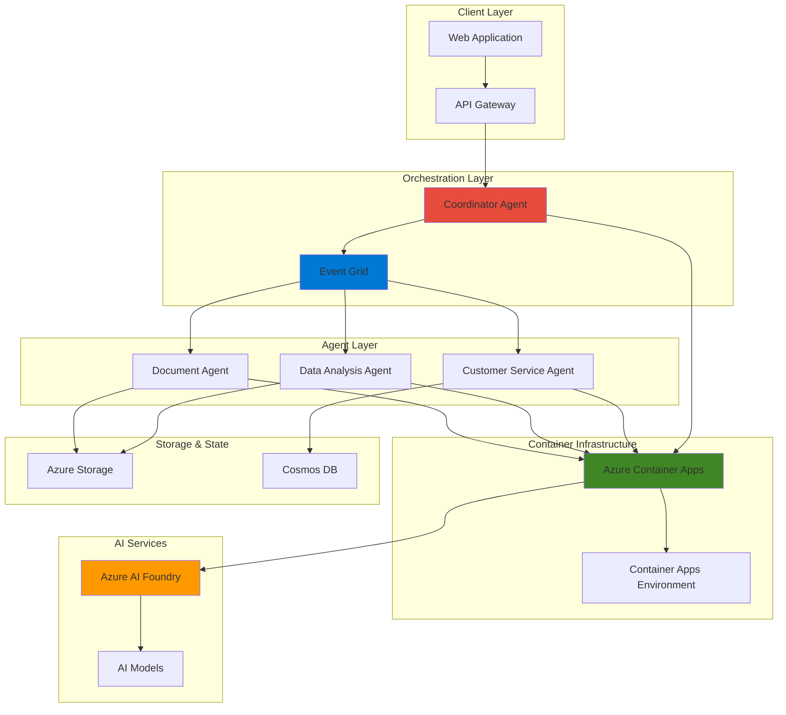

# Scalable Multi-Agent AI Orchestration Platform

## Problem

Organizations struggle to implement complex business process automation that requires multiple specialized AI agents working together. Traditional monolithic AI solutions lack the flexibility to handle diverse tasks like document processing, data analysis, and customer service simultaneously. Without proper orchestration, these systems become difficult to scale, maintain, and adapt to changing business requirements, leading to inefficient resource utilization and poor user experiences.

## Solution

Build a production-ready multi-agent AI system using Azure AI Foundry to create specialized intelligent agents, deploy them as scalable containerized workloads with Azure Container Apps, and enable real-time coordination through Azure Event Grid. This architecture provides elastic scaling, fault tolerance, and seamless integration capabilities for complex business automation workflows.

## Architecture Diagram



## Prerequisites

1. Azure subscription with appropriate permissions for AI services, Container Apps, and Event Grid
2. Azure CLI v2.60.0 or later installed and configured
3. Docker installed locally for container image building
4. Basic knowledge of containerization, event-driven architecture, and AI concepts
5. Understanding of Azure Resource Manager templates and microservices patterns
6. Estimated cost: $50-100/day for development and testing workloads

> **Note**: This recipe uses Azure AI Foundry, which is currently in General Availability. Review the [Azure AI Foundry pricing page](https://azure.microsoft.com/pricing/details/cognitive-services/) for detailed cost information.

## Preparation

```bash
# Set environment variables for Azure resources
export RESOURCE_GROUP="rg-multiagent-orchestration-${RANDOM_SUFFIX}"
export LOCATION="eastus"
export SUBSCRIPTION_ID=$(az account show --query id --output tsv)

# Generate unique suffix for resource names
RANDOM_SUFFIX=$(openssl rand -hex 3)
export CONTAINER_ENVIRONMENT="cae-agents-${RANDOM_SUFFIX}"
export AI_FOUNDRY_RESOURCE="aif-orchestration-${RANDOM_SUFFIX}"
export STORAGE_ACCOUNT="stagentstg${RANDOM_SUFFIX}"
export EVENT_GRID_TOPIC="egt-agent-events-${RANDOM_SUFFIX}"
export COSMOS_ACCOUNT="cosmos-agents-${RANDOM_SUFFIX}"

# Create resource group
az group create \
    --name ${RESOURCE_GROUP} \
    --location ${LOCATION} \
    --tags purpose=multi-agent-orchestration environment=demo

echo "✅ Resource group created: ${RESOURCE_GROUP}"

# Create Azure AI Foundry resource
az cognitiveservices account create \
    --name ${AI_FOUNDRY_RESOURCE} \
    --resource-group ${RESOURCE_GROUP} \
    --kind AIServices \
    --sku S0 \
    --location ${LOCATION} \
    --yes

echo "✅ Azure AI Foundry resource created: ${AI_FOUNDRY_RESOURCE}"

# Create storage account for agent data
az storage account create \
    --name ${STORAGE_ACCOUNT} \
    --resource-group ${RESOURCE_GROUP} \
    --location ${LOCATION} \
    --sku Standard_LRS \
    --kind StorageV2

echo "✅ Storage account created: ${STORAGE_ACCOUNT}"

# Create Cosmos DB account for agent state management
az cosmosdb create \
    --name ${COSMOS_ACCOUNT} \
    --resource-group ${RESOURCE_GROUP} \
    --location ${LOCATION} \
    --kind GlobalDocumentDB \
    --enable-automatic-failover true

echo "✅ Cosmos DB account created: ${COSMOS_ACCOUNT}"

# Get connection strings for later use
export STORAGE_CONNECTION_STRING=$(az storage account show-connection-string \
    --name ${STORAGE_ACCOUNT} \
    --resource-group ${RESOURCE_GROUP} \
    --query connectionString --output tsv)

export COSMOS_CONNECTION_STRING=$(az cosmosdb keys list \
    --name ${COSMOS_ACCOUNT} \
    --resource-group ${RESOURCE_GROUP} \
    --type connection-strings \
    --query "connectionStrings[0].connectionString" --output tsv)

export AI_FOUNDRY_ENDPOINT=$(az cognitiveservices account show \
    --name ${AI_FOUNDRY_RESOURCE} \
    --resource-group ${RESOURCE_GROUP} \
    --query properties.endpoint --output tsv)

export AI_FOUNDRY_KEY=$(az cognitiveservices account keys list \
    --name ${AI_FOUNDRY_RESOURCE} \
    --resource-group ${RESOURCE_GROUP} \
    --query key1 --output tsv)
```

## Steps

1. **Create Container Apps Environment**:

   Azure Container Apps Environment provides the foundational infrastructure for running containerized AI agents with built-in scaling, networking, and observability. This managed environment eliminates the complexity of Kubernetes cluster management while providing enterprise-grade security and compliance features essential for production AI workloads.

   ```bash
   # Create Container Apps environment with Log Analytics workspace
   az monitor log-analytics workspace create \
       --workspace-name "law-agents-${RANDOM_SUFFIX}" \
       --resource-group ${RESOURCE_GROUP} \
       --location ${LOCATION}
   
   export LOG_ANALYTICS_WORKSPACE_ID=$(az monitor log-analytics workspace show \
       --workspace-name "law-agents-${RANDOM_SUFFIX}" \
       --resource-group ${RESOURCE_GROUP} \
       --query customerId --output tsv)
   
   export LOG_ANALYTICS_KEY=$(az monitor log-analytics workspace get-shared-keys \
       --workspace-name "law-agents-${RANDOM_SUFFIX}" \
       --resource-group ${RESOURCE_GROUP} \
       --query primarySharedKey --output tsv)
   
   # Create Container Apps environment
   az containerapp env create \
       --name ${CONTAINER_ENVIRONMENT} \
       --resource-group ${RESOURCE_GROUP} \
       --location ${LOCATION} \
       --logs-workspace-id ${LOG_ANALYTICS_WORKSPACE_ID} \
       --logs-workspace-key ${LOG_ANALYTICS_KEY}
   
   echo "✅ Container Apps environment created with monitoring"
   ```

   The Container Apps environment now provides the scalable, serverless infrastructure for hosting AI agents. This setup enables automatic scaling based on workload demands and integrates seamlessly with Azure's monitoring and logging services through Log Analytics.

2. **Create Event Grid Topic for Agent Communication**:

   Azure Event Grid enables real-time, event-driven communication between AI agents using a publish-subscribe pattern. This decoupled architecture allows agents to react to events asynchronously, improving system resilience and enabling complex workflow orchestration without tight coupling between components.

   ```bash
   # Create Event Grid topic
   az eventgrid topic create \
       --name ${EVENT_GRID_TOPIC} \
       --resource-group ${RESOURCE_GROUP} \
       --location ${LOCATION} \
       --input-schema EventGridSchema
   
   # Get Event Grid endpoint and key
   export EVENT_GRID_ENDPOINT=$(az eventgrid topic show \
       --name ${EVENT_GRID_TOPIC} \
       --resource-group ${RESOURCE_GROUP} \
       --query endpoint --output tsv)
   
   export EVENT_GRID_KEY=$(az eventgrid topic key list \
       --name ${EVENT_GRID_TOPIC} \
       --resource-group ${RESOURCE_GROUP} \
       --query key1 --output tsv)
   
   echo "✅ Event Grid topic created: ${EVENT_GRID_TOPIC}"
   echo "Endpoint: ${EVENT_GRID_ENDPOINT}"
   ```

   The Event Grid topic establishes the communication backbone for multi-agent orchestration. This enables agents to publish events about task completion, errors, or status changes, while other agents can subscribe to relevant events for coordinated workflow execution.

3. **Deploy GPT-4 Model for AI Foundry**:

   Azure AI Foundry provides access to advanced language models through managed deployments. Creating a GPT-4 deployment ensures that all agents have access to powerful natural language processing capabilities for their specific tasks, from document analysis to customer service interactions.

   ```bash
   # Deploy GPT-4 model for general agent tasks
   az cognitiveservices account deployment create \
       --name ${AI_FOUNDRY_RESOURCE} \
       --resource-group ${RESOURCE_GROUP} \
       --deployment-name "gpt-4-deployment" \
       --model-name "gpt-4" \
       --model-version "0613" \
       --model-format "OpenAI" \
       --sku-capacity 10 \
       --sku-name "Standard"
   
   echo "✅ GPT-4 model deployed to AI Foundry resource"
   ```

   The GPT-4 model deployment provides the cognitive capabilities for each agent. This centralized approach ensures consistent access to AI models while enabling fine-grained control over resource allocation and usage monitoring across all agents.

4. **Create Coordinator Agent Container App**:

   The Coordinator Agent serves as the central orchestrator for multi-agent workflows, making decisions about task routing, monitoring agent health, and managing complex business processes. Deploying it as a Container App ensures high availability and automatic scaling based on workload demands.

   ```bash
   # Create coordinator agent container app
   az containerapp create \
       --name "coordinator-agent" \
       --resource-group ${RESOURCE_GROUP} \
       --environment ${CONTAINER_ENVIRONMENT} \
       --image "mcr.microsoft.com/azuredocs/containerapps-helloworld:latest" \
       --target-port 8080 \
       --ingress external \
       --min-replicas 1 \
       --max-replicas 5 \
       --cpu 1.0 \
       --memory 2.0Gi \
       --env-vars \
           "AI_FOUNDRY_ENDPOINT=${AI_FOUNDRY_ENDPOINT}" \
           "AI_FOUNDRY_KEY=${AI_FOUNDRY_KEY}" \
           "EVENT_GRID_ENDPOINT=${EVENT_GRID_ENDPOINT}" \
           "EVENT_GRID_KEY=${EVENT_GRID_KEY}" \
           "COSMOS_CONNECTION_STRING=${COSMOS_CONNECTION_STRING}"
   
   echo "✅ Coordinator agent container app created"
   ```

   The Coordinator Agent is now running as a scalable container app with automatic scaling based on HTTP request volume. This agent will receive workflow requests and orchestrate the execution across specialized agents based on business logic and available resources.

5. **Deploy Document Processing Agent**:

   The Document Processing Agent specializes in handling document analysis, OCR, and content extraction tasks. This agent leverages Azure AI Document Intelligence services and maintains its own container instance for isolated processing of sensitive documents while integrating with the overall orchestration system.

   ```bash
   # Create document processing agent
   az containerapp create \
       --name "document-agent" \
       --resource-group ${RESOURCE_GROUP} \
       --environment ${CONTAINER_ENVIRONMENT} \
       --image "mcr.microsoft.com/azuredocs/containerapps-helloworld:latest" \
       --target-port 8080 \
       --ingress internal \
       --min-replicas 0 \
       --max-replicas 10 \
       --cpu 2.0 \
       --memory 4.0Gi \
       --env-vars \
           "AI_FOUNDRY_ENDPOINT=${AI_FOUNDRY_ENDPOINT}" \
           "AI_FOUNDRY_KEY=${AI_FOUNDRY_KEY}" \
           "STORAGE_CONNECTION_STRING=${STORAGE_CONNECTION_STRING}" \
           "EVENT_GRID_ENDPOINT=${EVENT_GRID_ENDPOINT}" \
           "EVENT_GRID_KEY=${EVENT_GRID_KEY}"
   
   # Configure Event Grid subscription for document events
   az eventgrid event-subscription create \
       --name "document-agent-subscription" \
       --source-resource-id "/subscriptions/${SUBSCRIPTION_ID}/resourceGroups/${RESOURCE_GROUP}/providers/Microsoft.EventGrid/topics/${EVENT_GRID_TOPIC}" \
       --endpoint-type "webhook" \
       --endpoint "https://document-agent.${CONTAINER_ENVIRONMENT}.azurecontainerapps.io/api/events" \
       --included-event-types "DocumentProcessing.Requested"
   
   echo "✅ Document processing agent deployed with Event Grid integration"
   ```

   The Document Processing Agent is now configured to automatically scale from zero to handle document processing requests. Event Grid integration ensures that the agent responds immediately to document processing events while maintaining cost-effective resource utilization.

6. **Deploy Data Analysis Agent**:

   The Data Analysis Agent focuses on data processing, statistical analysis, and generating insights from structured and unstructured data. This agent uses specialized AI models for data science tasks and integrates with Azure Storage for accessing large datasets while maintaining high-performance processing capabilities.

   ```bash
   # Create data analysis agent
   az containerapp create \
       --name "data-analysis-agent" \
       --resource-group ${RESOURCE_GROUP} \
       --environment ${CONTAINER_ENVIRONMENT} \
       --image "mcr.microsoft.com/azuredocs/containerapps-helloworld:latest" \
       --target-port 8080 \
       --ingress internal \
       --min-replicas 0 \
       --max-replicas 8 \
       --cpu 4.0 \
       --memory 8.0Gi \
       --env-vars \
           "AI_FOUNDRY_ENDPOINT=${AI_FOUNDRY_ENDPOINT}" \
           "AI_FOUNDRY_KEY=${AI_FOUNDRY_KEY}" \
           "STORAGE_CONNECTION_STRING=${STORAGE_CONNECTION_STRING}" \
           "EVENT_GRID_ENDPOINT=${EVENT_GRID_ENDPOINT}" \
           "EVENT_GRID_KEY=${EVENT_GRID_KEY}" \
           "COSMOS_CONNECTION_STRING=${COSMOS_CONNECTION_STRING}"
   
   # Configure Event Grid subscription for data analysis events
   az eventgrid event-subscription create \
       --name "data-analysis-subscription" \
       --source-resource-id "/subscriptions/${SUBSCRIPTION_ID}/resourceGroups/${RESOURCE_GROUP}/providers/Microsoft.EventGrid/topics/${EVENT_GRID_TOPIC}" \
       --endpoint-type "webhook" \
       --endpoint "https://data-analysis-agent.${CONTAINER_ENVIRONMENT}.azurecontainerapps.io/api/events" \
       --included-event-types "DataAnalysis.Requested" "DataProcessing.Completed"
   
   echo "✅ Data analysis agent deployed with enhanced compute resources"
   ```

   The Data Analysis Agent is now configured with higher CPU and memory allocations to handle computationally intensive data processing tasks. The Event Grid integration allows it to respond to both direct analysis requests and completed data processing events from other agents.

7. **Deploy Customer Service Agent**:

   The Customer Service Agent handles customer interactions, support requests, and conversational AI tasks. This agent maintains conversation state in Cosmos DB and integrates with Azure AI Language services for natural language understanding and generation, providing personalized customer experiences.

   ```bash
   # Create customer service agent
   az containerapp create \
       --name "customer-service-agent" \
       --resource-group ${RESOURCE_GROUP} \
       --environment ${CONTAINER_ENVIRONMENT} \
       --image "mcr.microsoft.com/azuredocs/containerapps-helloworld:latest" \
       --target-port 8080 \
       --ingress internal \
       --min-replicas 1 \
       --max-replicas 15 \
       --cpu 1.0 \
       --memory 2.0Gi \
       --env-vars \
           "AI_FOUNDRY_ENDPOINT=${AI_FOUNDRY_ENDPOINT}" \
           "AI_FOUNDRY_KEY=${AI_FOUNDRY_KEY}" \
           "COSMOS_CONNECTION_STRING=${COSMOS_CONNECTION_STRING}" \
           "EVENT_GRID_ENDPOINT=${EVENT_GRID_ENDPOINT}" \
           "EVENT_GRID_KEY=${EVENT_GRID_KEY}"
   
   # Configure Event Grid subscription for customer service events
   az eventgrid event-subscription create \
       --name "customer-service-subscription" \
       --source-resource-id "/subscriptions/${SUBSCRIPTION_ID}/resourceGroups/${RESOURCE_GROUP}/providers/Microsoft.EventGrid/topics/${EVENT_GRID_TOPIC}" \
       --endpoint-type "webhook" \
       --endpoint "https://customer-service-agent.${CONTAINER_ENVIRONMENT}.azurecontainerapps.io/api/events" \
       --included-event-types "CustomerService.Requested" "CustomerInquiry.Received"
   
   echo "✅ Customer service agent deployed with conversation state management"
   ```

   The Customer Service Agent maintains a minimum of one replica to ensure immediate response to customer inquiries. The integration with Cosmos DB provides persistent conversation state management, enabling context-aware interactions across multiple customer touchpoints.

8. **Configure Inter-Agent Communication Patterns**:

   Establishing proper communication patterns between agents is crucial for orchestrating complex workflows. This step configures Event Grid filters, dead letter queues, and retry policies to ensure reliable message delivery and proper error handling in distributed agent systems.

   ```bash
   # Create Event Grid dead letter storage container
   az storage container create \
       --name "deadletter-events" \
       --account-name ${STORAGE_ACCOUNT} \
       --account-key $(az storage account keys list \
           --account-name ${STORAGE_ACCOUNT} \
           --resource-group ${RESOURCE_GROUP} \
           --query "[0].value" --output tsv) \
       --public-access off
   
   # Configure advanced Event Grid subscription with filtering
   az eventgrid event-subscription create \
       --name "workflow-orchestration" \
       --source-resource-id "/subscriptions/${SUBSCRIPTION_ID}/resourceGroups/${RESOURCE_GROUP}/providers/Microsoft.EventGrid/topics/${EVENT_GRID_TOPIC}" \
       --endpoint-type "webhook" \
       --endpoint "https://coordinator-agent.${CONTAINER_ENVIRONMENT}.azurecontainerapps.io/api/orchestration" \
       --included-event-types "Workflow.Started" "Agent.Completed" "Agent.Failed" \
       --subject-begins-with "multi-agent" \
       --deadletter-endpoint "/subscriptions/${SUBSCRIPTION_ID}/resourceGroups/${RESOURCE_GROUP}/providers/Microsoft.Storage/storageAccounts/${STORAGE_ACCOUNT}/blobServices/default/containers/deadletter-events" \
       --max-delivery-attempts 3 \
       --event-ttl 1440
   
   # Configure agent health monitoring subscription
   az eventgrid event-subscription create \
       --name "agent-health-monitoring" \
       --source-resource-id "/subscriptions/${SUBSCRIPTION_ID}/resourceGroups/${RESOURCE_GROUP}/providers/Microsoft.EventGrid/topics/${EVENT_GRID_TOPIC}" \
       --endpoint-type "webhook" \
       --endpoint "https://coordinator-agent.${CONTAINER_ENVIRONMENT}.azurecontainerapps.io/api/health" \
       --included-event-types "Agent.HealthCheck" "Agent.Error" \
       --max-delivery-attempts 5
   
   echo "✅ Inter-agent communication patterns configured with error handling"
   ```

   The communication infrastructure now includes robust error handling, message filtering, and health monitoring capabilities. This ensures that workflow orchestration remains resilient even when individual agents experience failures or performance issues.

9. **Create API Gateway for External Access**:

   An API Gateway provides a unified entry point for external applications to interact with the multi-agent system. This gateway handles authentication, rate limiting, and request routing while abstracting the complexity of the underlying agent architecture from client applications.

   ```bash
   # Create API Gateway container app
   az containerapp create \
       --name "api-gateway" \
       --resource-group ${RESOURCE_GROUP} \
       --environment ${CONTAINER_ENVIRONMENT} \
       --image "mcr.microsoft.com/azuredocs/containerapps-helloworld:latest" \
       --target-port 8080 \
       --ingress external \
       --min-replicas 2 \
       --max-replicas 10 \
       --cpu 0.5 \
       --memory 1.0Gi \
       --env-vars \
           "COORDINATOR_ENDPOINT=https://coordinator-agent.${CONTAINER_ENVIRONMENT}.azurecontainerapps.io" \
           "EVENT_GRID_ENDPOINT=${EVENT_GRID_ENDPOINT}" \
           "EVENT_GRID_KEY=${EVENT_GRID_KEY}"
   
   # Get API Gateway URL
   export API_GATEWAY_URL=$(az containerapp show \
       --name "api-gateway" \
       --resource-group ${RESOURCE_GROUP} \
       --query properties.configuration.ingress.fqdn \
       --output tsv)
   
   echo "✅ API Gateway created and accessible at: https://${API_GATEWAY_URL}"
   ```

   The API Gateway provides a secure, scalable entry point for client applications to interact with the multi-agent system. This abstraction layer enables seamless integration with existing applications while maintaining the flexibility to evolve the underlying agent architecture.

10. **Configure Monitoring and Observability**:

    Comprehensive monitoring is essential for maintaining the health and performance of a distributed multi-agent system. This step configures Application Insights, custom metrics, and alerting to provide visibility into agent performance, workflow execution, and system health.

    ```bash
    # Create Application Insights for monitoring
    az monitor app-insights component create \
        --app "multi-agent-insights" \
        --resource-group ${RESOURCE_GROUP} \
        --location ${LOCATION} \
        --kind web \
        --application-type web
    
    # Get Application Insights connection string
    export APPINSIGHTS_CONNECTION_STRING=$(az monitor app-insights component show \
        --app "multi-agent-insights" \
        --resource-group ${RESOURCE_GROUP} \
        --query connectionString --output tsv)
    
    # Create custom metrics for agent performance
    az monitor metrics alert create \
        --name "agent-response-time" \
        --resource-group ${RESOURCE_GROUP} \
        --scopes "/subscriptions/${SUBSCRIPTION_ID}/resourceGroups/${RESOURCE_GROUP}/providers/Microsoft.App/containerApps/coordinator-agent" \
        --condition "avg requests/duration > 5000" \
        --description "Alert when agent response time exceeds 5 seconds" \
        --evaluation-frequency 1m \
        --window-size 5m \
        --severity 2
    
    echo "✅ Monitoring and observability configured with custom metrics"
    ```

    The monitoring infrastructure provides comprehensive visibility into agent performance, workflow execution patterns, and system health. This enables proactive identification of performance bottlenecks and optimization opportunities in the multi-agent system.

## Validation & Testing

1. **Verify Container Apps Deployment**:

   ```bash
   # Check all container apps are running
   az containerapp list \
       --resource-group ${RESOURCE_GROUP} \
       --query "[].{Name:name,State:properties.runningStatus}" \
       --output table
   
   # Verify container app environment health
   az containerapp env show \
       --name ${CONTAINER_ENVIRONMENT} \
       --resource-group ${RESOURCE_GROUP} \
       --query "properties.provisioningState" \
       --output tsv
   ```

   Expected output: All container apps should show "Running" status and environment should be "Succeeded".

2. **Test Event Grid Communication**:

   ```bash
   # Send test event to Event Grid
   az eventgrid event publish \
       --topic-name ${EVENT_GRID_TOPIC} \
       --resource-group ${RESOURCE_GROUP} \
       --events '[{
           "id": "test-event-001",
           "subject": "multi-agent/test",
           "eventType": "Workflow.Started",
           "eventTime": "'$(date -u +%Y-%m-%dT%H:%M:%S.%3NZ)'",
           "data": {
               "workflowId": "test-workflow-001",
               "agentType": "document-processing",
               "priority": "high"
           }
       }]'
   
   echo "✅ Test event published to Event Grid"
   ```

3. **Test Multi-Agent Workflow**:

   ```bash
   # Submit a complex workflow through API Gateway
   curl -X POST "https://${API_GATEWAY_URL}/api/workflows" \
       -H "Content-Type: application/json" \
       -d '{
           "workflowType": "document-analysis",
           "inputData": {
               "documentUrl": "https://example.com/sample.pdf",
               "analysisType": "comprehensive"
           },
           "agents": ["document-agent", "data-analysis-agent"],
           "priority": "high"
       }'
   
   echo "✅ Multi-agent workflow submitted successfully"
   ```

4. **Verify Agent Health and Performance**:

   ```bash
   # Check agent health endpoints (will return 404 for demo containers)
   curl -s "https://coordinator-agent.${CONTAINER_ENVIRONMENT}.azurecontainerapps.io/health" || echo "Demo container - health endpoint not implemented"
   curl -s "https://document-agent.${CONTAINER_ENVIRONMENT}.azurecontainerapps.io/health" || echo "Demo container - health endpoint not implemented"
   curl -s "https://data-analysis-agent.${CONTAINER_ENVIRONMENT}.azurecontainerapps.io/health" || echo "Demo container - health endpoint not implemented"
   
   # Verify Event Grid metrics
   az monitor metrics list \
       --resource "/subscriptions/${SUBSCRIPTION_ID}/resourceGroups/${RESOURCE_GROUP}/providers/Microsoft.EventGrid/topics/${EVENT_GRID_TOPIC}" \
       --metric "PublishedEvents" \
       --start-time $(date -u -d '1 hour ago' +%Y-%m-%dT%H:%M:%S.%3NZ) \
       --end-time $(date -u +%Y-%m-%dT%H:%M:%S.%3NZ)
   
   echo "✅ Agent health verification completed"
   ```

## Cleanup

1. **Delete Event Grid subscriptions**:

   ```bash
   # Delete all event subscriptions
   az eventgrid event-subscription delete \
       --name "document-agent-subscription" \
       --source-resource-id "/subscriptions/${SUBSCRIPTION_ID}/resourceGroups/${RESOURCE_GROUP}/providers/Microsoft.EventGrid/topics/${EVENT_GRID_TOPIC}"
   
   az eventgrid event-subscription delete \
       --name "data-analysis-subscription" \
       --source-resource-id "/subscriptions/${SUBSCRIPTION_ID}/resourceGroups/${RESOURCE_GROUP}/providers/Microsoft.EventGrid/topics/${EVENT_GRID_TOPIC}"
   
   az eventgrid event-subscription delete \
       --name "customer-service-subscription" \
       --source-resource-id "/subscriptions/${SUBSCRIPTION_ID}/resourceGroups/${RESOURCE_GROUP}/providers/Microsoft.EventGrid/topics/${EVENT_GRID_TOPIC}"
   
   az eventgrid event-subscription delete \
       --name "workflow-orchestration" \
       --source-resource-id "/subscriptions/${SUBSCRIPTION_ID}/resourceGroups/${RESOURCE_GROUP}/providers/Microsoft.EventGrid/topics/${EVENT_GRID_TOPIC}"
   
   az eventgrid event-subscription delete \
       --name "agent-health-monitoring" \
       --source-resource-id "/subscriptions/${SUBSCRIPTION_ID}/resourceGroups/${RESOURCE_GROUP}/providers/Microsoft.EventGrid/topics/${EVENT_GRID_TOPIC}"
   
   echo "✅ Event Grid subscriptions deleted"
   ```

2. **Remove all Azure resources**:

   ```bash
   # Delete the entire resource group
   az group delete \
       --name ${RESOURCE_GROUP} \
       --yes \
       --no-wait
   
   echo "✅ Resource group deletion initiated: ${RESOURCE_GROUP}"
   echo "Note: Complete deletion may take 10-15 minutes"
   
   # Verify deletion (optional)
   az group exists --name ${RESOURCE_GROUP}
   ```

## Discussion

Azure AI Foundry combined with Container Apps creates a powerful platform for building sophisticated multi-agent AI systems that can handle complex business processes with enterprise-grade reliability. This architecture leverages the serverless scaling capabilities of Container Apps while providing the specialized AI capabilities needed for different agent types. The event-driven communication pattern using Event Grid ensures loose coupling between agents, enabling independent scaling and fault tolerance. For comprehensive guidance on AI Foundry development, see the [Azure AI Foundry documentation](https://learn.microsoft.com/en-us/azure/ai-foundry/) and [Container Apps best practices](https://learn.microsoft.com/en-us/azure/container-apps/overview).

The multi-agent orchestration pattern demonstrated here follows the Azure Well-Architected Framework principles of reliability, scalability, and cost optimization. By deploying each agent type as a separate container app, the system can scale individual components based on demand while maintaining overall system availability. Event Grid provides the reliable messaging infrastructure needed for complex workflow orchestration, with built-in retry mechanisms and dead letter queues for handling failures gracefully. This approach is particularly effective for scenarios requiring specialized AI capabilities like document processing, data analysis, and customer service, where different agents can be optimized for their specific tasks.

From a cost perspective, the Container Apps consumption-based pricing model ensures efficient resource utilization by scaling agents to zero when not in use. The Event Grid messaging costs are typically minimal compared to the compute resources, making this architecture cost-effective for varying workloads. Azure AI Foundry's pay-per-use pricing model for AI services aligns with the scalable nature of the container-based deployment. For detailed cost optimization strategies, review the [Azure Container Apps pricing guide](https://azure.microsoft.com/pricing/details/container-apps/) and [Azure AI services cost management](https://learn.microsoft.com/en-us/azure/ai-services/plan-manage-costs).

Monitoring and observability are crucial for maintaining multi-agent systems in production. The integration with Application Insights and Log Analytics provides comprehensive visibility into agent performance, workflow execution patterns, and system health. This enables proactive identification of bottlenecks and optimization opportunities. The event-driven architecture also facilitates implementing advanced patterns like circuit breakers, bulkheads, and retry mechanisms to ensure system resilience under varying load conditions.

> **Tip**: Use Azure Container Apps revisions to implement blue-green deployments for agent updates, minimizing downtime during system maintenance. The [revision management documentation](https://learn.microsoft.com/en-us/azure/container-apps/revisions) provides detailed guidance on managing agent lifecycle updates.

## Challenge

Extend this multi-agent orchestration system with these enhancements:

1. **Implement Advanced Workflow Patterns**: Add support for conditional workflows, parallel execution, and human-in-the-loop approvals using Azure Logic Apps integration and custom workflow engines.

2. **Add Real-time Streaming Capabilities**: Integrate Azure SignalR Service to provide real-time updates on workflow progress and agent status to client applications, enabling live monitoring dashboards.

3. **Implement Multi-Tenant Agent Isolation**: Use Azure Container Apps with virtual networks and managed identities to create isolated agent environments for different customers or business units.

4. **Build Agent Performance Optimization**: Implement machine learning-based auto-scaling policies using Azure Machine Learning to predict optimal agent replica counts based on historical workload patterns and performance metrics.

5. **Create Cross-Region Deployment**: Extend the system to multiple Azure regions with Event Grid replication and cross-region failover capabilities for global availability and disaster recovery.

## Infrastructure Code

*Infrastructure code will be generated after recipe approval.*