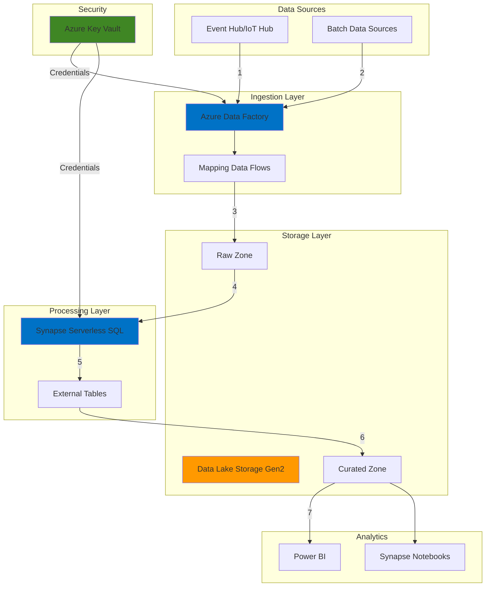

# Scalable Serverless Data Pipeline with Synapse and Data Factory

## Problem

Organizations struggle to build scalable data pipelines that can handle streaming data without managing complex infrastructure. Traditional ETL solutions require significant upfront investment in compute resources, leading to wasted capacity during low-usage periods and bottlenecks during peak loads. Additionally, securing credentials and managing data transformations across multiple services creates operational complexity and security vulnerabilities.

## Solution

Implement a serverless data pipeline using Azure Synapse Analytics serverless SQL pools combined with Azure Data Factory's mapping data flows. This approach provides automatic scaling, pay-per-query pricing, and visual data transformation capabilities. Azure Key Vault integration ensures secure credential management while Data Lake Storage Gen2 provides cost-effective storage with hierarchical namespace support for big data analytics.

## Architecture Diagram



## Prerequisites

1. Azure subscription with appropriate permissions to create resources
2. Azure CLI v2 installed and configured (or use Azure Cloud Shell)
3. Basic understanding of SQL queries and data transformation concepts
4. Familiarity with Azure resource management and security concepts
5. Estimated cost: $50-200/month depending on data volume (pay-per-use model)

> **Note**: This recipe uses serverless components which charge based on actual usage. Monitor costs through Azure Cost Management to avoid unexpected charges.

## Preparation

```bash
# Set environment variables
export RESOURCE_GROUP="rg-serverless-pipeline"
export LOCATION="eastus"
export RANDOM_SUFFIX=$(openssl rand -hex 3)
export STORAGE_ACCOUNT="stpipeline${RANDOM_SUFFIX}"
export SYNAPSE_WORKSPACE="syn-pipeline-${RANDOM_SUFFIX}"
export DATA_FACTORY="adf-pipeline-${RANDOM_SUFFIX}"
export KEY_VAULT="kv-pipeline-${RANDOM_SUFFIX}"

# Create resource group
az group create \
    --name ${RESOURCE_GROUP} \
    --location ${LOCATION} \
    --tags environment=demo purpose=data-pipeline

# Create storage account with hierarchical namespace
az storage account create \
    --name ${STORAGE_ACCOUNT} \
    --resource-group ${RESOURCE_GROUP} \
    --location ${LOCATION} \
    --sku Standard_LRS \
    --kind StorageV2 \
    --hierarchical-namespace true \
    --enable-https-traffic-only true

# Get storage account key
STORAGE_KEY=$(az storage account keys list \
    --account-name ${STORAGE_ACCOUNT} \
    --resource-group ${RESOURCE_GROUP} \
    --query '[0].value' -o tsv)

echo "✅ Foundation resources created successfully"
```

## Steps

1. **Create Azure Key Vault for Secure Credential Management**:

   Azure Key Vault provides centralized secret management with hardware security module (HSM) backing, ensuring your connection strings and passwords are never exposed in code or configuration files. This foundational security component is critical for enterprise data pipelines where multiple services need secure access to shared credentials.

   ```bash
   # Create Key Vault with soft-delete enabled
   az keyvault create \
       --name ${KEY_VAULT} \
       --resource-group ${RESOURCE_GROUP} \
       --location ${LOCATION} \
       --enable-soft-delete true \
       --retention-days 7
   
   # Store storage account connection string
   CONNECTION_STRING=$(az storage account show-connection-string \
       --name ${STORAGE_ACCOUNT} \
       --resource-group ${RESOURCE_GROUP} \
       --query connectionString -o tsv)
   
   az keyvault secret set \
       --vault-name ${KEY_VAULT} \
       --name "storage-connection-string" \
       --value "${CONNECTION_STRING}"
   
   echo "✅ Key Vault created with secure credential storage"
   ```

   The Key Vault now contains encrypted credentials that both Synapse and Data Factory can access using managed identities, eliminating the need for hardcoded passwords and improving security posture.

2. **Deploy Azure Synapse Analytics Workspace**:

   Azure Synapse Analytics workspace provides an integrated environment for big data and data warehousing workloads. The serverless SQL pool enables on-demand querying of data lake files without pre-provisioned compute resources, offering true pay-per-query pricing that scales automatically based on workload demands.

   ```bash
   # Create Synapse workspace
   az synapse workspace create \
       --name ${SYNAPSE_WORKSPACE} \
       --resource-group ${RESOURCE_GROUP} \
       --storage-account ${STORAGE_ACCOUNT} \
       --file-system "synapsefs" \
       --sql-admin-login-user "sqladmin" \
       --sql-admin-login-password "P@ssw0rd123!" \
       --location ${LOCATION}
   
   # Create firewall rule for client IP
   CLIENT_IP=$(curl -s https://api.ipify.org)
   az synapse workspace firewall-rule create \
       --name "AllowClientIP" \
       --workspace-name ${SYNAPSE_WORKSPACE} \
       --resource-group ${RESOURCE_GROUP} \
       --start-ip-address ${CLIENT_IP} \
       --end-ip-address ${CLIENT_IP}
   
   echo "✅ Synapse workspace deployed with serverless SQL pool"
   ```

   The Synapse workspace is now ready to execute serverless SQL queries against your data lake. The built-in serverless SQL pool eliminates infrastructure management while providing enterprise-grade query performance through distributed query processing.

3. **Configure Data Lake Storage Structure**:

   A well-organized data lake structure is essential for efficient data processing and governance. The medallion architecture (raw/bronze, curated/silver, and refined/gold zones) provides clear data lineage and supports incremental processing patterns required for streaming data pipelines.

   ```bash
   # Create data lake containers
   az storage container create \
       --name "raw" \
       --account-name ${STORAGE_ACCOUNT} \
       --account-key ${STORAGE_KEY}
   
   az storage container create \
       --name "curated" \
       --account-name ${STORAGE_ACCOUNT} \
       --account-key ${STORAGE_KEY}
   
   az storage container create \
       --name "refined" \
       --account-name ${STORAGE_ACCOUNT} \
       --account-key ${STORAGE_KEY}
   
   # Create folder structure
   az storage fs directory create \
       --name "streaming-data" \
       --file-system "raw" \
       --account-name ${STORAGE_ACCOUNT} \
       --account-key ${STORAGE_KEY}
   
   echo "✅ Data lake structure created with medallion architecture"
   ```

4. **Deploy Azure Data Factory Instance**:

   Azure Data Factory serves as the orchestration engine for your data pipeline, providing visual authoring for complex data movements and transformations. The managed integration runtime automatically scales to handle varying data volumes while mapping data flows enable code-free transformations using Apache Spark clusters.

   ```bash
   # Create Data Factory
   az datafactory create \
       --name ${DATA_FACTORY} \
       --resource-group ${RESOURCE_GROUP} \
       --location ${LOCATION}
   
   # Enable managed identity
   FACTORY_IDENTITY=$(az datafactory show \
       --name ${DATA_FACTORY} \
       --resource-group ${RESOURCE_GROUP} \
       --query identity.principalId -o tsv)
   
   # Grant Key Vault access to Data Factory
   az keyvault set-policy \
       --name ${KEY_VAULT} \
       --object-id ${FACTORY_IDENTITY} \
       --secret-permissions get list
   
   echo "✅ Data Factory deployed with managed identity configured"
   ```

5. **Create Linked Services for Integration**:

   Linked services define the connection information needed for Data Factory to connect to external resources. Using Key Vault-backed linked services ensures credentials are never exposed in Data Factory definitions, maintaining security best practices for enterprise deployments.

   ```bash
   # Create Key Vault linked service
   az datafactory linked-service create \
       --resource-group ${RESOURCE_GROUP} \
       --factory-name ${DATA_FACTORY} \
       --name "ls_keyvault" \
       --properties '{
           "type": "AzureKeyVault",
           "typeProperties": {
               "baseUrl": "https://'${KEY_VAULT}'.vault.azure.net/"
           }
       }'
   
   # Create storage linked service
   az datafactory linked-service create \
       --resource-group ${RESOURCE_GROUP} \
       --factory-name ${DATA_FACTORY} \
       --name "ls_storage" \
       --properties '{
           "type": "AzureBlobFS",
           "typeProperties": {
               "url": "https://'${STORAGE_ACCOUNT}'.dfs.core.windows.net",
               "accountKey": {
                   "type": "AzureKeyVaultSecret",
                   "store": {
                       "referenceName": "ls_keyvault",
                       "type": "LinkedServiceReference"
                   },
                   "secretName": "storage-connection-string"
               }
           }
       }'
   
   echo "✅ Linked services created with secure credential management"
   ```

6. **Configure Synapse External Tables for Data Lake Access**:

   External tables in Synapse serverless SQL pool provide schema-on-read capabilities, allowing you to query data lake files using familiar T-SQL syntax without data movement. This approach maintains data in its native format while enabling powerful analytical queries across massive datasets.

   ```bash
   # Create database in Synapse
   SYNAPSE_ENDPOINT="${SYNAPSE_WORKSPACE}.sql.azuresynapse.net"
   
   sqlcmd -S ${SYNAPSE_ENDPOINT} -d master \
       -U sqladmin -P "P@ssw0rd123!" \
       -Q "CREATE DATABASE StreamingAnalytics"
   
   # Create external data source
   sqlcmd -S ${SYNAPSE_ENDPOINT} -d StreamingAnalytics \
       -U sqladmin -P "P@ssw0rd123!" \
       -Q "CREATE EXTERNAL DATA SOURCE DataLakeStorage
           WITH (
               LOCATION = 'abfss://raw@${STORAGE_ACCOUNT}.dfs.core.windows.net',
               TYPE = HADOOP
           )"
   
   # Create external file format
   sqlcmd -S ${SYNAPSE_ENDPOINT} -d StreamingAnalytics \
       -U sqladmin -P "P@ssw0rd123!" \
       -Q "CREATE EXTERNAL FILE FORMAT ParquetFormat
           WITH (
               FORMAT_TYPE = PARQUET,
               DATA_COMPRESSION = 'snappy'
           )"
   
   echo "✅ Synapse external tables configured for data lake access"
   ```

   Synapse serverless SQL pool can now query Parquet files directly from your data lake using standard SQL syntax. This enables real-time analytics on streaming data without the need for data copying or dedicated compute resources.

7. **Create Data Factory Pipeline with Mapping Data Flow**:

   Mapping data flows provide visual, code-free data transformation capabilities that execute on managed Spark clusters. This serverless approach automatically handles cluster provisioning and scaling, allowing you to focus on business logic rather than infrastructure management.

   ```bash
   # Create dataset for source data
   az datafactory dataset create \
       --resource-group ${RESOURCE_GROUP} \
       --factory-name ${DATA_FACTORY} \
       --name "ds_streaming_source" \
       --properties '{
           "linkedServiceName": {
               "referenceName": "ls_storage",
               "type": "LinkedServiceReference"
           },
           "type": "Json",
           "typeProperties": {
               "location": {
                   "type": "AzureBlobFSLocation",
                   "fileSystem": "raw",
                   "folderPath": "streaming-data"
               }
           }
       }'
   
   # Create dataset for sink
   az datafactory dataset create \
       --resource-group ${RESOURCE_GROUP} \
       --factory-name ${DATA_FACTORY} \
       --name "ds_curated_sink" \
       --properties '{
           "linkedServiceName": {
               "referenceName": "ls_storage",
               "type": "LinkedServiceReference"
           },
           "type": "Parquet",
           "typeProperties": {
               "location": {
                   "type": "AzureBlobFSLocation",
                   "fileSystem": "curated",
                   "folderPath": "processed-data"
               }
           }
       }'
   
   echo "✅ Data Factory pipeline components created"
   ```

8. **Configure Monitoring and Alerting**:

   Comprehensive monitoring is essential for maintaining data pipeline reliability and performance. Azure Monitor integration provides real-time insights into pipeline execution, data quality issues, and resource utilization, enabling proactive issue resolution before business impact occurs.

   ```bash
   # Enable diagnostic settings for Data Factory
   STORAGE_ID=$(az storage account show \
       --name ${STORAGE_ACCOUNT} \
       --resource-group ${RESOURCE_GROUP} \
       --query id -o tsv)
   
   az monitor diagnostic-settings create \
       --name "adf-diagnostics" \
       --resource $(az datafactory show \
           --name ${DATA_FACTORY} \
           --resource-group ${RESOURCE_GROUP} \
           --query id -o tsv) \
       --storage-account ${STORAGE_ID} \
       --logs '[{
           "category": "PipelineRuns",
           "enabled": true,
           "retentionPolicy": {"days": 30, "enabled": true}
       }]'
   
   # Create alert for pipeline failures
   az monitor metrics alert create \
       --name "pipeline-failure-alert" \
       --resource-group ${RESOURCE_GROUP} \
       --scopes $(az datafactory show \
           --name ${DATA_FACTORY} \
           --resource-group ${RESOURCE_GROUP} \
           --query id -o tsv) \
       --condition "count PipelineFailedRuns > 0" \
       --description "Alert when pipeline fails"
   
   echo "✅ Monitoring and alerting configured"
   ```

## Validation & Testing

1. Verify all resources were created successfully:

   ```bash
   # Check resource group resources
   az resource list \
       --resource-group ${RESOURCE_GROUP} \
       --output table
   ```

   Expected output: List showing Key Vault, Storage Account, Synapse Workspace, and Data Factory

2. Test Synapse connectivity and external table access:

   ```bash
   # Test Synapse serverless SQL pool
   sqlcmd -S ${SYNAPSE_ENDPOINT} -d StreamingAnalytics \
       -U sqladmin -P "P@ssw0rd123!" \
       -Q "SELECT @@VERSION"
   
   # Verify external data source
   sqlcmd -S ${SYNAPSE_ENDPOINT} -d StreamingAnalytics \
       -U sqladmin -P "P@ssw0rd123!" \
       -Q "SELECT * FROM sys.external_data_sources"
   ```

3. Validate Data Factory pipeline components:

   ```bash
   # List linked services
   az datafactory linked-service list \
       --factory-name ${DATA_FACTORY} \
       --resource-group ${RESOURCE_GROUP} \
       --output table
   
   # List datasets
   az datafactory dataset list \
       --factory-name ${DATA_FACTORY} \
       --resource-group ${RESOURCE_GROUP} \
       --output table
   ```

> **Tip**: Use Azure Data Factory's debug mode to test your mapping data flows with sample data before deploying to production. This helps identify transformation issues early without incurring full pipeline execution costs.

## Cleanup

1. Remove Data Factory resources:

   ```bash
   # Delete Data Factory
   az datafactory delete \
       --name ${DATA_FACTORY} \
       --resource-group ${RESOURCE_GROUP} \
       --yes
   
   echo "✅ Data Factory deleted"
   ```

2. Delete Synapse workspace:

   ```bash
   # Remove Synapse workspace
   az synapse workspace delete \
       --name ${SYNAPSE_WORKSPACE} \
       --resource-group ${RESOURCE_GROUP} \
       --yes
   
   echo "✅ Synapse workspace deleted"
   ```

3. Remove Key Vault (with soft-delete consideration):

   ```bash
   # Delete Key Vault
   az keyvault delete \
       --name ${KEY_VAULT} \
       --resource-group ${RESOURCE_GROUP}
   
   # Purge soft-deleted vault
   az keyvault purge \
       --name ${KEY_VAULT} \
       --location ${LOCATION}
   
   echo "✅ Key Vault removed"
   ```

4. Delete resource group and all remaining resources:

   ```bash
   # Delete entire resource group
   az group delete \
       --name ${RESOURCE_GROUP} \
       --yes \
       --no-wait
   
   echo "✅ Resource group deletion initiated"
   echo "Note: Complete deletion may take several minutes"
   ```

## Discussion

The serverless data pipeline architecture using Azure Synapse Analytics and Azure Data Factory represents a paradigm shift from traditional ETL infrastructure. By leveraging serverless SQL pools, organizations eliminate the need for dedicated compute resources while maintaining enterprise-grade query performance. This approach is particularly effective for variable workloads where traditional provisioned resources would result in either over-provisioning (wasted cost) or under-provisioning (poor performance). For detailed architectural patterns, see the [Azure Synapse Analytics documentation](https://docs.microsoft.com/en-us/azure/synapse-analytics/) and [serverless SQL pool best practices](https://docs.microsoft.com/en-us/azure/synapse-analytics/sql/best-practices-serverless-sql-pool).

The integration of mapping data flows within Azure Data Factory provides a visual, code-free approach to data transformation that automatically scales based on data volume. This abstraction layer enables data engineers to focus on business logic rather than Spark cluster management, significantly reducing the operational burden. The underlying Apache Spark engine ensures high performance for complex transformations while the serverless execution model ensures you only pay for actual compute time. For comprehensive guidance on optimizing data flows, review the [mapping data flow performance guide](https://docs.microsoft.com/en-us/azure/data-factory/concepts-data-flow-performance).

Security considerations are paramount in modern data architectures. The use of Azure Key Vault for credential management, combined with managed identities for service-to-service authentication, creates a zero-trust security model where passwords are never exposed in code or configuration files. This approach aligns with the [Azure Well-Architected Framework](https://docs.microsoft.com/en-us/azure/architecture/framework/) security pillar and provides audit trails for compliance requirements. Additionally, the hierarchical namespace in Azure Data Lake Storage Gen2 enables fine-grained access control at the folder and file level.

From a cost optimization perspective, the serverless model ensures organizations only pay for resources consumed during query execution and data transformation. This consumption-based pricing is particularly advantageous for batch processing scenarios where compute requirements vary significantly throughout the day. For continuous optimization strategies, consult the [Azure cost optimization documentation](https://docs.microsoft.com/en-us/azure/cost-management-billing/costs/cost-management-best-practices) and implement automated policies to monitor and control spending.

> **Warning**: While serverless architectures provide excellent scalability, be aware of potential cold start latencies for initial queries. Plan your workload patterns accordingly and consider using scheduled warm-up queries for time-sensitive operations.

## Challenge

Extend this solution by implementing these enhancements:

1. Add real-time streaming ingestion using Azure Event Hubs or IoT Hub with Azure Stream Analytics for continuous data processing
2. Implement data quality validation using mapping data flow transformations with row-level error handling and dead letter queues
3. Create automated data catalog integration using Azure Purview to enable data discovery and lineage tracking
4. Build a multi-region disaster recovery strategy with geo-redundant storage and automated failover for business continuity
5. Develop custom monitoring dashboards using Azure Monitor workbooks to track pipeline SLAs and data freshness metrics

## Infrastructure Code

### Available Infrastructure as Code:

- [Infrastructure Code Overview](code/README.md) - Detailed description of all infrastructure components
- [Bicep](code/bicep/) - Azure Bicep templates
- [Bash CLI Scripts](code/scripts/) - Example bash scripts using Azure CLI commands to deploy infrastructure
- [Terraform](code/terraform/) - Terraform configuration files