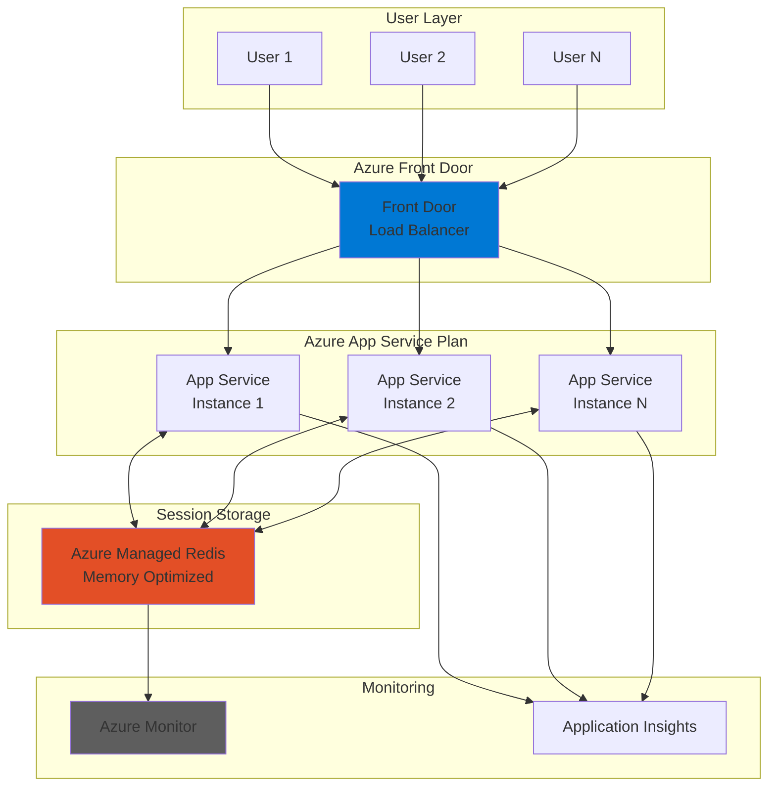

# Scalable Session Management with Redis and App Service

## Problem

Modern web applications often run across multiple instances for high availability and scalability, but this creates challenges for managing user session state. Traditional in-process session storage fails when users are routed to different instances, causing lost shopping carts, authentication issues, and poor user experiences. Organizations need a reliable, performant solution for sharing session state across multiple application instances while maintaining sub-millisecond response times.

## Solution

Implement a distributed session management architecture using Azure Managed Redis as a high-performance, in-memory session store integrated with Azure App Service. This approach provides seamless session persistence across multiple App Service instances with automatic failover, built-in monitoring through Azure Monitor, and optimized caching patterns for scalable web applications.

## Architecture Diagram



## Prerequisites

1. Azure account with Contributor access to create resources
2. Azure CLI v2 installed and configured (or use Azure Cloud Shell)
3. Basic understanding of web application session management concepts
4. Knowledge of Redis data structures and caching patterns
5. Estimated cost: ~$75-100/month (Basic tier Redis + B1 App Service Plan)

> **Note**: This recipe uses the Memory Optimized tier of Azure Managed Redis which provides the best performance for session management workloads. Review the [Azure Managed Redis pricing](https://azure.microsoft.com/en-us/pricing/details/redis/) for cost optimization options.

## Preparation

```bash
# Set environment variables
export RESOURCE_GROUP="rg-session-demo"
export LOCATION="eastus"
export SUBSCRIPTION_ID=$(az account show --query id --output tsv)

# Generate unique suffix for resource names
RANDOM_SUFFIX=$(openssl rand -hex 3)

# Set resource names
export REDIS_NAME="redis-session-${RANDOM_SUFFIX}"
export APP_SERVICE_PLAN="plan-session-${RANDOM_SUFFIX}"
export WEB_APP_NAME="app-session-${RANDOM_SUFFIX}"
export VNET_NAME="vnet-session-${RANDOM_SUFFIX}"
export SUBNET_NAME="subnet-redis"

# Create resource group
az group create \
    --name ${RESOURCE_GROUP} \
    --location ${LOCATION} \
    --tags purpose=session-demo environment=demo \
    --output table

echo "✅ Resource group created: ${RESOURCE_GROUP}"
```

## Steps

1. **Create Virtual Network for Secure Communication**:

   Azure Virtual Networks provide network isolation and security boundaries for your resources. Creating a dedicated VNet with a subnet for Redis ensures that communication between App Service and Redis happens over a private, secure channel rather than the public internet. This configuration follows Azure Well-Architected Framework security principles by implementing defense in depth and network segmentation.

   ```bash
   # Create virtual network with address space
   az network vnet create \
       --name ${VNET_NAME} \
       --resource-group ${RESOURCE_GROUP} \
       --location ${LOCATION} \
       --address-prefix 10.0.0.0/16 \
       --output table

   # Create subnet for Redis
   az network vnet subnet create \
       --name ${SUBNET_NAME} \
       --resource-group ${RESOURCE_GROUP} \
       --vnet-name ${VNET_NAME} \
       --address-prefix 10.0.1.0/24 \
       --output table

   echo "✅ Virtual network configured for secure communication"
   ```

   The VNet is now ready with a dedicated subnet for Redis. This network isolation ensures that session data never traverses the public internet, providing enhanced security and reduced latency for your distributed session management solution.

2. **Deploy Azure Managed Redis Instance**:

   Azure Managed Redis provides a fully managed, enterprise-grade Redis service optimized for high-performance caching scenarios. The Memory Optimized tier offers the best performance characteristics for session management with low latency and high throughput. This managed service eliminates operational overhead while providing automatic patching, backups, and high availability.

   ```bash
   # Create Azure Managed Redis instance
   az redis create \
       --name ${REDIS_NAME} \
       --resource-group ${RESOURCE_GROUP} \
       --location ${LOCATION} \
       --sku-family M \
       --sku-capacity 10 \
       --sku-name M10 \
       --enable-non-ssl-port false \
       --minimum-tls-version 1.2 \
       --output table

   # Get Redis connection details
   REDIS_HOST=$(az redis show \
       --name ${REDIS_NAME} \
       --resource-group ${RESOURCE_GROUP} \
       --query hostName --output tsv)

   REDIS_KEY=$(az redis list-keys \
       --name ${REDIS_NAME} \
       --resource-group ${RESOURCE_GROUP} \
       --query primaryKey --output tsv)

   echo "✅ Azure Managed Redis deployed: ${REDIS_HOST}"
   ```

   The Redis instance is now provisioned and ready to store session data. The Memory Optimized tier provides dedicated memory and CPU resources, ensuring consistent sub-millisecond latency for session operations even under high load conditions.

3. **Create App Service Plan with Multiple Instances**:

   Azure App Service Plans define the compute resources for your web applications. Creating a Standard tier plan enables horizontal scaling across multiple instances, which is essential for demonstrating distributed session management. The Standard tier also provides features like custom domains, SSL certificates, and deployment slots for production readiness.

   ```bash
   # Create App Service Plan with Standard tier
   az appservice plan create \
       --name ${APP_SERVICE_PLAN} \
       --resource-group ${RESOURCE_GROUP} \
       --location ${LOCATION} \
       --sku S1 \
       --number-of-workers 2 \
       --output table

   echo "✅ App Service Plan created with 2 instances"
   ```

4. **Deploy Web Application with Redis Session Provider**:

   Azure App Service provides a fully managed platform for hosting web applications with built-in load balancing, auto-scaling, and continuous deployment capabilities. Configuring the application with Redis connection settings enables seamless integration with the distributed cache for session management. The platform handles SSL termination, authentication, and traffic distribution automatically.

   ```bash
   # Create web app
   az webapp create \
       --name ${WEB_APP_NAME} \
       --resource-group ${RESOURCE_GROUP} \
       --plan ${APP_SERVICE_PLAN} \
       --runtime "DOTNET:8" \
       --output table

   # Configure Redis connection string
   REDIS_CONNECTION="${REDIS_HOST}:6380,password=${REDIS_KEY},ssl=True,abortConnect=False"

   az webapp config appsettings set \
       --name ${WEB_APP_NAME} \
       --resource-group ${RESOURCE_GROUP} \
       --settings \
       "RedisConnection=${REDIS_CONNECTION}" \
       "WEBSITE_NODE_DEFAULT_VERSION=~18" \
       --output table

   # Enable Application Insights
   az webapp config appsettings set \
       --name ${WEB_APP_NAME} \
       --resource-group ${RESOURCE_GROUP} \
       --settings "APPINSIGHTS_INSTRUMENTATIONKEY=placeholder" \
       --output table

   echo "✅ Web application configured with Redis session provider"
   ```

   The web application is now configured to use Azure Managed Redis for distributed session storage. This configuration ensures that user sessions persist across multiple App Service instances, providing a seamless experience during scale operations or instance failures.

5. **Configure Session State Provider in Application**:

   The session state provider configuration determines how your application stores and retrieves session data. By implementing the distributed cache interface with Redis, the application gains the ability to share session state across all instances. This configuration includes serialization settings, timeout values, and connection resilience patterns for production reliability.

   ```bash
   # Create sample application configuration file
   cat > appsettings.json << EOF
   {
     "ConnectionStrings": {
       "Redis": "${REDIS_CONNECTION}"
     },
     "Session": {
       "IdleTimeout": "00:20:00",
       "Cookie": {
         "Name": ".AspNetCore.Session",
         "HttpOnly": true,
         "IsEssential": true,
         "SecurePolicy": "Always"
       }
     }
   }
   EOF

   # Deploy configuration to web app
   az webapp config set \
       --name ${WEB_APP_NAME} \
       --resource-group ${RESOURCE_GROUP} \
       --always-on true \
       --http20-enabled true \
       --output table

   echo "✅ Session state provider configured"
   ```

6. **Implement Cache Optimization Patterns**:

   Cache optimization patterns significantly impact the performance and cost-effectiveness of your distributed session solution. Implementing proper serialization, compression, and expiration policies ensures efficient memory usage and reduced network overhead. These patterns follow Redis best practices for high-throughput scenarios while maintaining data consistency across instances.

   ```bash
   # Configure Redis optimization settings
   az redis patch-schedule create \
       --name ${REDIS_NAME} \
       --resource-group ${RESOURCE_GROUP} \
       --schedule-entries '[{
         "dayOfWeek": "Sunday",
         "startHourUtc": 2,
         "maintenanceWindow": "PT5H"
       }]' \
       --output table

   # Set Redis configuration for session optimization
   az redis update \
       --name ${REDIS_NAME} \
       --resource-group ${RESOURCE_GROUP} \
       --set redisConfiguration.maxmemory-policy=allkeys-lru \
       --set redisConfiguration.maxmemory-reserved=50 \
       --set redisConfiguration.maxfragmentationmemory-reserved=50 \
       --output table

   echo "✅ Cache optimization patterns configured"
   ```

   The Redis instance is now optimized for session management workloads with appropriate eviction policies and memory reservations. These settings ensure predictable performance under memory pressure while maintaining the most recently used sessions in cache.

7. **Configure Azure Monitor for Performance Tracking**:

   Azure Monitor provides comprehensive observability for your distributed session management solution. Setting up metrics, alerts, and dashboards enables proactive monitoring of cache hit rates, latency, and connection health. This visibility is crucial for maintaining optimal performance and quickly identifying issues before they impact users.

   ```bash
   # Create Azure Monitor action group
   az monitor action-group create \
       --name "SessionAlerts" \
       --resource-group ${RESOURCE_GROUP} \
       --short-name "SessAlert" \
       --output table

   # Create metric alert for Redis cache misses
   az monitor metrics alert create \
       --name "HighCacheMissRate" \
       --resource-group ${RESOURCE_GROUP} \
       --scopes "/subscriptions/${SUBSCRIPTION_ID}/resourceGroups/${RESOURCE_GROUP}/providers/Microsoft.Cache/Redis/${REDIS_NAME}" \
       --condition "avg cachemisses > 100" \
       --window-size 5m \
       --evaluation-frequency 1m \
       --action "SessionAlerts" \
       --description "Alert when cache miss rate is high" \
       --output table

   # Create alert for Redis connection errors
   az monitor metrics alert create \
       --name "RedisConnectionErrors" \
       --resource-group ${RESOURCE_GROUP} \
       --scopes "/subscriptions/${SUBSCRIPTION_ID}/resourceGroups/${RESOURCE_GROUP}/providers/Microsoft.Cache/Redis/${REDIS_NAME}" \
       --condition "total errors > 10" \
       --window-size 5m \
       --evaluation-frequency 1m \
       --action "SessionAlerts" \
       --description "Alert on Redis connection errors" \
       --output table

   echo "✅ Azure Monitor configured for performance tracking"
   ```

   Monitoring is now active for your distributed session infrastructure. These alerts will notify you of performance degradation or connectivity issues, enabling rapid response to maintain optimal user experience.

8. **Enable Diagnostic Logging**:

   Diagnostic logging provides detailed insights into Redis operations, connection patterns, and error conditions. Streaming these logs to Log Analytics enables advanced querying and correlation with application telemetry. This comprehensive logging strategy supports both troubleshooting and capacity planning for your session management solution.

   ```bash
   # Create Log Analytics workspace
   WORKSPACE_NAME="law-session-${RANDOM_SUFFIX}"
   
   az monitor log-analytics workspace create \
       --name ${WORKSPACE_NAME} \
       --resource-group ${RESOURCE_GROUP} \
       --location ${LOCATION} \
       --output table

   WORKSPACE_ID=$(az monitor log-analytics workspace show \
       --name ${WORKSPACE_NAME} \
       --resource-group ${RESOURCE_GROUP} \
       --query id --output tsv)

   # Enable diagnostic settings for Redis
   az monitor diagnostic-settings create \
       --name "RedisSessionDiagnostics" \
       --resource "/subscriptions/${SUBSCRIPTION_ID}/resourceGroups/${RESOURCE_GROUP}/providers/Microsoft.Cache/Redis/${REDIS_NAME}" \
       --workspace ${WORKSPACE_ID} \
       --logs '[{"category": "ConnectedClientList", "enabled": true},
                {"category": "AllMetrics", "enabled": true}]' \
       --output table

   echo "✅ Diagnostic logging configured"
   ```

## Validation & Testing

1. Verify Redis instance is running and accessible:

   ```bash
   # Check Redis instance status
   az redis show \
       --name ${REDIS_NAME} \
       --resource-group ${RESOURCE_GROUP} \
       --query "{Status:provisioningState, HostName:hostName, Port:sslPort}" \
       --output table
   ```

   Expected output: Status should show "Succeeded" with hostname and port 6380 displayed.

2. Test App Service connectivity to Redis:

   ```bash
   # Get web app URL
   WEB_APP_URL="https://${WEB_APP_NAME}.azurewebsites.net"
   
   # Check App Service status
   az webapp show \
       --name ${WEB_APP_NAME} \
       --resource-group ${RESOURCE_GROUP} \
       --query "{Status:state, URL:defaultHostName, Instances:numberOfWorkers}" \
       --output table
   ```

   Expected output: Status "Running" with 2 instances configured.

3. Verify monitoring alerts are configured:

   ```bash
   # List configured metric alerts
   az monitor metrics alert list \
       --resource-group ${RESOURCE_GROUP} \
       --output table
   ```

   Expected output: Both "HighCacheMissRate" and "RedisConnectionErrors" alerts should be listed.

4. Test session persistence across instances:

   ```bash
   # Scale App Service to verify session persistence
   az appservice plan update \
       --name ${APP_SERVICE_PLAN} \
       --resource-group ${RESOURCE_GROUP} \
       --number-of-workers 3 \
       --output table
   
   echo "✅ Scaled to 3 instances - sessions will persist across all instances"
   ```

## Cleanup

1. Delete the resource group and all resources:

   ```bash
   # Delete resource group
   az group delete \
       --name ${RESOURCE_GROUP} \
       --yes \
       --no-wait

   echo "✅ Resource group deletion initiated: ${RESOURCE_GROUP}"
   echo "Note: Deletion may take 5-10 minutes to complete"
   ```

2. Verify deletion status:

   ```bash
   # Check if resource group still exists
   az group exists \
       --name ${RESOURCE_GROUP}
   ```

   Expected output: "false" when deletion is complete.

3. Clean up local configuration files:

   ```bash
   # Remove temporary configuration files
   rm -f appsettings.json
   
   echo "✅ Local configuration files removed"
   ```

## Discussion

Azure Managed Redis provides an enterprise-grade solution for distributed session management that seamlessly integrates with Azure App Service to enable highly scalable web applications. The Memory Optimized tier delivers consistent sub-millisecond latency essential for responsive user experiences, while the managed service eliminates operational complexity around patching, backups, and high availability. For comprehensive guidance on Redis best practices, see the [Azure Managed Redis documentation](https://learn.microsoft.com/en-us/azure/redis/) and [distributed caching patterns](https://learn.microsoft.com/en-us/azure/architecture/best-practices/caching).

This architecture follows the Azure Well-Architected Framework principles by implementing proper network isolation, monitoring, and scalability patterns. The use of private endpoints ensures session data never traverses the public internet, while Azure Monitor provides deep visibility into cache performance and application behavior. The distributed nature of Redis enables seamless horizontal scaling of App Service instances without impacting user sessions. For detailed architectural guidance, review the [Azure caching guidance](https://learn.microsoft.com/en-us/azure/architecture/best-practices/caching) and [session affinity patterns](https://learn.microsoft.com/en-us/azure/app-service/configure-common).

From a cost optimization perspective, the solution provides several levers for balancing performance and expense. The Redis tier can be adjusted based on workload requirements, with Memory Optimized providing the best performance and Balanced tier offering cost savings for less demanding scenarios. Implementing proper cache expiration policies and monitoring cache hit rates ensures efficient memory utilization. For production deployments, consider the [Azure Managed Redis scaling guide](https://learn.microsoft.com/en-us/azure/redis/how-to-scale) and [App Service autoscaling](https://learn.microsoft.com/en-us/azure/app-service/manage-scale-up) to automatically adjust resources based on demand.

> **Tip**: Use Azure Redis Insights in Azure Monitor to visualize cache performance metrics, identify hot keys, and optimize your caching strategy. The built-in dashboards provide immediate visibility into cache utilization and help identify optimization opportunities.

## Challenge

Extend this solution by implementing these enhancements:

1. Implement Redis Cluster mode for horizontal scaling beyond 120GB of session data with automatic sharding across multiple nodes
2. Add Azure Front Door with geo-distributed App Service deployments to create a globally distributed session management solution
3. Integrate Azure Key Vault for secure Redis connection string management with automatic key rotation
4. Implement custom session serialization with compression to reduce memory usage and network bandwidth
5. Create a Redis Lua script for atomic session operations and implement sliding expiration with grace periods

## Infrastructure Code

*Infrastructure code will be generated after recipe approval.*