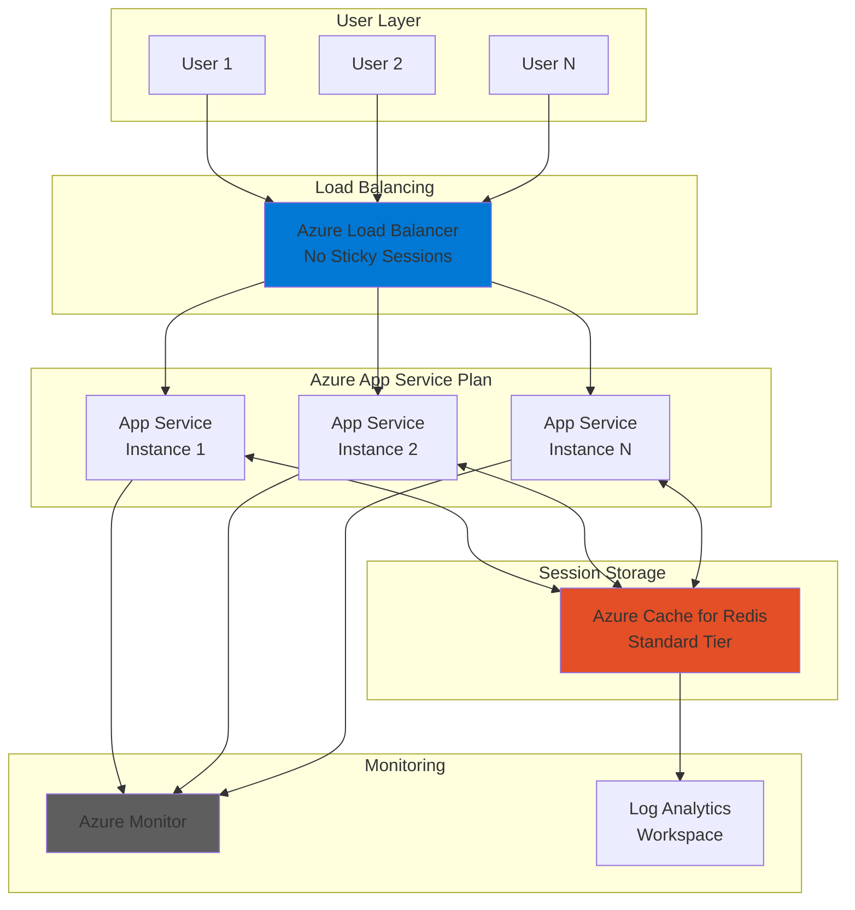

# Scalable Session Management with Redis and App Service

## Problem

Modern web applications often run across multiple instances for high availability and scalability, but this creates challenges for managing user session state. Traditional in-process session storage fails when users are routed to different instances, causing lost shopping carts, authentication issues, and poor user experiences. Organizations need a reliable, performant solution for sharing session state across multiple application instances while maintaining sub-millisecond response times.

## Solution

Implement a distributed session management architecture using Azure Cache for Redis as a high-performance, in-memory session store integrated with Azure App Service. This approach provides seamless session persistence across multiple App Service instances with automatic failover, built-in monitoring through Azure Monitor, and optimized caching patterns for scalable web applications.

## Architecture Diagram



## Prerequisites

1. Azure account with Contributor access to create resources
2. Azure CLI v2.61.0 or higher installed and configured (or use Azure Cloud Shell)
3. Basic understanding of web application session management concepts
4. Knowledge of Redis data structures and caching patterns
5. Estimated cost: ~$50-75/month (Standard C1 Redis + Standard S1 App Service Plan)

> **Note**: This recipe uses the Standard tier of Azure Cache for Redis which provides high availability and better performance than Basic tier. Review the [Azure Cache for Redis pricing](https://azure.microsoft.com/pricing/details/cache/) for cost optimization options.

## Preparation

```bash
# Set environment variables for Azure resources
export RESOURCE_GROUP="rg-session-${RANDOM_SUFFIX}"
export LOCATION="eastus"
export SUBSCRIPTION_ID=$(az account show --query id --output tsv)

# Generate unique suffix for resource names
RANDOM_SUFFIX=$(openssl rand -hex 3)

# Set resource names
export REDIS_NAME="redis-session-${RANDOM_SUFFIX}"
export APP_SERVICE_PLAN="plan-session-${RANDOM_SUFFIX}"
export WEB_APP_NAME="app-session-${RANDOM_SUFFIX}"

# Create resource group
az group create \
    --name ${RESOURCE_GROUP} \
    --location ${LOCATION} \
    --tags purpose=session-demo environment=demo

echo "✅ Resource group created: ${RESOURCE_GROUP}"
```

## Steps

1. **Create Azure Cache for Redis Instance**:

   Azure Cache for Redis provides a fully managed, enterprise-grade Redis service optimized for high-performance caching scenarios. The Standard tier offers high availability with primary-replica configuration and automatic failover capabilities. This managed service eliminates operational overhead while providing automatic patching, backups, and built-in security features.

   ```bash
   # Create Azure Cache for Redis instance
   az redis create \
       --name ${REDIS_NAME} \
       --resource-group ${RESOURCE_GROUP} \
       --location ${LOCATION} \
       --sku Standard \
       --vm-size c1 \
       --enable-non-ssl-port false \
       --minimum-tls-version 1.2

   # Wait for Redis deployment to complete
   echo "Waiting for Redis deployment to complete..."
   az redis wait --name ${REDIS_NAME} \
       --resource-group ${RESOURCE_GROUP} \
       --created

   # Get Redis connection details
   REDIS_HOST=$(az redis show \
       --name ${REDIS_NAME} \
       --resource-group ${RESOURCE_GROUP} \
       --query hostName --output tsv)

   REDIS_KEY=$(az redis list-keys \
       --name ${REDIS_NAME} \
       --resource-group ${RESOURCE_GROUP} \
       --query primaryKey --output tsv)

   echo "✅ Azure Cache for Redis deployed: ${REDIS_HOST}"
   ```

   The Redis instance is now provisioned with high availability and ready to store session data. The Standard tier provides dedicated resources and ensures consistent sub-millisecond latency for session operations even under high load conditions.

2. **Create App Service Plan with Multiple Instances**:

   Azure App Service Plans define the compute resources for your web applications. Creating a Standard tier plan enables horizontal scaling across multiple instances, which is essential for demonstrating distributed session management. The Standard tier also provides features like custom domains, SSL certificates, and deployment slots for production readiness.

   ```bash
   # Create App Service Plan with Standard tier
   az appservice plan create \
       --name ${APP_SERVICE_PLAN} \
       --resource-group ${RESOURCE_GROUP} \
       --location ${LOCATION} \
       --sku S1 \
       --number-of-workers 2

   echo "✅ App Service Plan created with 2 instances"
   ```

   The App Service Plan is now configured to run multiple instances that can share session state through Redis, eliminating the need for sticky sessions and improving application scalability.

3. **Deploy Web Application with Redis Session Provider**:

   Azure App Service provides a fully managed platform for hosting web applications with built-in load balancing, auto-scaling, and continuous deployment capabilities. Configuring the application with Redis connection settings enables seamless integration with the distributed cache for session management. The platform handles SSL termination, authentication, and traffic distribution automatically.

   ```bash
   # Create web app
   az webapp create \
       --name ${WEB_APP_NAME} \
       --resource-group ${RESOURCE_GROUP} \
       --plan ${APP_SERVICE_PLAN} \
       --runtime "DOTNET:8"

   # Configure Redis connection string
   REDIS_CONNECTION="${REDIS_HOST}:6380,password=${REDIS_KEY},ssl=True,abortConnect=False"

   # Set application settings
   az webapp config appsettings set \
       --name ${WEB_APP_NAME} \
       --resource-group ${RESOURCE_GROUP} \
       --settings \
       "RedisConnection=${REDIS_CONNECTION}" \
       "SessionTimeout=00:20:00"

   # Disable ARR affinity for stateless sessions
   az webapp update \
       --name ${WEB_APP_NAME} \
       --resource-group ${RESOURCE_GROUP} \
       --client-affinity-enabled false

   echo "✅ Web application configured with Redis session provider"
   ```

   The web application is now configured to use Azure Cache for Redis for distributed session storage. Disabling ARR affinity ensures that user sessions persist across multiple App Service instances, providing a seamless experience during scale operations or instance failures.

4. **Configure Session State Provider Settings**:

   The session state provider configuration determines how your application stores and retrieves session data. By implementing the distributed cache interface with Redis, the application gains the ability to share session state across all instances. This configuration includes serialization settings, timeout values, and connection resilience patterns for production reliability.

   ```bash
   # Create sample application configuration
   cat > appsettings.json << EOF
   {
     "ConnectionStrings": {
       "Redis": "${REDIS_CONNECTION}"
     },
     "Session": {
       "IdleTimeout": "00:20:00",
       "Cookie": {
         "Name": ".AspNetCore.Session",
         "HttpOnly": true,
         "IsEssential": true,
         "SecurePolicy": "Always",
         "SameSite": "Lax"
       }
     },
     "Redis": {
       "InstanceName": "${WEB_APP_NAME}",
       "Configuration": "${REDIS_CONNECTION}"
     }
   }
   EOF

   # Configure web app settings for optimal performance
   az webapp config set \
       --name ${WEB_APP_NAME} \
       --resource-group ${RESOURCE_GROUP} \
       --always-on true \
       --http20-enabled true \
       --use-32bit-worker-process false

   echo "✅ Session state provider configured"
   ```

   The application configuration now includes optimized settings for distributed session management with proper cookie security and Redis connection parameters.

5. **Implement Cache Optimization Patterns**:

   Cache optimization patterns significantly impact the performance and cost-effectiveness of your distributed session solution. Implementing proper eviction policies and memory reservations ensures efficient memory usage and predictable performance. These patterns follow Redis best practices for high-throughput scenarios while maintaining data consistency across instances.

   ```bash
   # Configure Redis optimization settings
   az redis patch-schedule create \
       --name ${REDIS_NAME} \
       --resource-group ${RESOURCE_GROUP} \
       --schedule-entries '[{
         "dayOfWeek": "Sunday",
         "startHourUtc": 2,
         "maintenanceWindow": "PT5H"
       }]'

   # Configure Redis settings for session optimization
   az redis update \
       --name ${REDIS_NAME} \
       --resource-group ${RESOURCE_GROUP} \
       --redis-configuration maxmemory-policy=allkeys-lru

   echo "✅ Cache optimization patterns configured"
   ```

   The Redis instance is now optimized for session management workloads with appropriate eviction policies. The LRU (Least Recently Used) policy ensures that the most recently accessed sessions remain in cache while older sessions are evicted when memory pressure occurs.

6. **Configure Azure Monitor for Performance Tracking**:

   Azure Monitor provides comprehensive observability for your distributed session management solution. Setting up metrics, alerts, and dashboards enables proactive monitoring of cache hit rates, latency, and connection health. This visibility is crucial for maintaining optimal performance and quickly identifying issues before they impact users.

   ```bash
   # Create Azure Monitor action group
   az monitor action-group create \
       --name "SessionAlerts" \
       --resource-group ${RESOURCE_GROUP} \
       --short-name "SessAlert"

   # Create metric alert for Redis cache misses
   az monitor metrics alert create \
       --name "HighCacheMissRate" \
       --resource-group ${RESOURCE_GROUP} \
       --scopes "/subscriptions/${SUBSCRIPTION_ID}/resourceGroups/${RESOURCE_GROUP}/providers/Microsoft.Cache/Redis/${REDIS_NAME}" \
       --condition "avg cachemisses > 100" \
       --window-size 5m \
       --evaluation-frequency 1m \
       --action "SessionAlerts" \
       --description "Alert when cache miss rate is high"

   # Create alert for Redis connection errors
   az monitor metrics alert create \
       --name "RedisConnectionErrors" \
       --resource-group ${RESOURCE_GROUP} \
       --scopes "/subscriptions/${SUBSCRIPTION_ID}/resourceGroups/${RESOURCE_GROUP}/providers/Microsoft.Cache/Redis/${REDIS_NAME}" \
       --condition "total errors > 10" \
       --window-size 5m \
       --evaluation-frequency 1m \
       --action "SessionAlerts" \
       --description "Alert on Redis connection errors"

   echo "✅ Azure Monitor configured for performance tracking"
   ```

   Monitoring is now active for your distributed session infrastructure. These alerts will notify you of performance degradation or connectivity issues, enabling rapid response to maintain optimal user experience.

7. **Enable Diagnostic Logging**:

   Diagnostic logging provides detailed insights into Redis operations, connection patterns, and error conditions. Streaming these logs to Log Analytics enables advanced querying and correlation with application telemetry. This comprehensive logging strategy supports both troubleshooting and capacity planning for your session management solution.

   ```bash
   # Create Log Analytics workspace
   WORKSPACE_NAME="law-session-${RANDOM_SUFFIX}"
   
   az monitor log-analytics workspace create \
       --name ${WORKSPACE_NAME} \
       --resource-group ${RESOURCE_GROUP} \
       --location ${LOCATION}

   WORKSPACE_ID=$(az monitor log-analytics workspace show \
       --name ${WORKSPACE_NAME} \
       --resource-group ${RESOURCE_GROUP} \
       --query id --output tsv)

   # Enable diagnostic settings for Redis
   az monitor diagnostic-settings create \
       --name "RedisSessionDiagnostics" \
       --resource "/subscriptions/${SUBSCRIPTION_ID}/resourceGroups/${RESOURCE_GROUP}/providers/Microsoft.Cache/Redis/${REDIS_NAME}" \
       --workspace ${WORKSPACE_ID} \
       --logs '[
         {"category": "ConnectedClientList", "enabled": true}
       ]' \
       --metrics '[
         {"category": "AllMetrics", "enabled": true}
       ]'

   echo "✅ Diagnostic logging configured"
   ```

   Comprehensive logging is now enabled for Redis operations and metrics, providing visibility into session management performance and usage patterns.

8. **Test Session Persistence Configuration**:

   Testing session persistence ensures that the distributed cache configuration works correctly across multiple application instances. This validation step confirms that user sessions are properly shared between instances and that failover scenarios work as expected.

   ```bash
   # Scale App Service to test session persistence
   az appservice plan update \
       --name ${APP_SERVICE_PLAN} \
       --resource-group ${RESOURCE_GROUP} \
       --number-of-workers 3

   # Get web app URL for testing
   WEB_APP_URL="https://${WEB_APP_NAME}.azurewebsites.net"
   
   echo "✅ Application scaled to 3 instances"
   echo "Web App URL: ${WEB_APP_URL}"
   echo "Sessions will persist across all instances"
   ```

   The application is now running on multiple instances with shared session state, demonstrating the scalability benefits of distributed session management.

## Validation & Testing

1. Verify Redis instance is running and accessible:

   ```bash
   # Check Redis instance status
   az redis show \
       --name ${REDIS_NAME} \
       --resource-group ${RESOURCE_GROUP} \
       --query "{Status:provisioningState, HostName:hostName, Port:sslPort}" \
       --output table
   ```

   Expected output: Status should show "Succeeded" with hostname and port 6380 displayed.

2. Test App Service connectivity and configuration:

   ```bash
   # Check App Service status
   az webapp show \
       --name ${WEB_APP_NAME} \
       --resource-group ${RESOURCE_GROUP} \
       --query "{Status:state, URL:defaultHostName, ClientAffinity:clientAffinityEnabled}" \
       --output table
   ```

   Expected output: Status "Running" with ClientAffinity set to "false" for stateless sessions.

3. Verify monitoring alerts are configured:

   ```bash
   # List configured metric alerts
   az monitor metrics alert list \
       --resource-group ${RESOURCE_GROUP} \
       --output table
   ```

   Expected output: Both "HighCacheMissRate" and "RedisConnectionErrors" alerts should be listed.

4. Test Redis connectivity from App Service:

   ```bash
   # Test Redis connection
   az redis show-access-keys \
       --name ${REDIS_NAME} \
       --resource-group ${RESOURCE_GROUP} \
       --query "{PrimaryKey:primaryKey, SecondaryKey:secondaryKey}"
   
   echo "✅ Redis keys retrieved successfully - connection validated"
   ```

## Cleanup

1. Delete the resource group and all resources:

   ```bash
   # Delete resource group
   az group delete \
       --name ${RESOURCE_GROUP} \
       --yes \
       --no-wait

   echo "✅ Resource group deletion initiated: ${RESOURCE_GROUP}"
   echo "Note: Deletion may take 5-10 minutes to complete"
   ```

2. Verify deletion status:

   ```bash
   # Check if resource group still exists
   az group exists \
       --name ${RESOURCE_GROUP}
   ```

   Expected output: "false" when deletion is complete.

3. Clean up local configuration files:

   ```bash
   # Remove temporary configuration files
   rm -f appsettings.json
   
   echo "✅ Local configuration files removed"
   ```

## Discussion

Azure Cache for Redis provides an enterprise-grade solution for distributed session management that seamlessly integrates with Azure App Service to enable highly scalable web applications. The Standard tier delivers consistent sub-millisecond latency essential for responsive user experiences, while the managed service eliminates operational complexity around patching, backups, and high availability. For comprehensive guidance on Redis best practices, see the [Azure Cache for Redis documentation](https://learn.microsoft.com/en-us/azure/azure-cache-for-redis/) and [distributed caching patterns](https://learn.microsoft.com/en-us/azure/architecture/best-practices/caching).

This architecture follows the Azure Well-Architected Framework principles by implementing proper security, monitoring, and scalability patterns. Disabling Application Request Routing (ARR) affinity ensures that requests are evenly distributed across instances without sticky sessions, while Azure Monitor provides deep visibility into cache performance and application behavior. The distributed nature of Redis enables seamless horizontal scaling of App Service instances without impacting user sessions. For detailed architectural guidance, review the [Azure caching guidance](https://learn.microsoft.com/en-us/azure/architecture/best-practices/caching) and [App Service scaling best practices](https://learn.microsoft.com/en-us/azure/app-service/manage-scale-up).

From a cost optimization perspective, the solution provides several levers for balancing performance and expense. The Redis tier can be adjusted based on workload requirements, with Standard tier providing high availability and Premium tier offering additional features like clustering and VNet support. Implementing proper cache expiration policies and monitoring cache hit rates ensures efficient memory utilization. For production deployments, consider the [Azure Cache for Redis scaling guide](https://learn.microsoft.com/en-us/azure/azure-cache-for-redis/cache-how-to-scale) and [App Service autoscaling](https://learn.microsoft.com/en-us/azure/app-service/manage-scale-up) to automatically adjust resources based on demand.

> **Tip**: Use Azure Redis Insights in Azure Monitor to visualize cache performance metrics, identify hot keys, and optimize your caching strategy. The built-in dashboards provide immediate visibility into cache utilization and help identify optimization opportunities.

## Challenge

Extend this solution by implementing these enhancements:

1. Implement Redis Cluster mode with Premium tier for horizontal scaling beyond single-node limitations
2. Add Azure Application Gateway with Web Application Firewall for enhanced security and SSL termination
3. Integrate Azure Key Vault for secure Redis connection string management with managed identity authentication
4. Implement custom session serialization with compression to reduce memory usage and network bandwidth
5. Create automated session cleanup scripts using Azure Functions for expired session management

## Infrastructure Code

### Available Infrastructure as Code:

- [Infrastructure Code Overview](code/README.md) - Detailed description of all infrastructure components
- [Bicep](code/bicep/) - Azure Bicep templates
- [Bash CLI Scripts](code/scripts/) - Example bash scripts using Azure CLI commands to deploy infrastructure
- [Terraform](code/terraform/) - Terraform configuration files