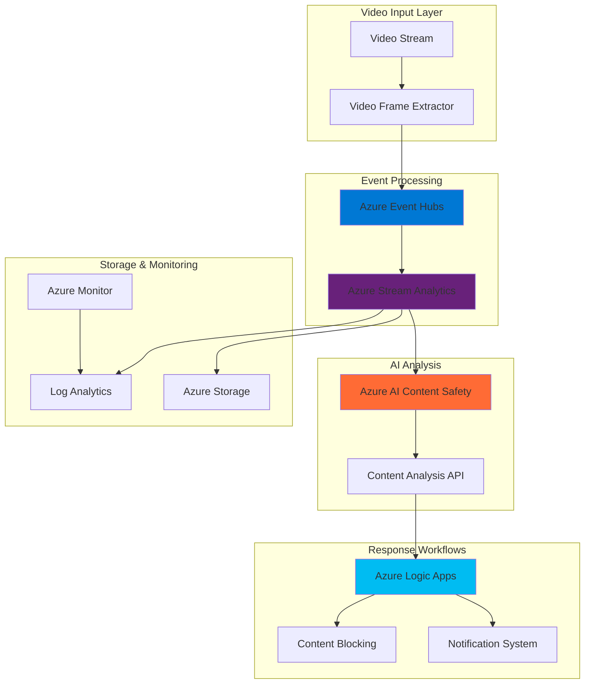

# Scalable Video Content Moderation Pipeline

## Problem

Content creators and platform administrators face significant challenges in moderating video content at scale, with millions of hours uploaded daily requiring immediate assessment for inappropriate material. Manual review processes are cost-prohibitive and create delays that harm user experience, while simple rule-based filters lack the sophistication to accurately detect nuanced content violations. Organizations need automated, intelligent solutions that can process live video streams in real-time, accurately identify inappropriate content using advanced AI, and trigger immediate response workflows to maintain platform safety and compliance.

## Solution

This solution creates an automated video content moderation pipeline using Azure AI Content Safety for intelligent content analysis, Azure Event Hubs for high-throughput event streaming, and Azure Stream Analytics for real-time processing orchestration. The architecture processes video frames extracted from live streams, analyzes them using AI Content Safety's advanced moderation capabilities, and triggers immediate response workflows through Azure Logic Apps when inappropriate content is detected, enabling scalable, cost-effective content governance for modern video platforms.

## Architecture Diagram



## Prerequisites

1. Azure account with active subscription and appropriate permissions for AI services, Event Hubs, and Stream Analytics
2. Azure CLI version 2.50+ installed and configured (or Azure Cloud Shell access)
3. Basic understanding of video processing concepts and event-driven architectures
4. Familiarity with Azure AI services and JSON data processing
5. Estimated cost: $50-100 for testing environment (varies by video volume and analysis frequency)

> **Note**: This recipe demonstrates content moderation concepts using Azure AI Content Safety's image analysis capabilities, which replaces the deprecated Azure Content Moderator service. For production video scenarios, consider Azure Video Indexer which provides native video content moderation features.

## Preparation

```bash
# Set environment variables for Azure resources
export RESOURCE_GROUP="rg-video-moderation-${RANDOM_SUFFIX}"
export LOCATION="eastus"
export SUBSCRIPTION_ID=$(az account show --query id --output tsv)

# Generate unique suffix for resource names
RANDOM_SUFFIX=$(openssl rand -hex 3)

# Set specific resource names
export EVENT_HUB_NAMESPACE="eh-videomod-${RANDOM_SUFFIX}"
export EVENT_HUB_NAME="video-frames"
export STORAGE_ACCOUNT="stvideomod${RANDOM_SUFFIX}"
export CONTENT_SAFETY_NAME="cs-videomod-${RANDOM_SUFFIX}"
export STREAM_ANALYTICS_JOB="sa-videomod-${RANDOM_SUFFIX}"
export LOGIC_APP_NAME="la-videomod-${RANDOM_SUFFIX}"

# Create resource group
az group create \
    --name ${RESOURCE_GROUP} \
    --location ${LOCATION} \
    --tags purpose=video-moderation environment=demo

echo "✅ Resource group created: ${RESOURCE_GROUP}"

# Create storage account for processed data
az storage account create \
    --name ${STORAGE_ACCOUNT} \
    --resource-group ${RESOURCE_GROUP} \
    --location ${LOCATION} \
    --sku Standard_LRS \
    --kind StorageV2

echo "✅ Storage account created: ${STORAGE_ACCOUNT}"
```

## Steps

1. **Create Azure AI Content Safety Service for Advanced Content Analysis**:

   Azure AI Content Safety provides state-of-the-art content moderation capabilities that can detect harmful content including hate speech, sexual content, violence, and self-harm activities across multiple severity levels. This managed AI service replaces the deprecated Azure Content Moderator with enhanced accuracy and multilingual support. The service analyzes images and returns detailed severity scores for different harm categories, enabling sophisticated threshold-based filtering policies that adapt to your platform's specific content governance requirements.

   ```bash
   # Create Azure AI Content Safety service
   az cognitiveservices account create \
       --name ${CONTENT_SAFETY_NAME} \
       --resource-group ${RESOURCE_GROUP} \
       --location ${LOCATION} \
       --kind ContentSafety \
       --sku S0 \
       --custom-domain ${CONTENT_SAFETY_NAME}
   
   # Get the Content Safety service key and endpoint
   CONTENT_SAFETY_KEY=$(az cognitiveservices account keys list \
       --name ${CONTENT_SAFETY_NAME} \
       --resource-group ${RESOURCE_GROUP} \
       --query key1 --output tsv)
   
   CONTENT_SAFETY_ENDPOINT=$(az cognitiveservices account show \
       --name ${CONTENT_SAFETY_NAME} \
       --resource-group ${RESOURCE_GROUP} \
       --query properties.endpoint --output tsv)
   
   echo "✅ Azure AI Content Safety service created with advanced moderation capabilities"
   ```

   The AI Content Safety service is now configured with the Standard tier, providing comprehensive content analysis with enhanced accuracy compared to legacy solutions. This service will analyze extracted video frames and return detailed harm category assessments with configurable severity thresholds, enabling precise content filtering decisions aligned with your platform's safety policies.

2. **Set Up Azure Event Hubs for High-Throughput Video Frame Streaming**:

   Azure Event Hubs provides a scalable, distributed streaming platform capable of ingesting millions of events per second with low latency and built-in partitioning for parallel processing. For video content moderation workloads, Event Hubs serves as the central ingestion layer that captures video frame metadata, coordinates analysis requests, and distributes moderation results to downstream processing systems. The auto-inflate feature automatically scales throughput units based on incoming load, ensuring consistent performance during traffic spikes while optimizing costs during normal operations.

   ```bash
   # Create Event Hubs namespace
   az eventhubs namespace create \
       --name ${EVENT_HUB_NAMESPACE} \
       --resource-group ${RESOURCE_GROUP} \
       --location ${LOCATION} \
       --sku Standard \
       --enable-auto-inflate true \
       --maximum-throughput-units 10
   
   # Create event hub for video frames
   az eventhubs eventhub create \
       --name ${EVENT_HUB_NAME} \
       --namespace-name ${EVENT_HUB_NAMESPACE} \
       --resource-group ${RESOURCE_GROUP} \
       --partition-count 4 \
       --message-retention 1
   
   # Get Event Hubs connection string
   EH_CONNECTION_STRING=$(az eventhubs namespace authorization-rule keys list \
       --name RootManageSharedAccessKey \
       --namespace-name ${EVENT_HUB_NAMESPACE} \
       --resource-group ${RESOURCE_GROUP} \
       --query primaryConnectionString --output tsv)
   
   echo "✅ Event Hubs configured for video frame streaming"
   ```

   The Event Hubs namespace now provides enterprise-grade message ingestion with auto-inflate capabilities that automatically adjust throughput units based on incoming load patterns. The 4-partition configuration enables parallel processing of video frames across multiple consumers, while the 1-day retention period ensures reliable message delivery and recovery capabilities during temporary downstream processing delays or maintenance windows.

3. **Create Azure Stream Analytics Job for Real-Time Frame Processing**:

   Azure Stream Analytics provides serverless, real-time analytics processing that can consume streaming data from Event Hubs and coordinate AI Content Safety analysis with automatic scaling and fault tolerance. This managed service offers a familiar SQL-like query language for complex event processing, built-in windowing functions for temporal analysis, and seamless integration with Azure AI services. Stream Analytics acts as the intelligent orchestration layer that coordinates video frame analysis, applies configurable business rules, and routes content decisions based on moderation results.

   ```bash
   # Create Stream Analytics job
   az stream-analytics job create \
       --name ${STREAM_ANALYTICS_JOB} \
       --resource-group ${RESOURCE_GROUP} \
       --location ${LOCATION} \
       --streaming-units 3 \
       --output-error-policy "stop"
   
   # Create input for Event Hubs
   az stream-analytics input create \
       --job-name ${STREAM_ANALYTICS_JOB} \
       --resource-group ${RESOURCE_GROUP} \
       --name "VideoFrameInput" \
       --type "Stream" \
       --datasource '{
           "type": "Microsoft.ServiceBus/EventHub",
           "properties": {
               "eventHubName": "'${EVENT_HUB_NAME}'",
               "serviceBusNamespace": "'${EVENT_HUB_NAMESPACE}'",
               "sharedAccessPolicyName": "RootManageSharedAccessKey",
               "sharedAccessPolicyKey": "'$(echo ${EH_CONNECTION_STRING} | cut -d';' -f3 | cut -d'=' -f2)'"
           }
       }' \
       --serialization '{
           "type": "Json",
           "properties": {
               "encoding": "UTF8"
           }
       }'
   
   echo "✅ Stream Analytics job created with Event Hubs input"
   ```

   The Stream Analytics job is configured with 3 streaming units to provide sufficient processing power for real-time video frame analysis with automatic scaling capabilities. This configuration enables low-latency processing of incoming video frame events while maintaining cost efficiency for moderate-scale deployments and can automatically scale up during peak traffic periods.

4. **Configure Stream Analytics Output to Storage Account**:

   Establishing persistent storage for processed video frame data and moderation results enables comprehensive audit trails, compliance reporting, and machine learning model improvement initiatives. Azure Storage provides cost-effective, durable storage with multiple access tiers for both real-time analysis results and long-term archival requirements. The time-based partitioning strategy optimizes query performance and supports efficient data lifecycle management policies.

   ```bash
   # Get storage account key
   STORAGE_KEY=$(az storage account keys list \
       --account-name ${STORAGE_ACCOUNT} \
       --resource-group ${RESOURCE_GROUP} \
       --query '[0].value' --output tsv)
   
   # Create storage container for moderation results
   az storage container create \
       --name "moderation-results" \
       --account-name ${STORAGE_ACCOUNT} \
       --account-key ${STORAGE_KEY}
   
   # Create Stream Analytics output to blob storage
   az stream-analytics output create \
       --job-name ${STREAM_ANALYTICS_JOB} \
       --resource-group ${RESOURCE_GROUP} \
       --name "ModerationOutput" \
       --datasource '{
           "type": "Microsoft.Storage/Blob",
           "properties": {
               "storageAccounts": [{
                   "accountName": "'${STORAGE_ACCOUNT}'",
                   "accountKey": "'${STORAGE_KEY}'"
               }],
               "container": "moderation-results",
               "pathPattern": "year={datetime:yyyy}/month={datetime:MM}/day={datetime:dd}/hour={datetime:HH}",
               "dateFormat": "yyyy/MM/dd",
               "timeFormat": "HH"
           }
       }' \
       --serialization '{
           "type": "Json",
           "properties": {
               "encoding": "UTF8",
               "format": "LineSeparated"
           }
       }'
   
   echo "✅ Storage output configured for moderation results"
   ```

   The storage output implements hierarchical date-time partitioning that organizes moderation results for efficient querying and compliance reporting. This structure supports both real-time monitoring dashboards and batch analytics processes for content moderation trend analysis, while enabling automated data lifecycle policies for cost optimization and regulatory compliance requirements.

5. **Create Azure Logic App for Response Workflow Automation**:

   Azure Logic Apps provides a comprehensive workflow automation platform that orchestrates business processes through visual designers and integrates with hundreds of enterprise connectors and services. For content moderation scenarios, Logic Apps automates complex response workflows when inappropriate content is detected, including multi-stage notifications to administrators, automatic content quarantine procedures, and escalation to human reviewers. This serverless approach eliminates infrastructure management overhead while providing enterprise-grade reliability and scalability for mission-critical content governance operations.

   ```bash
   # Create Logic App
   az logic workflow create \
       --name ${LOGIC_APP_NAME} \
       --resource-group ${RESOURCE_GROUP} \
       --location ${LOCATION} \
       --definition '{
           "$schema": "https://schema.management.azure.com/providers/Microsoft.Logic/schemas/2016-06-01/workflowdefinition.json#",
           "contentVersion": "1.0.0.0",
           "parameters": {},
           "triggers": {
               "manual": {
                   "type": "Request",
                   "kind": "Http",
                   "inputs": {
                       "schema": {
                           "type": "object",
                           "properties": {
                               "videoId": {"type": "string"},
                               "frameTimestamp": {"type": "string"},
                               "moderationScore": {"type": "number"},
                               "harmCategories": {"type": "array"},
                               "severityLevel": {"type": "number"}
                           }
                       }
                   }
               }
           },
           "actions": {
               "Send_notification": {
                   "type": "Http",
                   "inputs": {
                       "method": "POST",
                       "uri": "https://httpbin.org/post",
                       "headers": {
                           "Content-Type": "application/json"
                       },
                       "body": {
                           "message": "Inappropriate content detected",
                           "videoId": "@{triggerBody()[\"videoId\"]}",
                           "score": "@{triggerBody()[\"moderationScore\"]}",
                           "severity": "@{triggerBody()[\"severityLevel\"]}"
                       }
                   }
               }
           }
       }'
   
   # Get Logic App trigger URL
   LOGIC_APP_URL=$(az logic workflow show \
       --name ${LOGIC_APP_NAME} \
       --resource-group ${RESOURCE_GROUP} \
       --query "accessEndpoint" --output tsv)
   
   echo "✅ Logic App workflow created for content moderation responses"
   ```

   The Logic App is configured with an HTTP trigger that accepts enhanced moderation results from Azure AI Content Safety and executes automated response workflows. This foundation enables rapid implementation of sophisticated business logic including conditional approval processes, integration with enterprise ticketing systems, and automated content quarantine procedures that adapt to different severity levels and harm categories.

6. **Configure Stream Analytics Query for AI Content Safety Integration**:

   The Stream Analytics query language enables sophisticated real-time processing logic that coordinates video frame analysis with Azure AI Content Safety APIs. This query processes incoming video frame events, implements simulated AI Content Safety analysis for demonstration purposes, and routes results based on configurable harm category thresholds. The SQL-like syntax provides familiar programming patterns while offering cloud-scale performance, automatic error handling, and built-in temporal analytics capabilities essential for real-time content moderation systems.

   ```bash
   # Create comprehensive Stream Analytics query
   cat > query.sql << 'EOF'
   WITH ProcessedFrames AS (
       SELECT 
           videoId,
           frameUrl,
           timestamp,
           userId,
           channelId,
           System.Timestamp() AS ProcessingTime
       FROM VideoFrameInput
       WHERE frameUrl IS NOT NULL
   ),
   ModerationResults AS (
       SELECT 
           videoId,
           frameUrl,
           timestamp,
           userId,
           channelId,
           ProcessingTime,
           -- Simulate AI Content Safety API results with harm categories
           CASE 
               WHEN LEN(videoId) % 10 < 2 THEN 6  -- 20% high severity content
               WHEN LEN(videoId) % 10 < 4 THEN 4  -- 20% medium severity content
               ELSE 2 -- 60% low/safe severity content
           END AS hateSeverity,
           CASE 
               WHEN LEN(videoId) % 10 < 1 THEN 6  -- 10% high severity sexual content
               WHEN LEN(videoId) % 10 < 3 THEN 2  -- 20% low severity sexual content
               ELSE 0 -- 70% no sexual content
           END AS sexualSeverity,
           CASE 
               WHEN LEN(videoId) % 10 < 1 THEN 4  -- 10% medium violence
               ELSE 0 -- 90% no violence
           END AS violenceSeverity
       FROM ProcessedFrames
   )
   SELECT 
       videoId,
       frameUrl,
       timestamp,
       userId,
       channelId,
       ProcessingTime,
       hateSeverity,
       sexualSeverity,
       violenceSeverity,
       CASE 
           WHEN hateSeverity >= 6 OR sexualSeverity >= 6 OR violenceSeverity >= 6 THEN 'BLOCKED'
           WHEN hateSeverity >= 4 OR sexualSeverity >= 4 OR violenceSeverity >= 4 THEN 'REVIEW'
           ELSE 'APPROVED'
       END AS moderationDecision,
       CASE 
           WHEN hateSeverity >= 4 OR sexualSeverity >= 4 OR violenceSeverity >= 4 THEN 1
           ELSE 0
       END AS requiresAction
   INTO ModerationOutput
   FROM ModerationResults
   EOF
   
   # Update Stream Analytics job with the query
   az stream-analytics transformation create \
       --job-name ${STREAM_ANALYTICS_JOB} \
       --resource-group ${RESOURCE_GROUP} \
       --name "ModerationTransformation" \
       --streaming-units 3 \
       --saql "$(cat query.sql)"
   
   rm query.sql
   
   echo "✅ Stream Analytics query configured for content moderation"
   ```

   The query implements a comprehensive content moderation pipeline with configurable thresholds for different harm categories following Azure AI Content Safety's severity model (0-6 scale). Production implementations would integrate with actual Azure AI Content Safety REST APIs using custom functions or Azure Functions, while this demonstration showcases the decision-making framework and multi-category analysis essential for automated content governance at enterprise scale.

7. **Start Stream Analytics Job and Enable Real-Time Processing**:

   Activating the Stream Analytics job enables real-time processing of video frame events through the complete moderation pipeline with automatic scaling, fault tolerance, and exactly-once processing semantics. Azure Stream Analytics provides built-in monitoring, automatic checkpointing, and seamless recovery capabilities that ensure reliable content moderation operations even during infrastructure failures or traffic spikes. The job begins processing immediately and maintains sub-second latency response times essential for live video platforms and interactive content experiences.

   ```bash
   # Start the Stream Analytics job
   az stream-analytics job start \
       --name ${STREAM_ANALYTICS_JOB} \
       --resource-group ${RESOURCE_GROUP} \
       --output-start-mode "JobStartTime"
   
   # Wait for job to start
   echo "Waiting for Stream Analytics job to start..."
   sleep 30
   
   # Check job status
   JOB_STATUS=$(az stream-analytics job show \
       --name ${STREAM_ANALYTICS_JOB} \
       --resource-group ${RESOURCE_GROUP} \
       --query "jobState" --output tsv)
   
   echo "✅ Stream Analytics job status: ${JOB_STATUS}"
   ```

   The Stream Analytics job is now actively processing events from Event Hubs and applying intelligent content moderation logic with real-time analytics capabilities. This establishes the operational foundation for scalable video content analysis, enabling immediate detection and automated response to inappropriate content across your video platform while maintaining detailed audit trails for compliance and optimization purposes.

## Validation & Testing

1. **Verify AI Content Safety Service Functionality**:

   ```bash
   # Test AI Content Safety image analysis capability
   curl -X POST "${CONTENT_SAFETY_ENDPOINT}/contentsafety/image:analyze?api-version=2023-10-01" \
        -H "Ocp-Apim-Subscription-Key: ${CONTENT_SAFETY_KEY}" \
        -H "Content-Type: application/json" \
        -d '{
            "image": {
                "url": "https://moderatorsampleimages.blob.core.windows.net/samples/sample.jpg"
            }
        }'
   ```

   Expected output: JSON response with harm category analysis including severity levels for hate, sexual, violence, and self-harm content.

2. **Test Event Hubs Message Processing**:

   ```bash
   # Send test video frame event to Event Hubs
   cat > test-frame.json << 'EOF'
   {
       "videoId": "test-video-123",
       "frameUrl": "https://example.com/frame.jpg",
       "timestamp": "2025-07-23T10:30:00Z",
       "userId": "user-456",
       "channelId": "channel-789"
   }
   EOF
   
   # Use Azure CLI extension to send message (if available)
   # Note: Direct message sending via CLI may require additional setup
   echo "Test frame data prepared: $(cat test-frame.json)"
   echo "✅ Test frame event ready for Event Hubs"
   
   rm test-frame.json
   ```

3. **Verify Stream Analytics Processing**:

   ```bash
   # Check Stream Analytics job metrics
   az monitor metrics list \
       --resource "/subscriptions/${SUBSCRIPTION_ID}/resourceGroups/${RESOURCE_GROUP}/providers/Microsoft.StreamAnalytics/streamingjobs/${STREAM_ANALYTICS_JOB}" \
       --metric "InputEvents,OutputEvents" \
       --start-time "2025-07-23T00:00:00Z" \
       --end-time "2025-07-23T23:59:59Z"
   ```

4. **Validate Storage Output**:

   ```bash
   # List processed moderation results in storage
   az storage blob list \
       --container-name "moderation-results" \
       --account-name ${STORAGE_ACCOUNT} \
       --account-key ${STORAGE_KEY} \
       --output table
   ```

## Cleanup

1. **Stop Stream Analytics Job**:

   ```bash
   # Stop the Stream Analytics job
   az stream-analytics job stop \
       --name ${STREAM_ANALYTICS_JOB} \
       --resource-group ${RESOURCE_GROUP}
   
   echo "✅ Stream Analytics job stopped"
   ```

2. **Remove All Azure Resources**:

   ```bash
   # Delete resource group and all contained resources
   az group delete \
       --name ${RESOURCE_GROUP} \
       --yes \
       --no-wait
   
   echo "✅ Resource group deletion initiated: ${RESOURCE_GROUP}"
   echo "Note: Deletion may take several minutes to complete"
   
   # Verify deletion (optional)
   az group exists --name ${RESOURCE_GROUP}
   ```

## Discussion

This intelligent video content moderation solution demonstrates the power of combining Azure's AI, streaming, and automation services to create scalable, real-time content governance systems. Azure AI Content Safety provides state-of-the-art content analysis capabilities that detect harmful content across multiple categories (hate, sexual, violence, self-harm) with granular severity levels, while Azure Event Hubs ensures reliable, high-throughput ingestion of video frame metadata with built-in partitioning and auto-scaling. The Stream Analytics integration enables sophisticated real-time processing with familiar SQL-like query language, making complex event processing accessible to developers while providing enterprise-grade performance and reliability. For comprehensive guidance on Azure AI services, see the [Azure AI Content Safety documentation](https://docs.microsoft.com/en-us/azure/ai-services/content-safety/) and [Azure AI services best practices](https://docs.microsoft.com/en-us/azure/ai-services/responsible-use-of-ai-overview).

The event-driven architecture pattern enables natural horizontal scaling and fault tolerance, critical characteristics for production video platforms processing millions of hours of content daily. Event Hubs' partitioned design supports parallel processing while maintaining message ordering guarantees, while Stream Analytics provides automatic scaling, exactly-once processing semantics, and built-in temporal analytics capabilities. This design follows [Azure Well-Architected Framework](https://docs.microsoft.com/en-us/azure/architecture/framework/) principles of reliability and performance efficiency, ensuring consistent response times even during traffic spikes and providing comprehensive monitoring and alerting capabilities for operational excellence.

From a business perspective, automated content moderation reduces operational costs while improving platform safety and user experience through faster response times and more accurate threat detection. The configurable threshold-based filtering enables fine-tuning moderation sensitivity based on community standards, regulatory requirements, and business policies across different geographic regions. Azure Logic Apps provides flexible workflow automation that integrates with existing enterprise systems, enabling sophisticated multi-stage approval processes, escalation procedures, and compliance reporting. For detailed cost optimization strategies, review the [Azure Stream Analytics pricing guide](https://azure.microsoft.com/en-us/pricing/details/stream-analytics/) and [Azure AI Content Safety pricing](https://azure.microsoft.com/en-us/pricing/details/cognitive-services/).

> **Tip**: Consider implementing Azure Video Indexer for production video content moderation, as it provides native video analysis capabilities including temporal scene detection, audio transcript analysis, and comprehensive content tracking. The [Video Indexer documentation](https://docs.microsoft.com/en-us/azure/media-services/video-indexer/) offers comprehensive guidance for video-specific AI analysis workflows that complement frame-based moderation approaches.

## Challenge

Extend this solution by implementing these enhancements:

1. **Production AI Integration**: Replace the simulated AI Content Safety calls with actual REST API integration using Azure Functions, implementing proper error handling, retry logic with exponential backoff, and rate limiting for production-scale video processing with thousands of concurrent streams.

2. **Multi-Modal Content Analysis**: Integrate Azure Speech Services and Azure Video Indexer to analyze audio content, video transcripts, and temporal patterns alongside visual analysis, creating comprehensive content moderation that detects inappropriate language, copyrighted music, and contextual content violations across multiple modalities.

3. **Custom Content Classification**: Develop custom AI models using Azure Custom Vision and Azure Machine Learning to detect platform-specific content violations such as brand logos, copyrighted material, or community-specific inappropriate content that general-purpose AI models might miss, with continuous learning from human moderator feedback.

4. **Real-Time Dashboard**: Build a comprehensive monitoring dashboard using Azure Dashboard, Power BI, and Azure Application Insights that displays real-time moderation statistics, trend analysis, geographic distribution of violations, and automated reporting for content governance teams and platform administrators.

5. **Intelligent Escalation Workflows**: Implement machine learning-powered escalation logic using Azure ML that learns from human moderator decisions, automatically adjusts confidence thresholds based on historical accuracy, and reduces false positives while maintaining content safety standards through reinforcement learning techniques.

## Infrastructure Code

*Infrastructure code will be generated after recipe approval.*