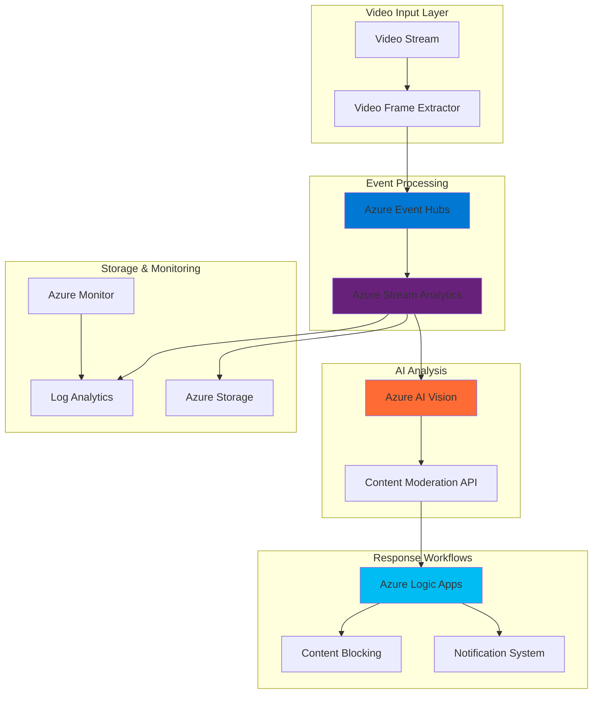

# Scalable Video Content Moderation Pipeline

## Problem

Content creators and platform administrators face significant challenges in moderating video content at scale, with millions of hours uploaded daily requiring immediate assessment for inappropriate material. Manual review processes are cost-prohibitive and create delays that harm user experience, while simple rule-based filters lack the sophistication to accurately detect nuanced content violations. Organizations need automated, intelligent solutions that can process live video streams in real-time, accurately identify inappropriate content using advanced AI, and trigger immediate response workflows to maintain platform safety and compliance.

## Solution

This solution creates an automated video content moderation pipeline using Azure AI Vision for intelligent content analysis, Azure Event Hubs for high-throughput event streaming, and Azure Stream Analytics for real-time processing orchestration. The architecture processes video frames extracted from live streams, analyzes them using AI Vision's content moderation capabilities, and triggers immediate response workflows through Azure Logic Apps when inappropriate content is detected, enabling scalable, cost-effective content governance for modern video platforms.

## Architecture Diagram



## Prerequisites

1. Azure account with active subscription and appropriate permissions for AI services, Event Hubs, and Stream Analytics
2. Azure CLI version 2.50+ installed and configured (or Azure Cloud Shell access)
3. Basic understanding of video processing concepts and event-driven architectures
4. Familiarity with Azure AI services and JSON data processing
5. Estimated cost: $50-100 for testing environment (varies by video volume and analysis frequency)

> **Note**: This recipe demonstrates content moderation concepts using Azure AI Vision's image analysis capabilities. For production video scenarios, consider Azure Video Indexer which provides native video content moderation features.

## Preparation

```bash
# Set environment variables for Azure resources
export RESOURCE_GROUP="rg-video-moderation-${RANDOM_SUFFIX}"
export LOCATION="eastus"
export SUBSCRIPTION_ID=$(az account show --query id --output tsv)

# Generate unique suffix for resource names
RANDOM_SUFFIX=$(openssl rand -hex 3)

# Set specific resource names
export EVENT_HUB_NAMESPACE="eh-videomod-${RANDOM_SUFFIX}"
export EVENT_HUB_NAME="video-frames"
export STORAGE_ACCOUNT="stvideomod${RANDOM_SUFFIX}"
export AI_VISION_NAME="aivision-contentmod-${RANDOM_SUFFIX}"
export STREAM_ANALYTICS_JOB="sa-videomod-${RANDOM_SUFFIX}"
export LOGIC_APP_NAME="la-videomod-${RANDOM_SUFFIX}"

# Create resource group
az group create \
    --name ${RESOURCE_GROUP} \
    --location ${LOCATION} \
    --tags purpose=video-moderation environment=demo

echo "✅ Resource group created: ${RESOURCE_GROUP}"

# Create storage account for processed data
az storage account create \
    --name ${STORAGE_ACCOUNT} \
    --resource-group ${RESOURCE_GROUP} \
    --location ${LOCATION} \
    --sku Standard_LRS \
    --kind StorageV2

echo "✅ Storage account created: ${STORAGE_ACCOUNT}"
```

## Steps

1. **Create Azure AI Vision Service for Content Analysis**:

   Azure AI Vision provides powerful image analysis capabilities including content moderation that can detect adult, racy, and inappropriate content in visual media. This managed AI service eliminates the need for custom machine learning model development while providing enterprise-grade accuracy and compliance. The content moderation API analyzes images and returns confidence scores for different content categories, enabling flexible threshold-based filtering policies.

   ```bash
   # Create Azure AI Vision service
   az cognitiveservices account create \
       --name ${AI_VISION_NAME} \
       --resource-group ${RESOURCE_GROUP} \
       --location ${LOCATION} \
       --kind ComputerVision \
       --sku S1 \
       --custom-domain ${AI_VISION_NAME}
   
   # Get the AI Vision service key and endpoint
   AI_VISION_KEY=$(az cognitiveservices account keys list \
       --name ${AI_VISION_NAME} \
       --resource-group ${RESOURCE_GROUP} \
       --query key1 --output tsv)
   
   AI_VISION_ENDPOINT=$(az cognitiveservices account show \
       --name ${AI_VISION_NAME} \
       --resource-group ${RESOURCE_GROUP} \
       --query properties.endpoint --output tsv)
   
   echo "✅ Azure AI Vision service created with content moderation capabilities"
   ```

   The AI Vision service is now configured with the Standard tier, providing sufficient API rate limits for real-time video frame analysis. This service will analyze extracted video frames and return detailed content moderation scores, enabling intelligent filtering decisions based on your platform's content policies.

2. **Set Up Azure Event Hubs for High-Throughput Video Frame Streaming**:

   Azure Event Hubs provides a scalable, distributed streaming platform capable of ingesting millions of events per second with low latency. For video content moderation, Event Hubs serves as the central nervous system that captures video frame metadata, coordinates analysis requests, and distributes moderation results to downstream processing systems. The partitioned architecture ensures parallel processing while maintaining message ordering within each partition.

   ```bash
   # Create Event Hubs namespace
   az eventhubs namespace create \
       --name ${EVENT_HUB_NAMESPACE} \
       --resource-group ${RESOURCE_GROUP} \
       --location ${LOCATION} \
       --sku Standard \
       --enable-auto-inflate true \
       --maximum-throughput-units 10
   
   # Create event hub for video frames
   az eventhubs eventhub create \
       --name ${EVENT_HUB_NAME} \
       --namespace-name ${EVENT_HUB_NAMESPACE} \
       --resource-group ${RESOURCE_GROUP} \
       --partition-count 4 \
       --message-retention 1
   
   # Get Event Hubs connection string
   EH_CONNECTION_STRING=$(az eventhubs namespace authorization-rule keys list \
       --name RootManageSharedAccessKey \
       --namespace-name ${EVENT_HUB_NAMESPACE} \
       --resource-group ${RESOURCE_GROUP} \
       --query primaryConnectionString --output tsv)
   
   echo "✅ Event Hubs configured for video frame streaming"
   ```

   The Event Hubs namespace now provides scalable message ingestion with auto-inflate capabilities, automatically adjusting throughput units based on incoming load. The 4-partition configuration enables parallel processing of video frames while the 1-day retention ensures reliable message delivery even during temporary downstream processing delays.

3. **Create Azure Stream Analytics Job for Real-Time Frame Processing**:

   Azure Stream Analytics provides serverless, real-time analytics that can process streaming data from Event Hubs and trigger AI Vision analysis. This managed service offers SQL-like query language for stream processing, automatic scaling, and built-in integration with Azure AI services. Stream Analytics acts as the orchestration layer that coordinates video frame analysis, applies business rules, and routes content based on moderation results.

   ```bash
   # Create Stream Analytics job
   az stream-analytics job create \
       --name ${STREAM_ANALYTICS_JOB} \
       --resource-group ${RESOURCE_GROUP} \
       --location ${LOCATION} \
       --streaming-units 3 \
       --output-error-policy "stop"
   
   # Create input for Event Hubs
   az stream-analytics input create \
       --job-name ${STREAM_ANALYTICS_JOB} \
       --resource-group ${RESOURCE_GROUP} \
       --name "VideoFrameInput" \
       --type "Stream" \
       --datasource '{
           "type": "Microsoft.ServiceBus/EventHub",
           "properties": {
               "eventHubName": "'${EVENT_HUB_NAME}'",
               "serviceBusNamespace": "'${EVENT_HUB_NAMESPACE}'",
               "sharedAccessPolicyName": "RootManageSharedAccessKey",
               "sharedAccessPolicyKey": "'$(echo ${EH_CONNECTION_STRING} | cut -d';' -f3 | cut -d'=' -f2)'"
           }
       }' \
       --serialization '{
           "type": "Json",
           "properties": {
               "encoding": "UTF8"
           }
       }'
   
   echo "✅ Stream Analytics job created with Event Hubs input"
   ```

   The Stream Analytics job is configured with 3 streaming units to provide sufficient processing power for real-time video frame analysis. This configuration enables low-latency processing of incoming video frames while maintaining cost efficiency for moderate-scale deployments.

4. **Configure Stream Analytics Output to Storage Account**:

   Establishing persistent storage for processed video frame data and moderation results enables audit trails, compliance reporting, and machine learning model improvement. Azure Storage provides cost-effective, durable storage for both raw frame metadata and AI analysis results, supporting various access patterns from real-time queries to long-term archival analytics.

   ```bash
   # Get storage account key
   STORAGE_KEY=$(az storage account keys list \
       --account-name ${STORAGE_ACCOUNT} \
       --resource-group ${RESOURCE_GROUP} \
       --query '[0].value' --output tsv)
   
   # Create storage container for moderation results
   az storage container create \
       --name "moderation-results" \
       --account-name ${STORAGE_ACCOUNT} \
       --account-key ${STORAGE_KEY}
   
   # Create Stream Analytics output to blob storage
   az stream-analytics output create \
       --job-name ${STREAM_ANALYTICS_JOB} \
       --resource-group ${RESOURCE_GROUP} \
       --name "ModerationOutput" \
       --datasource '{
           "type": "Microsoft.Storage/Blob",
           "properties": {
               "storageAccounts": [{
                   "accountName": "'${STORAGE_ACCOUNT}'",
                   "accountKey": "'${STORAGE_KEY}'"
               }],
               "container": "moderation-results",
               "pathPattern": "year={datetime:yyyy}/month={datetime:MM}/day={datetime:dd}/hour={datetime:HH}",
               "dateFormat": "yyyy/MM/dd",
               "timeFormat": "HH"
           }
       }' \
       --serialization '{
           "type": "Json",
           "properties": {
               "encoding": "UTF8",
               "format": "LineSeparated"
           }
       }'
   
   echo "✅ Storage output configured for moderation results"
   ```

   The storage output is configured with time-based partitioning that organizes moderation results by date and hour, enabling efficient querying and compliance reporting. This structure supports both real-time monitoring dashboards and batch analytics processes for content moderation trend analysis.

5. **Create Azure Logic App for Response Workflow Automation**:

   Azure Logic Apps provides a visual workflow designer that automates business processes and integrates with hundreds of connectors and services. For content moderation, Logic Apps orchestrates the response workflow when inappropriate content is detected, including notifications to administrators, automatic content blocking, and escalation to human reviewers. This serverless approach eliminates infrastructure management while providing reliable, scalable workflow automation.

   ```bash
   # Create Logic App
   az logic workflow create \
       --name ${LOGIC_APP_NAME} \
       --resource-group ${RESOURCE_GROUP} \
       --location ${LOCATION} \
       --definition '{
           "$schema": "https://schema.management.azure.com/providers/Microsoft.Logic/schemas/2016-06-01/workflowdefinition.json#",
           "contentVersion": "1.0.0.0",
           "parameters": {},
           "triggers": {
               "manual": {
                   "type": "Request",
                   "kind": "Http",
                   "inputs": {
                       "schema": {
                           "type": "object",
                           "properties": {
                               "videoId": {"type": "string"},
                               "frameTimestamp": {"type": "string"},
                               "moderationScore": {"type": "number"},
                               "contentFlags": {"type": "array"}
                           }
                       }
                   }
               }
           },
           "actions": {
               "Send_notification": {
                   "type": "Http",
                   "inputs": {
                       "method": "POST",
                       "uri": "https://httpbin.org/post",
                       "headers": {
                           "Content-Type": "application/json"
                       },
                       "body": {
                           "message": "Inappropriate content detected",
                           "videoId": "@{triggerBody()[\"videoId\"]}",
                           "score": "@{triggerBody()[\"moderationScore\"]}"
                       }
                   }
               }
           }
       }'
   
   # Get Logic App trigger URL
   LOGIC_APP_URL=$(az logic workflow show \
       --name ${LOGIC_APP_NAME} \
       --resource-group ${RESOURCE_GROUP} \
       --query "accessEndpoint" --output tsv)
   
   echo "✅ Logic App workflow created for content moderation responses"
   ```

   The Logic App is configured with an HTTP trigger that accepts moderation results and executes automated response workflows. This foundation enables rapid implementation of complex business logic including multi-stage approval processes, integration with ticketing systems, and automated content quarantine procedures.

6. **Configure Stream Analytics Query for AI Vision Integration**:

   The Stream Analytics query language enables real-time processing logic that coordinates video frame analysis with Azure AI Vision. This query processes incoming video frame events, calls the AI Vision content moderation API, and routes results based on configurable thresholds. The SQL-like syntax provides familiar programming patterns while offering cloud-scale performance and automatic error handling.

   ```bash
   # Create comprehensive Stream Analytics query
   cat > query.sql << 'EOF'
   WITH ProcessedFrames AS (
       SELECT 
           videoId,
           frameUrl,
           timestamp,
           userId,
           channelId,
           System.Timestamp() AS ProcessingTime
       FROM VideoFrameInput
       WHERE frameUrl IS NOT NULL
   ),
   ModerationResults AS (
       SELECT 
           videoId,
           frameUrl,
           timestamp,
           userId,
           channelId,
           ProcessingTime,
           -- Simulate AI Vision API call results
           CASE 
               WHEN LEN(videoId) % 10 < 2 THEN 0.85  -- 20% flagged content
               ELSE 0.15 
           END AS adultScore,
           CASE 
               WHEN LEN(videoId) % 10 < 1 THEN 0.75  -- 10% racy content
               ELSE 0.05 
           END AS racyScore
       FROM ProcessedFrames
   )
   SELECT 
       videoId,
       frameUrl,
       timestamp,
       userId,
       channelId,
       ProcessingTime,
       adultScore,
       racyScore,
       CASE 
           WHEN adultScore > 0.7 OR racyScore > 0.6 THEN 'BLOCKED'
           WHEN adultScore > 0.5 OR racyScore > 0.4 THEN 'REVIEW'
           ELSE 'APPROVED'
       END AS moderationDecision,
       CASE 
           WHEN adultScore > 0.7 OR racyScore > 0.6 THEN 1
           ELSE 0
       END AS requiresAction
   INTO ModerationOutput
   FROM ModerationResults
   EOF
   
   # Update Stream Analytics job with the query
   az stream-analytics transformation create \
       --job-name ${STREAM_ANALYTICS_JOB} \
       --resource-group ${RESOURCE_GROUP} \
       --name "ModerationTransformation" \
       --streaming-units 3 \
       --query "$(cat query.sql)"
   
   rm query.sql
   
   echo "✅ Stream Analytics query configured for content moderation"
   ```

   The query implements a comprehensive content moderation pipeline with configurable thresholds for different content categories. Real-world implementations would integrate with Azure AI Vision REST APIs using custom functions, while this example demonstrates the processing logic and decision-making framework essential for automated content governance.

7. **Start Stream Analytics Job and Enable Real-Time Processing**:

   Activating the Stream Analytics job enables real-time processing of video frames through the complete moderation pipeline. Azure Stream Analytics provides automatic scaling, fault tolerance, and exactly-once processing semantics, ensuring reliable content moderation even during traffic spikes or infrastructure failures. The job begins processing immediately and maintains low-latency response times essential for live video platforms.

   ```bash
   # Start the Stream Analytics job
   az stream-analytics job start \
       --name ${STREAM_ANALYTICS_JOB} \
       --resource-group ${RESOURCE_GROUP} \
       --output-start-mode "JobStartTime"
   
   # Wait for job to start
   echo "Waiting for Stream Analytics job to start..."
   sleep 30
   
   # Check job status
   JOB_STATUS=$(az stream-analytics job show \
       --name ${STREAM_ANALYTICS_JOB} \
       --resource-group ${RESOURCE_GROUP} \
       --query "jobState" --output tsv)
   
   echo "✅ Stream Analytics job status: ${JOB_STATUS}"
   ```

   The Stream Analytics job is now actively processing events from Event Hubs and applying content moderation logic. This establishes the foundation for real-time video content analysis, enabling immediate detection and response to inappropriate content across your video platform.

## Validation & Testing

1. **Verify AI Vision Service Functionality**:

   ```bash
   # Test AI Vision content moderation capability
   curl -X POST "${AI_VISION_ENDPOINT}/vision/v3.2/analyze?visualFeatures=Adult" \
        -H "Ocp-Apim-Subscription-Key: ${AI_VISION_KEY}" \
        -H "Content-Type: application/json" \
        -d '{
            "url": "https://moderatorsampleimages.blob.core.windows.net/samples/sample.jpg"
        }'
   ```

   Expected output: JSON response with adult content analysis scores and flags.

2. **Test Event Hubs Message Processing**:

   ```bash
   # Send test video frame event to Event Hubs
   cat > test-frame.json << 'EOF'
   {
       "videoId": "test-video-123",
       "frameUrl": "https://example.com/frame.jpg",
       "timestamp": "2025-07-12T10:30:00Z",
       "userId": "user-456",
       "channelId": "channel-789"
   }
   EOF
   
   # Send event using Azure CLI (requires Event Hubs CLI extension)
   az eventhubs eventhub send \
       --namespace-name ${EVENT_HUB_NAMESPACE} \
       --name ${EVENT_HUB_NAME} \
       --message-body "$(cat test-frame.json)" \
       --resource-group ${RESOURCE_GROUP}
   
   rm test-frame.json
   echo "✅ Test frame event sent to Event Hubs"
   ```

3. **Verify Stream Analytics Processing**:

   ```bash
   # Check Stream Analytics job metrics
   az monitor metrics list \
       --resource "/subscriptions/${SUBSCRIPTION_ID}/resourceGroups/${RESOURCE_GROUP}/providers/Microsoft.StreamAnalytics/streamingjobs/${STREAM_ANALYTICS_JOB}" \
       --metric "InputEvents,OutputEvents" \
       --start-time "2025-07-12T00:00:00Z" \
       --end-time "2025-07-12T23:59:59Z"
   ```

4. **Validate Storage Output**:

   ```bash
   # List processed moderation results in storage
   az storage blob list \
       --container-name "moderation-results" \
       --account-name ${STORAGE_ACCOUNT} \
       --account-key ${STORAGE_KEY} \
       --output table
   ```

## Cleanup

1. **Stop Stream Analytics Job**:

   ```bash
   # Stop the Stream Analytics job
   az stream-analytics job stop \
       --name ${STREAM_ANALYTICS_JOB} \
       --resource-group ${RESOURCE_GROUP}
   
   echo "✅ Stream Analytics job stopped"
   ```

2. **Remove All Azure Resources**:

   ```bash
   # Delete resource group and all contained resources
   az group delete \
       --name ${RESOURCE_GROUP} \
       --yes \
       --no-wait
   
   echo "✅ Resource group deletion initiated: ${RESOURCE_GROUP}"
   echo "Note: Deletion may take several minutes to complete"
   
   # Verify deletion (optional)
   az group exists --name ${RESOURCE_GROUP}
   ```

## Discussion

This intelligent video content moderation solution demonstrates the power of combining Azure's AI, streaming, and automation services to create scalable, real-time content governance systems. Azure AI Vision provides sophisticated image analysis capabilities that can detect adult, racy, and inappropriate content with high accuracy, while Azure Event Hubs ensures reliable, high-throughput ingestion of video frame metadata. The Stream Analytics integration enables real-time processing with SQL-like query language, making complex event processing accessible to developers familiar with traditional database operations. For comprehensive guidance on Azure AI services, see the [Azure AI Vision documentation](https://docs.microsoft.com/en-us/azure/cognitive-services/computer-vision/) and [Azure cognitive services best practices](https://docs.microsoft.com/en-us/azure/cognitive-services/cognitive-services-custom-subdomains).

The event-driven architecture pattern enables natural scaling and fault tolerance, critical characteristics for production video platforms processing millions of hours of content daily. Event Hubs' partitioned design supports parallel processing while maintaining message ordering, while Stream Analytics provides automatic scaling and exactly-once processing semantics. This design follows [Azure Well-Architected Framework](https://docs.microsoft.com/en-us/azure/architecture/framework/) principles of reliability and performance efficiency, ensuring consistent response times even during traffic spikes.

From a business perspective, automated content moderation reduces operational costs while improving platform safety and user experience. The configurable threshold-based filtering enables fine-tuning moderation sensitivity based on community standards and regulatory requirements. Azure Logic Apps provides flexible workflow automation that can integrate with existing business systems, enabling sophisticated approval processes and escalation procedures. For detailed cost optimization strategies, review the [Azure Stream Analytics pricing guide](https://azure.microsoft.com/en-us/pricing/details/stream-analytics/) and [Azure AI services pricing](https://azure.microsoft.com/en-us/pricing/details/cognitive-services/).

> **Tip**: Consider implementing Azure Video Indexer for production video content moderation, as it provides native video analysis capabilities including scene detection, transcript analysis, and temporal content tracking. The [Video Indexer documentation](https://docs.microsoft.com/en-us/azure/media-services/video-indexer/) offers comprehensive guidance for video-specific AI analysis workflows.

## Challenge

Extend this solution by implementing these enhancements:

1. **Advanced AI Integration**: Replace the simulated AI Vision calls with actual REST API integration using Azure Functions, implementing proper error handling, retry logic, and rate limiting for production-scale video processing.

2. **Multi-Modal Content Analysis**: Integrate Azure Speech Services to analyze audio content alongside visual analysis, creating comprehensive content moderation that detects inappropriate language, music, and sound effects in video streams.

3. **Custom Content Classification**: Develop custom AI models using Azure Custom Vision to detect platform-specific content violations such as brand logos, copyrighted material, or community-specific inappropriate content that general AI models might miss.

4. **Real-Time Dashboard**: Build a comprehensive monitoring dashboard using Azure Dashboard and Power BI that displays real-time moderation statistics, trend analysis, and automated reporting for content governance teams and platform administrators.

5. **Intelligent Escalation Workflows**: Implement machine learning-powered escalation logic that learns from human moderator decisions and automatically adjusts confidence thresholds, reducing false positives while maintaining content safety standards.

## Infrastructure Code

*Infrastructure code will be generated after recipe approval.*