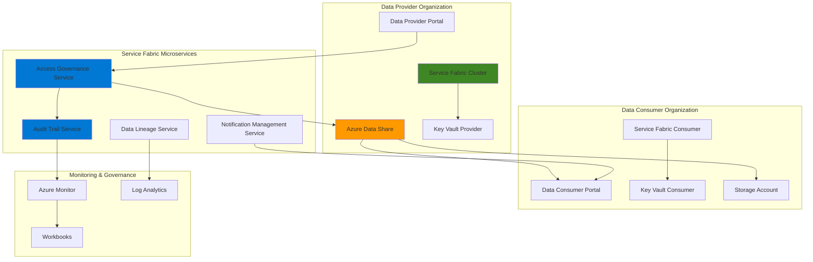

# Secure Cross-Organization Data Sharing with Data Share and Service Fabric

## Problem

Financial institutions, healthcare organizations, and research consortiums struggle with securely sharing sensitive datasets across organizational boundaries while maintaining strict data governance, access control, and comprehensive audit trails. Traditional data sharing methods like FTP or email lack centralized management, security controls, and the ability to track data lineage and usage patterns. Organizations need a platform that enables controlled, monitored, and auditable cross-organization data collaboration while ensuring regulatory compliance and protecting sensitive information.

## Solution

Azure Data Share provides secure, managed data sharing capabilities with built-in access controls and usage tracking, while Azure Service Fabric delivers a scalable microservices platform for orchestrating data governance workflows. This solution combines these services with Azure Key Vault for secrets management and Azure Monitor for comprehensive audit trails, creating an enterprise-grade platform that enables organizations to share datasets securely while maintaining full visibility and control over data access patterns and usage.

## Architecture Diagram



## Prerequisites

1. Azure subscription with appropriate permissions for Data Share, Service Fabric, Key Vault, and Monitor resources
2. Azure CLI v2.50.0 or later installed and configured (or Azure CloudShell)
3. Understanding of microservices architecture and data governance principles
4. Two Azure subscriptions or resource groups to simulate cross-organization sharing
5. Estimated cost: $150-200 per month for test environment (includes Service Fabric cluster, storage, and monitoring)

> **Note**: This recipe demonstrates cross-organization collaboration patterns. In production, implement additional security measures including Azure AD B2B integration and conditional access policies as outlined in the [Azure Data Share security documentation](https://learn.microsoft.com/en-us/azure/data-share/security).

## Preparation

```bash
# Set environment variables for Azure resources
export RESOURCE_GROUP_PROVIDER="rg-data-share-provider-${RANDOM_SUFFIX}"
export RESOURCE_GROUP_CONSUMER="rg-data-share-consumer-${RANDOM_SUFFIX}"
export LOCATION="eastus"
export SUBSCRIPTION_ID=$(az account show --query id --output tsv)

# Generate unique suffix for resource names
RANDOM_SUFFIX=$(openssl rand -hex 3)
export DATA_SHARE_ACCOUNT="datashare${RANDOM_SUFFIX}"
export SERVICE_FABRIC_CLUSTER="sf-governance-${RANDOM_SUFFIX}"
export KEY_VAULT_PROVIDER="kv-provider-${RANDOM_SUFFIX}"
export KEY_VAULT_CONSUMER="kv-consumer-${RANDOM_SUFFIX}"
export STORAGE_PROVIDER="stprovider${RANDOM_SUFFIX}"
export STORAGE_CONSUMER="stconsumer${RANDOM_SUFFIX}"

# Create resource groups for provider and consumer
az group create \
    --name ${RESOURCE_GROUP_PROVIDER} \
    --location ${LOCATION} \
    --tags purpose=data-share-demo environment=provider

az group create \
    --name ${RESOURCE_GROUP_CONSUMER} \
    --location ${LOCATION} \
    --tags purpose=data-share-demo environment=consumer

echo "✅ Resource groups created for cross-organization demo"

# Register required resource providers
az provider register --namespace Microsoft.DataShare
az provider register --namespace Microsoft.ServiceFabric
az provider register --namespace Microsoft.KeyVault

echo "✅ Resource providers registered successfully"
```

## Steps

1. **Create Storage Accounts for Data Repositories**:

   Azure Storage provides the foundational data repositories for cross-organization sharing scenarios. Creating separate storage accounts for provider and consumer organizations establishes clear data boundaries and enables independent management of data access patterns. This separation is crucial for maintaining data sovereignty and implementing proper governance controls in multi-tenant data sharing architectures.

   ```bash
   # Create storage account for data provider
   az storage account create \
       --name ${STORAGE_PROVIDER} \
       --resource-group ${RESOURCE_GROUP_PROVIDER} \
       --location ${LOCATION} \
       --sku Standard_LRS \
       --kind StorageV2 \
       --access-tier Hot \
       --https-only true
   
   # Create storage account for data consumer
   az storage account create \
       --name ${STORAGE_CONSUMER} \
       --resource-group ${RESOURCE_GROUP_CONSUMER} \
       --location ${LOCATION} \
       --sku Standard_LRS \
       --kind StorageV2 \
       --access-tier Hot \
       --https-only true
   
   echo "✅ Storage accounts created for provider and consumer organizations"
   ```

   The storage accounts now provide secure, scalable repositories for data sharing workflows. These accounts serve as the source and destination for Azure Data Share operations, with built-in encryption and access control capabilities that form the foundation of the secure data collaboration platform.

2. **Create Azure Key Vaults for Secrets Management**:

   Azure Key Vault provides centralized, secure storage for cryptographic keys, certificates, and secrets used in cross-organization data sharing. Implementing separate Key Vaults for each organization ensures proper secret isolation while enabling secure credential exchange through the Service Fabric governance layer. This approach follows zero-trust security principles and supports regulatory compliance requirements.

   ```bash
   # Create Key Vault for data provider
   az keyvault create \
       --name ${KEY_VAULT_PROVIDER} \
       --resource-group ${RESOURCE_GROUP_PROVIDER} \
       --location ${LOCATION} \
       --sku standard \
       --enabled-for-deployment true \
       --enabled-for-template-deployment true
   
   # Create Key Vault for data consumer
   az keyvault create \
       --name ${KEY_VAULT_CONSUMER} \
       --resource-group ${RESOURCE_GROUP_CONSUMER} \
       --location ${LOCATION} \
       --sku standard \
       --enabled-for-deployment true \
       --enabled-for-template-deployment true
   
   echo "✅ Key Vaults created for secure credential management"
   ```

   The Key Vaults are now configured to store sensitive information including data share access keys, service principal credentials, and encryption keys. This centralized secrets management enables the Service Fabric microservices to securely access required credentials while maintaining audit trails and supporting key rotation policies.

3. **Deploy Azure Service Fabric Cluster**:

   Azure Service Fabric provides a distributed systems platform optimized for building and managing microservices at scale. Deploying a Service Fabric cluster creates the foundation for data governance microservices that orchestrate cross-organization data sharing workflows. The platform's stateful service capabilities are particularly valuable for maintaining data lineage information and audit trails across long-running data collaboration scenarios.

   ```bash
   # Create Service Fabric cluster with security configuration
   az sf cluster create \
       --resource-group ${RESOURCE_GROUP_PROVIDER} \
       --cluster-name ${SERVICE_FABRIC_CLUSTER} \
       --location ${LOCATION} \
       --certificate-output-folder ./certs \
       --certificate-subject-name "CN=${SERVICE_FABRIC_CLUSTER}.${LOCATION}.cloudapp.azure.com" \
       --vault-name ${KEY_VAULT_PROVIDER} \
       --vault-resource-group ${RESOURCE_GROUP_PROVIDER} \
       --vm-size Standard_D2s_v3 \
       --vm-instance-count 5 \
       --os WindowsServer2019Datacenter
   
   echo "✅ Service Fabric cluster deployed with security certificates"
   ```

   The Service Fabric cluster is now operational with built-in security features including certificate-based node authentication and encrypted inter-service communication. This managed platform automatically handles service placement, health monitoring, and rolling updates, providing the reliable foundation needed for critical data governance workloads.

4. **Create Azure Data Share Account**:

   Azure Data Share enables secure, managed sharing of data across organizational boundaries with built-in governance controls and audit capabilities. Creating a Data Share account establishes the central hub for managing all data sharing relationships, access permissions, and usage tracking. This service abstracts the complexity of cross-organization data movement while maintaining strict security and compliance controls.

   ```bash
   # Create Azure Data Share account
   az datashare account create \
       --account-name ${DATA_SHARE_ACCOUNT} \
       --resource-group ${RESOURCE_GROUP_PROVIDER} \
       --location ${LOCATION} \
       --tags purpose=cross-org-collaboration governance=enabled
   
   # Get Data Share account details
   DATASHARE_ACCOUNT_ID=$(az datashare account show \
       --account-name ${DATA_SHARE_ACCOUNT} \
       --resource-group ${RESOURCE_GROUP_PROVIDER} \
       --query id --output tsv)
   
   echo "✅ Azure Data Share account created: ${DATA_SHARE_ACCOUNT}"
   echo "Account ID: ${DATASHARE_ACCOUNT_ID}"
   ```

   The Data Share account provides centralized management for all cross-organization data sharing activities. This managed service handles the complexity of secure data transfer, permission management, and audit logging while enabling data providers to maintain full control over their shared datasets.

5. **Configure Log Analytics Workspace for Monitoring**:

   Azure Monitor and Log Analytics provide comprehensive observability for cross-organization data sharing operations. Creating a centralized Log Analytics workspace enables real-time monitoring of data access patterns, security events, and governance compliance across all components of the data collaboration platform. This monitoring foundation is essential for maintaining audit trails and detecting anomalous behavior in sensitive data sharing scenarios.

   ```bash
   # Create Log Analytics workspace
   az monitor log-analytics workspace create \
       --workspace-name "law-datashare-${RANDOM_SUFFIX}" \
       --resource-group ${RESOURCE_GROUP_PROVIDER} \
       --location ${LOCATION} \
       --sku PerGB2018
   
   # Get workspace ID for configuration
   WORKSPACE_ID=$(az monitor log-analytics workspace show \
       --workspace-name "law-datashare-${RANDOM_SUFFIX}" \
       --resource-group ${RESOURCE_GROUP_PROVIDER} \
       --query customerId --output tsv)
   
   echo "✅ Log Analytics workspace created for comprehensive monitoring"
   echo "Workspace ID: ${WORKSPACE_ID}"
   ```

   The Log Analytics workspace now provides centralized log collection and analysis capabilities for the entire data collaboration platform. This observability foundation enables real-time security monitoring, compliance reporting, and performance optimization across all data sharing activities.

6. **Create Sample Dataset for Sharing**:

   Establishing a sample dataset demonstrates the end-to-end data sharing workflow while providing a foundation for testing governance controls and audit trail functionality. This step simulates real-world scenarios where organizations need to share structured data while maintaining strict access controls and usage tracking throughout the data lifecycle.

   ```bash
   # Get storage account key for data upload
   STORAGE_KEY=$(az storage account keys list \
       --account-name ${STORAGE_PROVIDER} \
       --resource-group ${RESOURCE_GROUP_PROVIDER} \
       --query '[0].value' --output tsv)
   
   # Create container for shared data
   az storage container create \
       --name "shared-datasets" \
       --account-name ${STORAGE_PROVIDER} \
       --account-key ${STORAGE_KEY} \
       --public-access off
   
   # Create sample CSV data file
   cat > sample_financial_data.csv << EOF
   transaction_id,date,amount,category,region
   TXN001,2025-01-15,15000.00,corporate_loan,north_america
   TXN002,2025-01-16,8500.50,consumer_credit,europe
   TXN003,2025-01-17,22000.75,mortgage,asia_pacific
   TXN004,2025-01-18,3200.25,small_business,north_america
   TXN005,2025-01-19,45000.00,commercial_real_estate,europe
   EOF
   
   # Upload sample data to storage
   az storage blob upload \
       --file sample_financial_data.csv \
       --container-name "shared-datasets" \
       --name "financial_transactions_2025.csv" \
       --account-name ${STORAGE_PROVIDER} \
       --account-key ${STORAGE_KEY}
   
   echo "✅ Sample dataset created and uploaded for sharing demonstration"
   ```

   The sample dataset is now available in secure storage with appropriate access controls. This realistic financial data structure demonstrates common cross-organization sharing scenarios while providing the foundation for testing data governance workflows and audit trail generation.

7. **Create Data Share with Dataset**:

   Creating a data share establishes the formal sharing agreement between organizations, defining access permissions, data refresh schedules, and governance policies. Azure Data Share provides granular control over what data is shared, how frequently it's updated, and who can access it, enabling organizations to maintain sovereignty over their data while facilitating necessary business collaboration.

   ```bash
   # Create data share
   az datashare share create \
       --account-name ${DATA_SHARE_ACCOUNT} \
       --resource-group ${RESOURCE_GROUP_PROVIDER} \
       --share-name "financial-collaboration-share" \
       --description "Cross-organization financial data sharing for analytics" \
       --terms-of-use "Data for internal use only. No redistribution allowed."
   
   # Add dataset to the share
   az datashare dataset create \
       --account-name ${DATA_SHARE_ACCOUNT} \
       --resource-group ${RESOURCE_GROUP_PROVIDER} \
       --share-name "financial-collaboration-share" \
       --dataset-name "financial-transactions" \
       --kind "Blob" \
       --storage-account-name ${STORAGE_PROVIDER} \
       --resource-group ${RESOURCE_GROUP_PROVIDER} \
       --container-name "shared-datasets" \
       --file-path "financial_transactions_2025.csv"
   
   echo "✅ Data share created with financial dataset"
   ```

   The data share now provides a managed, secure channel for cross-organization data collaboration. This configuration establishes the governance framework that controls data access while enabling the Service Fabric microservices to orchestrate approval workflows, audit logging, and access management processes.

8. **Configure Service Fabric Application for Data Governance**:

   Deploying governance microservices to the Service Fabric cluster creates the orchestration layer that manages cross-organization data sharing workflows. These services handle access request processing, audit trail generation, notification management, and data lineage tracking. The microservices architecture enables independent scaling and updates of different governance functions while maintaining system reliability.

   ```bash
   # Create application package structure for governance services
   mkdir -p ./governance-app/{AccessGovernanceService,AuditTrailService,NotificationService}
   
   # Create Service Fabric application manifest
   cat > ./governance-app/ApplicationManifest.xml << 'EOF'
   <?xml version="1.0" encoding="utf-8"?>
   <ApplicationManifest xmlns:xsd="http://www.w3.org/2001/XMLSchema"
                        xmlns:xsi="http://www.w3.org/2001/XMLSchema-instance"
                        ApplicationTypeName="DataGovernanceApp"
                        ApplicationTypeVersion="1.0.0"
                        xmlns="http://schemas.microsoft.com/2011/01/fabric">
     <ServiceManifestImport>
       <ServiceManifestRef ServiceManifestName="AccessGovernanceService" ServiceManifestVersion="1.0.0" />
     </ServiceManifestImport>
     <ServiceManifestImport>
       <ServiceManifestRef ServiceManifestName="AuditTrailService" ServiceManifestVersion="1.0.0" />
     </ServiceManifestImport>
     <ServiceManifestImport>
       <ServiceManifestRef ServiceManifestName="NotificationService" ServiceManifestVersion="1.0.0" />
     </ServiceManifestImport>
   </ApplicationManifest>
   EOF
   
   echo "✅ Service Fabric governance application structure created"
   ```

   The Service Fabric application framework now provides the foundation for deploying data governance microservices. This distributed architecture enables each governance function to operate independently while maintaining strong consistency for audit trails and access control decisions.

## Validation & Testing

1. **Verify Data Share Configuration**:

   ```bash
   # Check Data Share account status
   az datashare account show \
       --account-name ${DATA_SHARE_ACCOUNT} \
       --resource-group ${RESOURCE_GROUP_PROVIDER} \
       --output table
   
   # List available shares
   az datashare share list \
       --account-name ${DATA_SHARE_ACCOUNT} \
       --resource-group ${RESOURCE_GROUP_PROVIDER} \
       --output table
   ```

   Expected output: Data Share account in "Succeeded" provisioning state with created share visible in the list.

2. **Test Service Fabric Cluster Connectivity**:

   ```bash
   # Verify Service Fabric cluster health
   az sf cluster show \
       --cluster-name ${SERVICE_FABRIC_CLUSTER} \
       --resource-group ${RESOURCE_GROUP_PROVIDER} \
       --output table
   
   # Check cluster node status
   az sf cluster node list \
       --cluster-name ${SERVICE_FABRIC_CLUSTER} \
       --resource-group ${RESOURCE_GROUP_PROVIDER}
   ```

   Expected output: Cluster in "Ready" state with all nodes showing "Up" status.

3. **Validate Storage and Security Configuration**:

   ```bash
   # Verify storage account accessibility
   az storage blob list \
       --container-name "shared-datasets" \
       --account-name ${STORAGE_PROVIDER} \
       --account-key ${STORAGE_KEY} \
       --output table
   
   # Check Key Vault accessibility
   az keyvault secret list \
       --vault-name ${KEY_VAULT_PROVIDER} \
       --output table
   ```

   Expected output: Sample dataset visible in storage container with proper access controls configured.

## Cleanup

1. **Remove Service Fabric Cluster**:

   ```bash
   # Delete Service Fabric cluster
   az sf cluster delete \
       --cluster-name ${SERVICE_FABRIC_CLUSTER} \
       --resource-group ${RESOURCE_GROUP_PROVIDER} \
       --no-wait
   
   echo "✅ Service Fabric cluster deletion initiated"
   ```

2. **Delete Data Share Resources**:

   ```bash
   # Delete data share account
   az datashare account delete \
       --account-name ${DATA_SHARE_ACCOUNT} \
       --resource-group ${RESOURCE_GROUP_PROVIDER} \
       --yes
   
   echo "✅ Data Share account deleted"
   ```

3. **Remove Storage and Security Resources**:

   ```bash
   # Delete storage accounts
   az storage account delete \
       --name ${STORAGE_PROVIDER} \
       --resource-group ${RESOURCE_GROUP_PROVIDER} \
       --yes
   
   az storage account delete \
       --name ${STORAGE_CONSUMER} \
       --resource-group ${RESOURCE_GROUP_CONSUMER} \
       --yes
   
   # Delete Key Vaults (with purge protection disabled for demo)
   az keyvault delete \
       --name ${KEY_VAULT_PROVIDER} \
       --resource-group ${RESOURCE_GROUP_PROVIDER}
   
   az keyvault delete \
       --name ${KEY_VAULT_CONSUMER} \
       --resource-group ${RESOURCE_GROUP_CONSUMER}
   
   echo "✅ Storage and security resources deleted"
   ```

4. **Delete Resource Groups**:

   ```bash
   # Delete all resource groups and contained resources
   az group delete \
       --name ${RESOURCE_GROUP_PROVIDER} \
       --yes \
       --no-wait
   
   az group delete \
       --name ${RESOURCE_GROUP_CONSUMER} \
       --yes \
       --no-wait
   
   echo "✅ Resource group deletion initiated"
   echo "Note: Complete deletion may take 10-15 minutes"
   ```

## Discussion

Azure Data Share and Service Fabric create a powerful combination for orchestrating secure cross-organization data collaboration at enterprise scale. Azure Data Share provides managed data sharing capabilities with built-in security controls, eliminating the complexity of building custom data transfer mechanisms while maintaining strict governance over shared datasets. The service supports both snapshot-based and in-place sharing scenarios, enabling organizations to choose the appropriate model based on their data sovereignty and compliance requirements. For comprehensive guidance on implementing data sharing strategies, see the [Azure Data Share documentation](https://learn.microsoft.com/en-us/azure/data-share/) and [data sharing best practices guide](https://learn.microsoft.com/en-us/azure/data-share/security).

Service Fabric's microservices platform provides the orchestration layer needed for complex data governance workflows that span organizational boundaries. The platform's stateful service capabilities enable persistent tracking of data lineage, access patterns, and audit trails across long-running collaboration scenarios. This architecture follows the [Azure Well-Architected Framework](https://learn.microsoft.com/en-us/azure/architecture/framework/) principles of reliability and security, ensuring that governance workflows remain operational even during platform updates or partial failures. The microservices approach also enables independent scaling and evolution of different governance functions as business requirements change.

From a security perspective, this solution implements defense-in-depth strategies including Azure AD integration for identity management, Key Vault for secrets protection, and comprehensive audit logging through Azure Monitor. The combination of these services provides the foundation for meeting regulatory compliance requirements in industries like healthcare (HIPAA), finance (SOX), and government (FedRAMP). For detailed security implementation guidance, review the [Azure security best practices](https://learn.microsoft.com/en-us/azure/security/fundamentals/best-practices-and-patterns) and [data protection strategies documentation](https://learn.microsoft.com/en-us/azure/security/fundamentals/data-encryption-best-practices).

Cost optimization opportunities include implementing automated scaling policies for the Service Fabric cluster based on data sharing workloads, using Azure Storage lifecycle management to optimize long-term data retention costs, and leveraging Azure Reserved Instances for predictable workloads. The platform's modular architecture enables organizations to start with basic data sharing capabilities and incrementally add governance features as requirements evolve. For cost management strategies, see the [Azure cost optimization guide](https://learn.microsoft.com/en-us/azure/cost-management-billing/costs/cost-mgt-best-practices).

> **Tip**: Implement Azure Policy governance rules to automatically enforce data classification and retention policies across all shared datasets. The [Azure Policy documentation](https://learn.microsoft.com/en-us/azure/governance/policy/) provides comprehensive guidance on creating custom policies for data governance scenarios.

## Challenge

Extend this cross-organization data collaboration platform by implementing these advanced capabilities:

1. **Real-time Data Streaming Integration**: Add Azure Event Hubs and Stream Analytics to enable real-time data sharing scenarios with automatic data quality validation and anomaly detection during the sharing process.

2. **Machine Learning-Powered Data Classification**: Integrate Azure Machine Learning services to automatically classify shared datasets based on sensitivity levels and apply appropriate governance policies dynamically.

3. **Blockchain-Based Audit Trails**: Implement Azure Blockchain Service to create immutable audit logs for all data sharing activities, ensuring non-repudiation and enhanced compliance capabilities.

4. **Advanced Access Control Workflows**: Develop sophisticated approval workflows using Azure Logic Apps that integrate with organizational identity systems and support multi-level approval processes based on data sensitivity and recipient profiles.

5. **Global Data Residency Compliance**: Extend the architecture to support multiple Azure regions with automated data residency compliance based on recipient location and regulatory requirements, including GDPR and data localization laws.

## Infrastructure Code

*Infrastructure code will be generated after recipe approval.*