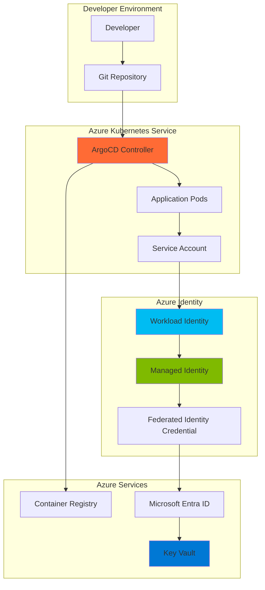

# Secure GitOps CI/CD with Workload Identity and ArgoCD

## Problem

Organizations adopting GitOps for continuous deployment face significant security challenges when managing application secrets and service authentication. Traditional approaches require storing sensitive credentials in Git repositories or Kubernetes clusters, creating security vulnerabilities and compliance risks. Teams struggle with secret rotation, access control, and maintaining security posture while enabling automated deployments across development and production environments.

## Solution

This recipe implements a secure GitOps CI/CD pipeline using ArgoCD on Azure Kubernetes Service (AKS) with Azure Workload Identity for keyless authentication to Azure Key Vault. The solution eliminates hard-coded secrets by leveraging federated identity credentials and Azure-native security services. This approach provides seamless integration between Kubernetes workloads and Azure resources while maintaining zero-trust security principles and simplifying credential management.

## Architecture Diagram



## Prerequisites

1. Azure subscription with permissions to create AKS clusters, managed identities, and Key Vault resources
2. Azure CLI v2.47.0 or later installed and configured
3. kubectl command-line tool installed
4. Git repository for storing application manifests
5. Basic understanding of Kubernetes, GitOps principles, and Azure identity concepts
6. Estimated cost: $50-100 per month for AKS cluster and associated resources

> **Note**: This recipe requires AKS clusters with managed service identity (MSI) enabled. Service Principal Name (SPN) based clusters must be converted to MSI using `az aks update --enable-managed-identity`.

## Preparation

Azure Workload Identity enables secure authentication between Kubernetes pods and Azure services without storing credentials in the cluster. This preparation phase establishes the foundational Azure resources and identity federation required for keyless authentication patterns.

```bash
# Set environment variables for Azure resources
export RESOURCE_GROUP="rg-gitops-demo"
export LOCATION="eastus"
export CLUSTER_NAME="aks-gitops-cluster"
export SUBSCRIPTION_ID=$(az account show --query id --output tsv)

# Generate unique identifiers to avoid naming conflicts
export RANDOM_SUFFIX=$(openssl rand -hex 3)
export KEY_VAULT_NAME="kv-gitops-${RANDOM_SUFFIX}"
export MANAGED_IDENTITY_NAME="mi-argocd-${RANDOM_SUFFIX}"

# Create resource group for all GitOps resources
az group create \
    --name ${RESOURCE_GROUP} \
    --location ${LOCATION} \
    --tags purpose=gitops-demo environment=development

echo "✅ Resource group created: ${RESOURCE_GROUP}"
```

## Steps

1. **Create AKS Cluster with Workload Identity**:

   Azure Kubernetes Service with Workload Identity provides the foundation for keyless authentication between pods and Azure services. The OIDC issuer endpoint enables token federation, while workload identity eliminates the need for storing service principal credentials in the cluster. This configuration follows Azure security best practices by implementing zero-trust principles at the container orchestration layer.

   ```bash
   # Create AKS cluster with workload identity enabled
   az aks create \
       --resource-group ${RESOURCE_GROUP} \
       --name ${CLUSTER_NAME} \
       --node-count 3 \
       --enable-managed-identity \
       --enable-oidc-issuer \
       --enable-workload-identity \
       --generate-ssh-keys \
       --tags purpose=gitops-demo

   # Get cluster credentials for kubectl access
   az aks get-credentials \
       --resource-group ${RESOURCE_GROUP} \
       --name ${CLUSTER_NAME} \
       --overwrite-existing

   echo "✅ AKS cluster created with workload identity enabled"
   ```

   The AKS cluster now provides a secure foundation for GitOps operations with native Azure identity integration. The OIDC issuer endpoint enables federated authentication, allowing ArgoCD to authenticate to Azure services using Kubernetes service account tokens instead of stored credentials.

2. **Create Azure Key Vault for Secret Management**:

   Azure Key Vault serves as the centralized secret management solution, providing secure storage for application secrets, certificates, and configuration values. Key Vault integrates seamlessly with Azure Workload Identity, enabling applications to retrieve secrets without embedding credentials in code or configuration files.

   ```bash
   # Create Key Vault for secure secret storage
   az keyvault create \
       --name ${KEY_VAULT_NAME} \
       --resource-group ${RESOURCE_GROUP} \
       --location ${LOCATION} \
       --enable-rbac-authorization \
       --tags purpose=gitops-demo

   # Store sample application secrets
   az keyvault secret set \
       --vault-name ${KEY_VAULT_NAME} \
       --name "database-connection-string" \
       --value "Server=myserver;Database=mydb;User=myuser;Password=mypass"

   az keyvault secret set \
       --vault-name ${KEY_VAULT_NAME} \
       --name "api-key" \
       --value "your-secure-api-key-here"

   echo "✅ Key Vault created with sample secrets"
   ```

   Key Vault is now configured with RBAC authorization and contains sample secrets that applications can securely access. This eliminates the need to store sensitive values in Git repositories or Kubernetes manifests, maintaining security compliance while enabling automated deployments.

3. **Create User-Assigned Managed Identity**:

   Managed Identity provides Azure-native authentication for applications without requiring credential management. The user-assigned managed identity will be associated with ArgoCD components through workload identity federation, enabling secure access to Azure Key Vault and other Azure services.

   ```bash
   # Create user-assigned managed identity
   az identity create \
       --name ${MANAGED_IDENTITY_NAME} \
       --resource-group ${RESOURCE_GROUP} \
       --location ${LOCATION} \
       --tags purpose=gitops-demo

   # Get the managed identity client ID
   export USER_ASSIGNED_CLIENT_ID=$(az identity show \
       --resource-group ${RESOURCE_GROUP} \
       --name ${MANAGED_IDENTITY_NAME} \
       --query 'clientId' \
       --output tsv)

   # Get the managed identity principal ID for RBAC assignments
   export USER_ASSIGNED_PRINCIPAL_ID=$(az identity show \
       --resource-group ${RESOURCE_GROUP} \
       --name ${MANAGED_IDENTITY_NAME} \
       --query 'principalId' \
       --output tsv)

   echo "✅ Managed identity created: ${MANAGED_IDENTITY_NAME}"
   ```

   The managed identity is now ready for federation with Kubernetes service accounts. This identity will authenticate to Azure services on behalf of ArgoCD components, providing secure access to Key Vault without storing credentials in the cluster.

4. **Configure Key Vault Access Permissions**:

   Role-based access control (RBAC) for Key Vault ensures that only authorized identities can access sensitive secrets. Granting the managed identity appropriate permissions enables ArgoCD to retrieve secrets while maintaining the principle of least privilege.

   ```bash
   # Assign Key Vault Secrets User role to managed identity
   az role assignment create \
       --role "Key Vault Secrets User" \
       --assignee ${USER_ASSIGNED_PRINCIPAL_ID} \
       --scope "/subscriptions/${SUBSCRIPTION_ID}/resourceGroups/${RESOURCE_GROUP}/providers/Microsoft.KeyVault/vaults/${KEY_VAULT_NAME}"

   # Verify the role assignment
   az role assignment list \
       --assignee ${USER_ASSIGNED_PRINCIPAL_ID} \
       --scope "/subscriptions/${SUBSCRIPTION_ID}/resourceGroups/${RESOURCE_GROUP}/providers/Microsoft.KeyVault/vaults/${KEY_VAULT_NAME}" \
       --output table

   echo "✅ Key Vault access configured for managed identity"
   ```

   The managed identity now has the necessary permissions to read secrets from Key Vault. This RBAC configuration ensures secure access while maintaining audit trails and compliance requirements for secret access patterns.

5. **Install ArgoCD Extension with Workload Identity**:

   ArgoCD extension for AKS provides managed GitOps capabilities with native Azure integration. The workload identity configuration enables ArgoCD to authenticate to Azure services using federated credentials, eliminating the need for stored secrets while maintaining security and compliance.

   ```bash
   # Get the OIDC issuer URL from the AKS cluster
   export AKS_OIDC_ISSUER=$(az aks show \
       --name ${CLUSTER_NAME} \
       --resource-group ${RESOURCE_GROUP} \
       --query "oidcIssuerProfile.issuerUrl" \
       --output tsv)

   # Install ArgoCD extension with workload identity
   az k8s-extension create \
       --resource-group ${RESOURCE_GROUP} \
       --cluster-name ${CLUSTER_NAME} \
       --cluster-type managedClusters \
       --name argocd \
       --extension-type Microsoft.ArgoCD \
       --auto-upgrade false \
       --release-train preview \
       --version 0.0.7-preview \
       --config workloadIdentity.enable=true \
       --config workloadIdentity.clientId=${USER_ASSIGNED_CLIENT_ID} \
       --config deployWithHighAvailability=false \
       --config namespaceInstall=false

   echo "✅ ArgoCD extension installed with workload identity"
   ```

   ArgoCD is now deployed with workload identity integration, enabling secure authentication to Azure services. The extension automatically configures the necessary Kubernetes resources and service accounts for federated authentication patterns.

6. **Create Federated Identity Credential**:

   Federated identity credentials establish trust between the Kubernetes service account and Azure managed identity. This federation enables ArgoCD pods to obtain Azure AD tokens using their Kubernetes service account tokens, implementing a secure token exchange mechanism.

   ```bash
   # Create federated identity credential for ArgoCD application controller
   az identity federated-credential create \
       --name "argocd-application-controller" \
       --identity-name ${MANAGED_IDENTITY_NAME} \
       --resource-group ${RESOURCE_GROUP} \
       --issuer ${AKS_OIDC_ISSUER} \
       --subject "system:serviceaccount:argocd:argocd-application-controller" \
       --audience api://AzureADTokenExchange

   # Create federated identity credential for ArgoCD server
   az identity federated-credential create \
       --name "argocd-server" \
       --identity-name ${MANAGED_IDENTITY_NAME} \
       --resource-group ${RESOURCE_GROUP} \
       --issuer ${AKS_OIDC_ISSUER} \
       --subject "system:serviceaccount:argocd:argocd-server" \
       --audience api://AzureADTokenExchange

   echo "✅ Federated identity credentials created"
   ```

   The federated identity credentials now enable ArgoCD service accounts to authenticate to Azure services using their Kubernetes tokens. This establishes a secure authentication chain from Kubernetes pods to Azure Key Vault without storing any credentials in the cluster.

7. **Configure ArgoCD Service Accounts**:

   Kubernetes service accounts with workload identity annotations enable seamless authentication to Azure services. These annotations establish the connection between pod identities and Azure managed identities, enabling automatic token exchange for secure resource access.

   ```bash
   # Annotate ArgoCD service accounts with workload identity
   kubectl annotate serviceaccount argocd-application-controller \
       -n argocd \
       azure.workload.identity/client-id=${USER_ASSIGNED_CLIENT_ID}

   kubectl annotate serviceaccount argocd-server \
       -n argocd \
       azure.workload.identity/client-id=${USER_ASSIGNED_CLIENT_ID}

   # Label the service accounts for workload identity
   kubectl label serviceaccount argocd-application-controller \
       -n argocd \
       azure.workload.identity/use=true

   kubectl label serviceaccount argocd-server \
       -n argocd \
       azure.workload.identity/use=true

   echo "✅ ArgoCD service accounts configured for workload identity"
   ```

   ArgoCD service accounts are now properly configured for workload identity authentication. The annotations and labels enable automatic token exchange, allowing ArgoCD components to authenticate to Azure services using their Kubernetes identity.

8. **Create Sample Application with Key Vault Integration**:

   This step demonstrates how applications can securely access Key Vault secrets using the Azure Key Vault Provider for Secrets Store CSI Driver. The SecretProviderClass defines which secrets to retrieve, while the deployment shows how pods can access these secrets as mounted volumes.

   ```bash
   # Install the Azure Key Vault Provider for Secrets Store CSI Driver
   az aks enable-addons \
       --resource-group ${RESOURCE_GROUP} \
       --name ${CLUSTER_NAME} \
       --addons azure-keyvault-secrets-provider

   # Create namespace for sample application
   kubectl create namespace sample-app

   # Create service account for sample application
   kubectl create serviceaccount sample-app-sa -n sample-app

   # Annotate service account with workload identity
   kubectl annotate serviceaccount sample-app-sa \
       -n sample-app \
       azure.workload.identity/client-id=${USER_ASSIGNED_CLIENT_ID}

   kubectl label serviceaccount sample-app-sa \
       -n sample-app \
       azure.workload.identity/use=true

   # Create federated identity credential for sample app
   az identity federated-credential create \
       --name "sample-app" \
       --identity-name ${MANAGED_IDENTITY_NAME} \
       --resource-group ${RESOURCE_GROUP} \
       --issuer ${AKS_OIDC_ISSUER} \
       --subject "system:serviceaccount:sample-app:sample-app-sa" \
       --audience api://AzureADTokenExchange

   echo "✅ Sample application service account configured"
   ```

   The sample application service account is now configured with workload identity, enabling secure access to Key Vault secrets. This demonstrates the pattern that applications deployed via ArgoCD can follow for keyless authentication to Azure services.

9. **Deploy SecretProviderClass and Sample Application**:

   The SecretProviderClass defines how secrets are retrieved from Key Vault and made available to pods. This configuration demonstrates how applications can access secrets without embedding credentials, following cloud-native security patterns.

   ```bash
   # Create SecretProviderClass for Key Vault integration
   cat <<EOF | kubectl apply -f -
   apiVersion: secrets-store.csi.x-k8s.io/v1
   kind: SecretProviderClass
   metadata:
     name: sample-app-secrets
     namespace: sample-app
   spec:
     provider: azure
     parameters:
       usePodIdentity: "false"
       useVMManagedIdentity: "false"
       userAssignedIdentityID: ${USER_ASSIGNED_CLIENT_ID}
       keyvaultName: ${KEY_VAULT_NAME}
       tenantId: $(az account show --query tenantId --output tsv)
       objects: |
         array:
           - |
             objectName: database-connection-string
             objectType: secret
             objectVersion: ""
           - |
             objectName: api-key
             objectType: secret
             objectVersion: ""
   EOF

   # Create sample application deployment
   cat <<EOF | kubectl apply -f -
   apiVersion: apps/v1
   kind: Deployment
   metadata:
     name: sample-app
     namespace: sample-app
   spec:
     replicas: 1
     selector:
       matchLabels:
         app: sample-app
     template:
       metadata:
         labels:
           app: sample-app
           azure.workload.identity/use: "true"
       spec:
         serviceAccountName: sample-app-sa
         containers:
         - name: sample-app
           image: nginx:latest
           ports:
           - containerPort: 80
           volumeMounts:
           - name: secrets-store
             mountPath: "/mnt/secrets"
             readOnly: true
           env:
           - name: DATABASE_CONNECTION_STRING
             valueFrom:
               secretKeyRef:
                 name: sample-app-secrets
                 key: database-connection-string
         volumes:
         - name: secrets-store
           csi:
             driver: secrets-store.csi.k8s.io
             readOnly: true
             volumeAttributes:
               secretProviderClass: sample-app-secrets
   EOF

   echo "✅ Sample application deployed with Key Vault integration"
   ```

   The sample application now demonstrates how workloads can securely access Key Vault secrets using workload identity. The SecretProviderClass configures secret retrieval, while the deployment shows how pods can access these secrets as environment variables or mounted files.

10. **Create ArgoCD Application for GitOps Deployment**:

    ArgoCD Application resources define the GitOps workflow, specifying source repositories, target destinations, and synchronization policies. This configuration enables automated deployment of applications while maintaining security through workload identity authentication.

    ```bash
    # Create ArgoCD application for GitOps deployment
    cat <<EOF | kubectl apply -f -
    apiVersion: argoproj.io/v1alpha1
    kind: Application
    metadata:
      name: sample-app-gitops
      namespace: argocd
    spec:
      project: default
      source:
        repoURL: https://github.com/Azure-Samples/aks-store-demo.git
        targetRevision: HEAD
        path: kustomize/overlays/dev
      destination:
        server: https://kubernetes.default.svc
        namespace: sample-app
      syncPolicy:
        automated:
          prune: true
          selfHeal: true
        syncOptions:
        - CreateNamespace=true
    EOF

    # Wait for ArgoCD to sync the application
    kubectl wait --for=condition=Synced application/sample-app-gitops -n argocd --timeout=300s

    echo "✅ ArgoCD application created and synced"
    ```

    The ArgoCD application now manages the sample application deployment through GitOps principles. Automated synchronization ensures that the cluster state matches the desired state defined in the Git repository, while workload identity provides secure access to Azure services.

## Validation & Testing

1. **Verify ArgoCD Extension Status**:

   ```bash
   # Check ArgoCD extension status
   az k8s-extension show \
       --resource-group ${RESOURCE_GROUP} \
       --cluster-name ${CLUSTER_NAME} \
       --cluster-type managedClusters \
       --name argocd \
       --output table
   ```

   Expected output: Extension should show "Succeeded" provisioning state and "Installed" install state.

2. **Test Workload Identity Authentication**:

   ```bash
   # Verify service account annotations
   kubectl get serviceaccount sample-app-sa -n sample-app -o yaml

   # Check if secrets are mounted correctly
   kubectl exec -it deployment/sample-app -n sample-app -- ls -la /mnt/secrets

   # Verify environment variable is set
   kubectl exec -it deployment/sample-app -n sample-app -- env | grep DATABASE_CONNECTION_STRING
   ```

   Expected output: Service account should have workload identity annotations, secrets should be mounted at `/mnt/secrets`, and environment variables should contain Key Vault values.

3. **Access ArgoCD UI**:

   ```bash
   # Expose ArgoCD UI via LoadBalancer
   kubectl expose service argocd-server \
       --type LoadBalancer \
       --name argocd-server-lb \
       --port 80 \
       --target-port 8080 \
       -n argocd

   # Get ArgoCD admin password
   kubectl get secret argocd-initial-admin-secret \
       -n argocd \
       -o jsonpath="{.data.password}" | base64 -d

   # Get LoadBalancer IP
   kubectl get service argocd-server-lb -n argocd -o jsonpath="{.status.loadBalancer.ingress[0].ip}"
   ```

   Expected output: LoadBalancer IP address and admin password for accessing ArgoCD UI.

4. **Verify Application Synchronization**:

   ```bash
   # Check ArgoCD application status
   kubectl get application sample-app-gitops -n argocd -o yaml

   # Verify pods are running
   kubectl get pods -n sample-app

   # Check application logs
   kubectl logs -f deployment/sample-app -n sample-app
   ```

   Expected output: Application should show "Synced" status, pods should be in "Running" state, and logs should not contain authentication errors.

## Cleanup

1. **Delete ArgoCD Applications**:

   ```bash
   # Delete ArgoCD application
   kubectl delete application sample-app-gitops -n argocd

   # Delete sample application resources
   kubectl delete namespace sample-app

   echo "✅ ArgoCD applications and sample resources deleted"
   ```

2. **Remove ArgoCD Extension**:

   ```bash
   # Delete ArgoCD extension
   az k8s-extension delete \
       --resource-group ${RESOURCE_GROUP} \
       --cluster-name ${CLUSTER_NAME} \
       --cluster-type managedClusters \
       --name argocd \
       --yes

   echo "✅ ArgoCD extension deleted"
   ```

3. **Delete Federated Identity Credentials**:

   ```bash
   # Delete federated identity credentials
   az identity federated-credential delete \
       --name "argocd-application-controller" \
       --identity-name ${MANAGED_IDENTITY_NAME} \
       --resource-group ${RESOURCE_GROUP} \
       --yes

   az identity federated-credential delete \
       --name "argocd-server" \
       --identity-name ${MANAGED_IDENTITY_NAME} \
       --resource-group ${RESOURCE_GROUP} \
       --yes

   az identity federated-credential delete \
       --name "sample-app" \
       --identity-name ${MANAGED_IDENTITY_NAME} \
       --resource-group ${RESOURCE_GROUP} \
       --yes

   echo "✅ Federated identity credentials deleted"
   ```

4. **Remove Azure Resources**:

   ```bash
   # Delete the entire resource group and all contained resources
   az group delete \
       --name ${RESOURCE_GROUP} \
       --yes \
       --no-wait

   echo "✅ Resource group deletion initiated: ${RESOURCE_GROUP}"
   echo "Note: Complete deletion may take 10-15 minutes"

   # Clean up environment variables
   unset RESOURCE_GROUP LOCATION CLUSTER_NAME SUBSCRIPTION_ID
   unset RANDOM_SUFFIX KEY_VAULT_NAME MANAGED_IDENTITY_NAME
   unset USER_ASSIGNED_CLIENT_ID AKS_OIDC_ISSUER
   ```

## Discussion

Azure Workload Identity represents a significant advancement in cloud-native security, enabling applications to authenticate to Azure services using their Kubernetes identity without storing credentials. This implementation demonstrates how GitOps workflows can maintain security compliance while eliminating secret management overhead. The federated identity mechanism follows OAuth 2.0 token exchange standards, creating a secure bridge between Kubernetes and Azure identity systems. For comprehensive guidance on workload identity patterns, see the [Azure Workload Identity documentation](https://docs.microsoft.com/en-us/azure/aks/workload-identity-overview) and [GitOps best practices](https://docs.microsoft.com/en-us/azure/azure-arc/kubernetes/conceptual-gitops-ci-cd).

The ArgoCD extension for AKS provides enterprise-grade GitOps capabilities with native Azure integration, supporting both multi-tenancy and high availability configurations. This managed approach reduces operational overhead while maintaining the flexibility of open-source ArgoCD. The integration with Azure Key Vault through the Secrets Store CSI Driver enables applications to access secrets securely without embedding credentials in container images or configuration files. This pattern aligns with the [Azure Well-Architected Framework](https://docs.microsoft.com/en-us/azure/architecture/framework/security/design-identity) security principles and supports compliance requirements for industries handling sensitive data.

From a cost perspective, workload identity eliminates the need for separate secret management infrastructure while reducing the security risks associated with credential rotation and distribution. The consumption-based pricing model for AKS and Key Vault ensures cost efficiency, with detailed guidance available in the [Azure Kubernetes Service pricing documentation](https://azure.microsoft.com/en-us/pricing/details/kubernetes-service/). Organizations can optimize costs further by implementing pod-level resource limits and using Azure Monitor for tracking resource utilization patterns.

The combination of ArgoCD, workload identity, and Azure Key Vault creates a robust foundation for enterprise GitOps implementations. This architecture supports advanced scenarios including multi-cluster deployments, progressive delivery patterns, and compliance automation. For organizations implementing DevSecOps practices, this solution provides the security controls and audit capabilities required for regulated environments. Additional security enhancements can be implemented through [Azure Policy](https://docs.microsoft.com/en-us/azure/governance/policy/) and [Microsoft Defender for Kubernetes](https://docs.microsoft.com/en-us/azure/defender-for-cloud/defender-for-kubernetes-introduction).

> **Tip**: Use Azure Monitor and Application Insights to track GitOps deployment patterns and identify optimization opportunities. The [monitoring documentation](https://docs.microsoft.com/en-us/azure/azure-monitor/containers/container-insights-overview) provides comprehensive guidance on setting up observability for AKS workloads with workload identity integration.

## Challenge

Extend this solution by implementing these enhancements:

1. **Multi-Environment GitOps Pipeline**: Configure separate ArgoCD applications for development, staging, and production environments with environment-specific Key Vault instances and RBAC policies.

2. **Progressive Delivery Integration**: Implement Argo Rollouts for canary deployments with automated rollback triggers based on Azure Monitor metrics and Key Vault secret validation.

3. **Cross-Cluster Secret Synchronization**: Use Azure Event Grid and Azure Functions to automatically synchronize secrets across multiple AKS clusters when Key Vault values are updated.

4. **Compliance Automation**: Integrate Azure Policy and Microsoft Defender for Cloud to automatically scan ArgoCD deployments for security compliance and generate audit reports.

5. **Advanced Monitoring and Alerting**: Configure Azure Monitor Workbooks to create custom dashboards for GitOps deployment health, workload identity usage patterns, and Key Vault access analytics.

## Infrastructure Code

*Infrastructure code will be generated after recipe approval.*