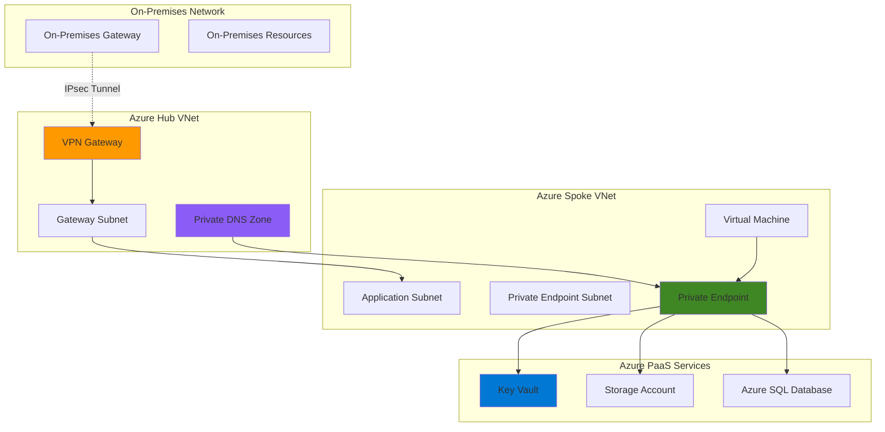

# Secure Hybrid Network Architecture with VPN Gateway and Private Link

## Problem

Modern enterprises require secure connectivity between on-premises infrastructure and cloud resources while maintaining strict security controls for sensitive data and applications. Traditional network architectures expose PaaS services to the public internet, creating security vulnerabilities and compliance challenges. Organizations need a solution that provides encrypted hybrid connectivity while ensuring private access to Azure services without internet exposure.

## Solution

This solution establishes a secure hybrid network architecture using Azure VPN Gateway for encrypted site-to-site connectivity and Azure Private Link for private access to PaaS services. The architecture combines VPN Gateway's IPsec tunneling capabilities with Private Link's service-specific private endpoints, creating a zero-trust network model that keeps all traffic within the Microsoft backbone network while centralizing secret management through Azure Key Vault.

## Architecture Diagram



## Prerequisites

1. Azure subscription with Owner or Contributor permissions for resource group creation
2. On-premises VPN device or simulated environment for testing
3. Azure CLI v2.50.0 or later installed and configured
4. Basic understanding of Azure networking concepts (VNets, subnets, routing)
5. Familiarity with IPsec VPN fundamentals and certificate management
6. Estimated cost: $150-200 for VPN Gateway, $50-100 for other resources during recipe execution

> **Note**: VPN Gateway charges apply immediately upon creation. The Basic SKU costs approximately $0.04/hour while VpnGw1 costs $0.19/hour. Consider using the Basic SKU for testing purposes.

## Preparation

```bash
# Set environment variables for Azure resources
export RESOURCE_GROUP="rg-hybrid-network-${RANDOM_SUFFIX}"
export LOCATION="eastus"
export SUBSCRIPTION_ID=$(az account show --query id --output tsv)

# Generate unique suffix for resource names
RANDOM_SUFFIX=$(openssl rand -hex 3)

# Set resource names with consistent naming convention
export HUB_VNET_NAME="vnet-hub-${RANDOM_SUFFIX}"
export SPOKE_VNET_NAME="vnet-spoke-${RANDOM_SUFFIX}"
export VPN_GATEWAY_NAME="vpngw-${RANDOM_SUFFIX}"
export KEY_VAULT_NAME="kv-${RANDOM_SUFFIX}"
export STORAGE_ACCOUNT_NAME="st${RANDOM_SUFFIX}"
export PRIVATE_DNS_ZONE="privatelink.vault.azure.net"

# Create resource group with proper tagging
az group create \
    --name ${RESOURCE_GROUP} \
    --location ${LOCATION} \
    --tags purpose=hybrid-network environment=demo recipe=vpn-private-link

echo "✅ Resource group created: ${RESOURCE_GROUP}"

# Verify Azure CLI authentication and subscription
az account show --query name --output tsv
echo "✅ Using subscription: $(az account show --query name --output tsv)"
```

## Steps

1. **Create Hub Virtual Network with Gateway Subnet**:

   The hub virtual network serves as the central connectivity point for the hybrid architecture. Azure VPN Gateway requires a dedicated subnet named "GatewaySubnet" with sufficient IP address space to accommodate gateway instances and potential future scaling. This hub-and-spoke design follows Azure Well-Architected Framework principles by centralizing network connectivity while maintaining security isolation.

   ```bash
   # Create hub virtual network for VPN Gateway
   az network vnet create \
       --resource-group ${RESOURCE_GROUP} \
       --name ${HUB_VNET_NAME} \
       --address-prefixes 10.0.0.0/16 \
       --location ${LOCATION} \
       --tags purpose=hub-network

   # Create gateway subnet with /27 prefix for VPN Gateway
   az network vnet subnet create \
       --resource-group ${RESOURCE_GROUP} \
       --vnet-name ${HUB_VNET_NAME} \
       --name GatewaySubnet \
       --address-prefixes 10.0.1.0/27

   echo "✅ Hub virtual network and gateway subnet created"
   ```

   The hub VNet is now configured with the required GatewaySubnet, providing the foundation for secure site-to-site connectivity. The /27 subnet provides 30 usable IP addresses, sufficient for VPN Gateway instances and allows for active-active configurations and future scaling requirements.

2. **Create Spoke Virtual Network with Application and Private Endpoint Subnets**:

   The spoke virtual network hosts application workloads and private endpoints, following network segmentation best practices. Separate subnets for applications and private endpoints enable granular network security group rules and support the principle of least privilege access. This design provides flexibility for future expansion while maintaining security boundaries.

   ```bash
   # Create spoke virtual network for applications
   az network vnet create \
       --resource-group ${RESOURCE_GROUP} \
       --name ${SPOKE_VNET_NAME} \
       --address-prefixes 10.1.0.0/16 \
       --location ${LOCATION} \
       --tags purpose=spoke-network

   # Create application subnet
   az network vnet subnet create \
       --resource-group ${RESOURCE_GROUP} \
       --vnet-name ${SPOKE_VNET_NAME} \
       --name ApplicationSubnet \
       --address-prefixes 10.1.1.0/24

   # Create private endpoint subnet with private endpoint policies disabled
   az network vnet subnet create \
       --resource-group ${RESOURCE_GROUP} \
       --vnet-name ${SPOKE_VNET_NAME} \
       --name PrivateEndpointSubnet \
       --address-prefixes 10.1.2.0/24 \
       --private-endpoint-network-policies Disabled

   echo "✅ Spoke virtual network with application and private endpoint subnets created"
   ```

   The spoke VNet now provides dedicated network segments for applications and private endpoints. Disabling private endpoint network policies on the PrivateEndpointSubnet allows Azure to manage the network interface configuration for private endpoints while maintaining security through Azure's built-in access controls.

3. **Create VNet Peering Between Hub and Spoke Networks**:

   VNet peering establishes high-bandwidth, low-latency connectivity between the hub and spoke networks using Azure's backbone infrastructure. This connection enables seamless communication while maintaining network isolation and security boundaries. The peering configuration allows gateway transit from the hub to spoke, enabling on-premises resources to access spoke network resources through the VPN Gateway.

   ```bash
   # Create peering from hub to spoke with gateway transit
   az network vnet peering create \
       --resource-group ${RESOURCE_GROUP} \
       --name HubToSpoke \
       --vnet-name ${HUB_VNET_NAME} \
       --remote-vnet ${SPOKE_VNET_NAME} \
       --allow-gateway-transit true \
       --allow-forwarded-traffic true

   # Create peering from spoke to hub with remote gateway use
   az network vnet peering create \
       --resource-group ${RESOURCE_GROUP} \
       --name SpokeToHub \
       --vnet-name ${SPOKE_VNET_NAME} \
       --remote-vnet ${HUB_VNET_NAME} \
       --use-remote-gateways true \
       --allow-forwarded-traffic true

   echo "✅ VNet peering established between hub and spoke networks"
   ```

   The peering configuration creates a seamless network topology where on-premises traffic can reach spoke network resources through the VPN Gateway in the hub. This design supports the hub-and-spoke architecture while maintaining cost efficiency and simplified management compared to multiple VPN Gateway deployments.

4. **Create Public IP and VPN Gateway**:

   Azure VPN Gateway requires a public IP address for establishing IPsec tunnels with on-premises VPN devices. The VPN Gateway provides enterprise-grade connectivity with built-in high availability and supports multiple connection types including site-to-site, point-to-site, and ExpressRoute coexistence. The Basic SKU is sufficient for testing while VpnGw1 and higher SKUs provide production-ready performance and features.

   ```bash
   # Create public IP for VPN Gateway with Standard SKU
   az network public-ip create \
       --resource-group ${RESOURCE_GROUP} \
       --name ${VPN_GATEWAY_NAME}-pip \
       --allocation-method Static \
       --sku Standard \
       --location ${LOCATION}

   # Create VPN Gateway (this takes 20-45 minutes)
   echo "Creating VPN Gateway... This will take 20-45 minutes"
   az network vnet-gateway create \
       --resource-group ${RESOURCE_GROUP} \
       --name ${VPN_GATEWAY_NAME} \
       --public-ip-address ${VPN_GATEWAY_NAME}-pip \
       --vnet ${HUB_VNET_NAME} \
       --gateway-type Vpn \
       --vpn-type RouteBased \
       --sku Basic \
       --location ${LOCATION} \
       --no-wait

   echo "✅ VPN Gateway creation initiated (running in background)"
   ```

   The VPN Gateway deployment is now in progress, creating the secure tunnel endpoint for on-premises connectivity. The route-based VPN type provides flexibility for multiple connection types and supports modern encryption standards including IKEv2 and OpenVPN protocols for enhanced security and performance.

5. **Create Key Vault for Centralized Secret Management**:

   Azure Key Vault provides centralized, secure storage for application secrets, keys, and certificates with hardware-level security protection. This managed service eliminates the need to store sensitive information in application code while providing audit logging and access controls. Key Vault integrates seamlessly with Azure services and supports automated certificate lifecycle management.

   ```bash
   # Create Key Vault with RBAC authorization
   az keyvault create \
       --resource-group ${RESOURCE_GROUP} \
       --name ${KEY_VAULT_NAME} \
       --location ${LOCATION} \
       --enable-rbac-authorization true \
       --sku standard \
       --tags purpose=secret-management

   # Get current user object ID for Key Vault access
   USER_OBJECT_ID=$(az ad signed-in-user show --query id --output tsv)

   # Assign Key Vault Administrator role to current user
   az role assignment create \
       --assignee ${USER_OBJECT_ID} \
       --role "Key Vault Administrator" \
       --scope "/subscriptions/${SUBSCRIPTION_ID}/resourceGroups/${RESOURCE_GROUP}/providers/Microsoft.KeyVault/vaults/${KEY_VAULT_NAME}"

   echo "✅ Key Vault created with RBAC authorization"
   ```

   The Key Vault is now ready with role-based access control enabled, providing modern security controls and integration with Azure AD identities. This configuration supports the principle of least privilege access while enabling secure integration with applications and Azure services through managed identities.

6. **Create Storage Account for Testing Private Link**:

   Azure Storage accounts represent a common PaaS service that benefits from private connectivity. Creating a storage account provides a practical example of how private endpoints secure access to Azure services by removing internet exposure. The Standard LRS configuration provides cost-effective storage for testing while supporting all private endpoint features.

   ```bash
   # Create storage account for private endpoint testing
   az storage account create \
       --resource-group ${RESOURCE_GROUP} \
       --name ${STORAGE_ACCOUNT_NAME} \
       --location ${LOCATION} \
       --sku Standard_LRS \
       --kind StorageV2 \
       --allow-blob-public-access false \
       --default-action Deny \
       --tags purpose=private-endpoint-demo

   echo "✅ Storage account created with public access disabled"
   ```

   The storage account is configured with public access disabled by default, requiring private endpoint connectivity for secure access. This configuration demonstrates zero-trust networking principles where services are inaccessible via the public internet and require explicit private connectivity.

7. **Create Private DNS Zone for Service Resolution**:

   Azure Private DNS zones provide name resolution for private endpoints within virtual networks. The privatelink.vault.azure.net zone enables automatic DNS resolution for Key Vault private endpoints, ensuring applications can connect using standard service URLs while traffic remains on the private network. This configuration supports seamless application integration without code changes.

   ```bash
   # Create private DNS zone for Key Vault
   az network private-dns zone create \
       --resource-group ${RESOURCE_GROUP} \
       --name ${PRIVATE_DNS_ZONE}

   # Create additional private DNS zones for other services
   az network private-dns zone create \
       --resource-group ${RESOURCE_GROUP} \
       --name privatelink.blob.core.windows.net

   # Link private DNS zones to both hub and spoke VNets
   az network private-dns link vnet create \
       --resource-group ${RESOURCE_GROUP} \
       --zone-name ${PRIVATE_DNS_ZONE} \
       --name hub-link \
       --virtual-network ${HUB_VNET_NAME} \
       --registration-enabled false

   az network private-dns link vnet create \
       --resource-group ${RESOURCE_GROUP} \
       --zone-name ${PRIVATE_DNS_ZONE} \
       --name spoke-link \
       --virtual-network ${SPOKE_VNET_NAME} \
       --registration-enabled false

   echo "✅ Private DNS zones created and linked to virtual networks"
   ```

   The private DNS zones now provide automatic name resolution for private endpoints across both hub and spoke networks. This configuration ensures consistent service discovery while maintaining private connectivity, supporting both on-premises and cloud-based applications.

8. **Create Private Endpoints for Azure Services**:

   Private endpoints provide secure, private connectivity to Azure PaaS services by creating network interfaces with private IP addresses in your virtual network. These endpoints eliminate internet exposure while maintaining full service functionality. Each private endpoint creates DNS records in the associated private DNS zone for seamless service discovery.

   ```bash
   # Wait for VPN Gateway creation to complete (check status)
   echo "Checking VPN Gateway status..."
   az network vnet-gateway show \
       --resource-group ${RESOURCE_GROUP} \
       --name ${VPN_GATEWAY_NAME} \
       --query provisioningState --output tsv

   # Create private endpoint for Key Vault
   az network private-endpoint create \
       --resource-group ${RESOURCE_GROUP} \
       --name pe-keyvault-${RANDOM_SUFFIX} \
       --vnet-name ${SPOKE_VNET_NAME} \
       --subnet PrivateEndpointSubnet \
       --private-connection-resource-id "/subscriptions/${SUBSCRIPTION_ID}/resourceGroups/${RESOURCE_GROUP}/providers/Microsoft.KeyVault/vaults/${KEY_VAULT_NAME}" \
       --group-ids vault \
       --connection-name keyvault-connection \
       --location ${LOCATION}

   # Create private endpoint for Storage Account
   az network private-endpoint create \
       --resource-group ${RESOURCE_GROUP} \
       --name pe-storage-${RANDOM_SUFFIX} \
       --vnet-name ${SPOKE_VNET_NAME} \
       --subnet PrivateEndpointSubnet \
       --private-connection-resource-id "/subscriptions/${SUBSCRIPTION_ID}/resourceGroups/${RESOURCE_GROUP}/providers/Microsoft.Storage/storageAccounts/${STORAGE_ACCOUNT_NAME}" \
       --group-ids blob \
       --connection-name storage-connection \
       --location ${LOCATION}

   echo "✅ Private endpoints created for Key Vault and Storage Account"
   ```

   The private endpoints now provide secure access to Azure services through the virtual network, eliminating internet exposure while maintaining full service functionality. Applications can access these services using standard service URLs while traffic remains within the Azure backbone network.

9. **Configure Private DNS Records for Service Resolution**:

   Private DNS records ensure that service FQDNs resolve to private endpoint IP addresses instead of public IP addresses. This configuration enables seamless application integration where existing connection strings continue to work while traffic is automatically routed through private endpoints. The DNS integration supports both Azure-native and on-premises applications.

   ```bash
   # Create DNS records for Key Vault private endpoint
   KV_PE_IP=$(az network private-endpoint show \
       --resource-group ${RESOURCE_GROUP} \
       --name pe-keyvault-${RANDOM_SUFFIX} \
       --query 'customDnsConfigs[0].ipAddresses[0]' --output tsv)

   az network private-dns record-set a create \
       --resource-group ${RESOURCE_GROUP} \
       --zone-name ${PRIVATE_DNS_ZONE} \
       --name ${KEY_VAULT_NAME}

   az network private-dns record-set a add-record \
       --resource-group ${RESOURCE_GROUP} \
       --zone-name ${PRIVATE_DNS_ZONE} \
       --record-set-name ${KEY_VAULT_NAME} \
       --ipv4-address ${KV_PE_IP}

   # Create DNS records for Storage Account private endpoint
   STORAGE_PE_IP=$(az network private-endpoint show \
       --resource-group ${RESOURCE_GROUP} \
       --name pe-storage-${RANDOM_SUFFIX} \
       --query 'customDnsConfigs[0].ipAddresses[0]' --output tsv)

   az network private-dns record-set a create \
       --resource-group ${RESOURCE_GROUP} \
       --zone-name privatelink.blob.core.windows.net \
       --name ${STORAGE_ACCOUNT_NAME}

   az network private-dns record-set a add-record \
       --resource-group ${RESOURCE_GROUP} \
       --zone-name privatelink.blob.core.windows.net \
       --record-set-name ${STORAGE_ACCOUNT_NAME} \
       --ipv4-address ${STORAGE_PE_IP}

   echo "✅ Private DNS records configured for service resolution"
   ```

   The DNS configuration now ensures that service URLs resolve to private IP addresses, enabling seamless private connectivity. This setup supports both Azure-native applications and on-premises applications that need to access Azure services through the VPN connection.

10. **Create Test Virtual Machine for Validation**:

    A test virtual machine provides a platform for validating private endpoint connectivity and demonstrating the end-to-end hybrid network functionality. The VM is configured with managed identity to securely access Azure services without storing credentials, following Azure security best practices for identity and access management.

    ```bash
    # Create test VM in the spoke network
    az vm create \
        --resource-group ${RESOURCE_GROUP} \
        --name vm-test-${RANDOM_SUFFIX} \
        --vnet-name ${SPOKE_VNET_NAME} \
        --subnet ApplicationSubnet \
        --image Ubuntu2204 \
        --admin-username azureuser \
        --generate-ssh-keys \
        --size Standard_B2s \
        --assign-identity \
        --location ${LOCATION} \
        --tags purpose=testing

    # Get VM managed identity
    VM_IDENTITY=$(az vm identity show \
        --resource-group ${RESOURCE_GROUP} \
        --name vm-test-${RANDOM_SUFFIX} \
        --query principalId --output tsv)

    # Grant VM access to Key Vault
    az role assignment create \
        --assignee ${VM_IDENTITY} \
        --role "Key Vault Secrets User" \
        --scope "/subscriptions/${SUBSCRIPTION_ID}/resourceGroups/${RESOURCE_GROUP}/providers/Microsoft.KeyVault/vaults/${KEY_VAULT_NAME}"

    echo "✅ Test VM created with managed identity and Key Vault access"
    ```

    The test VM is now configured with managed identity authentication to Azure services, eliminating the need for stored credentials while providing secure access to Key Vault through the private endpoint. This configuration demonstrates modern Azure security practices for service-to-service authentication.

## Validation & Testing

1. **Verify VPN Gateway Deployment Status**:

   ```bash
   # Check VPN Gateway provisioning state
   az network vnet-gateway show \
       --resource-group ${RESOURCE_GROUP} \
       --name ${VPN_GATEWAY_NAME} \
       --query '{Name:name,State:provisioningState,SKU:sku.name,Type:vpnType}' \
       --output table
   
   # Get VPN Gateway public IP for on-premises configuration
   az network public-ip show \
       --resource-group ${RESOURCE_GROUP} \
       --name ${VPN_GATEWAY_NAME}-pip \
       --query ipAddress --output tsv
   ```

   Expected output: Gateway should show "Succeeded" provisioning state with the public IP address displayed.

2. **Test Private Endpoint Connectivity**:

   ```bash
   # Test Key Vault private endpoint resolution
   az vm run-command invoke \
       --resource-group ${RESOURCE_GROUP} \
       --name vm-test-${RANDOM_SUFFIX} \
       --command-id RunShellScript \
       --scripts "nslookup ${KEY_VAULT_NAME}.vault.azure.net"
   
   # Test Storage Account private endpoint resolution
   az vm run-command invoke \
       --resource-group ${RESOURCE_GROUP} \
       --name vm-test-${RANDOM_SUFFIX} \
       --command-id RunShellScript \
       --scripts "nslookup ${STORAGE_ACCOUNT_NAME}.blob.core.windows.net"
   ```

   Expected output: DNS resolution should return private IP addresses (10.1.2.x range) instead of public IP addresses.

3. **Validate Service Connectivity Through Private Endpoints**:

   ```bash
   # Create test secret in Key Vault
   az keyvault secret set \
       --vault-name ${KEY_VAULT_NAME} \
       --name test-secret \
       --value "Hello from private endpoint"
   
   # Test Key Vault access from VM using managed identity
   az vm run-command invoke \
       --resource-group ${RESOURCE_GROUP} \
       --name vm-test-${RANDOM_SUFFIX} \
       --command-id RunShellScript \
       --scripts "curl -H 'Metadata: true' 'http://169.254.169.254/metadata/identity/oauth2/token?api-version=2018-02-01&resource=https%3A%2F%2Fvault.azure.net'"
   ```

   Expected output: VM should successfully authenticate using managed identity and access Key Vault through the private endpoint.

4. **Verify Network Security and Isolation**:

   ```bash
   # Verify storage account denies public access
   az storage account show \
       --resource-group ${RESOURCE_GROUP} \
       --name ${STORAGE_ACCOUNT_NAME} \
       --query '{PublicAccess:allowBlobPublicAccess,DefaultAction:networkRuleSet.defaultAction}' \
       --output table
   
   # Check private endpoint network policy status
   az network vnet subnet show \
       --resource-group ${RESOURCE_GROUP} \
       --vnet-name ${SPOKE_VNET_NAME} \
       --name PrivateEndpointSubnet \
       --query privateEndpointNetworkPolicies --output tsv
   ```

   Expected output: Storage account should show public access disabled and default action set to "Deny".

## Cleanup

1. **Remove Virtual Machine and Associated Resources**:

   ```bash
   # Delete test VM and associated resources
   az vm delete \
       --resource-group ${RESOURCE_GROUP} \
       --name vm-test-${RANDOM_SUFFIX} \
       --yes
   
   # Delete VM network interface
   az network nic delete \
       --resource-group ${RESOURCE_GROUP} \
       --name vm-test-${RANDOM_SUFFIX}VMNic
   
   # Delete VM OS disk
   az disk delete \
       --resource-group ${RESOURCE_GROUP} \
       --name vm-test-${RANDOM_SUFFIX}_OsDisk_1_* \
       --yes
   
   echo "✅ Test VM and associated resources deleted"
   ```

2. **Remove Private Endpoints and DNS Records**:

   ```bash
   # Delete private endpoints
   az network private-endpoint delete \
       --resource-group ${RESOURCE_GROUP} \
       --name pe-keyvault-${RANDOM_SUFFIX}
   
   az network private-endpoint delete \
       --resource-group ${RESOURCE_GROUP} \
       --name pe-storage-${RANDOM_SUFFIX}
   
   # Delete private DNS zones
   az network private-dns zone delete \
       --resource-group ${RESOURCE_GROUP} \
       --name ${PRIVATE_DNS_ZONE} \
       --yes
   
   az network private-dns zone delete \
       --resource-group ${RESOURCE_GROUP} \
       --name privatelink.blob.core.windows.net \
       --yes
   
   echo "✅ Private endpoints and DNS zones deleted"
   ```

3. **Remove VPN Gateway and Associated Resources**:

   ```bash
   # Delete VPN Gateway (this takes 10-20 minutes)
   az network vnet-gateway delete \
       --resource-group ${RESOURCE_GROUP} \
       --name ${VPN_GATEWAY_NAME}
   
   # Delete VPN Gateway public IP
   az network public-ip delete \
       --resource-group ${RESOURCE_GROUP} \
       --name ${VPN_GATEWAY_NAME}-pip
   
   echo "✅ VPN Gateway and public IP deleted"
   ```

4. **Remove Azure Services and Virtual Networks**:

   ```bash
   # Delete Key Vault
   az keyvault delete \
       --resource-group ${RESOURCE_GROUP} \
       --name ${KEY_VAULT_NAME}
   
   # Delete Storage Account
   az storage account delete \
       --resource-group ${RESOURCE_GROUP} \
       --name ${STORAGE_ACCOUNT_NAME} \
       --yes
   
   # Delete virtual networks
   az network vnet delete \
       --resource-group ${RESOURCE_GROUP} \
       --name ${SPOKE_VNET_NAME}
   
   az network vnet delete \
       --resource-group ${RESOURCE_GROUP} \
       --name ${HUB_VNET_NAME}
   
   echo "✅ Azure services and virtual networks deleted"
   ```

5. **Remove Resource Group**:

   ```bash
   # Delete entire resource group
   az group delete \
       --name ${RESOURCE_GROUP} \
       --yes \
       --no-wait
   
   echo "✅ Resource group deletion initiated: ${RESOURCE_GROUP}"
   echo "Note: Complete deletion may take several minutes"
   ```

## Discussion

This hybrid network security architecture demonstrates how Azure VPN Gateway and Private Link work together to create a comprehensive zero-trust networking solution. The VPN Gateway provides encrypted connectivity between on-premises and Azure environments using industry-standard IPsec protocols, while Private Link eliminates internet exposure for PaaS services by creating private endpoints within your virtual network. This combination ensures that all traffic remains within Microsoft's global network backbone, significantly reducing attack surface and improving security posture.

The hub-and-spoke network topology implemented in this recipe follows the [Azure Well-Architected Framework](https://learn.microsoft.com/en-us/azure/well-architected/) principles by centralizing connectivity services while maintaining network segmentation. The hub VNet houses shared services like the VPN Gateway and DNS resolution, while spoke VNets contain application workloads and private endpoints. This design provides cost optimization by sharing the VPN Gateway across multiple workloads while maintaining security boundaries through network segmentation. For comprehensive guidance on Azure networking patterns, refer to the [Azure Architecture Center](https://learn.microsoft.com/en-us/azure/architecture/networking/).

Private Link integration with Key Vault demonstrates modern secrets management practices where sensitive information is accessed through secure, private connections rather than public endpoints. This approach supports compliance requirements and reduces security risks associated with credential management. The managed identity integration eliminates the need for stored credentials while providing secure authentication between Azure services. For detailed security guidance, consult the [Azure Security Best Practices](https://learn.microsoft.com/en-us/azure/security/fundamentals/network-best-practices) documentation.

Cost optimization is achieved through the shared VPN Gateway model and appropriate SKU selection. The Basic SKU provides sufficient functionality for development and testing scenarios, while production environments may require VpnGw1 or higher SKUs for enhanced performance and availability features. Private endpoints incur minimal costs compared to the security benefits they provide, making this architecture cost-effective for organizations requiring secure hybrid connectivity. For detailed cost analysis, review the [Azure VPN Gateway pricing](https://azure.microsoft.com/pricing/details/vpn-gateway/) and [Private Link pricing](https://azure.microsoft.com/pricing/details/private-link/) documentation.

> **Tip**: Use Azure Monitor and Network Watcher to monitor VPN Gateway performance and troubleshoot connectivity issues. The [Azure VPN Gateway monitoring guide](https://learn.microsoft.com/en-us/azure/vpn-gateway/vpn-gateway-howto-setup-alerts-virtual-network-gateway-metric) provides comprehensive guidance on setting up alerts and performance monitoring for production environments.

## Challenge

Extend this hybrid network security solution by implementing these enhancements:

1. **Implement ExpressRoute coexistence** - Configure ExpressRoute as the primary connection with VPN Gateway as a backup failover path, providing redundant connectivity options for critical workloads.

2. **Deploy Azure Firewall Premium** - Add Azure Firewall Premium to the hub network for advanced threat protection, including IDPS, URL filtering, and TLS inspection capabilities for comprehensive security monitoring.

3. **Configure BGP routing** - Implement BGP routing between the VPN Gateway and on-premises network to enable dynamic route propagation and automatic failover capabilities for improved network resilience.

4. **Add multiple spoke networks** - Create additional spoke VNets for different application tiers (web, app, data) with appropriate network security groups and route tables to demonstrate micro-segmentation patterns.

5. **Implement Azure Bastion** - Deploy Azure Bastion for secure RDP/SSH access to virtual machines without requiring public IP addresses, further enhancing the zero-trust security model.

## Infrastructure Code

*Infrastructure code will be generated after recipe approval.*